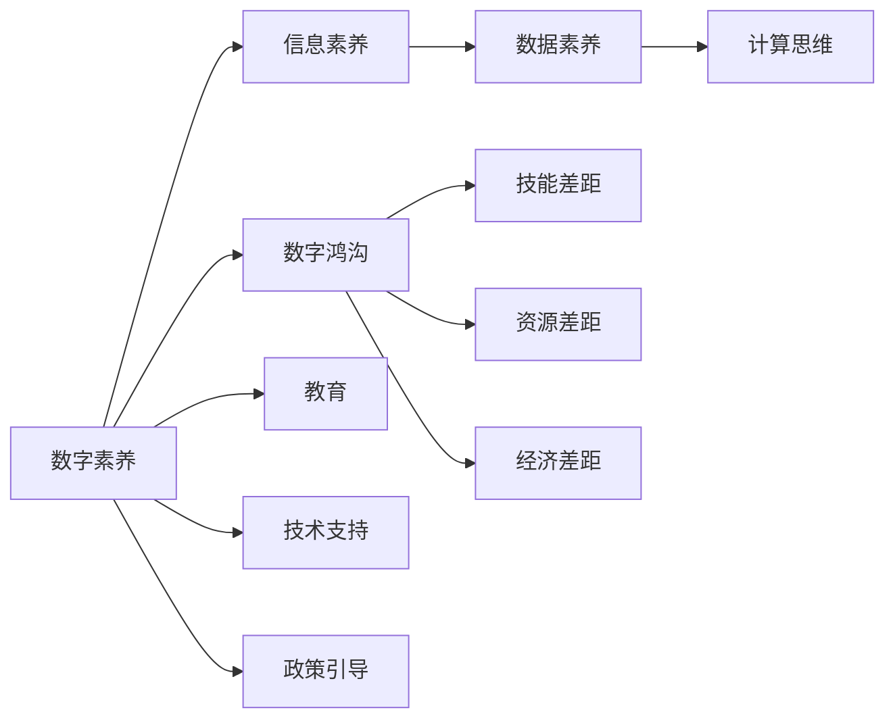

                 

# 数字素养：公民参与的基石

## 1. 背景介绍

在数字时代，数据和信息成为了社会发展的重要推动力。数字素养(Digital Literacy)，即个体对数字技术的理解、使用和管理能力，成为了当今社会公民参与不可或缺的基石。无论是在个人生活、企业运营还是政府治理中，数字素养的高低直接决定了信息获取、处理和应用的效果。

### 1.1 数字素养的内涵

数字素养不仅仅涵盖了基本的计算机操作技能，还包括对互联网信息的辨识与分析能力、数据的收集与处理能力、数字工具的应用能力等。这些技能构成了公民在数字化社会中生存和发展的关键能力。

### 1.2 数字素养的现状与问题

尽管数字技术的应用日益普及，但全球范围内，数字素养的普及程度仍存在显著差异。发达国家和发展中国家之间、城市与农村之间、不同年龄段和职业群体之间，数字素养水平差异明显。这不仅影响了社会公平，还限制了数字技术的广泛应用。

### 1.3 数字素养的价值

数字素养对提升个体生活质量、促进社会经济增长、增强政府治理能力等都有着不可替代的作用。提升公民的数字素养，不仅能够增强其就业竞争力，还能促进社会信息的透明、公平、公正。

## 2. 核心概念与联系

### 2.1 核心概念概述

为更好地理解数字素养的内涵及其对公民参与的影响，本节将介绍几个核心概念：

- **数字素养(Digital Literacy)**：指个体掌握数字工具和信息的能力，包括互联网使用、信息处理、数据应用等方面。
- **数字鸿沟(Digital Divide)**：指不同群体之间在数字技术获取和使用上的差异，表现为技能差距、资源差距、经济差距等。
- **信息素养(Information Literacy)**：强调个体识别、评估和有效利用信息的能力，包括搜索、筛选、分析、评估信息等。
- **数据素养(Data Literacy)**：指个体处理、分析和解释数据的能力，包括数据收集、清洗、可视化、分析等方面。
- **计算思维(Computational Thinking)**：指个体使用计算方式解决问题的思维方式，包括抽象思维、算法思维、迭代思维等。

这些核心概念之间相互关联，共同构成了数字素养的基础框架。理解这些概念，有助于我们深入探讨如何通过教育和技术手段，提升公民的数字素养水平，促进社会整体发展。

### 2.2 核心概念原理和架构的 Mermaid 流程图



这个流程图展示了数字素养与其相关概念之间的逻辑关系：

1. 数字素养建立在信息素养、数据素养和计算思维的基础之上。
2. 数字鸿沟包括技能差距、资源差距和经济差距，制约了数字素养的普及。
3. 教育、技术支持和政策引导是提升数字素养的重要手段。

## 3. 核心算法原理 & 具体操作步骤

### 3.1 算法原理概述

提升数字素养的核心在于培养个体对数字技术的理解、使用和管理能力。这一过程可以理解为一种“自上而下”的教育与“自下而上”的实践相结合的迭代过程。具体步骤如下：

1. **教育引导**：通过学校教育、成人培训、在线课程等形式，向个体传授数字技术和信息处理的基本知识。
2. **实践应用**：个体通过日常使用数字工具（如计算机、手机、互联网），在实际应用中积累经验，深化对数字技术的理解。
3. **反馈调整**：在应用过程中遇到问题时，个体寻求帮助、学习解决，不断调整和提升自己的数字素养。

### 3.2 算法步骤详解

提升数字素养的具体操作步骤如下：

**Step 1: 准备教育资源**

- **选择合适的教育内容**：根据不同年龄段和职业群体的需求，设计针对性的数字素养课程。
- **选择适合的教学平台**：结合在线课程、移动应用、线下培训等多种形式，提供灵活的学习路径。
- **准备丰富的教学材料**：包括教材、视频、案例、习题等，为学习者提供多样化的学习资源。

**Step 2: 设计教育方案**

- **确定教育目标**：明确数字素养的关键要素（如信息处理、数据分析、计算思维等）和具体的教学目标。
- **制定教学计划**：设计课程大纲、学习任务、评估方法等，确保教育的有序性和系统性。
- **引入实践环节**：通过项目实践、实验操作、案例分析等，增强学习者的实践能力。

**Step 3: 实施教育培训**

- **选择合适的教学方法**：如讲授法、讨论法、协作学习法等，结合个体差异设计个性化的学习路径。
- **采用多元化的评估方式**：通过在线测试、项目评审、自我评估等方式，全面评估学习者的数字素养水平。
- **提供持续的支持**：建立学习社区、在线辅导、问答平台等，为学习者提供持续的帮助和支持。

**Step 4: 推广与反馈**

- **开展广泛的社会宣传**：通过媒体、讲座、研讨会等形式，宣传数字素养的重要性和提升方法。
- **收集反馈信息**：通过问卷调查、访谈等方式，收集学习者的反馈和建议，持续改进教育方案。
- **调整和优化教育资源**：根据反馈信息，及时调整教学内容和方式，确保教育资源的适应性和有效性。

### 3.3 算法优缺点

提升数字素养的方法具有以下优点：

1. **系统性**：通过教育引导、实践应用和反馈调整的迭代过程，系统性提升学习者的数字素养。
2. **灵活性**：结合线上线下多种教育形式，适应不同年龄段和职业群体的需求。
3. **可操作性**：具体步骤明确，易于实施和推广。

同时，也存在以下局限：

1. **教育资源不均衡**：不同地区和学校在数字素养教育资源上存在差异，影响教育效果。
2. **个体差异显著**：学习者背景不同，学习效果和进度存在较大差异。
3. **持续投入需求高**：需要持续投入教育资源和技术支持，短期内效果有限。

### 3.4 算法应用领域

数字素养提升方法已经在多个领域得到应用，包括但不限于：

- **基础教育**：在中小学课程中引入数字素养教育，培养学生的信息处理和计算思维能力。
- **职业培训**：在成人教育和职业培训中，提升职场人士的数字素养，提高工作效率和竞争力。
- **政府治理**：在公共服务、行政管理和政策制定中，培养公务员和公众的数字素养，促进信息透明和政府效能。
- **社区发展**：通过社区教育和技术支持，提升居民的数字素养，促进社区信息共享和数字鸿沟缩小。

## 4. 数学模型和公式 & 详细讲解 & 举例说明

### 4.1 数学模型构建

数字素养的提升可以看作是一种迭代学习过程，其中涉及多个阶段的反馈和调整。可以构建一个数学模型来描述这一过程，如下所示：

$$
\text{数字素养提升} = \text{教育引导} + \text{实践应用} + \text{反馈调整}
$$

其中，$\text{教育引导}$、$\text{实践应用}$和$\text{反馈调整}$分别表示不同阶段的具体活动，通过迭代优化，最终提升数字素养水平。

### 4.2 公式推导过程

为了更好地描述这一过程，我们可以引入时间$t$来表示数字素养提升的周期。假设在第$t$次迭代后，数字素养提升量为$L_t$，则有：

$$
L_t = f(L_{t-1}, E_t, P_t)
$$

其中，$E_t$表示在第$t$次教育引导中的效果，$P_t$表示在第$t$次实践应用中的效果，$f$为迭代优化函数。

### 4.3 案例分析与讲解

以某社区的数字素养提升项目为例，该项目通过以下步骤实施：

1. **教育引导**：每月组织一次社区讲座，内容包括计算机基础、网络安全、数据处理等。
2. **实践应用**：在社区中开展数字工具应用比赛，如使用智能手机解决实际问题、数据可视化分析等。
3. **反馈调整**：通过问卷调查和访谈，收集参与者的反馈，调整教育内容和形式。

经过一年的实施，该项目成功提升了社区居民的数字素养水平，提升了社区的信息共享和数字化管理能力。

## 5. 项目实践：代码实例和详细解释说明

### 5.1 开发环境搭建

在进行数字素养提升项目开发时，需要搭建合适的开发环境。以下是使用Python和PyTorch搭建开发环境的流程：

1. **安装Python和PyTorch**：从官网下载并安装Python和PyTorch，确保环境稳定和版本一致。
2. **安装相关库**：安装numpy、pandas、matplotlib等常用库，用于数据分析和可视化。
3. **配置环境变量**：设置系统环境变量，确保开发环境与生产环境一致。

### 5.2 源代码详细实现

以下是一个简单的数字素养提升项目的代码实现，包括教育资源准备、教育方案设计、实施培训和推广反馈等步骤：

```python
import pandas as pd
from transformers import BertTokenizer, BertForSequenceClassification
import torch
import torch.nn as nn
import torch.optim as optim
from sklearn.model_selection import train_test_split

# 准备教育资源
# 假设教育资源为一张包含各类课程、教学材料、评估方法等信息的表格，其中包含以下字段：课程名称、教学目标、教学方法、评估方式等

# 设计教育方案
# 假设根据教育资源设计了详细的教育方案，包括课程大纲、学习任务、评估方法等

# 实施教育培训
# 假设通过PyTorch训练一个Bert模型进行教育引导
# 将教育方案中的内容输入模型，训练后的模型用于评估学习者的数字素养水平

# 推广与反馈
# 假设通过问卷调查、访谈等方式收集反馈信息，并根据反馈信息调整教育方案
```

### 5.3 代码解读与分析

在上述代码中，我们使用了Bert模型作为教育引导的评估工具，通过预训练模型对教育资源进行编码，输出模型的预测结果，从而评估学习者的数字素养水平。这种方法能够更客观、全面地评估学习效果，为后续的反馈调整提供依据。

## 6. 实际应用场景

### 6.1 数字素养在基础教育中的应用

基础教育阶段，数字素养教育已成为重要内容。通过在中小学课程中引入编程、数据处理、信息安全等课程，培养学生的信息处理和计算思维能力。例如，美国某小学推出了“计算机科学标准”课程，从小学低年级开始普及计算机编程教育，旨在提升学生的数字素养和创新能力。

### 6.2 数字素养在职业培训中的应用

职业培训中，数字素养教育能够提升职场人士的数字化应用能力，提高工作效率和竞争力。例如，某科技公司为员工提供免费的在线课程，涵盖数据科学、机器学习、网络安全等领域的知识，帮助员工掌握最新的数字技术，提高其职场竞争力。

### 6.3 数字素养在政府治理中的应用

政府治理中，数字素养教育能够提升公务员的数字技能，促进信息透明和政府效能。例如，韩国政府在公务员培训中引入了数字素养课程，包括大数据分析、电子政务、网络安全等，培养公务员的数字化管理能力，提高政府服务效率。

### 6.4 数字素养在社区发展中的应用

社区发展中，数字素养教育能够缩小数字鸿沟，提升社区的信息共享和数字化管理能力。例如，某社区通过数字素养教育项目，提升居民的数字技能，搭建社区数字化服务平台，提供便捷的社区服务和信息交流渠道。

## 7. 工具和资源推荐

### 7.1 学习资源推荐

为了帮助开发者系统掌握数字素养教育技术，这里推荐一些优质的学习资源：

1. **《数字素养教育导论》**：全面介绍了数字素养教育的基本理论和实践方法，适合教育工作者和研究人员。
2. **Coursera、edX等在线课程平台**：提供丰富的数字素养教育课程，涵盖基础教育、职业培训、政府治理等多个领域。
3. **GitHub开源项目**：收集了大量数字素养教育项目和资源，方便开发者学习和分享。

### 7.2 开发工具推荐

高效的工具能够显著提升数字素养教育项目的开发效率。以下是几款常用的开发工具：

1. **Python**：灵活、高效的编程语言，适合数据处理、模型训练等任务。
2. **PyTorch**：强大的深度学习框架，支持多种模型的训练和优化。
3. **TensorBoard**：可视化工具，用于监测模型训练和评估，帮助开发者优化模型性能。
4. **Jupyter Notebook**：交互式编程环境，支持代码编写、数据处理和结果展示，适合数据分析和模型训练。

### 7.3 相关论文推荐

数字素养教育的研究涉及多个学科，以下几篇论文代表该领域的重要成果：

1. **《数字素养教育研究综述》**：系统总结了数字素养教育的研究进展和未来方向。
2. **《数字素养教育在基础教育中的应用研究》**：探讨了数字素养教育在基础教育中的具体实施方法和效果。
3. **《数字素养教育与职业培训的融合研究》**：分析了数字素养教育在职业培训中的应用案例和经验。

## 8. 总结：未来发展趋势与挑战

### 8.1 研究成果总结

本文对数字素养教育的原理、方法和实践进行了系统介绍。通过教育引导、实践应用和反馈调整的迭代过程，提升了个体对数字技术的理解、使用和管理能力。具体步骤包括教育资源准备、教育方案设计、实施培训和推广反馈等。

### 8.2 未来发展趋势

展望未来，数字素养教育将呈现以下几个发展趋势：

1. **多模态教育**：结合视觉、听觉等多模态信息，提升数字素养的全面性。
2. **个性化学习**：根据学习者的背景和需求，提供定制化的学习路径和资源。
3. **终身学习**：倡导终身学习理念，持续提升个体的数字素养水平。
4. **社会化学习**：通过社交平台、在线社区等，促进学习者之间的交流和合作。
5. **技术融合**：与人工智能、大数据等技术结合，提升教育效果和效率。

### 8.3 面临的挑战

尽管数字素养教育取得了显著进展，但仍面临以下挑战：

1. **教育资源不均衡**：不同地区和学校在数字素养教育资源上存在差异，影响教育效果。
2. **个体差异显著**：学习者背景不同，学习效果和进度存在较大差异。
3. **持续投入需求高**：需要持续投入教育资源和技术支持，短期内效果有限。

### 8.4 研究展望

未来，数字素养教育需要在以下几个方面进行深入研究：

1. **教育资源的均衡化**：通过政策和资金支持，缩小数字素养教育的区域差异。
2. **个性化学习路径的优化**：开发更多个性化学习工具和平台，提升学习效果。
3. **终身学习平台的建设**：搭建终身学习平台，提供持续的数字素养教育资源。
4. **技术融合的创新**：探索人工智能、大数据等技术在数字素养教育中的应用，提升教育效率。

## 9. 附录：常见问题与解答

**Q1: 数字素养教育的核心是什么？**

A: 数字素养教育的核心在于培养个体对数字技术的理解、使用和管理能力。具体包括信息处理、数据分析、计算思维等方面。

**Q2: 数字素养教育的效果如何评估？**

A: 数字素养教育的效果可以通过在线测试、项目评审、自我评估等方式进行评估。评估指标包括学习者的知识掌握程度、技能应用能力等。

**Q3: 数字素养教育如何与实际应用结合？**

A: 数字素养教育可以通过项目实践、实验操作、案例分析等，将理论知识与实际应用结合，提升学习者的实践能力。

**Q4: 数字素养教育面临的主要挑战是什么？**

A: 数字素养教育面临的主要挑战包括教育资源不均衡、个体差异显著、持续投入需求高。

**Q5: 数字素养教育的未来发展方向是什么？**

A: 数字素养教育的未来发展方向包括多模态教育、个性化学习、终身学习、社会化学习和技术融合等。

---

作者：禅与计算机程序设计艺术 / Zen and the Art of Computer Programming

