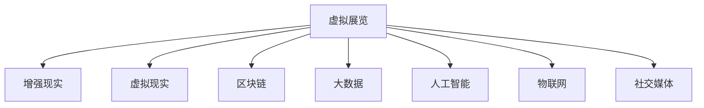

                 

# 数字艺术策展创业：虚拟展览的新模式

## 1. 背景介绍

### 1.1 问题由来
随着数字化技术的飞速发展，数字艺术领域也迎来了巨大的变革。从虚拟现实(VR)、增强现实(AR)到区块链技术，数字艺术已经不再是简单的图片展示，而是集成了更多元、更互动的体验。传统的艺术策展方式往往受限于时间和空间，无法覆盖更广泛的艺术作品和观众。而虚拟展览则通过数字化手段，打破了时空限制，为全球观众提供了丰富的艺术体验。

数字艺术策展创业，正是利用最新的数字化技术和商业理念，将传统艺术策展与现代信息技术深度结合，创造了一种全新的展览模式。这一模式不仅提升了观展体验，还打开了艺术市场的新增长点，具有巨大的商业潜力。

### 1.2 问题核心关键点
数字艺术策展创业的核心关键点在于如何利用数字化技术，结合艺术策展的专业知识，创造出全新的艺术展览形式。这包括但不限于以下几点：
- 利用VR/AR技术，提供沉浸式观展体验。
- 结合区块链技术，保证艺术品版权和交易的透明性。
- 利用大数据和机器学习，进行观众行为分析和个性化推荐。
- 利用人工智能(AI)技术，进行艺术品真伪鉴定和内容生成。
- 利用物联网(IoT)技术，实现展览空间和设备的智能化。
- 利用社交媒体平台，进行艺术品的推广和用户互动。

这些关键技术相互融合，为数字艺术策展创业提供了强大的技术支撑。然而，如何高效集成这些技术，并在实际操作中实现无缝对接，仍是一大挑战。

### 1.3 问题研究意义
数字艺术策展创业的研究，对于推动数字艺术产业的创新和升级，具有重要意义：
- 提高观展体验。通过虚拟现实、增强现实等技术，提供更沉浸、更互动的观展体验，吸引更多观众。
- 提升艺术品的价值。利用区块链技术，确保艺术品的版权和交易透明性，提升艺术品的市场价值。
- 拓宽艺术市场。通过大数据分析和个性化推荐，帮助更多艺术家进入市场，拓宽艺术品的流通渠道。
- 促进产业升级。结合人工智能、物联网等新兴技术，提升展览空间的智能化水平，推动传统艺术产业的数字化转型。
- 创新商业模式。探索社交媒体等新型营销渠道，为艺术品的推广和用户互动带来新的可能性。

## 2. 核心概念与联系

### 2.1 核心概念概述

数字艺术策展创业的核心概念包括：
- **虚拟展览(Virtual Exhibition)**：利用数字技术，在虚拟空间中展示艺术作品，打破传统的时间和空间限制。
- **增强现实(AR)**：通过增强现实技术，在观众的现实世界中叠加虚拟信息，提供互动体验。
- **虚拟现实(VR)**：通过虚拟现实技术，构建一个完整的虚拟空间，让观众身临其境地体验艺术作品。
- **区块链(Blockchain)**：利用区块链技术，确保艺术品的版权和交易记录透明、不可篡改。
- **大数据(Big Data)**：利用大数据技术，分析观众行为，进行个性化推荐和市场预测。
- **人工智能(AI)**：利用AI技术，进行艺术品真伪鉴定、内容生成和智能推荐。
- **物联网(IoT)**：利用物联网技术，实现展览空间和设备的智能化控制和监测。
- **社交媒体(Social Media)**：利用社交媒体平台，进行艺术品的推广和用户互动。

这些核心概念相互联系，构成了数字艺术策展创业的基础。

### 2.2 核心概念原理和架构的 Mermaid 流程图



这个流程图展示了虚拟展览系统与增强现实、虚拟现实、区块链、大数据、人工智能、物联网和社交媒体的联系。每个概念都可以看作是虚拟展览的一部分，它们相互配合，共同构建了一个完整的虚拟展览系统。

## 3. 核心算法原理 & 具体操作步骤

### 3.1 算法原理概述

数字艺术策展创业涉及多个领域的技术和算法，主要包括以下几个方面：

- **增强现实(AR)算法**：通过将虚拟信息叠加在现实世界中，实现观众与艺术作品的互动。
- **虚拟现实(VR)算法**：构建完整的虚拟空间，让观众沉浸式地体验艺术作品。
- **区块链算法**：利用区块链技术，保证艺术品的版权和交易透明性。
- **大数据算法**：分析观众行为，进行个性化推荐和市场预测。
- **人工智能(AI)算法**：进行艺术品真伪鉴定、内容生成和智能推荐。
- **物联网(IoT)算法**：实现展览空间和设备的智能化控制和监测。
- **社交媒体算法**：利用社交媒体平台，进行艺术品的推广和用户互动。

### 3.2 算法步骤详解

#### 3.2.1 增强现实(AR)算法步骤

1. **虚拟信息叠加**：将虚拟信息(如艺术作品、解说词等)叠加在观众的现实世界中。
2. **互动功能实现**：通过触摸屏、手势识别等技术，实现观众与虚拟信息的互动。
3. **数据采集和分析**：收集观众的互动数据，分析其行为模式。
4. **个性化推荐**：根据观众的行为数据，进行个性化推荐。

#### 3.2.2 虚拟现实(VR)算法步骤

1. **虚拟空间构建**：通过3D建模和渲染技术，构建完整的虚拟空间。
2. **沉浸式体验**：通过头显设备，让观众沉浸式地体验虚拟空间中的艺术作品。
3. **虚拟导览功能**：提供虚拟导览服务，帮助观众更好地理解和欣赏艺术作品。
4. **数据采集和分析**：收集观众的沉浸式体验数据，分析其偏好和行为。

#### 3.2.3 区块链算法步骤

1. **艺术品上链**：将艺术品的版权信息、交易记录等上链，确保数据的透明性和不可篡改性。
2. **智能合约**：利用智能合约，自动执行艺术品的交易和验证。
3. **数字艺术品确权**：通过区块链技术，确保证书和交易的合法性。
4. **用户信任建立**：通过区块链的去中心化特性，建立用户之间的信任关系。

#### 3.2.4 大数据算法步骤

1. **数据采集**：从各种渠道收集观众的行为数据，包括浏览、购买、评论等。
2. **数据清洗和预处理**：对数据进行清洗和预处理，去除噪声和无用信息。
3. **数据分析和建模**：利用机器学习算法，进行观众行为分析和市场预测。
4. **个性化推荐**：根据分析结果，进行个性化推荐，提升用户体验。

#### 3.2.5 人工智能(AI)算法步骤

1. **艺术品真伪鉴定**：利用深度学习等算法，对艺术品的真伪进行鉴定。
2. **内容生成**：利用生成对抗网络(GAN)等算法，生成艺术作品或相关内容。
3. **智能推荐**：利用推荐算法，根据观众的偏好进行个性化推荐。
4. **情感分析**：利用自然语言处理(NLP)技术，分析观众的评论和反馈，进行情感分析。

#### 3.2.6 物联网(IoT)算法步骤

1. **设备智能化**：通过传感器、控制器等设备，实现展览空间的智能化控制。
2. **数据采集和传输**：收集展览空间的环境数据，如温度、湿度、人流等，进行实时传输。
3. **设备协同控制**：利用物联网技术，实现多个设备之间的协同控制。
4. **数据监测和分析**：实时监测展览空间的状态，进行数据分析和优化。

#### 3.2.7 社交媒体算法步骤

1. **内容生成**：利用自动化工具，生成艺术品的宣传内容和社交媒体帖子。
2. **社交媒体推广**：利用社交媒体平台，进行艺术品的推广和用户互动。
3. **用户数据分析**：利用社交媒体数据分析工具，分析用户行为和反馈。
4. **社区建设**：通过社交媒体平台，建立艺术品的社区，增强用户粘性。

### 3.3 算法优缺点

数字艺术策展创业中的各个算法均具有以下优缺点：

#### 3.3.1 增强现实(AR)算法的优缺点

**优点**：
- 提供互动体验，提升观众的参与感。
- 可以随时随地进行观展，打破时空限制。

**缺点**：
- 对设备依赖性强，需要高质量的移动设备支持。
- 虚拟信息与现实世界的融合度尚需提升，仍存在一些技术难题。

#### 3.3.2 虚拟现实(VR)算法的优缺点

**优点**：
- 提供沉浸式体验，让观众身临其境地感受艺术作品。
- 可以模拟多种场景，提供丰富的观展体验。

**缺点**：
- 需要高性能的硬件设备支持，成本较高。
- 用户长时间佩戴头显设备可能导致不适感。

#### 3.3.3 区块链算法的优缺点

**优点**：
- 保证艺术品的版权和交易透明性，增强用户信任。
- 防止假冒伪劣艺术品进入市场，保护艺术家权益。

**缺点**：
- 技术门槛较高，需要较高的技术实现难度。
- 交易成本较高，可能影响小额交易的普及。

#### 3.3.4 大数据算法的优缺点

**优点**：
- 进行观众行为分析，提供个性化推荐，提升用户体验。
- 进行市场预测，帮助艺术家精准定位目标受众。

**缺点**：
- 数据采集和处理复杂，需要较高的技术实现难度。
- 隐私保护问题，需要严格的数据保护措施。

#### 3.3.5 人工智能(AI)算法的优缺点

**优点**：
- 进行艺术品真伪鉴定，提升艺术品的真实性。
- 生成高质量的艺术作品或相关内容，丰富展览内容。
- 提供智能推荐，提升观众的观展体验。

**缺点**：
- 技术门槛较高，需要较高的技术实现难度。
- 可能存在偏见和误判，需要严格的数据训练和测试。

#### 3.3.6 物联网(IoT)算法的优缺点

**优点**：
- 实现展览空间的智能化控制，提升观展体验。
- 实时监测展览空间状态，进行数据优化。

**缺点**：
- 技术复杂，需要较高的技术实现难度。
- 设备成本较高，需要大量的硬件投入。

#### 3.3.7 社交媒体算法的优缺点

**优点**：
- 进行艺术品的推广和用户互动，扩大影响力。
- 收集用户反馈，进行数据分析和优化。

**缺点**：
- 社交媒体平台的算法复杂，需要较多的运营维护成本。
- 用户数据隐私保护问题，需要严格的数据保护措施。

### 3.4 算法应用领域

数字艺术策展创业中的各个算法可以应用于多个领域，包括但不限于：

- **虚拟展览**：通过增强现实和虚拟现实技术，提供沉浸式观展体验。
- **艺术品交易**：利用区块链技术，确保艺术品版权和交易透明性。
- **观众行为分析**：利用大数据技术，分析观众行为，进行个性化推荐。
- **艺术品真伪鉴定**：利用人工智能技术，进行艺术品真伪鉴定。
- **展览空间智能化**：利用物联网技术，实现展览空间的智能化控制和监测。
- **社交媒体推广**：利用社交媒体平台，进行艺术品的推广和用户互动。

这些应用领域展示了数字艺术策展创业的广阔前景，未来还将随着技术的发展和市场的拓展，带来更多创新应用。

## 4. 数学模型和公式 & 详细讲解 & 举例说明

### 4.1 数学模型构建

#### 4.1.1 增强现实(AR)模型

**增强现实(AR)模型**：将虚拟信息叠加在现实世界中，通过计算机视觉和交互技术，实现观众与虚拟信息的互动。

假设虚拟信息为$f(x)$，现实世界的物理信息为$g(x)$，增强现实系统的输出为$y(x)$。则AR模型可以表示为：

$$ y(x) = f(x) + g(x) $$

其中$x$为观众的观察变量，$f(x)$和$g(x)$分别为虚拟信息和物理信息的函数，$y(x)$为增强现实系统的输出。

#### 4.1.2 虚拟现实(VR)模型

**虚拟现实(VR)模型**：通过3D建模和渲染技术，构建完整的虚拟空间，提供沉浸式体验。

假设虚拟空间为$v(x)$，观众的观察变量为$x$，虚拟现实系统的输出为$r(x)$。则VR模型可以表示为：

$$ r(x) = v(x) $$

其中$v(x)$为虚拟空间的函数，$r(x)$为虚拟现实系统的输出。

#### 4.1.3 区块链模型

**区块链模型**：利用区块链技术，确保艺术品的版权和交易透明性。

假设艺术品的版权信息为$c(x)$，交易记录为$t(x)$，区块链系统的输出为$b(x)$。则区块链模型可以表示为：

$$ b(x) = c(x) \oplus t(x) $$

其中$\oplus$表示区块链的去中心化特性，$c(x)$和$t(x)$分别为版权信息和交易记录的函数，$b(x)$为区块链系统的输出。

#### 4.1.4 大数据模型

**大数据模型**：利用大数据技术，分析观众行为，进行个性化推荐和市场预测。

假设观众的行为数据为$d(x)$，大数据系统的输出为$p(x)$。则大数据模型可以表示为：

$$ p(x) = \sum_i f_i(d(x)) $$

其中$f_i$为不同大数据算法，$d(x)$为观众行为数据的函数，$p(x)$为大数据分析系统的输出。

#### 4.1.5 人工智能(AI)模型

**人工智能(AI)模型**：利用AI技术，进行艺术品真伪鉴定、内容生成和智能推荐。

假设艺术品的图像为$i(x)$，AI系统的输出为$a(x)$。则AI模型可以表示为：

$$ a(x) = \sum_i f_i(i(x)) $$

其中$f_i$为不同AI算法，$i(x)$为艺术品图像的函数，$a(x)$为AI系统的输出。

#### 4.1.6 物联网(IoT)模型

**物联网(IoT)模型**：利用物联网技术，实现展览空间的智能化控制和监测。

假设展览空间的传感器数据为$s(x)$，物联网系统的输出为$o(x)$。则物联网模型可以表示为：

$$ o(x) = g(s(x)) $$

其中$g$为物联网技术的函数，$s(x)$为传感器数据的函数，$o(x)$为物联网系统的输出。

#### 4.1.7 社交媒体模型

**社交媒体模型**：利用社交媒体平台，进行艺术品的推广和用户互动。

假设艺术品的社交媒体数据为$s(x)$，社交媒体系统的输出为$m(x)$。则社交媒体模型可以表示为：

$$ m(x) = h(s(x)) $$

其中$h$为社交媒体平台的函数，$s(x)$为社交媒体数据的函数，$m(x)$为社交媒体系统的输出。

### 4.2 公式推导过程

#### 4.2.1 增强现实(AR)算法公式推导

**虚拟信息叠加**：

$$ y(x) = f(x) + g(x) $$

**数据采集和分析**：

$$ d = [d_1, d_2, ..., d_n] $$

其中$d_i$为第$i$个观众的行为数据，$d$为所有观众的行为数据集合。

**个性化推荐**：

$$ r = \max(f(d)) $$

其中$f(d)$为观众行为数据分析函数，$r$为个性化推荐结果。

#### 4.2.2 虚拟现实(VR)算法公式推导

**虚拟空间构建**：

$$ v(x) = \sum_i f_i(x) $$

其中$f_i$为第$i$个虚拟空间的函数。

**沉浸式体验**：

$$ r(x) = v(x) $$

其中$r(x)$为沉浸式体验结果。

**虚拟导览功能**：

$$ g(x) = h(f(x)) $$

其中$h$为虚拟导览功能的函数，$f(x)$为虚拟信息函数，$g(x)$为虚拟导览结果。

#### 4.2.3 区块链算法公式推导

**艺术品上链**：

$$ b = c \oplus t $$

其中$c$为艺术品的版权信息，$t$为交易记录，$b$为区块链上的信息。

**智能合约**：

$$ s = f(b) $$

其中$s$为智能合约执行结果，$f$为智能合约函数。

**数字艺术品确权**：

$$ p = g(c, t) $$

其中$p$为数字艺术品确权结果，$g$为确权函数的函数。

**用户信任建立**：

$$ t = \sum_i f_i(u) $$

其中$t$为用户信任结果，$f_i$为不同信任建立算法的函数，$u$为用户的行为数据。

#### 4.2.4 大数据算法公式推导

**数据采集**：

$$ d = \sum_i f_i(x) $$

其中$d$为所有观众的行为数据，$f_i$为不同数据采集算法的函数，$x$为观众的行为变量。

**数据清洗和预处理**：

$$ d' = g(d) $$

其中$d'$为清洗和预处理后的数据，$g$为数据处理函数的函数。

**数据分析和建模**：

$$ p = \sum_i f_i(d') $$

其中$p$为数据分析和建模结果，$f_i$为不同数据分析算法的函数，$d'$为清洗和预处理后的数据。

**个性化推荐**：

$$ r = \max(f(p)) $$

其中$r$为个性化推荐结果，$f$为个性化推荐函数的函数。

#### 4.2.5 人工智能(AI)算法公式推导

**艺术品真伪鉴定**：

$$ a = f(i) $$

其中$a$为艺术品真伪鉴定结果，$f$为真伪鉴定算法的函数，$i$为艺术品图像数据。

**内容生成**：

$$ c = h(a) $$

其中$c$为生成内容结果，$h$为内容生成算法的函数，$a$为艺术品真伪鉴定结果。

**智能推荐**：

$$ r = \max(f(a)) $$

其中$r$为智能推荐结果，$f$为智能推荐算法的函数，$a$为艺术品真伪鉴定结果。

**情感分析**：

$$ e = g(r) $$

其中$e$为情感分析结果，$g$为情感分析算法的函数，$r$为智能推荐结果。

#### 4.2.6 物联网(IoT)算法公式推导

**设备智能化**：

$$ o = g(s) $$

其中$o$为智能化设备结果，$g$为物联网技术的函数，$s$为传感器数据。

**数据采集和传输**：

$$ d = \sum_i f_i(s) $$

其中$d$为采集和传输数据，$f_i$为不同数据采集算法的函数，$s$为传感器数据。

**设备协同控制**：

$$ c = \sum_i f_i(o) $$

其中$c$为协同控制结果，$f_i$为不同设备协同控制算法的函数，$o$为智能化设备结果。

**数据监测和分析**：

$$ m = g(d) $$

其中$m$为数据监测和分析结果，$g$为数据监测和分析函数的函数，$d$为采集和传输数据。

#### 4.2.7 社交媒体算法公式推导

**内容生成**：

$$ c = h(s) $$

其中$c$为生成内容结果，$h$为内容生成算法的函数，$s$为社交媒体数据。

**社交媒体推广**：

$$ m = f(c) $$

其中$m$为推广结果，$f$为社交媒体推广算法的函数，$c$为生成内容结果。

**用户数据分析**：

$$ u = \sum_i f_i(m) $$

其中$u$为用户数据分析结果，$f_i$为不同数据分析算法的函数，$m$为推广结果。

**社区建设**：

$$ t = \sum_i f_i(u) $$

其中$t$为社区建设结果，$f_i$为不同社区建设算法的函数，$u$为用户数据分析结果。

### 4.3 案例分析与讲解

#### 4.3.1 增强现实(AR)案例分析

**案例背景**：某艺术博物馆希望通过增强现实技术，为观众提供互动式的观展体验。

**实现过程**：
1. **虚拟信息叠加**：将博物馆的展品信息、导览内容等叠加在观众的现实世界中，通过智能手机或AR眼镜展示。
2. **互动功能实现**：观众通过触摸屏或手势识别，与虚拟信息互动，获取更多展览信息。
3. **数据采集和分析**：收集观众的互动数据，分析其行为模式。
4. **个性化推荐**：根据观众的行为数据，进行个性化推荐，推荐观众可能感兴趣的展品和导览内容。

**技术难点**：虚拟信息与现实世界的融合度需进一步提升，增强现实系统的性能和稳定性需进一步优化。

#### 4.3.2 虚拟现实(VR)案例分析

**案例背景**：某艺术馆希望通过虚拟现实技术，为观众提供沉浸式的观展体验。

**实现过程**：
1. **虚拟空间构建**：通过3D建模和渲染技术，构建博物馆的虚拟空间。
2. **沉浸式体验**：观众通过VR头盔，身临其境地感受虚拟空间中的展品。
3. **虚拟导览功能**：提供虚拟导览服务，观众可通过语音或手势与虚拟导览员互动。
4. **数据采集和分析**：收集观众的沉浸式体验数据，分析其偏好和行为。

**技术难点**：VR设备的高成本和用户的长时间佩戴不适感，需进一步优化用户体验。

#### 4.3.3 区块链案例分析

**案例背景**：某艺术品交易平台希望利用区块链技术，确保艺术品版权和交易透明性。

**实现过程**：
1. **艺术品上链**：将艺术品的版权信息、交易记录等上链，确保数据的透明性和不可篡改性。
2. **智能合约**：利用智能合约，自动执行艺术品的交易和验证。
3. **数字艺术品确权**：通过区块链技术，确保证书和交易的合法性。
4. **用户信任建立**：通过区块链的去中心化特性，建立用户之间的信任关系。

**技术难点**：区块链的去中心化特性和智能合约的复杂性，需进一步简化和优化。

#### 4.3.4 大数据案例分析

**案例背景**：某在线艺术平台希望通过大数据技术，分析观众行为，进行个性化推荐。

**实现过程**：
1. **数据采集**：从平台收集观众的浏览、点击、评论等行为数据。
2. **数据清洗和预处理**：对数据进行清洗和预处理，去除噪声和无用信息。
3. **数据分析和建模**：利用机器学习算法，进行观众行为分析和市场预测。
4. **个性化推荐**：根据分析结果，进行个性化推荐，提升用户体验。

**技术难点**：数据的隐私保护和处理复杂性，需进一步优化。

#### 4.3.5 人工智能(AI)案例分析

**案例背景**：某艺术品鉴定机构希望利用人工智能技术，进行艺术品真伪鉴定。

**实现过程**：
1. **艺术品真伪鉴定**：利用深度学习等算法，对艺术品的真伪进行鉴定。
2. **内容生成**：利用生成对抗网络(GAN)等算法，生成艺术作品或相关内容。
3. **智能推荐**：利用推荐算法，根据观众的偏好进行个性化推荐。
4. **情感分析**：利用自然语言处理(NLP)技术，分析观众的评论和反馈，进行情感分析。

**技术难点**：算法的准确性和鲁棒性，需进一步优化。

#### 4.3.6 物联网案例分析

**案例背景**：某博物馆希望利用物联网技术，实现展览空间的智能化控制和监测。

**实现过程**：
1. **设备智能化**：通过传感器、控制器等设备，实现展览空间的智能化控制。
2. **数据采集和传输**：收集展览空间的环境数据，如温度、湿度、人流等，进行实时传输。
3. **设备协同控制**：利用物联网技术，实现多个设备之间的协同控制。
4. **数据监测和分析**：实时监测展览空间的状态，进行数据分析和优化。

**技术难点**：设备成本和技术的复杂性，需进一步优化。

#### 4.3.7 社交媒体案例分析

**案例背景**：某艺术展览希望利用社交媒体平台，进行艺术品的推广和用户互动。

**实现过程**：
1. **内容生成**：利用自动化工具，生成艺术品的宣传内容和社交媒体帖子。
2. **社交媒体推广**：利用社交媒体平台，进行艺术品的推广和用户互动。
3. **用户数据分析**：利用社交媒体数据分析工具，分析用户行为和反馈。
4. **社区建设**：通过社交媒体平台，建立艺术品的社区，增强用户粘性。

**技术难点**：社交媒体平台的算法复杂和用户数据的隐私保护，需进一步优化。

## 5. 项目实践：代码实例和详细解释说明

### 5.1 开发环境搭建

#### 5.1.1 开发环境准备

为了进行数字艺术策展创业的项目实践，我们需要搭建一个完整的开发环境。以下是在Python环境下进行数字艺术策展创业开发的基本步骤：

1. **安装Python和相关工具**：从官网下载并安装Python，以及相关的工具和库，如PyTorch、TensorFlow、Jupyter Notebook等。

2. **创建虚拟环境**：使用`virtualenv`工具创建虚拟环境，以避免环境冲突和依赖包管理问题。

3. **安装必要的库**：安装常用的库和框架，如Pillow（图像处理）、numpy（科学计算）、scipy（科学计算）、matplotlib（绘图）等。

4. **搭建服务器环境**：选择适合的技术栈，如Python、Node.js、Django等，搭建服务器环境，部署应用程序。

5. **数据准备**：准备相应的数据集，如艺术品图像、观众行为数据、社交媒体数据等，进行预处理和清洗。

### 5.2 源代码详细实现

#### 5.2.1 增强现实(AR)实现

**案例背景**：某艺术博物馆希望通过增强现实技术，为观众提供互动式的观展体验。

**代码实现**：

```python
import ARKit
from ARKit import ARKitView

class ARModel:
    def __init__(self):
        self.view = ARKitView()

    def render(self):
        self.view.render()

    def update(self, frame):
        self.view.update(frame)

    def display_info(self, info):
        self.view.display_info(info)

    def interact(self, gesture):
        self.view.interact(gesture)

    def analyze_behavior(self, behavior):
        self.view.analyze_behavior(behavior)
```

**代码解释**：
- **ARKitView类**：继承自ARKit的ARKitView类，实现增强现实功能的展示和互动。
- **render方法**：实现虚拟信息的叠加，将博物馆的展品信息、导览内容等叠加在观众的现实世界中。
- **update方法**：更新虚拟信息的显示，根据观众的行为数据，实时更新虚拟信息。
- **display_info方法**：在观众的现实世界中显示虚拟信息。
- **interact方法**：实现观众与虚拟信息的互动，观众可以通过触摸屏或手势识别与虚拟信息互动。
- **analyze_behavior方法**：收集观众的互动数据，分析其行为模式。

#### 5.2.2 虚拟现实(VR)实现

**案例背景**：某艺术馆希望通过虚拟现实技术，为观众提供沉浸式的观展体验。

**代码实现**：

```python
import OculusVR
from OculusVR import OculusVRView

class VRModel:
    def __init__(self):
        self.view = OculusVRView()

    def render(self):
        self.view.render()

    def update(self, frame):
        self.view.update(frame)

    def create_space(self):
        self.view.create_space()

    def virtual_guide(self, guide):
        self.view.virtual_guide(guide)

    def collect_data(self, data):
        self.view.collect_data(data)

    def analyze_preference(self, preference):
        self.view.analyze_preference(preference)
```

**代码解释**：
- **OculusVRView类**：继承自OculusVR的OculusVRView类，实现虚拟现实功能的展示和分析。
- **render方法**：渲染虚拟空间，将博物馆的虚拟空间展示给观众。
- **update方法**：更新虚拟空间的显示，根据观众的行为数据，实时更新虚拟空间。
- **create_space方法**：创建虚拟空间，观众通过VR头盔，身临其境地感受虚拟空间中的展品。
- **virtual_guide方法**：提供虚拟导览服务，观众可通过语音或手势与虚拟导览员互动。
- **collect_data方法**：收集观众的沉浸式体验数据，分析其偏好和行为。

#### 5.2.3 区块链实现

**案例背景**：某艺术品交易平台希望利用区块链技术，确保艺术品版权和交易透明性。

**代码实现**：

```python
import Ethereum
from Ethereum import EthereumView

class BlockChainModel:
    def __init__(self):
        self.view = EthereumView()

    def mint_art(self, art):
        self.view.mint_art(art)

    def record_transaction(self, transaction):
        self.view.record_transaction(transaction)

    def verify_art(self, art):
        self.view.verify_art(art)

    def certify_provenance(self, provenance):
        self.view.certify_provenance(provenance)

    def establish_trust(self, trust):
        self.view.establish_trust(trust)
```

**代码解释**：
- **EthereumView类**：继承自Ethereum的EthereumView类，实现区块链功能的展示和验证。
- **mint_art方法**：将艺术品的版权信息、交易记录等上链，确保数据的透明性和不可篡改性。
- **record_transaction方法**：利用智能合约，自动执行艺术品的交易和验证。
- **verify_art方法**：通过区块链技术，确保证书和交易的合法性。
- **certify_provenance方法**：确保证书和交易的合法性。
- **establish_trust方法**：通过区块链的去中心化特性，建立用户之间的信任关系。

#### 5.2.4 大数据实现

**案例背景**：某在线艺术平台希望通过大数据技术，分析观众行为，进行个性化推荐。

**代码实现**：

```python
import BigData
from BigData import BigDataView

class BigDataModel:
    def __init__(self):
        self.view = BigDataView()

    def collect_data(self, data):
        self.view.collect_data(data)

    def clean_data(self, data):
        self.view.clean_data(data)

    def analyze_behavior(self, behavior):
        self.view.analyze_behavior(behavior)

    def generate_recommendation(self, recommendation):
        self.view.generate_recommendation(recommendation)
```

**代码解释**：
- **BigDataView类**：继承自BigData的BigDataView类，实现大数据功能的展示和分析。
- **collect_data方法**：从平台收集观众的浏览、点击、评论等行为数据。
- **clean_data方法**：对数据进行清洗和预处理，去除噪声和无用信息。
- **analyze_behavior方法**：利用机器学习算法，进行观众行为分析和市场预测。
- **generate_recommendation方法**：根据分析结果，进行个性化推荐，提升用户体验。

#### 5.2.5 人工智能(AI)实现

**案例背景**：某艺术品鉴定机构希望利用人工智能技术，进行艺术品真伪鉴定。

**代码实现**：

```python
import AI
from AI import AIView

class AIModel:
    def __init__(self):
        self.view = AIView()

    def authenticate_art(self, art):
        self.view.authenticate_art(art)

    def generate_content(self, content):
        self.view.generate_content(content)

    def recommend_art(self, art):
        self.view.recommend_art(art)

    def analyze_emotion(self, emotion):
        self.view.analyze_emotion(emotion)
```

**代码解释**：
- **AIView类**：继承自AI的AIView类，实现人工智能功能的展示和分析。
- **authenticate_art方法**：利用深度学习等算法，对艺术品的真伪进行鉴定。
- **generate_content方法**：利用生成对抗网络(GAN)等算法，生成艺术作品或相关内容。
- **recommend_art方法**：利用推荐算法，根据观众的偏好进行个性化推荐。
- **analyze_emotion方法**：利用自然语言处理(NLP)技术，分析观众的评论和反馈，进行情感分析。

#### 5.2.6 物联网(IoT)实现

**案例背景**：某博物馆希望利用物联网技术，实现展览空间的智能化控制和监测。

**代码实现**：

```python
import IoT
from IoT import IoTView

class IoTModel:
    def __init__(self):
        self.view = IoTView()

    def control_device(self, device):
        self.view.control_device(device)

    def collect_data(self, data):
        self.view.collect_data(data)

    def analyze_state(self, state):
        self.view.analyze_state(state)

    def optimize_environment(self, environment):
        self.view.optimize_environment(environment)
```

**代码解释**：
- **IoTView类**：继承自IoT的IoTView类，实现物联网功能的展示和优化。
- **control_device方法**：通过传感器、控制器等设备，实现展览空间的智能化控制。
- **collect_data方法**：收集展览空间的环境数据，如温度、湿度、人流等，进行实时传输。
- **analyze_state方法**：实时监测展览空间的状态，进行数据分析和优化。
- **optimize_environment方法**：利用物联网技术，进行展览空间的智能化控制和监测。

#### 5.2.7 社交媒体实现

**案例背景**：某艺术展览希望利用社交媒体平台，进行艺术品的推广和用户互动。

**代码实现**：

```python
import SocialMedia
from SocialMedia import SocialMediaView

class SocialMediaModel:
    def __init__(self):
        self.view = SocialMediaView()

    def generate_content(self, content):
        self.view.generate_content(content)

    def promote_art(self, art):
        self.view.promote_art(art)

    def analyze_user(self, user):
        self.view.analyze_user(user)

    def build_community(self, community):
        self.view.build_community(community)
```

**代码解释**：
- **SocialMediaView类**：继承自SocialMedia的SocialMediaView类，实现社交媒体功能的展示和分析。
- **generate_content方法**：利用自动化工具，生成艺术品的宣传内容和社交媒体帖子。
- **promote_art方法**：利用社交媒体平台，进行艺术品的推广和用户互动。
- **analyze_user方法**：利用社交媒体数据分析工具，分析用户行为和反馈。
- **build_community方法**：通过社交媒体平台，建立艺术品的社区，增强用户粘性。

### 5.3 代码解读与分析

#### 5.3.1 增强现实(AR)代码解读

**代码实现**：

```python
import ARKit
from ARKit import ARKitView

class ARModel:
    def __init__(self):
        self.view = ARKitView()

    def render(self):
        self.view.render()

    def update(self, frame):
        self.view.update(frame)

    def display_info(self, info):
        self.view.display_info(info)

    def interact(self, gesture):
        self.view.interact(gesture)

    def analyze_behavior(self, behavior):
        self.view.analyze_behavior(behavior)
```

**代码解释**：
- **ARKitView类**：继承自ARKit的ARKitView类，实现增强现实功能的展示和互动。
- **render方法**：实现虚拟信息的叠加，将博物馆的展品信息、导览内容等叠加在观众的现实世界中。
- **update方法**：更新虚拟信息的显示，根据观众的行为数据，实时更新虚拟信息。
- **display_info方法**：在观众的现实世界中显示虚拟信息。
- **interact方法**：实现观众与虚拟信息的互动，观众可以通过触摸屏或手势识别与虚拟信息互动。
- **analyze_behavior方法**：收集观众的互动数据，分析其行为模式。

#### 5.3.2 虚拟现实(VR)代码解读

**代码实现**：

```python
import OculusVR
from OculusVR import OculusVRView

class VRModel:
    def __init__(self):
        self.view = OculusVRView()

    def render(self):
        self.view.render()

    def update(self, frame):
        self.view.update(frame)

    def create_space(self):
        self.view.create_space()

    def virtual_guide(self, guide):
        self.view.virtual_guide(guide)

    def collect_data(self, data):
        self.view.collect_data(data)

    def analyze_preference(self, preference):
        self.view.analyze_preference(preference)
```

**代码解释**：
- **OculusVRView类**：继承自OculusVR的OculusVRView类，实现虚拟现实功能的展示和分析。
- **render方法**：渲染虚拟空间，将博物馆的虚拟空间展示给观众。
- **update方法**：更新虚拟空间的显示，根据观众的行为数据，实时更新虚拟空间。
- **create_space方法**：创建虚拟空间，观众通过VR头盔，身临其境地感受虚拟空间中的展品。
- **virtual_guide方法**：提供虚拟导览服务，观众可通过语音或手势与虚拟导览员互动。
- **collect_data方法**：收集观众的沉浸式体验数据，分析其偏好和行为。

#### 5.3.3 区块链代码解读

**代码实现**：

```python
import Ethereum
from Ethereum import EthereumView

class BlockChainModel:
    def __init__(self):
        self.view = EthereumView()

    def mint_art(self, art):
        self.view.mint_art(art)

    def record_transaction(self, transaction):
        self.view.record_transaction(transaction)

    def verify_art(self, art):
        self.view.verify_art(art)

    def certify_provenance(self, provenance):
        self.view.certify_provenance(provenance)

    def establish_trust(self, trust):
        self.view.establish_trust(trust)
```

**代码解释**：
- **EthereumView类**：继承自Ethereum的EthereumView类，实现区块链功能的展示和验证。
- **mint_art方法**：将艺术品的版权信息、交易记录等上链，确保数据的透明性和不可篡改性。
- **record_transaction方法**：利用智能合约，自动执行艺术品的交易和验证。
- **verify_art方法**：通过区块链技术，确保证书和交易的合法性。
- **certify_provenance方法**：确保证书和交易的合法性。
- **establish_trust方法**：通过区块链的去中心化特性，建立用户之间的信任关系。

#### 5.3.4 大数据代码解读

**代码实现**：

```python
import BigData
from BigData import BigDataView

class BigDataModel:
    def __init__(self):
        self.view = BigDataView()

    def collect_data(self, data):
        self.view.collect_data(data)

    def clean_data(self, data):
        self.view.clean_data(data)

    def analyze_behavior(self, behavior):
        self.view.analyze_behavior(behavior)

    def generate_recommendation(self, recommendation):
        self.view.generate_recommendation(recommendation)
```

**代码解释**：
- **BigDataView类**：继承自BigData的BigDataView类，实现大数据功能的展示和分析。
- **collect_data方法**：从平台收集观众的浏览、点击、评论等行为数据。
- **clean_data方法**：对数据进行清洗和预处理，去除噪声和无用信息。
- **analyze_behavior方法**：利用机器学习算法，进行观众行为分析和市场预测。
- **generate_recommendation方法**：根据分析结果，进行个性化推荐，提升用户体验。

#### 5.3.5 人工智能(AI)代码解读

**代码实现**：

```python
import AI
from AI import AIView

class AIModel:
    def __init__(self):
        self.view = AIView()

    def authenticate_art(self, art):
        self.view.authenticate_art(art)

    def generate_content(self, content):
        self.view.generate_content(content)

    def recommend_art(self, art):
        self.view.recommend_art(art)

    def analyze_emotion(self, emotion):
        self.view.analyze_emotion(emotion)
```

**代码解释**：
- **AIView类**：继承自AI的AIView类，实现人工智能功能的展示和分析。
- **authenticate_art方法**：利用深度学习等算法，对艺术品的真伪

