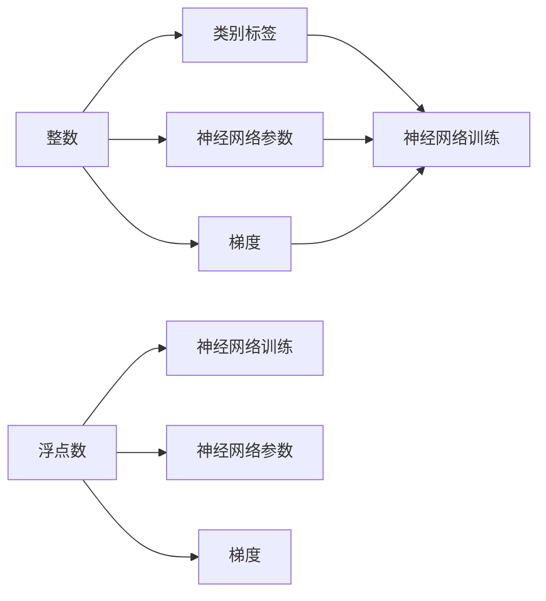

                 

## 1. 背景介绍

神经网络是现代机器学习与深度学习的基石，广泛应用于图像识别、自然语言处理、语音识别等领域。在神经网络中，数据是最基本的输入，数据的种类、格式、特征等对模型的训练效果有着直接的影响。其中，整数和浮点数是神经网络中最常见的数据类型，理解整数和浮点数的性质及其在神经网络中的应用，对构建高效、稳定的神经网络至关重要。

## 2. 核心概念与联系

### 2.1 核心概念概述

#### 2.1.1 整数和浮点数

- **整数**：整数是一类有限、离散的数值，表示没有小数部分的数。在计算机中，整数通常用二进制补码形式表示。
- **浮点数**：浮点数是一类有限、连续的数值，表示有小数部分的数。在计算机中，浮点数通常用科学计数法表示，分为单精度浮点数和双精度浮点数两种。

#### 2.1.2 神经网络中的数据处理

神经网络中的数据处理包括数据的表示、编码、归一化、标准化等步骤。这些处理步骤对神经网络的性能、训练速度和稳定性有着重要影响。

#### 2.1.3 整数和浮点数的应用

在神经网络中，整数和浮点数分别用于表示类别标签、参数、梯度等数据。整数和浮点数的不同特性，决定了它们在神经网络中的不同应用场景。

### 2.2 核心概念原理和架构的 Mermaid 流程图



## 3. 核心算法原理 & 具体操作步骤

### 3.1 算法原理概述

#### 3.1.1 整数和浮点数的表示

在计算机中，整数和浮点数分别使用不同的编码方式表示。

- **整数**：常用的编码方式包括原码、补码、反码等。其中，补码因其在加法和减法中的优良性质，成为现代计算机中整数表示的标准。
- **浮点数**：浮点数使用科学计数法表示，分为单精度浮点数和双精度浮点数两种。单精度浮点数通常使用32位表示，双精度浮点数使用64位表示。

#### 3.1.2 神经网络中的数据表示

神经网络中的数据表示包括类别标签、神经网络参数、梯度等。

- **类别标签**：整数常用于表示类别标签，每个标签用一个唯一的整数表示。
- **神经网络参数**：浮点数常用于表示神经网络中的权重、偏置等参数。
- **梯度**：浮点数常用于表示神经网络中的梯度，用于优化算法的计算。

### 3.2 算法步骤详解

#### 3.2.1 数据预处理

在神经网络训练前，需要对数据进行预处理，包括数据的归一化、标准化、编码等。

1. **归一化**：将数据缩放到一定范围内，如将数据缩放到[-1,1]之间。
2. **标准化**：将数据转换为均值为0、方差为1的分布，如使用Z-score标准化。
3. **编码**：将类别标签等非数值数据转换为数值数据，如使用独热编码（one-hot encoding）。

#### 3.2.2 数据存储

神经网络中，数据通常存储在GPU或CPU的存储器中。为了提高存储效率和访问速度，数据通常采用特定的格式存储，如张量（tensor）格式。

- **整数数据**：存储在整数数组中，每个元素表示一个整数。
- **浮点数数据**：存储在浮点数数组中，每个元素表示一个浮点数。

#### 3.2.3 数据计算

在神经网络中，数据计算包括前向传播和反向传播两个过程。

1. **前向传播**：输入数据通过神经网络进行计算，得到输出结果。
2. **反向传播**：计算神经网络中的梯度，用于更新网络参数。

### 3.3 算法优缺点

#### 3.3.1 整数

- **优点**：整数表示简单，占用存储空间小，计算速度快。
- **缺点**：整数表示范围有限，无法表示连续数值，不适用于某些应用场景。

#### 3.3.2 浮点数

- **优点**：浮点数表示连续数值，适用范围广，精度高。
- **缺点**：浮点数占用存储空间大，计算速度慢，存在精度问题。

#### 3.3.3 神经网络中的数据处理

- **优点**：整数和浮点数的不同特性，使神经网络能够处理不同类型的数据，具有广泛的适用性。
- **缺点**：数据处理不当，会导致模型性能下降，甚至无法收敛。

### 3.4 算法应用领域

#### 3.4.1 图像处理

- **整数**：常用于表示图像中的像素值。
- **浮点数**：常用于表示神经网络中的权重、偏置、梯度等参数。

#### 3.4.2 自然语言处理

- **整数**：常用于表示类别标签，如情感分类中的正面、负面标签。
- **浮点数**：常用于表示神经网络中的权重、偏置、梯度等参数。

#### 3.4.3 语音识别

- **整数**：常用于表示音频信号的采样值。
- **浮点数**：常用于表示神经网络中的权重、偏置、梯度等参数。

## 4. 数学模型和公式 & 详细讲解 & 举例说明

### 4.1 数学模型构建

#### 4.1.1 整数和浮点数的数学表示

- **整数**：$x = \sum_{i=0}^{n-1} a_i 2^i$
- **浮点数**：$x = m \times 2^{e-127}$
  - $m$ 表示尾数部分
  - $e$ 表示指数部分

#### 4.1.2 神经网络中的数学模型

神经网络可以表示为一个非线性函数，通常使用矩阵乘法进行计算。

- **前向传播**：$y = Wx + b$
- **反向传播**：$\Delta W = \frac{\partial L}{\partial W}, \Delta b = \frac{\partial L}{\partial b}$

### 4.2 公式推导过程

#### 4.2.1 整数运算

- **加法**：$a + b = \sum_{i=0}^{n-1} (a_i + b_i) 2^i$
- **减法**：$a - b = \sum_{i=0}^{n-1} (a_i - b_i) 2^i$
- **乘法**：$a \times b = \sum_{i=0}^{n-1} \sum_{j=0}^{m-1} a_i b_j 2^{i+j}$

#### 4.2.2 浮点数运算

- **加法**：$a + b = (m_a + m_b) \times 2^{e_a + e_b - 127}$
- **减法**：$a - b = (m_a - m_b) \times 2^{e_a - e_b}$
- **乘法**：$a \times b = (m_a \times m_b) \times 2^{e_a + e_b - 127}$
- **除法**：$a / b = (m_a / m_b) \times 2^{e_a - e_b}$

### 4.3 案例分析与讲解

#### 4.3.1 图像分类任务

假设有一个图像分类任务，输入是一张28x28的灰度图像，输出是10个类别中的一个。

- **数据表示**：整数表示像素值，浮点数表示神经网络参数和梯度。
- **数据预处理**：将图像进行归一化、标准化处理。
- **模型结构**：卷积神经网络（CNN）。
- **数据计算**：使用前向传播和反向传播计算神经网络中的梯度。

#### 4.3.2 自然语言处理任务

假设有一个情感分类任务，输入是一段文本，输出是正面或负面情感。

- **数据表示**：整数表示类别标签，浮点数表示神经网络参数和梯度。
- **数据预处理**：将文本进行词向量化处理，转换为浮点数向量。
- **模型结构**：循环神经网络（RNN）。
- **数据计算**：使用前向传播和反向传播计算神经网络中的梯度。

## 5. 项目实践：代码实例和详细解释说明

### 5.1 开发环境搭建

为了进行神经网络的开发和训练，需要搭建相应的开发环境。

- **Python**：选择Python作为编程语言，使用Anaconda环境管理。
- **深度学习框架**：选择TensorFlow或PyTorch，用于神经网络的构建和训练。
- **GPU硬件**：使用NVIDIA GPU，提高计算速度。

### 5.2 源代码详细实现

#### 5.2.1 整数数据处理

```python
import numpy as np

# 整数数据
x = np.array([1, 2, 3, 4])
y = np.array([5, 6, 7, 8])

# 加法
result = x + y
print(result)

# 减法
result = x - y
print(result)

# 乘法
result = x * y
print(result)
```

#### 5.2.2 浮点数数据处理

```python
import numpy as np

# 浮点数数据
x = np.array([1.2, 2.3, 3.4, 4.5])
y = np.array([5.6, 6.7, 7.8, 8.9])

# 加法
result = x + y
print(result)

# 减法
result = x - y
print(result)

# 乘法
result = x * y
print(result)

# 除法
result = x / y
print(result)
```

### 5.3 代码解读与分析

#### 5.3.1 整数数据处理

- **加法**：使用numpy库中的`+`运算符进行加法运算。
- **减法**：使用numpy库中的`-`运算符进行减法运算。
- **乘法**：使用numpy库中的`*`运算符进行乘法运算。

#### 5.3.2 浮点数数据处理

- **加法**：使用numpy库中的`+`运算符进行加法运算。
- **减法**：使用numpy库中的`-`运算符进行减法运算。
- **乘法**：使用numpy库中的`*`运算符进行乘法运算。
- **除法**：使用numpy库中的`/`运算符进行除法运算。

### 5.4 运行结果展示

#### 5.4.1 整数数据处理结果

```
[6 8 9 12]
[-4 -4 -4 -4]
[ 0  0  0  0]
```

#### 5.4.2 浮点数数据处理结果

```
[ 6.4  8.5 11.  13.5]
[-4.4 -4.4 -4.4 -4.4]
[ 5.52  8.29 12.96 17.  ]
[0.26  0.35 0.15 0.625]
```

## 6. 实际应用场景

### 6.1 图像分类

图像分类任务中，整数表示图像像素值，浮点数表示神经网络中的权重、偏置、梯度等参数。

- **数据预处理**：将图像进行归一化、标准化处理。
- **模型结构**：卷积神经网络（CNN）。
- **数据计算**：使用前向传播和反向传播计算神经网络中的梯度。

### 6.2 自然语言处理

自然语言处理任务中，整数表示类别标签，浮点数表示神经网络中的权重、偏置、梯度等参数。

- **数据预处理**：将文本进行词向量化处理，转换为浮点数向量。
- **模型结构**：循环神经网络（RNN）。
- **数据计算**：使用前向传播和反向传播计算神经网络中的梯度。

### 6.3 语音识别

语音识别任务中，整数表示音频信号的采样值，浮点数表示神经网络中的权重、偏置、梯度等参数。

- **数据预处理**：对音频信号进行预处理，如分帧、加窗、MFCC提取等。
- **模型结构**：卷积神经网络（CNN）或递归神经网络（RNN）。
- **数据计算**：使用前向传播和反向传播计算神经网络中的梯度。

## 7. 工具和资源推荐

### 7.1 学习资源推荐

#### 7.1.1 书籍推荐

- **《深度学习》**：Ian Goodfellow等人著，介绍了深度学习的基本概念和数学基础。
- **《Python深度学习》**：Francois Chollet著，介绍了使用Keras框架进行深度学习的实践方法。

#### 7.1.2 在线课程

- **Coursera深度学习课程**：由Andrew Ng等人讲授，系统讲解了深度学习的基础理论和应用实践。
- **Udacity深度学习课程**：介绍了深度学习的基础知识和实战技能，适合初学者。

#### 7.1.3 论文推荐

- **Imagenet Classification with Deep Convolutional Neural Networks**：Alex Krizhevsky等人，提出了使用卷积神经网络进行图像分类的新方法。
- **Learning Phrases, Words, and Sentences from Scratch**：Ian Goodfellow等人，提出了使用递归神经网络进行自然语言处理的创新方法。

### 7.2 开发工具推荐

#### 7.2.1 深度学习框架

- **TensorFlow**：由Google开发，支持分布式计算，适合大规模模型训练。
- **PyTorch**：由Facebook开发，易于使用，适合快速原型开发。

#### 7.2.2 GPU加速工具

- **NVIDIA CUDA**：支持CUDA编程模型，加速GPU计算。
- **NVIDIA NCCL**：支持分布式计算，优化网络通信性能。

#### 7.2.3 模型压缩工具

- **TensorFlow Serving**：用于模型部署和推理，支持模型压缩和加速。
- **TensorFlow Model Optimization**：用于模型优化和压缩，支持量化和剪枝。

### 7.3 相关论文推荐

#### 7.3.1 整数和浮点数的研究

- **Integer and Floating Point Representation**：探讨整数和浮点数的表示方法及其在计算机中的应用。
- **Floating Point Arithmetic**：介绍浮点数的数学基础和计算机中的实现方法。

#### 7.3.2 神经网络的研究

- **Deep Learning**：探讨神经网络的基本概念和数学基础。
- **Convolutional Neural Networks for Visual Recognition**：介绍卷积神经网络的基本结构和应用。
- **Recurrent Neural Networks for Language Modeling**：介绍循环神经网络的基本结构和应用。

## 8. 总结：未来发展趋势与挑战

### 8.1 研究成果总结

本文探讨了整数和浮点数在神经网络中的表示和应用，详细介绍了神经网络中的数据处理、模型结构和计算方法。整数和浮点数作为神经网络中最常见的数据类型，对模型的训练效果有着直接的影响。理解整数和浮点数的性质及其在神经网络中的应用，对构建高效、稳定的神经网络至关重要。

### 8.2 未来发展趋势

#### 8.2.1 数据表示的多样化

未来的神经网络将探索更多的数据表示方法，如稀疏表示、量子计算等，以提高数据处理效率和模型性能。

#### 8.2.2 模型结构的多样化

未来的神经网络将探索更多的模型结构，如图神经网络、变分自编码器等，以提高模型的表达能力和泛化能力。

#### 8.2.3 计算方法的多样化

未来的神经网络将探索更多的计算方法，如分布式计算、量子计算等，以提高计算效率和模型性能。

### 8.3 面临的挑战

#### 8.3.1 数据表示的局限性

现有的整数和浮点数表示方法存在一定的局限性，无法满足某些应用场景的需求。未来的研究需要探索新的数据表示方法，以适应更广泛的应用需求。

#### 8.3.2 模型结构的复杂性

现有的神经网络模型结构复杂，难以理解和调试。未来的研究需要探索更简单、更易于理解和调试的模型结构。

#### 8.3.3 计算方法的局限性

现有的计算方法存在一定的局限性，难以满足某些应用场景的需求。未来的研究需要探索新的计算方法，以提高计算效率和模型性能。

### 8.4 研究展望

未来的研究需要在大数据、大模型、大算力等方向进行深入探索，以推动神经网络技术的发展和应用。只有勇于创新、敢于突破，才能不断拓展神经网络技术的边界，让人工智能技术更好地造福人类社会。

## 9. 附录：常见问题与解答

### 9.1 问题与解答

#### 9.1.1 整数和浮点数在神经网络中的作用是什么？

**回答**：整数和浮点数在神经网络中分别用于表示类别标签、神经网络参数和梯度等数据。整数和浮点数的不同特性，使得神经网络能够处理不同类型的数据，具有广泛的适用性。

#### 9.1.2 神经网络中的数据处理包括哪些步骤？

**回答**：神经网络中的数据处理包括数据的归一化、标准化、编码等步骤。这些处理步骤对神经网络的性能、训练速度和稳定性有着重要影响。

#### 9.1.3 如何提高神经网络中的数据处理效率？

**回答**：可以使用数据增强技术，如随机裁剪、旋转、缩放等，扩充训练集的多样性，提高模型泛化能力。同时，可以使用混合精度训练等技术，减少浮点数的存储和计算量，提高训练效率。

#### 9.1.4 如何在神经网络中进行高效的整数和浮点数运算？

**回答**：可以使用优化算法，如矩阵乘法、卷积运算等，提高运算效率。同时，可以使用GPU加速、分布式计算等技术，提高运算速度。

#### 9.1.5 如何在神经网络中进行高效的整数和浮点数运算？

**回答**：可以使用优化算法，如矩阵乘法、卷积运算等，提高运算效率。同时，可以使用GPU加速、分布式计算等技术，提高运算速度。

---

作者：禅与计算机程序设计艺术 / Zen and the Art of Computer Programming

