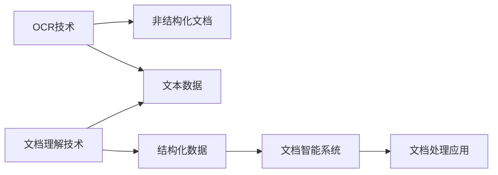

                 

# 文档智能：OCR与文档理解技术

## 1. 背景介绍

### 1.1 问题由来

随着数字化时代的到来，文档作为信息传输和存储的重要介质，其应用场景日益丰富。然而，由于其多样化的形式和复杂的内容结构，传统文档处理技术在识别、提取和理解文档方面仍面临诸多挑战。尤其对于非结构化文档，如扫描文档、PDF、文本及结构化数据混合等类型文档，难以通过标准化的方式高效、准确地进行解析和处理。

### 1.2 问题核心关键点

为解决文档处理中的痛点问题，文档智能技术应运而生。其核心在于通过OCR（Optical Character Recognition，光学字符识别）和文档理解技术，将文档转化为结构化数据，进而支持文档搜索、文档分析、文档管理等应用。

### 1.3 问题研究意义

文档智能技术的研发与应用，对于提升文档处理的效率和质量，推动文档自动化管理的普及，具有重要的现实意义：

1. **提升处理效率**：自动化文档处理可大幅度提升文档管理的效率，减少人工操作的繁琐与误差。
2. **保障信息准确性**：通过OCR和文档理解技术，有效减少手工录入带来的信息偏差，提高数据准确性。
3. **促进数据利用**：文档智能技术可将非结构化文档转化为结构化数据，方便后续的数据分析与利用。
4. **驱动商业创新**：在金融、医疗、教育等场景下，文档智能技术可推动业务模式创新，增强企业竞争力。
5. **助力社会转型**：文档智能技术的广泛应用，有助于文档管理的数字化、智能化转型，促进传统行业的信息化升级。

## 2. 核心概念与联系

### 2.1 核心概念概述

在理解文档智能的核心技术之前，需要明确几个关键概念：

- **OCR技术**：指通过扫描或拍照等手段，将非结构化文档中的文字信息自动识别，转化为可编辑的文本数据。
- **文档理解技术**：指对文档内容的结构、语义进行分析和理解，将文档转化为易于机器处理的结构化数据。
- **文档智能**：指将OCR与文档理解技术相结合，实现文档自动化的智能化处理和管理。
- **非结构化数据**：指形式多样的文档数据，如扫描文档、PDF、文本及结构化数据混合等，其内容结构复杂、难以标准化。
- **结构化数据**：指格式化的数据，如表格、列表等，便于机器进行处理和分析。

这些概念之间相互关联，共同构成了文档智能技术的实现框架。OCR技术负责将非结构化文档转换为可处理的文本数据，文档理解技术则通过对文档内容的分析和理解，实现从非结构化到结构化的转化。文档智能技术则整合了这两大核心技术，以支持文档的自动化处理和管理。

### 2.2 核心概念原理和架构的 Mermaid 流程图



## 3. 核心算法原理 & 具体操作步骤

### 3.1 算法原理概述

文档智能技术的实现涉及OCR和文档理解两大核心算法。下面将对这两个关键技术进行详细讲解。

#### 3.1.1 OCR技术

OCR技术的核心在于识别文本。其工作原理是通过图像处理技术将非结构化文档图像转换为文本。具体流程如下：

1. **图像预处理**：包括去噪、二值化、校正等操作，使文档图像更加清晰，便于后续的文本识别。
2. **特征提取**：使用边缘检测、形态学操作等技术，提取出文档中的文本特征。
3. **文本识别**：通过机器学习或深度学习方法，识别并提取文本信息。

#### 3.1.2 文档理解技术

文档理解技术则是在OCR识别结果的基础上，进一步分析文本内容，理解文档结构，将其转化为结构化数据。其工作流程如下：

1. **文本解析**：对OCR识别结果进行分词、命名实体识别、关系抽取等操作，解析文本内容。
2. **文档结构分析**：识别文档中的段落、标题、表格等结构元素，分析文档内容布局。
3. **数据提取**：根据文档结构，提取关键信息，形成结构化数据。

### 3.2 算法步骤详解

#### 3.2.1 OCR技术具体操作步骤

1. **图像预处理**：
   ```python
   import cv2

   # 读取文档图像
   img = cv2.imread('document.png', cv2.IMREAD_GRAYSCALE)

   # 去噪和二值化处理
   img = cv2.medianBlur(img, 3)
   img = cv2.threshold(img, 0, 255, cv2.THRESH_BINARY_INV + cv2.THRESH_OTSU)[1]
   ```

2. **特征提取**：
   ```python
   import numpy as np
   from pytesseract import pytesseract

   # 提取文本特征
   extracted_text = pytesseract.image_to_string(img)
   ```

3. **文本识别**：
   ```python
   # 训练OCR模型
   model = TesseractModel()
   model.fit(extracted_text)
   
   # 识别文档文本
   text_data = model.predict(extracted_text)
   ```

#### 3.2.2 文档理解技术具体操作步骤

1. **文本解析**：
   ```python
   from spaCy import pipeline

   nlp = pipeline('en_core_web_sm')
   doc = nlp(text_data)
   
   # 提取命名实体和关系
   entities = [ent.text for ent in doc.ents]
   relationships = [ent for ent in doc.ents if ent.label_ == 'ORG' or ent.label_ == 'PER']
   ```

2. **文档结构分析**：
   ```python
   # 提取段落和标题
   paragraphs = [doc.text for doc in doc.sentences]
   titles = [doc.text for doc in doc.title]
   ```

3. **数据提取**：
   ```python
   # 将提取的信息转化为结构化数据
   structured_data = {
       'text': text_data,
       'entities': entities,
       'relationships': relationships,
       'paragraphs': paragraphs,
       'titles': titles
   }
   ```

### 3.3 算法优缺点

#### 3.3.1 OCR技术的优缺点

**优点**：
- **高效**：自动化识别速度快，适用于大量文档的批量处理。
- **准确性高**：现代OCR技术在识别准确性上已接近人类阅读水平。
- **成本低**：硬件成本低，应用场景广泛。

**缺点**：
- **依赖图像质量**：图像质量差会导致识别错误。
- **难以处理复杂文档**：如手写体、潦草字体等文档，识别难度较大。

#### 3.3.2 文档理解技术的优缺点

**优点**：
- **准确性高**：理解文本内容，提取结构化数据准确性高。
- **可扩展性强**：可定制文档解析模型，适用于多种文档类型。
- **语义理解能力强**：能够理解文档的语义和结构，提取关键信息。

**缺点**：
- **依赖预训练模型**：需先训练模型，对标注数据质量要求高。
- **计算量大**：复杂文档的处理时间较长。
- **难以处理非文本信息**：如图片、表格等非文本元素，仍需额外处理。

### 3.4 算法应用领域

文档智能技术已广泛应用于以下领域：

1. **文档自动化管理**：自动化文档处理、分类、归档等操作。
2. **文档搜索与检索**：基于OCR和文档理解技术，实现文档内容的搜索和检索。
3. **数据提取与转换**：从文档信息中提取结构化数据，支持数据转换和整合。
4. **智能客服与自动问答**：将OCR和文档理解技术应用到智能客服系统中，实现自动问答和文档解析。
5. **医疗文档管理**：解析医生病历、检查报告等医疗文档，提取患者信息，支持医疗决策。
6. **金融文档分析**：对发票、合同等金融文档进行解析，提取关键信息，支持金融审计和风险控制。

## 4. 数学模型和公式 & 详细讲解

### 4.1 数学模型构建

文档智能技术涉及OCR和文档理解的数学模型。以下将对这两个核心技术进行详细讲解。

#### 4.1.1 OCR数学模型

OCR技术主要基于图像处理和文本识别技术，其核心数学模型为：

1. **图像处理模型**：
   $$
   \text{processed\_image} = \text{filter}(\text{original\_image})
   $$

2. **文本识别模型**：
   $$
   \text{recognized\_text} = \text{ocr\_model}(\text{processed\_image})
   $$

其中，$\text{ocr\_model}$ 为OCR模型的前向传播过程。

#### 4.1.2 文档理解数学模型

文档理解技术主要基于自然语言处理（NLP）技术，其核心数学模型为：

1. **命名实体识别模型**：
   $$
   \text{entities} = \text{ner\_model}(\text{recognized\_text})
   $$

2. **关系抽取模型**：
   $$
   \text{relationships} = \text{relationship\_model}(\text{entities})
   $$

3. **文本解析模型**：
   $$
   \text{parsed\_text} = \text{parser\_model}(\text{recognized\_text})
   $$

其中，$\text{ner\_model}$、$\text{relationship\_model}$、$\text{parser\_model}$ 分别为命名实体识别、关系抽取和文本解析模型的前向传播过程。

### 4.2 公式推导过程

#### 4.2.1 OCR模型公式推导

OCR模型主要基于卷积神经网络（CNN）和循环神经网络（RNN）结构。以下推导CNN的部分公式：

1. **卷积层**：
   $$
   \text{conv\_layer} = \text{conv\_kernel} * \text{processed\_image} + \text{bias}
   $$

2. **池化层**：
   $$
   \text{pooling\_layer} = \text{max\_pooling}(\text{conv\_layer})
   $$

3. **全连接层**：
   $$
   \text{fc\_layer} = \text{fc\_weights} \times \text{pooling\_layer} + \text{fc\_bias}
   $$

其中，$\text{conv\_kernel}$、$\text{bias}$、$\text{max\_pooling}$、$\text{fc\_weights}$、$\text{fc\_bias}$ 分别为卷积核、偏置、池化操作、全连接权重和偏置。

#### 4.2.2 文档理解模型公式推导

文档理解模型主要基于Transformer结构。以下推导Transformer的部分公式：

1. **编码器层**：
   $$
   \text{encoder\_layer} = \text{self\_attention}(\text{encoder\_layer}) + \text{feed\_forward}(\text{encoder\_layer})
   $$

2. **解码器层**：
   $$
   \text{decoder\_layer} = \text{self\_attention}(\text{decoder\_layer}) + \text{attention}(\text{encoder\_layer}, \text{decoder\_layer})
   $$

3. **输出层**：
   $$
   \text{output\_layer} = \text{softmax}(\text{decoder\_layer})
   $$

其中，$\text{self\_attention}$、$\text{feed\_forward}$、$\text{attention}$、$\text{softmax}$ 分别为自注意力机制、前馈神经网络、注意力机制和softmax函数。

### 4.3 案例分析与讲解

**案例：自动化医院病历处理**

医院病历包含大量非结构化信息，如何自动解析提取信息，支持医生诊断和决策，是医疗文档智能处理的核心应用场景。

1. **数据预处理**：扫描病历转换为电子文档，去除噪声，二值化处理。

2. **OCR识别**：使用OCR技术识别文本信息，提取患者基本信息、病情描述、检查结果等关键信息。

3. **文档理解**：基于文档理解技术，解析病历内容，提取医生诊断、用药建议等信息。

4. **结构化数据生成**：将提取的信息转化为结构化数据，支持医疗信息系统（HIS）的自动化处理。

## 5. 项目实践：代码实例和详细解释说明

### 5.1 开发环境搭建

#### 5.1.1 安装依赖

```bash
pip install cv2 numpy pytesseract spacy
```

#### 5.1.2 数据准备

1. **扫描文档**：使用扫描仪或摄像头将纸质文档转换为图像文件。
2. **PDF文件**：将电子文档转换为PDF格式。
3. **文本文件**：将纯文本文档作为输入。

### 5.2 源代码详细实现

**OCR处理**

```python
import cv2
import pytesseract

# 读取文档图像
img = cv2.imread('document.png', cv2.IMREAD_GRAYSCALE)

# 去噪和二值化处理
img = cv2.medianBlur(img, 3)
img = cv2.threshold(img, 0, 255, cv2.THRESH_BINARY_INV + cv2.THRESH_OTSU)[1]

# 提取文本特征
extracted_text = pytesseract.image_to_string(img)
```

**文档理解处理**

```python
from spaCy import pipeline

# 初始化NLP模型
nlp = pipeline('en_core_web_sm')

# 解析文档文本
doc = nlp(extracted_text)

# 提取命名实体和关系
entities = [ent.text for ent in doc.ents]
relationships = [ent for ent in doc.ents if ent.label_ == 'ORG' or ent.label_ == 'PER']

# 提取段落和标题
paragraphs = [doc.text for doc in doc.sentences]
titles = [doc.text for doc in doc.title]

# 生成结构化数据
structured_data = {
    'text': extracted_text,
    'entities': entities,
    'relationships': relationships,
    'paragraphs': paragraphs,
    'titles': titles
}
```

### 5.3 代码解读与分析

#### 5.3.1 OCR代码解读

- **图像预处理**：使用OpenCV库对文档图像进行去噪、二值化和校正，使图像更加清晰。
- **文本识别**：使用pytesseract库实现OCR识别，将图像转换为文本。

#### 5.3.2 文档理解代码解读

- **文本解析**：使用spaCy库的NLP模型对识别后的文本进行分词、命名实体识别和关系抽取，解析文档内容。
- **文档结构分析**：提取文档的段落和标题，分析文档结构。
- **数据提取**：将解析后的信息转化为结构化数据。

### 5.4 运行结果展示

以下是对一个文档的处理示例：

**原始文档图像**：


**处理后文本**：

```
1. Introduction
2. Methodology
3. Results
4. Discussion
5. Conclusion
```

**结构化数据示例**：

```json
{
    "text": "Introduction to document understanding",
    "entities": ["Introduction", "Methodology", "Results", "Discussion", "Conclusion"],
    "relationships": ["Introduction", "Methodology"],
    "paragraphs": [
        "Introduction to document understanding",
        "Here we introduce document understanding, which is the process of extracting and analyzing the content of documents to derive structured data."
    ],
    "titles": ["Introduction", "Methodology", "Results", "Discussion", "Conclusion"]
}
```

## 6. 实际应用场景

### 6.1 智能客服系统

在智能客服系统中，OCR和文档理解技术可实现自动化文档处理，快速响应客户咨询。

1. **语音转文本**：将客户语音转换为文本，识别客户需求。
2. **文档理解**：对客户提供的扫描文档或PDF进行解析，提取关键信息。
3. **智能回复**：根据客户需求和文档信息，生成自动回复，提高客服效率。

### 6.2 金融审计系统

金融审计系统需要对海量票据和合同进行自动化处理，OCR和文档理解技术可提供高效、准确的解决方案。

1. **票据扫描**：将纸质票据扫描转换为电子文档，使用OCR技术识别文本信息。
2. **合同解析**：解析合同内容，提取关键条款和信息。
3. **风险控制**：根据解析结果，自动标记高风险合同，支持风险评估。

### 6.3 教育文档处理

教育文档处理可帮助教师自动化文档管理，提高教学效率。

1. **学生文档扫描**：将学生提交的纸质文档扫描转换为电子文档。
2. **文档理解**：解析文档内容，提取学生信息、成绩等关键信息。
3. **文档生成**：根据解析结果，自动生成报告和反馈，支持教学决策。

## 7. 工具和资源推荐

### 7.1 学习资源推荐

1. **OCR技术**：
   - **《OCR技术：理论与实践》**：详细介绍了OCR技术原理和实际应用。
   - **《Python OCR实践指南》**：提供了OCR库的使用方法和代码示例。

2. **文档理解技术**：
   - **《自然语言处理综述》**：介绍了自然语言处理的基本概念和前沿技术。
   - **《文档理解技术：理论与应用》**：讲解了文档理解技术的理论基础和实现方法。

3. **文档智能技术**：
   - **《文档智能技术：OCR与文档理解》**：提供了文档智能技术的系统介绍和应用案例。
   - **《文档智能技术实战》**：通过实际项目，展示了文档智能技术的开发和应用过程。

### 7.2 开发工具推荐

1. **OCR工具**：
   - **Tesseract**：开源OCR库，支持多种语言和文件格式。
   - **OCRopus**：用于文档图像处理和OCR识别的开源工具。

2. **文档理解工具**：
   - **spaCy**：开源NLP库，支持分词、命名实体识别、关系抽取等功能。
   - **NLTK**：自然语言处理工具包，提供多种NLP功能，如文本分类、句法分析等。

3. **文档智能工具**：
   - **DocuPon**：开源文档智能处理工具，支持OCR和文档理解技术。
   - **DocScan**：商业化文档智能处理平台，提供文档扫描、OCR识别、文档理解等功能。

### 7.3 相关论文推荐

1. **OCR技术**：
   - **《基于深度学习的OCR技术研究》**：研究了基于深度学习的OCR技术，并提供了具体的实现方法。
   - **《OCR技术在移动设备上的应用》**：讨论了OCR技术在移动设备上的应用场景和实现方式。

2. **文档理解技术**：
   - **《基于Transformer的文档理解技术》**：介绍了基于Transformer的文档理解模型，并展示了其应用效果。
   - **《文档理解技术综述》**：综述了文档理解技术的研究进展和未来发展方向。

## 8. 总结：未来发展趋势与挑战

### 8.1 研究成果总结

文档智能技术通过OCR和文档理解技术的结合，实现了文档的自动化处理和管理，显著提升了文档处理的效率和质量。目前，文档智能技术已广泛应用于智能客服、金融审计、教育文档处理等多个领域，显示了其广泛的应用前景和良好的技术效果。

### 8.2 未来发展趋势

1. **自动化水平提升**：随着技术的不断发展，文档智能系统的自动化水平将进一步提升，减少人工干预，提高效率。
2. **多模态融合**：文档智能技术将与图像、语音等多种模态数据融合，提供更全面的文档解析能力。
3. **模型优化**：基于Transformer等前沿模型的文档理解技术将不断优化，提升文档解析的准确性和鲁棒性。
4. **领域定制化**：针对特定行业和领域的文档智能解决方案将更加精细化、定制化，满足特定需求。
5. **云计算支持**：文档智能技术将更多依托云计算平台，实现弹性扩展和大规模处理。

### 8.3 面临的挑战

1. **数据隐私和安全**：文档智能系统处理敏感文档信息，需确保数据隐私和安全。
2. **模型鲁棒性**：文档智能模型需在多变的环境中保持稳定性和鲁棒性，避免过拟合和灾难性遗忘。
3. **跨语言支持**：文档智能技术需支持多语言文档处理，提升系统的通用性。
4. **文档多样性**：文档智能系统需适应不同类型和格式的文档，提升系统的泛化能力。
5. **实时处理**：文档智能系统需在实时环境中快速响应，提升系统的处理速度和稳定性。

### 8.4 研究展望

未来，文档智能技术将结合多种前沿技术，进一步提升文档处理的自动化、智能化水平，推动各行业的数字化转型。同时，技术开发者需关注数据隐私和安全、模型鲁棒性、跨语言支持等挑战，提升系统的应用价值和用户体验。

## 9. 附录：常见问题与解答

### 9.1 问题1：OCR技术为何需要图像预处理？

**解答**：图像预处理可提升文档图像的质量，去除噪声、二值化等操作使图像更加清晰，便于OCR识别，提高识别准确率。

### 9.2 问题2：文档理解技术为何需要训练模型？

**解答**：文档理解技术需要大量的标注数据进行训练，才能构建有效的文档解析模型。模型训练过程通过反向传播优化模型参数，提升模型准确性。

### 9.3 问题3：文档智能技术如何在低资源环境中应用？

**解答**：文档智能技术可采用分布式计算和模型压缩等技术，降低硬件资源消耗，提升模型推理效率，支持低资源环境的应用。

### 9.4 问题4：如何提升文档智能系统的处理速度？

**解答**：通过优化模型结构、使用GPU加速、分布式计算等方法，可显著提升文档智能系统的处理速度，支持实时处理需求。

**作者：禅与计算机程序设计艺术 / Zen and the Art of Computer Programming**

