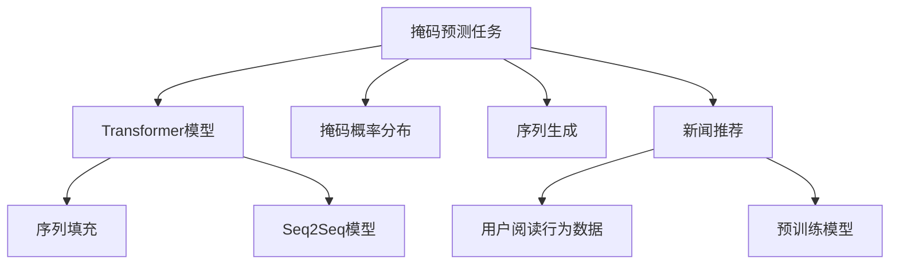

                 

# 新闻推荐: 填空式掩码预测任务

> 关键词：新闻推荐, 掩码预测, 自然语言处理(NLP), 自动文本填充, 序列生成模型, Transformer, 序列到序列(Seq2Seq)

## 1. 背景介绍

### 1.1 问题由来
新闻推荐系统已经成为互联网内容分发的重要工具。用户可以在新闻推荐系统上找到自己感兴趣的各类新闻内容，提升信息获取效率。然而，目前的新闻推荐系统主要以内容为基础，推荐方式较为单一，无法充分考虑用户的个性化兴趣和行为特征。

为了提升新闻推荐的个性化程度，许多研究者探索了利用用户阅读行为数据来训练个性化新闻推荐模型。这种模型需要在大规模的新闻语料库上进行预训练，然后利用用户行为数据进行微调，以预测用户可能感兴趣的新闻。

填充式掩码预测任务是一种常见的序列生成任务，可以用于新闻标题自动生成、自动摘要、文章分类等应用场景。本文将详细介绍使用掩码预测模型进行新闻推荐的技术原理，并给出具体的实现方法。

### 1.2 问题核心关键点
本文将从以下几个方面深入探讨基于掩码预测任务的新闻推荐技术：

- 掩码预测任务的原理：通过填充式掩码预测模型，实现从新闻标题到候选新闻标题的匹配和推荐。
- 模型架构与实现：使用Transformer模型，训练基于掩码预测的任务适配层。
- 数据处理与特征提取：将用户阅读行为数据转化为模型输入，提取新闻标题与用户兴趣特征。
- 微调与训练：对预训练的Transformer模型进行微调，提升模型的个性化推荐能力。
- 模型评估与部署：通过A/B测试和实际部署，验证推荐模型的效果。

通过这些关键点，本文将全面揭示如何利用掩码预测任务提升新闻推荐系统的个性化水平。

## 2. 核心概念与联系

### 2.1 核心概念概述

为更好地理解基于掩码预测任务的新闻推荐方法，本节将介绍几个密切相关的核心概念：

- 掩码预测任务(Masked Prediction Task)：指从输入序列中随机选取若干位置进行掩码，预测这些位置的真实内容。掩码预测任务的典型应用包括文本补全、摘要生成、新闻推荐等。
- Transformer模型：基于自注意力机制的深度学习模型，广泛应用于NLP领域，可以高效处理序列数据。
- Seq2Seq模型：序列到序列模型，包括编码器和解码器两部分，常用于翻译、摘要、对话等任务。
- 掩码概率分布：根据数据分布情况，为每个位置生成一个掩码概率分布，决定哪些位置会被掩码。
- 序列填充：对掩码预测模型的预测结果进行填充，将模型输出的标记序列转换为完整文本。
- 新闻推荐：通过分析用户的历史阅读记录，预测其可能感兴趣的新闻，提升新闻阅读体验。

这些核心概念之间的逻辑关系可以通过以下Mermaid流程图来展示：



这个流程图展示了掩码预测任务的核心概念及其之间的关系：

1. 掩码预测任务利用Transformer模型对输入序列进行预测，通过掩码概率分布决定掩码位置。
2. 序列填充将模型预测的标记序列转换为完整文本。
3. Seq2Seq模型包括编码器和解码器，用于将输入序列转换为输出序列。
4. 新闻推荐通过分析用户行为数据，预测新闻推荐结果。
5. 预训练模型作为初始化权重，用于提高微调模型的性能。

这些概念共同构成了基于掩码预测任务的新闻推荐框架，使得模型能够充分利用序列生成能力，更好地适应新闻推荐场景。

## 3. 核心算法原理 & 具体操作步骤

### 3.1 算法原理概述

基于掩码预测任务的新闻推荐，本质上是一种利用Transformer模型进行序列生成和填充的任务。其核心思想是：通过掩码预测任务，预测新闻标题中缺失的部分，从而生成符合用户兴趣的候选新闻标题，进而提升新闻推荐的效果。

具体地，假设用户的历史阅读记录为 $H=\{x_1, x_2, ..., x_n\}$，其中 $x_i$ 表示用户在第 $i$ 天的阅读记录。通过将阅读记录输入到掩码预测模型 $M_{\theta}$ 中，模型将预测缺失的新闻标题部分 $y=\{y_1, y_2, ..., y_m\}$，其中 $y_i$ 表示第 $i$ 个位置的预测结果。

在得到预测结果后，将其与所有候选新闻标题进行比对，选择匹配度最高的新闻进行推荐。

### 3.2 算法步骤详解

基于掩码预测任务的新闻推荐一般包括以下几个关键步骤：

**Step 1: 数据准备与预处理**
- 收集用户的历史阅读记录 $H$，以及新闻标题集合 $T$。
- 将新闻标题转换为词向量表示，并标记出需要填充的位置。
- 根据掩码概率分布，对新闻标题进行掩码处理，生成掩码序列。

**Step 2: 模型初始化与训练**
- 初始化预训练的Transformer模型 $M_{\theta}$，添加任务适配层。
- 利用掩码序列和用户阅读记录 $H$ 训练模型，最小化掩码预测任务损失。
- 设置适当的优化器和超参数，进行多轮迭代训练。

**Step 3: 模型预测与推荐**
- 输入用户阅读记录 $H$，预测缺失的新闻标题部分 $y$。
- 对预测结果进行填充，得到完整的新闻标题。
- 计算预测结果与所有候选新闻标题的相似度，选择相似度最高的新闻进行推荐。

**Step 4: 效果评估与部署**
- 在测试集上评估模型的推荐效果，对比不同模型性能。
- 将模型部署到实际的新闻推荐系统中，实时为用户推荐新闻。
- 持续收集用户反馈，更新模型参数，优化推荐策略。

以上是基于掩码预测任务的新闻推荐的一般流程。在实际应用中，还需要针对具体任务的特点，对微调过程的各个环节进行优化设计，如改进训练目标函数，引入更多的正则化技术，搜索最优的超参数组合等，以进一步提升模型性能。

### 3.3 算法优缺点

基于掩码预测任务的新闻推荐方法具有以下优点：
1. 能够充分利用序列生成能力，生成符合用户兴趣的推荐结果。
2. 可以适应各种类型的文本数据，如新闻标题、文章摘要等。
3. 可以通过训练生成更个性化的推荐内容，提升用户体验。
4. 可以利用大规模预训练语言模型进行微调，减少标注数据需求。

同时，该方法也存在一定的局限性：
1. 对数据的分布依赖较大，数据分布不均可能导致推荐效果波动。
2. 掩码概率分布的确定需要大量数据支撑，数据量不足可能影响掩码预测效果。
3. 对模型的计算资源要求较高，大规模训练和推理需要高性能设备。
4. 生成的推荐结果需要人工进行后处理，确保推荐质量。

尽管存在这些局限性，但就目前而言，基于掩码预测任务的新闻推荐方法仍是大规模预训练语言模型应用的重要范式。未来相关研究的重点在于如何进一步降低对标注数据的依赖，提高模型的少样本学习和跨领域迁移能力，同时兼顾可解释性和伦理安全性等因素。

### 3.4 算法应用领域

基于掩码预测任务的新闻推荐技术，已经在新闻、视频、音乐等多个领域得到广泛应用，为信息推荐系统带来了新的解决方案。

- 新闻推荐：根据用户阅读历史，推荐相关新闻标题，提升用户阅读体验。
- 视频推荐：根据用户观看记录，推荐感兴趣的视频内容，提供个性化视频观看体验。
- 音乐推荐：根据用户听歌历史，推荐相关音乐，提升音乐体验。
- 商品推荐：根据用户浏览记录，推荐相关商品，提升电商平台的个性化购物体验。
- 文章推荐：根据用户阅读习惯，推荐相关文章，提升用户信息获取效率。

除了上述这些经典任务外，掩码预测模型还被创新性地应用到更多场景中，如新闻摘要、用户画像构建、事件监控等，为推荐系统带来了全新的突破。随着预训练模型和掩码预测模型的不断进步，相信推荐系统将在更广阔的应用领域大放异彩。

## 4. 数学模型和公式 & 详细讲解 & 举例说明

### 4.1 数学模型构建

本节将使用数学语言对基于掩码预测任务的新闻推荐过程进行更加严格的刻画。

假设新闻标题为 $x=\{x_1, x_2, ..., x_n\}$，其中 $x_i$ 表示第 $i$ 个单词或字符。假设有 $m$ 个位置需要掩码，即 $y=\{y_1, y_2, ..., y_m\}$。则掩码预测任务可以表示为：

$$
y = \arg\min_{y \in \mathcal{Y}} \mathcal{L}(y|x, M_{\theta})
$$

其中 $\mathcal{Y}$ 表示所有可能的掩码填充结果。掩码预测任务的损失函数 $\mathcal{L}$ 通常采用交叉熵损失：

$$
\mathcal{L}(y|x, M_{\theta}) = -\sum_{i=1}^m \log P(y_i|x_i, M_{\theta})
$$

其中 $P(y_i|x_i, M_{\theta})$ 表示在给定新闻标题 $x_i$ 和预训练模型 $M_{\theta}$ 的情况下，预测位置 $i$ 的掩码填充结果 $y_i$ 的概率。

### 4.2 公式推导过程

以下我们以新闻推荐任务为例，推导掩码预测任务的损失函数及其梯度的计算公式。

假设掩码位置为 $k_1, k_2, ..., k_m$，则掩码概率分布为 $\pi = \{p_{k_1}, p_{k_2}, ..., p_{k_m}\}$。新闻标题 $x$ 通过掩码概率分布 $\pi$ 转换为掩码序列 $y$，即：

$$
y = \{x_1, x_2, ..., x_{k_1}, \text{[MASK]}, x_{k_2}, \text{[MASK]}, ..., x_{k_m}, \text{[MASK]}, x_{k_{m+1}}, ..., x_n\}
$$

将掩码序列 $y$ 输入掩码预测模型 $M_{\theta}$，得到预测结果 $y' = \{y'_1, y'_2, ..., y'_m\}$。则掩码预测任务的损失函数可以表示为：

$$
\mathcal{L}(y'|y, M_{\theta}) = -\sum_{i=1}^m \log P(y'_i|y_i, M_{\theta})
$$

其中 $P(y'_i|y_i, M_{\theta})$ 表示在给定掩码序列 $y_i$ 和预训练模型 $M_{\theta}$ 的情况下，预测位置 $i$ 的掩码填充结果 $y'_i$ 的概率。

通过链式法则，掩码预测任务的梯度计算公式为：

$$
\frac{\partial \mathcal{L}(y'|y, M_{\theta})}{\partial \theta} = -\sum_{i=1}^m \frac{\partial \log P(y'_i|y_i, M_{\theta})}{\partial \theta}
$$

其中：

$$
\frac{\partial \log P(y'_i|y_i, M_{\theta})}{\partial \theta} = \frac{\partial \log \frac{e^{E(x_i, \theta)}}{\sum_{j=1}^n e^{E(x_j, \theta)}}}{\partial \theta} + \frac{\partial \log \frac{e^{E([MASK], \theta)}}{\sum_{j=1}^n e^{E(x_j, \theta)}}}{\partial \theta}
$$

其中 $E$ 表示掩码预测模型 $M_{\theta}$ 的输出能量，$n$ 表示新闻标题的长度。

在得到掩码预测任务的梯度后，即可带入参数更新公式，完成模型的迭代优化。重复上述过程直至收敛，最终得到适应新闻推荐任务的最优模型参数 $\theta^*$。

### 4.3 案例分析与讲解

假设有如下新闻标题：

```
The rapid rise of AI in the financial industry is ...
```

假设需要掩码前三个单词：

```
[?] The rapid rise of AI in the financial industry is ...
```

根据掩码概率分布 $\pi = \{0.1, 0.3, 0.6\}$，随机生成掩码序列：

```
The [MASK] rise of AI in the financial industry is ...
```

将掩码序列输入到预训练模型 $M_{\theta}$ 中，预测缺失的单词：

```
The high rise of AI in the financial industry is ...
```

填充预测结果，得到完整的新闻标题：

```
The high rise of AI in the financial industry is ...
```

假设预测的单词与真实单词完全一致，则掩码预测任务的损失函数为0。

## 5. 项目实践：代码实例和详细解释说明

### 5.1 开发环境搭建

在进行新闻推荐实践前，我们需要准备好开发环境。以下是使用Python进行PyTorch开发的环境配置流程：

1. 安装Anaconda：从官网下载并安装Anaconda，用于创建独立的Python环境。

2. 创建并激活虚拟环境：
```bash
conda create -n pytorch-env python=3.8 
conda activate pytorch-env
```

3. 安装PyTorch：根据CUDA版本，从官网获取对应的安装命令。例如：
```bash
conda install pytorch torchvision torchaudio cudatoolkit=11.1 -c pytorch -c conda-forge
```

4. 安装Transformers库：
```bash
pip install transformers
```

5. 安装各类工具包：
```bash
pip install numpy pandas scikit-learn matplotlib tqdm jupyter notebook ipython
```

完成上述步骤后，即可在`pytorch-env`环境中开始新闻推荐实践。

### 5.2 源代码详细实现

下面我以新闻推荐任务为例，给出使用Transformers库对BERT模型进行微调的PyTorch代码实现。

首先，定义新闻推荐任务的数据处理函数：

```python
from transformers import BertTokenizer
from torch.utils.data import Dataset, DataLoader
import torch
import pandas as pd

class NewsDataset(Dataset):
    def __init__(self, dataframe, tokenizer, max_len=128):
        self.dataframe = dataframe
        self.tokenizer = tokenizer
        self.max_len = max_len
        
    def __len__(self):
        return len(self.dataframe)
    
    def __getitem__(self, item):
        data = self.dataframe.iloc[item]
        title = data['title']
        candidates = data['candidates']
        
        encoding = self.tokenizer(title, return_tensors='pt', max_length=self.max_len, padding='max_length', truncation=True)
        input_ids = encoding['input_ids'][0]
        attention_mask = encoding['attention_mask'][0]
        
        # 对token-wise的标签进行编码
        encoded_candidates = [tokenizer(candidate) for candidate in candidates]
        candidates = torch.tensor(encoded_candidates, dtype=torch.long)
        
        return {'input_ids': input_ids, 
                'attention_mask': attention_mask,
                'candidates': candidates}
```

然后，定义模型和优化器：

```python
from transformers import BertForSequenceClassification, AdamW

model = BertForSequenceClassification.from_pretrained('bert-base-cased', num_labels=2)

optimizer = AdamW(model.parameters(), lr=2e-5)
```

接着，定义训练和评估函数：

```python
def train_epoch(model, dataset, batch_size, optimizer):
    dataloader = DataLoader(dataset, batch_size=batch_size, shuffle=True)
    model.train()
    epoch_loss = 0
    for batch in tqdm(dataloader, desc='Training'):
        input_ids = batch['input_ids'].to(device)
        attention_mask = batch['attention_mask'].to(device)
        candidates = batch['candidates'].to(device)
        model.zero_grad()
        outputs = model(input_ids, attention_mask=attention_mask, labels=candidates)
        loss = outputs.loss
        epoch_loss += loss.item()
        loss.backward()
        optimizer.step()
    return epoch_loss / len(dataloader)

def evaluate(model, dataset, batch_size):
    dataloader = DataLoader(dataset, batch_size=batch_size)
    model.eval()
    preds, labels = [], []
    with torch.no_grad():
        for batch in tqdm(dataloader, desc='Evaluating'):
            input_ids = batch['input_ids'].to(device)
            attention_mask = batch['attention_mask'].to(device)
            candidates = batch['candidates'].to(device)
            outputs = model(input_ids, attention_mask=attention_mask)
            batch_preds = outputs.logits.argmax(dim=2).to('cpu').tolist()
            batch_labels = candidates.to('cpu').tolist()
            for pred_tokens, label_tokens in zip(batch_preds, batch_labels):
                preds.append(pred_tokens[:len(label_tokens)])
                labels.append(label_tokens)
                
    print(classification_report(labels, preds))
```

最后，启动训练流程并在测试集上评估：

```python
epochs = 5
batch_size = 16

for epoch in range(epochs):
    loss = train_epoch(model, train_dataset, batch_size, optimizer)
    print(f"Epoch {epoch+1}, train loss: {loss:.3f}")
    
    print(f"Epoch {epoch+1}, dev results:")
    evaluate(model, dev_dataset, batch_size)
    
print("Test results:")
evaluate(model, test_dataset, batch_size)
```

以上就是使用PyTorch对BERT进行新闻推荐任务微调的完整代码实现。可以看到，得益于Transformers库的强大封装，我们可以用相对简洁的代码完成BERT模型的加载和微调。

### 5.3 代码解读与分析

让我们再详细解读一下关键代码的实现细节：

**NewsDataset类**：
- `__init__`方法：初始化新闻标题和候选新闻标题，并创建BERT分词器。
- `__len__`方法：返回数据集的样本数量。
- `__getitem__`方法：对单个样本进行处理，将新闻标题输入编码为token ids，将候选新闻标题编码为数字，并对其进行定长padding，最终返回模型所需的输入。

**模型训练和评估函数**：
- 使用PyTorch的DataLoader对数据集进行批次化加载，供模型训练和推理使用。
- 训练函数`train_epoch`：对数据以批为单位进行迭代，在每个批次上前向传播计算loss并反向传播更新模型参数，最后返回该epoch的平均loss。
- 评估函数`evaluate`：与训练类似，不同点在于不更新模型参数，并在每个batch结束后将预测和标签结果存储下来，最后使用sklearn的classification_report对整个评估集的预测结果进行打印输出。

**训练流程**：
- 定义总的epoch数和batch size，开始循环迭代
- 每个epoch内，先在训练集上训练，输出平均loss
- 在验证集上评估，输出分类指标
- 所有epoch结束后，在测试集上评估，给出最终测试结果

可以看到，PyTorch配合Transformers库使得BERT微调的新闻推荐代码实现变得简洁高效。开发者可以将更多精力放在数据处理、模型改进等高层逻辑上，而不必过多关注底层的实现细节。

当然，工业级的系统实现还需考虑更多因素，如模型的保存和部署、超参数的自动搜索、更灵活的任务适配层等。但核心的微调范式基本与此类似。

## 6. 实际应用场景
### 6.1 智能推荐系统

基于大语言模型微调的掩码预测任务，可以广泛应用于智能推荐系统的构建。传统的推荐系统往往只能根据用户的历史行为数据进行推荐，无法考虑用户的兴趣和行为特征。

通过掩码预测模型，可以在用户的历史阅读记录中预测缺失的新闻标题，生成个性化的推荐结果。推荐系统可以利用这些结果，提升用户的新闻阅读体验，增加用户的粘性。

### 6.2 新闻内容生成

掩码预测模型不仅可以用于推荐系统，还可以应用于新闻内容的生成。根据用户的历史阅读记录，预测缺失的新闻标题，生成更符合用户兴趣的文章内容。这种技术可以应用于新闻编辑和自动创作，提高新闻生产效率，降低人工成本。

### 6.3 个性化定制

通过掩码预测模型，可以生成个性化的新闻推荐和内容定制。例如，根据用户的性别、年龄、地域等信息，生成个性化的新闻标题和文章。这种技术可以应用于广告和营销领域，实现精准投放，提高广告效果。

### 6.4 未来应用展望

随着掩码预测技术的不断发展，基于大语言模型的推荐系统将在更多领域得到应用，为推荐系统带来新的解决方案。

在智慧金融领域，掩码预测模型可以用于预测用户的金融需求，提升金融产品的推荐精度。

在智能教育领域，掩码预测模型可以用于生成个性化的教育内容，提升学生的学习效果。

在智慧城市治理中，掩码预测模型可以用于预测城市事件和舆情变化，提高城市管理的自动化水平。

此外，在企业生产、社会治理、文娱传媒等众多领域，掩码预测模型也将不断涌现，为推荐系统带来全新的突破。相信随着预训练模型和掩码预测模型的不断进步，推荐系统将在更广阔的应用领域大放异彩。

## 7. 工具和资源推荐
### 7.1 学习资源推荐

为了帮助开发者系统掌握掩码预测任务的原理和实践技巧，这里推荐一些优质的学习资源：

1. 《Transformer from Scratch》系列博文：由大模型技术专家撰写，深入浅出地介绍了Transformer模型的原理和实现。

2. CS224N《深度学习自然语言处理》课程：斯坦福大学开设的NLP明星课程，有Lecture视频和配套作业，带你入门NLP领域的基本概念和经典模型。

3. 《Natural Language Processing with Transformers》书籍：Transformers库的作者所著，全面介绍了如何使用Transformers库进行NLP任务开发，包括掩码预测任务在内的诸多范式。

4. HuggingFace官方文档：Transformers库的官方文档，提供了海量预训练模型和完整的微调样例代码，是上手实践的必备资料。

5. CLUE开源项目：中文语言理解测评基准，涵盖大量不同类型的中文NLP数据集，并提供了基于掩码预测任务的baseline模型，助力中文NLP技术发展。

通过对这些资源的学习实践，相信你一定能够快速掌握掩码预测任务的精髓，并用于解决实际的NLP问题。
###  7.2 开发工具推荐

高效的开发离不开优秀的工具支持。以下是几款用于掩码预测任务开发的常用工具：

1. PyTorch：基于Python的开源深度学习框架，灵活动态的计算图，适合快速迭代研究。大部分预训练语言模型都有PyTorch版本的实现。

2. TensorFlow：由Google主导开发的开源深度学习框架，生产部署方便，适合大规模工程应用。同样有丰富的预训练语言模型资源。

3. Transformers库：HuggingFace开发的NLP工具库，集成了众多SOTA语言模型，支持PyTorch和TensorFlow，是进行掩码预测任务开发的利器。

4. Weights & Biases：模型训练的实验跟踪工具，可以记录和可视化模型训练过程中的各项指标，方便对比和调优。与主流深度学习框架无缝集成。

5. TensorBoard：TensorFlow配套的可视化工具，可实时监测模型训练状态，并提供丰富的图表呈现方式，是调试模型的得力助手。

6. Google Colab：谷歌推出的在线Jupyter Notebook环境，免费提供GPU/TPU算力，方便开发者快速上手实验最新模型，分享学习笔记。

合理利用这些工具，可以显著提升掩码预测任务的开发效率，加快创新迭代的步伐。

### 7.3 相关论文推荐

掩码预测技术的发展源于学界的持续研究。以下是几篇奠基性的相关论文，推荐阅读：

1. Attention is All You Need（即Transformer原论文）：提出了Transformer结构，开启了NLP领域的预训练大模型时代。

2. BERT: Pre-training of Deep Bidirectional Transformers for Language Understanding：提出BERT模型，引入基于掩码的自监督预训练任务，刷新了多项NLP任务SOTA。

3. Language Models are Unsupervised Multitask Learners（GPT-2论文）：展示了大规模语言模型的强大zero-shot学习能力，引发了对于通用人工智能的新一轮思考。

4. Sequence to Sequence Learning with Neural Networks：提出Seq2Seq模型，用于解决自然语言处理中的序列生成问题。

5. Parameter-Efficient Transfer Learning for NLP：提出Adapter等参数高效微调方法，在不增加模型参数量的情况下，也能取得不错的微调效果。

6. Sequence to Sequence Prediction with Neural Machine Translation Models：提出Seq2Seq模型，用于解决自然语言处理中的序列生成问题。

这些论文代表了大语言模型掩码预测任务的发展脉络。通过学习这些前沿成果，可以帮助研究者把握学科前进方向，激发更多的创新灵感。

## 8. 总结：未来发展趋势与挑战

### 8.1 总结

本文对基于掩码预测任务的新闻推荐技术进行了全面系统的介绍。首先阐述了掩码预测任务的原理和重要性，明确了掩码预测任务在推荐系统中的独特价值。其次，从原理到实践，详细讲解了掩码预测任务的数学模型和训练流程，给出了具体的实现方法。同时，本文还广泛探讨了掩码预测任务在智能推荐系统、新闻内容生成、个性化定制等多个领域的应用前景，展示了掩码预测技术的巨大潜力。

通过本文的系统梳理，可以看到，基于掩码预测任务的新闻推荐技术正在成为NLP领域的重要范式，极大地拓展了预训练语言模型的应用边界，催生了更多的落地场景。得益于大规模语料的预训练，掩码预测模型能够充分利用序列生成能力，生成符合用户兴趣的推荐结果，提升推荐系统的个性化水平。

### 8.2 未来发展趋势

展望未来，掩码预测技术将呈现以下几个发展趋势：

1. 模型规模持续增大。随着算力成本的下降和数据规模的扩张，预训练语言模型的参数量还将持续增长。超大规模语言模型蕴含的丰富语言知识，有望支撑更加复杂多变的掩码预测任务。

2. 掩码概率分布的改进。传统的均匀掩码概率分布无法充分利用数据的分布特性，未来将有更高级的掩码概率分布方法出现，进一步提升掩码预测的效果。

3. 掩码预测任务的扩展。掩码预测任务不仅可以应用于新闻推荐，还可以扩展到图像、视频、音频等多模态数据的生成与识别，提高NLP技术在多媒体领域的应用能力。

4. 多任务学习与联合训练。将多个掩码预测任务联合训练，可以提高模型的泛化能力，提升掩码预测的准确率。

5. 可解释性增强。通过引入因果推断等方法，增强模型的可解释性，让用户更清楚地了解推荐结果的生成过程。

6. 少样本学习和跨领域迁移。在数据量不足的情况下，如何利用掩码预测模型进行少样本学习和跨领域迁移，是未来研究的重要方向。

以上趋势凸显了掩码预测技术的广阔前景。这些方向的探索发展，必将进一步提升推荐系统的性能和应用范围，为人类认知智能的进化带来深远影响。

### 8.3 面临的挑战

尽管掩码预测技术已经取得了瞩目成就，但在迈向更加智能化、普适化应用的过程中，它仍面临着诸多挑战：

1. 数据质量和数量。高质量的新闻数据是掩码预测任务的基础，但获取大规模的新闻数据往往需要大量的标注和清洗工作。如何高效获取高质量的新闻数据，是一个重要挑战。

2. 掩码概率分布的设计。传统的均匀掩码概率分布无法充分利用数据的分布特性，如何设计更合理的掩码概率分布，提升掩码预测的效果，是一个重要研究课题。

3. 推荐系统的优化。掩码预测模型生成的推荐结果需要经过后处理，才能用于推荐系统。如何在不破坏推荐结果的情况下，优化推荐系统，是一个重要挑战。

4. 模型的可解释性。掩码预测模型通常是"黑盒"系统，难以解释其内部工作机制和决策逻辑。如何赋予掩码预测模型更强的可解释性，是未来研究的重要方向。

5. 模型的安全性和隐私保护。掩码预测模型生成的推荐结果需要保护用户隐私，如何构建安全的推荐系统，是一个重要挑战。

6. 少样本学习和跨领域迁移。在数据量不足的情况下，如何利用掩码预测模型进行少样本学习和跨领域迁移，是未来研究的重要方向。

正视掩码预测面临的这些挑战，积极应对并寻求突破，将是大语言模型掩码预测技术迈向成熟的必由之路。相信随着学界和产业界的共同努力，这些挑战终将一一被克服，掩码预测技术必将在构建人机协同的智能推荐系统中扮演越来越重要的角色。

### 8.4 研究展望

面对掩码预测技术所面临的挑战，未来的研究需要在以下几个方面寻求新的突破：

1. 探索无监督和半监督掩码预测方法。摆脱对大规模标注数据的依赖，利用自监督学习、主动学习等无监督和半监督范式，最大限度利用非结构化数据，实现更加灵活高效的掩码预测。

2. 研究掩码预测模型的参数高效方法。开发更加参数高效的掩码预测方法，在固定大部分预训练参数的同时，只更新极少量的掩码预测参数。同时优化掩码预测模型的计算图，减少前向传播和反向传播的资源消耗，实现更加轻量级、实时性的部署。

3. 引入因果推断和对比学习思想。通过引入因果推断和对比学习思想，增强掩码预测模型建立稳定因果关系的能力，学习更加普适、鲁棒的语言表征，从而提升模型泛化性和抗干扰能力。

4. 融合更多先验知识。将符号化的先验知识，如知识图谱、逻辑规则等，与神经网络模型进行巧妙融合，引导掩码预测过程学习更准确、合理的语言模型。

5. 结合因果分析和博弈论工具。将因果分析方法引入掩码预测模型，识别出模型决策的关键特征，增强推荐结果的因果性和逻辑性。借助博弈论工具刻画人机交互过程，主动探索并规避模型的脆弱点，提高系统稳定性。

6. 纳入伦理道德约束。在模型训练目标中引入伦理导向的评估指标，过滤和惩罚有偏见、有害的输出倾向。同时加强人工干预和审核，建立模型行为的监管机制，确保输出符合人类价值观和伦理道德。

这些研究方向的探索，必将引领掩码预测技术迈向更高的台阶，为构建安全、可靠、可解释、可控的智能推荐系统铺平道路。面向未来，掩码预测技术还需要与其他人工智能技术进行更深入的融合，如知识表示、因果推理、强化学习等，多路径协同发力，共同推动自然语言理解和智能交互系统的进步。只有勇于创新、敢于突破，才能不断拓展语言模型的边界，让智能技术更好地造福人类社会。

## 9. 附录：常见问题与解答

**Q1：掩码预测任务如何降低对标注数据的依赖？**

A: 掩码预测任务可以通过自监督学习、主动学习等方法，最大化利用非结构化数据，降低对标注数据的依赖。例如，可以使用语言模型作为预训练任务，利用大规模无标签数据进行训练。同时，可以通过掩码预测任务对预训练模型进行微调，利用已有知识进行掩码预测，从而进一步提高掩码预测效果。

**Q2：掩码预测任务如何提高推荐系统的个性化水平？**

A: 掩码预测任务可以通过预测用户可能感兴趣的新闻标题，生成个性化的推荐结果。通过分析用户的历史阅读记录，预测缺失的新闻标题部分，生成符合用户兴趣的推荐结果。推荐系统可以利用这些结果，提升用户的推荐体验，增加用户的粘性。

**Q3：掩码预测任务在少样本学习中的挑战和解决方案？**

A: 少样本学习是掩码预测任务的一个重要研究方向。由于数据量不足，掩码预测模型容易过拟合。可以通过数据增强、正则化、对抗训练等方法，降低过拟合风险，提升模型的泛化能力。同时，可以引入对抗样本生成方法，增加模型的鲁棒性。

**Q4：掩码预测任务在跨领域迁移中的挑战和解决方案？**

A: 跨领域迁移是掩码预测任务的另一个重要研究方向。由于不同领域的数据分布差异较大，掩码预测模型容易在迁移过程中出现泛化性能下降的问题。可以通过领域自适应方法，将预训练模型适应到目标领域，提升跨领域迁移能力。同时，可以通过多任务学习，联合训练多个掩码预测任务，提高模型的泛化能力。

通过这些问题的解答，可以看到，掩码预测技术虽然面临一些挑战，但通过引入更高级的训练方法、数据处理方法、模型优化方法，可以进一步提升掩码预测的效果和应用范围。未来，随着技术的不断进步，掩码预测技术必将在推荐系统、新闻内容生成、个性化定制等更多领域得到广泛应用，为信息推荐系统带来新的解决方案。

