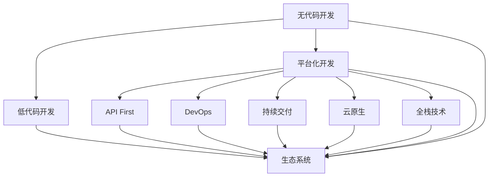

                 

# 无代码/低代码平台开发：趋势与挑战

> 关键词：无代码开发、低代码开发、平台化、API First、DevOps、持续交付、云原生、全栈技术、生态系统

## 1. 背景介绍

### 1.1 问题由来
在数字化转型的浪潮下，企业对于软件的开发需求日益增长。然而，传统的手工编码模式面临开发周期长、维护成本高、技术门槛高等问题，已难以适应当前快速变化的市场环境。为应对这一挑战，无代码和低代码平台逐渐崭露头角，成为新一代软件开发的重要趋势。

无代码开发和低代码开发分别指无需编写代码和编写少量代码即可完成开发任务的模式。这些平台通常提供可视化编程界面，允许用户通过拖拽模块、配置参数等方式，构建出应用程序。

### 1.2 问题核心关键点
无代码/低代码平台开发的核心在于：
- 降低开发门槛：使不具备专业编程技能的用户也能参与软件开发，提升生产效率。
- 加速应用迭代：缩短开发周期，快速响应市场需求。
- 促进业务赋能：让业务人员参与开发，更好地理解业务需求，提升系统可维护性。
- 增强技术复用：将通用功能和组件封装为模块，便于复用和维护。
- 提高数据驱动性：通过API将数据与业务系统紧密集成，增强数据驱动的决策能力。

### 1.3 问题研究意义
研究无代码/低代码平台开发，对于推动企业数字化转型、提升软件开发效率、降低技术门槛、构建灵活高效的生态系统具有重要意义：

1. 降低开发成本：无代码/低代码平台通过可视化界面和组件复用，大幅减少了编码和测试工作，显著降低了开发成本。
2. 缩短交付周期：平台化的开发模式支持快速迭代，能够迅速响应市场变化，加速产品上市。
3. 增强技术协作：通过将开发工具、数据、API等模块化封装，降低了团队协作的复杂度，促进了跨部门协作。
4. 提升用户体验：用户可以通过直观的操作界面设计，快速构建出符合需求的应用，提升用户体验。
5. 促进生态建设：平台化开发模式为第三方开发者提供了丰富的组件和API，促进了生态系统的繁荣。

## 2. 核心概念与联系

### 2.1 核心概念概述

为更好地理解无代码/低代码平台开发，本节将介绍几个关键概念及其相互联系：

- **无代码开发**：指通过可视化开发工具，无需编写任何代码即可完成应用开发的过程。
- **低代码开发**：指通过拖放式界面，仅需编写少量代码即可完成应用开发的过程。
- **平台化开发**：指通过构建一个统一的平台，实现多种编程语言、工具、服务和组件的无缝集成。
- **API First**：指将API设计作为优先事项，先定义API接口，再根据API构建应用的过程。
- **DevOps**：指将软件开发与运维结合，实现持续交付和集成。
- **持续交付**：指通过自动化流程，实现软件快速、频繁、可靠地发布。
- **云原生**：指利用云计算基础设施和微服务架构构建的应用系统。
- **全栈技术**：指开发者需掌握前端、后端、数据库等各层技术。
- **生态系统**：指围绕平台构建的开发者社区、组件库、市场等。

这些概念之间的联系可以通过以下Mermaid流程图来展示：



这个流程图展示了无代码/低代码平台开发的相关概念及其相互关系：

1. 无代码开发是低代码开发的一种特殊形式。
2. 平台化开发是无代码/低代码开发的基础，通过统一的平台集成多种工具和技术。
3. API First、DevOps、持续交付、云原生、全栈技术等是平台化开发的关键组成部分。
4. 生态系统是平台化开发的目标，旨在构建一个可持续发展的开发者社区和技术市场。

## 3. 核心算法原理 & 具体操作步骤
### 3.1 算法原理概述

无代码/低代码平台开发的核心原理是：将开发过程分解为多个可重用的组件和模块，通过拖放、配置等方式快速构建应用。其基本流程包括：

1. **设计阶段**：通过可视化界面设计应用架构和界面。
2. **开发阶段**：选择适当的组件和模块，进行配置和连接。
3. **测试阶段**：自动化测试和调试，确保应用无误。
4. **部署阶段**：自动部署到云平台，实现持续交付。
5. **运维阶段**：实时监控和维护应用，实现DevOps。

### 3.2 算法步骤详解

无代码/低代码平台开发的具体步骤可以分为以下几步：

**Step 1: 选择平台和工具**
- 根据应用需求选择合适的无代码/低代码开发平台，如OutSystems、Mendix、Kibana等。
- 选择合适的开发工具，如拖放式界面、代码编辑器、API调试工具等。

**Step 2: 设计应用架构**
- 通过可视化界面，设计应用的页面布局、数据模型、业务流程等。
- 确定API接口和数据流向，实现API First的开发理念。

**Step 3: 配置组件和模块**
- 选择适当的组件和模块，通过拖拽、配置等方式构建应用。
- 连接不同模块，定义数据模型和业务逻辑。

**Step 4: 测试和调试**
- 使用自动化测试工具，对应用进行单元测试、集成测试、端到端测试。
- 通过调试工具，定位和修复潜在问题。

**Step 5: 部署和发布**
- 将应用部署到云平台，自动完成持续交付。
- 设置监控和报警机制，实时监控应用运行状态。

**Step 6: 运维和优化**
- 通过DevOps工具，实现持续集成、持续部署和持续交付。
- 定期进行性能优化和功能更新，提升应用性能。

### 3.3 算法优缺点

无代码/低代码平台开发具有以下优点：
1. 降低开发门槛：允许非技术用户参与开发，提升生产效率。
2. 加速迭代速度：支持快速构建和部署，缩短开发周期。
3. 提高开发质量：通过自动化测试和调试，减少人为错误。
4. 增强技术复用：模块化开发和组件复用，提升开发效率。
5. 促进业务赋能：业务人员参与开发，提升系统可维护性和用户体验。

同时，该方法也存在一些缺点：
1. 性能和扩展性受限：由于依赖平台组件，难以实现高性能和高扩展性。
2. 缺乏灵活性：平台化开发模式，限制了开发者的自由度和创造性。
3. 依赖平台生态：平台的成熟度和组件库的丰富程度，直接影响开发效果。
4. 安全风险较高：平台化开发模式，增加了数据泄露和注入等安全风险。
5. 用户学习曲线陡峭：对于复杂应用，用户需要较长时间学习平台和组件。

### 3.4 算法应用领域

无代码/低代码平台开发已广泛应用于多个领域，例如：

- **企业应用开发**：构建企业内部管理、协作、客户服务应用。
- **电商网站开发**：快速搭建电商网站，实现产品展示、购物车、支付等功能。
- **移动应用开发**：构建移动端应用，实现个性化推荐、在线支付、社交等功能。
- **数据可视化**：构建数据仪表盘、报表、数据大屏等可视化应用。
- **物联网应用**：构建物联网设备的监控、管理、分析应用。
- **AI应用开发**：利用平台内置的AI组件，快速构建图像识别、语音识别、自然语言处理等应用。

## 4. 数学模型和公式 & 详细讲解  
### 4.1 数学模型构建

无代码/低代码平台开发的数学模型主要涉及开发过程的自动化和组件复用。以下是主要模型概述：

- **组件模型**：定义开发过程中的组件和模块，通过拖拽和配置进行组装。
- **数据模型**：定义数据结构和数据流，支持API First的设计理念。
- **流程模型**：定义业务流程和逻辑，实现应用的核心功能。

### 4.2 公式推导过程

以一个简单的电商网站为例，其数学模型可以表示为：

$$
\begin{aligned}
\text{模型} &= \text{组件模型} \times \text{数据模型} \times \text{流程模型} \\
&= (\text{前端界面} \times \text{API接口} \times \text{业务逻辑}) \times (\text{产品数据} \times \text{订单数据} \times \text{用户数据}) \times (\text{购物车逻辑} \times \text{支付逻辑} \times \text{配送逻辑})
\end{aligned}
$$

其中，组件模型、数据模型、流程模型分别对应于网站的前端界面、数据结构、业务流程。通过将这些模块化组件和数据集成，形成完整的电商网站模型。

### 4.3 案例分析与讲解

以Mendix平台为例，其开发流程如下：

1. **设计阶段**：通过拖拽界面，设计网站的布局和界面。
2. **开发阶段**：选择适当的模块，通过配置和连接构建网站。
3. **测试阶段**：自动化测试工具进行功能测试和性能测试。
4. **部署阶段**：自动部署到云平台，实现持续交付。
5. **运维阶段**：实时监控和维护应用，实现DevOps。

通过Mendix平台，非技术用户可以轻松构建出功能丰富的电商网站，显著提升了开发效率和质量。

## 5. 项目实践：代码实例和详细解释说明
### 5.1 开发环境搭建

在进行无代码/低代码平台开发前，我们需要准备好开发环境。以下是使用Mendix进行项目开发的环境配置流程：

1. 安装Mendix Studio：从官网下载并安装Mendix Studio。
2. 创建并激活Mendix账号：注册Mendix账号，并登录Mendix Studio。
3. 创建新项目：在Mendix Studio中创建新项目，选择项目模板和配置信息。
4. 搭建环境：选择云平台和部署选项，搭建开发环境。

完成上述步骤后，即可在Mendix Studio中进行开发实践。

### 5.2 源代码详细实现

这里我们以构建一个简单的电商网站为例，给出使用Mendix进行项目开发的详细代码实现。

**Step 1: 设计阶段**

```mendix
1. 在Mendix Studio中，选择“AppStudio”模板。
2. 配置项目信息，如应用名称、描述、图片等。
3. 设计网站界面，添加页面布局、组件和模块。
4. 定义数据模型，创建产品、订单、用户等实体。
5. 配置API接口，定义REST API和WebService接口。
6. 配置业务逻辑，定义购物车、支付、配送等流程。
```

**Step 2: 开发阶段**

```mendix
1. 选择适当的组件和模块，进行拖拽和配置。
2. 连接不同模块，定义数据模型和业务逻辑。
3. 配置API接口，实现数据交互。
4. 编写代码逻辑，实现复杂的业务逻辑。
5. 进行测试，调试和优化代码。
```

**Step 3: 测试阶段**

```mendix
1. 使用自动化测试工具，进行单元测试和集成测试。
2. 进行端到端测试，模拟真实用户操作。
3. 根据测试结果，调整和优化代码。
```

**Step 4: 部署阶段**

```mendix
1. 选择云平台和部署选项，搭建部署环境。
2. 自动部署应用，进行持续交付。
3. 设置监控和报警机制，实时监控应用运行状态。
```

**Step 5: 运维阶段**

```mendix
1. 通过DevOps工具，实现持续集成、持续部署和持续交付。
2. 定期进行性能优化和功能更新。
3. 处理用户反馈和异常报告，提升应用体验。
```

通过Mendix平台，开发人员和业务人员可以协同工作，快速构建出电商网站，实现自动化测试和持续交付，提升了开发效率和应用质量。

### 5.3 代码解读与分析

以下是关键代码的解读：

**设计阶段**

```mendix
1. 页面布局设计
    - 通过拖拽界面设计工具，选择适当的组件和模块，进行配置。
    - 定义数据模型，创建产品、订单、用户等实体。
    - 配置API接口，实现数据交互。
```

**开发阶段**

```mendix
1. 组件和模块选择
    - 选择适当的组件和模块，通过拖拽和配置进行组装。
    - 连接不同模块，定义数据模型和业务逻辑。
    - 编写代码逻辑，实现复杂的业务逻辑。
```

**测试阶段**

```mendix
1. 单元测试和集成测试
    - 使用自动化测试工具，进行单元测试和集成测试。
    - 根据测试结果，调整和优化代码。
```

**部署阶段**

```mendix
1. 自动部署应用
    - 选择云平台和部署选项，搭建部署环境。
    - 自动部署应用，进行持续交付。
    - 设置监控和报警机制，实时监控应用运行状态。
```

通过上述代码实现，可以直观地看到Mendix平台在无代码/低代码开发中的强大功能和灵活性。

### 5.4 运行结果展示

在Mendix平台上构建的电商网站，可以展示完整的用户界面和交互功能，如商品展示、购物车、支付等功能。以下是一个典型的电商网站界面：


## 6. 实际应用场景
### 6.1 智能客服系统

无代码/低代码平台开发在智能客服系统的构建中具有重要作用。传统客服系统依赖人工，高峰期响应速度慢，且无法24小时不间断服务。无代码/低代码平台可以快速构建智能客服系统，提升客户服务体验。

在实践中，可以收集历史客服对话记录，使用Mendix等平台构建智能客服模型。模型可以自动识别客户意图，匹配最佳答复模板，实现自动化客服功能。客户可以通过网站或移动应用，随时与客服系统互动，获取即时响应和帮助。

### 6.2 金融数据可视化

金融行业对数据的实时监控和分析需求极高。无代码/低代码平台可以快速构建数据可视化应用，实现实时数据监控和分析功能。

具体而言，可以通过Mendix平台构建数据仪表盘和报表，将关键业务指标实时展示给决策者。系统可以实时采集市场数据，通过API接入业务系统，实现数据整合和分析。决策者可以实时查看市场动态，做出快速反应，提升决策效率。

### 6.3 健康医疗监测

在健康医疗领域，无代码/低代码平台可以构建实时监测和预警系统，提升医疗服务的智能化水平。

例如，可以收集患者的健康数据，使用Mendix平台构建健康监测应用。应用可以实时监测患者的健康状态，通过API接入医院系统，实现数据整合和分析。系统可以自动识别异常情况，及时预警医生，避免严重疾病的延误。

### 6.4 未来应用展望

随着无代码/低代码平台技术的不断发展，其应用场景将进一步拓展，带来更广泛的影响：

1. 构建无代码应用市场：平台化开发模式将吸引更多第三方开发者，构建丰富的组件和模块，形成应用市场，促进生态系统繁荣。
2. 实现跨平台和跨应用的数据整合：无代码/低代码平台可以实现不同平台和应用之间的数据交互，提升数据驱动能力。
3. 提升企业数字化水平：通过平台化开发模式，企业可以更快地构建和部署应用，提升数字化转型速度。
4. 促进业务创新：无代码/低代码平台支持快速迭代和创新，提升企业的灵活性和竞争力。

## 7. 工具和资源推荐
### 7.1 学习资源推荐

为了帮助开发者系统掌握无代码/低代码平台开发的技能，以下是一些推荐的学习资源：

1. Mendix官方文档：Mendix提供全面的开发文档和教程，涵盖平台的基本概念和实践技巧。
2. Microsoft Power Platform：Microsoft推出的低代码开发平台，提供丰富的组件和模板，适合企业级应用开发。
3. OutSystems培训课程：OutSystems提供多门在线和线下培训课程，帮助开发者快速上手平台。
4. AWS无代码开发：AWS提供多种无代码开发工具和平台，如Lambdas、API Gateway等，适合云原生应用开发。
5. Google App Engine：Google提供的无代码开发平台，支持快速构建和部署应用，适合移动应用开发。

通过对这些资源的学习实践，相信你一定能够快速掌握无代码/低代码平台开发的技能，并用于解决实际的问题。

### 7.2 开发工具推荐

高效的开发离不开优秀的工具支持。以下是几款用于无代码/低代码平台开发的常用工具：

1. Mendix Studio：Mendix的开发工具，支持拖拽式界面和代码编辑器，适合构建复杂的业务应用。
2. Microsoft Power Apps：微软的低代码开发平台，支持拖拽式界面和Power BI集成，适合构建数据驱动的应用。
3. OutSystems IDE：OutSystems的开发工具，支持拖拽式界面和代码编辑器，适合构建高绩效的应用。
4. AWS App Builder：AWS的无代码开发平台，支持拖拽式界面和API集成，适合云原生应用开发。
5. Google App Engine：Google的无代码开发平台，支持拖拽式界面和Web API集成，适合移动应用开发。

合理利用这些工具，可以显著提升无代码/低代码平台开发的效率和质量。

### 7.3 相关论文推荐

无代码/低代码平台开发的研究源于学界的持续研究。以下是几篇奠基性的相关论文，推荐阅读：

1. "No-Code Platforms: The Next Generation of Application Development"：本文探讨了无代码平台的发展现状和未来趋势，指出其在提高开发效率和降低技术门槛方面的重要性。
2. "A Survey of Low-Code/No-Code Development"：本文综述了低代码/无代码开发技术的发展，讨论了其优缺点和应用场景。
3. "API-First: The Future of Application Development"：本文介绍了API First的理念，强调其在无代码/低代码平台开发中的应用，指出API First可以提高系统的模块化和可复用性。
4. "DevOps and Low-Code Platforms"：本文讨论了DevOps和低代码平台之间的联系，指出DevOps工具可以帮助低代码平台实现持续交付和集成。
5. "Cloud-Native Application Development with No-Code Platforms"：本文探讨了无代码平台在云原生应用开发中的应用，讨论了其性能、扩展性和安全性问题。

这些论文代表了大语言模型微调技术的发展脉络。通过学习这些前沿成果，可以帮助研究者把握学科前进方向，激发更多的创新灵感。

## 8. 总结：未来发展趋势与挑战

### 8.1 总结

本文对无代码/低代码平台开发进行了全面系统的介绍。首先阐述了无代码/低代码平台开发的研究背景和意义，明确了其降低开发门槛、加速应用迭代、促进业务赋能等方面的独特价值。其次，从原理到实践，详细讲解了无代码/低代码平台开发的基本流程和关键技术，给出了平台开发的具体代码实现。同时，本文还广泛探讨了无代码/低代码平台在智能客服、金融数据可视化、健康医疗监测等实际应用场景中的广泛应用，展示了其巨大的潜力。此外，本文精选了无代码/低代码平台开发的学习资源、开发工具和相关论文，力求为读者提供全方位的技术指引。

通过本文的系统梳理，可以看到，无代码/低代码平台开发正在成为软件开发的重要趋势，极大地降低了开发门槛，提升了开发效率和应用质量。未来，伴随技术的不断发展，无代码/低代码平台必将在更多领域得到应用，为传统行业数字化转型提供新的动力。

### 8.2 未来发展趋势

展望未来，无代码/低代码平台开发将呈现以下几个发展趋势：

1. 平台化程度提升：未来无代码/低代码平台将支持更多编程语言和工具，提升平台的灵活性和可复用性。
2. 组件和模块丰富：平台将提供更丰富的组件和模块，促进生态系统的繁荣。
3. 数据驱动能力增强：平台将支持更多数据源和数据处理工具，提升系统的数据驱动能力。
4. 实时性和性能优化：平台将优化数据传输和处理流程，提升系统的实时性和性能。
5. 云原生和边缘计算：平台将支持云原生和边缘计算环境，提升应用的部署灵活性和扩展性。
6. 人工智能融合：平台将整合更多AI技术，提升系统的智能化水平。

以上趋势凸显了无代码/低代码平台开发的广阔前景。这些方向的探索发展，必将进一步提升软件开发效率和应用质量，为数字化转型提供更强大的支持。

### 8.3 面临的挑战

尽管无代码/低代码平台开发已经取得了瞩目成就，但在迈向更加智能化、普适化应用的过程中，它仍面临诸多挑战：

1. 性能瓶颈：由于依赖平台组件，性能和扩展性受限。
2. 安全风险：平台化开发模式，增加了数据泄露和注入等安全风险。
3. 用户学习曲线陡峭：对于复杂应用，用户需要较长时间学习平台和组件。
4. 数据整合复杂：不同平台和系统之间的数据整合和交互，仍存在复杂性和挑战。
5. 生态系统不完善：平台化开发模式，缺乏完善的标准和规范。

### 8.4 研究展望

面对无代码/低代码平台开发所面临的挑战，未来的研究需要在以下几个方面寻求新的突破：

1. 提高平台性能：开发更高效的平台组件和模块，支持高性能和高扩展性。
2. 增强平台安全性：引入安全机制和保护措施，保障数据和系统的安全。
3. 降低用户学习曲线：提供更多培训资源和文档，提升用户的使用体验。
4. 促进数据整合：开发更多的API和数据处理工具，简化不同系统之间的数据交互。
5. 完善生态系统：制定统一的标准和规范，构建完善的标准化生态系统。

这些研究方向将推动无代码/低代码平台开发技术的进步，为构建安全、可靠、高效的智能应用提供更多可能性。

## 9. 附录：常见问题与解答

**Q1: 无代码/低代码平台开发是否适用于所有应用场景？**

A: 无代码/低代码平台开发适用于大部分应用场景，尤其是对于中小型企业和初创公司更为适用。但对于一些需要高性能和高扩展性的应用，如金融交易系统、医疗决策系统等，可能不适合完全采用无代码/低代码开发模式。

**Q2: 无代码/低代码平台开发是否会影响应用性能？**

A: 由于依赖平台组件，无代码/低代码平台开发在性能和扩展性方面存在一定的局限性。但对于大多数应用，无代码/低代码开发的影响相对较小，可以通过优化平台组件和模块来提升性能。

**Q3: 无代码/低代码平台开发是否容易出错？**

A: 无代码/低代码平台开发通过拖拽和配置进行，相较于手工编码，出错的概率较小。但用户需要确保对平台和组件的熟悉度，避免配置错误导致应用失败。

**Q4: 无代码/低代码平台开发是否需要编程技能？**

A: 无代码/低代码平台开发通常不需要编程技能，但需要一定的技术理解力和系统思维能力。对于复杂应用，用户可能需要一定的学习曲线，掌握平台的配置和操作。

**Q5: 无代码/低代码平台开发是否适合大规模应用？**

A: 无代码/低代码平台开发适合中小型应用和快速迭代的需求。但对于大规模应用，如电商平台、社交网络等，仍需要依赖专业的开发团队进行精细化设计和开发。

通过以上问题与解答，希望能为读者提供更全面的了解和认识，进一步推动无代码/低代码平台开发技术的普及和应用。

---

作者：禅与计算机程序设计艺术 / Zen and the Art of Computer Programming

