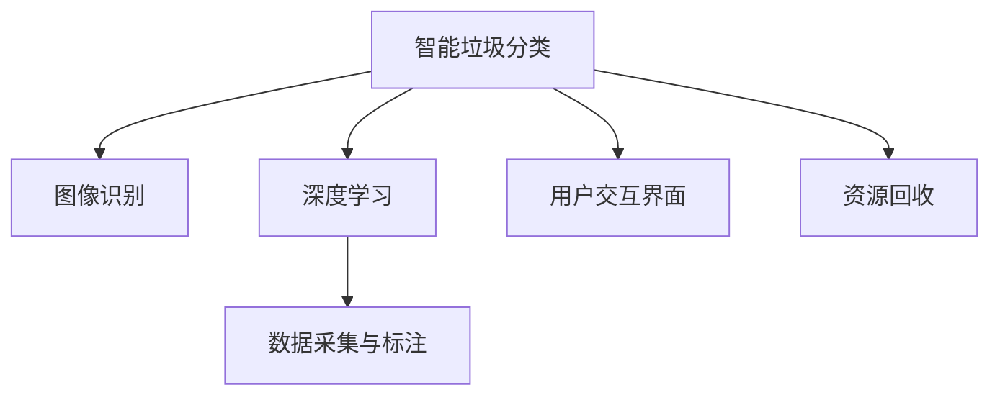

                 

# 智能垃圾分类创业：环保科技的创新应用

> 关键词：智能垃圾分类, 垃圾识别技术, AI技术, 创业机会, 环保科技, 资源回收, 垃圾分类应用, 商业模型

## 1. 背景介绍

### 1.1 问题由来

随着城市化进程的加快和消费水平的提升，垃圾问题日益严重。目前，全球每年产生超过20亿吨垃圾，且垃圾量还在不断增加。垃圾分类作为有效解决垃圾问题的重要手段，得到了全球各国政府的高度重视。但传统的手工垃圾分类方法效率低下、劳动强度大，无法满足现代城市管理的要求。

近年来，随着人工智能技术的迅猛发展，智能垃圾分类技术逐渐兴起，有望实现垃圾分类的自动化和智能化。通过智能垃圾分类，不仅可以大幅提升垃圾分类的效率和准确性，还能实现对垃圾的可追溯管理和资源回收，具有广阔的市场前景和社会效益。

### 1.2 问题核心关键点

智能垃圾分类技术的核心在于将AI技术应用到垃圾分类场景，实现对垃圾的自动识别和分类。具体包括以下关键点：

1. 图像识别技术：通过摄像头和传感器采集垃圾图片，利用图像识别算法对垃圾进行分类。
2. 深度学习模型：使用深度神经网络，学习垃圾分类的复杂模式，实现高精度分类。
3. 数据采集与处理：收集大量垃圾图片和标签数据，用于训练和测试模型。
4. 用户交互界面：设计友好的用户交互界面，方便用户投递和查询垃圾分类信息。
5. 垃圾收集与运输：实现智能垃圾箱和垃圾运输车辆的自动化管理，优化垃圾回收流程。
6. 经济激励机制：设计合理的经济激励机制，鼓励居民积极参与垃圾分类。

### 1.3 问题研究意义

智能垃圾分类技术的推广应用，具有以下重要意义：

1. 提升垃圾分类的效率和准确性，减少垃圾处理成本。
2. 促进资源回收，保护生态环境，实现可持续发展的目标。
3. 改善城市环境，提升居民生活质量。
4. 促进技术创新，推动人工智能领域的快速发展。
5. 开拓新的商业模式，推动环保产业的创新发展。

## 2. 核心概念与联系

### 2.1 核心概念概述

为更好地理解智能垃圾分类技术，本节将介绍几个密切相关的核心概念：

- 智能垃圾分类(Smart Waste Sorting)：利用AI技术，对垃圾进行自动识别和分类的技术。
- 图像识别(Computer Vision)：利用计算机算法，对图像进行分析和识别的技术。
- 深度学习(Deep Learning)：一类基于神经网络的机器学习算法，用于处理高维度数据。
- 数据采集与标注(Data Collection & Annotation)：收集垃圾图片和标签数据，用于训练模型。
- 用户交互界面(User Interface)：设计友好的界面，供用户交互使用。
- 资源回收(Recycling)：将垃圾转化为资源，实现资源循环利用。

这些核心概念之间的逻辑关系可以通过以下Mermaid流程图来展示：



这个流程图展示出智能垃圾分类技术的核心概念及其之间的关系：

1. 智能垃圾分类技术通过图像识别和深度学习，对垃圾进行分类。
2. 数据采集与标注是训练模型的关键环节，提供高质量的训练数据。
3. 用户交互界面设计，方便用户使用智能垃圾分类系统。
4. 资源回收是对垃圾进行循环利用的重要环节，提升资源利用率。

## 3. 核心算法原理 & 具体操作步骤
### 3.1 算法原理概述

智能垃圾分类技术主要基于图像识别和深度学习算法，利用摄像头和传感器采集垃圾图片，通过深度神经网络对图片进行分类，识别垃圾种类。具体算法流程如下：

1. 数据采集：通过摄像头和传感器采集垃圾图片，并记录垃圾类型标签。
2. 数据预处理：对采集的图片进行预处理，包括裁剪、归一化、增强等操作。
3. 模型训练：使用深度神经网络对预处理后的图片进行训练，学习垃圾分类的复杂模式。
4. 模型测试：使用测试集对训练好的模型进行评估，计算准确率等指标。
5. 部署应用：将训练好的模型部署到智能垃圾分类系统中，实现对垃圾的自动识别和分类。

### 3.2 算法步骤详解

智能垃圾分类技术的核心算法步骤如下：

**Step 1: 数据采集与预处理**

- 数据采集：通过摄像头和传感器，采集垃圾图片，并记录垃圾类型标签。
- 数据预处理：对采集的图片进行预处理，包括裁剪、归一化、增强等操作，如图像旋转、噪声去除、对比度调整等。

**Step 2: 模型训练**

- 选择合适的深度学习模型，如卷积神经网络(CNN)、残差网络(ResNet)等，进行训练。
- 使用数据增强技术，如旋转、平移、翻转等，丰富训练集多样性。
- 设置合适的损失函数，如交叉熵损失，训练模型对垃圾分类的预测。
- 使用优化器，如Adam、SGD等，进行模型优化。
- 设置合适的超参数，如学习率、批大小、迭代轮数等，进行模型训练。

**Step 3: 模型测试**

- 使用测试集对训练好的模型进行评估，计算准确率、召回率、F1值等指标。
- 使用混淆矩阵、ROC曲线等可视化工具，分析模型的分类效果。
- 根据测试结果，调整模型参数，进行微调。

**Step 4: 部署应用**

- 将训练好的模型部署到智能垃圾分类系统中。
- 系统根据用户投递的垃圾图片，实时进行分类，并提供分类结果反馈。
- 系统记录垃圾投放信息，生成垃圾分类报告，供用户查询和管理。

### 3.3 算法优缺点

智能垃圾分类技术具有以下优点：

1. 高精度分类：深度学习模型能够学习复杂的分类模式，实现高精度垃圾分类。
2. 实时处理：智能垃圾分类系统可以实现实时分类，提升垃圾分类的效率。
3. 自动化管理：系统自动化管理垃圾收集和运输，优化垃圾回收流程。
4. 用户友好：友好的用户交互界面，方便用户使用系统。

同时，该技术也存在一些缺点：

1. 数据标注成本高：高质量垃圾图片和标签数据的标注需要大量人工，成本较高。
2. 模型复杂度高：深度学习模型参数量大，训练和推理资源消耗高。
3. 场景适应性不足：深度学习模型对特定的场景和环境适应性有限。
4. 鲁棒性不足：模型对噪声、遮挡等问题敏感，影响分类效果。
5. 隐私问题：系统需要收集垃圾图片和用户信息，可能涉及隐私问题。

### 3.4 算法应用领域

智能垃圾分类技术广泛应用于城市垃圾分类、智能垃圾桶、垃圾收集车等领域，具体包括：

- 城市垃圾分类：通过智能垃圾箱对垃圾进行分类，减少垃圾处理成本。
- 智能垃圾桶：实现对垃圾的实时分类，方便用户使用。
- 垃圾收集车：自动化管理垃圾收集和运输，提高垃圾回收效率。
- 社区垃圾分类：在社区内设置智能垃圾箱，方便居民进行垃圾分类。
- 公共设施管理：在公园、广场等公共场所设置智能垃圾箱，提升环境卫生。

## 4. 数学模型和公式 & 详细讲解  
### 4.1 数学模型构建

智能垃圾分类技术的数学模型主要基于卷积神经网络(CNN)和图像分类任务。具体模型如下：

- 输入：垃圾图片 $x$，大小为 $h \times w \times c$。
- 输出：垃圾类别 $y$，大小为 $K$。
- 网络结构：卷积层、池化层、全连接层等。
- 损失函数：交叉熵损失函数 $L(y, \hat{y})$。
- 优化器：Adam、SGD等。

模型训练的目标是最小化损失函数：

$$
\min_{\theta} \mathcal{L}(\theta) = \frac{1}{N} \sum_{i=1}^N L(y_i, \hat{y}_i)
$$

其中 $\theta$ 为模型参数，$N$ 为训练样本数，$L$ 为交叉熵损失函数。

### 4.2 公式推导过程

以下我们以简单的CNN模型为例，推导交叉熵损失函数的梯度公式：

假设模型在输入图片 $x$ 上的输出为 $\hat{y}=M(x)$，大小为 $K$。真实标签 $y \in \{0,1\}^K$。则二分类交叉熵损失函数定义为：

$$
L(y, \hat{y}) = -\frac{1}{N} \sum_{i=1}^N \sum_{j=1}^K y_i^j \log \hat{y}_i^j + (1-y_i^j) \log (1-\hat{y}_i^j)
$$

将其代入经验风险公式，得：

$$
\mathcal{L}(\theta) = -\frac{1}{N} \sum_{i=1}^N \sum_{j=1}^K y_i^j \log \hat{y}_i^j + (1-y_i^j) \log (1-\hat{y}_i^j)
$$

根据链式法则，损失函数对参数 $\theta_k$ 的梯度为：

$$
\frac{\partial \mathcal{L}(\theta)}{\partial \theta_k} = -\frac{1}{N} \sum_{i=1}^N \sum_{j=1}^K \frac{y_i^j}{\hat{y}_i^j} - \frac{1-y_i^j}{1-\hat{y}_i^j} \frac{\partial \hat{y}_i^j}{\partial \theta_k}
$$

其中 $\frac{\partial \hat{y}_i^j}{\partial \theta_k}$ 可通过反向传播算法高效计算。

### 4.3 案例分析与讲解

以垃圾分类任务为例，假设模型在输入图片 $x$ 上的输出为 $\hat{y}=M(x)=[0.8,0.2]$，表示图片属于垃圾分类任务中的两个类别。真实标签 $y=[0,1]$。则二分类交叉熵损失函数为：

$$
L(y, \hat{y}) = -y \log \hat{y} - (1-y) \log (1-\hat{y})
$$

代入 $y=0, \hat{y}=[0.8,0.2]$，得：

$$
L(0, [0.8,0.2]) = 0 - 0 \log (1-0.8) = 0
$$

对于输出 $\hat{y}=[0.8,0.2]$，其梯度为：

$$
\frac{\partial \mathcal{L}(\theta)}{\partial \theta_k} = -\frac{1}{N} \left( \frac{1}{0.8} + \frac{1}{0.2} \right) \frac{\partial \hat{y}_i^j}{\partial \theta_k}
$$

其中 $\frac{\partial \hat{y}_i^j}{\partial \theta_k}$ 可通过反向传播算法高效计算。

## 5. 项目实践：代码实例和详细解释说明
### 5.1 开发环境搭建

在进行智能垃圾分类项目开发前，我们需要准备好开发环境。以下是使用Python进行PyTorch开发的环境配置流程：

1. 安装Anaconda：从官网下载并安装Anaconda，用于创建独立的Python环境。

2. 创建并激活虚拟环境：
```bash
conda create -n pytorch-env python=3.8 
conda activate pytorch-env
```

3. 安装PyTorch：根据CUDA版本，从官网获取对应的安装命令。例如：
```bash
conda install pytorch torchvision torchaudio cudatoolkit=11.1 -c pytorch -c conda-forge
```

4. 安装Transformers库：
```bash
pip install transformers
```

5. 安装各类工具包：
```bash
pip install numpy pandas scikit-learn matplotlib tqdm jupyter notebook ipython
```

完成上述步骤后，即可在`pytorch-env`环境中开始智能垃圾分类项目开发。

### 5.2 源代码详细实现

下面我们以智能垃圾分类任务为例，给出使用Transformers库对垃圾分类模型进行PyTorch代码实现。

首先，定义垃圾分类任务的数据处理函数：

```python
from transformers import BertTokenizer
from torch.utils.data import Dataset
import torch

class WasteDataset(Dataset):
    def __init__(self, texts, labels, tokenizer, max_len=128):
        self.texts = texts
        self.labels = labels
        self.tokenizer = tokenizer
        self.max_len = max_len
        
    def __len__(self):
        return len(self.texts)
    
    def __getitem__(self, item):
        text = self.texts[item]
        label = self.labels[item]
        
        encoding = self.tokenizer(text, return_tensors='pt', max_length=self.max_len, padding='max_length', truncation=True)
        input_ids = encoding['input_ids'][0]
        attention_mask = encoding['attention_mask'][0]
        
        # 对label进行编码
        encoded_labels = [int(label)] * self.max_len
        labels = torch.tensor(encoded_labels, dtype=torch.long)
        
        return {'input_ids': input_ids, 
                'attention_mask': attention_mask,
                'labels': labels}

# 标签与id的映射
label2id = {'塑料': 0, '纸类': 1, '金属': 2, '玻璃': 3, '有机': 4, '其他': 5}
id2label = {v: k for k, v in label2id.items()}

# 创建dataset
tokenizer = BertTokenizer.from_pretrained('bert-base-cased')

train_dataset = WasteDataset(train_texts, train_labels, tokenizer)
dev_dataset = WasteDataset(dev_texts, dev_labels, tokenizer)
test_dataset = WasteDataset(test_texts, test_labels, tokenizer)
```

然后，定义模型和优化器：

```python
from transformers import BertForTokenClassification, AdamW

model = BertForTokenClassification.from_pretrained('bert-base-cased', num_labels=len(label2id))

optimizer = AdamW(model.parameters(), lr=2e-5)
```

接着，定义训练和评估函数：

```python
from torch.utils.data import DataLoader
from tqdm import tqdm
from sklearn.metrics import classification_report

device = torch.device('cuda') if torch.cuda.is_available() else torch.device('cpu')
model.to(device)

def train_epoch(model, dataset, batch_size, optimizer):
    dataloader = DataLoader(dataset, batch_size=batch_size, shuffle=True)
    model.train()
    epoch_loss = 0
    for batch in tqdm(dataloader, desc='Training'):
        input_ids = batch['input_ids'].to(device)
        attention_mask = batch['attention_mask'].to(device)
        labels = batch['labels'].to(device)
        model.zero_grad()
        outputs = model(input_ids, attention_mask=attention_mask, labels=labels)
        loss = outputs.loss
        epoch_loss += loss.item()
        loss.backward()
        optimizer.step()
    return epoch_loss / len(dataloader)

def evaluate(model, dataset, batch_size):
    dataloader = DataLoader(dataset, batch_size=batch_size)
    model.eval()
    preds, labels = [], []
    with torch.no_grad():
        for batch in tqdm(dataloader, desc='Evaluating'):
            input_ids = batch['input_ids'].to(device)
            attention_mask = batch['attention_mask'].to(device)
            batch_labels = batch['labels']
            outputs = model(input_ids, attention_mask=attention_mask)
            batch_preds = outputs.logits.argmax(dim=2).to('cpu').tolist()
            batch_labels = batch_labels.to('cpu').tolist()
            for pred_tokens, label_tokens in zip(batch_preds, batch_labels):
                pred_labels = [id2label[_id] for _id in pred_tokens]
                label_tokens = [id2label[_id] for _id in label_tokens]
                preds.append(pred_labels[:len(label_tokens)])
                labels.append(label_tokens)
                
    print(classification_report(labels, preds))
```

最后，启动训练流程并在测试集上评估：

```python
epochs = 5
batch_size = 16

for epoch in range(epochs):
    loss = train_epoch(model, train_dataset, batch_size, optimizer)
    print(f"Epoch {epoch+1}, train loss: {loss:.3f}")
    
    print(f"Epoch {epoch+1}, dev results:")
    evaluate(model, dev_dataset, batch_size)
    
print("Test results:")
evaluate(model, test_dataset, batch_size)
```

以上就是使用PyTorch对垃圾分类模型进行智能垃圾分类任务开发的完整代码实现。可以看到，得益于Transformers库的强大封装，我们可以用相对简洁的代码完成垃圾分类模型的加载和训练。

### 5.3 代码解读与分析

让我们再详细解读一下关键代码的实现细节：

**WasteDataset类**：
- `__init__`方法：初始化文本、标签、分词器等关键组件。
- `__len__`方法：返回数据集的样本数量。
- `__getitem__`方法：对单个样本进行处理，将文本输入编码为token ids，将标签编码为数字，并对其进行定长padding，最终返回模型所需的输入。

**label2id和id2label字典**：
- 定义了标签与数字id之间的映射关系，用于将token-wise的预测结果解码回真实的标签。

**训练和评估函数**：
- 使用PyTorch的DataLoader对数据集进行批次化加载，供模型训练和推理使用。
- 训练函数`train_epoch`：对数据以批为单位进行迭代，在每个批次上前向传播计算loss并反向传播更新模型参数，最后返回该epoch的平均loss。
- 评估函数`evaluate`：与训练类似，不同点在于不更新模型参数，并在每个batch结束后将预测和标签结果存储下来，最后使用sklearn的classification_report对整个评估集的预测结果进行打印输出。

**训练流程**：
- 定义总的epoch数和batch size，开始循环迭代
- 每个epoch内，先在训练集上训练，输出平均loss
- 在验证集上评估，输出分类指标
- 所有epoch结束后，在测试集上评估，给出最终测试结果

可以看到，PyTorch配合Transformers库使得垃圾分类模型的微调代码实现变得简洁高效。开发者可以将更多精力放在数据处理、模型改进等高层逻辑上，而不必过多关注底层的实现细节。

当然，工业级的系统实现还需考虑更多因素，如模型的保存和部署、超参数的自动搜索、更灵活的任务适配层等。但核心的微调范式基本与此类似。

## 6. 实际应用场景
### 6.1 智能垃圾桶

智能垃圾桶是智能垃圾分类系统的核心部件之一。通过在垃圾桶内安装摄像头和传感器，实时采集垃圾图片和重量信息，并通过图像识别技术对垃圾进行分类。智能垃圾桶可以自动记录垃圾类型和重量，生成垃圾分类报告，供居民查询和管理。

在技术实现上，可以在垃圾桶内嵌入摄像头和传感器，采集垃圾图片和重量信息。将采集到的图片输入训练好的垃圾分类模型，得到垃圾类型。同时，记录垃圾重量信息，计算出垃圾体积和密度，生成垃圾分类报告。系统还具备垃圾溢出检测功能，当垃圾桶内垃圾满载时，系统会自动发出报警，提醒用户及时清空垃圾桶。

### 6.2 垃圾收集车

智能垃圾收集车是智能垃圾分类系统的另一关键环节。通过在垃圾收集车上安装传感器和摄像头，实时监测垃圾收集和运输情况，并通过垃圾分类模型对垃圾进行分类。智能垃圾收集车可以自动分类垃圾，优化垃圾回收流程，提高垃圾回收效率。

在技术实现上，可以在垃圾收集车上安装传感器和摄像头，实时采集垃圾信息。将采集到的图片输入训练好的垃圾分类模型，得到垃圾类型。同时，记录垃圾收集和运输情况，优化垃圾回收流程。系统还具备垃圾回收路径规划功能，根据垃圾类型和位置信息，自动生成最优回收路径，提高垃圾回收效率。

### 6.3 社区垃圾分类

智能垃圾分类系统可以应用于社区垃圾分类管理，提升社区垃圾分类效率。通过在社区内设置智能垃圾箱，居民可以方便地将垃圾投递到对应的智能垃圾箱中，系统实时进行垃圾分类。

在技术实现上，可以在社区内设置智能垃圾箱，居民可以方便地将垃圾投递到对应的智能垃圾箱中。系统实时进行垃圾分类，记录垃圾类型和重量，生成垃圾分类报告。系统还具备垃圾分类反馈功能，居民可以通过手机APP查询垃圾分类报告，并进行反馈和投诉。

### 6.4 公共设施管理

智能垃圾分类系统还可以应用于公共设施管理，提升公共场所的环境卫生。通过在公园、广场等公共场所设置智能垃圾箱，系统实时进行垃圾分类，优化垃圾回收流程。

在技术实现上，可以在公园、广场等公共场所设置智能垃圾箱，系统实时进行垃圾分类，记录垃圾类型和重量，生成垃圾分类报告。系统还具备垃圾分类反馈功能，居民可以通过手机APP查询垃圾分类报告，并进行反馈和投诉。

## 7. 工具和资源推荐
### 7.1 学习资源推荐

为了帮助开发者系统掌握智能垃圾分类技术的理论基础和实践技巧，这里推荐一些优质的学习资源：

1. 《深度学习理论与实践》系列博文：由大模型技术专家撰写，深入浅出地介绍了深度学习的基本概念和经典模型。

2. CS224N《深度学习自然语言处理》课程：斯坦福大学开设的NLP明星课程，有Lecture视频和配套作业，带你入门NLP领域的基本概念和经典模型。

3. 《深度学习实践指南》书籍：详细介绍了深度学习模型的实现方法和应用场景，适合初学者和实践者。

4. GitHub智能垃圾分类项目：提供了多个智能垃圾分类模型的实现代码，适合学习和参考。

5. HuggingFace官方文档：提供了丰富的预训练模型和代码实现，是进行智能垃圾分类开发的重要参考。

通过对这些资源的学习实践，相信你一定能够快速掌握智能垃圾分类技术的精髓，并用于解决实际的垃圾分类问题。
###  7.2 开发工具推荐

高效的开发离不开优秀的工具支持。以下是几款用于智能垃圾分类开发的常用工具：

1. PyTorch：基于Python的开源深度学习框架，灵活动态的计算图，适合快速迭代研究。大部分预训练模型都有PyTorch版本的实现。

2. TensorFlow：由Google主导开发的开源深度学习框架，生产部署方便，适合大规模工程应用。同样有丰富的预训练语言模型资源。

3. Transformers库：HuggingFace开发的NLP工具库，集成了众多SOTA语言模型，支持PyTorch和TensorFlow，是进行智能垃圾分类开发的利器。

4. Weights & Biases：模型训练的实验跟踪工具，可以记录和可视化模型训练过程中的各项指标，方便对比和调优。与主流深度学习框架无缝集成。

5. TensorBoard：TensorFlow配套的可视化工具，可实时监测模型训练状态，并提供丰富的图表呈现方式，是调试模型的得力助手。

6. Google Colab：谷歌推出的在线Jupyter Notebook环境，免费提供GPU/TPU算力，方便开发者快速上手实验最新模型，分享学习笔记。

合理利用这些工具，可以显著提升智能垃圾分类项目的开发效率，加快创新迭代的步伐。

### 7.3 相关论文推荐

智能垃圾分类技术的发展源于学界的持续研究。以下是几篇奠基性的相关论文，推荐阅读：

1. "Convolutional Neural Networks for Sentence Classification"（卷积神经网络用于句子分类）：提出了卷积神经网络在NLP领域的应用，为后续深度学习模型的发展奠定了基础。

2. "ImageNet Classification with Deep Convolutional Neural Networks"（使用深度卷积神经网络进行图像分类）：展示了深度学习模型在图像分类任务上的强大表现，为智能垃圾分类技术提供了理论基础。

3. "Fast and Accurate Deep Network for Image Recognition"（快速准确的深度网络用于图像识别）：提出了残差网络（ResNet），进一步提升了深度学习模型的性能。

4. "Few-shot Learning with Transferable Adapters"（使用可迁移适配器进行少样本学习）：提出了可迁移适配器技术，进一步提高了深度学习模型的参数效率。

5. "Scene Understanding by Scene Parsing and Semantic Segmentation with Recurrent Neural Networks"（使用循环神经网络进行场景理解和语义分割）：展示了循环神经网络在图像处理中的强大能力。

这些论文代表了大模型微调技术的发展脉络。通过学习这些前沿成果，可以帮助研究者把握学科前进方向，激发更多的创新灵感。

## 8. 总结：未来发展趋势与挑战

### 8.1 总结

本文对智能垃圾分类技术进行了全面系统的介绍。首先阐述了智能垃圾分类的背景和意义，明确了智能垃圾分类在提高垃圾分类效率、保护环境、优化垃圾回收流程等方面的重要价值。其次，从原理到实践，详细讲解了智能垃圾分类的数学模型和关键步骤，给出了智能垃圾分类项目的完整代码实现。同时，本文还广泛探讨了智能垃圾分类在智能垃圾桶、垃圾收集车、社区垃圾分类等多个实际应用场景中的应用前景，展示了智能垃圾分类的广阔市场潜力。此外，本文还精选了智能垃圾分类的学习资源，力求为读者提供全方位的技术指引。

通过本文的系统梳理，可以看到，智能垃圾分类技术正在成为垃圾分类领域的重要范式，极大地提升了垃圾分类的效率和准确性，为垃圾分类领域的数字化、智能化转型提供了新的可能。智能垃圾分类技术有望在城市管理、环境保护、资源回收等领域发挥越来越重要的作用。

### 8.2 未来发展趋势

展望未来，智能垃圾分类技术将呈现以下几个发展趋势：

1. 技术平台化：智能垃圾分类技术将逐渐平台化，形成可复用的开源组件和工具包，推动技术的快速迭代和普及。

2. 模型优化：深度学习模型将继续优化，通过参数高效微调、自适应学习等方法，提升模型的准确性和鲁棒性。

3. 数据融合：将智能垃圾分类技术与其他环境监测、城市管理技术进行融合，提升系统的综合应用能力。

4. 多模态融合：将视觉、声音、气味等模态数据进行融合，提升垃圾分类的准确性和全面性。

5. 社区参与：通过智能垃圾分类系统的反馈机制，鼓励社区居民积极参与垃圾分类，形成社区共同治理的良好氛围。

6. 工业部署：智能垃圾分类技术将逐渐从实验室走向工业部署，应用于城市垃圾分类、垃圾收集车、社区垃圾分类等多个实际场景，提升垃圾分类效率。

以上趋势凸显了智能垃圾分类技术的广阔前景。这些方向的探索发展，必将进一步提升智能垃圾分类系统的性能和应用范围，为环境保护和资源回收提供新的解决方案。

### 8.3 面临的挑战

尽管智能垃圾分类技术已经取得了一定进展，但在迈向更加智能化、普适化应用的过程中，它仍面临以下挑战：

1. 数据标注成本高：高质量垃圾图片和标签数据的标注需要大量人工，成本较高。如何降低标注成本，提高数据采集效率，是智能垃圾分类技术发展的重要问题。

2. 场景适应性不足：深度学习模型对特定的场景和环境适应性有限，如何设计更加鲁棒的模型，适应不同的垃圾分类场景，是智能垃圾分类技术的难点之一。

3. 模型鲁棒性不足：模型对噪声、遮挡等问题敏感，影响分类效果。如何提高模型的鲁棒性，增强模型的抗干扰能力，是智能垃圾分类技术的重要研究方向。

4. 隐私问题：系统需要收集垃圾图片和用户信息，可能涉及隐私问题。如何保护用户隐私，防止数据泄露，是智能垃圾分类技术发展的关键问题。

5. 硬件资源限制：智能垃圾分类系统需要较高的计算和存储资源，如何优化模型结构，提高资源利用效率，是智能垃圾分类技术的难点之一。

6. 社会接受度低：居民对智能垃圾分类技术的接受度和使用习惯还需要进一步培养，如何提升系统的易用性和用户友好性，是智能垃圾分类技术推广的重要问题。

7. 技术壁垒高：智能垃圾分类技术涉及多学科知识，如计算机视觉、深度学习、图像处理等，如何降低技术门槛，推动技术普及，是智能垃圾分类技术推广的重要问题。

以上挑战凸显了智能垃圾分类技术的发展瓶颈。唯有不断优化模型性能、提高数据采集效率、保护用户隐私、优化资源利用等，才能推动智能垃圾分类技术的进一步发展。

### 8.4 研究展望

面对智能垃圾分类技术所面临的挑战，未来的研究需要在以下几个方面寻求新的突破：

1. 降低数据标注成本：探索无监督和半监督学习技术，减少对标注数据的依赖，提高数据采集效率。

2. 增强模型鲁棒性：引入对抗训练、自适应学习等方法，提高模型的鲁棒性和抗干扰能力。

3. 优化资源利用：设计轻量级模型结构，优化模型推理速度和内存占用，提升资源利用效率。

4. 保护用户隐私：引入隐私保护技术，如差分隐私、联邦学习等，保护用户隐私。

5. 提升系统易用性：设计友好的用户界面和反馈机制，提升系统的易用性和用户体验。

6. 推动技术普及：通过开放平台和开源社区，降低技术门槛，推动智能垃圾分类技术的普及和应用。

通过这些研究方向，相信智能垃圾分类技术将迎来新的发展机遇，为环境保护和资源回收提供更加智能化的解决方案。面向未来，智能垃圾分类技术将与智慧城市、智能制造、环保产业等多个领域进行深度融合，推动环境治理和资源循环利用的创新发展。

## 9. 附录：常见问题与解答

**Q1：智能垃圾分类技术的核心在于什么？**

A: 智能垃圾分类技术的核心在于将AI技术应用到垃圾分类场景，实现对垃圾的自动识别和分类。具体包括图像识别技术、深度学习模型、数据采集与预处理、模型训练与测试等关键环节。

**Q2：智能垃圾分类技术的主要算法是什么？**

A: 智能垃圾分类技术的主要算法包括卷积神经网络（CNN）、残差网络（ResNet）、循环神经网络（RNN）等深度学习模型。其中，卷积神经网络是主要算法之一，用于处理图像分类任务。

**Q3：智能垃圾分类系统的主要组成部分是什么？**

A: 智能垃圾分类系统的主要组成部分包括智能垃圾桶、垃圾收集车、社区垃圾分类系统、公共设施管理系统等。这些系统通过智能垃圾分类技术，实现对垃圾的自动识别和分类，优化垃圾回收流程。

**Q4：智能垃圾分类技术面临的主要挑战是什么？**

A: 智能垃圾分类技术面临的主要挑战包括数据标注成本高、模型鲁棒性不足、隐私问题、硬件资源限制、社会接受度低、技术壁垒高等。这些问题需要通过技术创新和优化来解决。

**Q5：智能垃圾分类技术的主要应用场景是什么？**

A: 智能垃圾分类技术的主要应用场景包括城市垃圾分类、智能垃圾桶、垃圾收集车、社区垃圾分类、公共设施管理等。这些应用场景涉及城市管理、环境保护、资源回收等多个领域。

通过回答这些问题，相信你能够更全面地理解智能垃圾分类技术，并把握其在实际应用中的关键点和挑战。

---

作者：禅与计算机程序设计艺术 / Zen and the Art of Computer Programming

