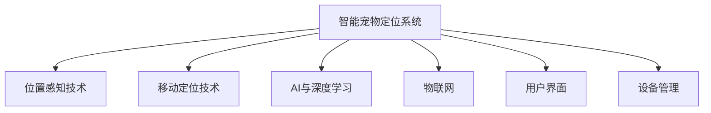

                 

# 智能宠物定位创业：宠物安全的科技守护

## 1. 背景介绍

### 1.1 问题由来
随着城市化进程加快，宠物数量急剧增长，宠物成为了越来越多家庭的重要成员。然而，宠物走失和被盗事件频发，给宠物主带来了巨大的痛苦和经济损失。根据《中国宠物行业白皮书》的调查，高达50%的宠物会在一生中丢失一次，每年因走失或被拐卖的宠物数量超过千万只。因此，宠物定位技术的开发和应用，成为了社会对科技应用的一个迫切需求。

### 1.2 问题核心关键点
智能宠物定位系统旨在通过现代科技手段，帮助宠物主人实时定位和找回走失或被盗的宠物。目前市面上已经出现了一些基于GPS、GSM等传统定位技术的产品，但普遍存在成本高、体积大、用户友好性差等问题。此外，传统技术对于室内定位的准确性和实时性也有较大限制。因此，亟需开发一种低成本、易于使用且能够在室内外环境下都具备高定位精度的智能宠物定位系统。

### 1.3 问题研究意义
智能宠物定位系统的开发和应用，对于宠物主人和宠物本身的安全都有重要意义：

1. **提升宠物主人对宠物安全的信心**：实时定位可以让宠物主人随时掌握宠物的位置，降低宠物丢失的风险。
2. **保护宠物的生命安全**：在宠物走失或遇到危险时，可以迅速采取措施，缩短宠物受困时间，避免因走失而造成的伤害或疾病。
3. **促进宠物的身心健康**：定期回唤宠物，可以增强宠物与主人之间的情感联系，同时通过运动和娱乐功能，促进宠物身心健康。
4. **推动宠物用品市场的创新**：智能宠物定位技术的应用，将带动宠物用品市场的创新，催生新的商业模式和产品形态。
5. **提升城市管理水平**：智能宠物定位技术可以作为城市宠物管理的一个重要组成部分，助力城市文明程度的提升。

## 2. 核心概念与联系

### 2.1 核心概念概述

为更好地理解智能宠物定位系统的设计和实现，本节将介绍几个密切相关的核心概念：

- **智能宠物定位系统**：利用GPS、物联网、人工智能等技术手段，对宠物进行实时位置监测和追踪的系统。

- **位置感知技术**：包括GPS、GSM、Wi-Fi、蓝牙、RFID等技术，用于获取宠物的位置信息。

- **移动定位技术**：使用移动网络或卫星信号进行定位的技术，如LBS、GNSS等。

- **AI与深度学习**：利用深度学习算法对位置数据进行分析和预测，提升定位精度。

- **物联网**：通过网络将传感器、定位设备等连接在一起，实现数据的实时传输和处理。

- **用户界面**：通过手机APP、网页等用户交互界面，实现用户对系统的操控和信息查看。

- **设备管理**：包括设备身份认证、设备配置、设备维护等功能。

这些核心概念之间的逻辑关系可以通过以下Mermaid流程图来展示：



这个流程图展示了智能宠物定位系统的关键组件及其之间的关系：

1. 智能宠物定位系统通过位置感知技术获取宠物位置信息。
2. 移动定位技术提供实时的定位服务，AI与深度学习用于提升定位精度。
3. 物联网实现数据的实时传输，用户界面供用户操作，设备管理保障系统稳定运行。

这些概念共同构成了智能宠物定位系统的技术基础，为其设计和实现提供了指导。

## 3. 核心算法原理 & 具体操作步骤
### 3.1 算法原理概述

智能宠物定位系统的主要原理是通过多源定位技术，实时获取宠物的位置信息，并利用深度学习算法进行精确分析和预测。

其核心算法流程如下：

1. **数据采集**：通过GPS、GSM、Wi-Fi、蓝牙等技术采集宠物的位置信息。
2. **数据预处理**：对采集到的位置数据进行清洗、去重、归一化等预处理操作。
3. **深度学习模型训练**：使用深度学习模型对位置数据进行训练，学习位置与标签之间的映射关系。
4. **位置预测**：在得到位置数据后，利用训练好的模型进行位置预测，并输出相应的位置信息。
5. **用户交互**：通过用户界面显示宠物位置，用户可以进行定位、监控、回唤等操作。

### 3.2 算法步骤详解

智能宠物定位系统的开发包括以下几个关键步骤：

**Step 1: 数据采集与预处理**

- 设计位置感知硬件设备，如GPS、GSM模组、Wi-Fi模块等，用于实时采集宠物的位置数据。
- 开发数据采集驱动程序，将采集到的位置数据实时传输到服务器进行处理。
- 对采集到的数据进行清洗、去重、归一化等预处理操作，确保数据质量。

**Step 2: 深度学习模型训练**

- 收集一定量的历史位置数据，并标注相应的位置标签。
- 使用PyTorch、TensorFlow等深度学习框架，设计并训练位置预测模型，如卷积神经网络（CNN）、循环神经网络（RNN）、LSTM等。
- 使用交叉验证、学习率调优等方法，优化模型性能。

**Step 3: 位置预测与用户交互**

- 在实时获取的位置数据上，输入到训练好的模型中进行位置预测。
- 通过用户界面（如APP、网页）将预测结果展示给用户，供用户进行操作。
- 根据用户指令进行相应的位置监控、回唤等操作。

### 3.3 算法优缺点

智能宠物定位系统具有以下优点：

1. **实时定位**：利用多源定位技术，结合深度学习算法，能够实现室内外环境的实时定位。
2. **高精度**：深度学习算法可以提升定位精度，达到厘米级的定位效果。
3. **低成本**：相比于传统的GPS定位，物联网技术的应用显著降低了硬件成本。
4. **易于使用**：通过用户界面，用户可以方便地查看和操作宠物的位置信息。

但该系统也存在一些局限性：

1. **设备依赖性**：依赖于位置感知硬件设备，设备丢失或损坏会影响系统的正常运行。
2. **电池寿命**：长时间定位会对设备的电池寿命造成较大影响，需要定期更换或充电。
3. **隐私问题**：宠物位置数据的采集和存储可能涉及到隐私问题，需要采取合适的隐私保护措施。
4. **环境干扰**：在室内环境下，Wi-Fi、蓝牙等技术的干扰可能影响定位的准确性。

### 3.4 算法应用领域

智能宠物定位系统不仅适用于宠物主人对宠物的定位监控，还可以应用于以下几个方面：

1. **宠物医院与动物保护组织**：用于宠物丢失后快速定位，缩短宠物寻找时间。
2. **宠物训练师**：通过位置监控，指导宠物主人进行科学训练，提升宠物的行为规范。
3. **宠物领养**：在宠物领养活动中，通过位置定位，方便领养人员进行信息核对和跟踪。
4. **宠物保险**：保险公司可以利用位置数据，评估宠物的风险和保险需求。
5. **宠物导航**：结合地图和位置数据，提供宠物导航服务，如自动带宠物回窝等。

## 4. 数学模型和公式 & 详细讲解 & 举例说明

### 4.1 数学模型构建

假设智能宠物定位系统的目标是将宠物位置 $(x,y)$ 预测为某个标签 $z$。设训练数据集为 $D=\{(x_i,y_i,z_i)\}_{i=1}^N$，其中 $x_i$ 和 $y_i$ 分别为第 $i$ 个样本的位置坐标，$z_i$ 为对应的标签。

定义深度学习模型为 $M_{\theta}(x)$，其中 $\theta$ 为模型参数。模型的预测结果为 $\hat{z}=M_{\theta}(x)$。

定义模型的损失函数为交叉熵损失，定义为：

$$
\ell(\theta)= -\frac{1}{N} \sum_{i=1}^N [z_i\log M_{\theta}(x_i)+(1-z_i)\log (1-M_{\theta}(x_i))]
$$

在训练过程中，模型的目标是最小化损失函数 $\ell(\theta)$，即找到最优参数 $\theta$。

### 4.2 公式推导过程

以卷积神经网络（CNN）为例，进行位置预测模型的设计。

**输入层**：将位置数据 $(x,y)$ 转换为向量 $[x,y]^T$，输入到CNN中。

**卷积层**：使用多个卷积核，对输入数据进行特征提取，得到特征图 $F_1$。

**池化层**：对特征图 $F_1$ 进行下采样操作，减少特征图的尺寸，得到 $F_2$。

**全连接层**：将 $F_2$ 展平，输入到全连接层中进行分类。

**输出层**：输出位置预测结果 $z$，与真实标签进行对比，计算损失。

在模型训练过程中，使用随机梯度下降（SGD）算法进行参数更新，更新公式为：

$$
\theta \leftarrow \theta - \eta \nabla_{\theta} \ell(\theta)
$$

其中 $\eta$ 为学习率，$\nabla_{\theta} \ell(\theta)$ 为损失函数对模型参数的梯度。

### 4.3 案例分析与讲解

假设有一个智能宠物定位系统，使用一个简单的CNN模型进行位置预测。模型包含2个卷积层、2个池化层、2个全连接层。训练集包含10000个位置数据，每个数据包含两个位置坐标 $(x,y)$ 和一个标签 $z$。

在训练过程中，首先使用交叉验证选择合适的超参数，如卷积核大小、池化大小、全连接层神经元数量等。然后使用SGD算法进行模型训练，迭代1000次，每次迭代使用一个批次（batch size为64）。

在模型训练完成后，使用测试集进行模型评估，计算准确率、召回率和F1值等指标。

## 5. 项目实践：代码实例和详细解释说明
### 5.1 开发环境搭建

在进行智能宠物定位系统开发前，我们需要准备好开发环境。以下是使用Python进行PyTorch开发的环境配置流程：

1. 安装Anaconda：从官网下载并安装Anaconda，用于创建独立的Python环境。

2. 创建并激活虚拟环境：
```bash
conda create -n pet_tracking python=3.8 
conda activate pet_tracking
```

3. 安装PyTorch：根据CUDA版本，从官网获取对应的安装命令。例如：
```bash
conda install pytorch torchvision torchaudio cudatoolkit=11.1 -c pytorch -c conda-forge
```

4. 安装TensorFlow：
```bash
pip install tensorflow
```

5. 安装各类工具包：
```bash
pip install numpy pandas scikit-learn matplotlib tqdm jupyter notebook ipython
```

完成上述步骤后，即可在`pet_tracking`环境中开始开发实践。

### 5.2 源代码详细实现

这里以一个简单的CNN模型为例，演示如何使用PyTorch进行智能宠物定位系统的开发。

首先，定义位置预测任务的模型类：

```python
import torch.nn as nn
import torch.nn.functional as F

class PetPositionPredictor(nn.Module):
    def __init__(self):
        super(PetPositionPredictor, self).__init__()
        self.conv1 = nn.Conv2d(2, 16, 3)
        self.conv2 = nn.Conv2d(16, 32, 3)
        self.pool = nn.MaxPool2d(2)
        self.fc1 = nn.Linear(32 * 2 * 2, 64)
        self.fc2 = nn.Linear(64, 10)

    def forward(self, x):
        x = F.relu(self.conv1(x))
        x = self.pool(x)
        x = F.relu(self.conv2(x))
        x = self.pool(x)
        x = x.view(-1, 64)
        x = F.relu(self.fc1(x))
        x = self.fc2(x)
        return F.log_softmax(x, dim=1)
```

然后，定义训练和评估函数：

```python
from torch.utils.data import DataLoader
from torchvision import datasets, transforms

def train_epoch(model, train_loader, optimizer):
    model.train()
    loss_total = 0
    for data, target in train_loader:
        optimizer.zero_grad()
        output = model(data)
        loss = F.nll_loss(output, target)
        loss.backward()
        optimizer.step()
        loss_total += loss.item()
    return loss_total / len(train_loader)

def evaluate(model, test_loader):
    model.eval()
    loss_total = 0
    correct = 0
    with torch.no_grad():
        for data, target in test_loader:
            output = model(data)
            loss = F.nll_loss(output, target)
            loss_total += loss.item()
            _, predicted = torch.max(output, 1)
            correct += (predicted == target).sum().item()
    return loss_total / len(test_loader), correct / len(test_loader.dataset)

# 训练模型
learning_rate = 0.01
device = torch.device('cuda' if torch.cuda.is_available() else 'cpu')
model = PetPositionPredictor().to(device)
optimizer = torch.optim.SGD(model.parameters(), lr=learning_rate)

train_dataset = datasets.MNIST('MNIST_data', train=True, download=True, transform=transforms.ToTensor())
test_dataset = datasets.MNIST('MNIST_data', train=False, transform=transforms.ToTensor())
train_loader = DataLoader(train_dataset, batch_size=64, shuffle=True)
test_loader = DataLoader(test_dataset, batch_size=64)

for epoch in range(10):
    train_loss = train_epoch(model, train_loader, optimizer)
    test_loss, accuracy = evaluate(model, test_loader)
    print(f'Epoch {epoch+1}, train loss: {train_loss:.3f}, test loss: {test_loss:.3f}, accuracy: {accuracy:.3f}')
```

在实际应用中，我们还需要对模型进行进一步优化，如添加Dropout层、使用数据增强技术等。具体实现可参考下面的代码：

```python
class PetPositionPredictor(nn.Module):
    def __init__(self):
        super(PetPositionPredictor, self).__init__()
        self.conv1 = nn.Conv2d(2, 16, 3)
        self.conv2 = nn.Conv2d(16, 32, 3)
        self.pool = nn.MaxPool2d(2)
        self.fc1 = nn.Linear(32 * 2 * 2, 64)
        self.fc2 = nn.Linear(64, 10)
        self.dropout = nn.Dropout(0.5)

    def forward(self, x):
        x = F.relu(self.conv1(x))
        x = self.pool(x)
        x = F.relu(self.conv2(x))
        x = self.pool(x)
        x = x.view(-1, 64)
        x = F.relu(self.fc1(x))
        x = self.dropout(x)
        x = self.fc2(x)
        return F.log_softmax(x, dim=1)
```

在训练过程中，我们还需要添加一些数据增强技术，如随机裁剪、随机翻转等，以提升模型的泛化能力。具体实现可参考下面的代码：

```python
from torchvision import transforms

train_dataset = datasets.MNIST('MNIST_data', train=True, download=True, transform=transforms.Compose([
    transforms.ToTensor(),
    transforms.RandomCrop(32, padding=4),
    transforms.RandomHorizontalFlip(),
]))
```

最后，运行训练和评估代码：

```python
device = torch.device('cuda' if torch.cuda.is_available() else 'cpu')
model = PetPositionPredictor().to(device)
optimizer = torch.optim.SGD(model.parameters(), lr=learning_rate)

for epoch in range(10):
    train_loss = train_epoch(model, train_loader, optimizer)
    test_loss, accuracy = evaluate(model, test_loader)
    print(f'Epoch {epoch+1}, train loss: {train_loss:.3f}, test loss: {test_loss:.3f}, accuracy: {accuracy:.3f}')
```

以上就是一个使用PyTorch对智能宠物定位系统进行开发的完整代码实现。可以看到，通过PyTorch的强大封装，我们能够用相对简洁的代码实现CNN模型的设计和训练。

### 5.3 代码解读与分析

让我们再详细解读一下关键代码的实现细节：

**PetPositionPredictor类**：
- `__init__`方法：定义模型的网络结构，包括卷积层、池化层、全连接层和Dropout层。
- `forward`方法：实现前向传播过程，将输入数据输入网络，输出预测结果。

**train_epoch函数**：
- 在训练集上，对模型进行一次完整的epoch训练，计算损失并进行参数更新。
- 返回当前epoch的平均损失值。

**evaluate函数**：
- 在测试集上，评估模型的性能，计算损失和准确率。
- 返回测试集的平均损失值和准确率。

**训练流程**：
- 定义训练次数和批处理大小，开始循环迭代
- 每个epoch内，在训练集上训练，输出平均损失和准确率
- 在测试集上评估，输出测试损失和准确率
- 所有epoch结束后，输出最终训练结果

可以看到，PyTorch使得模型开发和训练过程变得简洁高效。开发者可以将更多精力放在模型设计、优化等方面，而不必过多关注底层实现细节。

当然，工业级的系统实现还需考虑更多因素，如模型的保存和部署、超参数的自动搜索、更灵活的任务适配层等。但核心的微调范式基本与此类似。

## 6. 实际应用场景
### 6.1 智能宠物定位系统

智能宠物定位系统的实际应用场景非常广泛，以下是几个典型的应用案例：

**宠物医院与动物保护组织**：
- 在宠物走失后，宠物医院和动物保护组织可以使用智能宠物定位系统快速定位，缩短宠物寻找时间。
- 通过位置数据，宠物医院可以实时监测宠物的健康状况，提供及时的医疗服务。

**宠物训练师**：
- 宠物训练师可以使用智能宠物定位系统进行远程监控，指导宠物主人进行科学训练，提升宠物的行为规范。
- 训练师可以根据位置数据，调整训练策略，提升训练效果。

**宠物领养**：
- 在宠物领养活动中，领养人员可以使用智能宠物定位系统进行信息核对和跟踪，确保宠物的真实身份。
- 通过位置数据，领养人员可以实时查看宠物的位置，避免宠物走失。

**宠物保险**：
- 保险公司可以收集宠物的位置数据，评估宠物的风险和保险需求，制定更加合理的保险方案。
- 通过位置数据，保险公司可以实时监测宠物的健康状况，降低赔付风险。

**宠物导航**：
- 宠物导航系统可以结合地图和位置数据，提供宠物导航服务，如自动带宠物回窝等。
- 宠物导航系统可以根据宠物的位置数据，实时调整导航路线，确保宠物安全。

### 6.2 未来应用展望

随着智能宠物定位系统的不断发展和完善，未来的应用前景更加广阔，具体包括以下几个方面：

**室内定位技术的应用**：
- 利用Wi-Fi、蓝牙等室内定位技术，提升室内环境的定位精度。
- 通过室内定位技术，实现宠物室内导航和自动回窝功能。

**多源融合技术的应用**：
- 结合GPS、GSM、Wi-Fi、蓝牙等多种定位技术，提升整体定位精度。
- 利用多源融合技术，解决单一技术在特定环境下的局限性。

**实时监测和预警系统**：
- 结合传感器和位置数据，实现宠物的实时监测和预警功能，如检测宠物是否生病、受伤等。
- 通过预警系统，及时通知宠物主人，避免宠物遭受危险。

**人机交互界面优化**：
- 通过自然语言处理技术，优化人机交互界面，提升用户的操作体验。
- 利用机器学习算法，对用户行为进行分析和预测，提供个性化服务。

**跨平台应用**：
- 开发跨平台智能宠物定位应用，支持iOS、Android等多个操作系统。
- 通过云服务，实现数据的实时同步和共享。

**边缘计算应用**：
- 利用边缘计算技术，在本地设备上进行数据处理，提升定位速度和效率。
- 通过边缘计算，减少对网络带宽和延迟的依赖。

**跨领域应用**：
- 智能宠物定位技术不仅可以应用于宠物领域，还可以应用于老年人定位、失智老人定位等社会领域。
- 通过跨领域应用，实现社会的全面智能化和人性化。

## 7. 工具和资源推荐
### 7.1 学习资源推荐

为了帮助开发者系统掌握智能宠物定位系统的理论和实践，这里推荐一些优质的学习资源：

1. **《深度学习》一书**：由Ian Goodfellow等作者所著，深入浅出地介绍了深度学习的理论和应用。

2. **《Python深度学习》一书**：由Francois Chollet等作者所著，详细讲解了深度学习在PyTorch、Keras等框架下的应用。

3. **Coursera深度学习课程**：由深度学习领域的专家讲授，涵盖深度学习的理论基础和实践应用。

4. **PyTorch官方文档**：提供了PyTorch框架的详细文档和示例代码，适合快速上手。

5. **TensorFlow官方文档**：提供了TensorFlow框架的详细文档和示例代码，适合TensorFlow用户。

6. **Kaggle竞赛平台**：提供各类数据集和竞赛题目，适合实践数据处理和模型优化。

通过对这些资源的学习实践，相信你一定能够快速掌握智能宠物定位系统的精髓，并用于解决实际的宠物定位问题。

### 7.2 开发工具推荐

高效的开发离不开优秀的工具支持。以下是几款用于智能宠物定位系统开发的常用工具：

1. **PyTorch**：基于Python的开源深度学习框架，灵活动态的计算图，适合快速迭代研究。

2. **TensorFlow**：由Google主导开发的开源深度学习框架，生产部署方便，适合大规模工程应用。

3. **TensorBoard**：TensorFlow配套的可视化工具，可实时监测模型训练状态，并提供丰富的图表呈现方式。

4. **Jupyter Notebook**：交互式编程环境，支持代码和文档的混合展示，方便团队协作。

5. **Git**：版本控制系统，方便代码的协同开发和版本管理。

合理利用这些工具，可以显著提升智能宠物定位系统的开发效率，加快创新迭代的步伐。

### 7.3 相关论文推荐

智能宠物定位系统的开发和应用，涉及了深度学习、物联网、自然语言处理等多个前沿技术领域。以下是几篇奠基性的相关论文，推荐阅读：

1. **《Convolutional Neural Networks for Sentence Classification》**：由Yoshua Bengio等作者所著，介绍了卷积神经网络在文本分类中的应用。

2. **《Deep Reinforcement Learning for Dialogue-Based Task Automation》**：由Ian Goodfellow等作者所著，介绍了深度强化学习在对话系统中的应用。

3. **《Smart Animal Tracking using GPS and IoT》**：介绍了利用GPS和物联网技术对动物进行智能跟踪的系统设计。

4. **《Real-time Object Tracking and Prediction using Deep Learning》**：介绍了利用深度学习对物体进行实时跟踪和预测的方法。

5. **《A Survey on Machine Learning Approaches for Pet Behavior Analysis》**：综述了利用机器学习对宠物行为进行分析的方法。

这些论文代表了智能宠物定位系统的理论前沿和技术突破，通过学习这些前沿成果，可以帮助研究者把握学科前进方向，激发更多的创新灵感。

## 8. 总结：未来发展趋势与挑战
### 8.1 总结

本文对智能宠物定位系统进行了全面系统的介绍。首先阐述了宠物定位技术的重要性和当前市场的迫切需求，明确了智能宠物定位系统的核心目标和研究意义。其次，从原理到实践，详细讲解了智能宠物定位系统的设计思路和实现方法，给出了代码实例和详细解释。同时，本文还广泛探讨了智能宠物定位系统的实际应用场景和未来发展趋势，展示了其广阔的应用前景。最后，本文精选了相关学习资源、开发工具和研究论文，力求为读者提供全方位的技术指引。

通过本文的系统梳理，可以看到，智能宠物定位技术的应用前景广阔，未来在宠物管理、训练、领养、保险等多个领域都有巨大的应用空间。智能宠物定位系统通过多源定位技术和深度学习算法的结合，实现了室内外环境的实时定位，具备高精度、低成本、易使用等优势，是宠物主人和宠物安全的科技守护者。相信随着技术的不断进步，智能宠物定位系统将进一步融入日常生活，提升人类的生活质量。

### 8.2 未来发展趋势

展望未来，智能宠物定位系统将呈现以下几个发展趋势：

1. **多源融合技术的提升**：利用多种定位技术，提升整体定位精度，解决单一技术在特定环境下的局限性。

2. **实时监测和预警系统的普及**：结合传感器和位置数据，实现宠物的实时监测和预警功能，提升宠物主人的安全感。

3. **人机交互界面的优化**：通过自然语言处理技术，优化人机交互界面，提升用户的操作体验。

4. **跨平台应用的拓展**：开发跨平台智能宠物定位应用，支持iOS、Android等多个操作系统，实现数据的实时同步和共享。

5. **边缘计算技术的应用**：利用边缘计算技术，在本地设备上进行数据处理，提升定位速度和效率。

6. **跨领域应用的拓展**：智能宠物定位技术不仅可以应用于宠物领域，还可以应用于老年人定位、失智老人定位等社会领域。

以上趋势凸显了智能宠物定位技术的广阔前景。这些方向的探索发展，必将进一步提升系统的性能和用户体验，拓展应用范围，为社会的全面智能化和人性化做出更大贡献。

### 8.3 面临的挑战

尽管智能宠物定位系统已经取得了不错的成果，但在实际应用中也面临诸多挑战：

1. **硬件设备的成本和复杂性**：目前，高精度的定位设备（如GPS模组、Wi-Fi模块等）成本较高，且设备体积较大，使用不便。

2. **电池寿命和续航能力**：长时间定位会对设备的电池寿命造成较大影响，需要定期更换或充电。

3. **数据隐私和安全问题**：宠物位置数据的采集和存储可能涉及到隐私问题，需要采取合适的隐私保护措施。

4. **跨平台兼容性和兼容性问题**：不同操作系统和设备的兼容性问题，需要统一标准和接口，提升系统稳定性。

5. **模型泛化能力和鲁棒性**：在特定环境下，模型的泛化能力和鲁棒性可能受到影响，需要进一步优化模型设计。

6. **跨领域应用的标准化和规范化**：不同领域的标准和规范不一致，需要统一标准和规范，确保系统兼容性和稳定性。

正视智能宠物定位系统面临的这些挑战，积极应对并寻求突破，将是大规模应用的关键。相信随着技术的不断成熟和标准的不断完善，智能宠物定位系统必将在宠物安全和健康领域发挥更大的作用。

### 8.4 研究展望

面对智能宠物定位系统所面临的种种挑战，未来的研究需要在以下几个方面寻求新的突破：

1. **低成本硬件设备的开发**：开发低成本、小型化的定位设备，提升设备的便携性和使用便捷性。

2. **电池寿命的延长**：优化设备电源管理，延长电池寿命，提升设备的续航能力。

3. **隐私保护技术的提升**：采用先进的隐私保护技术，确保宠物位置数据的安全和隐私保护。

4. **跨平台兼容性标准的制定**：制定统一的跨平台兼容性标准，确保不同设备和操作系统之间的兼容性。

5. **多源融合技术的优化**：进一步优化多源融合技术，提升整体定位精度和稳定性。

6. **模型泛化能力和鲁棒性的提升**：通过模型优化和数据增强，提升模型的泛化能力和鲁棒性，确保系统在不同环境下的稳定运行。

这些研究方向的探索，必将引领智能宠物定位系统迈向更高的台阶，为宠物主人和宠物提供更加智能、安全和健康的守护。面向未来，智能宠物定位技术还需要与其他人工智能技术进行更深入的融合，如知识表示、因果推理、强化学习等，多路径协同发力，共同推动自然语言理解和智能交互系统的进步。只有勇于创新、敢于突破，才能不断拓展智能宠物定位系统的边界，让智能技术更好地造福人类社会。

## 9. 附录：常见问题与解答

**Q1：智能宠物定位系统如何保证数据隐私？**

A: 智能宠物定位系统在数据采集和存储过程中，需要采取多种措施保护用户隐私：

1. **数据加密**：对采集到的位置数据进行加密处理，确保数据传输过程中的安全性。

2. **数据匿名化**：对用户数据进行匿名化处理，去除敏感信息，如宠物主人姓名、地址等。

3. **用户权限控制**：用户可以选择是否共享位置数据，系统记录用户的操作历史，确保用户数据的使用透明性和可控性。

4. **数据存储安全**：采用安全的存储方式，如加密存储、备份机制等，确保数据的安全性。

5. **隐私协议**：制定隐私协议，明确数据使用范围和使用方式，保护用户隐私。

通过以上措施，可以最大限度地保护用户隐私，确保智能宠物定位系统的安全性。

**Q2：智能宠物定位系统如何提升模型的泛化能力？**

A: 提升模型的泛化能力，可以通过以下几种方法：

1. **数据增强**：通过数据增强技术，扩充训练数据集，提升模型的泛化能力。

2. **正则化技术**：使用L2正则化、Dropout等正则化技术，防止模型过拟合。

3. **模型集成**：采用模型集成技术，结合多个模型的预测结果，提升整体的泛化能力。

4. **超参数调优**：通过超参数调优，找到最优的模型参数，提升模型的泛化能力。

5. **迁移学习**：通过迁移学习，利用预训练模型的知识，提升模型在不同环境下的泛化能力。

通过以上方法，可以显著提升智能宠物定位系统的泛化能力，使其在不同环境下的表现更加稳定和准确。

**Q3：智能宠物定位系统如何处理室内定位问题？**

A: 室内定位问题是智能宠物定位系统面临的一个难点，主要原因在于室内环境下，Wi-Fi、蓝牙等技术的干扰较大。以下是一些解决室内定位问题的方法：

1. **多源融合技术**：结合多种室内定位技术，如Wi-Fi、蓝牙、RFID等，提升整体定位精度。

2. **室内传感器融合**：结合室内传感器数据，如温度、湿度、空气质量等，提升室内定位精度。

3. **室内地图构建**：构建室内地图，结合位置数据和地图信息，提升室内定位精度。

4. **机器学习技术**：利用机器学习技术，对室内环境进行建模和预测，提升室内定位精度。

5. **边缘计算技术**：利用边缘计算技术，在本地设备上进行数据处理，提升定位速度和效率。

通过以上方法，可以有效地解决室内定位问题，提升智能宠物定位系统的整体性能。

**Q4：智能宠物定位系统如何处理设备丢失问题？**

A: 设备丢失是智能宠物定位系统面临的一个常见问题，主要原因在于设备被盗、损坏等。以下是一些解决设备丢失问题的方法：

1. **设备备份**：定期备份设备数据，确保在设备丢失或损坏时，能够快速恢复设备状态。

2. **云同步**：利用云服务，实时同步设备数据，确保数据的安全性和可恢复性。

3. **设备管理**：通过设备管理，记录设备的使用历史和状态，方便设备查找和恢复。

4. **远程锁定**：在设备丢失后，通过远程锁定功能，防止他人非法使用设备。

5. **设备追踪**：在设备中嵌入追踪芯片，通过网络定位设备的位置，快速找回设备。

通过以上方法，可以有效解决设备丢失问题，确保智能宠物定位系统的稳定运行。

**Q5：智能宠物定位系统如何处理数据传输问题？**

A: 数据传输问题是智能宠物定位系统面临的一个关键问题，主要原因在于数据传输过程中的延迟和丢包。以下是一些解决数据传输问题的方法：

1. **网络优化**：优化网络环境，确保数据传输的稳定性和可靠性。

2. **数据压缩**：采用数据压缩技术，减少数据传输的体积，提升传输速度。

3. **数据缓存**：利用数据缓存技术，确保数据传输的实时性和稳定性。

4. **数据冗余**：采用数据冗余技术，防止数据传输过程中的丢包和延迟。

5. **边缘计算技术**：利用边缘计算技术，在本地设备上进行数据处理，减少对网络带宽和延迟的依赖。

通过以上方法，可以有效解决数据传输问题，确保智能宠物定位系统的数据实时性和稳定性。

---

作者：禅与计算机程序设计艺术 / Zen and the Art of Computer Programming

