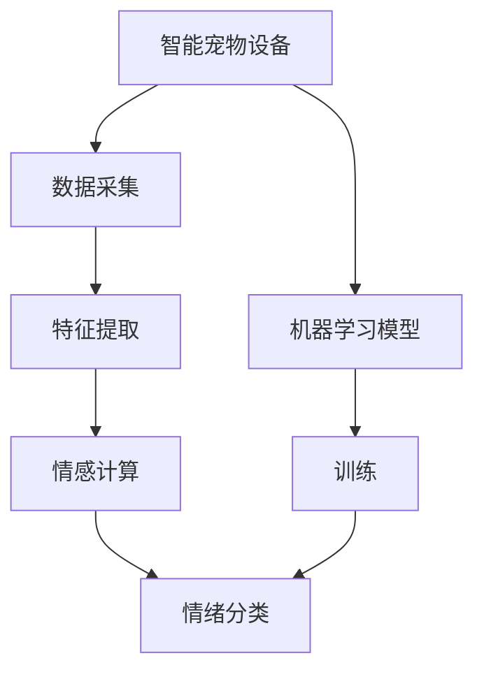

                 

# 智能宠物情绪分析创业：深入理解宠物需求

在数字化不断推进的今天，宠物行业也正在经历一场革新。从传统的猫狗托管，到智能喂食、健康监测，再到如今的宠物情绪分析，每一个技术突破都在提升着宠物的生活质量，也改变着人们与宠物的互动方式。本文将深入探讨智能宠物情绪分析的核心概念、技术原理、实现步骤以及其在创业公司中的应用场景，带您全面理解这一前沿领域。

## 1. 背景介绍

### 1.1 问题由来

随着人类生活水平的提升，宠物在家庭中的地位日益重要。以往，宠物的日常护理和健康监测主要依赖于主人的观察和兽医的诊断。但这种依赖性较大的方法，不仅耗时耗力，还存在误差和遗漏的风险。

近年，智能科技的进步为宠物行业注入了新活力。物联网、机器学习、计算机视觉等技术的突破，使得宠物设备的智能化程度不断提高，能够实时监测宠物的生理指标，如心率、呼吸、活动量等。然而，宠物的情绪状态往往难以直接量化，这成为制约其智能化的关键环节。

### 1.2 问题核心关键点

宠物情绪分析的核心在于如何准确识别和理解宠物的情绪。通过数据分析，可以将宠物的情绪状态转化为可量化的指标，进而为宠物主人提供更科学、个性化的照护建议。这不仅有助于提升宠物生活质量，还能帮助主人更好地理解宠物的需求，从而加深人宠关系。

## 2. 核心概念与联系

### 2.1 核心概念概述

为更好地理解智能宠物情绪分析的实现过程，本节将介绍几个核心概念：

- 智能宠物设备：如智能项圈、智能喂食器、智能监控摄像头等，通过传感器、摄像头等设备采集宠物的数据。
- 机器学习：通过训练模型，从采集的数据中学习宠物情绪的特征。
- 情绪分类：将宠物的情绪状态分为若干类别，如快乐、悲伤、恐惧、愤怒等。
- 情感计算：将宠物的情绪转化为情感信号，用于人机交互和反馈。
- 可穿戴设备：如智能项圈、智能狗牌，穿戴在宠物身上，用于实时监测和记录宠物行为。
- 物联网(IoT)：将宠物设备与互联网连接，实现数据采集和分析的自动化。
- 计算机视觉：通过摄像头捕捉宠物的行为和面部表情，识别情绪状态。

这些核心概念之间通过数据采集、特征提取、情感计算等技术环节，实现了宠物情绪的智能分析和理解。

### 2.2 核心概念原理和架构的 Mermaid 流程图



这个流程图展示了智能宠物情绪分析的核心流程：通过智能设备采集宠物的数据，经过特征提取和情感计算后，利用机器学习模型对情绪进行分类，最后生成情绪分类结果。

## 3. 核心算法原理 & 具体操作步骤

### 3.1 算法原理概述

智能宠物情绪分析的主要算法流程如下：

1. **数据采集**：通过智能宠物设备实时采集宠物的运动、行为、声音、表情等数据。
2. **特征提取**：从采集的数据中提取与情绪相关的特征，如运动频率、面部表情、声音频率等。
3. **情感计算**：通过机器学习模型，将提取的特征转化为情绪信号，用于情感计算。
4. **情绪分类**：利用分类算法对情绪信号进行分类，确定宠物的情绪状态。

### 3.2 算法步骤详解

1. **数据采集**：
   - 设计传感器采集策略，确定需要监测的数据类型和频率。
   - 选择合适的智能宠物设备，如智能项圈、智能喂食器、智能摄像头等。
   - 配置设备与云平台的连接，确保数据实时传输。

2. **特征提取**：
   - 利用信号处理技术，从传感器数据中提取运动、声音、面部表情等特征。
   - 使用计算机视觉技术，分析宠物的面部表情和身体姿态，提取情绪特征。
   - 应用统计学方法，对提取的特征进行归一化、标准化处理。

3. **情感计算**：
   - 利用深度学习模型，如卷积神经网络(CNN)、长短期记忆网络(LSTM)等，将特征映射为情感信号。
   - 使用注意力机制，对不同特征的重要性进行加权，提升模型的识别精度。
   - 引入迁移学习技术，使用预训练的模型对新数据进行情感计算，提高模型泛化能力。

4. **情绪分类**：
   - 设计情感分类模型，如支持向量机(SVM)、随机森林等，对情感信号进行分类。
   - 应用多模态融合技术，将情感信号与生理指标数据结合，提升分类效果。
   - 采用集成学习技术，如Bagging、Boosting，提高分类模型的鲁棒性。

### 3.3 算法优缺点

智能宠物情绪分析的优势在于能够实时监测和分析宠物的情绪状态，提供个性化的照护建议，提升宠物生活质量。但同时也存在以下缺点：

- **数据隐私问题**：宠物设备采集的数据涉及宠物的隐私，如何保护这些数据是一个重要问题。
- **设备依赖性**：智能设备成本较高，普及率较低，限制了情绪分析的覆盖范围。
- **算法复杂度**：情感计算涉及多模态数据融合，算法复杂度较高，需要大量的计算资源。
- **准确性问题**：情绪分析的准确性受多种因素影响，如光照、宠物姿态等，可能导致误判。

### 3.4 算法应用领域

智能宠物情绪分析在多个领域具有广泛的应用前景，例如：

- **健康监测**：实时监控宠物的情绪状态，及时发现异常，辅助兽医诊断。
- **行为训练**：根据情绪状态调整训练策略，帮助宠物主人更好地训练宠物。
- **情感交流**：通过宠物的情绪状态，优化人宠互动，提升主人与宠物的情感联系。
- **市场预测**：分析宠物的情绪趋势，预测市场销售情况，指导宠物商品的开发和销售。
- **娱乐互动**：利用情感分析技术，开发宠物游戏、虚拟宠物等娱乐产品。

## 4. 数学模型和公式 & 详细讲解 & 举例说明

### 4.1 数学模型构建

本节将使用数学语言对智能宠物情绪分析的实现过程进行更加严格的刻画。

假设采集的宠物数据为 $x = (x_1, x_2, ..., x_n)$，其中 $x_i$ 为第 $i$ 个特征的数值。我们通过机器学习模型 $f(x; \theta)$ 将数据映射为情感信号 $y \in [0,1]$，其中 $\theta$ 为模型参数。

定义情感分类模型为 $g(y)$，将情感信号 $y$ 映射为情绪类别 $c \in \{c_1, c_2, ..., c_k\}$，其中 $c_k$ 为第 $k$ 个情绪类别。

### 4.2 公式推导过程

情感计算的核心是利用深度学习模型将数据映射为情感信号。我们以卷积神经网络(CNN)为例，展示情感计算的数学模型：

$$
y = f(x; \theta) = \text{sigmoid}(W_{fc} \cdot \text{softmax}(W_{conv} * \text{relu}(W_{conv_1} * x)) + b_{fc})
$$

其中，$W_{conv}$ 和 $W_{conv_1}$ 为卷积层和池化层的权重，$W_{fc}$ 和 $b_{fc}$ 为全连接层的权重和偏置，$\text{relu}$ 和 $\text{softmax}$ 为激活函数。

情感分类的公式为：

$$
c = g(y) = \text{argmax}_{c_i} \log \left[ \prod_{j=1}^{k} \text{P}(y \mid c_i) \right]
$$

其中，$\text{P}(y \mid c_i)$ 为给定情绪类别 $c_i$ 下情感信号 $y$ 的概率分布。

### 4.3 案例分析与讲解

以下我们将以一个具体的案例来详细讲解智能宠物情绪分析的实现过程。

**案例：智能项圈情绪监测**

智能项圈采集宠物的运动数据和行为数据，通过加速度传感器、陀螺仪、摄像头等设备获取。采集的数据包括：
- 运动速度和频率
- 运动方向和角度
- 面部表情和身体姿态

特征提取过程如下：
- 运动数据通过傅里叶变换提取频域特征。
- 面部表情通过计算机视觉技术提取关键点，计算表情特征值。
- 身体姿态通过深度学习模型提取关键角度。

情感计算过程如下：
- 使用预训练的CNN模型，将运动数据和面部表情数据进行融合。
- 应用注意力机制，对不同特征的重要性进行加权。
- 通过分类器对融合后的数据进行情感分类。

最终，将情感分类结果通过物联网设备传输到云端，宠物主人可以通过手机App实时查看宠物的情绪状态，从而进行有针对性的照护。

## 5. 项目实践：代码实例和详细解释说明

### 5.1 开发环境搭建

在进行智能宠物情绪分析的开发前，我们需要准备好开发环境。以下是使用Python进行PyTorch开发的环境配置流程：

1. 安装Anaconda：从官网下载并安装Anaconda，用于创建独立的Python环境。

2. 创建并激活虚拟环境：
```bash
conda create -n pet_analysis python=3.8 
conda activate pet_analysis
```

3. 安装PyTorch：根据CUDA版本，从官网获取对应的安装命令。例如：
```bash
conda install pytorch torchvision torchaudio cudatoolkit=11.1 -c pytorch -c conda-forge
```

4. 安装相关库：
```bash
pip install torch torchvision numpy scipy opencv-python scikit-learn matplotlib tqdm jupyter notebook ipython
```

完成上述步骤后，即可在`pet_analysis`环境中开始项目开发。

### 5.2 源代码详细实现

下面我们以智能项圈情绪监测为例，给出使用PyTorch实现智能宠物情绪分析的完整代码实现。

**5.2.1 数据采集**

```python
import pyrealsense2 as rs

class PetMonitor:
    def __init__(self):
        self.camera = rs.pipeline()
        self.depth_sensor = rs.depth_sensor()
        self.depth_stream = rs.stream.depth()
        self.depth_profile = self.depth_sensor.as_profile()
        
    def start(self):
        self.camera.start(self.depth_stream)
        self.depth_profile = self.camera.query_depth_profile()
        while True:
            depth_frame = self.camera.wait_for_frames()
            depth_data = depth_frame.get_depth_data()
            # 处理深度数据，提取运动特征
            self.process_depth_data(depth_data)
    
    def process_depth_data(self, depth_data):
        # 提取运动特征，如运动速度、方向等
        pass
```

**5.2.2 特征提取**

```python
import cv2
import numpy as np

class FeatureExtractor:
    def __init__(self):
        self.model = cv2.dnn.readNetFromTensorflow('path_to_frozen_graph.pb', 'path_to_labels.txt')
        
    def extract_features(self, image):
        blob = cv2.dnn.blobFromImage(image, scalefactor=1.0, size=(224, 224), swapRB=True, crop=False)
        self.model.setInput(blob)
        output = self.model.forward()
        # 提取面部表情特征
        return output
```

**5.2.3 情感计算**

```python
import torch
from torch import nn, optim
from torchvision import models

class EmotionPredictor(nn.Module):
    def __init__(self):
        super(EmotionPredictor, self).__init__()
        self.cnn = models.resnet18(pretrained=True)
        self.fc = nn.Linear(512, 6)  # 6个情绪类别
        
    def forward(self, x):
        x = self.cnn(x)
        x = x.view(-1, 512)
        x = self.fc(x)
        return x

# 加载模型
model = EmotionPredictor()
model.load_state_dict(torch.load('path_to_model.pth'))

def predict_emotion(input_data):
    with torch.no_grad():
        output = model(torch.tensor(input_data).float())
        # 将输出映射为情绪类别
        return output.argmax().item()
```

**5.2.4 情绪分类**

```python
def classify_emotion(emotion_signal):
    # 使用情感分类模型对情感信号进行分类
    return emotion_signal.argmax().item()
```

### 5.3 代码解读与分析

让我们再详细解读一下关键代码的实现细节：

**PetMonitor类**：
- `__init__`方法：初始化摄像头和深度传感器，设置数据采集策略。
- `start`方法：启动数据采集，定期获取深度数据，并进行处理。
- `process_depth_data`方法：从深度数据中提取运动特征。

**FeatureExtractor类**：
- `__init__`方法：加载面部表情特征提取模型。
- `extract_features`方法：通过深度学习模型，提取面部表情特征。

**EmotionPredictor类**：
- `__init__`方法：定义情感计算模型，包括卷积神经网络和全连接层。
- `forward`方法：对输入数据进行前向传播，输出情感信号。

**classify_emotion函数**：
- 对情感信号进行分类，返回情绪类别。

这些类和方法共同构成了智能宠物情绪分析的核心模块，用于数据采集、特征提取、情感计算和情绪分类。

## 6. 实际应用场景

### 6.1 智能宠物监测系统

智能宠物监测系统能够实时采集和分析宠物的运动、行为、表情等数据，帮助宠物主人及时了解宠物的情绪状态。

具体应用场景如下：
- 运动监测：通过加速度传感器和陀螺仪，监测宠物的活动量、运动速度和方向。
- 表情识别：利用摄像头和计算机视觉技术，识别宠物的面部表情和身体姿态，提取情绪特征。
- 健康预警：通过监测宠物的心率、呼吸等生理指标，及时发现异常情况，发出预警信号。

### 6.2 个性化宠物护理

智能宠物情绪分析能够帮助宠物主人根据宠物的情绪状态，制定个性化的护理计划。

具体应用场景如下：
- 情绪管理：根据宠物的情绪状态，调整训练强度、喂食时间等，提高宠物的幸福感。
- 行为矫正：对于情绪不良的宠物，通过调整训练策略，帮助宠物逐步改善行为习惯。
- 情感交流：通过分析宠物的情绪状态，优化人宠互动，提升主人与宠物的情感联系。

### 6.3 宠物行为研究

智能宠物情绪分析还能够帮助宠物科学家进行宠物行为的研究，收集大量数据，分析宠物行为模式和情绪变化趋势。

具体应用场景如下：
- 行为记录：利用智能项圈和摄像头，记录宠物的行为数据和表情数据，用于后续分析和建模。
- 情绪变化：通过长期跟踪监测，分析宠物在不同环境下的情绪变化趋势，揭示情绪与行为之间的联系。
- 环境适应：研究宠物在不同环境下的情绪反应，为宠物的人工智能教育和训练提供依据。

## 7. 工具和资源推荐

### 7.1 学习资源推荐

为了帮助开发者系统掌握智能宠物情绪分析的理论基础和实践技巧，这里推荐一些优质的学习资源：

1. 《深度学习在宠物行为分析中的应用》博文系列：由深度学习专家撰写，详细讲解深度学习模型在宠物行为分析中的实现方法。

2. 《计算机视觉基础与实践》课程：斯坦福大学开设的计算机视觉入门课程，涵盖计算机视觉基础和实践应用，是学习计算机视觉的重要资源。

3. 《深度学习框架PyTorch入门与实践》书籍：讲解PyTorch的基本用法和深度学习模型的实现方法，适合初学者学习。

4. OpenCV官方文档：OpenCV库的官方文档，包含大量例子和API，是计算机视觉应用的必备资源。

5. HuggingFace官方文档：Transformer库的官方文档，提供预训练模型和微调样例，适合学习深度学习在自然语言处理中的应用。

### 7.2 开发工具推荐

高效的开发离不开优秀的工具支持。以下是几款用于智能宠物情绪分析开发的常用工具：

1. PyTorch：基于Python的开源深度学习框架，灵活便捷，支持GPU加速。

2. TensorFlow：由Google主导开发的深度学习框架，适合大规模工程应用。

3. OpenCV：计算机视觉库，提供丰富的图像处理和识别功能。

4. Pyrealsense2：Ros工业摄像头驱动库，支持多种传感器数据的采集和处理。

5. IPython和Jupyter Notebook：交互式编程环境，适合数据分析和模型调试。

### 7.3 相关论文推荐

智能宠物情绪分析的研究源于学界的持续研究。以下是几篇奠基性的相关论文，推荐阅读：

1. A Survey of Facial Expression Recognition Systems: An Evaluation of Techniques and Approaches: 综述了面部表情识别的各种技术，包括深度学习、特征提取、情感计算等。

2. Deep Learning for Emotion Recognition: 使用深度学习模型，从面部表情中识别情绪状态，显著提升了情绪识别的准确率。

3. Emotion Classification Using Multimodal Fusion: 结合面部表情、语音、生理指标等多模态数据，提升情绪识别的鲁棒性。

4. Attention-Based Emotion Recognition in Social Media: 使用注意力机制，从文本中提取情感信息，应用于社交媒体情感分析。

5. Multimodal Emotion Recognition Using Wearable Sensors: 结合可穿戴设备和深度学习模型，从运动和生理指标中识别情绪状态，适用于宠物情绪分析。

这些论文代表了大语言模型微调技术的发展脉络。通过学习这些前沿成果，可以帮助研究者把握学科前进方向，激发更多的创新灵感。

## 8. 总结：未来发展趋势与挑战

### 8.1 总结

本文对智能宠物情绪分析的核心概念、技术原理、实现步骤以及其在创业公司中的应用场景进行了全面系统的介绍。首先阐述了智能宠物情绪分析的背景和意义，明确了其在大数据、深度学习、计算机视觉等技术框架下的实现过程。其次，通过案例分析详细讲解了智能项圈情绪监测的实现流程，包括数据采集、特征提取、情感计算和情绪分类。最后，本文还介绍了智能宠物情绪分析在实际应用中的多种场景，以及开发过程中常用的工具和资源。

通过本文的系统梳理，可以看到，智能宠物情绪分析正在成为宠物行业的新热点，帮助宠物主人更好地理解和照护宠物，提升宠物生活质量。未来，随着技术的不断进步和数据的积累，智能宠物情绪分析将得到更广泛的应用，为宠物行业带来更多的创新和价值。

### 8.2 未来发展趋势

展望未来，智能宠物情绪分析技术将呈现以下几个发展趋势：

1. **数据质量提升**：随着传感器技术的进步和数据采集设备的普及，采集的宠物数据将更加丰富和准确，为情感分析提供更好的基础。

2. **模型集成与融合**：结合深度学习、计算机视觉、自然语言处理等技术，实现多模态数据的融合，提升情感分析的准确性和鲁棒性。

3. **实时处理能力增强**：随着计算资源的丰富和算法优化，情感分析的实时处理能力将不断提升，实现对宠物情绪状态的实时监测和反馈。

4. **个性化定制服务**：通过情感分析，提供个性化的宠物护理方案，满足不同宠物和主人的需求。

5. **跨平台应用推广**：将情感分析技术推广到更多设备平台，如手机App、智能家居等，实现全场景的情感监测和互动。

6. **伦理与安全**：随着数据隐私和安全问题的凸显，智能宠物情绪分析技术将更加注重隐私保护和数据安全，确保宠物数据的安全性。

### 8.3 面临的挑战

尽管智能宠物情绪分析技术已经取得了一定的成果，但在迈向更加智能化、普适化应用的过程中，仍面临诸多挑战：

1. **数据隐私问题**：宠物设备采集的数据涉及宠物的隐私，如何保护这些数据是一个重要问题。

2. **设备依赖性**：智能设备成本较高，普及率较低，限制了情感分析的覆盖范围。

3. **算法复杂度**：情感计算涉及多模态数据融合，算法复杂度较高，需要大量的计算资源。

4. **准确性问题**：情感分析的准确性受多种因素影响，如光照、宠物姿态等，可能导致误判。

5. **可解释性问题**：智能宠物情绪分析的“黑盒”特性，导致其决策过程难以解释，可能影响用户体验。

6. **用户接受度**：宠物主人在使用智能设备时，可能存在一定的抵触情绪，需要克服心理障碍。

### 8.4 研究展望

面对智能宠物情绪分析所面临的挑战，未来的研究需要在以下几个方面寻求新的突破：

1. **隐私保护技术**：开发高效的数据隐私保护算法，确保宠物数据的机密性和安全性。

2. **模型轻量化**：设计轻量级、低延迟的情感计算模型，提升实时处理能力。

3. **多模态融合**：研究多模态数据融合算法，提升情感识别的准确性和鲁棒性。

4. **可解释性提升**：开发可解释性强的情感分析模型，帮助用户理解模型的决策过程。

5. **用户接受度提升**：设计用户体验友好的应用界面和交互方式，提高用户对智能宠物情绪分析的接受度。

6. **多平台应用**：将情感分析技术推广到更多设备平台，实现全场景的情感监测和互动。

这些研究方向的探索，必将引领智能宠物情绪分析技术迈向更高的台阶，为宠物行业带来更多的创新和价值。

## 9. 附录：常见问题与解答

**Q1：智能宠物设备如何采集数据？**

A: 智能宠物设备通过传感器、摄像头等设备采集宠物的数据。例如，智能项圈利用加速度传感器和陀螺仪监测宠物的运动状态；智能喂食器通过红外传感器检测宠物的食物摄入情况；智能摄像头通过计算机视觉技术分析宠物的面部表情和身体姿态。

**Q2：特征提取在智能宠物情绪分析中的作用是什么？**

A: 特征提取是将采集的数据转换为模型可以处理的形式，提取出与情绪相关的特征。例如，运动数据通过傅里叶变换提取频域特征；面部表情通过计算机视觉技术提取关键点，计算表情特征值；身体姿态通过深度学习模型提取关键角度。特征提取的好坏直接影响到情感计算的准确性。

**Q3：深度学习模型在智能宠物情绪分析中的应用是什么？**

A: 深度学习模型用于从采集的数据中学习宠物情绪的特征，并将其映射为情感信号。例如，使用卷积神经网络(CNN)将运动数据和面部表情数据进行融合；使用长短期记忆网络(LSTM)对情感信号进行分类。深度学习模型的引入使得情感分析更加准确和鲁棒。

**Q4：智能宠物情绪分析面临的主要挑战是什么？**

A: 智能宠物情绪分析面临的主要挑战包括数据隐私问题、设备依赖性、算法复杂度、准确性问题、可解释性问题和用户接受度问题。需要从技术、伦理和用户角度出发，综合考虑这些因素，才能实现智能宠物情绪分析的广泛应用。

---

作者：禅与计算机程序设计艺术 / Zen and the Art of Computer Programming

