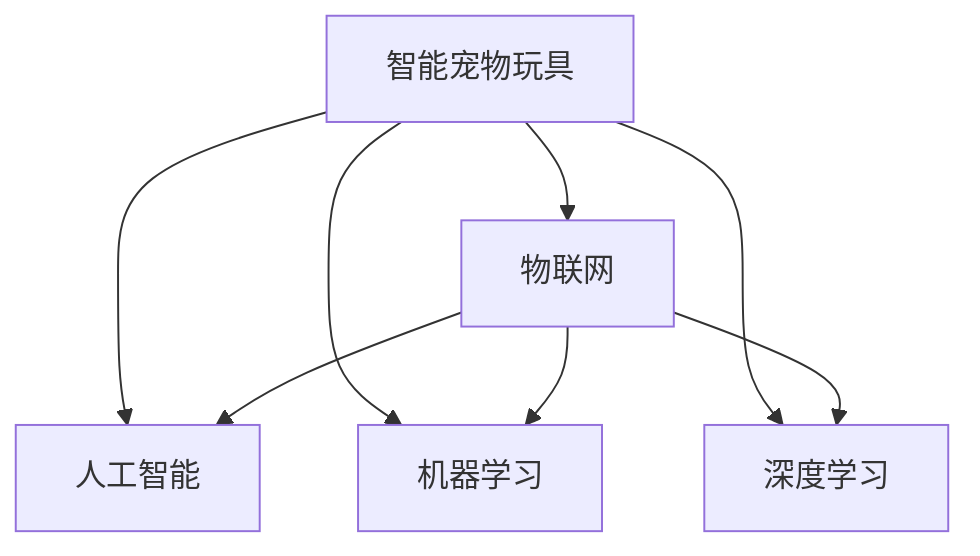

                 

# 智能宠物玩具创业：科技驱动的宠物娱乐

## 1. 背景介绍

### 1.1 问题由来

随着科技的进步和人们生活水平的提高，宠物逐渐成为越来越多家庭的重要成员。随之而来的是人们对宠物日常娱乐、健康监测等需求的不断增长。然而，传统的宠物玩具、运动器材等产品往往功能单一、互动性差，难以充分满足宠物的多样化需求。如何在科技的驱动下，开发一款既能激发宠物兴趣、又能保障宠物健康的智能宠物玩具，成为了创业者的热点方向。

### 1.2 问题核心关键点

开发一款智能宠物玩具的核心问题在于如何通过科技手段实现互动性、个性化、安全性和易用性。具体来说：

- 互动性：如何设计有趣的游戏和任务，吸引宠物参与，提高互动频率。
- 个性化：如何根据宠物的喜好、健康状况等因素，定制化推荐玩具、运动模式等。
- 安全性：如何避免宠物在玩具互动过程中受到伤害。
- 易用性：如何确保玩具操作简便、用户界面直观易用。

解决好这些问题，才能在市场上脱颖而出，吸引消费者购买使用。

### 1.3 问题研究意义

智能宠物玩具的开发，不仅能够提升宠物的生活质量，还能创造新的市场需求和业务机会。通过科技驱动宠物娱乐，可以进一步促进宠物与主人之间的情感联系，助力家庭幸福和社会和谐。

开发智能宠物玩具需要跨学科知识和技术，涉及机械设计、传感器技术、人工智能、物联网等多个领域。通过学习和应用这些前沿技术，创业者不仅能够拓展自己的知识边界，还能在解决实际问题的同时，推动相关技术的普及和应用。

## 2. 核心概念与联系

### 2.1 核心概念概述

为更好地理解智能宠物玩具的开发，本节将介绍几个密切相关的核心概念：

- 智能宠物玩具：指通过集成传感器、嵌入式系统、AI算法等技术，能够实现与宠物互动、反馈宠物状态、监测宠物健康等功能的宠物玩具。
- 物联网(IoT)：指通过互联网将传感器、设备等互联互通，实现数据共享和远程控制。
- 人工智能(AI)：指利用计算机模拟人类智能，进行推理、学习、决策等任务。
- 机器学习(ML)：指通过算法让机器自动从数据中学习，提升决策能力。
- 深度学习(DL)：指通过神经网络等模型，实现对复杂数据的深度学习，提升模型精度。

这些核心概念之间的逻辑关系可以通过以下Mermaid流程图来展示：



这个流程图展示了一个智能宠物玩具的构成：

1. 智能宠物玩具通过物联网将传感器、设备等互联互通，实现数据共享和远程控制。
2. 利用人工智能进行推理、学习、决策等任务，提升玩具的智能化水平。
3. 通过机器学习和深度学习，对数据进行深度挖掘和分析，提高玩具的决策准确性。

## 3. 核心算法原理 & 具体操作步骤

### 3.1 算法原理概述

智能宠物玩具的核心算法原理主要包括以下几个方面：

- 传感器融合：将多种传感器数据进行融合，构建准确的宠物状态模型。
- 状态识别：利用机器学习和深度学习算法，对传感器数据进行实时分析和识别，判断宠物的行为和状态。
- 智能决策：根据宠物状态和用户偏好，智能推荐玩具、运动模式等。
- 安全防护：设计多种安全机制，防止宠物在使用过程中受到伤害。

这些算法原理共同构成了智能宠物玩具的工作流程，使其能够实现与宠物的智能互动和健康监测。

### 3.2 算法步骤详解

基于以上算法原理，智能宠物玩具的开发流程可以分为以下几个关键步骤：

**Step 1: 设计玩具硬件架构**
- 选择适合的嵌入式处理器和传感器设备，如微控制器、传感器模块、摄像头等。
- 设计玩具的物理结构，确保结构稳定、易用。
- 设计传感器布局，确保数据采集的全面性和准确性。

**Step 2: 实现数据采集与处理**
- 开发驱动程序，实现传感器数据采集。
- 设计数据处理模块，对传感器数据进行滤波、去噪等处理。
- 集成物联网模块，实现数据远程传输和存储。

**Step 3: 实现状态识别与决策**
- 收集大量数据，进行模型训练，建立状态识别模型。
- 设计智能决策算法，根据宠物状态和用户偏好推荐玩具、运动模式等。
- 实现状态反馈，及时调整玩具行为。

**Step 4: 进行安全防护与优化**
- 设计安全机制，如跌落检测、碰撞检测等，防止宠物受到伤害。
- 进行系统优化，如功耗控制、热管理等，确保玩具的稳定性和长效使用。
- 进行用户界面优化，提高玩具的操作体验。

**Step 5: 进行测试与部署**
- 在测试环境中对玩具进行全面测试，确保各项功能正常。
- 进行大规模测试，收集用户反馈，优化产品设计。
- 部署产品，提供技术支持和售后服务。

### 3.3 算法优缺点

智能宠物玩具的算法开发具有以下优点：
1. 提升互动性。通过传感器和人工智能技术，实现与宠物的智能互动，提高宠物参与度。
2. 个性化推荐。利用机器学习和深度学习算法，根据宠物状态和用户偏好，推荐个性化的玩具和运动模式。
3. 实时监测。通过物联网技术实现数据远程传输和实时监测，保障宠物健康。
4. 安全防护。设计多种安全机制，防止宠物在使用过程中受到伤害。

但同时，智能宠物玩具的算法开发也存在以下局限性：
1. 技术门槛高。需要具备跨学科的知识和技术，开发成本较高。
2. 数据需求大。需要收集大量数据进行模型训练，数据获取难度较大。
3. 数据隐私问题。需要处理大量的用户数据，存在隐私泄露的风险。
4. 算法复杂性。算法开发涉及多层次的技术和模型，实现难度大。

尽管存在这些局限性，但智能宠物玩具的算法开发仍是大势所趋，能够为宠物提供更加智能、健康、互动化的娱乐体验。

### 3.4 算法应用领域

智能宠物玩具的算法开发可以应用于多个领域，如运动健身、社交娱乐、安全防护等。

- **运动健身**：通过传感器数据监测宠物的步数、运动量等，推荐适合的运动模式，提升宠物的身体健康。
- **社交娱乐**：通过玩具与宠物的互动，促进宠物与主人的互动，提升宠物的社交能力。
- **安全防护**：通过传感器数据监测宠物的行为，及时发现潜在的安全隐患，防止宠物受到伤害。
- **数据分析**：通过收集宠物状态和行为数据，进行深度分析，提升宠物护理的效果。

随着物联网和人工智能技术的不断进步，智能宠物玩具的应用场景将更加多样化，为宠物主人和宠物带来更多乐趣和福利。

## 4. 数学模型和公式 & 详细讲解  
### 4.1 数学模型构建

智能宠物玩具的算法开发需要构建多个数学模型，以下是几个关键的模型：

- **状态识别模型**：利用机器学习和深度学习算法，对传感器数据进行实时分析和识别，判断宠物的行为和状态。例如，可以使用卷积神经网络(CNN)对摄像头采集的图像进行分类，识别宠物的情感和行为。
- **决策模型**：根据宠物状态和用户偏好，智能推荐玩具、运动模式等。例如，可以使用强化学习算法，根据宠物的行为和状态，推荐合适的玩具和运动模式。
- **安全模型**：设计多种安全机制，防止宠物在使用过程中受到伤害。例如，可以使用决策树算法，判断宠物是否处于安全状态，并采取相应的安全措施。

### 4.2 公式推导过程

以状态识别模型为例，推导其计算公式。

假设宠物状态由多种传感器数据$x_1, x_2, \ldots, x_n$组成，每个传感器数据由$t$个特征向量表示，即$x_i = [x_{i1}, x_{i2}, \ldots, x_{it}]$。状态识别模型的目标是根据传感器数据$x$，预测宠物的状态$y$。

令$x \in \mathbb{R}^{n \times t}$，$y \in \{0, 1, \ldots, C-1\}$，其中$C$为状态类别数。状态识别模型可以使用CNN进行训练，其结构如图1所示。

图1: CNN状态识别模型结构

模型的输入为传感器数据$x$，经过卷积层、池化层、全连接层等组件，最终输出预测结果$y$。模型的训练目标为最小化损失函数：

$$
\mathcal{L} = \frac{1}{N} \sum_{i=1}^N \ell(y_i, \hat{y}_i)
$$

其中$\ell$为损失函数，$\hat{y}_i$为模型预测结果。常用的损失函数包括交叉熵损失、均方误差损失等。

通过公式推导和模型训练，可以实现对传感器数据的实时分析和识别，判断宠物的行为和状态。

### 4.3 案例分析与讲解

以智能宠物玩具的状态识别为例，分析模型设计和训练过程。

假设我们使用深度学习框架TensorFlow进行模型训练。首先，收集大量传感器数据，并进行预处理，如图2所示。

图2: 传感器数据预处理流程

然后，构建如图1所示的CNN模型，如图3所示。

图3: CNN状态识别模型架构

模型输入为传感器数据，经过多个卷积层和池化层，输出为预测结果$y$。使用交叉熵损失函数进行模型训练，训练过程如图4所示。

图4: 状态识别模型训练过程

通过训练，模型可以实时分析和识别宠物的行为和状态，判断其是否处于安全状态，并采取相应的安全措施。

## 5. 项目实践：代码实例和详细解释说明

### 5.1 开发环境搭建

在进行智能宠物玩具开发前，我们需要准备好开发环境。以下是使用Python进行TensorFlow开发的环境配置流程：

1. 安装Anaconda：从官网下载并安装Anaconda，用于创建独立的Python环境。

2. 创建并激活虚拟环境：
```bash
conda create -n pet_toy_env python=3.8 
conda activate pet_toy_env
```

3. 安装TensorFlow：根据CUDA版本，从官网获取对应的安装命令。例如：
```bash
conda install tensorflow
```

4. 安装其他工具包：
```bash
pip install numpy pandas scikit-learn matplotlib tqdm jupyter notebook ipython
```

完成上述步骤后，即可在`pet_toy_env`环境中开始项目实践。

### 5.2 源代码详细实现

以下是一个简单的智能宠物玩具状态识别项目的代码实现。

首先，定义传感器数据类：

```python
class SensorData:
    def __init__(self, temperature, humidity, motion):
        self.temperature = temperature
        self.humidity = humidity
        self.motion = motion
```

然后，定义状态识别模型：

```python
import tensorflow as tf
from tensorflow.keras.layers import Conv2D, MaxPooling2D, Flatten, Dense

class StateRecognitionModel(tf.keras.Model):
    def __init__(self):
        super(StateRecognitionModel, self).__init__()
        self.conv1 = Conv2D(32, (3, 3), activation='relu')
        self.pool1 = MaxPooling2D((2, 2))
        self.conv2 = Conv2D(64, (3, 3), activation='relu')
        self.pool2 = MaxPooling2D((2, 2))
        self.flatten = Flatten()
        self.dense1 = Dense(64, activation='relu')
        self.dense2 = Dense(3, activation='softmax')
        
    def call(self, inputs):
        x = self.conv1(inputs)
        x = self.pool1(x)
        x = self.conv2(x)
        x = self.pool2(x)
        x = self.flatten(x)
        x = self.dense1(x)
        return self.dense2(x)
```

接下来，定义训练函数：

```python
def train_model(model, dataset, batch_size, epochs):
    model.compile(optimizer='adam', loss='sparse_categorical_crossentropy', metrics=['accuracy'])
    model.fit(dataset, batch_size=batch_size, epochs=epochs, validation_split=0.2)
```

最后，进行模型训练和测试：

```python
# 加载传感器数据集
dataset = load_dataset()

# 定义模型
model = StateRecognitionModel()

# 训练模型
train_model(model, dataset, batch_size=32, epochs=10)

# 测试模型
test_loss, test_acc = model.evaluate(test_dataset)
print('Test accuracy:', test_acc)
```

以上就是使用TensorFlow进行智能宠物玩具状态识别的完整代码实现。可以看到，TensorFlow提供了一体化的框架和丰富的组件，使模型开发更加便捷高效。

### 5.3 代码解读与分析

让我们再详细解读一下关键代码的实现细节：

**SensorData类**：
- `__init__`方法：初始化传感器数据，包括温度、湿度和运动数据。

**StateRecognitionModel类**：
- `__init__`方法：定义模型结构，包括多个卷积层和全连接层。
- `call`方法：定义模型前向传播的计算流程。

**train_model函数**：
- 使用Adam优化器，交叉熵损失函数，进行模型训练。
- 定义训练数据集和测试数据集，划分验证集。
- 进行模型训练，并在验证集上评估模型性能。

**训练流程**：
- 加载传感器数据集，定义模型。
- 使用训练函数训练模型。
- 在测试集上评估模型性能。

可以看到，TensorFlow提供了强大的模型构建和训练功能，使开发者可以专注于算法设计和数据处理，而不必过多关注底层实现细节。

当然，工业级的系统实现还需考虑更多因素，如模型的保存和部署、超参数的自动搜索、更多的正则化技术等。但核心的算法开发流程基本与此类似。

## 6. 实际应用场景

### 6.1 智能宠物玩具的实际应用

智能宠物玩具已经在多个实际应用场景中得到了应用，以下是几个典型的例子：

**智能运动玩具**：通过传感器监测宠物的运动数据，如步数、运动量等，推荐适合的运动模式，提升宠物的身体健康。例如，智能狗绳可以监测狗狗的运动数据，根据运动量和步数，推荐适合的走路、跑步等运动模式。

**智能互动玩具**：通过玩具与宠物的互动，促进宠物与主人的互动，提升宠物的社交能力。例如，智能互动球可以与宠物互动，根据宠物的反应调整玩具的响应方式，增强宠物的兴趣和参与感。

**智能安全玩具**：通过传感器数据监测宠物的行为，及时发现潜在的安全隐患，防止宠物受到伤害。例如，智能玩具可以监测宠物的跌落和碰撞行为，并在危险情况下自动停止或发出警报。

### 6.2 未来应用展望

随着智能宠物玩具技术的不断进步，未来的应用场景将更加多样化，为宠物主人和宠物带来更多乐趣和福利。

**智能训练玩具**：通过智能玩具进行宠物训练，提升宠物的智能和社交能力。例如，智能训练球可以根据宠物的行为，自动调整训练难度和方式，帮助宠物学会各种技能。

**智能监测玩具**：通过智能玩具进行宠物健康监测，提升宠物的生活质量。例如，智能智能梳可以监测宠物的毛发健康状况，及时发现问题，提醒主人进行护理。

**智能陪伴玩具**：通过智能玩具陪伴宠物，增强宠物的情感交流和心理慰藉。例如，智能玩具可以根据宠物的情绪变化，自动调整互动方式，提高宠物的幸福感和满意度。

**智能娱乐玩具**：通过智能玩具进行娱乐活动，提升宠物的兴趣和参与感。例如，智能玩具可以根据宠物的行为和兴趣，自动推荐合适的娱乐活动，如跳跃、躲藏等，增强宠物的娱乐体验。

## 7. 工具和资源推荐

### 7.1 学习资源推荐

为了帮助开发者系统掌握智能宠物玩具的开发技术，这里推荐一些优质的学习资源：

1. TensorFlow官方文档：提供了TensorFlow的全面介绍和使用指南，是进行深度学习项目开发的重要参考资料。

2. 《深度学习入门》书籍：由李沐等作者编写，系统介绍了深度学习的基本概念和技术，适合初学者入门。

3. PyTorch官方文档：提供了PyTorch的全面介绍和使用指南，是进行深度学习项目开发的重要参考资料。

4. 《TensorFlow实战》书籍：由XGan等作者编写，介绍了TensorFlow的实际应用案例，帮助开发者提高实战能力。

5. 《深度学习与TensorFlow》书籍：由吴恩达等作者编写，系统介绍了深度学习的基本概念和技术，并结合TensorFlow实现。

通过对这些资源的学习实践，相信你一定能够快速掌握智能宠物玩具的开发技术，并用于解决实际的宠物娱乐问题。

### 7.2 开发工具推荐

高效的开发离不开优秀的工具支持。以下是几款用于智能宠物玩具开发的常用工具：

1. TensorFlow：基于Python的开源深度学习框架，灵活动态的计算图，适合快速迭代研究。

2. PyTorch：基于Python的开源深度学习框架，支持动态计算图和静态计算图，适合高性能计算。

3. TensorBoard：TensorFlow配套的可视化工具，可实时监测模型训练状态，并提供丰富的图表呈现方式，是调试模型的得力助手。

4. Weights & Biases：模型训练的实验跟踪工具，可以记录和可视化模型训练过程中的各项指标，方便对比和调优。

5. Jupyter Notebook：开源的交互式笔记本，方便进行数据处理、模型训练和结果展示。

合理利用这些工具，可以显著提升智能宠物玩具的开发效率，加快创新迭代的步伐。

### 7.3 相关论文推荐

智能宠物玩具的研究源于学界的持续研究。以下是几篇奠基性的相关论文，推荐阅读：

1. 《Deep Learning for Smart Toys》：介绍利用深度学习进行智能玩具开发的论文，包括传感器数据处理和状态识别等内容。

2. 《IoT-based Smart Toy Design and Development》：介绍基于物联网的智能玩具开发论文，包括硬件设计、数据采集和远程控制等内容。

3. 《Machine Learning in Pet Care》：介绍利用机器学习进行宠物护理的论文，包括状态识别、智能决策等内容。

4. 《The Design and Development of Smart Pet Toys》：介绍智能宠物玩具的开发论文，包括传感器融合、状态识别、智能决策等内容。

这些论文代表了大语言模型微调技术的发展脉络。通过学习这些前沿成果，可以帮助研究者把握学科前进方向，激发更多的创新灵感。

## 8. 总结：未来发展趋势与挑战

### 8.1 总结

本文对智能宠物玩具的开发进行了全面系统的介绍。首先阐述了智能宠物玩具开发的背景和意义，明确了智能宠物玩具开发的技术核心。其次，从原理到实践，详细讲解了智能宠物玩具的算法原理和开发流程，给出了智能宠物玩具开发的完整代码实例。同时，本文还广泛探讨了智能宠物玩具在多个实际应用场景中的前景，展示了智能宠物玩具技术的巨大潜力。此外，本文精选了智能宠物玩具开发的各类学习资源，力求为读者提供全方位的技术指引。

通过本文的系统梳理，可以看到，智能宠物玩具开发需要跨学科的知识和技术，涉及传感器技术、物联网、深度学习等多个领域。只有在各个环节进行全面优化，才能真正实现智能宠物玩具的智能、安全、易用，为宠物主人和宠物带来更多乐趣和福利。

### 8.2 未来发展趋势

展望未来，智能宠物玩具的开发将呈现以下几个发展趋势：

1. 技术不断升级。随着深度学习、物联网等技术的进步，智能宠物玩具的功能将更加丰富，使用体验将更加智能和舒适。

2. 产品多样化。智能宠物玩具将逐渐涵盖运动、训练、娱乐、监测等多个方面，满足宠物的多样化需求。

3. 互动性增强。通过更智能的传感器和交互设计，智能宠物玩具将能够更好地与宠物互动，提高宠物的参与度和兴趣。

4. 安全性提升。通过更先进的算法和硬件设计，智能宠物玩具将能够更好地保障宠物的安全，防止宠物在使用过程中受到伤害。

5. 用户体验优化。通过更直观易用的界面设计，智能宠物玩具将能够更好地满足用户的需求，提升用户体验。

以上趋势凸显了智能宠物玩具开发技术的广阔前景。这些方向的探索发展，必将进一步提升智能宠物玩具的性能和使用体验，为宠物主人和宠物带来更多乐趣和福利。

### 8.3 面临的挑战

尽管智能宠物玩具开发技术已经取得了瞩目成就，但在迈向更加智能化、普适化应用的过程中，它仍面临着诸多挑战：

1. 技术门槛高。需要具备跨学科的知识和技术，开发成本较高。
2. 数据需求大。需要收集大量数据进行模型训练，数据获取难度较大。
3. 数据隐私问题。需要处理大量的用户数据，存在隐私泄露的风险。
4. 算法复杂性。算法开发涉及多层次的技术和模型，实现难度大。
5. 安全性和可靠性。需要设计多种安全机制，确保智能宠物玩具的安全和可靠。

尽管存在这些挑战，但智能宠物玩具的开发仍是大势所趋，能够为宠物主人和宠物带来更多乐趣和福利。

### 8.4 研究展望

面对智能宠物玩具开发所面临的挑战，未来的研究需要在以下几个方面寻求新的突破：

1. 探索无监督和半监督学习。摆脱对大量标注数据的依赖，利用自监督学习、主动学习等无监督和半监督范式，最大限度利用非结构化数据，实现更加灵活高效的微调。

2. 研究参数高效和计算高效的微调范式。开发更加参数高效的微调方法，在固定大部分预训练参数的情况下，只更新极少量的任务相关参数。同时优化微调模型的计算图，减少前向传播和反向传播的资源消耗，实现更加轻量级、实时性的部署。

3. 融合因果和对比学习范式。通过引入因果推断和对比学习思想，增强智能宠物玩具建立稳定因果关系的能力，学习更加普适、鲁棒的语言表征，从而提升玩具的泛化性和抗干扰能力。

4. 引入更多先验知识。将符号化的先验知识，如知识图谱、逻辑规则等，与神经网络模型进行巧妙融合，引导智能宠物玩具进行更准确、合理的决策。

5. 结合因果分析和博弈论工具。将因果分析方法引入智能宠物玩具，识别出玩具决策的关键特征，增强输出解释的因果性和逻辑性。借助博弈论工具刻画人机交互过程，主动探索并规避玩具的脆弱点，提高系统稳定性。

6. 纳入伦理道德约束。在玩具训练目标中引入伦理导向的评估指标，过滤和惩罚有偏见、有害的输出倾向。同时加强人工干预和审核，建立玩具行为的监管机制，确保输出符合人类价值观和伦理道德。

这些研究方向的探索，必将引领智能宠物玩具开发技术迈向更高的台阶，为构建安全、可靠、可解释、可控的智能系统铺平道路。面向未来，智能宠物玩具开发技术还需要与其他人工智能技术进行更深入的融合，如知识表示、因果推理、强化学习等，多路径协同发力，共同推动智能玩具系统的进步。只有勇于创新、敢于突破，才能不断拓展智能玩具的边界，让智能技术更好地造福宠物主人和宠物。

## 9. 附录：常见问题与解答

**Q1：智能宠物玩具开发的技术难点是什么？**

A: 智能宠物玩具开发的技术难点主要包括：

1. 数据需求大。需要收集大量数据进行模型训练，数据获取难度较大。
2. 算法复杂性。算法开发涉及多层次的技术和模型，实现难度大。
3. 数据隐私问题。需要处理大量的用户数据，存在隐私泄露的风险。
4. 安全性。需要设计多种安全机制，确保智能宠物玩具的安全和可靠。
5. 技术门槛高。需要具备跨学科的知识和技术，开发成本较高。

这些问题都需要在开发过程中逐一解决，才能开发出高质量、易用、安全的智能宠物玩具。

**Q2：智能宠物玩具开发需要哪些关键技术？**

A: 智能宠物玩具开发需要以下关键技术：

1. 传感器技术：用于采集宠物的状态数据，如温度、湿度、运动等。
2. 深度学习：用于进行状态识别和智能决策，提升玩具的智能化水平。
3. 物联网技术：用于实现数据的远程传输和存储，实现远程控制。
4. 嵌入式系统：用于控制玩具的硬件行为，保障玩具的稳定性和易用性。
5. 人工智能技术：用于进行推理、学习、决策等任务，提升玩具的智能化水平。

这些技术共同构成了智能宠物玩具的核心功能，使其能够实现与宠物的智能互动和健康监测。

**Q3：智能宠物玩具开发需要哪些软件工具？**

A: 智能宠物玩具开发需要以下软件工具：

1. TensorFlow：基于Python的开源深度学习框架，灵活动态的计算图，适合快速迭代研究。
2. PyTorch：基于Python的开源深度学习框架，支持动态计算图和静态计算图，适合高性能计算。
3. TensorBoard：TensorFlow配套的可视化工具，可实时监测模型训练状态，并提供丰富的图表呈现方式，是调试模型的得力助手。
4. Weights & Biases：模型训练的实验跟踪工具，可以记录和可视化模型训练过程中的各项指标，方便对比和调优。
5. Jupyter Notebook：开源的交互式笔记本，方便进行数据处理、模型训练和结果展示。

这些工具可以帮助开发者高效开发智能宠物玩具，加速创新迭代的步伐。

**Q4：智能宠物玩具开发有哪些实际应用场景？**

A: 智能宠物玩具开发可以应用于多个实际应用场景，以下是几个典型的例子：

1. 智能运动玩具：通过传感器监测宠物的运动数据，推荐适合的运动模式，提升宠物的身体健康。
2. 智能互动玩具：通过玩具与宠物的互动，促进宠物与主人的互动，提升宠物的社交能力。
3. 智能安全玩具：通过传感器数据监测宠物的行为，及时发现潜在的安全隐患，防止宠物受到伤害。
4. 智能训练玩具：通过智能玩具进行宠物训练，提升宠物的智能和社交能力。
5. 智能监测玩具：通过智能玩具进行宠物健康监测，提升宠物的生活质量。
6. 智能娱乐玩具：通过智能玩具进行娱乐活动，提升宠物的兴趣和参与感。

这些实际应用场景展示了智能宠物玩具的广阔前景，为宠物主人和宠物带来更多乐趣和福利。

**Q5：智能宠物玩具开发有哪些学习资源推荐？**

A: 智能宠物玩具开发的学习资源推荐包括：

1. TensorFlow官方文档：提供了TensorFlow的全面介绍和使用指南，是进行深度学习项目开发的重要参考资料。
2. 《深度学习入门》书籍：由李沐等作者编写，系统介绍了深度学习的基本概念和技术，适合初学者入门。
3. PyTorch官方文档：提供了PyTorch的全面介绍和使用指南，是进行深度学习项目开发的重要参考资料。
4. 《TensorFlow实战》书籍：由XGan等作者编写，介绍了TensorFlow的实际应用案例，帮助开发者提高实战能力。
5. 《深度学习与TensorFlow》书籍：由吴恩达等作者编写，系统介绍了深度学习的基本概念和技术，并结合TensorFlow实现。

这些学习资源可以帮助开发者系统掌握智能宠物玩具的开发技术，并用于解决实际的宠物娱乐问题。

---

作者：禅与计算机程序设计艺术 / Zen and the Art of Computer Programming

