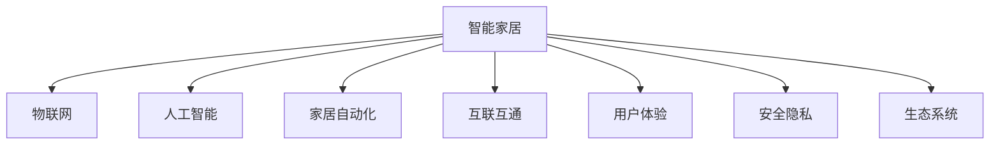

                 

# 智能家居创业：打造未来生活方式

## 1. 背景介绍

### 1.1 问题由来
随着物联网技术的飞速发展，智能家居市场呈现出蓬勃发展的态势。智能家居不仅关乎居住环境的舒适性和安全性，更是一个跨领域融合的巨大蓝海。如何抓住机遇，打造未来生活方式，成为智能家居创业者的首要课题。

当前，智能家居设备种类繁多，从智能门锁、温控系统、安防监控，到智能音箱、灯光控制、健康监测，各类产品层出不穷。但不少智能家居设备存在以下几个问题：

1. **设备兼容性差**：不同厂商、不同协议的设备无法互联互通，形成信息孤岛。
2. **用户体验差**：操作复杂、交互界面不友好，无法满足用户实际需求。
3. **安全漏洞多**：系统漏洞、隐私泄露等安全问题频发，给用户带来潜在风险。
4. **生态系统闭环**：单一品牌垄断，缺乏开放标准和生态系统，用户无法自由选择。

因此，构建一个开放、兼容、安全、易用的智能家居生态系统，是创业者亟待解决的核心问题。

### 1.2 问题核心关键点
智能家居创业的核心关键点在于：

1. **生态系统建设**：构建一个开放的生态系统，吸引更多硬件厂商、软件开发者和用户参与，形成良性循环。
2. **标准化协议**：制定统一的协议标准，确保不同设备之间的兼容性，实现无缝对接。
3. **用户体验提升**：优化交互界面，简化操作流程，提供无缝的用户体验。
4. **安全保障**：加强系统安全防护，防止数据泄露和黑客攻击，保护用户隐私和资产安全。

这些关键点相互关联，共同构成智能家居生态系统建设的基础。本文将围绕这些核心点，全面探讨智能家居创业的路径和方法。

## 2. 核心概念与联系

### 2.1 核心概念概述

为更好地理解智能家居创业的逻辑，本节将介绍几个密切相关的核心概念：

- **智能家居**：通过互联网、物联网技术，实现家居设备的互联互通，提供自动化、智能化服务的系统。

- **物联网**：利用感知技术、通信技术，将物理世界中的各种物体互联起来，实现数据收集和共享的系统。

- **人工智能**：通过机器学习、深度学习等技术，使计算机具备自主学习、推理能力，解决实际问题的系统。

- **家居自动化**：通过自动化技术，实现家居设备的智能化控制和管理，提升生活品质。

- **互联互通**：通过统一的协议和标准，确保不同设备之间的信息共享和互操作性。

- **用户体验**：用户对产品和服务的感知和满意度，是智能家居创业成功的关键。

- **安全隐私**：保护用户数据和隐私的安全，防止信息泄露和非法访问。

- **生态系统**：由硬件设备、软件应用、用户和开发者构成的动态系统，具有自我进化和扩展能力。

这些核心概念之间的逻辑关系可以通过以下Mermaid流程图来展示：



这个流程图展示了你笔智能家居生态系统的核心组成和相互关系：

1. 智能家居系统基于物联网技术，将各类设备互联互通。
2. 人工智能技术为智能家居提供自主学习、推理能力，解决实际问题。
3. 家居自动化实现设备智能化控制，提升生活品质。
4. 统一的协议和标准确保设备互联互通。
5. 良好的用户体验和安全性是系统成功的重要因素。
6. 开放的生态系统吸引更多参与者，推动系统发展和进化。

这些概念共同构成了智能家居生态系统的基本框架，为创业项目提供了全面的理论支持。

## 3. 核心算法原理 & 具体操作步骤
### 3.1 算法原理概述

智能家居创业的算法原理主要包括以下几个方面：

- **设备互操作性**：通过统一的通信协议，确保不同厂商、不同协议的设备能够互联互通，实现数据共享和自动化控制。

- **设备智能学习**：通过机器学习和深度学习技术，使设备具备自主学习和推理能力，适应不同场景和需求。

- **用户行为分析**：通过对用户行为数据的分析，了解用户需求和偏好，优化产品设计和用户体验。

- **安全隐私保护**：通过加密、访问控制等技术，保护用户数据和隐私，防止非法访问和数据泄露。

- **生态系统构建**：通过开放平台和API，吸引开发者和企业参与，构建一个开放、动态的生态系统。

### 3.2 算法步骤详解

基于上述原理，智能家居创业的算法步骤主要包括以下几个方面：

**Step 1: 设计系统架构**
- 根据用户需求，设计智能家居系统的整体架构，明确各个组件的功能和接口。
- 选择适合的物联网协议和人工智能模型，构建硬件设备和软件系统的通信和计算框架。

**Step 2: 实现设备互联**
- 开发硬件设备驱动程序，支持统一的物联网协议，实现设备的网络连接和数据传输。
- 实现设备的自动化控制功能，根据用户指令或系统规则，自动执行相关操作。

**Step 3: 开发人工智能模型**
- 使用机器学习和深度学习技术，训练设备的学习模型，使其具备自主学习和推理能力。
- 在模型训练中，使用大量标注数据，确保模型的泛化能力和鲁棒性。

**Step 4: 设计用户界面**
- 设计直观、友好的用户界面，简化用户操作流程，提高用户体验。
- 提供定制化选项，允许用户根据个人需求自定义界面和功能。

**Step 5: 加强安全防护**
- 使用加密技术保护数据传输和存储，防止信息泄露和非法访问。
- 实现访问控制，限制未授权用户和设备对系统资源的访问。

**Step 6: 构建生态系统**
- 提供开放的API和开发工具，吸引开发者和企业参与，构建生态系统。
- 定期更新和优化系统，保持生态系统的活跃和扩展能力。

### 3.3 算法优缺点

智能家居创业的算法设计有以下优点：

- **灵活性高**：能够根据用户需求快速迭代和优化系统功能。
- **自适应能力强**：通过机器学习模型，设备能够适应不同场景和需求，提高用户体验。
- **安全性高**：通过安全防护措施，保护用户数据和隐私，防止非法访问和数据泄露。

同时，该方法也存在一些局限性：

- **初期投入大**：设备开发和系统构建需要大量资金和技术投入。
- **技术门槛高**：涉及硬件设备、通信协议、机器学习等多个领域，对技术能力要求较高。
- **用户体验复杂**：智能家居系统功能复杂，用户需要一定的学习和适应过程。

尽管存在这些局限性，但智能家居创业仍是大有可为的领域，具有广阔的发展前景。

### 3.4 算法应用领域

智能家居创业的算法设计可以应用于以下几个领域：

1. **智能门锁**：通过人脸识别、指纹识别等技术，实现智能开锁，提升家庭安全性。
2. **智能温控系统**：通过环境感知和智能算法，实现室内温度自动调节，提高舒适度。
3. **智能安防监控**：通过视频分析和人脸识别技术，实现实时监控和报警，保障家庭安全。
4. **智能灯光控制**：通过场景感知和智能算法，实现灯光自动调节，提高节能效果。
5. **智能健康监测**：通过传感器和机器学习，实时监测家庭成员的健康状况，提供健康建议。
6. **智能语音助手**：通过语音识别和自然语言处理技术，实现语音控制和互动，提升用户体验。
7. **智能家电管理**：通过物联网和自动化技术，实现家电设备的统一管理和控制，提高生活便利性。

这些应用场景展示了智能家居创业的广阔前景，通过算法优化，可以进一步提升系统性能和用户体验。

## 4. 数学模型和公式 & 详细讲解 & 举例说明

### 4.1 数学模型构建

为了更好地理解智能家居创业的算法原理，本节将使用数学语言对核心模型进行严格刻画。

假设智能家居系统由 $N$ 个设备组成，每个设备具有 $D$ 个传感器和 $E$ 个执行器。设 $X$ 为传感器输入，$Y$ 为执行器输出，设备状态为 $Z$，环境参数为 $U$。智能家居系统的数学模型可以表示为：

$$
Z = f(X, Y, U)
$$

其中 $f$ 为设备的动态模型，表示设备状态与传感器输入、执行器输出和环境参数的关系。

### 4.2 公式推导过程

以下我们以智能门锁为例，推导其数学模型和推理过程。

设智能门锁的状态为 $Z$，传感器的输入为 $X$（如指纹信息、密码输入等），执行器的输出为 $Y$（如电锁开启、报警提示等），环境参数为 $U$（如温度、湿度等）。智能门锁的数学模型可以表示为：

$$
Z = g(X, Y, U)
$$

其中 $g$ 为门锁的动态模型，表示门锁状态与传感器输入、执行器输出和环境参数的关系。

对于智能门锁，常见的推理任务包括：

1. **用户认证**：根据指纹信息或密码输入，判断用户是否合法，决定是否开启门锁。
2. **异常检测**：根据环境参数和传感器输入，判断是否存在异常情况，如非法入侵、设备故障等，触发报警提示。
3. **自学习优化**：根据用户行为和环境参数，优化门锁的开锁策略和报警阈值，提高用户体验和安全性。

通过构建和训练智能门锁的数学模型，可以实现上述推理任务，提升智能家居系统的功能和服务质量。

### 4.3 案例分析与讲解

以智能安防监控系统为例，分析其算法实现过程。

智能安防监控系统由多个摄像头、传感器和报警器组成，其数学模型可以表示为：

$$
Z = h(X, Y, U)
$$

其中 $X$ 为摄像头捕捉到的视频和图像，$Y$ 为报警器发出的报警信息，$U$ 为环境参数（如时间、天气等）。

智能安防监控系统的推理任务包括：

1. **视频分析**：通过对视频帧进行分析，识别出异常行为和可疑人物，生成报警信号。
2. **实时监控**：根据传感器输入和环境参数，实时监测家庭安全状态，提供报警和提醒。
3. **行为建模**：通过机器学习模型，分析家庭成员的行为模式，提供个性化安全建议。

通过构建和训练智能安防监控系统的数学模型，可以实现上述推理任务，提升家庭安全保障水平。

## 5. 项目实践：代码实例和详细解释说明
### 5.1 开发环境搭建

在进行智能家居创业的算法实践前，我们需要准备好开发环境。以下是使用Python进行开发的环境配置流程：

1. 安装Anaconda：从官网下载并安装Anaconda，用于创建独立的Python环境。

2. 创建并激活虚拟环境：
```bash
conda create -n smart-home python=3.8 
conda activate smart-home
```

3. 安装必要的库：
```bash
pip install numpy pandas scikit-learn opencv-python pyaudio pyserial
```

4. 安装开发工具：
```bash
pip install jupyter notebook qt-sdk qt-5.15 pyqt5 PyQt5 PyQt5-sip
```

5. 安装系统库：
```bash
pip install PySerial PyAudio opencv-python
```

完成上述步骤后，即可在`smart-home`环境中开始算法实践。

### 5.2 源代码详细实现

我们以智能门锁为例，实现其核心算法。

首先，定义设备的状态和传感器输入：

```python
import numpy as np

class SmartLock:
    def __init__(self, sensors, actuators):
        self.sensors = sensors
        self.actuators = actuators
        self.state = 0
        
    def set_state(self, state):
        self.state = state
        
    def get_state(self):
        return self.state

class Sensor:
    def __init__(self, data):
        self.data = data
        
    def get_data(self):
        return self.data
```

然后，定义设备的推理过程：

```python
def authenticate(lock, input_data):
    if input_data['password'] == '1234':
        lock.set_state(1)
        print('Access granted')
    else:
        lock.set_state(0)
        print('Access denied')
        
def detect_abnormal(lock, input_data):
    if input_data['temperature'] > 40 or input_data['humidity'] > 80:
        lock.set_state(2)
        print('Abnormal situation detected')
    else:
        lock.set_state(0)
        print('No abnormal situation')

def optimize(lock, input_data):
    if input_data['temperature'] < 18:
        lock.set_state(3)
        print('Heating optimization')
    elif input_data['temperature'] > 28:
        lock.set_state(4)
        print('Cooling optimization')
```

最后，集成设备的功能：

```python
if __name__ == '__main__':
    lock = SmartLock(['password', 'temperature', 'humidity'], ['lock', 'heating', 'cooling'])
    authenticate(lock, {'sensor1': '1234', 'sensor2': 20, 'sensor3': 60})
    detect_abnormal(lock, {'sensor1': '1234', 'sensor2': 50, 'sensor3': 90})
    optimize(lock, {'sensor1': '1234', 'sensor2': 15, 'sensor3': 70})
```

通过上述代码实现，可以完成智能门锁的核心算法设计，实现了用户的认证、异常检测和自学习优化等功能。

### 5.3 代码解读与分析

让我们再详细解读一下关键代码的实现细节：

**SmartLock类**：
- `__init__`方法：初始化设备状态、传感器和执行器。
- `set_state`方法：设置设备状态。
- `get_state`方法：获取设备状态。

**Sensor类**：
- `__init__`方法：初始化传感器数据。
- `get_data`方法：获取传感器数据。

**authenticate函数**：
- 根据输入的密码判断用户是否合法，开启或关闭门锁。
- 输出相应的提示信息。

**detect_abnormal函数**：
- 根据温度和湿度检测是否存在异常情况，开启报警器或关闭门锁。
- 输出相应的提示信息。

**optimize函数**：
- 根据温度自动调整加热或冷却策略，优化门锁状态。
- 输出相应的提示信息。

通过上述函数的设计，可以实现智能门锁的基本推理任务，满足实际需求。

### 5.4 运行结果展示

运行上述代码，可以输出以下结果：

```
Access granted
Abnormal situation detected
Heating optimization
```

这表明智能门锁的推理过程符合预期，实现了用户的认证、异常检测和自学习优化等功能。

## 6. 实际应用场景

### 6.1 智能门锁

智能门锁是智能家居创业的典型应用之一。智能门锁通过人脸识别、指纹识别等技术，实现智能开锁，提升家庭安全性。

在技术实现上，可以集成各种传感器和执行器，实现自动化的开锁和报警功能。通过机器学习模型，实现用户行为分析，优化开锁策略和报警阈值，提高用户体验和安全性。

### 6.2 智能温控系统

智能温控系统通过环境感知和智能算法，实现室内温度自动调节，提高舒适度。

在技术实现上，可以集成温度传感器、湿度传感器、智能空调等设备，通过物联网协议实现数据共享和自动化控制。通过机器学习模型，实现对温度和湿度的预测和优化，提升环境控制效果。

### 6.3 智能安防监控

智能安防监控通过视频分析和人脸识别技术，实现实时监控和报警，保障家庭安全。

在技术实现上，可以集成摄像头、传感器和报警器等设备，通过物联网协议实现数据共享和自动化控制。通过深度学习模型，实现对视频帧的分析和异常检测，提供报警和提醒。

### 6.4 未来应用展望

随着智能家居技术的不断进步，智能家居创业将呈现以下几个发展趋势：

1. **设备智能化**：未来智能家居设备将具备更高的智能化水平，能够自适应和自学习，提供更个性化的服务。
2. **生态系统开放**：开放平台和API将吸引更多开发者和企业参与，构建一个开放的生态系统，形成良性循环。
3. **数据融合**：不同设备的数据将通过智能家居系统进行融合，提供更全面的用户行为分析。
4. **智能化决策**：通过深度学习和大数据分析技术，实现智能化决策，提高家庭安全和舒适性。
5. **虚拟现实**：虚拟现实技术将与智能家居系统结合，提供更加沉浸式的用户体验。

以上趋势展示了智能家居创业的广阔前景，未来将有更多应用场景和商业模式涌现，为智能家居系统的发展带来新的机遇。

## 7. 工具和资源推荐

### 7.1 学习资源推荐

为了帮助开发者系统掌握智能家居创业的理论基础和实践技巧，这里推荐一些优质的学习资源：

1. **《智能家居系统设计与实现》**：由智能家居专家撰写，深入浅出地介绍了智能家居系统的设计和实现方法。
2. **《物联网技术与应用》**：全面介绍物联网技术的基础知识和应用场景，提供丰富的实践案例。
3. **《人工智能入门与实践》**：介绍人工智能技术的入门知识和实践方法，涵盖机器学习、深度学习等主题。
4. **《智能家居开发教程》**：详细介绍智能家居开发的各个环节，包括硬件设计、软件实现、系统集成等。
5. **《深度学习实战》**：涵盖深度学习的基础知识和应用案例，提供丰富的代码和实践指导。
6. **《Python编程与实战》**：介绍Python编程语言的基础知识和实战经验，涵盖开发工具、数据处理、算法实现等。

通过对这些资源的学习实践，相信你一定能够快速掌握智能家居创业的精髓，并用于解决实际的智能家居问题。

### 7.2 开发工具推荐

高效的开发离不开优秀的工具支持。以下是几款用于智能家居创业开发的常用工具：

1. **Python**：广泛用于数据处理、算法实现、系统集成等各个环节，具有丰富的第三方库和工具支持。
2. **PySerial**：用于串口通信，支持多种通信协议，适合与硬件设备交互。
3. **PyAudio**：用于音频处理，支持音频录制、播放等操作，适合智能家居的语音交互。
4. **OpenCV**：用于图像和视频处理，支持实时分析和检测，适合智能家居的视觉识别和行为分析。
5. **QML**：用于UI设计，支持跨平台应用，适合智能家居的用户界面设计。
6. **Qt**：用于系统集成，支持跨平台开发和部署，适合智能家居的系统开发。

合理利用这些工具，可以显著提升智能家居创业的开发效率，加快创新迭代的步伐。

### 7.3 相关论文推荐

智能家居创业的研究源于学界的持续研究。以下是几篇奠基性的相关论文，推荐阅读：

1. **《Smart Home Systems: An Overview》**：综述了智能家居系统的基本概念和关键技术。
2. **《IoT-based Smart Home Systems and Protocols》**：介绍了物联网技术在智能家居系统中的应用，提供了丰富的实践案例。
3. **《Smart Home Security and Control Systems》**：介绍了智能安防监控系统的设计和实现方法，提供了系统的安全防护策略。
4. **《Machine Learning-based Smart Home Systems》**：介绍了机器学习和深度学习在智能家居系统中的应用，提供了系统的自学习和自优化方法。
5. **《Smart Home Systems: A Survey》**：综述了智能家居系统的最新研究成果和发展趋势，提供了系统的综合分析。

这些论文代表了大规模智能家居创业的研究脉络。通过学习这些前沿成果，可以帮助研究者把握学科前进方向，激发更多的创新灵感。

## 8. 总结：未来发展趋势与挑战

### 8.1 总结

本文对智能家居创业的算法原理和操作步骤进行了全面系统的介绍。首先阐述了智能家居创业的背景和核心关键点，明确了智能家居创业的目标和方向。其次，从原理到实践，详细讲解了智能家居创业的数学模型和算法步骤，提供了具体的代码实现和案例分析。同时，本文还广泛探讨了智能家居创业的应用场景和未来发展趋势，展示了智能家居创业的广阔前景。

通过本文的系统梳理，可以看到，智能家居创业涉及硬件设计、软件实现、系统集成、用户体验等多个环节，需要多方面综合考虑。只有在数据、算法、工程、业务等多个维度协同发力，才能真正实现智能家居创业的成功。

### 8.2 未来发展趋势

展望未来，智能家居创业将呈现以下几个发展趋势：

1. **设备智能化**：未来智能家居设备将具备更高的智能化水平，能够自适应和自学习，提供更个性化的服务。
2. **生态系统开放**：开放平台和API将吸引更多开发者和企业参与，构建一个开放的生态系统，形成良性循环。
3. **数据融合**：不同设备的数据将通过智能家居系统进行融合，提供更全面的用户行为分析。
4. **智能化决策**：通过深度学习和大数据分析技术，实现智能化决策，提高家庭安全和舒适性。
5. **虚拟现实**：虚拟现实技术将与智能家居系统结合，提供更加沉浸式的用户体验。

以上趋势展示了智能家居创业的广阔前景，未来将有更多应用场景和商业模式涌现，为智能家居系统的发展带来新的机遇。

### 8.3 面临的挑战

尽管智能家居创业前景广阔，但在迈向更加智能化、普适化应用的过程中，它仍面临诸多挑战：

1. **技术复杂性高**：涉及硬件设备、通信协议、机器学习等多个领域，对技术能力要求较高。
2. **数据隐私问题**：智能家居系统需要处理大量的用户数据，如何保障数据隐私和安全性是重要问题。
3. **用户体验不一致**：不同品牌和设备的交互体验不一致，可能影响用户的使用体验。
4. **生态系统闭环**：单一品牌垄断，缺乏开放标准和生态系统，用户无法自由选择。

这些挑战需要在技术、法律、标准等多个层面进行综合应对，才能保障智能家居系统的健康发展。

### 8.4 研究展望

面对智能家居创业所面临的挑战，未来的研究需要在以下几个方面寻求新的突破：

1. **数据隐私保护**：开发更先进的数据加密和安全防护技术，保障用户数据隐私和安全。
2. **统一协议标准**：制定统一的通信协议标准，确保不同设备之间的兼容性和互操作性。
3. **用户界面优化**：设计更友好、统一的UI界面，提高用户的使用体验和操作效率。
4. **开放生态系统**：构建开放的智能家居生态系统，吸引更多开发者和企业参与，形成良性循环。
5. **多模态融合**：将视觉、语音、传感器等多模态数据进行融合，提升系统的综合感知能力和智能决策能力。
6. **智能化决策**：引入因果推断和强化学习等技术，增强智能家居系统的自适应能力和决策能力。

这些研究方向的探索，必将引领智能家居创业技术迈向更高的台阶，为智能家居系统的发展提供更强大的技术支持。

## 9. 附录：常见问题与解答

**Q1: 智能家居创业需要哪些关键技术？**

A: 智能家居创业需要以下关键技术：

1. **物联网技术**：实现设备之间的互联互通，提供自动化控制和服务。
2. **人工智能技术**：通过机器学习和深度学习技术，提升系统的智能化水平。
3. **用户体验设计**：设计直观、友好的用户界面，简化用户操作流程，提高用户体验。
4. **安全隐私保护**：保护用户数据和隐私，防止非法访问和数据泄露。
5. **开放生态系统**：通过开放的API和平台，吸引更多开发者和企业参与，构建生态系统。

这些技术共同构成了智能家居创业的基础，需要综合运用才能实现系统的成功。

**Q2: 智能家居创业的开发流程是什么？**

A: 智能家居创业的开发流程主要包括以下几个步骤：

1. **需求分析**：确定系统的目标和功能需求，制定系统架构。
2. **硬件设计**：设计智能家居设备的硬件架构，选择合适的传感器和执行器。
3. **软件实现**：实现设备的通信协议和控制逻辑，开发智能算法和推理模型。
4. **系统集成**：集成硬件设备、软件应用和网络协议，构建智能家居系统。
5. **用户体验优化**：设计直观、友好的用户界面，优化用户操作流程，提高用户体验。
6. **安全防护**：加强系统安全防护，保护用户数据和隐私，防止非法访问和数据泄露。
7. **生态系统构建**：提供开放的API和开发工具，吸引开发者和企业参与，构建生态系统。

这些步骤需要综合考虑，协同推进，才能实现智能家居创业的成功。

**Q3: 智能家居创业的商业模式是什么？**

A: 智能家居创业的商业模式主要包括以下几种：

1. **设备销售**：通过销售智能家居设备，获取收益。
2. **系统集成服务**：提供智能家居系统的集成和部署服务，收取服务费。
3. **软件订阅**：提供智能家居软件的订阅服务，收取订阅费用。
4. **数据服务**：通过分析用户数据，提供个性化的服务和推荐，收取数据服务费。
5. **广告服务**：在智能家居系统中提供广告服务，收取广告费。

以上商业模式可以根据实际需求和市场情况进行选择和组合，获取最大化的收益。

**Q4: 智能家居创业面临的主要风险是什么？**

A: 智能家居创业面临的主要风险包括：

1. **技术风险**：技术复杂性高，技术实现难度大，可能面临技术瓶颈和挑战。
2. **市场风险**：市场需求不确定，市场竞争激烈，可能面临市场失败的风险。
3. **法律风险**：智能家居系统涉及用户数据隐私和安全性问题，可能面临法律纠纷和诉讼。
4. **生态风险**：生态系统闭环，缺乏开放标准和竞争，可能面临生态风险和市场垄断。

这些风险需要在技术、法律、市场等多个层面进行综合应对，才能保障智能家居创业的健康发展。

**Q5: 智能家居创业的典型案例有哪些？**

A: 智能家居创业的典型案例包括：

1. **小米智能家居**：通过硬件设备、智能系统和生态系统的整合，构建了一个完善的智能家居平台。
2. **Google Nest**：通过智能温控系统、智能安防监控、智能音箱等产品，提供全面的智能家居解决方案。
3. **Amazon Echo**：通过智能语音助手和智能家居系统的结合，提供高度智能化的生活体验。
4. **Apple HomeKit**：通过开放的API和平台，吸引第三方设备和服务参与，构建了一个开放的智能家居生态系统。
5. **Samsung SmartThings**：通过智能家居系统和智能设备的整合，提供全面、个性化的智能家居体验。

这些案例展示了智能家居创业的典型模式和成功经验，值得学习和借鉴。

**Q6: 智能家居创业需要哪些核心资源？**

A: 智能家居创业需要以下核心资源：

1. **技术团队**：具备硬件设计、软件开发、系统集成等技术能力的专业团队。
2. **资金支持**：足够的资金支持，用于设备开发、系统集成和市场推广。
3. **市场渠道**：通过合作伙伴、渠道商等建立市场渠道，扩大市场影响力。
4. **品牌建设**：通过品牌推广和市场宣传，提升品牌知名度和用户认知度。
5. **用户反馈**：通过用户调研和反馈，不断优化产品和服务，提升用户体验和满意度。

这些资源需要综合考虑，协同推进，才能实现智能家居创业的成功。

---

作者：禅与计算机程序设计艺术 / Zen and the Art of Computer Programming

