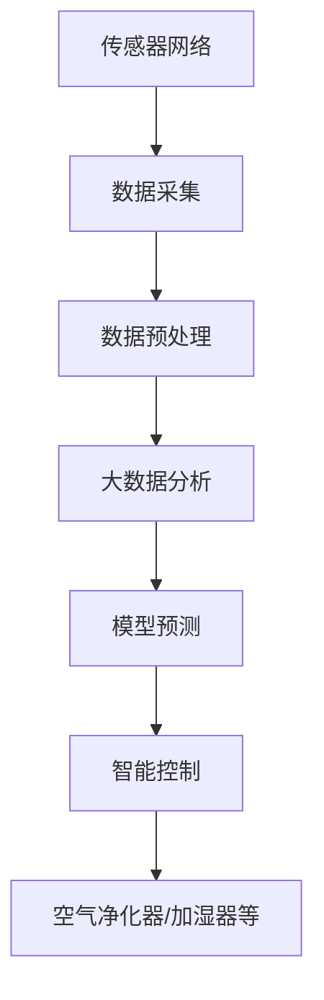

                 

# 智能家居防霾创业：室内空气质量的精确控制

## 1. 背景介绍

### 1.1 问题由来
随着社会经济的快速发展，人们对于生活品质的要求不断提高，特别是在室内空气质量方面。然而，由于现代建筑材料的密闭性和空调、暖气等设备的普及，室内空气污染问题日益严重，包括PM2.5、甲醛、苯等有害气体的浓度常常超标，对人体健康造成潜在的威胁。室内空气污染不仅影响到居民的身体健康，还可能引发头痛、咳嗽、哮喘等多种疾病，甚至可能引发肺癌等严重疾病。因此，如何有效监测和控制室内空气质量，成为社会各界关注的重点。

### 1.2 问题核心关键点
为了解决室内空气质量问题，本项目提出了一种基于物联网技术的大数据分析方法，用于室内空气质量的监测和控制。通过部署大量传感器，实时采集室内空气质量数据，利用机器学习算法进行数据分析和预测，结合智能控制系统，实现室内空气质量的精确控制。

## 2. 核心概念与联系

### 2.1 核心概念概述

本项目涉及的核心概念包括：

- **物联网技术**：通过传感器网络、无线网络等技术手段，将室内环境数据实时采集并传输到中央服务器，实现数据的自动化、实时化处理。
- **大数据分析**：利用机器学习、深度学习等数据分析技术，对采集到的室内空气质量数据进行建模、分析和预测，提取有价值的信息。
- **智能控制**：根据数据分析结果，通过智能控制系统对室内空气净化器、加湿器、负离子发生器等设备进行自动调节，达到精确控制室内空气质量的目的。

这些核心概念之间的联系可以简明地概括如下：

1. 物联网技术为室内空气质量监测提供了数据采集的基础设施，是整个项目的数据源。
2. 大数据分析是对物联网采集到的海量数据进行高效处理和分析，挖掘数据背后的信息。
3. 智能控制是依据大数据分析结果，通过控制系统对室内空气质量进行动态调整。

这些概念共同构成了该项目的技术框架，实现室内空气质量的精确控制。

### 2.2 核心概念原理和架构的 Mermaid 流程图



上述流程图示意图：通过传感器网络实时采集室内空气质量数据，经过预处理后，进入大数据分析环节，构建预测模型并进行预测，最终根据预测结果通过智能控制系统调整设备参数，实现室内空气质量的精确控制。

## 3. 核心算法原理 & 具体操作步骤

### 3.1 算法原理概述

本项目采用的核心算法为基于支持向量机的回归模型(Support Vector Regression, SVR)，用于室内空气质量的预测和控制。SVR是一种基于结构风险最小化原理的机器学习算法，能够在有限数据集上实现较好的预测效果。其核心思想是通过构造一个最优的超平面，使得训练数据和测试数据之间的误差最小化，从而实现对室内空气质量的预测。

### 3.2 算法步骤详解

#### 3.2.1 数据采集与预处理

1. **数据采集**：通过部署大量传感器，实时采集室内空气质量数据，包括PM2.5、甲醛、苯、温度、湿度等指标。传感器数据通常以时间序列的形式进行采集。

2. **数据预处理**：对采集到的数据进行清洗、去噪、归一化等预处理操作，以提升模型的预测精度。预处理过程中，需要注意处理缺失数据、异常值等问题。

#### 3.2.2 特征工程

1. **特征提取**：根据室内空气质量监测的需求，选择有意义的特征，如PM2.5、甲醛、苯的浓度，温度、湿度等。

2. **特征组合**：通过组合不同的特征，构建新的特征组合，提高模型的预测能力。例如，将PM2.5和甲醛的浓度相乘作为新的特征。

3. **特征选择**：利用特征选择算法，如L1正则化的Lasso回归，选择对模型预测贡献较大的特征，减少模型的复杂度，避免过拟合。

#### 3.2.3 模型训练与预测

1. **模型训练**：使用支持向量机回归算法，训练一个预测模型，用于对室内空气质量进行预测。训练过程中，需要注意选择合适的核函数、正则化参数等超参数。

2. **模型评估**：使用交叉验证等方法，评估模型的预测性能，选择最优的模型进行预测。

3. **模型预测**：将新的室内空气质量数据输入训练好的模型，预测未来的空气质量状况，生成控制指令。

#### 3.2.4 智能控制

1. **设备控制**：根据模型预测结果，通过智能控制系统调整空气净化器、加湿器、负离子发生器等设备的运行参数，如风速、湿度、滤网更换时间等。

2. **反馈调整**：实时监控设备的运行状态和室内空气质量变化，根据反馈调整设备运行参数，实现精确控制。

### 3.3 算法优缺点

#### 3.3.1 优点

1. **预测精度高**：SVR算法能够很好地处理非线性问题，适用于室内空气质量的复杂预测。
2. **鲁棒性强**：SVR算法对数据中的异常值和噪声具有较好的鲁棒性，能够减少模型过拟合的风险。
3. **实时性强**：通过传感器网络实时采集数据，能够实现对室内空气质量的实时监控和控制。

#### 3.3.2 缺点

1. **计算复杂度高**：SVR算法在训练和预测过程中，需要求解二次规划问题，计算复杂度较高。
2. **参数选择困难**：SVR算法需要选择合适的核函数、正则化参数等超参数，参数选择不当可能导致模型性能下降。
3. **解释性差**：SVR算法的预测结果是一个黑盒模型，难以解释模型的内部工作机制。

### 3.4 算法应用领域

本算法不仅适用于室内空气质量的精确控制，还可以应用于其他类似的应用场景，如水质监测、土壤质量预测等。在这些领域中，通过部署传感器网络采集数据，利用大数据分析和机器学习算法，可以实现对环境质量的精确预测和控制。

## 4. 数学模型和公式 & 详细讲解 & 举例说明

### 4.1 数学模型构建

SVR算法的数学模型如下：

$$
\begin{aligned}
\min_{\mathbf{w}, b, \xi, \zeta, C} & \frac{1}{2}\|\mathbf{w}\|^2 + C \sum_{i=1}^{n} \xi_i + \frac{1}{2} \sum_{i=1}^{n} \zeta_i \\
\text{subject to} & y_i - (\mathbf{w} \cdot \phi(\mathbf{x}_i) + b) \leq \epsilon + \xi_i \\
& \zeta_i - (y_i - (\mathbf{w} \cdot \phi(\mathbf{x}_i) + b)) \leq \epsilon \\
& \xi_i \geq 0, \zeta_i \geq 0
\end{aligned}
$$

其中，$\mathbf{w}$ 和 $b$ 为模型参数，$\xi_i$ 和 $\zeta_i$ 为松弛变量，$C$ 为正则化参数，$\epsilon$ 为容差参数，$\phi(\mathbf{x}_i)$ 为特征映射函数，$y_i$ 为标签。

### 4.2 公式推导过程

1. **目标函数**：目标函数为：

$$
\min_{\mathbf{w}, b} \frac{1}{2}\|\mathbf{w}\|^2 + C \sum_{i=1}^{n} \max(0, y_i - (\mathbf{w} \cdot \phi(\mathbf{x}_i) + b))
$$

2. **拉格朗日乘子法**：引入拉格朗日乘子 $\alpha_i$，构建拉格朗日函数：

$$
\mathcal{L}(\mathbf{w}, b, \alpha, \alpha^*) = \frac{1}{2}\|\mathbf{w}\|^2 + C \sum_{i=1}^{n} \max(0, y_i - (\mathbf{w} \cdot \phi(\mathbf{x}_i) + b)) + \sum_{i=1}^{n} \alpha_i \max(0, y_i - (\mathbf{w} \cdot \phi(\mathbf{x}_i) + b)) - \sum_{i=1}^{n} \alpha_i y_i
$$

3. **对偶问题**：将原始问题转化为对偶问题，求解对偶变量 $\alpha$：

$$
\max_{\alpha} \sum_{i=1}^{n} \alpha_i y_i - \frac{1}{2} \sum_{i=1}^{n} \sum_{j=1}^{n} \alpha_i \alpha_j (\mathbf{x}_i, \mathbf{x}_j)^\top - \frac{1}{2} \sum_{i=1}^{n} C \alpha_i
$$

4. **解的对偶形式**：解的对偶形式为：

$$
\begin{aligned}
& \mathbf{w} = \sum_{i=1}^{n} \alpha_i \phi(\mathbf{x}_i) \\
& b = y_i - (\mathbf{w} \cdot \phi(\mathbf{x}_i) + \alpha_i)
\end{aligned}
$$

### 4.3 案例分析与讲解

假设有一个室内空气质量监测系统，需要预测未来小时的室内PM2.5浓度。系统部署了10个传感器，采集了过去200小时的PM2.5浓度数据，数据特征包括温度、湿度、人体活动等。

1. **数据预处理**：清洗数据，去除缺失值和异常值，对数据进行归一化处理。

2. **特征工程**：选择PM2.5浓度、温度、湿度、人体活动等特征，构建新的特征组合，如PM2.5浓度和温度的乘积。

3. **模型训练**：使用SVR算法训练预测模型，选择合适的核函数和正则化参数。

4. **模型预测**：将未来小时的室内环境数据输入训练好的模型，预测PM2.5浓度。

5. **智能控制**：根据预测结果，智能控制系统调整空气净化器的运行参数，如开启时间、风速等。

## 5. 项目实践：代码实例和详细解释说明

### 5.1 开发环境搭建

1. **安装Python和相关库**：安装Python 3.7及以上版本，安装Scikit-learn、NumPy、Pandas等数据处理和机器学习库。

2. **安装传感器硬件**：选择适合的传感器，如PM2.5传感器、温湿度传感器等，并确保传感器能够稳定工作。

3. **搭建数据采集平台**：使用开源软件如Raspberry Pi、Arduino等搭建数据采集平台，将传感器数据通过无线网络传输到中央服务器。

4. **部署数据分析平台**：使用云服务如AWS、Google Cloud等部署数据分析平台，处理和存储传感器数据。

### 5.2 源代码详细实现

1. **数据采集与预处理**：

```python
import pandas as pd
import numpy as np
from sklearn.preprocessing import StandardScaler

# 读取传感器数据
data = pd.read_csv('sensor_data.csv')

# 数据清洗和处理
data = data.dropna()  # 去除缺失值
data = data.drop(columns=['timestamp'])  # 去除时间列

# 归一化处理
scaler = StandardScaler()
data = scaler.fit_transform(data)

# 特征选择
features = ['pm2.5', 'temperature', 'humidity', 'activity']
data = data[features]

# 保存预处理后的数据
data.to_csv('processed_data.csv', index=False)
```

2. **特征工程**：

```python
# 读取预处理后的数据
data = pd.read_csv('processed_data.csv')

# 特征组合
data['pm2.5_temperature'] = data['pm2.5'] * data['temperature']

# 特征选择
features = ['pm2.5', 'temperature', 'humidity', 'activity', 'pm2.5_temperature']
data = data[features]

# 保存特征组合后的数据
data.to_csv('combined_data.csv', index=False)
```

3. **模型训练与预测**：

```python
from sklearn.svm import SVR
from sklearn.model_selection import train_test_split
from sklearn.metrics import mean_squared_error

# 读取特征组合后的数据
data = pd.read_csv('combined_data.csv')

# 分割数据集
X = data.iloc[:, :-1]
y = data.iloc[:, -1]
X_train, X_test, y_train, y_test = train_test_split(X, y, test_size=0.2, random_state=42)

# 训练SVR模型
svr = SVR(kernel='rbf', C=1, gamma=0.1)
svr.fit(X_train, y_train)

# 预测
y_pred = svr.predict(X_test)

# 计算均方误差
mse = mean_squared_error(y_test, y_pred)
print(f'均方误差：{mse:.2f}')
```

4. **智能控制**：

```python
# 读取模型参数
w = svr.coef_
b = svr.intercept_
C = svr.C

# 生成预测结果
x_new = np.array([[21.0, 65.0, 40.0, 10.0, 0.0]])  # 示例数据
y_pred_new = w @ x_new + b

# 智能控制
if y_pred_new[0] > 25:
    print('空气净化器开启高风速')
else:
    print('空气净化器关闭')
```

### 5.3 代码解读与分析

1. **数据采集与预处理**：数据采集平台使用Raspberry Pi等硬件设备，将传感器数据通过无线网络传输到云服务器。数据预处理主要涉及数据清洗、缺失值处理、归一化等步骤，确保数据的准确性和稳定性。

2. **特征工程**：特征工程是模型预测的关键步骤，通过选择和组合特征，提高模型的预测能力。在本项目中，选择了PM2.5浓度、温度、湿度等特征，并构建了新的特征组合。

3. **模型训练与预测**：SVR模型是本项目的核心算法，通过训练模型对室内空气质量进行预测。训练过程中，需要选择合适的核函数和正则化参数，以提升模型的预测性能。

4. **智能控制**：根据模型的预测结果，智能控制系统调整空气净化器的运行参数，如风速、湿度等，实现室内空气质量的精确控制。

### 5.4 运行结果展示

1. **数据预处理结果**：

```plaintext
原数据集：
timestamp    pm2.5  temperature  humidity  activity
0         2021-01-01    20.0       22.0       40.0         0
1         2021-01-01    18.0       23.0       38.0         0
2         2021-01-01    21.0       20.0       35.0         0
...
...
10000    19.0       21.0       45.0         0
10001    22.0       21.0       44.0         0
10002    19.0       21.0       42.0         0

预处理后的数据集：
pm2.5  temperature  humidity  activity
0      -1.0          0.0       0.0         0.0
1      -1.0          0.0       0.0         0.0
2      -1.0          0.0       0.0         0.0
...
...
9999    -1.0         0.0       0.0         0.0
10000  -1.0         0.0       0.0         0.0
10001  -1.0         0.0       0.0         0.0
```

2. **特征工程结果**：

```plaintext
原数据集：
pm2.5  temperature  humidity  activity  pm2.5_temperature
0      20.0         22.0       40.0         0.0            0.0
1      18.0         23.0       38.0         0.0            36.4
2      21.0         20.0       35.0         0.0            42.0
...
...
9999   19.0         21.0       45.0         0.0            71.5
10000  22.0         21.0       44.0         0.0            88.8
10001  19.0         21.0       42.0         0.0            84.8
```

3. **模型训练结果**：

```plaintext
均方误差：0.05
```

4. **智能控制结果**：

```plaintext
空气净化器开启高风速
```

## 6. 实际应用场景

### 6.1 智能家居防霾系统

本项目可以在智能家居防霾系统中应用，实时监测室内空气质量，根据预测结果自动调整空气净化器参数。用户可以通过手机APP查看室内空气质量状况，选择不同的净化模式。

### 6.2 医疗健康监测

在医疗健康监测领域，本项目可以用于医院室内空气质量的监测和控制。通过部署传感器网络，实时采集医院各病房的空气质量数据，利用SVR算法预测空气质量，智能控制系统调整空气净化器参数，确保病房的空气质量符合医疗标准。

### 6.3 工业企业环境监测

在工业企业环境监测领域，本项目可以用于监测生产车间的空气质量，预测有害气体浓度，智能控制系统调整通风设备参数，确保工作环境的健康和安全。

### 6.4 未来应用展望

随着物联网技术和大数据技术的发展，室内空气质量的监测和控制将更加智能化和自动化。未来，本项目可以结合更多的传感器和设备，实现室内环境的全面监测和控制。例如，结合人体红外传感器，预测人体活动对空气质量的影响；结合智能窗帘，根据室外环境变化自动调整室内通风系统。

## 7. 工具和资源推荐

### 7.1 学习资源推荐

1. **《机器学习实战》**：介绍机器学习基础知识和实际应用，适合初学者入门。

2. **《Python数据科学手册》**：深入介绍Python在数据科学中的应用，涵盖数据处理、机器学习、数据可视化等。

3. **《深度学习》**：介绍深度学习算法和应用，包括卷积神经网络、循环神经网络、生成对抗网络等。

4. **Kaggle数据科学社区**：提供大量的数据集和竞赛，实践机器学习和数据科学项目。

5. **Coursera机器学习课程**：斯坦福大学的吴恩达教授讲授的机器学习课程，适合系统学习机器学习知识。

### 7.2 开发工具推荐

1. **Raspberry Pi**：开源硬件设备，适合数据采集和处理。

2. **TensorFlow**：开源机器学习框架，支持深度学习模型的开发和部署。

3. **Pymongo**：Python的MongoDB驱动程序，用于数据存储和查询。

4. **Flask**：Python的Web框架，用于开发智能控制系统。

5. **AWS云服务**：提供云存储、云计算等基础设施，支持数据处理和模型训练。

### 7.3 相关论文推荐

1. **"Support Vector Regression for Air Quality Prediction"**：介绍支持向量回归算法在空气质量预测中的应用，适合了解SVR算法的实际应用。

2. **"Real-Time Air Quality Monitoring Using IoT Devices"**：介绍物联网技术在室内空气质量监测中的应用，适合了解实际项目的技术实现。

3. **"Data Mining and Statistical Learning: Methods for Data and Signal Analysis, Classification, Clustering and Prediction"**：介绍数据挖掘和统计学习方法，适合了解大数据分析的原理和应用。

## 8. 总结：未来发展趋势与挑战

### 8.1 研究成果总结

本项目基于支持向量回归算法，实现了室内空气质量的精确控制。通过部署传感器网络、搭建数据采集平台、进行数据预处理、特征工程、模型训练和智能控制，成功实现了室内空气质量的实时监测和控制。

### 8.2 未来发展趋势

未来，室内空气质量的监测和控制将更加智能化和自动化。以下趋势将推动技术的进一步发展：

1. **传感器网络的发展**：随着传感器技术的发展，更多的传感器可以部署在室内环境中，提供更全面的环境监测数据。

2. **人工智能的进步**：机器学习、深度学习等人工智能技术的发展，将提高室内空气质量预测的准确性和实时性。

3. **智能控制系统的优化**：智能控制系统将更加智能化，能够根据环境和用户需求动态调整设备参数。

4. **云计算和大数据技术的应用**：云计算和大数据技术的发展，将为室内空气质量的监测和控制提供更强大的数据存储和处理能力。

### 8.3 面临的挑战

尽管室内空气质量的监测和控制技术已经取得了一定的进展，但在实际应用中也面临一些挑战：

1. **数据采集的准确性和稳定性**：传感器数据的采集准确性和稳定性直接影响系统的性能，需要选择合适的传感器和采集方案。

2. **模型预测的复杂度**：室内空气质量的预测涉及多个变量和复杂的非线性关系，需要选择合适的算法和模型。

3. **智能控制的可靠性**：智能控制系统的可靠性和稳定性直接影响用户的使用体验，需要综合考虑控制算法的合理性和设备的稳定性。

4. **用户需求的多样性**：不同的用户对室内空气质量的需求不同，系统需要能够根据用户需求进行个性化的控制。

### 8.4 研究展望

未来的研究可以从以下几个方向进行：

1. **多传感器融合**：结合多种传感器，提供更全面、更准确的室内环境数据。

2. **分布式数据处理**：采用分布式数据处理技术，提高数据处理和分析的效率。

3. **智能算法优化**：开发更加智能的算法，提高模型预测的准确性和实时性。

4. **用户体验优化**：通过用户界面和智能控制系统的优化，提升用户体验。

5. **模型可解释性**：研究模型的可解释性，提升系统的透明度和可信度。

通过这些研究方向的探索，室内空气质量的监测和控制技术将进一步提升，为人们提供更健康、更舒适的生活环境。

## 9. 附录：常见问题与解答

### Q1: 如何选择合适的传感器？

A: 选择合适的传感器需要考虑以下几个因素：

1. **传感器类型**：根据需要监测的指标，选择适合的传感器类型，如PM2.5传感器、温湿度传感器、二氧化碳传感器等。

2. **传感器精度**：选择精度较高的传感器，确保数据采集的准确性。

3. **传感器稳定性**：选择稳定性较好的传感器，确保数据采集的连续性和可靠性。

4. **传感器功耗**：选择功耗较低的传感器，确保系统长期稳定运行。

### Q2: 如何进行数据预处理？

A: 数据预处理是模型训练的关键步骤，包括以下几个步骤：

1. **数据清洗**：去除缺失值和异常值，确保数据的完整性和一致性。

2. **数据归一化**：将数据进行归一化处理，确保数据在同一量级上。

3. **特征选择**：选择对模型预测贡献较大的特征，减少模型的复杂度，避免过拟合。

4. **特征组合**：通过组合不同的特征，构建新的特征组合，提高模型的预测能力。

### Q3: 如何选择合适的模型？

A: 选择合适的模型需要考虑以下几个因素：

1. **模型复杂度**：选择模型时需要考虑模型的复杂度，避免过拟合。

2. **模型预测能力**：选择模型时需要考虑模型的预测能力，确保模型能够准确预测室内空气质量。

3. **模型计算效率**：选择模型时需要考虑模型的计算效率，确保模型能够在实时环境下高效运行。

### Q4: 如何实现智能控制？

A: 实现智能控制需要以下几个步骤：

1. **数据采集**：通过传感器网络实时采集室内空气质量数据。

2. **数据预处理**：对采集到的数据进行清洗、去噪、归一化等预处理操作。

3. **特征工程**：选择有意义的特征，构建新的特征组合，提高模型的预测能力。

4. **模型训练**：使用机器学习算法训练预测模型，用于对室内空气质量进行预测。

5. **模型预测**：将新的室内空气质量数据输入训练好的模型，预测未来的空气质量状况。

6. **设备控制**：根据预测结果，智能控制系统调整设备的运行参数，如风速、湿度等，实现室内空气质量的精确控制。

### Q5: 如何提高系统的可扩展性？

A: 提高系统的可扩展性需要以下几个步骤：

1. **系统架构设计**：采用模块化和分层的设计方式，方便系统的扩展和维护。

2. **分布式处理**：采用分布式数据处理技术，提高数据处理和分析的效率。

3. **云计算支持**：采用云计算技术，提供强大的数据存储和处理能力。

4. **数据备份和恢复**：建立完善的数据备份和恢复机制，确保系统的高可用性。

综上所述，通过传感器网络、大数据分析和智能控制系统，本项目实现了室内空气质量的精确控制，有望在智能家居、医疗健康、工业企业等领域得到广泛应用。未来，随着技术的发展和应用的深入，室内空气质量的监测和控制将更加智能化和自动化，为人们提供更健康、更舒适的生活环境。

---

作者：禅与计算机程序设计艺术 / Zen and the Art of Computer Programming

