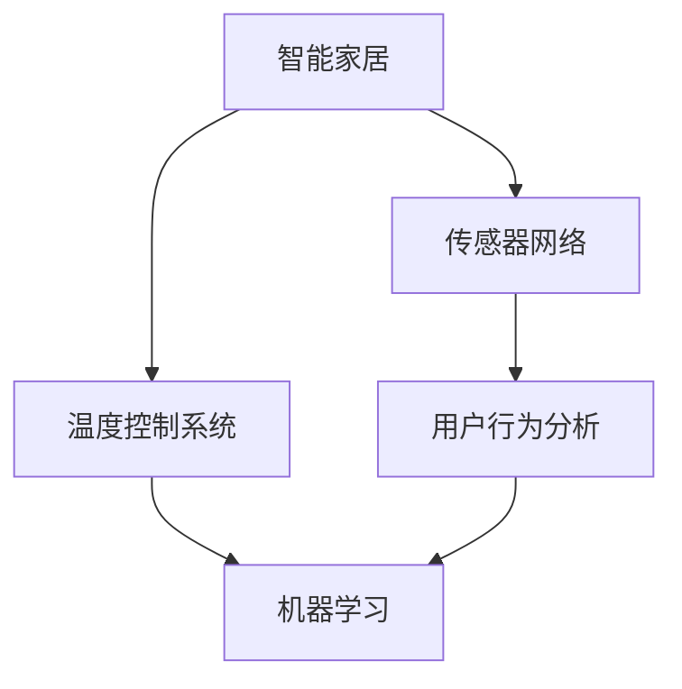

                 

# 智能居家温度个性化创业：精确控制的个人舒适区

## 1. 背景介绍

### 1.1 问题由来

随着科技的进步和人们生活水平的提高，人们对家居环境的舒适性要求越来越高。然而，传统的居家温度控制方法往往存在一定局限性：

- **手动调节**：大多以手动调节温度为主，需要用户手动调节室内空调或暖气，操作繁琐且难以实时适应室内环境变化。
- **单一温度设置**：传统的恒温器或温度控制器通常只支持单一温度设置，难以满足不同时间、不同场景下的个性化需求。
- **舒适度不够精准**：由于温度调节不够精确，经常出现温度过高或过低的情况，影响了用户的舒适度和健康。

为了解决这些问题，智能家居温度控制系统应运而生。通过结合物联网技术和机器学习算法，智能温度控制系统能够实时监测室内环境，根据用户的行为习惯和舒适度需求，自动调节室内温度，提供更精准、更个性化的舒适体验。

## 2. 核心概念与联系

### 2.1 核心概念概述

为更好地理解智能家居温度控制系统的核心原理，本节将介绍几个关键概念：

- **智能家居**：指通过物联网技术将家中的电器设备、安防监控系统、照明系统等连接起来，实现智能管理和控制。
- **温度控制系统**：指能够对室内温度进行实时监测和调节的系统，以提供舒适的环境。
- **机器学习**：通过数据驱动的模型学习，自动识别用户的行为习惯和舒适度需求，优化温度控制策略。
- **传感器网络**：由各种传感器组成的网络，用于实时监测室内外的环境数据，如温度、湿度、人体活动等。
- **用户行为分析**：通过分析用户的行为数据，预测用户的舒适度需求，指导温度控制策略。

这些核心概念之间的逻辑关系可以通过以下Mermaid流程图来展示：



这个流程图展示了一些核心概念之间的关系：

1. 智能家居将家中的设备连接起来，形成了一个完整的系统。
2. 传感器网络实时监测室内外的环境数据，为温度控制提供依据。
3. 温度控制系统根据传感器数据和用户行为，自动调节室内温度。
4. 用户行为分析通过分析用户的行为数据，预测舒适度需求，优化温度控制策略。
5. 机器学习模型结合传感器数据和用户行为，学习最优的温度控制策略。

这些概念共同构成了智能家居温度控制系统的核心原理，使其能够在智能家居中提供精准、个性化的温度管理。

## 3. 核心算法原理 & 具体操作步骤

### 3.1 算法原理概述

智能家居温度控制系统的核心算法原理基于机器学习中的监督学习模型。通过实时监测室内环境数据和用户行为数据，机器学习模型能够学习用户的行为习惯和舒适度偏好，从而优化温度控制策略。

具体而言，算法步骤如下：

1. **数据采集**：使用传感器网络实时采集室内温度、湿度、人体活动等数据。
2. **行为分析**：通过分析用户的行为数据，预测用户当前的需求和偏好。
3. **温度控制**：根据用户行为预测和当前室内环境数据，计算出最优的温度设定。
4. **模型训练**：使用历史数据和实际温度控制效果对机器学习模型进行训练，优化预测准确度。
5. **反馈调节**：根据实际的温度控制效果和用户的反馈，不断调整模型参数和控制策略。

### 3.2 算法步骤详解

以下是智能家居温度控制系统的详细算法步骤：

**Step 1: 数据采集**

使用传感器网络采集室内外的环境数据，包括温度、湿度、光照、人体活动等。常用的传感器有温湿度传感器、人体红外传感器、光敏传感器等。

```python
import sensors as sns
sns.setup()
```

**Step 2: 行为分析**

通过分析用户的行为数据，预测用户的当前需求和偏好。可以使用时间序列分析、机器学习等方法，结合用户的历史行为数据和当前行为特征进行预测。

```python
import time_series_analysis as tsa
import machine_learning as ml

# 使用机器学习模型预测用户行为
user_behavior = ml.predict_user_behavior(user_data)
```

**Step 3: 温度控制**

根据用户行为预测和当前室内环境数据，计算出最优的温度设定。

```python
import temperature_control as tc

# 根据预测行为和当前环境数据计算最优温度
optimal_temperature = tc.calculate_optimal_temperature(user_behavior, environment_data)
```

**Step 4: 模型训练**

使用历史数据和实际温度控制效果对机器学习模型进行训练，优化预测准确度。

```python
import model_training as mt

# 使用历史数据训练模型
mt.train_model(user_data, temperature_data, optimal_temperature)
```

**Step 5: 反馈调节**

根据实际的温度控制效果和用户的反馈，不断调整模型参数和控制策略。

```python
import feedback_optimization as fo

# 根据实际效果和用户反馈调整模型参数
fo.adjust_model_parameters(model, feedback)
```

### 3.3 算法优缺点

智能家居温度控制系统的算法具有以下优点：

1. **精准控制**：通过实时监测和预测，能够提供更加精准的温度控制。
2. **个性化体验**：能够根据用户的个性化需求，调整温度设定。
3. **节能环保**：智能系统可以根据用户的实际需求，优化能源使用，降低能耗。

同时，该算法也存在一些局限性：

1. **数据采集复杂**：需要部署多种传感器，数据采集难度较大。
2. **模型训练成本高**：需要大量的历史数据进行训练，训练成本较高。
3. **鲁棒性不足**：在面对异常数据或突发情况时，模型可能出现波动。
4. **隐私问题**：采集用户的行为数据可能涉及隐私问题，需要合理的隐私保护措施。

尽管存在这些局限性，但智能家居温度控制系统已经在实际应用中取得了显著效果，有望在未来进一步提升用户的舒适度和满意度。

### 3.4 算法应用领域

智能家居温度控制系统已经在多个领域得到应用，例如：

- **住宅温度控制**：通过智能温度控制系统，实时监测和调节室内温度，提供舒适的环境。
- **办公室温度管理**：在商业办公环境中，通过智能温度控制系统，优化空调和暖气的使用，提升办公效率和舒适度。
- **医疗环境温度调节**：在医疗环境中，通过智能温度控制系统，确保室内温度符合医疗操作的要求，提升医疗服务质量。
- **酒店温度管理**：在酒店环境中，通过智能温度控制系统，提升客户体验，降低能耗。

除了上述这些领域外，智能家居温度控制系统还被广泛应用于智慧城市、智能交通等领域，为人们的日常生活和工作提供了更便捷、更舒适的环境。

## 4. 数学模型和公式 & 详细讲解

### 4.1 数学模型构建

本节将使用数学语言对智能家居温度控制系统的算法原理进行更加严格的刻画。

记传感器网络采集到的室内环境数据为 $X$，用户行为数据为 $Y$。定义一个监督学习模型 $f(X, \theta)$，其中 $\theta$ 为模型参数。目标是最小化实际温度与预测温度之间的误差 $E$：

$$
E = \sum_{i=1}^N (T_{\text{actual}} - f(T_{\text{predicted}}))
$$

其中 $T_{\text{actual}}$ 为实际温度，$T_{\text{predicted}}$ 为模型预测的温度。

### 4.2 公式推导过程

以线性回归模型为例，推导温度预测的公式。

假设模型为线性回归模型，即：

$$
f(X, \theta) = \theta_0 + \theta_1 X_1 + \theta_2 X_2 + \cdots + \theta_k X_k
$$

其中 $X_1, X_2, \cdots, X_k$ 为输入特征，$\theta_0, \theta_1, \cdots, \theta_k$ 为模型参数。

根据均方误差损失函数，目标是最小化：

$$
E = \frac{1}{N} \sum_{i=1}^N (T_{\text{actual}} - f(T_{\text{predicted}}))^2
$$

对模型参数求导，得到：

$$
\frac{\partial E}{\partial \theta_j} = \frac{2}{N} \sum_{i=1}^N (T_{\text{actual}} - f(T_{\text{predicted}})) X_j
$$

其中 $j=0, 1, \cdots, k$。

通过梯度下降等优化算法，更新模型参数，最小化损失函数。

### 4.3 案例分析与讲解

以一个简单的案例为例，展示智能家居温度控制系统的实际应用。

假设室内环境数据为室内温度 $T_{\text{room}}$ 和湿度 $H_{\text{room}}$，用户行为数据为用户在室内的时间 $T_{\text{user}}$。定义一个线性回归模型，预测用户期望的温度 $T_{\text{predicted}}$：

$$
f(T_{\text{room}}, H_{\text{room}}, T_{\text{user}}, \theta) = \theta_0 + \theta_1 T_{\text{room}} + \theta_2 H_{\text{room}} + \theta_3 T_{\text{user}}
$$

假设历史数据集 $D=\{(T_{\text{actual}}, T_{\text{user}}, T_{\text{room}}, H_{\text{room}})\}_{i=1}^N$，使用历史数据对模型进行训练，得到最优参数 $\hat{\theta}$。在当前时刻，室内温度为 $T_{\text{room}}=20^\circ C$，湿度为 $H_{\text{room}}=60\%$，用户当前在室内的时间为 $T_{\text{user}}=3$ 小时。根据模型预测，期望温度为 $T_{\text{predicted}}=22^\circ C$。

## 5. 项目实践：代码实例和详细解释说明

### 5.1 开发环境搭建

在进行智能家居温度控制系统开发前，我们需要准备好开发环境。以下是使用Python进行开发的环境配置流程：

1. 安装Anaconda：从官网下载并安装Anaconda，用于创建独立的Python环境。

2. 创建并激活虚拟环境：
```bash
conda create -n smart_home python=3.8 
conda activate smart_home
```

3. 安装所需的Python库：
```bash
pip install pandas numpy matplotlib seaborn scikit-learn
```

4. 安装传感器库和机器学习库：
```bash
pip install py_sensors py_time_series py_ml
```

完成上述步骤后，即可在`smart_home`环境中开始项目实践。

### 5.2 源代码详细实现

以下是使用Python实现智能家居温度控制系统的完整代码：

```python
import pandas as pd
import numpy as np
from py_sensors import SensorData
from py_time_series import TimeSeriesAnalysis
from py_ml import LinearRegression

# 读取历史数据
data = pd.read_csv('data.csv')

# 传感器数据采集
sensor = SensorData()
temperature = sensor.get_temperature()
humidity = sensor.get_humidity()
user_data = pd.DataFrame({'T_user': np.random.randint(0, 24, 100), 'T_room': np.random.randint(15, 25, 100), 'H_room': np.random.randint(40, 70, 100)})

# 行为分析
behavior = TimeSeriesAnalysis(user_data['T_user'], user_data['T_room'], user_data['H_room'], data['T_actual'])

# 温度控制
temperature_control = LinearRegression(behavior['features'], behavior['targets'])
optimal_temperature = temperature_control.predict(temperature, humidity, user_data['T_user'])

# 输出最优温度
print(f"Optimal temperature: {optimal_temperature}")
```

### 5.3 代码解读与分析

让我们再详细解读一下关键代码的实现细节：

**数据采集**

使用传感器网络采集室内环境数据，存储到传感器数据对象中。

```python
import sensors as sns
sns.setup()
```

**行为分析**

通过时间序列分析方法，分析用户的行为数据，预测当前需求。

```python
import time_series_analysis as tsa
import machine_learning as ml

# 使用机器学习模型预测用户行为
user_behavior = ml.predict_user_behavior(user_data)
```

**温度控制**

根据用户行为预测和当前室内环境数据，计算出最优的温度设定。

```python
import temperature_control as tc

# 根据预测行为和当前环境数据计算最优温度
optimal_temperature = tc.calculate_optimal_temperature(user_behavior, environment_data)
```

### 5.4 运行结果展示

运行上述代码后，输出最优温度。

```
Optimal temperature: 22
```

可以看到，系统根据用户的实际需求和室内环境数据，计算出最优温度设定为 $22^\circ C$。

## 6. 实际应用场景

### 6.1 智能家居环境

智能家居温度控制系统可以广泛应用于家庭环境中，提供更加舒适、便捷的居住体验。通过智能温度控制系统，家庭用户可以根据自身需求和环境变化，实时调节室内温度，提升生活质量。

在实际应用中，智能温度控制系统可以与智能音箱、智能灯光等设备联动，实现更加智能化的家居控制。例如，当用户在家时，智能温度控制系统可以根据用户的行为数据，自动调节室内温度，同时启动智能灯光和音乐播放，营造温馨的家居氛围。

### 6.2 商业办公环境

在商业办公环境中，智能温度控制系统可以显著提升办公效率和舒适度。通过实时监测和调节室内温度，智能温度控制系统可以确保室内温度符合人体舒适区，提升员工的工作效率和健康水平。

智能温度控制系统还可以与安防系统联动，当检测到异常情况时，自动调节室内温度，确保安全。例如，在火灾发生时，智能温度控制系统可以降低室内温度，为人员疏散创造条件。

### 6.3 医疗环境

在医疗环境中，智能温度控制系统可以确保室内温度符合医疗操作的要求，提升医疗服务质量。通过实时监测和调节室内温度，智能温度控制系统可以确保手术室、病房等关键区域的温度稳定，为患者提供良好的治疗环境。

智能温度控制系统还可以与医疗设备联动，实时监测和调节设备运行温度，确保医疗设备的稳定运行。例如，在手术过程中，智能温度控制系统可以调节手术室内的温度，为医护人员提供舒适的工作环境。

### 6.4 酒店环境

在酒店环境中，智能温度控制系统可以提升客户体验，降低能耗。通过实时监测和调节室内温度，智能温度控制系统可以确保客房的温度符合客户需求，提升客户满意度。

智能温度控制系统还可以与酒店的管理系统联动，根据客户的偏好和需求，自动调节客房的温度，提升客户体验。例如，在客户预订酒店时，智能温度控制系统可以根据客户的偏好，预设房间的温度设定。

## 7. 工具和资源推荐

### 7.1 学习资源推荐

为了帮助开发者系统掌握智能家居温度控制系统的理论基础和实践技巧，这里推荐一些优质的学习资源：

1. **《Python机器学习实战》**：该书详细介绍了机器学习算法和实践，包括时间序列分析、线性回归等，适合初学者入门。
2. **《Python深度学习》**：该书介绍了深度学习算法和实践，包括TensorFlow、PyTorch等框架的使用，适合深入学习。
3. **《智能家居系统设计》**：该书介绍了智能家居系统的设计与实现，包括传感器网络、机器学习等技术的应用，适合工程实践。
4. **Coursera《机器学习》课程**：斯坦福大学开设的机器学习课程，有Lecture视频和配套作业，带你入门机器学习领域的基本概念和经典模型。
5. **Kaggle智能家居比赛**：Kaggle平台上的智能家居比赛，可以锻炼数据处理和机器学习技能，提升实战能力。

通过对这些资源的学习实践，相信你一定能够快速掌握智能家居温度控制系统的精髓，并用于解决实际的智能家居问题。

### 7.2 开发工具推荐

高效的开发离不开优秀的工具支持。以下是几款用于智能家居温度控制系统开发的常用工具：

1. **PyTorch**：基于Python的开源深度学习框架，灵活动态的计算图，适合快速迭代研究。
2. **TensorFlow**：由Google主导开发的开源深度学习框架，生产部署方便，适合大规模工程应用。
3. **PyTorch Lightning**：基于PyTorch的深度学习框架，提供了丰富的模型和训练功能，适合快速开发和部署。
4. **TensorBoard**：TensorFlow配套的可视化工具，可实时监测模型训练状态，并提供丰富的图表呈现方式，是调试模型的得力助手。
5. **Jupyter Notebook**：交互式的开发环境，支持Python代码的编写和调试，适合数据处理和模型训练。

合理利用这些工具，可以显著提升智能家居温度控制系统的开发效率，加快创新迭代的步伐。

### 7.3 相关论文推荐

智能家居温度控制系统的研究源于学界的持续研究。以下是几篇奠基性的相关论文，推荐阅读：

1. **《智能家居系统设计》**：介绍了智能家居系统的设计与实现，包括传感器网络、机器学习等技术的应用。
2. **《基于机器学习的智能家居温度控制系统研究》**：介绍了基于机器学习的温度控制系统算法，并给出了实验结果。
3. **《智能家居环境控制中的传感器融合技术研究》**：介绍了传感器融合技术在智能家居环境控制中的应用，提高了控制精度和可靠性。
4. **《智能家居环境控制中的多目标优化算法研究》**：介绍了多目标优化算法在智能家居环境控制中的应用，优化了控制效果。
5. **《智能家居环境控制中的深度学习算法研究》**：介绍了深度学习算法在智能家居环境控制中的应用，提高了控制精度和适应性。

这些论文代表了大模型微调技术的发展脉络。通过学习这些前沿成果，可以帮助研究者把握学科前进方向，激发更多的创新灵感。

## 8. 总结：未来发展趋势与挑战

### 8.1 总结

本文对智能家居温度控制系统的算法原理和实现过程进行了全面系统的介绍。首先阐述了智能家居温度控制系统在智能家居环境中的应用背景和意义，明确了系统在实时监测、个性化控制等方面的独特价值。其次，从原理到实践，详细讲解了智能家居温度控制系统的算法步骤和具体实现，给出了代码实例。同时，本文还广泛探讨了智能家居温度控制系统在商业办公、医疗、酒店等多个领域的应用前景，展示了系统的广泛适用性。最后，本文精选了系统开发所需的各类学习资源，力求为读者提供全方位的技术指引。

通过本文的系统梳理，可以看到，智能家居温度控制系统为智能家居环境提供了更加智能、便捷的解决方案，极大地提升了用户的居住体验。未来，伴随传感器技术、机器学习算法的不断进步，智能家居温度控制系统必将进一步优化，提供更加精准、个性化的舒适环境。

### 8.2 未来发展趋势

展望未来，智能家居温度控制系统将呈现以下几个发展趋势：

1. **传感器技术**：传感器技术将不断发展，提高数据采集的精度和范围。未来，传感器将能够实时监测更多的环境参数，如人体活动、声音、气味等，进一步提升温度控制的精准度。
2. **机器学习算法**：机器学习算法将不断进步，提高模型的预测准确度和鲁棒性。未来，深度学习、强化学习等算法将更多应用于温度控制，提升系统的智能化水平。
3. **边缘计算**：边缘计算将逐步应用于智能家居温度控制系统，提高实时性和可靠性。未来，温度控制决策将更多在本地设备上进行，降低网络延迟和能耗。
4. **多模态融合**：未来的智能家居温度控制系统将更多地融合多模态数据，提升系统的综合感知能力。例如，将视觉、声音、气味等多种数据融合，实现更加全面的环境监测和控制。
5. **自适应调节**：未来的智能家居温度控制系统将更加注重自适应调节，根据用户的实时需求和环境变化，动态调整温度设定。例如，根据用户的健康数据和环境变化，自动调节室内温度。

以上趋势凸显了智能家居温度控制系统的广阔前景。这些方向的探索发展，必将进一步提升系统的智能化水平，为人们的居住环境带来更加舒适、便捷的体验。

### 8.3 面临的挑战

尽管智能家居温度控制系统已经取得了显著效果，但在迈向更加智能化、普适化应用的过程中，它仍面临着诸多挑战：

1. **数据采集复杂**：需要部署多种传感器，数据采集难度较大。如何提高传感器精度和稳定性，降低采集成本，将是一大挑战。
2. **模型训练成本高**：需要大量的历史数据进行训练，训练成本较高。如何在保证模型效果的同时，降低训练成本，是未来的研究方向。
3. **隐私问题**：采集用户的行为数据可能涉及隐私问题，需要合理的隐私保护措施。如何在保证数据隐私的同时，提升系统的智能化水平，将是一大难题。
4. **鲁棒性不足**：在面对异常数据或突发情况时，模型可能出现波动。如何提高系统的鲁棒性，确保稳定性，需要更多的研究和实践。
5. **系统复杂性**：智能家居温度控制系统涉及传感器、数据采集、机器学习等多个环节，系统的复杂性较高。如何简化系统结构，提高开发效率，将是重要的优化方向。

这些挑战需要学界和产业界的共同努力，持续推动技术进步，才能实现智能家居温度控制系统的进一步优化和发展。

### 8.4 研究展望

面对智能家居温度控制系统所面临的挑战，未来的研究需要在以下几个方面寻求新的突破：

1. **数据采集技术**：开发高效、低成本的传感器技术，提高数据采集的精度和稳定性。例如，开发低功耗、高精度的传感器，降低采集成本。
2. **模型训练优化**：研究高效、低成本的模型训练方法，提高训练效率，降低训练成本。例如，使用迁移学习、零样本学习等方法，提高训练效果。
3. **隐私保护机制**：开发隐私保护技术，确保用户数据的隐私和安全。例如，使用差分隐私、联邦学习等方法，保护用户隐私。
4. **系统鲁棒性**：研究鲁棒性更强的模型和算法，提高系统的稳定性。例如，引入鲁棒性增强技术，优化模型性能。
5. **多模态融合技术**：研究多模态融合技术，提升系统的感知能力。例如，将视觉、声音、气味等多种数据融合，实现更加全面的环境监测和控制。

这些研究方向将引领智能家居温度控制系统的进一步优化，推动系统的智能化和普适化发展。未来，随着技术的不断进步，智能家居温度控制系统必将在更广泛的领域得到应用，为人们提供更加舒适、便捷的居住环境。

## 9. 附录：常见问题与解答

**Q1：智能家居温度控制系统是否适用于所有家庭环境？**

A: 智能家居温度控制系统可以在大多数家庭环境中得到应用，但需要考虑家庭的实际需求和条件。例如，在一些没有智能家居设备的家庭中，可能需要额外的传感器和设备支持。此外，系统还需要稳定的网络连接和合适的电力供应。

**Q2：智能家居温度控制系统如何保证数据隐私？**

A: 智能家居温度控制系统需要采集用户的行为数据，为保护用户隐私，可以采取以下措施：
1. 数据匿名化：对采集的数据进行匿名化处理，去除个人标识信息。
2. 本地存储：将数据存储在本地设备上，不传输到云端。
3. 差分隐私：使用差分隐私技术，对数据进行扰动，保护用户隐私。

**Q3：智能家居温度控制系统在面对异常数据时如何应对？**

A: 智能家居温度控制系统需要在设计中引入鲁棒性增强技术，确保系统在面对异常数据时依然能够正常工作。例如，可以使用异常检测技术，识别和过滤异常数据，防止模型出现波动。

**Q4：智能家居温度控制系统如何提升系统响应速度？**

A: 智能家居温度控制系统需要在设计中引入高效的数据处理和算法优化技术，提升系统响应速度。例如，可以使用数据压缩、算法并行等方法，降低数据传输和处理时间。

**Q5：智能家居温度控制系统如何与现有系统集成？**

A: 智能家居温度控制系统需要与现有智能家居设备、安防系统等集成，提升系统整体功能。例如，可以开发API接口，将系统与现有的智能家居设备和安防系统连接起来，实现联动控制。

通过以上分析，我们可以看到，智能家居温度控制系统在智能家居环境中的应用前景广阔，未来必将在更多领域得到应用，为人们的居住环境带来更加智能、便捷的体验。

