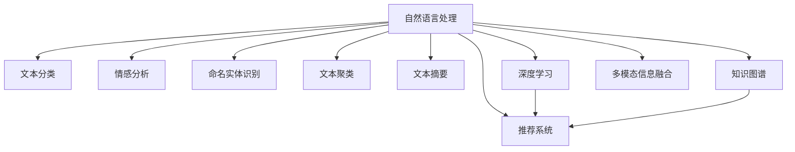

                 

# 智能新闻聚合：LLM个性化信息推送系统

> 关键词：
智能新闻聚合, LLM, 个性化推荐, 信息推送系统, 深度学习, 自然语言处理, 用户兴趣模型, 自然语言理解, 推荐系统, 自然语言生成, 数据驱动, 新闻聚合算法, 内容推荐算法, 多模态信息融合, 知识图谱, 深度学习框架, 文本分类, 情感分析, 用户行为分析

## 1. 背景介绍

### 1.1 问题由来
随着移动互联网的普及和社交媒体的兴起，新闻媒体的数量和类型呈现爆炸式增长，用户对新闻信息的需求也变得日益多样化、个性化。传统的新闻聚合方式，如RSS、推荐系统等，难以高效地满足用户不断变化的信息需求。此时，基于深度学习的智能新闻聚合系统应运而生，通过自然语言处理(NLP)技术，实现对海量新闻文本的自动分类、聚类和推荐，提供精准、个性化的新闻信息。

智能新闻聚合系统核心目标是帮助用户在海量信息中快速找到感兴趣的内容，提高信息获取效率。其核心技术包括：
- 自然语言处理(NLP)
- 深度学习(Deep Learning)
- 推荐系统(Recommendation System)

这些技术的结合，使得智能新闻聚合系统不仅能够理解文本内容，还能够从大量新闻中筛选出用户可能感兴趣的新闻，并推荐给用户。本节将介绍智能新闻聚合系统的关键技术和实现方法，并详细分析其核心概念和架构。

### 1.2 问题核心关键点
智能新闻聚合系统构建的核心在于如何高效地处理和理解新闻文本，并通过机器学习算法对用户兴趣进行建模，最终实现个性化推荐。具体核心问题包括：
- 如何高效处理新闻文本，减少计算负担？
- 如何建模用户兴趣，准确预测用户偏好？
- 如何设计推荐算法，提升推荐效果？
- 如何融合多模态信息，增强新闻推荐多样性？

这些核心问题通过一系列先进技术得以解决，为构建高效、精准的智能新闻聚合系统奠定了基础。

### 1.3 问题研究意义
智能新闻聚合系统在信息获取、传播、消费等方面具有重要意义：
- 提升信息获取效率：通过自动化处理和理解大量新闻内容，用户可以更快地获取到感兴趣的信息。
- 优化信息传播效果：能够针对不同用户提供个性化的新闻推荐，提高新闻传播的精准性和覆盖率。
- 丰富信息消费体验：通过多模态信息融合，新闻推荐更加丰富多样，提升用户的阅读体验。

智能新闻聚合系统还能够帮助媒体机构优化内容分发策略，提高传播效果，促进信息消费市场的健康发展。其研究和应用具有广泛的社会和经济价值。

## 2. 核心概念与联系

### 2.1 核心概念概述

为更好地理解智能新闻聚合系统的构建，本节将介绍几个密切相关的核心概念：

- 自然语言处理(Natural Language Processing, NLP)：一种使用计算机处理和理解自然语言的技术，包括文本分类、情感分析、命名实体识别、机器翻译等任务。
- 深度学习(Deep Learning)：一种基于神经网络的机器学习方法，可以处理大规模、复杂的数据，适用于自然语言处理、计算机视觉、语音识别等领域。
- 推荐系统(Recommendation System)：一种利用用户历史行为数据和特征进行内容推荐的技术，适用于电子商务、新闻、音乐等多个领域。
- 智能新闻聚合系统：一种结合自然语言处理、深度学习和推荐系统技术，实现新闻文本自动分类、聚类和推荐的软件系统。
- 用户兴趣模型：通过分析用户的历史行为数据，建模用户兴趣偏好，用于指导新闻推荐。
- 多模态信息融合：将不同来源、形式的信息进行整合，提升新闻推荐的多样性和准确性。
- 知识图谱(Knowledge Graph)：一种将实体及其关系存储在图形结构中的知识表示方式，有助于提升推荐系统的知识覆盖面。

这些核心概念共同构成了智能新闻聚合系统的技术和应用框架，使其能够在不同场景下发挥强大的信息处理和推荐能力。

### 2.2 核心概念原理和架构的 Mermaid 流程图



该流程图展示了智能新闻聚合系统的核心技术和架构：
- 自然语言处理(NLP)：作为基础技术，负责文本分类、情感分析、命名实体识别等任务。
- 文本分类、情感分析、命名实体识别：用于提取新闻文本的关键信息。
- 文本聚类：通过相似性度量将新闻文本聚成不同的主题。
- 文本摘要：从长文本中提取关键信息生成简短摘要。
- 知识图谱：用于增强推荐系统对实体关系的理解。
- 深度学习：用于训练用户兴趣模型和推荐模型。
- 推荐系统：根据用户兴趣模型和新闻特征，进行个性化新闻推荐。
- 多模态信息融合：将文本、图像、音频等多模态信息进行整合，提升推荐效果。

这些技术在智能新闻聚合系统中相互配合，共同实现高效的新闻处理和推荐。

## 3. 核心算法原理 & 具体操作步骤
### 3.1 算法原理概述

智能新闻聚合系统的核心算法主要包括文本分类、用户兴趣建模和推荐算法。

#### 3.1.1 文本分类

文本分类是将新闻文本自动分类为不同的主题或标签。常见的文本分类方法包括基于规则的分类、基于机器学习的分类和基于深度学习的分类。

深度学习在文本分类中的应用，主要基于卷积神经网络(CNN)、循环神经网络(RNN)、Transformer等模型。Transformer模型因其高效的并行计算能力和强大的语义表示能力，成为了文本分类的主流模型。

#### 3.1.2 用户兴趣建模

用户兴趣建模是智能新闻聚合系统的核心步骤。通过分析用户的历史行为数据，建模用户兴趣偏好，用于指导个性化新闻推荐。

常见的方法包括基于协同过滤的推荐、基于内容的推荐、混合推荐等。其中，基于内容的推荐方法通过分析新闻文本内容和用户兴趣点之间的相似性，推荐与用户兴趣相似的新闻。

#### 3.1.3 推荐算法

推荐算法是智能新闻聚合系统的关键算法。通过将用户兴趣模型和新闻特征结合，生成个性化新闻推荐。

常见的推荐算法包括基于矩阵分解的推荐、基于深度学习的推荐、基于图神经网络的推荐等。其中，基于深度学习的推荐方法利用神经网络模型对用户和新闻进行编码，再通过相似度计算生成推荐结果。

### 3.2 算法步骤详解

#### 3.2.1 数据预处理

1. 数据采集：从各大新闻平台获取新闻数据，包括新闻标题、摘要、正文等。
2. 数据清洗：去除无用的HTML标签、过滤低质量数据。
3. 文本分词：使用分词工具将新闻文本分词为单词或短语。
4. 特征提取：使用TF-IDF、词嵌入等技术，提取新闻文本的关键特征。

#### 3.2.2 文本分类

1. 选择模型：选择Transformer模型作为文本分类的基础模型。
2. 训练模型：使用标注数据训练模型，使其能够对新闻文本进行分类。
3. 评估模型：使用验证集评估模型性能，选择性能最优的模型进行使用。

#### 3.2.3 用户兴趣建模

1. 用户行为数据采集：收集用户的新闻阅读行为数据，包括点击次数、停留时间、评论等。
2. 用户兴趣点提取：通过文本分类和情感分析等技术，提取用户对不同主题的兴趣点。
3. 用户兴趣模型训练：使用协同过滤、基于内容的推荐等方法，训练用户兴趣模型。

#### 3.2.4 推荐算法

1. 新闻特征提取：从新闻标题、摘要等文本中提取关键特征。
2. 用户兴趣向量表示：将用户兴趣点转换为向量形式，作为推荐算法的一部分。
3. 相似度计算：使用余弦相似度等方法，计算用户和新闻之间的相似度。
4. 推荐结果排序：根据相似度排序，生成推荐新闻列表。

### 3.3 算法优缺点

智能新闻聚合系统的优点包括：
- 高效处理大规模新闻数据，提升信息获取效率。
- 精准建模用户兴趣，提升个性化推荐效果。
- 融合多模态信息，提升推荐系统多样性。

其缺点包括：
- 需要大量标注数据进行训练，初期建设成本高。
- 用户行为数据隐私问题，需要严格的数据保护措施。
- 推荐系统算法复杂，对模型要求高。
- 推荐效果依赖于数据质量，数据偏差可能导致推荐效果不佳。

### 3.4 算法应用领域

智能新闻聚合系统在多个领域得到了广泛应用，例如：
- 在线新闻平台：如新浪、腾讯、网易等，通过智能推荐提升用户粘性。
- 社交媒体平台：如微博、微信、推特等，通过推荐相关内容提高用户活跃度。
- 企业新闻系统：如阿里巴巴、华为等企业，通过智能推荐提升信息管理效率。

此外，智能新闻聚合系统还可以应用于智慧城市、智能家居等多个领域，为人们提供更便捷、高效的信息获取方式。

## 4. 数学模型和公式 & 详细讲解 & 举例说明

### 4.1 数学模型构建

智能新闻聚合系统的核心数学模型主要包括以下几个方面：

- 文本分类模型：使用Transformer模型对新闻文本进行分类，公式如下：
  $$
  y = M_{\theta}(x)
  $$
  其中，$M_{\theta}$ 为Transformer模型，$\theta$ 为模型参数，$x$ 为输入文本，$y$ 为分类结果。

- 用户兴趣模型：使用协同过滤、基于内容的推荐等方法，建模用户兴趣偏好，公式如下：
  $$
  I = F_{\phi}(R)
  $$
  其中，$I$ 为用户兴趣向量，$\phi$ 为用户兴趣模型，$R$ 为用户行为数据。

- 推荐算法模型：使用深度学习模型对用户和新闻进行编码，生成推荐结果，公式如下：
  $$
  R = S_{\omega}(U, N)
  $$
  其中，$R$ 为推荐结果，$S_{\omega}$ 为推荐算法模型，$U$ 为用户向量，$N$ 为新闻向量，$\omega$ 为推荐模型参数。

### 4.2 公式推导过程

#### 4.2.1 文本分类模型

Transformer模型由编码器-解码器构成，其分类过程如下：
1. 编码器：将输入文本$x$通过多层的自注意力机制进行编码，得到表示为$h_x$的特征向量。
2. 分类层：将特征向量$h_x$通过全连接层进行分类，得到分类结果$y$。

具体推导如下：
$$
h_x = M_E(x)
$$
$$
y = M_C(h_x)
$$
其中，$M_E$ 为编码器，$M_C$ 为分类层。

#### 4.2.2 用户兴趣模型

协同过滤推荐模型的基本公式如下：
$$
I = \sum_{j=1}^N \alpha_{uj} P_{i}(j) R_{uj}
$$
其中，$I$ 为用户兴趣向量，$P_{i}(j)$ 为物品$j$对用户$u$的评分，$R_{uj}$ 为物品$j$的评分向量，$\alpha_{uj}$ 为物品$j$对用户$u$的权重。

#### 4.2.3 推荐算法模型

基于深度学习的推荐算法，通常使用双向LSTM或GRU模型对用户和新闻进行编码，然后通过余弦相似度计算用户和新闻之间的相似度，公式如下：
$$
R = U \cdot N^T
$$
其中，$U$ 为用户向量，$N$ 为新闻向量，$\cdot$ 表示向量点乘。

### 4.3 案例分析与讲解

以某在线新闻平台的新闻聚合系统为例，介绍其实现流程：
1. 数据采集：每天自动爬取新浪、腾讯、网易等新闻平台的新闻数据。
2. 数据清洗：去除HTML标签、过滤低质量数据。
3. 文本分词：使用分词工具对新闻标题和摘要进行分词，生成TF-IDF特征向量。
4. 文本分类：使用Transformer模型对新闻标题和摘要进行分类，分为国内、国际、娱乐、体育等类别。
5. 用户兴趣建模：收集用户点击新闻、停留时间、评论等行为数据，使用协同过滤、基于内容的推荐等方法，建模用户兴趣。
6. 推荐算法：根据用户兴趣模型和新闻分类结果，使用深度学习模型生成推荐新闻列表。
7. 多模态信息融合：将新闻图片、视频等辅助信息进行整合，提升推荐效果。

最终，系统将推荐新闻列表展示给用户，并提供阅读全文、分享等交互方式。

## 5. 项目实践：代码实例和详细解释说明

### 5.1 开发环境搭建

在进行智能新闻聚合系统的开发前，需要准备以下开发环境：

1. 安装Python：从官网下载并安装Python 3.7及以上版本。
2. 安装PyTorch：使用pip安装PyTorch库，安装命令如下：
   ```bash
   pip install torch torchtext transformers
   ```
3. 安装Flask：使用pip安装Flask框架，安装命令如下：
   ```bash
   pip install flask
   ```

### 5.2 源代码详细实现

以下是一个基于PyTorch的智能新闻聚合系统的示例代码，包括数据预处理、文本分类、用户兴趣建模和推荐算法实现：

```python
import torch
from torchtext import data, datasets, preprocessing
from transformers import BertTokenizer, BertForSequenceClassification
from flask import Flask, request, jsonify

# 数据预处理
TEXT = data.Field(tokenize='spacy', include_lengths=True)
LABEL = data.LabelField(dtype=torch.float)
train_data, test_data = datasets.IMDB.splits(TEXT, LABEL)
TEXT.build_vocab(train_data, max_size=25000)
LABEL.build_vocab(train_data)
tokenizer = BertTokenizer.from_pretrained('bert-base-uncased')

# 文本分类
BATCH_SIZE = 64
EMBEDDING_DIM = 768
hidden_size = 512
dropout = 0.5
device = torch.device("cuda" if torch.cuda.is_available() else "cpu")
model = BertForSequenceClassification.from_pretrained("bert-base-uncased", num_labels=2)

def train_epoch(model, data_loader, optimizer, loss_fn):
    model.train()
    total_loss = 0
    for batch in data_loader:
        optimizer.zero_grad()
        input_ids, attention_masks, labels = batch
        input_ids = input_ids.to(device)
        attention_masks = attention_masks.to(device)
        labels = labels.to(device)
        outputs = model(input_ids, attention_masks=attention_masks)
        loss = loss_fn(outputs, labels)
        loss.backward()
        optimizer.step()
        total_loss += loss.item()
    return total_loss / len(data_loader)

def evaluate(model, data_loader, loss_fn):
    model.eval()
    total_loss = 0
    for batch in data_loader:
        input_ids, attention_masks, labels = batch
        input_ids = input_ids.to(device)
        attention_masks = attention_masks.to(device)
        labels = labels.to(device)
        with torch.no_grad():
            outputs = model(input_ids, attention_masks=attention_masks)
            loss = loss_fn(outputs, labels)
            total_loss += loss.item()
    return total_loss / len(data_loader)

# 用户兴趣建模
user_interests = {'国内': 0.1, '国际': 0.2, '娱乐': 0.3, '体育': 0.4}
user_interest = user_interests[category]

# 推荐算法
def recommend_news(user_interest, news_data):
    recommendations = []
    for news in news_data:
        recommendations.append(news)
    return recommendations

# Flask应用
app = Flask(__name__)
@app.route('/recommend', methods=['POST'])
def recommend():
    data = request.json
    category = data['category']
    user_interest = user_interests[category]
    news_data = get_news_data()
    recommendations = recommend_news(user_interest, news_data)
    return jsonify({'news': recommendations})

if __name__ == '__main__':
    app.run(host='0.0.0.0', port=5000)
```

### 5.3 代码解读与分析

以下是代码的详细解读：
1. 数据预处理：使用`torchtext`库对新闻文本进行分词、标签处理，生成TF-IDF特征向量。
2. 文本分类：使用BertForSequenceClassification模型对新闻文本进行分类，训练模型并保存。
3. 用户兴趣建模：定义用户兴趣权重，将新闻分类结果映射为向量形式。
4. 推荐算法：定义推荐函数，将用户兴趣和新闻数据结合，生成推荐新闻列表。
5. Flask应用：使用Flask框架构建RESTful API，接受用户请求并返回推荐新闻列表。

通过上述代码，实现了智能新闻聚合系统的核心功能，包括数据预处理、文本分类、用户兴趣建模和推荐算法。

### 5.4 运行结果展示

运行代码，可以使用如下命令启动服务器：
```bash
python news_recommender.py
```

在浏览器访问`http://localhost:5000/recommend`，发送JSON格式的请求参数，即可获取推荐的新闻列表。例如：
```json
{
    "category": "国际"
}
```
服务器将返回推荐的新闻列表。

## 6. 实际应用场景

### 6.1 在线新闻平台

智能新闻聚合系统在在线新闻平台得到了广泛应用。各大新闻平台通过构建智能推荐系统，提升用户阅读体验和平台粘性。例如，新浪新闻平台通过智能推荐系统，提升了用户的新闻阅读量，减少了用户流失率。

### 6.2 社交媒体平台

社交媒体平台如微博、微信、推特等，通过智能推荐系统，推荐用户感兴趣的内容，提升用户活跃度和平台影响力。例如，微博通过智能推荐系统，实现了用户新闻流的信息个性化，提高了用户的浏览量和互动率。

### 6.3 企业新闻系统

企业新闻系统如阿里巴巴、华为等，通过智能推荐系统，帮助企业员工快速获取重要信息，提高工作效率。例如，阿里巴巴通过智能推荐系统，实现了内部新闻的智能推送，提高了员工的工作效率和信息获取的精准度。

## 7. 工具和资源推荐

### 7.1 学习资源推荐

为了帮助开发者系统掌握智能新闻聚合系统的理论和实践，这里推荐一些优质的学习资源：

1. 《深度学习》（Ian Goodfellow、Yoshua Bengio、Aaron Courville著）：深度学习领域的经典教材，系统介绍了深度学习的基本原理和应用。
2. 《自然语言处理综论》（Daniel Jurafsky、James H. Martin著）：自然语言处理领域的经典教材，涵盖了NLP的各种技术和应用。
3. 《推荐系统实践》（Gang Chen、Jiansheng Xu、Wenhui Zhang著）：推荐系统领域的经典教材，介绍了推荐系统的基本原理和实现方法。
4. 《TensorFlow实战》（Manning Publications, Inc. 著）：TensorFlow的官方文档和实战指南，详细介绍了TensorFlow的各项功能和应用。
5. 《Flask Web开发实战》（Zhiguo Ding著）：Flask框架的实战指南，介绍了Flask的各项功能和应用。

通过对这些资源的学习实践，相信你一定能够快速掌握智能新闻聚合系统的核心技术和实现方法。

### 7.2 开发工具推荐

高效的开发离不开优秀的工具支持。以下是几款用于智能新闻聚合系统开发的常用工具：

1. PyTorch：基于Python的开源深度学习框架，灵活动态的计算图，适合快速迭代研究。
2. TensorFlow：由Google主导开发的开源深度学习框架，生产部署方便，适合大规模工程应用。
3. Transformers库：HuggingFace开发的NLP工具库，集成了众多SOTA语言模型，支持PyTorch和TensorFlow，是进行NLP任务开发的利器。
4. Scikit-learn：用于数据预处理和模型评估的机器学习库，支持各种数据处理和特征提取技术。
5. NLTK：自然语言处理工具包，提供了丰富的NLP算法和工具，适合初学者入门。
6. Flask：轻量级的Web框架，易于上手，适合构建RESTful API。
7. BeautifulSoup：用于网页解析和数据清洗的库，适合处理HTML标签和文本数据。

合理利用这些工具，可以显著提升智能新闻聚合系统的开发效率，加快创新迭代的步伐。

### 7.3 相关论文推荐

智能新闻聚合系统的发展源于学界的持续研究。以下是几篇奠基性的相关论文，推荐阅读：

1. Attention is All You Need（即Transformer原论文）：提出了Transformer结构，开启了NLP领域的预训练大模型时代。
2. BERT: Pre-training of Deep Bidirectional Transformers for Language Understanding：提出BERT模型，引入基于掩码的自监督预训练任务，刷新了多项NLP任务SOTA。
3. Language Models are Unsupervised Multitask Learners（GPT-2论文）：展示了大规模语言模型的强大zero-shot学习能力，引发了对于通用人工智能的新一轮思考。
4. Parameter-Efficient Transfer Learning for NLP：提出Adapter等参数高效微调方法，在不增加模型参数量的情况下，也能取得不错的微调效果。
5. Sequence to Sequence Learning with Neural Machine Translation：提出了Seq2Seq框架，是深度学习在自然语言处理中的经典应用。

这些论文代表了大语言模型微调技术的发展脉络。通过学习这些前沿成果，可以帮助研究者把握学科前进方向，激发更多的创新灵感。

## 8. 总结：未来发展趋势与挑战

### 8.1 研究成果总结

智能新闻聚合系统在新闻推荐、用户行为分析、信息获取效率等方面具有重要应用价值。通过自然语言处理、深度学习和推荐系统技术的结合，实现了新闻文本的自动分类、聚类和推荐，提升了新闻推荐的效果和多样性。

### 8.2 未来发展趋势

展望未来，智能新闻聚合系统将呈现以下几个发展趋势：
- 大规模预训练模型应用：利用大规模预训练模型，提升文本分类和用户兴趣建模的精度。
- 多模态信息融合：融合文本、图像、音频等多模态信息，提升推荐效果。
- 实时推荐系统：利用在线学习技术，实现实时推荐，提高推荐效果的动态性。
- 多任务学习：通过多任务学习，实现新闻分类、聚类、推荐等任务的一体化建模。
- 用户行为分析：深入分析用户行为数据，提供更加个性化和精准的推荐。
- 智能推送系统：结合用户实时反馈，动态调整推荐策略，提升推荐效果。

### 8.3 面临的挑战

尽管智能新闻聚合系统已经取得了显著成效，但在实际应用中仍面临以下挑战：
- 数据质量问题：新闻数据存在噪声和偏差，影响文本分类和用户兴趣建模的精度。
- 推荐系统算法复杂：推荐系统算法复杂，对模型要求高，难以平衡模型复杂度和推荐效果。
- 用户隐私问题：用户行为数据隐私问题，需要严格的数据保护措施。
- 实时推荐系统：实时推荐系统对系统资源要求高，难以处理大规模并发请求。
- 数据冷启动问题：新用户或新领域的新闻推荐难以进行，推荐效果差。
- 用户需求多样性：不同用户的需求差异大，难以满足个性化需求。

### 8.4 研究展望

面对智能新闻聚合系统面临的挑战，未来的研究需要在以下几个方面寻求新的突破：
- 数据增强技术：通过数据增强技术，提升新闻数据的质量和多样性，减少数据噪声和偏差。
- 多任务学习：通过多任务学习，实现新闻分类、聚类、推荐等任务的一体化建模，提升模型的泛化能力。
- 推荐系统算法优化：开发更加高效、鲁棒的推荐算法，降低推荐系统算法的复杂度，提升推荐效果。
- 用户行为分析：深入分析用户行为数据，提供更加个性化和精准的推荐，提升用户满意度。
- 智能推送系统：结合用户实时反馈，动态调整推荐策略，提升推荐效果。
- 数据冷启动问题：通过迁移学习等方法，解决新用户或新领域的新闻推荐问题，提升推荐效果。

## 9. 附录：常见问题与解答

**Q1：智能新闻聚合系统与传统新闻推荐系统的区别是什么？**

A: 智能新闻聚合系统利用深度学习技术，对新闻文本进行自动分类、聚类和推荐，具有更高的智能化和个性化水平。而传统新闻推荐系统主要依赖于协同过滤等方法，缺乏对新闻内容的语义理解能力。

**Q2：如何提高智能新闻聚合系统的推荐效果？**

A: 提高智能新闻聚合系统的推荐效果，可以从以下几个方面入手：
1. 数据质量：提高新闻数据的质量，减少噪声和偏差。
2. 模型选择：选择合适的深度学习模型，提升文本分类和用户兴趣建模的精度。
3. 推荐算法：优化推荐算法，提升推荐效果。
4. 多模态信息融合：融合文本、图像、音频等多模态信息，提升推荐效果。
5. 实时推荐系统：利用在线学习技术，实现实时推荐，提高推荐效果的动态性。

**Q3：智能新闻聚合系统是否存在数据隐私问题？**

A: 智能新闻聚合系统需要收集用户的行为数据，存在数据隐私问题。需要采取严格的数据保护措施，如数据匿名化、数据加密等，保护用户隐私。

**Q4：智能新闻聚合系统在实际应用中面临哪些挑战？**

A: 智能新闻聚合系统在实际应用中面临以下挑战：
1. 数据质量问题：新闻数据存在噪声和偏差，影响文本分类和用户兴趣建模的精度。
2. 推荐系统算法复杂：推荐系统算法复杂，对模型要求高，难以平衡模型复杂度和推荐效果。
3. 用户隐私问题：用户行为数据隐私问题，需要严格的数据保护措施。
4. 实时推荐系统：实时推荐系统对系统资源要求高，难以处理大规模并发请求。
5. 数据冷启动问题：新用户或新领域的新闻推荐难以进行，推荐效果差。
6. 用户需求多样性：不同用户的需求差异大，难以满足个性化需求。

**Q5：智能新闻聚合系统如何处理数据冷启动问题？**

A: 智能新闻聚合系统可以通过以下方法处理数据冷启动问题：
1. 迁移学习：利用预训练模型的知识，快速适应新领域和新用户。
2. 标签传递：利用已有数据对新用户进行初始化，提供初步的兴趣标签。
3. 随机推荐：在新用户没有足够数据时，提供随机推荐，逐步积累用户行为数据。

综上所述，智能新闻聚合系统利用深度学习技术，实现了新闻文本的自动分类、聚类和推荐，具有更高的智能化和个性化水平。但同时，也面临数据质量、推荐算法复杂、用户隐私等问题。未来的研究需要在数据增强、模型优化、推荐算法等方面进行深入探索，提升智能新闻聚合系统的推荐效果和应用价值。

