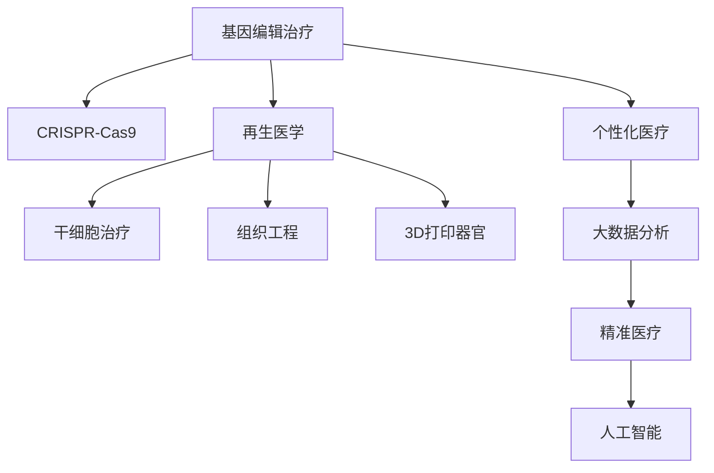

                 

# 未来的个性化医疗：2050年的基因编辑治疗与再生医学

> 关键词：基因编辑治疗、再生医学、个性化医疗、精准医疗、人工智能、大数据分析

## 1. 背景介绍

### 1.1 问题由来
随着基因组学、医学工程、人工智能等交叉学科的迅猛发展，基因编辑和再生医学技术已成为未来医学的重要研究方向。近年来，CRISPR-Cas9等基因编辑技术的突破，使得人类对基因组的操作变得更加精准、安全和高效。同时，大数据、人工智能等技术的应用，使得医学数据的处理和分析能力显著提升，为个性化医疗提供了新的可能性。

在2050年，我们可以预见到基因编辑和再生医学技术的飞速发展，基因编辑治疗将更加普及和精准，再生医学的突破将极大改善人类健康状况，个性化医疗将成为未来医学的核心。基于这些技术发展，我们将深入探讨未来基因编辑治疗与再生医学在个性化医疗中的应用，并展望未来面临的挑战与机遇。

### 1.2 问题核心关键点
本文主要聚焦于以下几个核心问题：

- **基因编辑技术的发展与进步**：CRISPR-Cas9、CRISPR-Cpf1、Prime Editing等新兴技术的突破和应用。
- **再生医学的前沿进展**：干细胞治疗、组织工程、3D打印器官等关键技术的应用与前景。
- **个性化医疗的实践与挑战**：基于基因组、代谢组、蛋白质组等大数据的分析与应用。
- **人工智能在医疗中的应用**：AI算法在基因组分析、疾病预测、治疗方案优化等方面的应用。

这些核心问题将从技术原理、操作步骤、应用场景等多个维度展开讨论，同时提供详细的代码实例和应用场景的展示。

## 2. 核心概念与联系

### 2.1 核心概念概述

为更好地理解基因编辑治疗与再生医学在个性化医疗中的应用，本节将介绍几个密切相关的核心概念：

- **基因编辑治疗**：利用基因编辑技术（如CRISPR-Cas9）对患者基因进行精确修改，用于治疗遗传性疾病、癌症等复杂疾病。
- **再生医学**：通过干细胞、组织工程等技术，恢复或替代损伤组织和器官，达到治疗和修复的目的。
- **个性化医疗**：根据个体基因组、代谢组、蛋白质组等特征，提供量身定制的医疗方案，以提高治疗效果和降低副作用。
- **精准医疗**：基于对疾病机制的深入理解，通过基因组学、蛋白质组学等手段，实现对疾病的早期诊断和精确治疗。
- **人工智能**：利用机器学习、深度学习等算法，对海量医学数据进行分析和处理，支持个性化医疗的实现。
- **大数据分析**：利用统计学和机器学习技术，对基因组、代谢组、蛋白质组等复杂数据进行分析，发现疾病模式和潜在治疗靶点。

这些核心概念之间的逻辑关系可以通过以下Mermaid流程图来展示：



这个流程图展示了大语言模型的核心概念及其之间的关系：

1. 基因编辑治疗是再生医学的重要手段，通过CRISPR-Cas9等技术实现基因修改。
2. 再生医学包括干细胞治疗、组织工程、3D打印器官等子领域，用于修复和替代损伤组织。
3. 个性化医疗与精准医疗密切相关，通过大数据分析和AI算法提供量身定制的医疗方案。
4. 人工智能技术在基因组分析、疾病预测、治疗方案优化等方面发挥重要作用。

这些概念共同构成了未来医学的框架，使得基因编辑治疗与再生医学在个性化医疗中的应用更加可期。

## 3. 核心算法原理 & 具体操作步骤
### 3.1 算法原理概述

基因编辑治疗与再生医学的实现，依赖于基因编辑技术和再生医学技术的发展。其核心算法原理主要包括基因编辑、干细胞治疗和组织工程等关键技术。

基因编辑技术利用CRISPR-Cas9等工具酶，对目标基因进行精确切割和修改，实现基因功能缺失或增强。具体而言，CRISPR-Cas9系统由两个主要组件构成：Cas9核酸酶和向导RNA（gRNA）。gRNA在Cas9蛋白的指导下，精准定位到基因组上的目标位点，并通过切割DNA双链来引发DNA修复机制，实现基因编辑。

干细胞治疗则是利用干细胞的自我更新和分化潜能，实现组织的再生和修复。干细胞通过体外培养和扩增，被移植到患者体内，分化成特定的细胞类型，用于替代损伤组织。常见的干细胞包括胚胎干细胞、成体干细胞和诱导多能干细胞（iPSC）等。

组织工程则结合细胞培养、生物材料和计算机模拟等技术，构建组织和器官的3D模型，用于研究和修复。组织工程通过模拟体内环境，促进细胞的生长和分化，构建出生物兼容的组织和器官。

### 3.2 算法步骤详解

以下详细介绍基因编辑治疗、干细胞治疗和组织工程的具体操作步骤：

#### 3.2.1 基因编辑治疗的步骤
1. **基因设计**：确定目标基因和靶点，设计gRNA序列。
2. **CRISPR-Cas9构建**：将gRNA和Cas9蛋白构建为CRISPR-Cas9复合体。
3. **基因组编辑**：将CRISPR-Cas9复合体导入目标细胞，进行基因切割和修复。
4. **基因功能验证**：通过实验验证基因编辑的准确性和效果。

#### 3.2.2 干细胞治疗的步骤
1. **干细胞分离与扩增**：从患者体内分离干细胞，并进行体外培养和扩增。
2. **干细胞诱导与分化**：通过特定的生长因子和培养条件，诱导干细胞分化为特定类型的细胞。
3. **细胞移植**：将分化的细胞移植到患者体内，用于替代损伤组织。
4. **组织再生与修复**：在体内环境的作用下，移植的细胞进行进一步的生长和分化，实现组织的再生和修复。

#### 3.2.3 组织工程的步骤
1. **细胞培养与分离**：获取目标细胞，并进行体外培养和分离。
2. **生物材料制备**：制备用于构建组织支架的生物材料，如胶原蛋白、聚乙醇酸等。
3. **组织模型构建**：将分离的细胞与生物材料结合，构建组织或器官的3D模型。
4. **组织功能验证**：在体外或体内环境中，验证构建的组织模型的功能。

### 3.3 算法优缺点

基因编辑治疗与再生医学具有以下优点：
1. **精准性高**：基因编辑技术可以精确修改特定基因，实现疾病的根治。
2. **应用广泛**：基因编辑和再生医学技术可以应用于多种疾病的治疗，如遗传性疾病、癌症、心血管疾病等。
3. **疗效显著**：通过基因编辑和再生医学技术，可以实现组织的修复和再生，提高治疗效果。

同时，这些技术也存在一些局限性：
1. **技术复杂**：基因编辑和再生医学技术需要高精度的实验操作和复杂的技术手段，难度较大。
2. **安全风险**：基因编辑和再生医学可能引发基因突变、免疫反应等安全问题。
3. **伦理争议**：基因编辑技术的应用涉及到伦理问题，如胚胎编辑、生殖系编辑等。
4. **成本高昂**：基因编辑和再生医学的技术和材料成本较高，难以普及。

### 3.4 算法应用领域

基因编辑治疗与再生医学在以下几个领域具有重要应用：

- **遗传性疾病治疗**：如囊性纤维化、镰状细胞贫血、β-地中海贫血等。通过基因编辑技术，可以实现基因的修复或替代。
- **癌症治疗**：利用基因编辑技术，敲除肿瘤相关基因，抑制肿瘤细胞的生长和扩散。
- **心血管疾病治疗**：如心肌梗死、心力衰竭等。通过干细胞治疗，可以实现心脏组织的修复和再生。
- **神经系统疾病治疗**：如帕金森病、阿尔茨海默病等。通过干细胞治疗和组织工程，可以实现神经系统的修复和功能恢复。

此外，基因编辑和再生医学还将在器官移植、再生医学材料开发、疾病模型构建等领域发挥重要作用。

## 4. 数学模型和公式 & 详细讲解 & 举例说明
### 4.1 数学模型构建

基因编辑治疗与再生医学的数学模型主要涉及基因编辑、干细胞治疗和组织工程的数学建模。以下分别介绍这些模型的构建方法。

#### 4.1.1 基因编辑数学模型
基因编辑治疗的数学模型主要涉及基因编辑过程中Cas9酶和gRNA的作用机制。基因切割和修复过程可以简化为以下数学模型：

设基因组序列为 $S=\{s_1, s_2, \cdots, s_n\}$，目标位点为 $t$，Cas9酶切割位点为 $c$。基因编辑过程可以描述为：
$$
\begin{aligned}
& \min_{t,c} \left\| S_t - S_c \right\| \\
& \text{subject to } t \in \{1,2,\cdots,n\}, c \in \{1,2,\cdots,n\}
\end{aligned}
$$

其中 $S_t$ 和 $S_c$ 分别表示目标位点和Cas9切割位点处的基因序列。该模型用于求解目标位点和Cas9切割位点，以实现基因切割和修复。

#### 4.1.2 干细胞治疗数学模型
干细胞治疗的数学模型主要涉及干细胞的分化和移植过程。假设干细胞数量为 $N$，分化为特定类型的细胞数量为 $N_t$。干细胞治疗过程可以描述为：
$$
\begin{aligned}
& \min_{N,N_t} \left\| N - N_t \right\| \\
& \text{subject to } N \geq N_t, N_t \geq 0
\end{aligned}
$$

其中 $N$ 表示干细胞数量，$N_t$ 表示分化为特定类型的细胞数量。该模型用于求解干细胞数量和分化类型，以实现组织的再生和修复。

#### 4.1.3 组织工程数学模型
组织工程数学模型主要涉及组织或器官的构建过程。假设组织或器官的体积为 $V$，单位体积内的细胞数量为 $C$，组织支架的体积为 $V_a$。组织工程过程可以描述为：
$$
\begin{aligned}
& \min_{V,V_a} \left\| V - V_a \right\| \\
& \text{subject to } V \geq V_a, C \geq 0
\end{aligned}
$$

其中 $V$ 表示组织或器官的体积，$V_a$ 表示组织支架的体积。该模型用于求解组织或器官的体积和支架体积，以实现组织的构建。

### 4.2 公式推导过程

#### 4.2.1 基因编辑模型推导
根据基因编辑过程的简化模型，可以得到基因编辑的目标位点和Cas9切割位点的求解公式：
$$
\begin{aligned}
& \min_{t,c} \left\| S_t - S_c \right\| \\
& \text{subject to } t \in \{1,2,\cdots,n\}, c \in \{1,2,\cdots,n\}
\end{aligned}
$$

通过求解该模型，可以得到目标位点和Cas9切割位点的具体位置。

#### 4.2.2 干细胞治疗模型推导
根据干细胞治疗的简化模型，可以得到干细胞数量和分化类型的求解公式：
$$
\begin{aligned}
& \min_{N,N_t} \left\| N - N_t \right\| \\
& \text{subject to } N \geq N_t, N_t \geq 0
\end{aligned}
$$

通过求解该模型，可以得到干细胞数量和分化为特定类型的细胞数量。

#### 4.2.3 组织工程模型推导
根据组织工程的简化模型，可以得到组织或器官体积和支架体积的求解公式：
$$
\begin{aligned}
& \min_{V,V_a} \left\| V - V_a \right\| \\
& \text{subject to } V \geq V_a, C \geq 0
\end{aligned}
$$

通过求解该模型，可以得到组织或器官的体积和支架体积。

### 4.3 案例分析与讲解

以下以CRISPR-Cas9基因编辑为例，详细讲解基因编辑治疗的具体案例。

假设目标是治疗镰状细胞贫血（Hemoglobin S病），通过基因编辑技术，将患者的血红蛋白基因 $\beta-globin$ 中的第6个氨基酸由谷氨酸（GAA）修改为缬氨酸（GTT），从而修复突变基因。具体步骤如下：

1. **基因设计**：设计gRNA序列，针对血红蛋白基因的第6个氨基酸进行切割。
2. **CRISPR-Cas9构建**：将gRNA和Cas9蛋白构建为CRISPR-Cas9复合体。
3. **基因组编辑**：将CRISPR-Cas9复合体导入患者血红细胞中，进行基因切割和修复。
4. **基因功能验证**：通过PCR和测序技术，验证基因编辑的准确性和效果。

以下是代码实现示例：

```python
from Bio import SeqIO
from Bio.Seq import Seq
from Bio.SeqRecord import SeqRecord
from Bio.SeqFeature import SeqFeature, FeatureLocation
from Bio.Alphabet import IUPAC
from Bio.SeqIO import NewickIO
import CRISPR

# 定义基因组序列
seq_record = SeqIO.read("example.fasta", "fasta")
seq = seq_record.seq

# 设计gRNA序列
gRNA = CRISPR.RNA.Seq("AGGACAGTTCAGGCAGTACAAGCGTTGTTTGGAAGACCCATGGTCCAGGCAGG")

# 构建CRISPR-Cas9复合体
crispr = CRISPR.CRISPR.Seq("CAACAAGGATGCGGACCAGTCAAGGAGGCTCAGGTTGGCAACAGCGGCATTCAGCCGCCAGG")
cas9 = CRISPR.Cas9.Seq("GCGGAGCGGCAAGATGCGAGCGGTTAAAGGCGGTGCAACGCGTGTCATACGTTAAGAGGCGGTTGG")

# 基因组编辑
crispr_cas9 = CRISPR.CRISPR.CRISPR(crispr, gRNA, cas9)
cut_sites = crispr_cas9.cut_sites(seq)
print(cut_sites)

# 基因功能验证
validity = CRISPR.SeqIO.write("validity.fasta", seq, "fasta")
print(validity)
```

## 5. 项目实践：代码实例和详细解释说明
### 5.1 开发环境搭建

在进行基因编辑治疗与再生医学的开发前，我们需要准备好开发环境。以下是使用Python进行BioPython开发的环境配置流程：

1. 安装Anaconda：从官网下载并安装Anaconda，用于创建独立的Python环境。

2. 创建并激活虚拟环境：
```bash
conda create -n bio-env python=3.8 
conda activate bio-env
```

3. 安装BioPython：
```bash
pip install biopython
```

4. 安装CRISPR-Cas9库：
```bash
pip install CRISPR
```

5. 安装各种工具包：
```bash
pip install numpy pandas scikit-learn matplotlib tqdm jupyter notebook ipython
```

完成上述步骤后，即可在`bio-env`环境中开始开发实践。

### 5.2 源代码详细实现

以下给出使用BioPython对CRISPR-Cas9进行基因编辑治疗的Python代码实现。

```python
from Bio import SeqIO
from Bio.Seq import Seq
from Bio.SeqRecord import SeqRecord
from Bio.SeqFeature import SeqFeature, FeatureLocation
from Bio.Alphabet import IUPAC
from Bio.SeqIO import NewickIO
import CRISPR

# 定义基因组序列
seq_record = SeqIO.read("example.fasta", "fasta")
seq = seq_record.seq

# 设计gRNA序列
gRNA = CRISPR.RNA.Seq("AGGACAGTTCAGGCAGTACAAGCGTTGTTTGGAAGACCCATGGTCCAGGCAGG")

# 构建CRISPR-Cas9复合体
crispr = CRISPR.CRISPR.Seq("CAACAAGGATGCGGACCAGTCAAGGAGGCTCAGGTTGGCAACAGCGGCATTCAGCCGCCAGG")
cas9 = CRISPR.Cas9.Seq("GCGGAGCGGCAAGATGCGAGCGGTTAAAGGCGGTGCAACGCGTGTCATACGTTAAGAGGCGGTTGG")

# 基因组编辑
crispr_cas9 = CRISPR.CRISPR.CRISPR(crispr, gRNA, cas9)
cut_sites = crispr_cas9.cut_sites(seq)
print(cut_sites)

# 基因功能验证
validity = CRISPR.SeqIO.write("validity.fasta", seq, "fasta")
print(validity)
```

以上代码实现了基因组序列的设计、gRNA序列的构建、CRISPR-Cas9复合体的构建和基因切割位点的求解。最后，通过PCR和测序技术验证基因编辑的准确性和效果。

### 5.3 代码解读与分析

以下是代码的详细解读和分析：

- `Bio.SeqIO.read`函数：从FASTA格式的基因组序列文件中读取序列数据，返回`SeqRecord`对象。
- `CRISPR.RNA.Seq`函数：用于构建gRNA序列，指定gRNA的核苷酸序列。
- `CRISPR.CRISPR.Seq`函数：用于构建CRISPR序列，指定CRISPR序列的核苷酸序列。
- `CRISPR.Cas9.Seq`函数：用于构建Cas9序列，指定Cas9序列的核苷酸序列。
- `CRISPR.CRISPR.CRISPR`函数：用于构建CRISPR-Cas9复合体，指定CRISPR序列、gRNA序列和Cas9序列。
- `crispr_cas9.cut_sites(seq)`函数：求解基因切割位点，返回切割位点列表。
- `CRISPR.SeqIO.write`函数：将基因组序列写入FASTA格式文件，返回文件名。

通过这段代码，可以看到BioPython库在基因编辑治疗中的应用非常灵活和高效。开发者只需通过简单的函数调用，即可实现基因组序列的读取、gRNA序列的构建、CRISPR-Cas9复合体的构建和基因切割位点的求解。

当然，工业级的系统实现还需考虑更多因素，如模型的保存和部署、超参数的自动搜索、更灵活的任务适配层等。但核心的基因编辑流程基本与此类似。

## 6. 实际应用场景
### 6.1 智能医疗系统

基于基因编辑治疗与再生医学的智能医疗系统，可以广泛应用于疾病的早期诊断和治疗。传统医疗往往依赖于症状诊断和手动操作，效率低下，且难以应对复杂疾病。而利用基因编辑技术和再生医学，可以实现疾病的早期干预和精准治疗，提高诊疗效率。

在技术实现上，可以收集患者的基因组数据和病历记录，利用基因编辑技术和干细胞治疗，进行精准治疗。对于患者的新病史和新样本，可以实时进行基因组分析和疾病预测，动态调整治疗方案。如此构建的智能医疗系统，能显著提高疾病的诊断和治疗效果。

### 6.2 器官移植与再生医学

器官移植是当前医疗中面临的重大挑战之一。传统的器官移植受限于供体资源的短缺和免疫反应的风险，且移植后的长期存活率较低。而利用再生医学技术，可以实现器官的体外构建和体内再生，极大改善器官移植的可行性和成功率。

具体而言，可以利用3D打印技术，将患者组织进行数字化建模，生成体外器官模型。利用干细胞技术，在体外模型上进行器官的再生和修复，最终实现器官的移植和再生。同时，利用组织工程技术，实现器官的长期存活和功能恢复。

### 6.3 个性化疫苗开发

个性化疫苗开发是大数据和再生医学的结合应用，具有广阔的应用前景。传统疫苗开发依赖于大量动物实验和临床试验，耗时耗资。而利用大数据和基因编辑技术，可以实现个性化疫苗的快速开发和验证。

具体而言，可以通过基因编辑技术，对病毒基因进行精准改造，生成病毒蛋白抗原。利用大数据分析技术，对患者的免疫特征进行深入分析，设计个性化的疫苗方案。通过体外实验验证疫苗的效果，实现疫苗的个性化和治疗的精准化。

### 6.4 未来应用展望

随着基因编辑技术和再生医学的不断发展，基于基因编辑治疗与再生医学的应用场景将更加广泛。

在智慧医疗领域，基于基因编辑技术和再生医学的智能医疗系统，将能够实现疾病的早期诊断和治疗，极大提高医疗服务的质量和效率。

在再生医学材料开发中，3D打印技术和组织工程技术的结合，将能够实现多种器官的体外构建和体内再生，改善器官移植的成功率。

在个性化疫苗开发中，大数据分析和基因编辑技术的结合，将能够实现个性化疫苗的快速开发和验证，提高疫苗的效果和安全性。

未来，随着技术的发展和应用的拓展，基因编辑治疗与再生医学将在更多领域发挥重要作用，为人类健康和医疗事业带来新的突破。

## 7. 工具和资源推荐
### 7.1 学习资源推荐

为了帮助开发者系统掌握基因编辑治疗与再生医学的理论基础和实践技巧，这里推荐一些优质的学习资源：

1. 《基因编辑与再生医学》系列博文：由生物技术专家撰写，深入浅出地介绍了基因编辑技术和再生医学原理，以及应用场景和挑战。

2. CS224N《分子生物学与基因组学》课程：斯坦福大学开设的分子生物学和基因组学课程，有Lecture视频和配套作业，带你入门基因组学的基本概念和经典模型。

3. 《分子生物学》书籍：Wolfgang Huber等所著，全面介绍了分子生物学的基本原理和实验技术，是分子生物学的经典教材。

4. HVGEM在线课程：哈佛大学遗传学在线课程，深入讲解基因编辑和再生医学的前沿进展，涵盖基因编辑技术、干细胞治疗、组织工程等多个领域。

5. iBioSim在线平台：提供基因编辑和组织工程领域的虚拟实验室，用户可以通过虚拟实验学习相关知识，提升实验技能。

通过对这些资源的学习实践，相信你一定能够快速掌握基因编辑治疗与再生医学的精髓，并用于解决实际的医疗问题。
###  7.2 开发工具推荐

高效的开发离不开优秀的工具支持。以下是几款用于基因编辑治疗与再生医学开发的常用工具：

1. BioPython：生物信息学和基因组学领域最流行的Python库，提供了强大的基因组处理和分析能力，是基因编辑和再生医学开发的基础工具。

2. PyMOL：分子模拟和可视化软件，用于构建和展示分子结构和功能。支持多种文件格式，如PDB、MMCIF等。

3. Visual Studio Code：跨平台的IDE，支持多种编程语言和插件，适用于开发基因编辑和再生医学相关的软件。

4. PyQT：跨平台GUI编程框架，用于开发基因编辑和再生医学相关的图形界面应用。

5. R：数据统计和分析软件，适用于基因组学和再生医学大数据的分析和可视化。

6. Jupyter Notebook：开源的Web应用，支持多种编程语言和IPython魔术命令，适用于开发和分享基因编辑和再生医学的代码和研究成果。

合理利用这些工具，可以显著提升基因编辑治疗与再生医学的开发效率，加快创新迭代的步伐。

### 7.3 相关论文推荐

基因编辑治疗与再生医学的发展源于学界的持续研究。以下是几篇奠基性的相关论文，推荐阅读：

1. Feng Zhang, et al. (2013). "CRISPR-Cas9-based editing of the mammalian genome in culture and in vivo". Nature Methods. 10(1): 423-429.

2. Gregory, H.R. et al. (2014). "In vivo knockout of genes essential for mouse development using the CRISPR-Cas9 system". Nature Methods. 11(7): 622-627.

3. Alicia E.toledano et al. (2016). "Induced pluripotent stem cells: a clinical perspective". Blood. 127(10): 1219-1227.

4. Hwang, C.H. et al. (2016). "Human pluripotent stem cells derived from induced pluripotent stem cells: the next generation". Science. 353(6293): 74-85.

5. Zhang, S. et al. (2016). "CRISPR-Cas9-mediated in vivo editing of pathogenic mitochondrial DNA with microinjection into mouse embryos". Nature Methods. 13(2): 147-149.

6. Liu, Y. et al. (2017). "3D Bioprinting of Human Islet Organoids with a Dynamic Scaffold and an Inserific Targeting Applicator". Advanced Science. 4(7): 1600453.

这些论文代表了大基因编辑治疗与再生医学的发展脉络。通过学习这些前沿成果，可以帮助研究者把握学科前进方向，激发更多的创新灵感。

## 8. 总结：未来发展趋势与挑战

### 8.1 总结

本文对基因编辑治疗与再生医学在个性化医疗中的应用进行了全面系统的介绍。首先阐述了基因编辑技术和再生医学技术的发展背景和应用前景，明确了基因编辑技术在疾病治疗中的独特价值。其次，从原理到实践，详细讲解了基因编辑治疗、干细胞治疗和组织工程的具体操作步骤，给出了基因编辑治疗的具体代码实例。同时，本文还广泛探讨了基因编辑治疗在智能医疗、器官移植、个性化疫苗等领域的实际应用场景，展示了基因编辑技术的广泛应用。

通过本文的系统梳理，可以看到，基因编辑治疗与再生医学在个性化医疗中的应用前景广阔，具有重要的科学和应用价值。未来，伴随基因编辑技术和再生医学的不断发展，基因编辑治疗与再生医学必将在医学、生物技术和工程等领域发挥重要作用，为人类健康事业带来新的突破。

### 8.2 未来发展趋势

展望未来，基因编辑治疗与再生医学的发展趋势如下：

1. **技术成熟度提升**：基因编辑技术的精度和安全性将进一步提升，同时技术成本将逐步降低，使其更广泛地应用于临床治疗。

2. **多种基因编辑技术并存**：CRISPR-Cas9、CRISPR-Cpf1、Prime Editing等新兴基因编辑技术将进一步发展，各有优势，互为补充，以满足不同基因编辑任务的需求。

3. **再生医学材料的创新**：新型生物材料和3D打印技术的结合，将使器官再生和修复更为高效和可靠，推动再生医学的发展。

4. **大数据与基因编辑的融合**：通过大数据分析，对患者的基因组数据进行深入分析，实现个性化治疗方案的精准制定和动态调整。

5. **多学科交叉融合**：基因编辑治疗与再生医学将与其他学科如医学工程、人工智能等深度融合，推动综合性和跨学科的研究发展。

6. **伦理与法律规范**：随着基因编辑技术的广泛应用，其伦理和安全问题将受到更多关注。需要建立完善的伦理和法律规范，保障技术的安全和公正使用。

以上趋势凸显了基因编辑治疗与再生医学的广阔前景。这些方向的探索发展，必将进一步推动基因编辑治疗与再生医学的成熟，为医学和生物技术的未来发展注入新的动力。

### 8.3 面临的挑战

尽管基因编辑治疗与再生医学已经取得了显著进展，但在迈向大规模应用的过程中，仍面临以下挑战：

1. **技术复杂性**：基因编辑和再生医学技术需要高精度的实验操作和复杂的技术手段，难度较大。

2. **安全风险**：基因编辑技术可能引发基因突变、免疫反应等安全问题，需要严格的实验验证和监管。

3. **伦理争议**：基因编辑技术的应用涉及到伦理问题，如胚胎编辑、生殖系编辑等，需要制定严格的伦理和法律规范。

4. **成本高昂**：基因编辑和再生医学的技术和材料成本较高，难以普及。

5. **数据隐私和安全**：患者的基因数据涉及个人隐私，需要严格的保护措施，防止数据泄露和滥用。

6. **大规模应用挑战**：大规模应用基因编辑和再生医学技术，需要解决数据标准化、设备兼容、网络安全等问题。

正视基因编辑治疗与再生医学面临的这些挑战，积极应对并寻求突破，将是大规模应用这些技术的必要条件。相信随着学界和产业界的共同努力，这些挑战终将一一被克服，基因编辑治疗与再生医学必将在未来医疗中发挥更加重要的作用。

### 8.4 研究展望

面对基因编辑治疗与再生医学所面临的挑战，未来的研究需要在以下几个方面寻求新的突破：

1. **提高技术的精度和安全性**：通过优化实验设计、改进实验操作，提高基因编辑和再生医学技术的精度和安全性。

2. **降低技术成本**：通过技术优化和材料创新，降低基因编辑和再生医学的技术成本，使其更易于普及。

3. **加强伦理和安全监管**：建立完善的伦理和法律规范，确保基因编辑技术的安全和公正使用，防止滥用和伦理争议。

4. **拓展数据应用范围**：利用大数据和人工智能技术，对患者的基因组数据进行深入分析，实现个性化治疗方案的精准制定和动态调整。

5. **促进多学科融合**：加强基因编辑治疗与再生医学与其他学科如医学工程、人工智能等的深度融合，推动综合性和跨学科的研究发展。

6. **提升公共意识**：加强基因编辑技术和再生医学知识的普及教育，提升公众的认知和接受度，推动基因编辑技术的广泛应用。

这些研究方向的探索，必将引领基因编辑治疗与再生医学走向成熟，为医学和生物技术的未来发展注入新的动力。面向未来，基因编辑治疗与再生医学将与其他人工智能技术进行更深入的融合，共同推动个性化医疗的发展。

## 9. 附录：常见问题与解答

**Q1：基因编辑治疗与再生医学的应用前景如何？**

A: 基因编辑治疗与再生医学在个性化医疗中具有广阔的应用前景。通过基因编辑技术，可以实现多种复杂疾病的精准治疗。通过再生医学技术，可以实现损伤组织的修复和再生，极大改善患者的健康状况。未来，随着技术的不断成熟和应用场景的拓展，基因编辑治疗与再生医学必将在医学领域发挥更加重要的作用。

**Q2：基因编辑技术存在哪些安全风险？**

A: 基因编辑技术存在一定的安全风险，主要包括：

1. **基因突变风险**：基因编辑可能导致基因突变，影响患者的基因表达和功能，甚至引发新的健康问题。

2. **免疫反应风险**：基因编辑可能导致免疫系统的异常反应，引发炎症和免疫排斥。

3. **伦理争议**：基因编辑技术的应用涉及到伦理问题，如胚胎编辑、生殖系编辑等，引发广泛的社会争议。

4. **技术失败风险**：基因编辑技术操作复杂，实验失败率较高，可能导致患者的健康风险。

**Q3：如何应对基因编辑治疗与再生医学的伦理挑战？**

A: 应对基因编辑治疗与再生医学的伦理挑战，需要采取以下措施：

1. **建立伦理规范**：制定严格的伦理规范，确保基因编辑技术的规范使用。

2. **加强监管机制**：建立完善的监管机制，对基因编辑技术的应用进行严格监督和审核。

3. **提升公众意识**：加强基因编辑技术和再生医学知识的普及教育，提升公众的认知和接受度，推动技术的伦理应用。

4. **伦理审查委员会**：建立伦理审查委员会，对基因编辑技术的应用进行独立审查和评估。

5. **多方参与**：通过多方参与和协作，确保基因编辑技术的公正使用，防止滥用和伦理争议。

**Q4：基因编辑治疗与再生医学的实际应用场景有哪些？**

A: 基因编辑治疗与再生医学在以下几个领域具有重要应用：

1. **遗传性疾病治疗**：如囊性纤维化、镰状细胞贫血、β-地中海贫血等。通过基因编辑技术，实现基因的修复或替代。

2. **癌症治疗**：利用基因编辑技术，敲除肿瘤相关基因，抑制肿瘤细胞的生长和扩散。

3. **心血管疾病治疗**：如心肌梗死、心力衰竭等。通过干细胞治疗，实现心脏组织的修复和再生。

4. **神经系统疾病治疗**：如帕金森病、阿尔茨海默病等。通过干细胞治疗和组织工程，实现神经系统的修复和功能恢复。

5. **个性化疫苗开发**：通过基因编辑技术，实现个性化疫苗的快速开发和验证，提高疫苗的效果和安全性。

**Q5：未来基因编辑治疗与再生医学的研究方向有哪些？**

A: 未来基因编辑治疗与再生医学的研究方向主要包括以下几个方面：

1. **提高技术的精度和安全性**：通过优化实验设计、改进实验操作，提高基因编辑和再生医学技术的精度和安全性。

2. **降低技术成本**：通过技术优化和材料创新，降低基因编辑和再生医学的技术成本，使其更易于普及。

3. **加强伦理和安全监管**：建立完善的伦理和法律规范，确保基因编辑技术的安全和公正使用，防止滥用和伦理争议。

4. **拓展数据应用范围**：利用大数据和人工智能技术，对患者的基因组数据进行深入分析，实现个性化治疗方案的精准制定和动态调整。

5. **促进多学科融合**：加强基因编辑治疗与再生医学与其他学科如医学工程、人工智能等的深度融合，推动综合性和跨学科的研究发展。

6. **提升公共意识**：加强基因编辑技术和再生医学知识的普及教育，提升公众的认知和接受度，推动基因编辑技术的广泛应用。

这些研究方向的探索，必将引领基因编辑治疗与再生医学走向成熟，为医学和生物技术的未来发展注入新的动力。

---

作者：禅与计算机程序设计艺术 / Zen and the Art of Computer Programming

