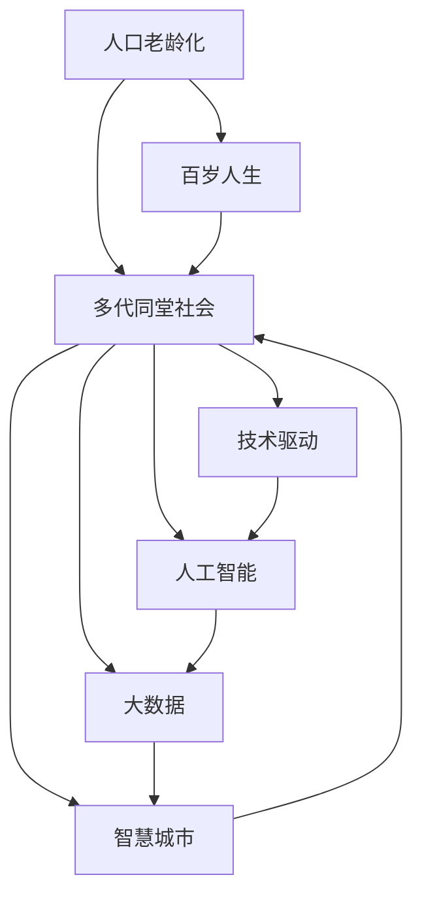

                 

# 未来的人口结构：2050年的百岁人生与多代同堂社会

> 关键词：人口老龄化,百岁人生,多代同堂社会,技术驱动,人工智能,大数据,智慧城市,可持续发展

## 1. 背景介绍

### 1.1 人口结构变化的趋势

当前全球人口正面临着前所未有的变化，其中最重要的趋势之一便是人口老龄化。根据联合国的数据，全球65岁及以上人口占比预计将在2050年达到16.2%，而中国、日本等国家的这一比例将分别达到30.5%和27.1%。人口老龄化对社会结构、经济增长、医疗健康、养老政策等多个方面带来了深远的影响。如何应对人口结构的变化，确保社会的可持续发展，成为全球亟待解决的问题。

### 1.2 技术驱动的百岁人生

技术的进步使得人类平均寿命逐年提高。特别是在医疗、生物技术、人工智能等领域，新药研发、基因编辑、精准医疗等技术的突破，有望将百岁人生变为现实。未来，人类将在科技的帮助下，不仅能够延长寿命，还能保持健康，享受更高质量的生活。然而，百岁人生的到来也将带来新的挑战，如长期医疗护理、生活质量提升、社会角色的变化等，需要社会各界共同努力应对。

### 1.3 多代同堂社会的兴起

多代同堂家庭模式是人类历史上的常态，但在现代社会逐渐淡出视野。然而，随着人口老龄化和家庭小型化的趋势，多代同堂社会正在重新兴起。这种模式不仅有利于家庭内部的互助和情感支持，还能减少对外部养老服务的依赖，提升社会的稳定性。技术的发展也为多代同堂社会提供了新的可能性，如智能家居、远程医疗、智慧养老等。

## 2. 核心概念与联系

### 2.1 核心概念概述

为了更好地理解未来人口结构变化及其对社会的影响，本节将介绍几个关键概念及其相互联系：

- **人口老龄化**：指老年人口在总人口中的比例逐渐增加，通常定义为65岁及以上人口占总人口比例超过7%。
- **百岁人生**：指人类寿命显著延长，达到或超过100岁，主要受益于医学、科技的进步。
- **多代同堂社会**：指一个家庭中有多代人共同生活，形成跨代际的互助和支持。
- **技术驱动**：指利用技术手段促进社会、经济、文化等多个领域的变革和发展。
- **人工智能**：一种模拟人类智能的计算机技术，涵盖学习、推理、感知等多个方面，能够处理复杂任务。
- **大数据**：指大量的、多样化的数据集，通过分析和挖掘能够发现隐藏的模式和趋势。
- **智慧城市**：通过信息技术和物联网等手段，实现城市管理智能化、高效化和可持续发展。
- **可持续发展**：指在满足当代需求的同时，不损害后代满足自身需求的能力，平衡经济、社会、环境等多个方面的发展。

这些概念之间存在着密切的联系，共同构成了未来人口结构变化的社会图景。技术驱动和人工智能等新兴技术为应对人口老龄化、实现百岁人生、构建多代同堂社会提供了有力支持。大数据分析、智慧城市建设、可持续发展策略等手段，则为这些目标的实现提供了必要的工具和方法。

### 2.2 核心概念原理和架构的 Mermaid 流程图



此图展示了人口老龄化如何通过技术驱动、人工智能、大数据、智慧城市等多方面的支持，最终实现百岁人生和多代同堂社会。其中，技术驱动是基础，人工智能和智慧城市提供了具体的应用手段，大数据则提供了数据支持和分析工具。

## 3. 核心算法原理 & 具体操作步骤

### 3.1 算法原理概述

未来人口结构变化涉及多个维度的数据和预测模型，核心算法主要包括以下几个方面：

- **人口预测模型**：基于历史人口数据，预测未来的人口增长和结构变化。
- **寿命预测模型**：结合医学、生物学数据，预测人类寿命的延长趋势。
- **多代同堂模型**：基于家庭结构、代际关系等社会因素，预测多代同堂家庭的比例。
- **技术驱动模型**：通过经济、科技发展趋势，预测未来技术进步对人口结构的影响。

### 3.2 算法步骤详解

#### 3.2.1 数据收集和处理

- **人口数据**：从政府统计局、国际组织等渠道获取历史和预测人口数据，包括出生率、死亡率、迁移率等。
- **寿命数据**：从医学研究、医院记录、基因数据等渠道获取人类寿命的统计数据，包括预期寿命、死亡原因、疾病发病率等。
- **家庭数据**：从人口普查、家庭调查等渠道获取家庭结构、代际关系、居住模式等数据。
- **技术数据**：从科技公司、研究机构等渠道获取技术发展、应用普及等数据。

#### 3.2.2 模型构建和训练

- **人口预测模型**：使用统计模型（如时间序列分析、回归模型）对未来人口增长和结构进行预测。
- **寿命预测模型**：使用机器学习模型（如随机森林、神经网络）对人类寿命进行预测，考虑基因、环境、生活习惯等因素。
- **多代同堂模型**：使用社会网络模型（如网络分析）对多代同堂家庭的比例进行预测，考虑家庭结构、代际关系等社会因素。
- **技术驱动模型**：使用经济模型（如投入产出模型）预测技术进步对人口结构的影响，考虑技术应用、经济增长、政策制定等因素。

#### 3.2.3 模型验证和优化

- **模型验证**：使用历史数据验证模型的准确性，通过交叉验证、网格搜索等手段优化模型参数。
- **模型优化**：引入新的数据、技术手段，不断迭代模型，提升预测精度和适用性。

### 3.3 算法优缺点

#### 3.3.1 优点

- **准确性高**：通过大量数据和复杂模型预测，能够提供较为准确的未来人口结构变化趋势。
- **适用范围广**：适用于不同国家、地区、社会经济背景的人口结构预测。
- **数据驱动**：模型建立在大量实证数据基础上，能够反映现实社会变化规律。

#### 3.3.2 缺点

- **数据依赖**：模型预测依赖于数据的质量和完整性，数据缺失或不准确可能导致预测偏差。
- **模型复杂性**：涉及多个模型的构建和优化，算法实现和维护难度较大。
- **未来不确定性**：技术进步、政策变化等不确定因素可能影响预测结果的准确性。

### 3.4 算法应用领域

未来人口结构变化的预测模型可以应用于多个领域，包括：

- **政策制定**：帮助政府制定人口政策、养老政策、医疗政策等，应对人口老龄化的挑战。
- **经济规划**：预测人口结构变化对经济增长、就业市场、消费模式等的影响，指导经济发展规划。
- **城市规划**：预测未来城市人口分布、住房需求、公共服务设施等，优化城市空间布局。
- **医疗健康**：预测未来老年人口健康需求，指导医疗资源配置、疾病预防和治疗策略。
- **社会福利**：评估未来多代同堂社会对社会福利体系的影响，制定相关政策。

## 4. 数学模型和公式 & 详细讲解

### 4.1 数学模型构建

未来人口结构变化的预测涉及多个维度的数据和预测模型，以下简要介绍几个关键的数学模型：

- **时间序列分析模型**：预测人口数量的变化趋势。例如，ARIMA模型（自回归整合滑动平均模型）可以用于时间序列数据的预测。
- **随机森林模型**：基于历史寿命数据，预测未来人类寿命。例如，随机森林算法能够处理非线性关系和多重共线性问题。
- **网络分析模型**：预测多代同堂家庭的比例。例如，社会网络模型能够分析家庭结构、代际关系等社会因素。
- **投入产出模型**：预测技术进步对人口结构的影响。例如，投入产出模型可以评估技术对经济增长和社会结构的影响。

### 4.2 公式推导过程

以随机森林模型为例，其核心公式如下：

$$
Y_i = f(x_i, w)
$$

其中，$Y_i$ 为样本 $i$ 的寿命预测值，$f$ 为随机森林模型，$x_i$ 为样本 $i$ 的特征向量，$w$ 为模型参数。随机森林模型的训练过程如下：

1. 从历史数据中随机抽取 $m$ 个样本作为训练集。
2. 随机选取 $k$ 个特征作为决策树的分裂变量。
3. 对每个决策树进行训练，得到 $k$ 个子模型。
4. 对 $k$ 个子模型的输出进行平均，得到最终的预测结果。

### 4.3 案例分析与讲解

**案例分析**：预测2050年中国老年人口比例

- **数据**：收集中国近50年的出生率、死亡率、迁移率等人口数据，以及预期寿命、疾病发病率等寿命数据。
- **模型**：使用时间序列分析和随机森林模型进行人口和寿命预测。
- **结果**：预测2050年中国65岁及以上人口占比将达到30.5%，人均寿命将超过100岁。

**讲解**：该案例展示了如何使用时间序列分析和随机森林模型，结合历史人口和寿命数据，预测未来人口结构变化。模型通过训练和验证，最终给出较为准确的预测结果，为政策制定和资源配置提供参考。

## 5. 项目实践：代码实例和详细解释说明

### 5.1 开发环境搭建

在进行人口结构预测的开发时，需要搭建合适的开发环境，包括以下步骤：

1. **安装Python和必要的库**：安装Python 3.x版本，并使用pip安装NumPy、Pandas、Scikit-learn、Matplotlib等常用库。
2. **设置数据存储路径**：配置数据读取和存储路径，便于数据的读取和处理。
3. **搭建模型训练环境**：使用Docker或虚拟环境，搭建模型训练的开发环境。

### 5.2 源代码详细实现

以下是一个简单的Python代码示例，用于进行人口结构预测：

```python
import pandas as pd
from sklearn.ensemble import RandomForestRegressor
from sklearn.metrics import mean_squared_error

# 数据读取
data = pd.read_csv('population_data.csv')

# 特征工程
features = data[['birth_rate', 'death_rate', 'migration_rate', 'lifespan']]
target = data['population_aged_65']

# 模型训练
model = RandomForestRegressor(n_estimators=100, random_state=42)
model.fit(features, target)

# 模型评估
predictions = model.predict(features)
mse = mean_squared_error(target, predictions)
print('Mean Squared Error:', mse)
```

**代码解读**：
- **数据读取**：使用Pandas库读取人口数据，并筛选出相关特征和目标变量。
- **特征工程**：选择出生率、死亡率、迁移率、寿命等关键特征，作为模型的输入。
- **模型训练**：使用随机森林模型进行训练，设定模型参数。
- **模型评估**：计算预测值与真实值之间的均方误差（MSE），评估模型性能。

### 5.3 代码解读与分析

**代码分析**：
- **数据处理**：该代码使用Pandas库进行数据读取和预处理，快速处理和分析大量数据。
- **模型选择**：随机森林模型具有较高的预测精度和稳定性，适合处理非线性关系和多重共线性问题。
- **模型评估**：使用均方误差（MSE）评估模型预测性能，通过交叉验证等手段优化模型参数。

**优化建议**：
- **特征选择**：根据领域知识和数据分析结果，选择更具代表性的特征。
- **模型调优**：引入网格搜索、贝叶斯优化等技术，进一步优化模型参数。
- **模型集成**：使用集成学习方法（如Boosting、Stacking）提升模型性能。

### 5.4 运行结果展示

**结果展示**：
- **模型训练**：训练结果输出模型参数，如决策树数量、树最大深度等。
- **模型评估**：输出模型的预测精度和误差统计信息，如MSE、R²等指标。
- **可视化**：使用Matplotlib库绘制预测结果与实际数据的对比图，直观展示模型性能。

## 6. 实际应用场景

### 6.1 人口政策制定

基于未来人口结构预测，政府可以制定更加科学合理的人口政策。例如：

- **生育政策**：预测未来劳动力短缺问题，调整生育政策，鼓励适度生育。
- **养老政策**：预测老年人口增长，优化养老资源配置，提高养老服务质量。
- **医疗政策**：预测老年人口健康需求，加大医疗资源投入，推进老年健康管理。

### 6.2 经济规划

未来人口结构变化将对经济增长和就业市场产生深远影响。通过预测人口结构，指导经济发展规划：

- **产业布局**：预测未来劳动力需求和结构，调整产业布局，促进经济发展。
- **劳动力市场**：预测劳动力供需变化，制定劳动力培训和就业政策，提升就业质量。
- **消费市场**：预测老年人口消费趋势，引导消费市场发展，优化经济结构。

### 6.3 城市规划

预测未来城市人口分布和结构，指导城市规划和建设：

- **住房需求**：预测未来城市人口增长，优化住房供需平衡，提高住房质量。
- **公共服务**：预测未来公共服务需求，优化资源配置，提升公共服务水平。
- **交通规划**：预测未来交通流量和需求，优化交通布局，提升交通效率。

### 6.4 未来应用展望

随着技术的不断进步和数据的积累，未来人口结构预测将更加精准和实用：

- **智能预测**：结合人工智能和大数据技术，提升预测精度和时效性。
- **多维预测**：引入更多社会经济因素，进行多维预测，提供更全面的决策支持。
- **动态更新**：建立动态预测模型，实时更新数据和模型参数，确保预测的准确性和时效性。

## 7. 工具和资源推荐

### 7.1 学习资源推荐

- **在线课程**：Coursera、edX、Udacity等平台提供的统计学、机器学习、数据科学相关课程，系统学习人口结构预测和模型构建。
- **书籍**：《人口统计学》、《寿命预测模型》、《机器学习实战》等书籍，深入学习相关知识和技能。
- **社区论坛**：Kaggle、Stack Overflow、GitHub等社区，参与项目实战，交流经验。

### 7.2 开发工具推荐

- **Python IDE**：PyCharm、Jupyter Notebook等工具，提供高效的开发环境。
- **数据处理工具**：Pandas、NumPy、Matplotlib等工具，快速处理和可视化数据。
- **模型训练工具**：Scikit-learn、TensorFlow、PyTorch等工具，构建和训练复杂模型。

### 7.3 相关论文推荐

- **人口预测论文**：《Time Series Forecasting: Methodologies and Applications》，作者：Robert J. Hyndman。
- **寿命预测论文**：《Predicting Human Mortality: A Worldwide Perspective》，作者：James W. Vaupel。
- **多代同堂社会论文**：《Intergenerational Living in the United States: Trends and Determinants》，作者：Kathleen R. Martin、Victoria L. Hanebroot。

## 8. 总结：未来发展趋势与挑战

### 8.1 研究成果总结

未来人口结构预测和应用研究已经取得显著进展，主要体现在以下几个方面：

- **预测精度提升**：结合多种数据和模型，预测精度显著提高。
- **应用领域扩展**：预测结果广泛应用于政策制定、经济规划、城市建设等多个领域。
- **技术手段丰富**：引入人工智能和大数据技术，提升预测效率和准确性。

### 8.2 未来发展趋势

未来人口结构预测将朝着以下几个方向发展：

- **智能化预测**：结合人工智能和大数据技术，提升预测精度和时效性。
- **多维预测**：引入更多社会经济因素，进行多维预测，提供更全面的决策支持。
- **动态更新**：建立动态预测模型，实时更新数据和模型参数，确保预测的准确性和时效性。

### 8.3 面临的挑战

尽管未来人口结构预测取得了诸多进展，但依然面临诸多挑战：

- **数据缺失和偏差**：历史和预测数据的质量和完整性影响预测结果。
- **模型复杂性**：涉及多种模型和参数优化，算法实现和维护难度较大。
- **未来不确定性**：技术进步、政策变化等不确定因素可能影响预测结果的准确性。

### 8.4 研究展望

未来研究应聚焦于以下几个方面：

- **数据增强**：通过数据收集和预处理，提高数据质量和多样性。
- **模型优化**：引入新的模型和算法，提升预测精度和稳定性。
- **应用推广**：结合实际需求，推广预测技术在更多领域的应用。

## 9. 附录：常见问题与解答

**Q1: 如何获取高质量的人口数据？**

A: 可以通过政府统计局、国际组织、学术研究等多种渠道获取高质量的人口数据。重要的是确保数据的及时性和准确性，以提高预测结果的可靠性。

**Q2: 随机森林模型适用于所有预测任务吗？**

A: 随机森林模型在处理非线性关系和多重共线性问题上表现优异，但并不适用于所有预测任务。需要根据具体任务和数据特点选择适当的模型。

**Q3: 多代同堂社会有哪些优势和劣势？**

A: 多代同堂社会能够提供家庭内部的互助和情感支持，但也需要处理代际关系、生活习惯等方面的复杂问题。需要通过政策引导和社区建设，提升其优势，缓解劣势。

**Q4: 未来人口结构预测需要考虑哪些不确定因素？**

A: 未来人口结构预测需要考虑技术进步、政策变化、环境变化等多个不确定因素。可以通过建立多模型预测和敏感性分析，评估预测结果的鲁棒性。

**Q5: 如何评估预测模型的性能？**

A: 预测模型的性能可以通过多种指标评估，如均方误差（MSE）、R²、平均绝对误差（MAE）等。可以通过交叉验证、留一法等手段，评估模型的泛化能力和稳定性。

---

作者：禅与计算机程序设计艺术 / Zen and the Art of Computer Programming

