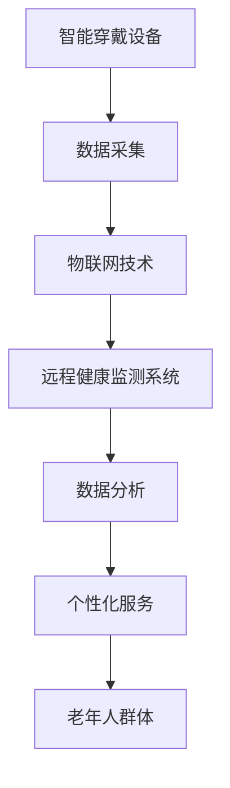

                 

# 未来的智慧养老：2050年的智能穿戴与远程健康监测

> 关键词：智慧养老, 智能穿戴, 远程健康监测, 老年人护理, 人工智能, 大数据, 物联网, 数字健康

## 1. 背景介绍

### 1.1 问题由来

随着全球人口老龄化趋势的加剧，养老问题已经成为各国政府和全社会关注的焦点。传统的养老模式以家庭为主，但随着社会变迁和家庭结构的变化，家庭养老功能逐渐削弱。为此，各国纷纷探索新的养老模式，以适应老龄化社会的需求。

智慧养老是近年来新兴的养老模式，通过数字化、网络化和智能化的手段，提高养老服务的效率和质量，实现老年人生活更好、更舒适、更安全的养老目标。其中，智能穿戴与远程健康监测是智慧养老的重要组成部分，可以有效应对老年人健康管理需求。

### 1.2 问题核心关键点

智能穿戴与远程健康监测技术，通过智能穿戴设备实时监测老年人的生理和行为数据，结合远程医疗系统的数据分析与处理，实现对老年人健康状态的实时监控、预警与干预。该技术具有以下特点：

1. **实时监测**：通过智能穿戴设备如智能手表、智能眼镜等实时监测老年人生命体征、位置信息等。
2. **远程医疗**：通过互联网将采集到的数据传输至医疗中心，由专业医护人员进行远程诊断与干预。
3. **数据分析**：利用大数据和人工智能技术，对采集到的数据进行分析，预测潜在健康风险。
4. **个性服务**：根据老年人的健康状况和行为习惯，提供个性化的健康管理方案。

## 2. 核心概念与联系

### 2.1 核心概念概述

为更好地理解智能穿戴与远程健康监测技术，本节将介绍几个密切相关的核心概念：

- **智能穿戴设备**：如智能手表、智能眼镜、智能穿戴传感器等，用于实时采集老年人的生理和行为数据。
- **远程健康监测系统**：通过互联网和云平台，实现对采集到的数据的实时传输和处理。
- **物联网技术**：将传感器、智能穿戴设备与互联网连接，实现数据的实时采集与传输。
- **大数据与人工智能**：通过大数据和人工智能技术，对采集到的数据进行分析与处理，提供健康管理的决策支持。
- **数字健康**：利用数字化手段，改善老年人的健康状况，提高生活质量。

这些核心概念之间的逻辑关系可以通过以下Mermaid流程图来展示：



这个流程图展示了一系列核心概念及其之间的联系：

1. 智能穿戴设备实时采集数据。
2. 物联网技术将数据传输至远程健康监测系统。
3. 系统通过大数据和人工智能技术进行数据分析。
4. 数据分析结果用于提供个性化健康服务。
5. 最终服务于老年人群体，提升其生活质量。

## 3. 核心算法原理 & 具体操作步骤

### 3.1 算法原理概述

智能穿戴与远程健康监测技术的核心算法原理，在于通过智能穿戴设备实时采集老年人生理和行为数据，结合远程医疗系统的数据分析与处理，实现对老年人健康状态的实时监控、预警与干预。其技术架构主要包括以下几个关键组件：

- **智能穿戴设备**：用于实时采集老年人的生理和行为数据，如心率、血压、血糖、位置、活动等。
- **物联网技术**：将传感器、智能穿戴设备与互联网连接，实现数据的实时传输。
- **远程健康监测系统**：通过互联网将采集到的数据传输至医疗中心，由专业医护人员进行远程诊断与干预。
- **数据分析与处理**：利用大数据和人工智能技术，对采集到的数据进行分析，预测潜在健康风险。
- **个性化健康管理**：根据老年人的健康状况和行为习惯，提供个性化的健康管理方案。

### 3.2 算法步骤详解

智能穿戴与远程健康监测技术的实现步骤如下：

**Step 1: 设备安装与数据采集**

1. 选择合适的智能穿戴设备，如智能手表、智能眼镜等，并进行安装和调试。
2. 确保设备能够正常采集老年人的生理和行为数据。

**Step 2: 数据传输与存储**

1. 利用物联网技术，将采集到的数据实时传输至远程健康监测系统。
2. 数据存储在云端服务器上，并进行备份，以防止数据丢失。

**Step 3: 数据分析与处理**

1. 通过大数据技术，对采集到的数据进行清洗、去噪和整合。
2. 利用机器学习、深度学习等人工智能技术，对数据进行分析与处理。
3. 预测老年人的健康风险，生成健康报告。

**Step 4: 远程诊断与干预**

1. 医护人员通过远程健康监测系统，查看老年人的健康报告，进行远程诊断。
2. 根据诊断结果，制定个性化的健康管理方案，并远程指导老年人执行。

**Step 5: 个性化健康管理**

1. 根据老年人的健康状况和行为习惯，提供个性化的健康管理方案。
2. 定期进行健康评估，并调整健康管理方案。

### 3.3 算法优缺点

智能穿戴与远程健康监测技术具有以下优点：

1. **实时监控**：通过智能穿戴设备，实现对老年人健康状态的实时监控，能够及时发现异常情况。
2. **远程诊断**：通过远程医疗系统，医护人员可以进行远程诊断与干预，减少老年人就医的负担。
3. **数据分析**：利用大数据和人工智能技术，对采集到的数据进行分析，提高健康管理的科学性。
4. **个性化服务**：根据老年人的健康状况和行为习惯，提供个性化的健康管理方案，提高生活质量。

同时，该技术也存在一些局限性：

1. **设备成本**：智能穿戴设备成本较高，难以普及。
2. **隐私安全**：数据采集和传输可能面临隐私泄露和数据安全问题。
3. **依赖网络**：需要稳定的互联网连接，网络中断可能影响数据传输和远程诊断。
4. **设备维护**：设备需要定期维护，以确保其正常工作。

## 4. 数学模型和公式 & 详细讲解 & 举例说明

### 4.1 数学模型构建

智能穿戴与远程健康监测技术涉及多个数学模型，主要包括生理指标模型、行为模型和健康风险模型。以下以生理指标模型为例，构建一个基于心率、血压和血糖数据的健康评估模型。

设老年人的生理指标数据为 $X = (x_1, x_2, \ldots, x_n)$，其中 $x_i$ 为第 $i$ 个生理指标值，如心率、血压、血糖等。设目标变量 $Y$ 为老年人的健康风险评分，取值范围为 $[0,1]$，$1$ 表示高健康风险，$0$ 表示低健康风险。

假设模型 $Y = f(X)$，其中 $f$ 为非线性映射函数，可以利用神经网络、决策树、随机森林等方法进行建模。

### 4.2 公式推导过程

以神经网络模型为例，推导生理指标模型 $Y = f(X)$ 的训练过程。

1. **网络结构设计**：设定神经网络包含 $k$ 层，每一层有 $m$ 个神经元。网络输入为 $X$，输出为 $Y$。
2. **损失函数**：设定均方误差损失函数 $\mathcal{L}(Y,\hat{Y}) = \frac{1}{N}\sum_{i=1}^N (y_i - \hat{y_i})^2$，其中 $y_i$ 为真实标签，$\hat{y_i}$ 为神经网络预测值。
3. **优化算法**：使用梯度下降等优化算法，最小化损失函数 $\mathcal{L}$，更新网络参数 $W$。

### 4.3 案例分析与讲解

以一个具体的案例为例，展示如何利用智能穿戴与远程健康监测技术，对老年人进行健康管理。

假设某老年人佩戴智能手表，实时采集其心率、血压和血糖数据。系统将数据传输至远程健康监测系统，并利用神经网络模型进行健康风险评估。

1. **数据采集**：智能手表每小时采集一次心率、血压和血糖数据。
2. **数据传输**：数据通过4G网络传输至云端服务器。
3. **数据分析**：系统对数据进行清洗、去噪和整合，利用神经网络模型对数据进行分析，预测健康风险。
4. **远程诊断**：医护人员通过远程健康监测系统，查看老年人的健康报告，进行远程诊断。
5. **健康管理**：根据诊断结果，制定个性化的健康管理方案，如调整饮食、增加运动量等。

## 5. 项目实践：代码实例和详细解释说明

### 5.1 开发环境搭建

在进行项目实践前，我们需要准备好开发环境。以下是使用Python进行智能穿戴与远程健康监测系统开发的详细步骤：

1. 安装Python环境：可以使用Anaconda创建独立的Python环境，以避免与其他软件冲突。
2. 安装Python依赖库：包括TensorFlow、Pandas、NumPy、Scikit-Learn等，用于数据处理和模型训练。
3. 安装物联网设备接口：如Raspberry Pi、Arduino等，用于数据采集和传输。
4. 安装云平台接口：如AWS、Google Cloud等，用于数据存储和处理。

### 5.2 源代码详细实现

以下是一个基于TensorFlow的生理指标模型训练代码实现：

```python
import tensorflow as tf
import pandas as pd
import numpy as np

# 读取数据
data = pd.read_csv('senior_health_data.csv')

# 数据预处理
features = ['heart_rate', 'blood_pressure', 'blood_glucose']
labels = ['senior_health_risk']
X = data[features]
Y = data[labels]

# 数据标准化
X_scaled = (X - X.mean()) / X.std()

# 构建神经网络模型
model = tf.keras.Sequential([
    tf.keras.layers.Dense(64, activation='relu', input_shape=(X_scaled.shape[1],)),
    tf.keras.layers.Dense(64, activation='relu'),
    tf.keras.layers.Dense(1)
])

# 编译模型
model.compile(optimizer=tf.keras.optimizers.Adam(), loss='mse', metrics=['mae'])

# 训练模型
model.fit(X_scaled, Y, epochs=100, batch_size=32, validation_split=0.2)

# 评估模型
loss, mae = model.evaluate(X_scaled, Y)
print(f'Loss: {loss}, MAE: {mae}')

# 预测健康风险
senior_data = pd.read_csv('senior_data.csv')
senior_data['risk_score'] = model.predict(senior_data[features])
print(senior_data)
```

### 5.3 代码解读与分析

让我们再详细解读一下关键代码的实现细节：

**数据读取**：
- 使用Pandas读取数据文件，将数据存入DataFrame中。

**数据预处理**：
- 选择特征变量（心率、血压、血糖）和目标变量（健康风险评分）。
- 对特征变量进行标准化处理，以避免不同特征的数值范围差异过大。

**模型构建**：
- 使用TensorFlow构建一个包含三个全连接层的神经网络模型。
- 每个全连接层后接ReLU激活函数，最后一层输出健康风险评分。

**模型编译与训练**：
- 使用Adam优化器，均方误差损失函数，平均绝对误差（MAE）作为评估指标。
- 设置训练轮数为100，批次大小为32。

**模型评估**：
- 在验证集上评估模型性能，输出损失和平均绝对误差。

**模型预测**：
- 对新的老年人群体数据进行预测，生成健康风险评分。

## 6. 实际应用场景

### 6.1 智能穿戴设备在养老中的应用

智能穿戴设备在养老中的应用场景包括：

1. **健康监测**：智能手表可以实时监测老年人的心率、血压、血糖等生理指标，及时发现健康异常。
2. **位置跟踪**：智能眼镜可以记录老年人的位置信息，确保其安全。
3. **环境感知**：智能手环可以感知环境温度、湿度等，提供舒适的环境信息。

### 6.2 远程健康监测系统的应用

远程健康监测系统在养老中的应用场景包括：

1. **数据传输**：通过4G、Wi-Fi等网络，实时传输老年人健康数据。
2. **远程诊断**：医护人员通过远程健康监测系统，进行远程诊断与干预。
3. **健康报告**：系统生成老年人健康报告，提供科学的管理建议。

### 6.3 数据中心与云平台的应用

数据中心与云平台在养老中的应用场景包括：

1. **数据存储**：将采集到的老年人健康数据存储在云平台上，保证数据安全和备份。
2. **数据分析**：利用大数据和人工智能技术，对数据进行分析，预测健康风险。
3. **个性化服务**：根据老年人的健康状况和行为习惯，提供个性化的健康管理方案。

### 6.4 未来应用展望

未来，智能穿戴与远程健康监测技术将迎来以下几个发展方向：

1. **多模态数据融合**：结合生理数据、行为数据、环境数据等多种数据源，提高健康评估的准确性。
2. **深度学习模型**：利用深度学习模型，提升数据分析和预测的精度。
3. **边缘计算**：在设备端进行数据预处理和初步分析，减轻云端负担。
4. **个性化健康管理**：根据老年人健康数据和行为习惯，提供个性化的健康管理方案。

## 7. 工具和资源推荐

### 7.1 学习资源推荐

为了帮助开发者系统掌握智能穿戴与远程健康监测技术，这里推荐一些优质的学习资源：

1. **TensorFlow官方文档**：TensorFlow的详细文档，包括模型构建、训练、评估等各个方面的内容。
2. **Pandas官方文档**：Pandas的详细文档，包括数据处理、清洗等各个方面的内容。
3. **Scikit-Learn官方文档**：Scikit-Learn的详细文档，包括机器学习算法的实现和应用。
4. **物联网应用开发手册**：详细介绍物联网设备如Raspberry Pi、Arduino等的开发流程和实现方法。
5. **云计算服务提供商官方文档**：如AWS、Google Cloud等的详细文档，介绍云平台的搭建和数据存储等操作。

通过对这些资源的学习实践，相信你一定能够快速掌握智能穿戴与远程健康监测技术的精髓，并用于解决实际的养老问题。

### 7.2 开发工具推荐

高效的开发离不开优秀的工具支持。以下是几款用于智能穿戴与远程健康监测系统开发的常用工具：

1. **PyTorch**：基于Python的开源深度学习框架，支持GPU加速，适合大规模深度学习模型训练。
2. **TensorFlow**：由Google主导开发的开源深度学习框架，生产部署方便，适合大规模工程应用。
3. **PyTorch Lightning**：基于PyTorch的轻量级深度学习框架，适合快速迭代实验。
4. **IoT平台**：如ThingWorx、IoTasa等，提供物联网设备管理和数据采集服务。
5. **云平台**：如AWS、Google Cloud、阿里云等，提供数据存储、云计算和边缘计算等服务。

合理利用这些工具，可以显著提升智能穿戴与远程健康监测系统的开发效率，加快创新迭代的步伐。

### 7.3 相关论文推荐

智能穿戴与远程健康监测技术的发展源于学界的持续研究。以下是几篇奠基性的相关论文，推荐阅读：

1. **Wearable Technology in Healthcare: A Review**：综述了智能穿戴技术在医疗健康中的应用，包括生理监测、远程诊断等方面。
2. **Remote Monitoring of Older Adults Using Wearable Devices**：介绍了一种基于智能穿戴设备的老年人口健康监测系统，并通过实际应用展示了其效果。
3. **A Survey on Wearable Health Monitoring Technologies**：综述了智能穿戴技术在健康监测中的应用，包括传感器、数据传输等方面。
4. **Deep Learning for Wearable Health Monitoring**：介绍了深度学习在智能穿戴设备中的应用，包括生理监测、健康评估等方面。
5. **Remote Health Monitoring Using Internet of Things**：介绍了一种基于物联网技术的远程健康监测系统，并通过实际应用展示了其效果。

这些论文代表了大数据和人工智能技术在智能穿戴与远程健康监测领域的发展脉络。通过学习这些前沿成果，可以帮助研究者把握学科前进方向，激发更多的创新灵感。

## 8. 总结：未来发展趋势与挑战

### 8.1 总结

本文对智能穿戴与远程健康监测技术进行了全面系统的介绍。首先阐述了该技术在智慧养老中的重要作用，明确了其在实时监测、远程诊断和个性化服务方面的独特价值。其次，从原理到实践，详细讲解了该技术的数学模型构建和实现步骤，给出了具体的代码实现和解释分析。同时，本文还广泛探讨了该技术在智能穿戴设备、远程健康监测系统和数据中心等各个环节的应用前景，展示了其广阔的应用空间。

通过本文的系统梳理，可以看到，智能穿戴与远程健康监测技术正在成为智慧养老的重要手段，极大地提升了老年人的生活质量和健康管理水平。未来，伴随技术的不断进步和应用的深入推广，相信该技术将在养老服务领域发挥更大的作用，为老年人提供更加安全、舒适、智能的养老环境。

### 8.2 未来发展趋势

展望未来，智能穿戴与远程健康监测技术将呈现以下几个发展趋势：

1. **多模态融合**：结合生理数据、行为数据、环境数据等多种数据源，提升健康评估的准确性和全面性。
2. **深度学习应用**：利用深度学习技术，提高数据分析和预测的精度和鲁棒性。
3. **边缘计算发展**：在设备端进行初步数据处理和分析，减轻云端计算负担，提升系统响应速度。
4. **个性化服务普及**：根据老年人健康数据和行为习惯，提供个性化的健康管理方案，提升用户体验。
5. **联邦学习应用**：利用联邦学习技术，保护老年人隐私的同时，提升数据共享和协同学习的效果。

### 8.3 面临的挑战

尽管智能穿戴与远程健康监测技术已经取得了显著进展，但在迈向更加智能化、普适化应用的过程中，仍面临诸多挑战：

1. **设备成本高**：智能穿戴设备成本较高，难以普及到所有老年人。
2. **隐私与安全**：数据采集和传输可能面临隐私泄露和数据安全问题。
3. **网络依赖强**：系统依赖稳定的互联网连接，网络中断可能影响数据传输和远程诊断。
4. **数据质量差**：采集的数据可能存在噪声和缺失，影响分析和预测的准确性。
5. **用户体验差**：设备使用不便、操作复杂，影响老年人的使用体验。

### 8.4 研究展望

面对智能穿戴与远程健康监测技术所面临的挑战，未来的研究需要在以下几个方面寻求新的突破：

1. **设备成本优化**：开发低成本、易维护的智能穿戴设备，降低老年人使用门槛。
2. **隐私与安全保障**：采用先进的加密技术和安全协议，保护老年人隐私，防止数据泄露。
3. **网络优化技术**：开发可靠的离线数据传输技术，确保系统稳定运行。
4. **数据预处理算法**：开发高效的数据清洗和预处理算法，提升数据质量。
5. **用户体验优化**：设计易用、直观的用户界面，提升老年人使用体验。

这些研究方向的探索，必将引领智能穿戴与远程健康监测技术迈向更高的台阶，为老年人提供更加智能、便捷、安全的养老服务。未来，随着技术的不断演进和应用的持续推广，相信该技术将在智慧养老领域发挥更大的作用，为老年人带来更美好的生活。

## 9. 附录：常见问题与解答

**Q1：智能穿戴设备在养老中的应用有哪些？**

A: 智能穿戴设备在养老中的应用包括：

1. **健康监测**：智能手表可以实时监测老年人的心率、血压、血糖等生理指标，及时发现健康异常。
2. **位置跟踪**：智能眼镜可以记录老年人的位置信息，确保其安全。
3. **环境感知**：智能手环可以感知环境温度、湿度等，提供舒适的环境信息。

**Q2：如何保护智能穿戴设备的隐私与安全？**

A: 保护智能穿戴设备的隐私与安全，可以采用以下措施：

1. **数据加密**：对采集到的数据进行加密，防止数据泄露。
2. **身份认证**：采用生物识别等技术，确保设备的身份安全。
3. **访问控制**：限制设备的访问权限，防止未经授权的访问。
4. **数据备份**：定期备份数据，防止数据丢失。
5. **安全协议**：采用安全的通信协议，确保数据传输的安全性。

**Q3：智能穿戴设备面临哪些技术挑战？**

A: 智能穿戴设备面临以下技术挑战：

1. **设备成本**：智能穿戴设备成本较高，难以普及到所有老年人。
2. **隐私安全**：数据采集和传输可能面临隐私泄露和数据安全问题。
3. **网络依赖**：系统依赖稳定的互联网连接，网络中断可能影响数据传输和远程诊断。
4. **数据质量**：采集的数据可能存在噪声和缺失，影响分析和预测的准确性。
5. **用户体验**：设备使用不便、操作复杂，影响老年人的使用体验。

**Q4：未来智能穿戴与远程健康监测技术的发展方向有哪些？**

A: 未来智能穿戴与远程健康监测技术的发展方向包括：

1. **多模态融合**：结合生理数据、行为数据、环境数据等多种数据源，提升健康评估的准确性和全面性。
2. **深度学习应用**：利用深度学习技术，提高数据分析和预测的精度和鲁棒性。
3. **边缘计算发展**：在设备端进行初步数据处理和分析，减轻云端计算负担，提升系统响应速度。
4. **个性化服务普及**：根据老年人健康数据和行为习惯，提供个性化的健康管理方案，提升用户体验。
5. **联邦学习应用**：利用联邦学习技术，保护老年人隐私，防止数据泄露。

**Q5：如何评估智能穿戴与远程健康监测系统的性能？**

A: 评估智能穿戴与远程健康监测系统的性能，可以采用以下指标：

1. **准确率**：评估健康风险评分的准确性。
2. **召回率**：评估系统的漏报率，即未能及时发现健康异常的老年人数占比。
3. **及时性**：评估系统对健康异常的响应速度，即从数据采集到生成健康报告的时间。
4. **用户满意度**：通过用户调查，评估系统的易用性和用户体验。

---

作者：禅与计算机程序设计艺术 / Zen and the Art of Computer Programming

