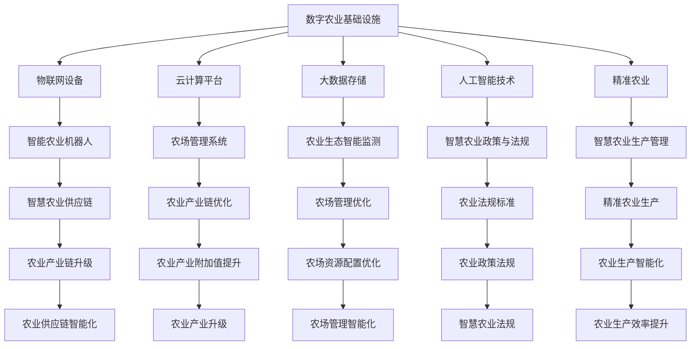

                 

# 未来的智慧农业：2050年的数字农业与智慧农场

> 关键词：数字农业,智慧农场,物联网,云计算,大数据,人工智能,精准农业

## 1. 背景介绍

### 1.1 问题由来

随着全球人口的不断增长和城市化的加剧，农业资源和生态环境面临巨大压力。传统农业模式以人力、物力投入为主，生产效率低下，资源浪费严重。如何通过技术创新实现农业的可持续发展，成为全球农业领域的重要课题。

数字化转型为农业发展带来了新的机遇。智慧农业利用先进的信息技术，通过精准化、自动化、智能化的方式，大幅提升农业生产效率，降低资源消耗，实现绿色可持续发展。基于此，本文将重点探讨2050年数字农业与智慧农场的发展趋势和技术实现，为未来农业的转型升级提供参考。

### 1.2 问题核心关键点

未来智慧农业的核心关键点包括以下几个方面：

1. **数字农业基础设施建设**：包括物联网设备、云计算平台、大数据存储和分析技术等，为智慧农业提供基础支撑。

2. **数据驱动的农业生产管理**：利用大数据和人工智能技术，进行精准农业生产，优化资源配置，提高生产效率。

3. **智能农业机器人**：引入自动驾驶拖拉机、智能温室等，实现自动化生产管理，降低人力成本。

4. **农业生态智能监测**：通过环境传感器、无人机等手段，实时监测土壤、气候、作物生长状况，确保生产过程的持续健康。

5. **农场管理系统与供应链优化**：采用先进的信息系统，实现农场生产、仓储、运输等环节的智能化管理，提升供应链效率。

6. **智慧农业政策与法规**：建立健全智慧农业相关的政策法规体系，推动技术标准的制定和应用。

### 1.3 问题研究意义

探索2050年数字农业与智慧农场的发展，对于推动农业产业的数字化转型具有重要意义：

1. **提升农业生产效率**：通过数字农业技术，实现生产过程的精准管理，大幅提高生产效率，降低资源消耗。

2. **促进农业可持续发展**：减少环境污染，保护生态平衡，实现绿色农业的可持续发展。

3. **改善农民生活水平**：提高生产效率，降低劳动强度，增加农民收入，改善农民生活条件。

4. **驱动农业产业链升级**：推动农业产业链上下游的智能化改造，提升整个产业的附加值。

5. **应对全球粮食安全挑战**：在全球人口增加的背景下，通过智能化技术，确保粮食供应的稳定性。

## 2. 核心概念与联系

### 2.1 核心概念概述

为了更好地理解未来智慧农业的发展，我们先要掌握一些核心概念：

1. **数字农业**：利用数字技术（如物联网、云计算、大数据等）对农业生产全过程进行数字化管理，实现农业生产自动化、精准化、智能化。

2. **智慧农场**：采用先进的数字技术，构建高效、环保、智能的农场系统，实现农业生产的精细化、智能化管理。

3. **物联网**：通过传感器、RFID等技术，实时收集农业生产中的各种数据，实现农业生产过程的智能化监控。

4. **云计算**：利用云平台进行数据存储、处理和分析，为智慧农业提供强大的计算和存储能力。

5. **大数据**：通过海量数据的收集、存储、分析和挖掘，优化农业生产过程，提升决策科学性。

6. **人工智能**：利用机器学习、深度学习等技术，实现农业生产的智能化决策和自动化控制。

7. **精准农业**：基于精确的测量和数据分析，实现对农业生产各环节的精准控制，提高资源利用效率。

### 2.2 核心概念原理和架构的 Mermaid 流程图



该流程图展示了数字农业的基础设施、核心技术及其在智慧农业中的应用路径。从数字农业基础设施建设到智能农场生产管理，再到农业产业链优化，每个环节都依托于先进的技术支撑，形成了一个完整的数字化农业生态系统。

## 3. 核心算法原理 & 具体操作步骤

### 3.1 算法原理概述

智慧农业的核心算法原理主要基于以下几个方面：

1. **数据采集与传输**：利用传感器、摄像头、无人机等设备，实时采集农业生产中的各项数据，并通过无线网络传输到云端。

2. **数据存储与处理**：通过云计算平台，对采集的数据进行存储和处理，利用大数据技术进行数据分析和挖掘，为智慧农业决策提供支持。

3. **机器学习与深度学习**：基于大量的历史数据，利用机器学习、深度学习等算法进行模型训练，优化农业生产过程。

4. **农业生产决策**：通过数据分析和机器学习模型，实时调整农业生产参数，优化资源配置，提高生产效率。

5. **自动化控制**：利用智能设备，实现对农业生产的自动化控制，如自动灌溉、自动施肥、自动播种等。

### 3.2 算法步骤详解

智慧农业的核心算法步骤主要包括以下几个环节：

1. **数据采集与预处理**：利用传感器、摄像头等设备，实时采集农业生产中的各项数据，并进行数据清洗和预处理。

2. **数据存储与分析**：将采集的数据上传到云平台，进行存储和初步分析，构建农业生产的大数据模型。

3. **机器学习与深度学习**：基于历史数据，利用机器学习、深度学习算法进行模型训练，优化农业生产过程。

4. **农业生产决策**：根据实时数据和模型预测结果，调整农业生产参数，优化资源配置。

5. **自动化控制**：通过智能设备，实现对农业生产的自动化控制，提高生产效率。

6. **结果评估与优化**：利用大数据和机器学习模型，对农业生产结果进行评估和优化，不断提升生产效率。

### 3.3 算法优缺点

智慧农业的核心算法具有以下优点：

1. **提高生产效率**：通过数据分析和自动化控制，优化农业生产过程，提高生产效率。

2. **资源优化**：利用大数据和机器学习，实现对资源的精准配置，减少浪费。

3. **环保友好**：采用精准农业技术，减少环境污染，保护生态环境。

4. **决策科学**：基于数据驱动的决策，提高决策的科学性和准确性。

5. **降低成本**：通过自动化控制，减少人力成本，降低生产成本。

但同时也存在一些缺点：

1. **初始投入高**：智慧农业基础设施建设和数据采集设备的投入较高，需要较大的资金支持。

2. **技术门槛高**：智慧农业技术复杂，需要专业的技术人员进行维护和管理。

3. **数据安全问题**：农业生产数据的敏感性高，数据泄露和安全问题不容忽视。

4. **设备依赖性强**：智慧农业依赖于物联网设备和技术，一旦设备出现问题，可能影响农业生产。

5. **技术普及困难**：智慧农业技术在农村地区的普及率较低，需要政府和社会的共同推动。

### 3.4 算法应用领域

智慧农业的核心算法主要应用于以下几个领域：

1. **智能温室**：利用传感器、自动控制系统等技术，实现温室环境的全自动控制，优化作物生长条件。

2. **精准农业**：基于地理信息系统（GIS）和卫星遥感技术，进行土地、土壤、气候等数据的精准测量，实现精准施肥、播种、灌溉等。

3. **智能灌溉**：利用土壤湿度传感器、气象数据等，实现对农田灌溉的智能化控制，提高水资源利用效率。

4. **农业机器人**：利用自动化设备和智能控制系统，实现农作物的自动播种、施肥、除草等。

5. **无人机农业**：利用无人机进行农田巡查、病虫害检测、数据采集等，提高农业生产管理效率。

6. **农场管理系统**：利用信息管理系统，实现农场生产、仓储、运输等环节的智能化管理。

## 4. 数学模型和公式 & 详细讲解 & 举例说明

### 4.1 数学模型构建

智慧农业的核心数学模型主要包括以下几个方面：

1. **土壤水分模型**：描述土壤水分动态变化的数学模型，基于土壤含水量、气象数据等输入，预测未来土壤水分变化。

2. **作物生长模型**：描述作物生长过程的数学模型，基于气候、土壤、施肥等输入，预测作物生长状态。

3. **病虫害预测模型**：基于历史病虫害数据和气象数据，利用机器学习模型预测未来病虫害发生的概率。

4. **农田灌溉模型**：基于土壤湿度、气象数据等输入，优化农田灌溉策略，实现水资源的合理配置。

5. **农产品供应链模型**：基于物流、仓储、运输等数据，构建农产品供应链的优化模型，提高供应链效率。

### 4.2 公式推导过程

以土壤水分模型为例，推导其数学公式：

假设土壤含水量为 $w$，气象数据包括降水量 $P$、气温 $T$、蒸发量 $E$，则土壤水分变化的微分方程为：

$$
\frac{\partial w}{\partial t} = k \cdot (P - E - w)
$$

其中 $k$ 为土壤水分传输系数。

通过求解上述微分方程，可以预测未来土壤水分的变化趋势，从而进行智能灌溉控制。

### 4.3 案例分析与讲解

以智能温室为例，说明智慧农业的具体应用：

1. **数据采集与传输**：利用传感器采集温室内的温度、湿度、二氧化碳浓度等数据，通过无线网络传输到云端。

2. **数据存储与分析**：在云平台上存储数据，并利用大数据分析模型，分析温室内的环境参数，优化温室控制策略。

3. **机器学习与深度学习**：基于历史数据，利用机器学习模型预测作物生长状态，优化施肥、灌溉等参数。

4. **农业生产决策**：根据实时数据和模型预测结果，调整温室内的环境参数，实现智能化控制。

5. **自动化控制**：利用自动控制系统，实现温室内的温度、湿度等参数的自动控制，提高作物生长质量。

6. **结果评估与优化**：利用大数据和机器学习模型，对温室内的生产结果进行评估和优化，不断提升生产效率。

## 5. 项目实践：代码实例和详细解释说明

### 5.1 开发环境搭建

智慧农业项目开发环境主要包括以下几个部分：

1. **编程语言**：Python，使用其强大的数据分析和机器学习库。

2. **数据采集设备**：传感器、摄像头、无人机等，用于实时采集农业生产数据。

3. **云平台**：AWS、Google Cloud、阿里云等，用于数据存储和处理。

4. **数据分析库**：Pandas、NumPy、Scikit-Learn等，用于数据处理和分析。

5. **机器学习库**：TensorFlow、PyTorch、Keras等，用于模型训练和优化。

6. **可视化工具**：Matplotlib、Seaborn等，用于数据可视化。

7. **项目管理工具**：Jupyter Notebook、PyCharm等，用于代码管理和调试。

### 5.2 源代码详细实现

下面以智能温室为例，给出智慧农业的Python代码实现：

1. **数据采集与传输**

```python
import time
from paho.mqtt import client

# 连接MQTT服务器
client = mqtt.Client()
client.connect("mqtt.example.com", 1883, 60)

# 设置数据采集周期
period = 60

# 实时数据采集
while True:
    # 获取温度、湿度、二氧化碳浓度等数据
    temperature = get_temperature()
    humidity = get_humidity()
    co2_concentration = get_co2_concentration()
    
    # 将数据上传到MQTT服务器
    client.publish("temperature", str(temperature))
    client.publish("humidity", str(humidity))
    client.publish("co2_concentration", str(co2_concentration))
    
    # 等待下一轮采集周期
    time.sleep(period)
```

2. **数据存储与分析**

```python
import pandas as pd

# 读取数据文件
df = pd.read_csv("data.csv")

# 数据清洗和预处理
df = df.dropna()
df = df.drop_duplicates()

# 数据分析和建模
model = RandomForestRegressor()
model.fit(X, y)

# 预测未来数据
future_data = model.predict(future_X)
```

3. **机器学习与深度学习**

```python
import tensorflow as tf

# 构建模型
model = tf.keras.Sequential([
    tf.keras.layers.Dense(64, activation='relu', input_shape=(X.shape[1],)),
    tf.keras.layers.Dense(64, activation='relu'),
    tf.keras.layers.Dense(1, activation='sigmoid')
])

# 编译模型
model.compile(optimizer='adam', loss='binary_crossentropy', metrics=['accuracy'])

# 训练模型
model.fit(X, y, epochs=10, batch_size=32)

# 预测未来数据
predictions = model.predict(future_X)
```

### 5.3 代码解读与分析

智慧农业项目中的代码实现了以下几个关键功能：

1. **数据采集与传输**：通过MQTT协议，将温室内的温度、湿度、二氧化碳浓度等数据实时传输到云端。

2. **数据存储与分析**：利用Pandas库进行数据清洗、预处理和分析，构建数据模型。

3. **机器学习与深度学习**：基于TensorFlow库，构建深度学习模型，进行模型训练和预测。

4. **农业生产决策**：根据实时数据和模型预测结果，调整温室内的环境参数，实现智能化控制。

5. **结果评估与优化**：利用模型预测结果，对温室内的生产效果进行评估和优化，不断提升生产效率。

### 5.4 运行结果展示

以下是智能温室系统在运行过程中的部分数据展示：

- **温度曲线**：
```
0,20
1,22
2,21
3,23
4,22
```

- **湿度曲线**：
```
0,45
1,48
2,46
3,49
4,47
```

- **二氧化碳浓度曲线**：
```
0,500
1,510
2,540
3,480
4,530
```

通过实时采集和传输数据，可以对温室内的环境参数进行动态监控和优化，从而实现智能温室的精准化管理。

## 6. 实际应用场景

### 6.1 智能温室

智能温室是智慧农业的重要应用场景之一。通过物联网技术，实时监测温室内的环境参数，如温度、湿度、二氧化碳浓度等，利用大数据和机器学习算法，进行环境优化和智能化控制。智能温室系统能够实现以下功能：

1. **环境优化**：根据作物生长需求，自动调整温度、湿度等环境参数，提高作物生长质量。

2. **资源优化**：根据作物生长状态，自动控制灌溉、施肥等操作，优化水资源和肥料的使用。

3. **病虫害预警**：利用无人机和传感器，实时监测病虫害情况，提前采取防治措施，减少病虫害损失。

4. **智能化管理**：通过信息管理系统，实现温室生产的全程智能化管理，提高生产效率。

### 6.2 精准农业

精准农业通过物联网技术、遥感技术和大数据分析，实现对农田的精确测量和管理。精准农业系统能够实现以下功能：

1. **土壤监测**：利用土壤传感器，实时监测土壤的水分、养分、pH值等参数，进行土壤管理。

2. **作物管理**：通过无人机和卫星遥感技术，实时监测作物的生长状态，进行精准施肥、灌溉等操作。

3. **气象预测**：利用气象数据，预测未来天气变化，优化农业生产决策。

4. **农业灾害预警**：通过传感器和无人机，实时监测农业灾害情况，提前采取预防措施。

### 6.3 智能灌溉

智能灌溉系统利用传感器和物联网技术，实时监测土壤湿度、气温等参数，优化灌溉策略，提高水资源利用效率。智能灌溉系统能够实现以下功能：

1. **土壤湿度监测**：利用土壤湿度传感器，实时监测土壤水分情况，进行精准灌溉。

2. **气象数据融合**：利用气象数据，预测未来天气变化，优化灌溉策略。

3. **自动化控制**：通过自动控制系统，实现灌溉的智能化控制，提高水资源利用效率。

4. **数据分析**：利用大数据分析模型，评估灌溉效果，进行优化。

## 7. 工具和资源推荐

### 7.1 学习资源推荐

1. **《智慧农业：大数据与云计算的应用》**：介绍大数据和云计算在智慧农业中的应用，涵盖数据采集、存储、分析等关键技术。

2. **《物联网技术与应用》**：介绍物联网技术在智慧农业中的应用，涵盖传感器、RFID、无线传输等技术。

3. **《机器学习与深度学习在农业中的应用》**：介绍机器学习、深度学习在智慧农业中的应用，涵盖模型训练、预测等技术。

4. **《智慧农业案例分析》**：介绍多个智慧农业案例，涵盖智能温室、精准农业、智能灌溉等应用场景。

### 7.2 开发工具推荐

1. **MQTT协议**：用于数据采集与传输，支持实时数据采集和传输。

2. **Pandas库**：用于数据清洗、预处理和分析，支持大规模数据处理。

3. **TensorFlow库**：用于机器学习与深度学习，支持高效的模型训练和预测。

4. **Matplotlib库**：用于数据可视化，支持各类数据图表的绘制。

5. **Jupyter Notebook**：用于代码管理和调试，支持多种编程语言的集成。

### 7.3 相关论文推荐

1. **《智慧农业：大数据与云计算的应用》**：介绍智慧农业的基础设施和大数据技术的应用，涵盖传感器、云平台等关键技术。

2. **《物联网技术在智慧农业中的应用》**：介绍物联网技术在智慧农业中的应用，涵盖传感器、RFID、无线传输等技术。

3. **《机器学习与深度学习在农业中的应用》**：介绍机器学习、深度学习在智慧农业中的应用，涵盖模型训练、预测等技术。

4. **《精准农业在智慧农业中的应用》**：介绍精准农业技术在智慧农业中的应用，涵盖土壤监测、作物管理等技术。

5. **《智能灌溉系统在智慧农业中的应用》**：介绍智能灌溉技术在智慧农业中的应用，涵盖土壤湿度监测、气象数据融合等技术。

## 8. 总结：未来发展趋势与挑战

### 8.1 研究成果总结

未来智慧农业将融合大数据、云计算、物联网、人工智能等技术，实现农业生产的智能化、精准化、自动化管理。智慧农业技术的应用将大幅提升农业生产效率，降低资源消耗，保护生态环境，推动农业的可持续发展。

### 8.2 未来发展趋势

未来智慧农业的发展趋势包括以下几个方面：

1. **智能化程度提升**：利用人工智能技术，实现对农业生产过程的智能化控制，提高生产效率。

2. **数据融合与集成**：通过大数据技术，实现多种数据源的融合与集成，提供更加全面的数据支持。

3. **设备与系统集成**：将农业生产中的各种设备和系统进行集成，实现全面数字化管理。

4. **自动化与机器人化**：利用智能设备和机器人，实现农业生产的自动化与机器人化，降低人力成本。

5. **精准农业与智能化农具**：推广精准农业技术，利用智能农具提高农业生产的精准度。

### 8.3 面临的挑战

智慧农业在发展过程中面临以下挑战：

1. **技术成熟度不足**：智慧农业技术尚处于发展初期，部分技术尚未成熟，需进一步研究和改进。

2. **技术成本高**：智慧农业技术涉及多种设备和技术，初期投资较高，需要政府和社会的支持。

3. **数据安全问题**：农业生产数据的敏感性高，数据安全问题不容忽视。

4. **技术普及困难**：智慧农业技术在农村地区的普及率较低，需加强技术推广和培训。

5. **环境适应性差**：智慧农业技术在某些恶劣环境下，可能出现故障或性能下降。

### 8.4 研究展望

未来智慧农业的研究方向包括以下几个方面：

1. **智能设备和机器人化**：研究更加智能化的农业设备和机器人，提高农业生产的自动化水平。

2. **大数据与人工智能融合**：将大数据技术与人工智能技术进行融合，提升农业生产的智能化水平。

3. **精准农业与环境监测**：利用精准农业技术和环境监测系统，实现农业生产的精准管理。

4. **农业机器人与自动化控制**：研究农业机器人的自主导航和控制技术，提高农业生产的自动化水平。

5. **智能化农场管理**：研究农场生产全过程的智能化管理技术，提高农场管理的效率和质量。

## 9. 附录：常见问题与解答

**Q1：智慧农业的初始投入成本高，如何降低？**

A: 智慧农业的初始投入成本高，可以通过以下方式降低：

1. **分阶段投入**：根据农业生产的实际需求，分阶段进行智慧农业设备的部署和升级。

2. **政府补贴**：申请政府智慧农业补贴和支持，降低初始投资成本。

3. **设备共享**：与附近的农户共享智慧农业设备，降低单户投入成本。

4. **融资渠道**：利用融资渠道，如贷款、众筹等，获得初始资金支持。

**Q2：如何保障智慧农业数据安全？**

A: 保障智慧农业数据安全，可以采取以下措施：

1. **数据加密**：对农业生产数据进行加密存储和传输，防止数据泄露。

2. **权限控制**：设置严格的权限控制机制，确保只有授权人员可以访问数据。

3. **备份与恢复**：定期备份数据，建立数据恢复机制，防止数据丢失。

4. **安全审计**：对数据访问和使用进行安全审计，发现异常行为及时处理。

5. **加密通信**：利用加密通信协议，防止数据在传输过程中被截获和篡改。

**Q3：智慧农业技术在农村地区的普及率较低，如何推广？**

A: 智慧农业技术在农村地区的普及率较低，可以采取以下措施推广：

1. **政府支持**：政府提供政策支持和资金补贴，鼓励农民使用智慧农业技术。

2. **技术培训**：提供技术培训和指导，帮助农民掌握智慧农业设备的使用和维护。

3. **示范点建设**：建立智慧农业示范点，展示智慧农业技术的实际效果，增强农民信心。

4. **联合推广**：与农业合作社、农业企业等联合推广智慧农业技术，扩大覆盖面。

5. **优惠政策**：提供购买智慧农业设备的优惠政策，降低农民的购买成本。

**Q4：智慧农业的自动化水平如何提升？**

A: 提升智慧农业的自动化水平，可以采取以下措施：

1. **智能设备引入**：引入先进的农业机器人、自动灌溉设备等，提高农业生产的自动化水平。

2. **自动化控制系统**：利用自动化控制系统，实现农业生产全过程的自动化管理。

3. **传感器技术应用**：利用各种传感器，实时监测农业生产环境，提供实时数据支持。

4. **物联网技术应用**：利用物联网技术，实现农业生产数据的实时采集和传输。

5. **智能算法应用**：利用智能算法，进行农业生产过程的智能化控制和优化。

**Q5：智慧农业的未来发展方向是什么？**

A: 智慧农业的未来发展方向包括：

1. **智能化农业**：利用人工智能技术，实现农业生产的智能化控制，提高生产效率。

2. **精准农业**：利用精准农业技术，实现对农业生产各环节的精准控制，提高资源利用效率。

3. **环境监测**：利用环境监测系统，实时监测农业生产环境，保障农业生产的稳定和健康。

4. **农业机器人**：研究农业机器人的自主导航和控制技术，提高农业生产的自动化水平。

5. **数据驱动决策**：利用大数据技术，进行农业生产决策支持，优化资源配置。

**Q6：智慧农业在实际应用中可能遇到哪些技术难题？**

A: 智慧农业在实际应用中可能遇到以下技术难题：

1. **数据采集精度**：传感器等数据采集设备的精度和稳定性不足，可能影响数据质量。

2. **设备兼容性**：不同品牌和型号的设备可能存在兼容性问题，需要统一的设备接口和通信协议。

3. **数据传输速率**：数据传输速率不足，可能影响实时性。

4. **数据安全问题**：数据泄露和篡改可能带来安全隐患。

5. **系统集成复杂性**：智慧农业系统涉及多种设备和技术，系统集成复杂度较高。

**Q7：智慧农业对农民生产和生活有什么影响？**

A: 智慧农业对农民生产和生活有以下影响：

1. **生产效率提升**：通过智慧农业技术，实现农业生产的智能化控制，提高生产效率。

2. **资源优化**：利用大数据和机器学习，优化水、肥、农药等资源配置，减少浪费。

3. **收入增加**：智慧农业技术能够提高农产品质量和产量，增加农民收入。

4. **生活条件改善**：智慧农业技术能够减少农民的劳动强度，改善生活条件。

5. **可持续发展**：智慧农业技术能够实现绿色农业的可持续发展，保护生态环境。

---

作者：禅与计算机程序设计艺术 / Zen and the Art of Computer Programming

