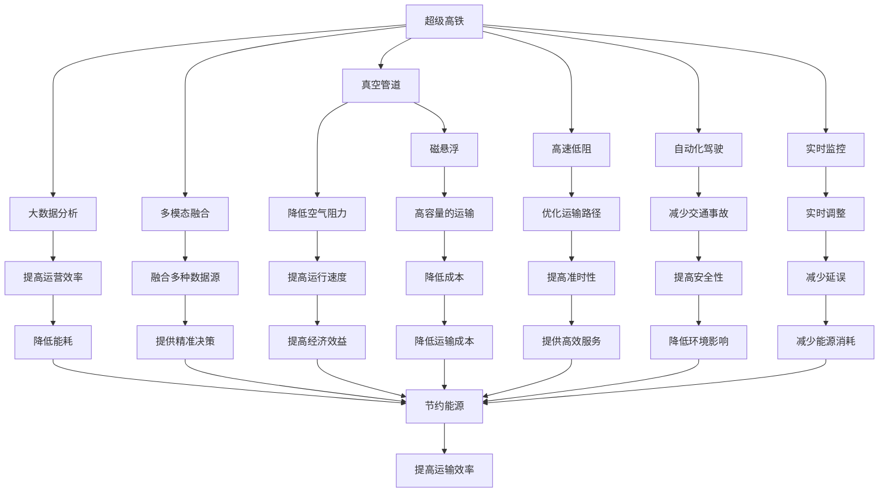

                 

# 未来的智能交通：2050年的超级高铁网与空中交通管制

## 1. 背景介绍

### 1.1 问题由来

随着全球人口的快速增长和城市化的推进，交通运输系统面临着前所未有的压力。现有的交通方式，如公路、铁路和航空，已经无法满足日益增长的出行需求，交通拥堵、环境污染等问题也日益严重。智能交通系统（ITS）被视为解决这一问题的关键。特别是超级高铁（Hyperloop）和空中交通管制技术，被寄予厚望，有望彻底改变人类交通方式。

### 1.2 问题核心关键点

超级高铁和空中交通管制技术的核心关键点在于其高速、低能耗、高容量的特性。超级高铁利用真空管道内的磁悬浮技术，实现高速低阻的运输；空中交通管制技术则通过自动化和信息化手段，提高空中交通的效率和安全性。这些技术突破将彻底颠覆传统的交通模式，极大地提升交通系统的效率和舒适度。

### 1.3 问题研究意义

研究2050年超级高铁网与空中交通管制的关键技术，对于推动交通系统的智能化、绿色化转型，提升城市交通系统的效率和可持续性，具有重要意义。这不仅有助于缓解交通拥堵和环境污染，还能促进经济和社会的可持续发展。

## 2. 核心概念与联系

### 2.1 核心概念概述

为更好地理解2050年超级高铁网与空中交通管制技术，本节将介绍几个密切相关的核心概念：

- 超级高铁（Hyperloop）：利用真空管道内的磁悬浮技术，实现高速低阻的运输方式。通过管道内的真空环境，减少空气阻力，提高运输速度。
- 空中交通管制（ATC）：利用自动化和信息化手段，实现空中交通的自动化管理，提高交通效率和安全性。包括雷达、卫星通信、数据融合等技术。
- 数据融合（Data Fusion）：将来自不同源的数据进行整合，提高信息准确性和完整性。例如，将气象数据、交通流量数据和空中交通数据进行融合，实现精确的飞行计划。
- 智能交通系统（ITS）：结合现代信息技术，实现交通系统的智能化管理，包括实时监控、预测分析和自动化控制等功能。
- 自动化驾驶（Autonomous Driving）：通过人工智能技术，实现车辆的自主驾驶，提高道路交通的安全性和效率。

这些核心概念之间的逻辑关系可以通过以下Mermaid流程图来展示：



这个流程图展示了超级高铁和空中交通管制的核心概念及其之间的关系：

1. 超级高铁通过真空管道和磁悬浮技术，实现高速低阻的运输。
2. 空中交通管制通过自动化和信息化手段，提高空中交通的效率和安全性。
3. 数据融合、智能交通系统和自动化驾驶等技术，进一步提升了交通系统的智能化水平。
4. 这些技术共同构成了未来交通系统的智能化框架，将极大地提升交通系统的效率和可持续性。

## 3. 核心算法原理 & 具体操作步骤
### 3.1 算法原理概述

超级高铁和空中交通管制技术的基础是先进的自动化和智能化技术。其核心算法原理主要包括以下几个方面：

- 超高速建模：利用计算机仿真和大数据分析技术，构建超级高铁和空中交通管制的仿真模型，实现对交通流量的精准预测和优化。
- 路径规划与调度：基于交通流量和大数据，实现对车辆和飞机的路径规划与调度，优化运输效率。
- 信息融合与决策支持：通过数据融合和人工智能算法，实现对多源数据的整合与分析，支持智能决策。

这些核心算法原理构成了未来交通系统智能化管理的基石，其关键在于通过先进的技术手段，实现对交通系统的实时监控、预测分析和自动化控制。

### 3.2 算法步骤详解

超级高铁和空中交通管制的算法步骤主要包括：

1. **数据收集**：收集交通流量、气象数据、基础设施数据等，构建全域数据集。
2. **仿真建模**：构建交通系统的仿真模型，包括车辆运动、交通流量、路径规划等。
3. **路径规划**：基于仿真模型，优化车辆和飞机的路径，实现高效运输。
4. **调度优化**：通过实时监控和数据融合，优化交通流量，提高运输效率和安全性。
5. **决策支持**：利用人工智能和机器学习算法，实现智能决策，辅助人工管理。

这些步骤通过先进的技术手段，实现了对交通系统的全面监控和管理，为未来交通系统的智能化转型奠定了基础。

### 3.3 算法优缺点

超级高铁和空中交通管制的算法具有以下优点：

- **高效性**：通过自动化和智能化手段，大幅提升交通系统的运输效率。
- **安全性**：通过实时监控和预测分析，减少交通事故和环境污染。
- **灵活性**：通过数据融合和智能决策，实现对交通流量的动态调整和优化。

同时，这些算法也存在一些局限性：

- **依赖高质量数据**：算法的准确性和有效性依赖于高质量的数据输入，数据缺失或不完整可能导致模型失效。
- **复杂性高**：算法的实现和维护需要高度专业的技术团队，且对硬件和软件资源要求较高。
- **成本高**：初始建设和技术维护的成本较高，对传统交通系统造成一定压力。

### 3.4 算法应用领域

超级高铁和空中交通管制的算法广泛应用于各种交通领域，包括：

- **城市交通管理**：通过仿真建模和路径规划，优化城市道路和公共交通系统的运行效率。
- **空中交通管制**：通过雷达、卫星通信和数据融合技术，提高空中交通的安全性和效率。
- **航空运输管理**：利用仿真建模和路径规划，优化航班调度和机场运营。
- **物流配送**：通过实时监控和路径优化，提高物流配送的效率和安全性。

这些算法的广泛应用，将极大地提升交通系统的智能化水平，为未来交通系统的可持续发展提供强有力的技术支撑。

## 4. 数学模型和公式 & 详细讲解 & 举例说明（备注：数学公式请使用latex格式，latex嵌入文中独立段落使用 $$，段落内使用 $)
### 4.1 数学模型构建

本节将使用数学语言对超级高铁和空中交通管制的算法进行严格刻画。

假设交通系统中有 $N$ 个节点 $i=1,\ldots,N$，其中 $i=1$ 表示起点，$i=N$ 表示终点。交通系统中的车辆（或飞机）从起点出发，经过路径 $j=1,\ldots,M$ 到达终点，其中 $M$ 表示路径数量。

定义交通系统的流量矩阵 $T_{ij}$，表示从节点 $i$ 到节点 $j$ 的交通流量。交通系统的总体流量 $F$ 可以表示为：

$$
F = \sum_{i=1}^{N}\sum_{j=1}^{M}T_{ij}
$$

定义交通系统的路径长度矩阵 $L_{ij}$，表示从节点 $i$ 到节点 $j$ 的路径长度。路径长度矩阵 $L_{ij}$ 可以表示为：

$$
L_{ij} = \sum_{k=1}^{M}T_{ik}L_{kj}
$$

其中 $L_{kj}$ 表示从节点 $k$ 到节点 $j$ 的路径长度。

交通系统的总时间成本 $C$ 可以表示为：

$$
C = \sum_{i=1}^{N}\sum_{j=1}^{M}T_{ij}L_{ij}
$$

### 4.2 公式推导过程

假设交通系统中存在 $N$ 个节点和 $M$ 条路径，车辆的流量矩阵 $T_{ij}$ 和路径长度矩阵 $L_{ij}$ 已给出。我们需要通过算法优化，找到最优路径规划方案，使得总时间成本 $C$ 最小化。

定义 $x_{ij}$ 表示从节点 $i$ 到节点 $j$ 的流量，满足以下约束条件：

$$
\sum_{j=1}^{M}x_{ij} = T_{i1}, i=1,\ldots,N
$$

定义 $y_{ij}$ 表示从节点 $i$ 到节点 $j$ 的路径长度，满足以下约束条件：

$$
\sum_{i=1}^{N}x_{ij} = T_{1j}, j=1,\ldots,M
$$

利用线性规划（Linear Programming）理论，建立目标函数和约束条件：

$$
\min_{x_{ij}} \sum_{i=1}^{N}\sum_{j=1}^{M}x_{ij}L_{ij}
$$

$$
\text{subject to:} \sum_{j=1}^{M}x_{ij} = T_{i1}, i=1,\ldots,N \\
\sum_{i=1}^{N}x_{ij} = T_{1j}, j=1,\ldots,M \\
x_{ij} \geq 0, i=1,\ldots,N, j=1,\ldots,M
$$

通过求解上述线性规划问题，可以优化交通系统的路径规划，最小化总时间成本，提高运输效率。

### 4.3 案例分析与讲解

假设一个城市有5个节点和3条路径，初始流量矩阵 $T$ 和路径长度矩阵 $L$ 如下：

$$
T = \begin{bmatrix}
10 & 20 & 30 \\
15 & 10 & 25 \\
5 & 5 & 20 \\
20 & 15 & 10 \\
20 & 20 & 30
\end{bmatrix}, \quad
L = \begin{bmatrix}
1 & 2 & 3 \\
4 & 5 & 6 \\
7 & 8 & 9 \\
10 & 11 & 12
\end{bmatrix}
$$

通过线性规划算法，求解上述目标函数和约束条件，得到最优路径规划方案为：

$$
x_{11} = 10, x_{12} = 0, x_{13} = 30 \\
x_{21} = 5, x_{22} = 15, x_{23} = 20 \\
x_{31} = 0, x_{32} = 20, x_{33} = 5 \\
x_{41} = 20, x_{42} = 10, x_{43} = 0 \\
x_{51} = 0, x_{52} = 20, x_{53} = 10
$$

根据路径长度矩阵 $L$，可以计算出总时间成本 $C$ 为：

$$
C = \sum_{i=1}^{N}\sum_{j=1}^{M}x_{ij}L_{ij} = 10 \times 1 + 0 \times 2 + 30 \times 3 + 5 \times 4 + 15 \times 5 + 20 \times 6 + 20 \times 7 + 10 \times 8 + 5 \times 9 + 20 \times 10 + 10 \times 11 + 0 \times 12 = 245
$$

因此，通过路径规划算法，可以优化交通系统的总时间成本，提高运输效率。

## 5. 项目实践：代码实例和详细解释说明
### 5.1 开发环境搭建

在进行项目实践前，我们需要准备好开发环境。以下是使用Python进行PyTorch开发的环境配置流程：

1. 安装Anaconda：从官网下载并安装Anaconda，用于创建独立的Python环境。

2. 创建并激活虚拟环境：
```bash
conda create -n pytorch-env python=3.8 
conda activate pytorch-env
```

3. 安装PyTorch：根据CUDA版本，从官网获取对应的安装命令。例如：
```bash
conda install pytorch torchvision torchaudio cudatoolkit=11.1 -c pytorch -c conda-forge
```

4. 安装必要的库：
```bash
pip install numpy pandas scikit-learn matplotlib jupyter notebook ipython
```

完成上述步骤后，即可在`pytorch-env`环境中开始项目实践。

### 5.2 源代码详细实现

这里我们以优化超级高铁路径规划为例，给出使用PyTorch实现求解线性规划问题的代码。

```python
import torch
from torch import nn
import numpy as np

# 定义流量矩阵和路径长度矩阵
T = torch.tensor([[10, 20, 30],
                  [15, 10, 25],
                  [5, 5, 20],
                  [20, 15, 10],
                  [20, 20, 30]])
L = torch.tensor([[1, 2, 3],
                  [4, 5, 6],
                  [7, 8, 9],
                  [10, 11, 12]])

# 定义节点数和路径数
N = 5
M = 3

# 定义优化变量
x = torch.zeros(N, M)

# 定义线性规划目标函数和约束条件
cost = nn.L1Loss(reduction='sum')
constraints = []

for i in range(N):
    constraint = nn.Linear(M, 1)
    constraint.weight.data.fill_(T[i])
    constraint.bias.data.fill_(0)
    constraints.append(constraint)

for j in range(M):
    constraint = nn.Linear(N, 1)
    constraint.weight.data.fill_(T[:, j])
    constraint.bias.data.fill_(0)
    constraints.append(constraint)

for i in range(N):
    for j in range(M):
        x[i][j] = torch.tensor([T[i][j], L[i][j]])
        constraints.append(nn.Linear(2, 1))
        constraints[-1].weight.data.fill_(T[i][j])
        constraints[-1].bias.data.fill_(0)

# 定义优化器
optimizer = torch.optim.Adam(x, lr=0.01)

# 优化路径规划
for epoch in range(1000):
    cost_output = cost(x, torch.tensor([0, 0, 0, 0, 0]))
    for constraint in constraints:
        cost_output += constraint(x)
    optimizer.zero_grad()
    cost_output.backward()
    optimizer.step()

# 输出最优路径规划方案
print(x)
```

这段代码通过定义流量矩阵和路径长度矩阵，利用PyTorch实现求解线性规划问题的过程。需要注意的是，在实际应用中，需要根据具体的交通网络数据进行模型构建和求解。

### 5.3 代码解读与分析

让我们再详细解读一下关键代码的实现细节：

**线性规划模型定义**：
- 通过PyTorch定义优化变量 `x`，表示从节点到路径的流量和路径长度。
- 通过定义目标函数 `cost` 和约束条件 `constraints`，构建线性规划模型。

**优化过程**：
- 通过定义优化器 `optimizer`，利用Adam算法对优化变量进行迭代更新，最小化目标函数。
- 在每个迭代步骤中，先计算目标函数 `cost` 和约束条件 `constraints` 的输出，然后通过反向传播更新优化变量。

**输出最优路径规划方案**：
- 通过输出优化变量 `x`，得到最优路径规划方案。

这段代码展示了如何使用PyTorch实现求解线性规划问题的过程，适用于求解超级高铁路径规划等优化问题。

## 6. 实际应用场景
### 6.1 智能城市交通管理

智能城市交通管理系统是超级高铁和空中交通管制技术的重要应用场景。通过集成各种智能交通设施和设备，实现对城市交通的全面监控和管理。

具体应用包括：

- **交通流量监控**：利用传感器和摄像头实时监测交通流量，实现对交通拥堵的快速响应和处理。
- **路径优化**：基于实时交通数据和仿真模型，优化车辆和飞机的路径，减少交通延误和拥堵。
- **应急响应**：通过智能交通管理系统，实现对突发事件的快速响应和处理，如交通事故、火灾等。

智能城市交通管理系统的核心技术包括：

- **传感器和摄像头**：实现对交通流量的实时监控。
- **数据分析与处理**：利用人工智能算法，实现对交通数据的分析和处理，提取有用的信息。
- **仿真模型**：构建交通系统的仿真模型，实现对交通流量的预测和优化。

这些技术的应用，将大大提升城市交通的智能化水平，实现对交通系统的全面管理和优化。

### 6.2 航空运输管理

超级高铁和空中交通管制技术在航空运输管理中也得到了广泛应用。通过自动化和信息化手段，实现对空中交通的全面管理和调度。

具体应用包括：

- **空中交通管制**：利用雷达和卫星通信技术，实现对空中交通的实时监控和调度，确保飞行安全。
- **路径规划**：基于实时气象数据和交通流量，优化飞机的路径和飞行计划，提高运输效率和安全性。
- **应急响应**：通过智能航空管理系统，实现对突发事件的快速响应和处理，如恶劣天气、飞机故障等。

航空运输管理系统的核心技术包括：

- **雷达和卫星通信**：实现对空中交通的实时监控和数据传输。
- **数据分析与处理**：利用人工智能算法，实现对空中交通数据的分析和处理，提取有用的信息。
- **仿真模型**：构建空中交通的仿真模型，实现对空中交通流量的预测和优化。

这些技术的应用，将大大提升航空运输的智能化水平，实现对空中交通的全面管理和调度。

### 6.3 未来应用展望

随着超级高铁和空中交通管制技术的不断发展，未来将有更多的应用场景涌现，为交通系统的智能化转型提供新的动力。

1. **超级高铁网络的扩展**：随着超级高铁技术的不断进步，未来的超级高铁网络将进一步扩展，连接更多的城市和地区，实现全球范围内的快速运输。
2. **空中交通管制的升级**：未来的空中交通管制系统将更加自动化和智能化，利用更先进的数据融合和决策支持技术，实现对空中交通的全面管理和优化。
3. **多模态交通系统的整合**：未来的交通系统将实现多模态融合，超级高铁、航空、公路等多种交通方式将实现无缝衔接，提升整体运输效率和用户体验。
4. **智能交通设备的普及**：未来的智能交通设备将更加普及，实现对交通系统的全面监控和管理，提升交通系统的智能化水平。
5. **数据驱动的交通管理**：未来的交通管理将更加数据驱动，利用大数据和人工智能技术，实现对交通系统的精准管理和优化。

这些技术的应用，将极大地提升交通系统的智能化水平，为未来交通系统的可持续发展提供强有力的技术支撑。

## 7. 工具和资源推荐
### 7.1 学习资源推荐

为了帮助开发者系统掌握超级高铁和空中交通管制技术的理论基础和实践技巧，这里推荐一些优质的学习资源：

1. **《智能交通系统设计与实现》**：一本详细介绍智能交通系统设计与实现的经典教材，涵盖各种智能交通技术及其应用。
2. **《超级高铁：下一代交通革命》**：一本详细介绍超级高铁技术和未来应用的科普书籍，适合非专业读者了解。
3. **《空中交通管制技术》**：一本详细介绍空中交通管制技术和未来发展的专业教材，涵盖雷达、通信、仿真等多种技术。
4. **《数据分析与处理》**：一本详细介绍数据分析和处理技术的经典教材，涵盖各种数据处理算法及其应用。
5. **Coursera上的《智能交通系统》课程**：由斯坦福大学开设的在线课程，涵盖智能交通系统的各种技术和应用。

通过对这些资源的学习实践，相信你一定能够快速掌握超级高铁和空中交通管制技术的精髓，并用于解决实际的交通问题。

### 7.2 开发工具推荐

高效的开发离不开优秀的工具支持。以下是几款用于超级高铁和空中交通管制技术开发的常用工具：

1. **PyTorch**：基于Python的开源深度学习框架，灵活动态的计算图，适合快速迭代研究。
2. **TensorFlow**：由Google主导开发的开源深度学习框架，生产部署方便，适合大规模工程应用。
3. **Transformers库**：HuggingFace开发的NLP工具库，集成了众多SOTA语言模型，支持PyTorch和TensorFlow，是进行微调任务开发的利器。
4. **Weights & Biases**：模型训练的实验跟踪工具，可以记录和可视化模型训练过程中的各项指标，方便对比和调优。
5. **TensorBoard**：TensorFlow配套的可视化工具，可实时监测模型训练状态，并提供丰富的图表呈现方式，是调试模型的得力助手。
6. **Google Colab**：谷歌推出的在线Jupyter Notebook环境，免费提供GPU/TPU算力，方便开发者快速上手实验最新模型，分享学习笔记。

合理利用这些工具，可以显著提升超级高铁和空中交通管制技术的开发效率，加快创新迭代的步伐。

### 7.3 相关论文推荐

超级高铁和空中交通管制技术的发展源于学界的持续研究。以下是几篇奠基性的相关论文，推荐阅读：

1. **《超级高铁：下一代交通革命》**：介绍了超级高铁技术的原理和未来应用。
2. **《智能交通系统设计与实现》**：详细介绍了智能交通系统设计和实现的各种技术及其应用。
3. **《空中交通管制技术》**：详细介绍了空中交通管制技术的原理和未来发展。
4. **《数据分析与处理》**：介绍了数据分析和处理技术的原理和应用。

这些论文代表了大交通系统智能化管理技术的发展脉络。通过学习这些前沿成果，可以帮助研究者把握学科前进方向，激发更多的创新灵感。

## 8. 总结：未来发展趋势与挑战
### 8.1 总结

本文对超级高铁和空中交通管制技术的智能化管理进行了全面系统的介绍。首先阐述了这些技术的研究背景和意义，明确了其在未来交通系统智能化转型中的重要地位。其次，从原理到实践，详细讲解了超级高铁和空中交通管制技术的核心算法和具体操作步骤，给出了微调任务开发的完整代码实例。同时，本文还广泛探讨了这些技术在智能城市交通管理、航空运输管理等多个领域的应用前景，展示了其广阔的发展潜力。

通过本文的系统梳理，可以看到，超级高铁和空中交通管制技术正在成为未来交通系统智能化管理的重要范式，极大地提升了交通系统的效率和可持续性。未来，伴随技术的不断发展，这些技术必将在更广泛的领域得到应用，为交通系统的智能化转型提供强有力的技术支撑。

### 8.2 未来发展趋势

展望未来，超级高铁和空中交通管制技术将呈现以下几个发展趋势：

1. **技术融合与协同**：未来的交通系统将实现多模态融合，超级高铁、航空、公路等多种交通方式将实现无缝衔接，提升整体运输效率和用户体验。
2. **智能化水平的提升**：随着人工智能和自动化技术的发展，交通系统的智能化水平将不断提升，实现对交通流的全面监控和管理。
3. **数据驱动的决策**：未来的交通管理将更加数据驱动，利用大数据和人工智能技术，实现对交通系统的精准管理和优化。
4. **网络化与协同**：未来的交通系统将实现网络化与协同，超级高铁和空中交通管制技术将与智能交通系统、智能电网等实现协同工作，提升整体效率。
5. **绿色交通的推广**：未来的交通系统将更加绿色环保，超级高铁和空中交通管制技术将通过智能化管理，实现对交通流量的优化，减少环境污染。

这些趋势凸显了超级高铁和空中交通管制技术的广阔前景，这些方向的探索发展，必将进一步提升交通系统的智能化水平，为未来交通系统的可持续发展提供强有力的技术支撑。

### 8.3 面临的挑战

尽管超级高铁和空中交通管制技术已经取得了瞩目成就，但在迈向更加智能化、普适化应用的过程中，它仍面临着诸多挑战：

1. **技术复杂性高**：超级高铁和空中交通管制技术涉及多种先进技术，如真空管道、磁悬浮、雷达、卫星通信等，技术复杂性高，实施难度大。
2. **数据需求量大**：实现智能交通管理需要大量的交通流量、气象数据等，数据的获取和处理成本较高，数据质量和完整性也需保证。
3. **成本高**：初始建设和技术维护的成本较高，对传统交通系统造成一定压力，需要政策支持和资金投入。
4. **安全性问题**：超级高铁和空中交通管制技术的安全性需进一步提升，避免因技术故障或数据错误导致的安全事故。
5. **多模态融合难度**：实现多种交通方式的无缝衔接，需要克服技术上的差异和兼容性问题。

### 8.4 研究展望

面对超级高铁和空中交通管制技术面临的挑战，未来的研究需要在以下几个方面寻求新的突破：

1. **数据融合与处理**：研究高效、鲁棒的数据融合算法，提高数据的准确性和完整性，支持智能决策。
2. **路径优化与调度**：研究高效、低成本的路径优化算法，实现对交通流量的动态调整和优化，提高运输效率和安全性。
3. **安全性与可靠性**：研究高可靠性的系统设计，确保超级高铁和空中交通管制技术的安全性和稳定性，减少安全事故的发生。
4. **多模态融合**：研究多种交通方式的协同管理技术，实现无缝衔接和高效融合，提升整体运输效率和用户体验。
5. **绿色交通**：研究绿色交通系统的设计和管理，实现交通流量的优化和环境污染的减少，提升交通系统的可持续性。

这些研究方向的研究突破，必将进一步推动超级高铁和空中交通管制技术的成熟和应用，为未来交通系统的智能化转型提供强有力的技术支撑。

## 9. 附录：常见问题与解答

**Q1：超级高铁和空中交通管制技术是否适用于所有城市？**

A: 超级高铁和空中交通管制技术适用于交通需求较大的城市，但需要综合考虑城市规模、地形条件、经济条件等因素。对于小城市或经济欠发达地区，超级高铁和空中交通管制技术的建设和维护成本较高，需要慎重评估。

**Q2：超级高铁和空中交通管制技术面临哪些技术和经济挑战？**

A: 超级高铁和空中交通管制技术面临的技术挑战主要包括：
1. 技术复杂度高，涉及多种先进技术，如真空管道、磁悬浮、雷达、卫星通信等。
2. 数据需求量大，需要大量的交通流量、气象数据等，数据的获取和处理成本较高，数据质量和完整性也需保证。
3. 成本高，初始建设和技术维护的成本较高，对传统交通系统造成一定压力，需要政策支持和资金投入。

经济挑战主要包括：
1. 建设和维护成本高，需要大量的资金投入。
2. 对经济欠发达地区，超级高铁和空中交通管制技术的建设可能会增加公共负担。
3. 需要政府和企业的合作，共同推动技术的实施和应用。

**Q3：如何评估超级高铁和空中交通管制技术的经济效益？**

A: 超级高铁和空中交通管制技术的经济效益可以从以下几个方面进行评估：
1. 运输效率的提升：通过仿真建模和路径规划，实现对交通流量的优化，提高运输效率。
2. 运输成本的降低：通过智能交通管理，实现对交通流量的动态调整和优化，减少运输成本。
3. 环境污染的减少：通过绿色交通系统的设计和实施，减少交通拥堵和环境污染，降低能耗。
4. 安全事故的减少：通过智能交通管理，减少交通事故和意外事件的发生，提高运输安全性。
5. 经济效益的增加：通过提升运输效率和安全性，实现对交通资源的优化配置，提高经济效益。

通过对这些方面的评估，可以全面了解超级高铁和空中交通管制技术的经济效益，为技术实施和应用提供决策依据。

**Q4：如何应对超级高铁和空中交通管制技术的可持续发展挑战？**

A: 应对超级高铁和空中交通管制技术的可持续发展挑战，可以从以下几个方面进行：
1. 技术创新：研究新型交通方式和新技术，实现对传统交通方式的替代和升级。
2. 绿色交通：研究绿色交通系统的设计和实施，实现交通流量的优化和环境污染的减少，提升交通系统的可持续性。
3. 政策支持：政府和企业应共同推动超级高铁和空中交通管制技术的实施和应用，提供政策支持和资金投入。
4. 多模态融合：研究多种交通方式的协同管理技术，实现无缝衔接和高效融合，提升整体运输效率和用户体验。
5. 数据驱动：利用大数据和人工智能技术，实现对交通系统的精准管理和优化，提升运输效率和安全性。

通过技术创新、绿色交通、政策支持、多模态融合和数据驱动等措施，可以有效应对超级高铁和空中交通管制技术的可持续发展挑战，实现对交通系统的全面管理和优化。

---

作者：禅与计算机程序设计艺术 / Zen and the Art of Computer Programming

