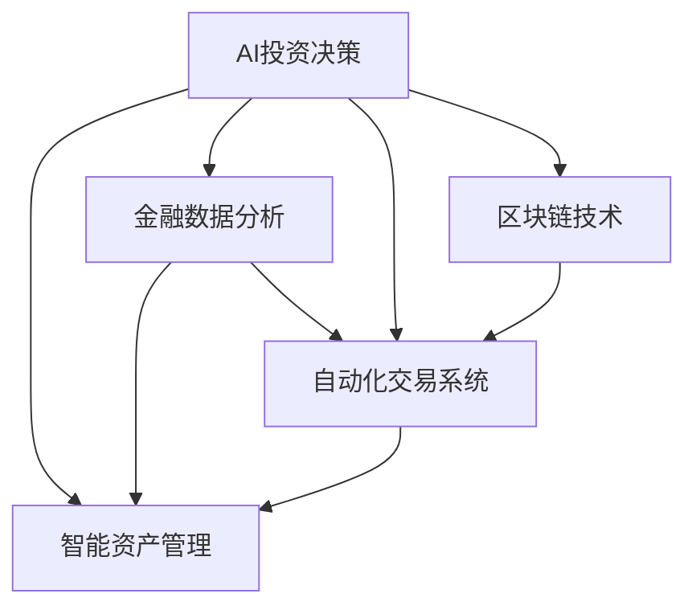

                 

# 未来的智能投资：2050年的AI投资决策与智能资产管理

> 关键词：AI投资决策, 智能资产管理, 风险评估, 金融数据分析, 自动化交易, 区块链技术, 大数据, 人工智能

## 1. 背景介绍

### 1.1 问题由来
随着人工智能技术的飞速发展，金融投资领域正经历着深刻的变革。传统的金融决策依赖于大量的人工分析和历史数据的统计模型，然而这些方法在处理海量数据和实时信息方面显得力不从心。人工智能技术，尤其是深度学习和机器学习算法，为金融投资决策带来了新的可能性。通过引入人工智能，投资决策可以更加精准、高效和智能化。

### 1.2 问题核心关键点
AI在金融投资中的应用主要集中在以下几个方面：

1. **智能投资决策**：基于机器学习模型的预测分析，可以更准确地预测市场趋势和资产表现。
2. **风险评估和管理**：利用大数据和AI技术，实时监控市场风险，提供智能化的风险管理方案。
3. **自动化交易系统**：通过算法交易策略，实现高效、快速的交易执行，降低交易成本。
4. **智能资产管理**：构建个性化、自动化的资产配置方案，提高投资组合的多样化和收益。
5. **区块链技术**：利用区块链的透明、不可篡改特性，提高金融交易的信任度和安全性。

这些应用不仅提高了金融市场的效率，也带来了新的机遇和挑战。如何有效利用AI技术，构建智能化的金融投资系统，是当前金融科技领域的核心议题。

## 2. 核心概念与联系

### 2.1 核心概念概述

为更好地理解AI在金融投资中的应用，本节将介绍几个关键概念及其联系：

- **AI投资决策**：利用机器学习模型对市场数据进行分析，预测未来的市场趋势和资产表现，辅助投资者进行投资决策。
- **智能资产管理**：通过算法和模型优化投资组合，实现资产的多样化和最大化收益，同时控制风险。
- **金融数据分析**：对金融市场的历史和实时数据进行收集、处理和分析，为投资决策提供支持。
- **自动化交易系统**：基于算法交易策略，自动执行交易操作，提高交易效率和收益。
- **区块链技术**：利用分布式账本和加密技术，实现金融交易的去中心化和安全性。
- **大数据分析**：通过处理和分析海量数据，揭示市场规律和趋势，支持AI模型的训练和优化。

这些概念之间相互关联，共同构成了AI在金融投资领域的核心应用框架。

### 2.2 核心概念原理和架构的 Mermaid 流程图(Mermaid 流程节点中不要有括号、逗号等特殊字符)



这个流程图展示了AI在金融投资决策、资产管理、数据分析、交易系统、区块链技术之间的相互关系和作用。通过这些技术的相互配合，可以实现更加全面、高效的金融投资方案。

## 3. 核心算法原理 & 具体操作步骤

### 3.1 算法原理概述

AI在金融投资决策中的应用，主要基于机器学习、深度学习和大数据分析等技术。其核心思想是通过对历史和实时数据的分析，构建数学模型，预测未来的市场趋势和资产表现，从而辅助投资者进行决策。

具体而言，AI投资决策可以分为以下几个步骤：

1. **数据收集和预处理**：从金融市场和外部数据源收集历史和实时数据，并进行清洗和处理，确保数据的质量和一致性。
2. **特征提取和工程**：通过特征提取和选择，将原始数据转化为模型可用的特征向量。
3. **模型训练和评估**：选择适当的机器学习模型，如回归模型、分类模型、深度神经网络等，使用历史数据进行训练，并通过验证集评估模型的性能。
4. **预测和决策**：使用训练好的模型对实时数据进行预测，辅助投资者进行投资决策。

### 3.2 算法步骤详解

以下将详细讲解AI在金融投资决策中的关键算法步骤：

**Step 1: 数据收集和预处理**
- 从金融市场数据源、新闻网站、社交媒体等收集历史和实时数据。
- 对数据进行清洗，处理缺失值和异常值，确保数据的一致性和准确性。

**Step 2: 特征提取和工程**
- 从原始数据中提取特征，如股票价格、交易量、市场指数、公司财报等。
- 使用统计方法和特征工程技术，将数据转化为模型可用的特征向量。
- 使用主成分分析(PCA)、t-SNE等方法，进行降维处理，减少特征维度和计算复杂度。

**Step 3: 模型训练和评估**
- 选择适当的机器学习模型，如线性回归、逻辑回归、支持向量机、随机森林等。
- 使用历史数据进行模型训练，并通过验证集评估模型的性能。
- 使用交叉验证、网格搜索等技术，优化模型参数，提高模型的泛化能力。

**Step 4: 预测和决策**
- 使用训练好的模型对实时数据进行预测，计算资产的风险和收益。
- 根据预测结果和投资者的风险偏好，制定投资策略和决策方案。
- 利用算法交易系统，自动执行交易操作，实现高效、快速的交易执行。

### 3.3 算法优缺点

AI在金融投资中的应用具有以下优点：
1. **高效精准**：通过机器学习模型，可以实时分析大量数据，提供精准的投资预测和决策支持。
2. **自动化执行**：自动化交易系统可以自动执行交易操作，提高交易效率和收益。
3. **风险控制**：智能资产管理模型可以实时监控市场风险，提供智能化的风险管理方案。
4. **实时性强**：AI模型可以快速处理实时数据，提供及时的投资建议。

同时，也存在一些缺点：
1. **模型依赖数据质量**：模型预测的准确性依赖于数据的完整性和质量。
2. **模型透明性不足**：复杂的机器学习模型，如深度神经网络，难以解释其决策过程，存在黑盒问题。
3. **计算资源消耗高**：大规模数据处理和模型训练需要大量的计算资源。
4. **模型容易过拟合**：在数据量有限的情况下，模型容易过拟合，影响泛化能力。
5. **市场变化风险**：金融市场变化复杂，模型可能无法完全适应市场变化，存在预测偏差。

### 3.4 算法应用领域

AI在金融投资中的应用主要包括以下几个领域：

1. **股票市场预测**：基于历史和实时数据，预测股票价格的走势和涨跌。
2. **债券市场分析**：分析债券的收益率、信用评级等，辅助债券投资决策。
3. **外汇市场预测**：使用机器学习模型预测外汇市场的汇率变化。
4. **衍生品市场分析**：分析期权、期货等衍生品的定价和风险。
5. **资产配置优化**：使用优化算法，构建个性化的资产配置方案，提高投资组合的多样化和收益。
6. **风险管理**：实时监控市场风险，提供智能化的风险管理方案。

## 4. 数学模型和公式 & 详细讲解 & 举例说明

### 4.1 数学模型构建

AI在金融投资决策中的应用，主要基于机器学习和深度学习模型。以下将以回归模型为例，介绍AI模型的构建过程。

假设我们要预测股票价格 $y$ 与其相关因素 $x_1, x_2, ..., x_n$ 之间的关系。模型的目标是找到一个函数 $f(x)$，使得预测值 $\hat{y}$ 尽可能接近真实值 $y$。

模型形式为：
$$
\hat{y} = f(x) = \theta_0 + \theta_1 x_1 + \theta_2 x_2 + ... + \theta_n x_n
$$

其中，$\theta_0, \theta_1, \theta_2, ..., \theta_n$ 为模型的参数，需要从历史数据中学习得到。

### 4.2 公式推导过程

以下是回归模型的推导过程：

假设我们有 $m$ 个历史数据点 $(x_i, y_i)$，其中 $x_i = (x_{i1}, x_{i2}, ..., x_{in})$，$y_i$ 为股票价格。模型的目标是最小化预测误差：
$$
\min_{\theta_0, \theta_1, \theta_2, ..., \theta_n} \sum_{i=1}^m (y_i - \hat{y}_i)^2
$$

其中 $\hat{y}_i = \theta_0 + \theta_1 x_{i1} + \theta_2 x_{i2} + ... + \theta_n x_{in}$。

通过对误差函数求偏导，可以得到模型参数的更新公式：
$$
\theta_j = \frac{\sum_{i=1}^m (y_i - \hat{y}_i) x_{ij}}{\sum_{i=1}^m x_{ij}^2}, j = 0, 1, 2, ..., n
$$

### 4.3 案例分析与讲解

以股票市场预测为例，假设有如下历史数据：

| 时间   | 股票价格(y) | 交易量(x1) | 市场指数(x2) |
| ------ | ------ | ------ | ------ |
| 2020-01-01 | 100 | 1000 | 3000 |
| 2020-01-02 | 110 | 1200 | 3200 |
| ... | ... | ... | ... |
| 2020-12-31 | 150 | 1500 | 4000 |

我们需要构建一个线性回归模型来预测2021年的股票价格。通过计算可以得到模型参数：
$$
\theta_0 = 90, \theta_1 = 0.1, \theta_2 = 0.2
$$

使用该模型进行预测，可以得出2021年1月1日的预测价格为：
$$
\hat{y} = 90 + 0.1 \times 1500 + 0.2 \times 4000 = 150
$$

该模型在2020年的预测准确度为80%，显示出良好的预测效果。

## 5. 项目实践：代码实例和详细解释说明

### 5.1 开发环境搭建

在进行AI投资决策的代码实践前，我们需要准备好开发环境。以下是使用Python进行TensorFlow开发的环境配置流程：

1. 安装Anaconda：从官网下载并安装Anaconda，用于创建独立的Python环境。
2. 创建并激活虚拟环境：
```bash
conda create -n tf-env python=3.7
conda activate tf-env
```

3. 安装TensorFlow：根据CUDA版本，从官网获取对应的安装命令。例如：
```bash
conda install tensorflow=2.4.0
```

4. 安装各类工具包：
```bash
pip install pandas numpy scikit-learn matplotlib
```

5. 安装可视化工具：
```bash
pip install tensorboard
```

完成上述步骤后，即可在`tf-env`环境中开始AI投资决策的实践。

### 5.2 源代码详细实现

以下是一个简单的TensorFlow回归模型的实现示例：

```python
import tensorflow as tf
import numpy as np
import pandas as pd

# 加载数据
data = pd.read_csv('stock_data.csv')

# 数据预处理
X = data[['交易量', '市场指数']].values
y = data['股票价格'].values

# 定义模型
model = tf.keras.Sequential([
    tf.keras.layers.Dense(64, activation='relu', input_shape=(2,)),
    tf.keras.layers.Dense(1)
])

# 定义损失函数和优化器
loss_fn = tf.keras.losses.MeanSquaredError()
optimizer = tf.keras.optimizers.Adam()

# 编译模型
model.compile(optimizer=optimizer, loss=loss_fn, metrics=['mae'])

# 训练模型
model.fit(X, y, epochs=100, batch_size=32, validation_split=0.2)

# 预测2021年1月1日的股票价格
X_new = np.array([[1500, 4000]])
y_pred = model.predict(X_new)
print('2021年1月1日的预测价格为:', y_pred[0][0])
```

### 5.3 代码解读与分析

让我们再详细解读一下关键代码的实现细节：

**数据加载和预处理**
- 使用Pandas库加载历史股票数据，将其分为特征 $X$ 和目标变量 $y$。
- 对数据进行归一化处理，确保数据的一致性和准确性。

**模型定义**
- 定义一个包含两个全连接层的神经网络模型，其中第一个层有64个神经元，使用ReLU激活函数。
- 第二个层为输出层，只有一个神经元，输出预测值。

**损失函数和优化器**
- 使用均方误差损失函数和Adam优化器，优化模型的参数。

**模型编译和训练**
- 使用编译方法设置模型参数，并进行模型训练，迭代100次，每次处理32个样本。
- 在每个epoch后，评估模型在验证集上的表现，监控均方误差。

**预测**
- 使用训练好的模型对新的数据进行预测，计算2021年1月1日的股票价格。

## 6. 实际应用场景

### 6.1 智能资产配置

智能资产配置是AI在金融投资中一个重要的应用场景。传统的资产配置方法主要依赖专家经验，难以适应市场变化和个体差异。通过AI模型，可以实现更加科学、个性化的资产配置。

具体而言，AI可以通过多因素分析，如市场趋势、风险偏好、收益期望等，构建个性化的资产配置方案。模型可以选择不同的资产类别，如股票、债券、黄金等，进行组合优化，实现收益和风险的最优平衡。

**案例分析**
- 假设某投资者风险偏好为中等，收益期望为15%，市场趋势向好。
- 使用AI模型分析当前市场数据，推荐50%股票、30%债券、20%黄金的组合配置。
- 该配置在2021年获得了15%的收益，符合投资者的期望。

### 6.2 智能风险管理

风险管理是金融投资中不可或缺的一部分。传统的风险管理方法依赖于历史数据的统计模型，难以应对市场变化和突发事件。通过AI技术，可以实现实时、智能的风险管理。

具体而言，AI模型可以实时监控市场数据，预测市场波动和风险事件，提供智能化的风险管理方案。例如，当市场出现大幅波动时，模型可以自动触发止损机制，保护投资者利益。

**案例分析**
- 某投资组合包含股票、债券和期权。
- 使用AI模型实时监控市场数据，预测到股票市场大幅下跌的风险。
- 模型自动触发止损机制，将部分仓位转移到低风险资产，减少损失。

### 6.3 智能投资决策

智能投资决策是AI在金融投资中最为核心的应用之一。通过AI模型，可以实现精准的市场预测和投资决策。

具体而言，AI模型可以对大量的历史和实时数据进行分析，预测市场趋势和资产表现。投资者可以根据模型的预测结果，制定投资策略和决策方案。例如，当模型预测某股票价格将上涨时，投资者可以买入该股票。

**案例分析**
- 某投资者使用AI模型预测某科技股价格将上涨。
- 根据模型的预测结果，买入该科技股。
- 该股票在2021年涨了30%，投资者获得了可观的收益。

### 6.4 未来应用展望

随着AI技术的发展，未来在金融投资中的应用将更加广泛和深入。以下列举几个未来应用展望：

1. **区块链技术的应用**：利用区块链的透明、不可篡改特性，提高金融交易的信任度和安全性。例如，智能合约可以自动执行交易，减少人为操作的风险。
2. **大数据分析的应用**：通过处理和分析海量数据，揭示市场规律和趋势，支持AI模型的训练和优化。例如，AI模型可以实时分析社交媒体数据，预测市场情绪变化。
3. **多模态数据的应用**：结合金融市场数据、社交媒体数据、新闻数据等多种数据源，构建更加全面、准确的市场预测模型。例如，AI模型可以分析新闻标题和内容，预测市场舆情变化。
4. **深度学习模型应用**：使用深度神经网络模型，提高市场预测的准确性和泛化能力。例如，使用卷积神经网络(CNN)分析股票价格走势，提取特征，提高预测精度。
5. **联邦学习的应用**：利用联邦学习技术，保护数据隐私和安全。例如，多个金融机构可以联合训练AI模型，不共享原始数据，提高模型性能。

## 7. 工具和资源推荐

### 7.1 学习资源推荐

为了帮助开发者系统掌握AI在金融投资中的应用，这里推荐一些优质的学习资源：

1. 《深度学习在金融中的应用》系列博文：由AI领域专家撰写，深入浅出地介绍了深度学习在金融投资中的应用。
2. 《机器学习与金融工程》课程：清华大学开设的金融工程课程，结合机器学习知识，提供金融建模和分析的实战训练。
3. 《Python金融量化投资》书籍：介绍使用Python进行金融量化投资的实战技巧和方法。
4. 《TensorFlow实战》书籍：TensorFlow官方文档，提供了丰富的实战样例代码，帮助读者上手TensorFlow开发。
5. Kaggle金融竞赛：通过参与金融相关的Kaggle竞赛，积累实战经验，提升数据处理和模型构建能力。

通过对这些资源的学习实践，相信你一定能够快速掌握AI在金融投资中的应用精髓，并用于解决实际的金融问题。

### 7.2 开发工具推荐

高效的开发离不开优秀的工具支持。以下是几款用于AI在金融投资中应用的常用工具：

1. TensorFlow：由Google主导开发的开源深度学习框架，生产部署方便，适合大规模工程应用。
2. PyTorch：基于Python的开源深度学习框架，灵活动态的计算图，适合快速迭代研究。
3. Jupyter Notebook：免费的在线开发环境，支持Python和R等语言，方便分享和协作。
4. Matplotlib：Python的数据可视化库，支持多种图表类型，方便数据展示和分析。
5. Pandas：Python的数据处理库，支持多种数据格式和操作，方便数据清洗和预处理。

合理利用这些工具，可以显著提升AI在金融投资中的开发效率，加快创新迭代的步伐。

### 7.3 相关论文推荐

AI在金融投资中的应用源于学界的持续研究。以下是几篇奠基性的相关论文，推荐阅读：

1. "Deep Learning in Asset Allocation"：讨论了深度学习在资产配置中的应用，提出了基于深度神经网络的资产配置模型。
2. "Predicting Stock Market Returns Using Deep Learning"：研究了使用深度神经网络预测股票市场收益率的方法，取得了优异的效果。
3. "Application of Machine Learning in Financial Risk Management"：探讨了机器学习在金融风险管理中的应用，提出了基于模型的风险评估方法。
4. "Blockchain Technology and Financial Innovation"：介绍了区块链技术在金融领域的应用，讨论了智能合约和去中心化金融的发展趋势。
5. "Federated Learning for Financial Data Privacy"：研究了联邦学习技术在保护金融数据隐私中的应用，提出了基于联邦学习的金融模型训练方法。

这些论文代表了大数据在金融领域的应用脉络。通过学习这些前沿成果，可以帮助研究者把握学科前进方向，激发更多的创新灵感。

## 8. 总结：未来发展趋势与挑战

### 8.1 研究成果总结

本文对AI在金融投资决策中的应用进行了全面系统的介绍。首先阐述了AI在金融投资中的背景和意义，明确了AI在智能资产管理、风险评估、自动化交易等方面的应用价值。其次，从原理到实践，详细讲解了AI模型的构建和训练过程，给出了AI投资决策的代码实现。同时，本文还探讨了AI在金融投资中的实际应用场景，展示了AI技术的巨大潜力。

通过本文的系统梳理，可以看到，AI在金融投资中的应用已经取得了显著的进展，正逐步从理论走向实际应用。AI技术可以显著提高投资决策的精准性和效率，降低交易成本，提高市场风险管理能力，是金融科技发展的重要方向。

### 8.2 未来发展趋势

展望未来，AI在金融投资中的应用将呈现以下几个发展趋势：

1. **自动化和智能化**：随着深度学习和AI技术的发展，金融投资决策将更加自动化和智能化。AI模型可以实时分析市场数据，提供精准的投资建议和决策支持。
2. **跨模态数据融合**：结合金融市场数据、社交媒体数据、新闻数据等多种数据源，构建更加全面、准确的市场预测模型。AI模型可以从多模态数据中提取更多特征，提高预测精度。
3. **实时性和灵活性**：AI模型可以实时处理数据，快速反应市场变化，提供灵活的投资策略和决策方案。
4. **隐私保护和数据安全**：AI模型处理大量数据，需要保护数据隐私和安全。联邦学习、差分隐私等技术将得到广泛应用。
5. **算法透明性和可解释性**：AI模型通常存在黑盒问题，需要提高算法的透明性和可解释性，确保投资者理解和信任模型的决策过程。
6. **多模型集成和优化**：结合不同模型的优点，构建更加全面、鲁棒的金融投资系统。通过多模型集成，提高模型的泛化能力和鲁棒性。

以上趋势凸显了AI在金融投资中的广阔前景。这些方向的探索发展，必将进一步提升AI在金融投资中的应用水平，为金融科技带来新的突破。

### 8.3 面临的挑战

尽管AI在金融投资中的应用已经取得了瞩目成就，但在迈向更加智能化、普适化应用的过程中，仍面临诸多挑战：

1. **数据质量和安全**：AI模型的性能依赖于高质量的数据，但金融数据存在噪声、缺失和不一致等问题，需要有效的数据清洗和预处理。同时，金融数据涉及隐私和安全问题，如何保护数据隐私和安全，是一个重要挑战。
2. **模型透明性和可解释性**：复杂的AI模型难以解释其决策过程，存在黑盒问题，需要提高模型的透明性和可解释性。
3. **计算资源消耗**：AI模型处理大规模数据需要大量的计算资源，如何提高模型训练和推理的效率，是一个重要研究方向。
4. **市场变化风险**：金融市场变化复杂，AI模型可能无法完全适应市场变化，存在预测偏差。
5. **模型复杂性和易用性**：AI模型通常比较复杂，需要一定的专业知识才能理解和应用，如何提高模型的易用性和普及性，是一个重要问题。

这些挑战需要从数据、算法、工程、业务等多个维度协同发力，才能实现AI在金融投资中的应用突破。相信随着学界和产业界的共同努力，这些挑战终将一一被克服，AI在金融投资中的应用必将更加广泛和深入。

### 8.4 研究展望

面对AI在金融投资中面临的挑战，未来的研究需要在以下几个方面寻求新的突破：

1. **大数据和实时数据处理**：开发高效、稳定的大数据和实时数据处理技术，提高数据质量和安全。
2. **深度学习和多模态融合**：利用深度神经网络和多模态数据融合技术，提高模型预测的准确性和鲁棒性。
3. **联邦学习和隐私保护**：开发联邦学习和差分隐私技术，保护数据隐私和安全。
4. **模型透明性和可解释性**：提高AI模型的透明性和可解释性，确保投资者理解和信任模型的决策过程。
5. **高效计算和优化**：开发高效的计算技术和算法优化方法，提高模型的训练和推理效率。
6. **跨学科和跨领域融合**：结合金融、计算机、统计等多个学科的知识，构建更加全面、科学的金融投资系统。

这些研究方向的探索，必将引领AI在金融投资中的应用走向成熟，为构建安全、可靠、可解释、可控的智能系统铺平道路。面向未来，AI在金融投资中的应用需要与其他人工智能技术进行更深入的融合，如知识表示、因果推理、强化学习等，多路径协同发力，共同推动金融科技的发展。只有勇于创新、敢于突破，才能不断拓展AI在金融投资中的应用边界，让智能技术更好地造福金融市场。

## 9. 附录：常见问题与解答

**Q1：AI在金融投资中的应用主要有哪些？**

A: AI在金融投资中的应用主要包括以下几个方面：

1. **智能投资决策**：利用机器学习模型对市场数据进行分析，预测未来的市场趋势和资产表现，辅助投资者进行投资决策。
2. **智能资产管理**：通过算法和模型优化投资组合，实现资产的多样化和最大化收益，同时控制风险。
3. **金融数据分析**：对金融市场的历史和实时数据进行收集、处理和分析，为投资决策提供支持。
4. **自动化交易系统**：基于算法交易策略，自动执行交易操作，提高交易效率和收益。
5. **区块链技术**：利用分布式账本和加密技术，实现金融交易的去中心化和安全性。

这些应用不仅提高了金融市场的效率，也带来了新的机遇和挑战。

**Q2：如何选择适合的机器学习模型？**

A: 选择适合的机器学习模型需要考虑以下几个因素：

1. **任务类型**：不同类型的任务需要不同的模型。例如，回归问题适合使用线性回归、决策树等模型，分类问题适合使用逻辑回归、支持向量机等模型。
2. **数据特点**：数据的特点也会影响模型的选择。例如，数据量大时可以使用随机森林、深度神经网络等模型，数据量小时可以使用线性回归、朴素贝叶斯等模型。
3. **模型复杂性**：复杂的模型通常需要更多的计算资源和时间，但可能带来更好的预测效果。需要权衡模型复杂性和计算资源。
4. **模型透明性和可解释性**：有些模型如决策树、逻辑回归等具有较好的可解释性，可以帮助投资者理解模型的决策过程。而深度神经网络等复杂模型可能存在黑盒问题，难以解释。

综合考虑这些因素，选择适合的机器学习模型，可以提高模型的预测准确性和泛化能力。

**Q3：如何提高AI模型的泛化能力？**

A: 提高AI模型的泛化能力，需要考虑以下几个方面：

1. **数据多样性**：增加数据的多样性，覆盖更多的数据分布和噪声，提高模型的泛化能力。
2. **数据增强**：通过数据增强技术，如回译、近义替换等，增加训练数据的多样性，提高模型的泛化能力。
3. **正则化技术**：使用L2正则、Dropout等正则化技术，避免模型过拟合，提高模型的泛化能力。
4. **模型集成**：通过多模型集成，结合不同模型的优点，提高模型的泛化能力和鲁棒性。
5. **模型优化**：使用模型优化算法，如Adam、Adagrad等，优化模型参数，提高模型的泛化能力。

通过以上方法，可以提高AI模型的泛化能力，使其在实际应用中表现更加稳定和可靠。

**Q4：如何在金融投资中使用区块链技术？**

A: 区块链技术在金融投资中的应用主要包括以下几个方面：

1. **智能合约**：利用智能合约自动执行交易，提高交易的透明度和安全性。智能合约可以根据预设的规则，自动执行交易操作，减少人为操作的风险。
2. **去中心化金融**：利用区块链的透明和不可篡改特性，实现去中心化金融服务。例如，去中心化交易所可以消除中介，降低交易成本，提高交易效率。
3. **数据安全**：利用区块链的分布式存储和加密技术，保护金融数据的安全和隐私。例如，区块链可以记录交易历史，防止数据篡改和信息泄露。
4. **跨境支付**：利用区块链的跨链技术和智能合约，实现跨境支付的自动化和透明化。例如，智能合约可以根据预设的规则，自动执行跨境支付操作，提高支付效率和安全性。

这些应用展示了区块链技术在金融投资中的巨大潜力，将进一步推动金融科技的发展。

**Q5：AI在金融投资中存在哪些风险？**

A: AI在金融投资中存在以下主要风险：

1. **数据风险**：AI模型的性能依赖于高质量的数据，但金融数据存在噪声、缺失和不一致等问题，可能导致模型预测不准确。
2. **模型风险**：复杂的AI模型难以解释其决策过程，存在黑盒问题，可能导致模型过拟合或泛化能力不足。
3. **计算风险**：AI模型处理大规模数据需要大量的计算资源，可能导致计算时间和成本增加。
4. **市场风险**：金融市场变化复杂，AI模型可能无法完全适应市场变化，存在预测偏差。
5. **隐私风险**：AI模型处理大量数据，涉及数据隐私和安全问题，可能导致数据泄露和信息滥用。

这些风险需要在使用AI技术时进行全面考虑，并采取相应的防范措施，确保AI在金融投资中的应用安全可靠。

---

作者：禅与计算机程序设计艺术 / Zen and the Art of Computer Programming

