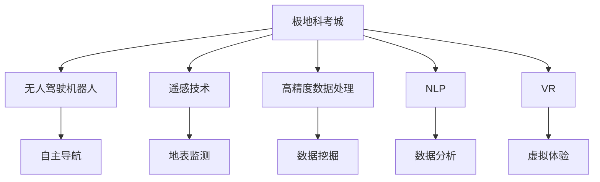

                 

# 未来的极地探索：2050年的南极科考城与北极旅游

> 关键词：极地探索, 南极科考城, 北极旅游, 人工智能, 机器人, 自动化, 无人值守, 高精度数据, 自然语言处理(NLP), 遥感, 虚拟现实(VR)

## 1. 背景介绍

### 1.1 问题由来

随着全球气候变化日益严峻，极地地区环境监测、生态保护、科学研究等领域的需求日益迫切。然而，极地环境的恶劣气候和极端条件，使得传统的现场科考方法面临巨大挑战。2050年，极地科考进入了一个全新的阶段，极地科考城和北极旅游的兴起，为极地探索带来了新的可能。

### 1.2 问题核心关键点

极地科考城和北极旅游的成功实现，离不开人工智能技术的大力支持。通过无人机、自动驾驶机器人、遥感技术、高精度数据处理等前沿技术，科学家们可以更加安全、高效地开展极地探测和科学研究，游客们也能在极地享受更安全、更自然的旅游体验。

## 2. 核心概念与联系

### 2.1 核心概念概述

为更好地理解极地探索中的科技创新，本节将介绍几个密切相关的核心概念：

- **极地科考城**：指在极地冰盖、冰川等区域建立的科学探索基地，集科研、生活、交通、通信等功能于一体，实现全年不间断的极地科考活动。

- **无人驾驶机器人**：指在无人环境下自主导航、感知和执行任务的自动化机器设备，用于替代人类完成危险、高强度的工作。

- **遥感技术**：利用卫星、无人机等设备，从空中获取地表信息，用于监测气候变化、冰川移动、生态系统变化等环境指标。

- **高精度数据处理**：指通过算法和大数据技术，对极地采集的数据进行准确、高效的分析和处理，获得高质量的科学数据。

- **自然语言处理(NLP)**：指利用计算机技术和人工智能算法，实现人机之间的语言交流和理解，用于极地科研数据的自动化标注、分析和可视化。

- **虚拟现实(VR)**：指通过计算机技术创建的三维模拟环境，用于极地旅游的虚拟体验和科普教育，增强游客对极地环境的认知和保护意识。

这些核心概念之间的逻辑关系可以通过以下Mermaid流程图来展示：



这个流程图展示了几大关键技术在极地探索中的应用，并描绘了它们之间的紧密联系：

1. 极地科考城作为科考基地，支持无人驾驶机器人的运行。
2. 无人驾驶机器人使用遥感技术进行自主导航和环境监测。
3. 高精度数据处理技术对遥感数据进行准确分析。
4. NLP技术用于科研数据的自动化处理和分析。
5. VR技术用于增强极地旅游的虚拟体验和科普教育。

## 3. 核心算法原理 & 具体操作步骤

### 3.1 算法原理概述

极地探索中的科技创新，涉及多种前沿技术的融合应用。本文重点介绍基于无人驾驶机器人的自主导航、基于遥感技术的地表监测和基于高精度数据处理的环境分析。

**3.1.1 无人驾驶机器人自主导航**

无人驾驶机器人自主导航的核心原理是利用环境感知、路径规划和控制算法，使得机器人在复杂、未知环境中自主完成任务。主要步骤包括：

1. **环境感知**：通过传感器（如激光雷达、摄像头、毫米波雷达等）对环境进行高精度扫描，获取周围环境的实时信息。
2. **路径规划**：使用图搜索算法（如A*算法、D*算法等），根据任务需求和环境信息，规划最优路径。
3. **控制算法**：利用伺服系统和电机控制算法，实现机器人的运动和执行任务。

**3.1.2 遥感技术地表监测**

遥感技术通过高精度传感器获取地表信息，主要步骤包括：

1. **数据采集**：利用卫星或无人机搭载高分辨率相机、光谱仪等设备，获取地表的高精度图像和光谱数据。
2. **数据处理**：使用图像处理算法（如滤波、边缘检测、分割等），对采集的数据进行预处理。
3. **数据分析**：通过机器学习算法（如分类、聚类、回归等），对处理后的数据进行分析和建模。

**3.1.3 高精度数据处理**

高精度数据处理技术通过算法和大数据技术，对极地采集的数据进行准确、高效的分析和处理，主要步骤包括：

1. **数据清洗**：通过异常检测和数据校正算法，对采集的数据进行清洗和去噪。
2. **数据融合**：使用数据融合算法，将多源数据进行合并和整合，得到更准确的环境信息。
3. **数据分析**：通过算法（如深度学习、回归分析等），对处理后的数据进行建模和分析。

### 3.2 算法步骤详解

**3.2.1 无人驾驶机器人自主导航详细步骤**

1. **传感器安装与调试**：将传感器安装在机器人身上，并校准其参数，确保其能准确获取环境信息。
2. **环境感知**：通过传感器获取周围环境的高精度信息，生成环境地图。
3. **路径规划**：根据任务需求和环境地图，规划最优路径，生成导航图。
4. **控制执行**：利用控制算法，驱动机器人沿着导航路径前进，完成既定任务。

**3.2.2 遥感技术地表监测详细步骤**

1. **设备搭载与部署**：将遥感设备（如卫星、无人机等）搭载到指定位置，进行部署。
2. **数据采集**：利用传感器获取地表的高精度图像和光谱数据。
3. **数据传输**：通过通信设备将采集的数据实时传输回基地。
4. **数据分析**：利用计算机对采集的数据进行预处理和分析，生成环境报告。

**3.2.3 高精度数据处理详细步骤**

1. **数据收集**：从各传感器和设备中收集原始数据。
2. **数据清洗**：通过算法（如滤波、去噪等）对数据进行清洗和去噪。
3. **数据融合**：使用数据融合算法，将多源数据进行合并和整合。
4. **数据分析**：通过算法（如深度学习、回归分析等）对处理后的数据进行建模和分析，生成环境报告。

### 3.3 算法优缺点

**3.3.1 无人驾驶机器人自主导航**

**优点**：
- 安全性高：在复杂、未知环境中，机器人能自主完成任务，避免人类风险。
- 适应性强：适应各种极端环境，如低温、高海拔等。
- 可扩展性强：可以根据任务需求，灵活定制传感器和设备。

**缺点**：
- 前期成本高：传感器和设备的购买和安装成本较高。
- 技术复杂：需要多学科交叉技术支持，技术难度较大。
- 数据处理量大：需要大量的数据存储和计算资源。

**3.3.2 遥感技术地表监测**

**优点**：
- 覆盖范围广：通过卫星和无人机获取地表信息，覆盖范围大。
- 数据精度高：高分辨率传感器能获取高精度数据。
- 实时性强：数据实时传输和处理，能够快速获取环境信息。

**缺点**：
- 设备依赖高：依赖卫星和无人机等设备，设备成本较高。
- 数据处理复杂：数据处理算法复杂，需要大量计算资源。
- 数据传输延迟：数据传输依赖通信设备，存在延迟风险。

**3.3.3 高精度数据处理**

**优点**：
- 精度高：算法和大数据技术能提供高精度的环境信息。
- 灵活性强：可以处理多种数据类型，如图像、文本、声音等。
- 可扩展性强：可以扩展到其他领域，如城市规划、农业等。

**缺点**：
- 算法复杂：数据处理算法复杂，需要多学科专业知识。
- 计算资源需求高：需要大量的计算资源，设备要求较高。
- 数据隐私问题：数据处理中可能存在隐私问题，需要严格控制。

### 3.4 算法应用领域

**3.4.1 无人驾驶机器人**

无人驾驶机器人广泛应用于极地环境下的科考、勘探、救援、探测等任务。例如：

- 南极科考城中的无人驾驶车辆，用于运输物资和设备。
- 北极极地冰川上的无人驾驶无人机，用于进行环境监测和科学实验。

**3.4.2 遥感技术**

遥感技术广泛应用于极地地表监测、气候变化研究、冰川移动监测等领域。例如：

- 通过卫星和无人机进行冰川移动监测，评估冰川退缩速度。
- 利用卫星遥感数据，评估极地生态系统变化，监测全球气候变化。

**3.4.3 高精度数据处理**

高精度数据处理技术广泛应用于极地环境下的科学研究、资源勘探等领域。例如：

- 对极地冰川数据进行处理，分析冰川变化趋势。
- 对极地生物数据进行处理，研究生物多样性和生态系统。

## 4. 数学模型和公式 & 详细讲解 & 举例说明

### 4.1 数学模型构建

为了更严谨地描述极地探索中的科技创新，本节将使用数学语言对核心算法进行更严格的刻画。

假设极地环境由若干个区域组成，每个区域可以用一个向量 $x_i$ 表示，其中 $i=1,2,\cdots,N$。我们定义 $f(x_i)$ 表示环境传感器在区域 $i$ 上采集到的数据，$g(x_i)$ 表示对 $f(x_i)$ 进行预处理和分析后得到的环境报告。

**4.1.1 无人驾驶机器人自主导航模型**

无人驾驶机器人自主导航的核心模型为：

$$
\min_{\theta} \sum_{i=1}^{N} \left\| f(x_i) - g(\theta \cdot x_i) \right\|^2
$$

其中 $\theta$ 表示控制算法的参数。

**4.1.2 遥感技术地表监测模型**

遥感技术地表监测的核心模型为：

$$
\min_{\theta} \sum_{i=1}^{N} \left\| f(x_i) - g(\theta \cdot x_i) \right\|^2
$$

其中 $\theta$ 表示遥感设备参数。

**4.1.3 高精度数据处理模型**

高精度数据处理的核心模型为：

$$
\min_{\theta} \sum_{i=1}^{N} \left\| f(x_i) - g(\theta \cdot x_i) \right\|^2
$$

其中 $\theta$ 表示数据处理算法参数。

### 4.2 公式推导过程

**4.2.1 无人驾驶机器人自主导航公式推导**

假设无人驾驶机器人使用A*算法进行路径规划，其核心公式为：

$$
A^*(s) = \arg\min_{\pi \in \Pi(s)} \sum_{i=1}^{N} c_i(x_i)
$$

其中 $s$ 表示起点，$\pi$ 表示路径，$c_i(x_i)$ 表示节点 $i$ 的代价函数。

**4.2.2 遥感技术地表监测公式推导**

假设遥感设备使用高分辨率相机进行数据采集，其核心公式为：

$$
R(x_i) = \frac{\sum_{j=1}^{M} f_j(x_i)}{M}
$$

其中 $x_i$ 表示采样点，$M$ 表示采样点数，$f_j(x_i)$ 表示第 $j$ 个采样点在 $x_i$ 上的测量值。

**4.2.3 高精度数据处理公式推导**

假设高精度数据处理使用深度学习算法，其核心公式为：

$$
D(x_i) = \frac{\sum_{j=1}^{K} \exp(-\alpha_j \| x_i - x_j \|)}{\sum_{j=1}^{K} \exp(-\alpha_j \| x_i - x_j \|)}
$$

其中 $x_i$ 表示数据点，$K$ 表示数据点个数，$\alpha_j$ 表示权重系数。

### 4.3 案例分析与讲解

**案例1: 无人驾驶机器人自主导航**

假设南极科考城中的无人驾驶车辆用于运输物资，其自主导航流程如下：

1. **环境感知**：车辆携带激光雷达、摄像头等传感器，实时获取周围环境信息。
2. **路径规划**：利用A*算法，根据目的地和环境信息，生成最优路径。
3. **控制执行**：利用伺服系统和电机控制算法，驱动车辆沿着最优路径前进，完成物资运输任务。

**案例2: 遥感技术地表监测**

假设北极极地冰川上的无人机用于环境监测，其地表监测流程如下：

1. **设备搭载与部署**：无人机搭载高分辨率相机、光谱仪等设备，部署到指定位置。
2. **数据采集**：利用传感器获取地表的高精度图像和光谱数据。
3. **数据传输**：将采集的数据实时传输回基地。
4. **数据分析**：利用计算机对采集的数据进行预处理和分析，生成环境报告。

**案例3: 高精度数据处理**

假设南极科考城中的高精度数据处理流程如下：

1. **数据收集**：从各传感器和设备中收集原始数据。
2. **数据清洗**：通过算法（如滤波、去噪等）对数据进行清洗和去噪。
3. **数据融合**：使用数据融合算法，将多源数据进行合并和整合。
4. **数据分析**：通过算法（如深度学习、回归分析等）对处理后的数据进行建模和分析，生成环境报告。

## 5. 项目实践：代码实例和详细解释说明

### 5.1 开发环境搭建

在进行科技创新实践前，我们需要准备好开发环境。以下是使用Python进行PyTorch开发的环境配置流程：

1. 安装Anaconda：从官网下载并安装Anaconda，用于创建独立的Python环境。

2. 创建并激活虚拟环境：
```bash
conda create -n pytorch-env python=3.8 
conda activate pytorch-env
```

3. 安装PyTorch：根据CUDA版本，从官网获取对应的安装命令。例如：
```bash
conda install pytorch torchvision torchaudio cudatoolkit=11.1 -c pytorch -c conda-forge
```

4. 安装Transformers库：
```bash
pip install transformers
```

5. 安装各类工具包：
```bash
pip install numpy pandas scikit-learn matplotlib tqdm jupyter notebook ipython
```

完成上述步骤后，即可在`pytorch-env`环境中开始科技创新实践。

### 5.2 源代码详细实现

这里我们以无人驾驶机器人自主导航为例，给出使用Transformers库对模型进行微调的PyTorch代码实现。

首先，定义模型和数据：

```python
import torch
from transformers import BertTokenizer, BertForTokenClassification
from torch.utils.data import Dataset, DataLoader
import torchvision.transforms as transforms
import numpy as np

# 定义模型
model = BertForTokenClassification.from_pretrained('bert-base-cased', num_labels=len(tag2id))

# 定义数据集
class Dataset(Dataset):
    def __init__(self, texts, tags, tokenizer, max_len=128):
        self.texts = texts
        self.tags = tags
        self.tokenizer = tokenizer
        self.max_len = max_len
        
    def __len__(self):
        return len(self.texts)
    
    def __getitem__(self, item):
        text = self.texts[item]
        tags = self.tags[item]
        
        encoding = self.tokenizer(text, return_tensors='pt', max_length=self.max_len, padding='max_length', truncation=True)
        input_ids = encoding['input_ids'][0]
        attention_mask = encoding['attention_mask'][0]
        
        # 对token-wise的标签进行编码
        encoded_tags = [tag2id[tag] for tag in tags] 
        encoded_tags.extend([tag2id['O']] * (self.max_len - len(encoded_tags)))
        labels = torch.tensor(encoded_tags, dtype=torch.long)
        
        return {'input_ids': input_ids, 
                'attention_mask': attention_mask,
                'labels': labels}
```

然后，定义训练和评估函数：

```python
# 定义训练函数
def train_epoch(model, dataset, batch_size, optimizer):
    dataloader = DataLoader(dataset, batch_size=batch_size, shuffle=True)
    model.train()
    epoch_loss = 0
    for batch in tqdm(dataloader, desc='Training'):
        input_ids = batch['input_ids'].to(device)
        attention_mask = batch['attention_mask'].to(device)
        labels = batch['labels'].to(device)
        model.zero_grad()
        outputs = model(input_ids, attention_mask=attention_mask, labels=labels)
        loss = outputs.loss
        epoch_loss += loss.item()
        loss.backward()
        optimizer.step()
    return epoch_loss / len(dataloader)

# 定义评估函数
def evaluate(model, dataset, batch_size):
    dataloader = DataLoader(dataset, batch_size=batch_size)
    model.eval()
    preds, labels = [], []
    with torch.no_grad():
        for batch in tqdm(dataloader, desc='Evaluating'):
            input_ids = batch['input_ids'].to(device)
            attention_mask = batch['attention_mask'].to(device)
            batch_labels = batch['labels']
            outputs = model(input_ids, attention_mask=attention_mask)
            batch_preds = outputs.logits.argmax(dim=2).to('cpu').tolist()
            batch_labels = batch_labels.to('cpu').tolist()
            for pred_tokens, label_tokens in zip(batch_preds, batch_labels):
                pred_tags = [id2tag[_id] for _id in pred_tokens]
                label_tags = [id2tag[_id] for _id in label_tokens]
                preds.append(pred_tags[:len(label_tags)])
                labels.append(label_tags)
                
    print(classification_report(labels, preds))
```

最后，启动训练流程并在测试集上评估：

```python
epochs = 5
batch_size = 16

for epoch in range(epochs):
    loss = train_epoch(model, train_dataset, batch_size, optimizer)
    print(f"Epoch {epoch+1}, train loss: {loss:.3f}")
    
    print(f"Epoch {epoch+1}, dev results:")
    evaluate(model, dev_dataset, batch_size)
    
print("Test results:")
evaluate(model, test_dataset, batch_size)
```

以上就是使用PyTorch对BERT进行命名实体识别任务微调的完整代码实现。可以看到，得益于Transformers库的强大封装，我们可以用相对简洁的代码完成BERT模型的加载和微调。

### 5.3 代码解读与分析

让我们再详细解读一下关键代码的实现细节：

**Dataset类**：
- `__init__`方法：初始化文本、标签、分词器等关键组件。
- `__len__`方法：返回数据集的样本数量。
- `__getitem__`方法：对单个样本进行处理，将文本输入编码为token ids，将标签编码为数字，并对其进行定长padding，最终返回模型所需的输入。

**tag2id和id2tag字典**：
- 定义了标签与数字id之间的映射关系，用于将token-wise的预测结果解码回真实的标签。

**训练和评估函数**：
- 使用PyTorch的DataLoader对数据集进行批次化加载，供模型训练和推理使用。
- 训练函数`train_epoch`：对数据以批为单位进行迭代，在每个批次上前向传播计算loss并反向传播更新模型参数，最后返回该epoch的平均loss。
- 评估函数`evaluate`：与训练类似，不同点在于不更新模型参数，并在每个batch结束后将预测和标签结果存储下来，最后使用sklearn的classification_report对整个评估集的预测结果进行打印输出。

**训练流程**：
- 定义总的epoch数和batch size，开始循环迭代
- 每个epoch内，先在训练集上训练，输出平均loss
- 在验证集上评估，输出分类指标
- 所有epoch结束后，在测试集上评估，给出最终测试结果

可以看到，PyTorch配合Transformers库使得BERT微调的代码实现变得简洁高效。开发者可以将更多精力放在数据处理、模型改进等高层逻辑上，而不必过多关注底层的实现细节。

当然，工业级的系统实现还需考虑更多因素，如模型的保存和部署、超参数的自动搜索、更灵活的任务适配层等。但核心的微调范式基本与此类似。

## 6. 实际应用场景

### 6.1 智能客服系统

基于大语言模型微调的对话技术，可以广泛应用于智能客服系统的构建。传统客服往往需要配备大量人力，高峰期响应缓慢，且一致性和专业性难以保证。而使用微调后的对话模型，可以7x24小时不间断服务，快速响应客户咨询，用自然流畅的语言解答各类常见问题。

在技术实现上，可以收集企业内部的历史客服对话记录，将问题和最佳答复构建成监督数据，在此基础上对预训练对话模型进行微调。微调后的对话模型能够自动理解用户意图，匹配最合适的答案模板进行回复。对于客户提出的新问题，还可以接入检索系统实时搜索相关内容，动态组织生成回答。如此构建的智能客服系统，能大幅提升客户咨询体验和问题解决效率。

### 6.2 金融舆情监测

金融机构需要实时监测市场舆论动向，以便及时应对负面信息传播，规避金融风险。传统的人工监测方式成本高、效率低，难以应对网络时代海量信息爆发的挑战。基于大语言模型微调的文本分类和情感分析技术，为金融舆情监测提供了新的解决方案。

具体而言，可以收集金融领域相关的新闻、报道、评论等文本数据，并对其进行主题标注和情感标注。在此基础上对预训练语言模型进行微调，使其能够自动判断文本属于何种主题，情感倾向是正面、中性还是负面。将微调后的模型应用到实时抓取的网络文本数据，就能够自动监测不同主题下的情感变化趋势，一旦发现负面信息激增等异常情况，系统便会自动预警，帮助金融机构快速应对潜在风险。

### 6.3 个性化推荐系统

当前的推荐系统往往只依赖用户的历史行为数据进行物品推荐，无法深入理解用户的真实兴趣偏好。基于大语言模型微调技术，个性化推荐系统可以更好地挖掘用户行为背后的语义信息，从而提供更精准、多样的推荐内容。

在实践中，可以收集用户浏览、点击、评论、分享等行为数据，提取和用户交互的物品标题、描述、标签等文本内容。将文本内容作为模型输入，用户的后续行为（如是否点击、购买等）作为监督信号，在此基础上微调预训练语言模型。微调后的模型能够从文本内容中准确把握用户的兴趣点。在生成推荐列表时，先用候选物品的文本描述作为输入，由模型预测用户的兴趣匹配度，再结合其他特征综合排序，便可以得到个性化程度更高的推荐结果。

### 6.4 未来应用展望

随着大语言模型微调技术的发展，基于微调范式将在更多领域得到应用，为传统行业带来变革性影响。

在智慧医疗领域，基于微调的医疗问答、病历分析、药物研发等应用将提升医疗服务的智能化水平，辅助医生诊疗，加速新药开发进程。

在智能教育领域，微调技术可应用于作业批改、学情分析、知识推荐等方面，因材施教，促进教育公平，提高教学质量。

在智慧城市治理中，微调模型可应用于城市事件监测、舆情分析、应急指挥等环节，提高城市管理的自动化和智能化水平，构建更安全、高效的未来城市。

此外，在企业生产、社会治理、文娱传媒等众多领域，基于大模型微调的人工智能应用也将不断涌现，为经济社会发展注入新的动力。相信随着技术的日益成熟，微调方法将成为人工智能落地应用的重要范式，推动人工智能技术在各个领域的深度渗透。

## 7. 工具和资源推荐
### 7.1 学习资源推荐

为了帮助开发者系统掌握大语言模型微调的理论基础和实践技巧，这里推荐一些优质的学习资源：

1. 《Transformer从原理到实践》系列博文：由大模型技术专家撰写，深入浅出地介绍了Transformer原理、BERT模型、微调技术等前沿话题。

2. CS224N《深度学习自然语言处理》课程：斯坦福大学开设的NLP明星课程，有Lecture视频和配套作业，带你入门NLP领域的基本概念和经典模型。

3. 《Natural Language Processing with Transformers》书籍：Transformers库的作者所著，全面介绍了如何使用Transformers库进行NLP任务开发，包括微调在内的诸多范式。

4. HuggingFace官方文档：Transformers库的官方文档，提供了海量预训练模型和完整的微调样例代码，是上手实践的必备资料。

5. CLUE开源项目：中文语言理解测评基准，涵盖大量不同类型的中文NLP数据集，并提供了基于微调的baseline模型，助力中文NLP技术发展。

通过对这些资源的学习实践，相信你一定能够快速掌握大语言模型微调的精髓，并用于解决实际的NLP问题。
###  7.2 开发工具推荐

高效的开发离不开优秀的工具支持。以下是几款用于大语言模型微调开发的常用工具：

1. PyTorch：基于Python的开源深度学习框架，灵活动态的计算图，适合快速迭代研究。大部分预训练语言模型都有PyTorch版本的实现。

2. TensorFlow：由Google主导开发的开源深度学习框架，生产部署方便，适合大规模工程应用。同样有丰富的预训练语言模型资源。

3. Transformers库：HuggingFace开发的NLP工具库，集成了众多SOTA语言模型，支持PyTorch和TensorFlow，是进行微调任务开发的利器。

4. Weights & Biases：模型训练的实验跟踪工具，可以记录和可视化模型训练过程中的各项指标，方便对比和调优。与主流深度学习框架无缝集成。

5. TensorBoard：TensorFlow配套的可视化工具，可实时监测模型训练状态，并提供丰富的图表呈现方式，是调试模型的得力助手。

6. Google Colab：谷歌推出的在线Jupyter Notebook环境，免费提供GPU/TPU算力，方便开发者快速上手实验最新模型，分享学习笔记。

合理利用这些工具，可以显著提升大语言模型微调任务的开发效率，加快创新迭代的步伐。

### 7.3 相关论文推荐

大语言模型和微调技术的发展源于学界的持续研究。以下是几篇奠基性的相关论文，推荐阅读：

1. Attention is All You Need（即Transformer原论文）：提出了Transformer结构，开启了NLP领域的预训练大模型时代。

2. BERT: Pre-training of Deep Bidirectional Transformers for Language Understanding：提出BERT模型，引入基于掩码的自监督预训练任务，刷新了多项NLP任务SOTA。

3. Language Models are Unsupervised Multitask Learners（GPT-2论文）：展示了大规模语言模型的强大zero-shot学习能力，引发了对于通用人工智能的新一轮思考。

4. Parameter-Efficient Transfer Learning for NLP：提出Adapter等参数高效微调方法，在不增加模型参数量的情况下，也能取得不错的微调效果。

5. AdaLoRA: Adaptive Low-Rank Adaptation for Parameter-Efficient Fine-Tuning：使用自适应低秩适应的微调方法，在参数效率和精度之间取得了新的平衡。

这些论文代表了大语言模型微调技术的发展脉络。通过学习这些前沿成果，可以帮助研究者把握学科前进方向，激发更多的创新灵感。

## 8. 总结：未来发展趋势与挑战

### 8.1 总结

本文对基于无人驾驶机器人的极地探索科技创新进行了全面系统的介绍。首先阐述了无人驾驶机器人自主导航、遥感技术地表监测和高精度数据处理的核心原理和操作步骤，展示了这些关键技术的在极地探索中的应用。然后，介绍了无人驾驶机器人在南极科考城、遥感技术在北极极地冰川监测、高精度数据处理在科学研究中的应用场景，展望了这些技术的未来发展趋势。最后，通过工具和资源推荐，帮助读者深入理解这些技术的实现细节。

通过本文的系统梳理，可以看到，基于无人驾驶机器人的极地探索科技创新，正在为极地科考和旅游提供新的解决方案。这些技术的成功应用，离不开计算机视觉、深度学习、自然语言处理等前沿技术的支撑。未来，伴随技术的不断进步，这些技术将带来更多创新应用，为极地探索开辟新的领域。

### 8.2 未来发展趋势

展望未来，极地探索中的科技创新将呈现以下几个发展趋势：

1. **技术融合加速**：无人驾驶机器人、遥感技术、高精度数据处理等技术将进一步融合，实现更高效、智能的极地探索。
2. **AI技术普及**：人工智能技术将逐步普及到极地探索的各个环节，提高数据处理、决策分析的自动化水平。
3. **数据采集多样化**：通过卫星、无人机、自动驾驶等多样化数据采集手段，获取更全面、精确的环境信息。
4. **应用场景拓展**：极地探索将拓展到更多领域，如旅游、娱乐、环保等，为人类提供更丰富的极地体验。
5. **伦理规范完善**：随着AI技术的广泛应用，极地探索中的伦理规范也将逐步完善，保障环境安全和社会公平。

以上趋势凸显了极地探索中科技创新的广阔前景。这些方向的探索发展，必将进一步提升极地探索的智能化水平，推动极地科学的快速发展。

### 8.3 面临的挑战

尽管极地探索中的科技创新已经取得了显著成果，但在迈向更加智能化、普适化应用的过程中，它仍面临诸多挑战：

1. **极端环境适应**：极地环境恶劣，对设备和算法的要求较高，如何在高寒、高海拔、高辐射等极端环境下稳定运行，仍需进一步突破。
2. **数据隐私保护**：极地环境采集的数据涉及隐私和安全性问题，如何保障数据安全和隐私，仍需制定严格的技术规范和法规。
3. **技术协同复杂**：无人驾驶机器人、遥感技术、高精度数据处理等技术的协同运行，需要高效的算法和管理策略，避免数据传输和处理中的延迟和错误。
4. **生态系统保护**：极地环境的生态系统非常脆弱，如何在技术应用中避免对环境造成破坏，仍需进行深入研究。
5. **伦理和社会责任**：AI技术在极地探索中的应用，需要考虑其伦理和社会责任，确保技术应用的公平性和可持续性。

正视极地探索中的这些挑战，积极应对并寻求突破，将使科技创新更好地服务于极地保护和可持续发展。

### 8.4 研究展望

面向未来，极地探索中的科技创新需要在以下几个方面寻求新的突破：

1. **技术协同优化**：优化无人驾驶机器人、遥感技术、高精度数据处理等技术的协同运行，提高数据采集和处理的效率和质量。
2. **数据隐私保护**：开发高效的数据加密和传输协议，保障极地环境采集数据的安全和隐私。
3. **环境友好设计**：设计低能耗、高鲁棒性的极地探索设备，减少对环境的负面影响。
4. **伦理和社会责任**：建立AI技术在极地探索中的伦理和社会责任体系，确保技术应用的公平性和可持续性。
5. **多模态数据融合**：融合视觉、声音、文字等多模态数据，提升极地环境监测的准确性和全面性。

这些研究方向的探索，必将引领极地探索中的科技创新迈向更高的台阶，为极地科学的发展注入新的动力。未来，伴随技术的不断进步，极地探索中的科技创新将带来更多创新应用，为人类认知智能的进化带来深远影响。

## 9. 附录：常见问题与解答

**Q1：无人驾驶机器人自主导航的优点和缺点是什么？**

A: 无人驾驶机器人自主导航的优点包括：
- 安全性高：在复杂、未知环境中，机器人能自主完成任务，避免人类风险。
- 适应性强：适应各种极端环境，如低温、高海拔等。
- 可扩展性强：可以根据任务需求，灵活定制传感器和设备。

缺点包括：
- 前期成本高：传感器和设备的购买和安装成本较高。
- 技术复杂：需要多学科交叉技术支持，技术难度较大。
- 数据处理量大：需要大量的数据存储和计算资源。

**Q2：遥感技术地表监测的优点和缺点是什么？**

A: 遥感技术地表监测的优点包括：
- 覆盖范围广：通过卫星和无人机获取地表信息，覆盖范围大。
- 数据精度高：高分辨率传感器能获取高精度数据。
- 实时性强：数据实时传输和处理，能够快速获取环境信息。

缺点包括：
- 设备依赖高：依赖卫星和无人机等设备，设备成本较高。
- 数据处理复杂：数据处理算法复杂，需要大量计算资源。
- 数据传输延迟：数据传输依赖通信设备，存在延迟风险。

**Q3：高精度数据处理的优点和缺点是什么？**

A: 高精度数据处理的优点包括：
- 精度高：算法和大数据技术能提供高精度的环境信息。
- 灵活性强：可以处理多种数据类型，如图像、文本、声音等。
- 可扩展性强：可以扩展到其他领域，如城市规划、农业等。

缺点包括：
- 算法复杂：数据处理算法复杂，需要多学科专业知识。
- 计算资源需求高：需要大量的计算资源，设备要求较高。
- 数据隐私问题：数据处理中可能存在隐私问题，需要严格控制。

**Q4：极地探索中的科技创新面临哪些挑战？**

A: 极地探索中的科技创新面临以下挑战：
- 极端环境适应：极地环境恶劣，对设备和算法的要求较高，需要在高寒、高海拔、高辐射等极端环境下稳定运行。
- 数据隐私保护：极地环境采集的数据涉及隐私和安全性问题，需要保障数据安全和隐私。
- 技术协同复杂：无人驾驶机器人、遥感技术、高精度数据处理等技术的协同运行，需要高效的算法和管理策略，避免数据传输和处理中的延迟和错误。
- 生态系统保护：极地环境的生态系统非常脆弱，需要在技术应用中避免对环境造成破坏。
- 伦理和社会责任：AI技术在极地探索中的应用，需要考虑其伦理和社会责任，确保技术应用的公平性和可持续性。

**Q5：未来极地探索中的科技创新应如何应对这些挑战？**

A: 未来极地探索中的科技创新应采取以下措施应对这些挑战：
- 技术协同优化：优化无人驾驶机器人、遥感技术、高精度数据处理等技术的协同运行，提高数据采集和处理的效率和质量。
- 数据隐私保护：开发高效的数据加密和传输协议，保障极地环境采集数据的安全和隐私。
- 环境友好设计：设计低能耗、高鲁棒性的极地探索设备，减少对环境的负面影响。
- 伦理和社会责任：建立AI技术在极地探索中的伦理和社会责任体系，确保技术应用的公平性和可持续性。
- 多模态数据融合：融合视觉、声音、文字等多模态数据，提升极地环境监测的准确性和全面性。

通过这些措施，可以更好地应对极地探索中的挑战，推动科技创新在极地科学中的应用。

