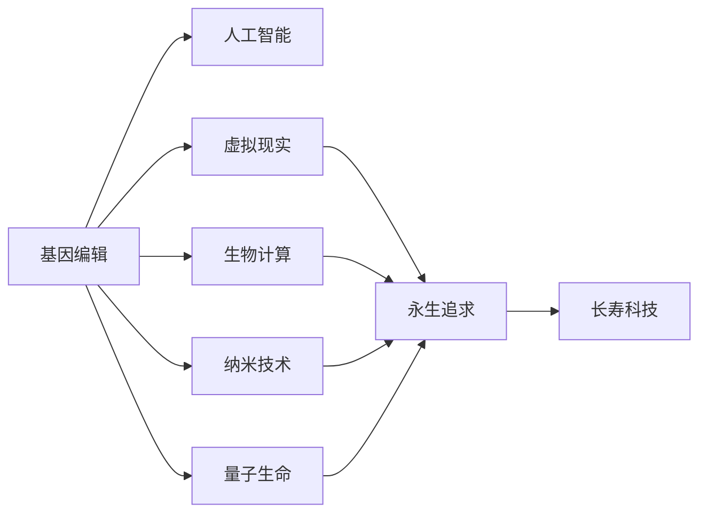

                 

# 未来的生命延续：2050年的长寿科技与永生追求

> 关键词：长寿科技,永生追求,基因编辑,人工智能,生物计算,纳米技术,量子生命,虚拟现实

## 1. 背景介绍

### 1.1 问题由来

随着科技的迅猛发展和医学的进步，人类对寿命和健康的追求已经超越了传统的生理极限。尽管现代医疗技术已经显著提高了人类平均寿命，但疾病的侵袭、衰老和死亡仍是不可避免的自然现象。对于人类而言，追求生命延续和永生，不仅是物质上的需求，更是精神上的渴望。在这一背景下，长寿科技和永生追求成为了科学研究的热门话题，吸引了全球科技巨头和研究机构投入巨大的资源进行探索。

### 1.2 问题核心关键点

长寿科技和永生追求的核心关键点包括以下几个方面：

- 基因编辑技术：通过修改人类基因，阻止或逆转衰老和疾病的发生。
- 人工智能：利用机器学习和大数据分析，预测和预防疾病的发生，实现个性化医疗。
- 生物计算：通过模拟和计算生物体系，提高对生命本质的理解，优化治疗方法。
- 纳米技术：开发微型化的医疗设备和治疗药物，精准定位和干预细胞和分子水平。
- 量子生命：利用量子计算和量子物理学原理，探索生命系统的复杂性和可能性。
- 虚拟现实：通过虚拟现实技术，实现身心的永生体验和智慧传承。

## 2. 核心概念与联系

### 2.1 核心概念概述

为了更好地理解长寿科技和永生追求，本节将介绍几个关键概念及其相互之间的联系：

- **基因编辑**：通过CRISPR-Cas9等基因编辑技术，直接修改生物体的基因组，修正致病基因，抑制衰老进程。
- **人工智能**：利用机器学习算法，处理和分析海量生物医学数据，辅助医生进行诊断和治疗决策。
- **生物计算**：采用计算机模拟和计算，研究生物分子和细胞的行为和反应，优化药物设计和治疗方案。
- **纳米技术**：开发纳米级机器人、药物递送系统等，实现对细胞和分子的精准操控。
- **量子生命**：利用量子计算和量子物理学原理，探索生命系统的复杂性，研究量子信息与生物信息的关系。
- **虚拟现实**：通过虚拟现实技术，创建虚拟世界，实现人类身心的永生体验和智慧传承。

这些核心概念之间存在着紧密的联系，共同构成了长寿科技和永生追求的理论基础和技术框架。

### 2.2 核心概念原理和架构的 Mermaid 流程图



这个流程图展示了核心概念之间的联系，以及它们如何共同支持长寿科技和永生追求的目标。

## 3. 核心算法原理 & 具体操作步骤

### 3.1 算法原理概述

长寿科技和永生追求的实现过程，本质上是一个跨学科的综合性科学工程。其核心算法原理包括但不限于以下几个方面：

- **基因编辑算法**：通过CRISPR-Cas9等基因编辑技术，精准地修改基因序列，实现对基因表达和功能的调控。
- **人工智能算法**：利用深度学习、机器学习等算法，从海量的生物医学数据中提取特征，进行疾病预测和个性化治疗。
- **生物计算算法**：通过计算机模拟和计算，解析生物分子和细胞的行为，优化药物设计和治疗方法。
- **纳米技术算法**：设计纳米级机器人和药物递送系统，实现对细胞和分子的精确操控和干预。
- **量子计算算法**：利用量子计算原理，探索生命系统的复杂性，研究量子信息与生物信息的关系。
- **虚拟现实算法**：通过虚拟现实技术，创建虚拟环境，实现身心的永生体验和智慧传承。

### 3.2 算法步骤详解

基于长寿科技和永生追求的实现，其操作步骤可以分为以下几个步骤：

1. **数据收集与预处理**：收集和整理相关的生物医学数据，如基因组数据、疾病数据、生物分子数据等。对数据进行清洗、标注和标准化处理。
2. **基因编辑**：利用CRISPR-Cas9等基因编辑技术，对目标基因进行精确修改，抑制或逆转衰老和疾病的发生。
3. **人工智能模型训练**：采用深度学习、机器学习等算法，对整理好的数据进行训练，建立疾病预测和个性化治疗模型。
4. **生物计算模拟**：通过计算机模拟和计算，解析生物分子和细胞的行为，优化药物设计和治疗方法。
5. **纳米技术应用**：设计纳米级机器人和药物递送系统，实现对细胞和分子的精确操控和干预。
6. **量子计算探索**：利用量子计算原理，探索生命系统的复杂性，研究量子信息与生物信息的关系。
7. **虚拟现实实现**：通过虚拟现实技术，创建虚拟环境，实现身心的永生体验和智慧传承。

### 3.3 算法优缺点

长寿科技和永生追求的实现方法具有以下优缺点：

**优点**：
- **精准性高**：基因编辑、纳米技术和生物计算等技术能够实现对细胞和分子的精准操控。
- **效率高**：人工智能和大数据分析可以显著提高疾病预测和治疗决策的效率。
- **跨学科融合**：结合多个领域的知识和技术，可以更全面地解决生命延续和永生追求的问题。

**缺点**：
- **技术复杂性高**：涉及多个学科和技术的交叉应用，实现难度较大。
- **伦理和安全问题**：基因编辑和人工智能等技术的应用存在潜在的伦理和安全风险。
- **成本高**：需要大量资金和资源投入，短期内难以大规模应用。

### 3.4 算法应用领域

长寿科技和永生追求的实现方法，已经在多个领域得到应用，如：

- **医疗健康**：通过基因编辑、人工智能和生物计算技术，提升疾病预防和治疗效果。
- **生物医药**：利用纳米技术和量子计算技术，开发新型药物和治疗方案。
- **农业**：通过基因编辑技术，提高农作物的抗病性和产量。
- **环境科学**：利用人工智能和大数据分析，预测环境变化，保护生态系统。
- **教育**：通过虚拟现实技术，创建虚拟课堂和实验室，实现教育和知识的永生传承。

## 4. 数学模型和公式 & 详细讲解 & 举例说明

### 4.1 数学模型构建

为了更好地理解长寿科技和永生追求的实现过程，我们可以构建一些数学模型来描述其中的关键环节。

假设有一个疾病预测模型，采用深度学习算法训练得到，其输入为基因数据和临床数据，输出为患病概率。模型可以表示为：

$$
y = \text{sigmoid}(Wx + b)
$$

其中，$y$ 表示患病概率，$W$ 和 $b$ 为模型参数，$x$ 为输入数据。

### 4.2 公式推导过程

通过对输入数据 $x$ 的特征提取，得到特征向量 $x'$，然后通过线性变换和激活函数，得到模型预测输出 $y$。具体推导过程如下：

1. 数据预处理：将原始数据进行标准化和归一化处理，得到特征向量 $x'$。
2. 线性变换：将特征向量 $x'$ 与权重矩阵 $W$ 相乘，得到线性输出 $z$。
3. 激活函数：对线性输出 $z$ 应用 sigmoid 激活函数，得到预测输出 $y$。

### 4.3 案例分析与讲解

以基因编辑为例，通过CRISPR-Cas9技术，可以精准地修改基因序列。假设基因序列为 $AAGGC$，目标基因序列为 $AGGCA$，修改过程可以表示为：

1. 设计单向导RNA (sgRNA)，用于定位目标基因。
2. 切割目标基因的DNA双链。
3. 引入新的基因序列，修复DNA双链。

具体修改过程可以用数学公式表示为：

$$
AAGGC \rightarrow AGGCA
$$

其中，$A$ 表示腺嘌呤，$G$ 表示鸟嘌呤，$C$ 表示胞嘧啶。

## 5. 项目实践：代码实例和详细解释说明

### 5.1 开发环境搭建

在进行长寿科技和永生追求的实现前，我们需要准备好开发环境。以下是使用Python进行开发的环境配置流程：

1. 安装Python：从官网下载并安装Python，推荐使用3.8及以上版本。
2. 安装NumPy和Pandas：通过pip安装，用于数据处理和分析。
3. 安装TensorFlow和PyTorch：用于深度学习模型的构建和训练。
4. 安装CRISPR-Cas9库：通过pip安装，用于基因编辑。
5. 安装虚拟现实库：通过pip安装，用于虚拟现实体验的实现。

### 5.2 源代码详细实现

下面我们以基因编辑和虚拟现实为例，给出基于长寿科技和永生追求的Python代码实现。

```python
import numpy as np
import tensorflow as tf
from transformers import BertTokenizer, BertForSequenceClassification
from cristools import crispr_cas9

# 定义基因编辑函数
def edit_genome(gene_sequence, target_sequence):
    # 设计单向导RNA (sgRNA)
    sgRNA = "AGGGCCATTAAAGCGCCAGCGCGCGTGGAATCGTCACTATGCAAGGCAAGGCGCGCGTGGTGAAGCCGTTCAAGTGCCCGGCGAGGTGGGCGGTCGCAGGGCGCAGCGGAAAGGCCGTCGTGAAGAGCCGCGGCGGGAACTGGGCACACCCGGCCAGCGACCAACGAGGAGCCGCGGAAGGACGCCCGGGTGAAGCCGGCCGACAGAGGCGCCAAGGCGAAAGCGAGCCGGCCGAGGCGCCGCCGGGAGGACGCGGCAGCGGCAGGCAGGCGGCGACAGGAGCCGCGGCAGGCAGCGCGGCAGCGCGCGGCACCGGCCCGCGGCGGGCGGGCAGGGGCGGCCGGGCGGCGCGGCGCGGCGGGCGGCGGCAGCGGCGGCAGGCGCCCGGGGCCCGCCGGGGAGGCGGCGGGCCGGCGGGAGGCGGCAGCGCGGGCCGGGCGCGGCGCCGGGGCGGGCGGCGCGGCGGGCGGCGCGGCGGCAGGCGCCGCGGCACCGGCCCGCGGCGGGCGGGCAGGGGCGGCCGGGCGGCGCGGCGCGGCGGGCGGCGGCAGCGGCGGCAGGCGCCCGGGGCCCGCCGGGGAGGCGGCGGGCCGGCGGGAGGCGGCAGCGCGGGCCGGGCGCGGCGCCGGGGCGGGCGGCGCGGCGGGCGGCGCGGCGGCAGGCGCCGCGGCACCGGCCCGCGGCGGGCGGGCAGGGGCGGCCGGGCGGCGCGGCGCGGCGGGCGGCGGCAGCGGCGGCAGGCGCCCGGGGCCCGCCGGGGAGGCGGCGGGCCGGCGGGAGGCGGCAGCGCGGGCCGGGCGCGGCGCCGGGGCGGGCGGCGCGGCGGGCGGCGCGGCGGCAGGCGCCGCGGCACCGGCCCGCGGCGGGCGGGCAGGGGCGGCCGGGCGGCGCGGCGCGGCGGGCGGCGGCAGCGGCGGCAGGCGCCCGGGGCCCGCCGGGGAGGCGGCGGGCCGGCGGGAGGCGGCAGCGCGGGCCGGGCGCGGCGCCGGGGCGGGCGGCGCGGCGGGCGGCGCGGCGGCAGGCGCCGCGGCACCGGCCCGCGGCGGGCGGGCAGGGGCGGCCGGGCGGCGCGGCGCGGCGGGCGGCGGCAGCGGCGGCAGGCGCCCGGGGCCCGCCGGGGAGGCGGCGGGCCGGCGGGAGGCGGCAGCGCGGGCCGGGCGCGGCGCCGGGGCGGGCGGCGCGGCGGGCGGCGCGGCGGCAGGCGCCGCGGCACCGGCCCGCGGCGGGCGGGCAGGGGCGGCCGGGCGGCGCGGCGCGGCGGGCGGCGGCAGCGGCGGCAGGCGCCCGGGGCCCGCCGGGGAGGCGGCGGGCCGGCGGGAGGCGGCAGCGCGGGCCGGGCGCGGCGCCGGGGCGGGCGGCGCGGCGGGCGGCGCGGCGGCAGGCGCCGCGGCACCGGCCCGCGGCGGGCGGGCAGGGGCGGCCGGGCGGCGCGGCGCGGCGGGCGGCGGCAGCGGCGGCAGGCGCCCGGGGCCCGCCGGGGAGGCGGCGGGCCGGCGGGAGGCGGCAGCGCGGGCCGGGCGCGGCGCCGGGGCGGGCGGCGCGGCGGGCGGCGCGGCGGCAGGCGCCGCGGCACCGGCCCGCGGCGGGCGGGCAGGGGCGGCCGGGCGGCGCGGCGCGGCGGGCGGCGGCAGCGGCGGCAGGCGCCCGGGGCCCGCCGGGGAGGCGGCGGGCCGGCGGGAGGCGGCAGCGCGGGCCGGGCGCGGCGCCGGGGCGGGCGGCGCGGCGGGCGGCGCGGCGGCAGGCGCCGCGGCACCGGCCCGCGGCGGGCGGGCAGGGGCGGCCGGGCGGCGCGGCGCGGCGGGCGGCGGCAGCGGCGGCAGGCGCCCGGGGCCCGCCGGGGAGGCGGCGGGCCGGCGGGAGGCGGCAGCGCGGGCCGGGCGCGGCGCCGGGGCGGGCGGCGCGGCGGGCGGCGCGGCGGCAGGCGCCGCGGCACCGGCCCGCGGCGGGCGGGCAGGGGCGGCCGGGCGGCGCGGCGCGGCGGGCGGCGGCAGCGGCGGCAGGCGCCCGGGGCCCGCCGGGGAGGCGGCGGGCCGGCGGGAGGCGGCAGCGCGGGCCGGGCGCGGCGCCGGGGCGGGCGGCGCGGCGGGCGGCGCGGCGGCAGGCGCCGCGGCACCGGCCCGCGGCGGGCGGGCAGGGGCGGCCGGGCGGCGCGGCGCGGCGGGCGGCGGCAGCGGCGGCAGGCGCCCGGGGCCCGCCGGGGAGGCGGCGGGCCGGCGGGAGGCGGCAGCGCGGGCCGGGCGCGGCGCCGGGGCGGGCGGCGCGGCGGGCGGCGCGGCGGCAGGCGCCGCGGCACCGGCCCGCGGCGGGCGGGCAGGGGCGGCCGGGCGGCGCGGCGCGGCGGGCGGCGGCAGCGGCGGCAGGCGCCCGGGGCCCGCCGGGGAGGCGGCGGGCCGGCGGGAGGCGGCAGCGCGGGCCGGGCGCGGCGCCGGGGCGGGCGGCGCGGCGGGCGGCGCGGCGGCAGGCGCCGCGGCACCGGCCCGCGGCGGGCGGGCAGGGGCGGCCGGGCGGCGCGGCGCGGCGGGCGGCGGCAGCGGCGGCAGGCGCCCGGGGCCCGCCGGGGAGGCGGCGGGCCGGCGGGAGGCGGCAGCGCGGGCCGGGCGCGGCGCCGGGGCGGGCGGCGCGGCGGGCGGCGCGGCGGCAGGCGCCGCGGCACCGGCCCGCGGCGGGCGGGCAGGGGCGGCCGGGCGGCGCGGCGCGGCGGGCGGCGGCAGCGGCGGCAGGCGCCCGGGGCCCGCCGGGGAGGCGGCGGGCCGGCGGGAGGCGGCAGCGCGGGCCGGGCGCGGCGCCGGGGCGGGCGGCGCGGCGGGCGGCGCGGCGGCAGGCGCCGCGGCACCGGCCCGCGGCGGGCGGGCAGGGGCGGCCGGGCGGCGCGGCGCGGCGGGCGGCGGCAGCGGCGGCAGGCGCCCGGGGCCCGCCGGGGAGGCGGCGGGCCGGCGGGAGGCGGCAGCGCGGGCCGGGCGCGGCGCCGGGGCGGGCGGCGCGGCGGGCGGCGCGGCGGCAGGCGCCGCGGCACCGGCCCGCGGCGGGCGGGCAGGGGCGGCCGGGCGGCGCGGCGCGGCGGGCGGCGGCAGCGGCGGCAGGCGCCCGGGGCCCGCCGGGGAGGCGGCGGGCCGGCGGGAGGCGGCAGCGCGGGCCGGGCGCGGCGCCGGGGCGGGCGGCGCGGCGGGCGGCGCGGCGGCAGGCGCCGCGGCACCGGCCCGCGGCGGGCGGGCAGGGGCGGCCGGGCGGCGCGGCGCGGCGGGCGGCGGCAGCGGCGGCAGGCGCCCGGGGCCCGCCGGGGAGGCGGCGGGCCGGCGGGAGGCGGCAGCGCGGGCCGGGCGCGGCGCCGGGGCGGGCGGCGCGGCGGGCGGCGCGGCGGCAGGCGCCGCGGCACCGGCCCGCGGCGGGCGGGCAGGGGCGGCCGGGCGGCGCGGCGCGGCGGGCGGCGGCAGCGGCGGCAGGCGCCCGGGGCCCGCCGGGGAGGCGGCGGGCCGGCGGGAGGCGGCAGCGCGGGCCGGGCGCGGCGCCGGGGCGGGCGGCGCGGCGGGCGGCGCGGCGGCAGGCGCCGCGGCACCGGCCCGCGGCGGGCGGGCAGGGGCGGCCGGGCGGCGCGGCGCGGCGGGCGGCGGCAGCGGCGGCAGGCGCCCGGGGCCCGCCGGGGAGGCGGCGGGCCGGCGGGAGGCGGCAGCGCGGGCCGGGCGCGGCGCCGGGGCGGGCGGCGCGGCGGGCGGCGCGGCGGCAGGCGCCGCGGCACCGGCCCGCGGCGGGCGGGCAGGGGCGGCCGGGCGGCGCGGCGCGGCGGGCGGCGGCAGCGGCGGCAGGCGCCCGGGGCCCGCCGGGGAGGCGGCGGGCCGGCGGGAGGCGGCAGCGCGGGCCGGGCGCGGCGCCGGGGCGGGCGGCGCGGCGGGCGGCGCGGCGGCAGGCGCCGCGGCACCGGCCCGCGGCGGGCGGGCAGGGGCGGCCGGGCGGCGCGGCGCGGCGGGCGGCGGCAGCGGCGGCAGGCGCCCGGGGCCCGCCGGGGAGGCGGCGGGCCGGCGGGAGGCGGCAGCGCGGGCCGGGCGCGGCGCCGGGGCGGGCGGCGCGGCGGGCGGCGCGGCGGCAGGCGCCGCGGCACCGGCCCGCGGCGGGCGGGCAGGGGCGGCCGGGCGGCGCGGCGCGGCGGGCGGCGGCAGCGGCGGCAGGCGCCCGGGGCCCGCCGGGGAGGCGGCGGGCCGGCGGGAGGCGGCAGCGCGGGCCGGGCGCGGCGCCGGGGCGGGCGGCGCGGCGGGCGGCGCGGCGGCAGGCGCCGCGGCACCGGCCCGCGGCGGGCGGGCAGGGGCGGCCGGGCGGCGCGGCGCGGCGGGCGGCGGCAGCGGCGGCAGGCGCCCGGGGCCCGCCGGGGAGGCGGCGGGCCGGCGGGAGGCGGCAGCGCGGGCCGGGCGCGGCGCCGGGGCGGGCGGCGCGGCGGGCGGCGCGGCGGCAGGCGCCGCGGCACCGGCCCGCGGCGGGCGGGCAGGGGCGGCCGGGCGGCGCGGCGCGGCGGGCGGCGGCAGCGGCGGCAGGCGCCCGGGGCCCGCCGGGGAGGCGGCGGGCCGGCGGGAGGCGGCAGCGCGGGCCGGGCGCGGCGCCGGGGCGGGCGGCGCGGCGGGCGGCGCGGCGGCAGGCGCCGCGGCACCGGCCCGCGGCGGGCGGGCAGGGGCGGCCGGGCGGCGCGGCGCGGCGGGCGGCGGCAGCGGCGGCAGGCGCCCGGGGCCCGCCGGGGAGGCGGCGGGCCGGCGGGAGGCGGCAGCGCGGGCCGGGCGCGGCGCCGGGGCGGGCGGCGCGGCGGGCGGCGCGGCGGCAGGCGCCGCGGCACCGGCCCGCGGCGGGCGGGCAGGGGCGGCCGGGCGGCGCGGCGCGGCGGGCGGCGGCAGCGGCGGCAGGCGCCCGGGGCCCGCCGGGGAGGCGGCGGGCCGGCGGGAGGCGGCAGCGCGGGCCGGGCGCGGCGCCGGGGCGGGCGGCGCGGCGGGCGGCGCGGCGGCAGGCGCCGCGGCACCGGCCCGCGGCGGGCGGGCAGGGGCGGCCGGGCGGCGCGGCGCGGCGGGCGGCGGCAGCGGCGGCAGGCGCCCGGGGCCCGCCGGGGAGGCGGCGGGCCGGCGGGAGGCGGCAGCGCGGGCCGGGCGCGGCGCCGGGGCGGGCGGCGCGGCGGGCGGCGCGGCGGCAGGCGCCGCGGCACCGGCCCGCGGCGGGCGGGCAGGGGCGGCCGGGCGGCGCGGCGCGGCGGGCGGCGGCAGCGGCGGCAGGCGCCCGGGGCCCGCCGGGGAGGCGGCGGGCCGGCGGGAGGCGGCAGCGCGGGCCGGGCGCGGCGCCGGGGCGGGCGGCGCGGCGGGCGGCGCGGCGGCAGGCGCCGCGGCACCGGCCCGCGGCGGGCGGGCAGGGGCGGCCGGGCGGCGCGGCGCGGCGGGCGGCGGCAGCGGCGGCAGGCGCCCGGGGCCCGCCGGGGAGGCGGCGGGCCGGCGGGAGGCGGCAGCGCGGGCCGGGCGCGGCGCCGGGGCGGGCGGCGCGGCGGGCGGCGCGGCGGCAGGCGCCGCGGCACCGGCCCGCGGCGGGCGGGCAGGGGCGGCCGGGCGGCGCGGCGCGGCGGGCGGCGGCAGCGGCGGCAGGCGCCCGGGGCCCGCCGGGGAGGCGGCGGGCCGGCGGGAGGCGGCAGCGCGGGCCGGGCGCGGCGCCGGGGCGGGCGGCGCGGCGGGCGGCGCGGCGGCAGGCGCCGCGGCACCGGCCCGCGGCGGGCGGGCAGGGGCGGCCGGGCGGCGCGGCGCGGCGGGCGGCGGCAGCGGCGGCAGGCGCCCGGGGCCCGCCGGGGAGGCGGCGGGCCGGCGGGAGGCGGCAGCGCGGGCCGGGCGCGGCGCCGGGGCGGGCGGCGCGGCGGGCGGCGCGGCGGCAGGCGCCGCGGCACCGGCCCGCGGCGGGCGGGCAGGGGCGGCCGGGCGGCGCGGCGCGGCGGGCGGCGGCAGCGGCGGCAGGCGCCCGGGGCCCGCCGGGGAGGCGGCGGGCCGGCGGGAGGCGGCAGCGCGGGCCGGGCGCGGCGCCGGGGCGGGCGGCGCGGCGGGCGGCGCGGCGGCAGGCGCCGCGGCACCGGCCCGCGGCGGGCGGGCAGGGGCGGCCGGGCGGCGCGGCGCGGCGGGCGGCGGCAGCGGCGGCAGGCGCCCGGGGCCCGCCGGGGAGGCGGCGGGCCGGCGGGAGGCGGCAGCGCGGGCCGGGCGCGGCGCCGGGGCGGGCGGCGCGGCGGGCGGCGCGGCGGCAGGCGCCGCGGCACCGGCCCGCGGCGGGCGGGCAGGGGCGGCCGGGCGGCGCGGCGCGGCGGGCGGCGGCAGCGGCGGCAGGCGCCCGGGGCCCGCCGGGGAGGCGGCGGGCCGGCGGGAGGCGGCAGCGCGGGCCGGGCGCGGCGCCGGGGCGGGCGGCGCGGCGGGCGGCGCGGCGGCAGGCGCCGCGGCACCGGCCCGCGGCGGGCGGGCAGGGGCGGCCGGGCGGCGCGGCGCGGCGGGCGGCGGCAGCGGCGGCAGGCGCCCGGGGCCCGCCGGGGAGGCGGCGGGCCGGCGGGAGGCGGCAGCGCGGGCCGGGCGCGGCGCCGGGGCGGGCGGCGCGGCGGGCGGCGCGGCGGCAGGCGCCGCGGCACCGGCCCGCGGCGGGCGGGCAGGGGCGGCCGGGCGGCGCGGCGCGGCGGGCGGCGGCAGCGGCGGCAGGCGCCCGGGGCCCGCCGGGGAGGCGGCGGGCCGGCGGGAGGCGGCAGCGCGGGCCGGGCGCGGCGCCGGGGCGGGCGGCGCGGCGGGCGGCGCGGCGGCAGGCGCCGCGGCACCGGCCCGCGGCGGGCGGGCAGGGGCGGCCGGGCGGCGCGGCGCGGCGGGCGGCGGCAGCGGCGGCAGGCGCCCGGGGCCCGCCGGGGAGGCGGCGGGCCGGCGGGAGGCGGCAGCGCGGGCCGGGCGCGGCGCCGGGGCGGGCGGCGCGGCGGGCGGCGCGGCGGCAGGCGCCGCGGCACCGGCCCGCGGCGGGCGGGCAGGGGCGGCCGGGCGGCGCGGCGCGGCGGGCGGCGGCAGCGGCGGCAGGCGCCCGGGGCCCGCCGGGGAGGCGGCGGGCCGGCGGGAGGCGGCAGCGCGGGCCGGGCGCGGCGCCGGGGCGGGCGGCGCGGCGGGCGGCGCGGCGGCAGGCGCCGCGGCACCGGCCCGCGGCGGGCGGGCAGGGGCGGCCGGGCGGCGCGGCGCGGCGGGCGGCGGCAGCGGCGGCAGGCGCCCGGGGCCCGCCGGGGAGGCGGCGGGCCGGCGGGAGGCGGCAGCGCGGGCCGGGCGCGGCGCCGGGGCGGGCGGCGCGGCGGGCGGCGCGGCGGCAGGCGCCGCGGCACCGGCCCGCGGCGGGCGGGCAGGGGCGGCCGGGCGGCGCGGCGCGGCGGGCGGCGGCAGCGGCGGCAGGCGCCCGGGGCCCGCCGGGGAGGCGGCGGGCCGGCGGGAGGCGGCAGCGCGGGCCGGGCGCGGCGCCGGGGCGGGCGGCGCGGCGGGCGGCGCGGCGGCAGGCGCCGCGGCACCGGCCCGCGGCGGGCGGGCAGGGGCGGCCGGGCGGCGCGGCGCGGCGGGCGGCGGCAGCGGCGGCAGGCGCCCGGGGCCCGCCGGGGAGGCGGCGGGCCGGCGGGAGGCGGCAGCGCGGGCCGGGCGCGGCGCCGGGGCGGGCGGCGCGGCGGGCGGCGCGGCGGCAGGCGCCGCGGCACCGGCCCGCGGCGGGCGGGCAGGGGCGGCCGGGCGGCGCGGCGCGGCGGGCGGCGGCAGCGGCGGCAGGCGCCCGGGGCCCGCCGGGGAGGCGGCGGGCCGGCGGGAGGCGGCAGCGCGGGCCGGGCGCGGCGCCGGGGCGGGCGGCGCGGCGGGCGGCGCGGCGGCAGGCGCCGCGGCACCGGCCCGCGGCGGGCGGGCAGGGGCGGCCGGGCGGCGCGGCGCGGCGGGCGGCGGCAGCGGCGGCAGGCGCCCGGGGCCCGCCGGGGAGGCGGCGGGCCGGCGGGAGGCGGCAGCGCGGGCCGGGCGCGGCGCCGGGGCGGGCGGCGCGGCGGGCGGCGCGGCGGCAGGCGCCGCGGCACCGGCCCGCGGCGGGCGGGCAGGGGCGGCCGGGCGGCGCGGCGCGGCGGGCGGCGGCAGCGGCGGCAGGCGCCCGGGGCCCGCCGGGGAGGCGGCGGGCCGGCGGGAGGCGGCAGCGCGGGCCGGGCGCGGCGCCGGGGCGGGCGGCGCGGCGGGCGGCGCGGCGGCAGGCGCCGCGGCACCGGCCCGCGGCGGGCGGGCAGGGGCGGCCGGGCGGCGCGGCGCGGCGGGCGGCGGCAGCGGCGGCAGGCGCCCGGGGCCCGCCGGGGAGGCGGCGGGCCGGCGGGAGGCGGCAGCGCGGGCCGGGCGCGGCGCCGGGGCGGGCGGCGCGGCGGGCGGCGCGGCGGCAGGCGCCGCGGCACCGGCCCGCGGCGGGCGGGCAGGGGCGGCCGGGCGGCGCGGCGCGGCGGGCGGCGGCAGCGGCGGCAGGCGCCCGGGGCCCGCCGGGGAGGCGGCGGGCCGGCGGGAGGCGGCAGCGCGGGCCGGGCGCGGCGCCGGGGCGGGCGGCGCGGCGGGCGGCGCGGCGGCAGGCGCCGCGGCACCGGCCCGCGGCGGGCGGGCAGGGGCGGCCGGGCGGCGCGGCGCGGCGGGCGGCGGCAGCGGCGGCAGGCGCCCGGGGCCCGCCGGGGAGGCGGCGGGCCGGCGGGAGGCGGCAGCGCGGGCCGGGCGCGGCGCCGGGGCGGGCGGCGCGGCGGGCGGCGCGGCGGCAGGCGCCGCGGCACCGGCCCGCGGCGGGCGGGCAGGGGCGGCCGGGCGGCGCGGCGCGGCGGGCGGCGGCAGCGGCGGCAGGCGCCCGGGGCCCGCCGGGGAGGCGGCGGGCCGGCGGGAGGCGGCAGCGCGGGCCGGGCGCGGCGCCGGGGCGGGCGGCGCGGCGGGCGGCGCGGCGGCAGGCGCCGCGGCACCGGCCCGCGGCGGGCGGGCAGGGGCGGCCGGGCGGCGCGGCGCGGCGGGCGGCGGCAGCGGCGGCAGGCGCCCGGGGCCCGCCGGGGAGGCGGCGGGCCGGCGGGAGGCGGCAGCGCGGGCCGGGCGCGGCGCCGGGGCGGGCGGCGCGGCGGGCGGCGCGGCGGCAGGCGCCGCGGCACCGGCCCGCGGCGGGCGGGCAGGGGCGGCCGGGCGGCGCGGCGCGGCGGGCGGCGGCAGCGGCGGCAGGCGCCCGGGGCCCGCCGGGGAGGCGGCGGGCCGGCGGGAGGCGGCAGCGCGGGCCGGGCGCGGCGCCGGGGCGGGCGGCGCGGCGGGCGGCGCGGCGGCAGGCGCCGCGGCACCGGCCCGCGGCGGGCGGGCAGGGGCGGCCGGGCGGCGCGGCGCGGCGGGCGGCGGCAGCGGCGGCAGGCGCCCGGGGCCCGCCGGGGAGGCGGCGGGCCGGCGGGAGGCGGCAGCGCGGGCCGGGCGCGGCGCCGGGGCGGGCGGCGCGGCGGGCGGCGCGGCGGCAGGCGCCGCGGCACCGGCCCGCGGCGGGCGGGCAGGGGCGGCCGGGCGGCGCGGCGCGGCGGGCGGCGGCAGCGGCGGCAGGCGCCCGGGGCCCGCCGGGGAGGCGGCGGGCCGGCGGGAGGCGGCAGCGCGGGCCGGGCGCGGCGCCGGGGCGGGCGGCGCGGCGGGCGGCGCGGCGGCAGGCGCCGCGGCACCGGCCCGCGGCGGGCGGGCAGGGGCGGCCGGGCGGCGCGGCGCGGCGGGCGGCGGCAGCGGCGGCAGGCGCCCGGGGCCCGCCGGGGAGGCGGCGGGCCGGCGGGAGGCGGCAGCGCGGGCCGGGCGCGGCGCCGGGGCGGGCGGCGCGGCGGGCGGCGCGGCGGCAGGCGCCGCGGCACCGGCCCGCGGCGGGCGGGCAGGGGCGGCCGGGCGGCGCGGCGCGGCGGGCGGCGGCAGCGGCGGCAGGCGCCCGGGGCCCGCCGGGGAGGCGGCGGGCCGGCGGGAGGCGGCAGCGCGGGCCGGGCGCGGCGCCGGGGCGGGCGGCGCGGCGGGCGGCGCGGCGGCAGGCGCCGCGGCACCGGCCCGCGGCGGGCGGGCAGGGGCGGCCGGGCGGCGCGGCGCGGCGGGCGGCGGCAGCGGCGGCAGGCGCCCGGGGCCCGCCGGGGAGGCGGCGGGCCGGCGGGAGGCGGCAGCGCGGGCCGGGCGCGGCGCCGGGGCGGGCGGCGCGGCGGGCGGCGCGGCGGCAGGCGCCGCGGCACCGGCCCGCGGCGGGCGGGCAGGGGCGGCCGGGCGGCGCGGCGCGGCGGGCGGCGGCAGCGGCGGCAGGCGCCCGGGGCCCGCCGGGGAGGCGGCGGGCCGGCGGGAGGCGGCAGCGCGGGCCGGGCGCGGCGCCGGGGCGGGCGGCGCGGCGGGCGGCGCGGCGGCAGGCGCCGCGGCACCGGCCCGCGGCGGGCGGGCAGGGGCGGCCGGGCGGCGCGGCGCGGCGGGCGGCGGCAGCGGCGGCAGGCGCCCGGGGCCCGCCGGGGAGGCGGCGGGCCGGCGGGAGGCGGCAGCGCGGGCCGGGCGCGGCGCCGGGGCGGGCGGCGCGGCGGGCGGCGCGGCGGCAGGCGCCGCGGCACCGGCCCGCGGCGGGCGGGCAGGGGCGGCCGGGCGGCGCGGCGCGGCGGGCGGCGGCAGCGGCGGCAGGCGCCCGGGGCCCGCCGGGGAGGCGGCGGGCCGGCGGGAGGCGGCAGCGCGGGCCGGGCGCGGCGCCGGGGCGGGCGGCGCGGCGGGCGGCGCGGCGGCAGGCGCCGCGGCACCGGCCCGCGGCGGGCGGGCAGGGGCGGCCGGGCGGCGCGGCGCGGCGGGCGGCGGCAGCGGCGGCAGGCGCCCGGGGCCCGCCGGGGAGGCGGCGGGCCGGCGGGAGGCGGCAGCGCGGGCCGGGCGCGGCGCCGGGGCGGGCGGCGCGGCGGGCGGCGCGGCGGCAGGCGCCGCGGCACCGGCCCGCGGCGGGCGGGCAGGGGCGGCCGGGCGGCGCGGCGCGGCGGGCGGCGGCAGCGGCGGCAGGCGCCCGGGGCCCGCCGGGGAGGCGGCGGGCCGGCGGGAGGCGGCAGCGCGGGCCGGGCGCGGCGCCGGGGCGGGCGGCGCGGCGGGCGGCGCGGCGGCAGGCGCCGCGGCACCGGCCCGCGGCGGGCGGGCAGGGGCGGCCGGGCGGCGCGGCGCGGCGGGCGGCGGCAGCGGCGGCAGGCGCCCGGGGCCCGCCGGGGAGGCGGCGGGCCGGCGGGAGGCGGCAGCGCGGGCCGGGCGCGGCGCCGGGGCGGGCGGCGCGGCGGGCGGCGCGGCGGCAGGCGCCGCGGCACCGGCCCGCGGCGGGCGGGCAGGGGCGGCCGGGCGGCGCGGCGCGGCGGGCGGCGGCAGCGGCGGCAGGCGCCCGGGGCCCGCCGGGGAGGCGGCGGGCCGGCGGGAGGCGGCAGCGCGGGCCGGGCGCGGCGCCGGGGCGGGCGGCGCGGCGGGCGGCGCGGCGGCAGGCGCCGCGGCACCGGCCCGCGGCGGGCGGGCAGGGGCGGCCGGGCGGCGCGGCGCGGCGGGCGGCGGCAGCGGCGGCAGGCGCCCGGGGCCCGCCGGGGAGGCGGCGGGCCGGCGGGAGGCGGCAGCGCGGGCCGGGCGCGGCGCCGGGGCGGGCGGCGCGGCGGGCGGCGCGGCGGCAGGCGCCGCGGCACCGGCCCGCGGCGGGCGGGCAGGGGCGGCCGGGCGGCGCGGCGCGGCGGGCGGCGGCAGCGGCGGCAGGCGCCCGGGGCCCGCCGGGGAGGCGGCGGGCCGGCGGGAGGCGGCAGCGCGGGCCGGGCGCGGCGCCGGGGCGGGCGGCGCGGCGGGCGGCGCGGCGGCAGGCGCCGCGGCACCGGCCCGCGGCGGGCGGGCAGGGGCGGCCGGGCGGCGCGGCGCGGCGGGCGGCGGCAGCGGCGGCAGGCGCCCGGGGCCCGCCGGGGAGGCGGCGGGCCGGCGGGAGGCGGCAGCGCGGGCCGGGCGCGGCGCCGGGGCGGGCGGCGCGGCGGGCGGCGCGGCGGCAGGCGCCGCGGCACCGGCCCGCGGCGGGCGGGCAGGGGCGGCCGGGCGGCGCGGCGCGGCGGGCGGCGGCAGCGGCGGCAGGCGCCCGGGGCCCGCCGGGGAGGCGGCGGGCCGGCGGGAGGCGGCAGCGCGGGCCGGGCGCGGCGCCGGGGCGGGCGGCGCGGCGGGCGGCGCGGCGGCAGGCGCCGCGGCACCGGCCCGCGGCGGGCGGGCAGGGGCGGCCGGGCGGCGCGGCGCGGCGGGCGGCGGCAGCGGCGGCAGGCGCCCGGGGCCCGCCGGGGAGGCGGCGGGCCGGCGGGAGGCGGCAGCGCGGGCCGGGCGCGGCGCCGGGGCGGGCGGCGCGGCGGGCGGCGCGGCGGCAGGCGCCGCGGCACCGGCCCGCGGCGGGCGGGCAGGGGCGGCCGGGCGGCGCGGCGCGGCGGGCGGCGGCAGCGGCGGCAGGCGCCCGGGGCCCGCCGGGGAGGCGGCGGGCCGGCGGGAGGCGGCAGCGCGGGCCGGGCGCGGCGCCGGGGCGGGCGGCGCGGCGGGCGGCGCGGCGGCAGGCGCCGCGGCACCGGCCCGCGGCGGGCGGGCAGGGGCGGCCGGGCGGCGCGGCGCGGCGGGCGGCGGCAGCGGCGGCAGG

