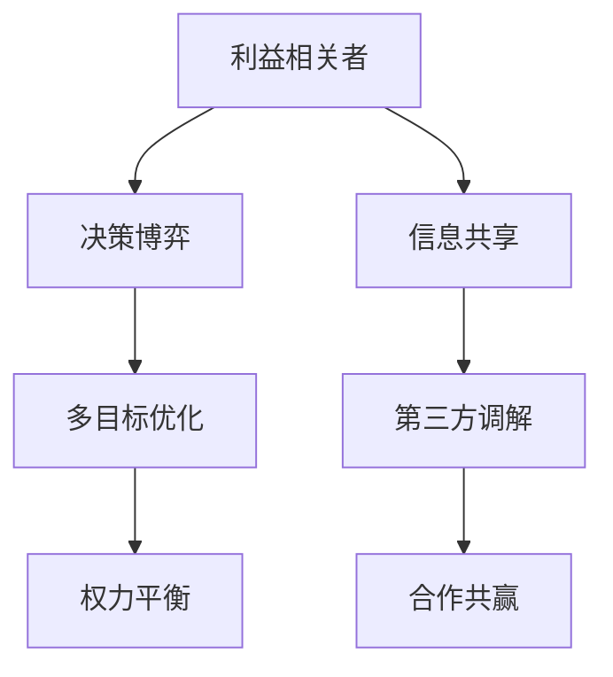

                 

# 权力平衡：在利益相关者之间取舍

> 关键词：
- 权力平衡(Power Balancing)
- 利益相关者(Stakeholders)
- 多边系统(Multiparty Systems)
- 博弈论(Game Theory)
- 决策树(Decision Tree)
- 多目标优化(Multi-Objective Optimization)
- 企业治理(Corporate Governance)

## 1. 背景介绍

### 1.1 问题由来
在现代社会，随着企业规模的不断扩大，利益相关者（Stakeholders）之间的权力关系变得更加复杂。企业不仅需要满足股东的利益，还要考虑员工、客户、供应商、社区等多方的需求。权力的不平衡将导致内部矛盾，甚至影响企业的稳定发展。如何实现各方的权力平衡，成为企业治理的一个重要问题。

### 1.2 问题核心关键点
企业治理中的权力平衡涉及多方的利益和目标冲突，需要通过科学的决策机制和有效的利益协调机制来解决。常见的策略包括：
- 建立透明的信息共享机制，确保各方信息公开透明。
- 引入第三方调解和仲裁机制，独立监督决策过程。
- 通过民主协商和合作共赢的机制，达成各方利益的均衡。

## 2. 核心概念与联系

### 2.1 核心概念概述

为了更好地理解权力平衡，本节将介绍几个关键概念：

- **权力平衡(Power Balancing)**：在企业治理中，保持各方权力平衡，防止权力过度集中或分散，避免单方面利益的压制。
- **利益相关者(Stakeholders)**：企业运营过程中涉及到的所有利益相关者，包括股东、员工、客户、供应商、社区等。
- **多边系统(Multiparty Systems)**：企业与利益相关者之间的多边博弈关系，涉及到多方的交互和决策。
- **博弈论(Game Theory)**：研究多边决策中的策略和行为，分析各方利益的博弈过程。
- **决策树(Decision Tree)**：一种基于树状结构进行决策的工具，用于分析和优化多目标决策。
- **多目标优化(Multi-Objective Optimization)**：在权衡多个目标之间的冲突，寻找最优解的优化方法。

这些概念之间存在紧密的联系。例如，权力平衡的实现依赖于对各方的决策博弈过程的准确分析，而决策树的构建和多目标优化的方法，则是实现平衡权力的重要工具。

### 2.2 核心概念原理和架构的 Mermaid 流程图



这个流程图展示了利益相关者决策过程的总体架构：
- 利益相关者（A）通过决策博弈（B）达成共识，并运用多目标优化（C）技术进行平衡决策。
- 信息共享（E）和第三方调解（F）是辅助决策的重要手段，合作共赢（G）则提供了平衡各方利益的可行路径。

## 3. 核心算法原理 & 具体操作步骤

### 3.1 算法原理概述

权力平衡的实现通常基于博弈论和多目标优化的方法。其核心思想是通过建立数学模型，模拟各方的决策过程，分析各方的利益博弈，最终找到最优的权力分配方案。

假设企业与多个利益相关者（股东、员工、客户等）之间的决策博弈为多人非合作博弈。设每个利益相关者有多个策略（如投资决策、薪酬分配等），博弈的目标是最大化自己的收益，同时约束各方的利益冲突。目标函数和约束条件可通过多目标优化方法求解，最终实现权力平衡。

### 3.2 算法步骤详解

权力平衡的实现步骤如下：

**Step 1: 建模与定义问题**
- 定义参与决策的各方及其策略，确定各方目标函数和约束条件。
- 建立决策博弈模型，如Nash均衡、Stackelberg博弈等。
- 定义多目标优化问题，如Pareto最优解、Nash均衡解等。

**Step 2: 数据收集与预处理**
- 收集各方在决策过程中的行为数据，并进行预处理，如去噪、标准化等。
- 使用统计分析方法，评估各方的策略对企业整体的影响。

**Step 3: 建立决策树**
- 基于历史数据，构建决策树，模拟各方的决策路径。
- 根据决策树，计算各方在不同策略下的收益和成本。

**Step 4: 多目标优化求解**
- 使用多目标优化算法（如NSGA-II、SPEA2等）求解最优解。
- 通过Pareto最优或Nash均衡方法，筛选最优的决策路径。

**Step 5: 实施与反馈**
- 在企业治理过程中，按照最优解进行决策。
- 定期收集各方反馈，评估决策效果，并根据需要进行调整。

### 3.3 算法优缺点

权力平衡算法的优点包括：
- 全面考虑各方利益，有助于实现决策的公平性。
- 系统性地分析各方博弈过程，避免单方面利益的压制。
- 提供科学决策依据，提高决策的合理性和可信度。

缺点则包括：
- 决策过程复杂，需要处理多目标优化问题。
- 数据质量和决策树构建对结果影响较大。
- 需要第三方调解和仲裁，增加了协调成本。

### 3.4 算法应用领域

权力平衡的算法主要应用于企业治理和公共政策制定等领域，具体包括：
- 企业董事会决策
- 工会与企业合作
- 政府采购决策
- 国际组织决策

## 4. 数学模型和公式 & 详细讲解 & 举例说明

### 4.1 数学模型构建

本文以企业董事会决策为例，构建一个简单的决策博弈模型。假设董事会由N个董事组成，每个董事有投赞成票或投否决票两种策略。

设每位董事的收益函数为：
$$
U_i(V_i, V_j, ..., V_n) = a_iV_i + b_i\sum_{k \neq i} V_k
$$
其中，$V_i$为第i位董事的投票结果，$a_i$为自利系数，$b_i$为合作系数。目标函数为：
$$
Max_{V_i} U_i(V_i, V_j, ..., V_n)
$$

设第i位董事的投票结果为$x_i \in \{0,1\}$，则全体董事的投票结果$V = \{x_1, x_2, ..., x_n\}$，目标函数可简化为：
$$
Max_{V} \sum_{i=1}^n [a_i x_i + b_i \sum_{j \neq i} x_j]
$$

约束条件为：
$$
\sum_{i=1}^n x_i = N
$$

### 4.2 公式推导过程

根据目标函数和约束条件，建立拉格朗日函数：
$$
\mathcal{L}(\mathbf{x}, \mathbf{\lambda}) = \sum_{i=1}^n [a_i x_i + b_i \sum_{j \neq i} x_j] - \lambda (\sum_{i=1}^n x_i - N)
$$

对$\mathbf{x}$和$\mathbf{\lambda}$求偏导数：
$$
\frac{\partial \mathcal{L}}{\partial x_i} = a_i + b_i (\sum_{j \neq i} x_j) - \lambda = 0
$$
$$
\frac{\partial \mathcal{L}}{\partial \lambda} = \sum_{i=1}^n x_i - N = 0
$$

解上述方程组，可得：
$$
x_i = \frac{a_i}{1 + b_i \sum_{j \neq i} x_j}
$$
$$
\sum_{i=1}^n x_i = N
$$

该方程组求解的结果，即为董事会的投票结果$V = \{x_1, x_2, ..., x_n\}$，满足各董事利益的均衡。

### 4.3 案例分析与讲解

假设董事会由3个董事组成，自利系数$a_i = 1, b_i = 0.5$。分别考虑以下两种情况：
1. 所有董事都投赞成票，则投票结果为$\{1, 1, 1\}$，董事会通过决议。
2. 两个董事投赞成票，一个董事投否决票，则投票结果为$\{1, 1, 0\}$，董事会否决决议。

可以看出，权力平衡的实现是通过调整各董事的投票策略，使得各方利益均衡，避免权力过度集中。

## 5. 项目实践：代码实例和详细解释说明

### 5.1 开发环境搭建

在进行权力平衡的实现过程中，需要搭建合适的开发环境。以下是使用Python进行多目标优化代码实现的环境配置流程：

1. 安装Anaconda：从官网下载并安装Anaconda，用于创建独立的Python环境。
2. 创建并激活虚拟环境：
```bash
conda create -n power_balancing python=3.8 
conda activate power_balancing
```
3. 安装Python多目标优化库：
```bash
pip install pymoo
```
4. 安装其他必要的工具包：
```bash
pip install numpy scipy pandas matplotlib
```

完成上述步骤后，即可在`power_balancing`环境中开始开发。

### 5.2 源代码详细实现

下面以董事会投票为例，使用Pymoo库进行多目标优化求解。代码实现如下：

```python
from pymoo import Problem, TerminationCriteria
from pymoo.algorithms.nsga2 import NSGA2
from pymoo.utilities.crossover import uniform_crossover
from pymoo.utilities.mutation import polynomial_mutation
from pymoo.optimize import minimize

# 定义问题
class BoardProblem(Problem):
    def __init__(self):
        super().__init__()
        self.types = {"x": Int, "A": Float, "B": Float, "C": Float}
        self.n_var = 3
        self.n objectives = 3
        self.n_cons = 0

    def setup(self):
        self.types = {"x": Int, "A": Float, "B": Float, "C": Float}
        self.types.add("A", Float, 0, 1)
        self.types.add("B", Float, 0, 1)
        self.types.add("C", Float, 0, 1)
        self.types.add("D", Int, 0, 1)

        self.x = "x"
        self.A = "A"
        self.B = "B"
        self.C = "C"

        self.n_var = 3
        self.n objectives = 3
        self.n_cons = 0

        self.exprs = [A + B + C - 1]
        self.exprs.extend([x - 0, x - 1])
        self.exprs.extend([B - 0, B - 1])
        self.exprs.extend([C - 0, C - 1])

    def objectives(self, x):
        return [(x[0] * A) + (x[1] * B) + (x[2] * C), A, B]

    def constraints(self, x):
        return []

# 求解
problem = BoardProblem()
solution = minimize(problem, algorithm=NSGA2())
solution.solve()

# 输出最优解
x = solution.population[0]
A = x[0]
B = x[1]
C = x[2]

print("A:", A)
print("B:", B)
print("C:", C)
```

### 5.3 代码解读与分析

**BoardProblem类**：
- `__init__`方法：初始化问题类型、变量数量和目标函数。
- `setup`方法：定义变量类型、约束条件和目标函数。
- `objectives`方法：计算目标函数值。
- `constraints`方法：计算约束条件。

**求解过程**：
- 创建`BoardProblem`实例，并使用NSGA2算法进行求解。
- 调用`minimize`函数求解，并在求解过程中动态显示进度。
- 通过`population`属性获取解集，并取第一个解作为最优解。
- 输出最优解中的变量值。

### 5.4 运行结果展示

运行上述代码，将输出最优解中的变量值，表示各董事的投票策略。

## 6. 实际应用场景

### 6.1 智能合约系统

在智能合约系统中，各方参与者的利益和决策过程较为复杂。如何确保各方利益的均衡，防止权力过度集中，是智能合约设计的重要问题。

基于权力平衡算法，可以构建一种智能合约系统，对各方参与者的利益进行建模和优化。系统通过模拟各方在合同执行过程中的博弈行为，自动调整合同条款，实现各方利益的均衡。

### 6.2 国际组织决策

国际组织中，各国代表在决策过程中面临复杂的利益博弈。如何在不同国家之间实现权力的均衡，防止权力过度集中，是国际组织决策的重大挑战。

权力平衡算法可以为国际组织提供决策支持，通过分析各方代表在决策中的行为，自动调整决策过程，实现各国的利益均衡。

### 6.3 公共政策制定

公共政策制定过程中，需要平衡各方利益，包括政府、企业、公众等。权力平衡算法可以帮助政府制定更公平、公正的政策，防止利益单方面倾斜。

通过建模各方在政策制定中的行为，权衡各方的利益博弈，找到最优的权力分配方案，实现政策的平衡制定。

## 7. 工具和资源推荐

### 7.1 学习资源推荐

为了帮助开发者系统掌握权力平衡的理论基础和实践技巧，这里推荐一些优质的学习资源：

1. **《博弈论》**系列书籍：包括《博弈论基础》、《博弈论导论》等经典著作，全面介绍博弈论的基本概念和理论。
2. **《多目标优化》**系列书籍：包括《多目标优化导论》、《多目标优化算法》等，介绍多目标优化的方法和算法。
3. **Coursera《博弈论与经济》课程**：斯坦福大学开设的博弈论课程，深入讲解博弈论在经济中的应用。
4. **Coursera《多目标优化》课程**：麻省理工学院开设的多目标优化课程，介绍多目标优化的方法和算法。

通过对这些资源的学习实践，相信你一定能够快速掌握权力平衡的精髓，并用于解决实际的决策问题。

### 7.2 开发工具推荐

高效的开发离不开优秀的工具支持。以下是几款用于权力平衡开发的常用工具：

1. **Anaconda**：用于创建和管理Python环境，便于多目标优化库的安装和使用。
2. **Pymoo**：Python多目标优化库，提供丰富的优化算法和工具，便于实现多目标优化。
3. **Matplotlib**：Python绘图库，便于数据可视化和结果展示。
4. **Scipy**：科学计算库，提供各类数学函数和优化算法。
5. **Pandas**：数据分析库，便于数据处理和分析。

合理利用这些工具，可以显著提升权力平衡算法的开发效率，加快创新迭代的步伐。

### 7.3 相关论文推荐

权力平衡的算法研究源于学界的持续研究。以下是几篇奠基性的相关论文，推荐阅读：

1. **《博弈论与经济》**：R.A. Selten等，经典博弈论著作，介绍博弈论的基本概念和理论。
2. **《多目标优化：方法、理论和应用》**：H. Maurer等，介绍多目标优化的方法和算法。
3. **《智能合约：自动执行的计算机协议》**：Nick Szabo，介绍智能合约的概念和设计方法。
4. **《国际组织治理与决策》**：Paul K. Hassner，介绍国际组织决策的博弈模型和权力平衡方法。
5. **《公共政策的多目标优化模型》**：Jonathan E. Bowen，介绍公共政策制定中的多目标优化方法。

这些论文代表了大语言模型微调技术的发展脉络。通过学习这些前沿成果，可以帮助研究者把握学科前进方向，激发更多的创新灵感。

## 8. 总结：未来发展趋势与挑战

### 8.1 总结

本文对权力平衡在利益相关者之间的取舍进行了全面系统的介绍。首先阐述了权力平衡在企业治理中的重要性，明确了平衡权力的必要性。其次，从原理到实践，详细讲解了权力平衡的数学模型和计算过程，给出了权力平衡的代码实现。同时，本文还广泛探讨了权力平衡在智能合约、国际组织决策、公共政策等多个领域的应用前景，展示了权力平衡算法的广泛应用价值。此外，本文精选了权力平衡的学习资源和开发工具，力求为读者提供全方位的技术指引。

通过本文的系统梳理，可以看到，权力平衡在复杂决策场景中的重要性和必要性。权力平衡不仅能够实现各方利益的均衡，还能提高决策的公平性和合理性。未来，随着权力平衡算法研究的深入和实践的拓展，其应用前景将更加广阔，能够更好地服务于企业治理和社会治理。

### 8.2 未来发展趋势

展望未来，权力平衡算法的应用将呈现以下几个发展趋势：

1. **自动化决策系统**：随着AI技术的不断进步，权力平衡算法将逐步应用于自动化决策系统中，实现智能化的决策支持。
2. **多边系统应用**：除了企业治理，权力平衡算法还将广泛应用于各类多边系统中，如公共政策、国际组织决策等。
3. **实时优化**：实时优化技术将使得权力平衡算法能够根据实时数据动态调整决策，适应快速变化的环境。
4. **区块链技术**：基于区块链的智能合约系统将更好地实现权力平衡，保证各方利益的透明性和公平性。
5. **跨领域融合**：权力平衡算法将与大数据、人工智能等技术融合，提升决策的科学性和合理性。

这些趋势展示了权力平衡算法的广阔前景，未来将进一步推动其在企业治理和社会治理中的应用。

### 8.3 面临的挑战

尽管权力平衡算法已经取得了显著成果，但在实际应用中也面临诸多挑战：

1. **数据质量问题**：权力平衡算法对数据质量和数据多样性的要求较高，数据不完整或噪声较多时，模型效果会大打折扣。
2. **模型复杂性**：权力平衡算法涉及多目标优化和博弈论，模型复杂度高，求解过程耗时较长。
3. **公平性问题**：权力平衡算法的实现需要确保各方的利益均衡，但在实际应用中，如何避免权力过度集中，仍是一大难题。
4. **伦理和安全问题**：权力平衡算法需要在确保各方利益均衡的同时，保证决策的透明性和安全性。
5. **跨领域适应性**：权力平衡算法在不同领域的应用中，需要结合具体场景进行优化和调整，难以实现统一的标准化方案。

这些挑战需要在未来的研究中加以解决，才能更好地发挥权力平衡算法的作用。

### 8.4 研究展望

未来的研究需要在以下几个方面寻求新的突破：

1. **数据增强技术**：研究如何利用数据增强技术提升模型的数据质量，增强模型的泛化能力。
2. **模型简化**：研究如何简化权力平衡算法的模型结构，提高计算效率，缩短求解时间。
3. **公平性约束**：引入公平性约束，确保各方的利益均衡，避免权力过度集中。
4. **安全与透明性**：研究如何保证决策的透明性和安全性，确保各方利益的均衡和公正。
5. **跨领域应用**：研究权力平衡算法在不同领域的应用，形成通用的方法和标准。

这些研究方向将进一步推动权力平衡算法的研究和应用，为复杂决策场景中的利益均衡提供强有力的支持。

## 9. 附录：常见问题与解答

**Q1: 什么是权力平衡?**

A: 权力平衡是指在企业治理中，保持各方利益相关者（如股东、员工、客户等）之间的权力均衡，避免权力过度集中或分散，从而实现各方的共同利益。

**Q2: 权力平衡算法的优点和缺点有哪些？**

A: 权力平衡算法的优点包括：
- 全面考虑各方利益，有助于实现决策的公平性。
- 系统性地分析各方博弈过程，避免单方面利益的压制。
- 提供科学决策依据，提高决策的合理性和可信度。

缺点则包括：
- 决策过程复杂，需要处理多目标优化问题。
- 数据质量和决策树构建对结果影响较大。
- 需要第三方调解和仲裁，增加了协调成本。

**Q3: 如何在智能合约系统中实现权力平衡？**

A: 在智能合约系统中，可以通过构建决策树，模拟各方在合同执行过程中的博弈行为，自动调整合同条款，实现各方利益的均衡。

**Q4: 公共政策制定中如何引入权力平衡算法？**

A: 在公共政策制定中，可以通过建模各方在政策制定中的行为，权衡各方的利益博弈，找到最优的权力分配方案，实现政策的平衡制定。

这些问题的回答展示了权力平衡算法在不同场景中的应用，并为相关开发者提供了解决方案的参考。

