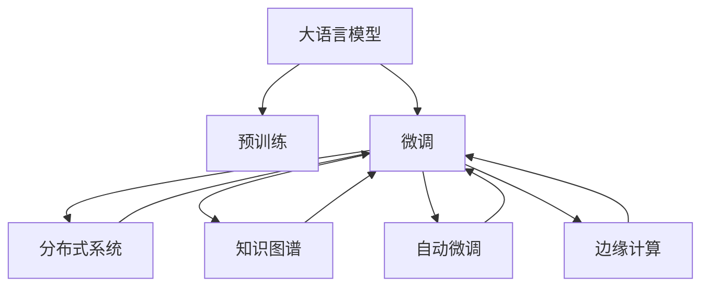

                 

# 构建下一代AI平台：LLM操作系统的愿景

> 关键词：
> - 大语言模型 (Large Language Models, LLMs)
> - 人工智能操作系统 (AI OS)
> - 实时计算 (Real-time Computing)
> - 分布式系统 (Distributed Systems)
> - 自动微调 (Auto-Tuning)
> - 知识图谱 (Knowledge Graph)
> - 边缘计算 (Edge Computing)

## 1. 背景介绍

### 1.1 问题由来
人工智能（AI）正迅速改变世界，大语言模型（Large Language Models, LLMs）作为AI的核心技术之一，正逐渐从学术界走向实际应用。然而，现有的大模型通常由预训练和微调两个阶段构成，这导致其部署和使用面临诸多挑战。如何构建一个能够高效、灵活、安全地管理和运行大语言模型的平台，成为了当前AI领域的研究热点。

### 1.2 问题核心关键点
构建下一代AI平台的核心关键点在于：
- **高效率**：实现高效的多任务处理和动态资源调度，提升模型推理速度和响应时间。
- **易用性**：提供直观易用的API接口和工具，降低开发和运维门槛。
- **安全与隐私**：保障数据安全、模型隐私和用户隐私，遵循AI伦理和法规。
- **灵活性**：支持动态配置和模块化扩展，适应不断变化的业务需求和数据流。
- **可扩展性**：具备水平和垂直扩展能力，支持海量数据和多用户并发访问。

### 1.3 问题研究意义
构建下一代AI平台将极大提升大语言模型的应用效率和可操作性，加速AI技术的落地应用。其研究意义在于：
- **提升模型性能**：通过优化计算资源和调度策略，提高大语言模型的推理速度和精度。
- **降低开发成本**：提供标准化接口和工具，降低开发者和运维人员的复杂度。
- **保障安全隐私**：设计完善的访问控制和数据保护机制，确保数据和模型安全。
- **支持多样应用**：支持多领域、多模态任务处理，拓展AI模型的应用场景。
- **促进生态发展**：构建开放的生态系统，推动AI技术的标准化和规范化。

## 2. 核心概念与联系

### 2.1 核心概念概述

构建下一代AI平台需要综合考虑以下核心概念：

- **大语言模型 (LLMs)**：以自回归模型（如GPT）或自编码模型（如BERT）为代表的大规模预训练语言模型。通过在大规模无标签文本语料上进行预训练，学习通用的语言知识和常识，具备强大的语言理解和生成能力。

- **人工智能操作系统 (AI OS)**：类似于传统操作系统，用于管理和调度AI模型的运行环境和资源。提供标准化的接口和工具，简化模型部署和使用流程。

- **实时计算 (Real-time Computing)**：指能够在毫秒级时间内完成数据处理和推理任务的技术，适合需要即时响应的应用场景。

- **分布式系统 (Distributed Systems)**：由多台计算机组成的系统，通过网络进行通信和数据共享，适合处理大规模、高并发的任务。

- **自动微调 (Auto-Tuning)**：自动调整模型参数和资源配置，以最大化模型性能和资源利用率。

- **知识图谱 (Knowledge Graph)**：结构化的语义知识库，用于存储和查询实体、属性、关系等知识，增强模型的常识推理能力。

- **边缘计算 (Edge Computing)**：指在靠近数据源的地方进行数据处理和推理，减少数据传输延迟和带宽消耗，适合移动和物联网应用。

### 2.2 核心概念原理和架构的 Mermaid 流程图



这个流程图展示了大语言模型与下一代AI平台各组件的逻辑关系：

1. **预训练**：在大规模无标签文本数据上训练通用语言模型。
2. **微调**：在预训练模型的基础上，使用下游任务的少量标注数据进行优化，提升模型在该任务上的性能。
3. **分布式系统**：通过多台计算机协同处理任务，提升模型的并行计算能力。
4. **知识图谱**：存储和查询实体知识，增强模型的常识推理和知识整合能力。
5. **自动微调**：根据任务需求动态调整模型参数和资源配置，优化模型性能。
6. **边缘计算**：在靠近数据源的地方进行计算，减少数据传输延迟。

这些组件共同构成了下一代AI平台的架构，实现大语言模型的高效、灵活、安全运行。

## 3. 核心算法原理 & 具体操作步骤

### 3.1 算法原理概述

基于LLM的操作系统平台，核心算法原理包括：

- **模型部署与调度**：将预训练模型部署到多台计算节点，根据任务需求动态调整资源分配，实现高效计算。
- **模型自动微调**：通过自动调参技术，优化模型参数和超参数，提升模型性能。
- **知识图谱嵌入**：将知识图谱与模型进行融合，增强模型的常识推理和知识整合能力。
- **实时计算优化**：采用加速算法和优化策略，提升模型的推理速度和响应时间。

### 3.2 算法步骤详解

构建下一代AI平台涉及以下关键步骤：

**Step 1: 平台架构设计与选型**
- 设计系统的整体架构，选择合适的硬件平台和软件框架。
- 确定存储、计算、通信等核心组件的技术栈和实现方案。
- 选择合适的分布式计算框架，如Apache Spark、Dask等。

**Step 2: 模型加载与部署**
- 将预训练模型加载到系统中，并进行初始化配置。
- 根据任务需求，选择合适的计算节点和资源配置。
- 自动调度任务到最优计算节点，进行并行计算。

**Step 3: 知识图谱整合与查询**
- 将知识图谱加载到系统中，并进行整合处理。
- 实现模型与知识图谱的嵌入，提升模型的常识推理能力。
- 设计高效的查询接口，支持实时的知识检索和融合。

**Step 4: 自动微调和参数优化**
- 定义自动微调的目标和策略，选择合适的优化算法和参数。
- 在训练集上自动微调模型，调整超参数和模型参数。
- 监控模型的性能指标，及时进行调整和优化。

**Step 5: 实时计算与推理加速**
- 采用加速算法和优化策略，提升模型的推理速度。
- 优化模型的计算图和数据流，减少计算延迟。
- 支持边缘计算，减少数据传输开销。

### 3.3 算法优缺点

构建下一代AI平台具有以下优点：
- **高效率**：通过分布式计算和多任务处理，提升模型的推理速度和响应时间。
- **易用性**：提供标准化的API接口和工具，简化模型部署和使用流程。
- **安全与隐私**：设计完善的访问控制和数据保护机制，确保数据和模型安全。
- **灵活性**：支持动态配置和模块化扩展，适应不断变化的业务需求和数据流。
- **可扩展性**：具备水平和垂直扩展能力，支持海量数据和多用户并发访问。

同时，该平台也存在一些局限性：
- **开发成本高**：设计和开发初期需要大量资源和人力投入。
- **技术复杂度高**：涉及分布式计算、自动微调、边缘计算等多个技术领域，实现难度大。
- **知识图谱整合难**：需要大量先验知识进行整合，初期构建成本高。

### 3.4 算法应用领域

基于LLM的操作系统平台，已经在多个领域得到应用，例如：

- **智能客服**：利用预训练模型和自动微调，构建智能客服系统，实现高效、高质量的客户服务。
- **金融分析**：通过知识图谱整合和实时计算，构建金融分析平台，实现市场舆情监测、风险评估等功能。
- **医疗诊断**：结合知识图谱和模型推理，构建智能医疗诊断系统，提高诊断效率和准确性。
- **教育辅助**：利用大语言模型和自动微调，构建智能教育平台，实现个性化推荐、智能答疑等功能。
- **智能制造**：结合边缘计算和知识图谱，构建智能制造系统，实现设备状态监测、生产流程优化等功能。

这些领域的应用展示了LLM操作系统的强大潜力，未来将有更多场景得到拓展。

## 4. 数学模型和公式 & 详细讲解 & 举例说明

### 4.1 数学模型构建

构建下一代AI平台需要构建多个数学模型，包括：

- **分布式计算模型**：用于任务调度、资源分配和负载均衡。
- **自动微调模型**：用于模型参数和超参数的优化。
- **知识图谱嵌入模型**：用于知识表示和融合。
- **实时计算模型**：用于推理加速和延迟优化。

### 4.2 公式推导过程

以分布式计算模型为例，假设系统中有 $N$ 个计算节点，每个节点处理能力为 $p_i$，任务负载为 $T$，则任务调度模型的目标函数为：

$$
\min_{\{x_i\}} \sum_{i=1}^N p_i x_i - T \sum_{i=1}^N x_i
$$

其中 $x_i$ 为节点 $i$ 的负载分配量，满足约束条件：

$$
\sum_{i=1}^N x_i = T, \quad 0 \leq x_i \leq p_i
$$

采用拉格朗日乘数法求解上述最优化问题，得到最优解 $x_i$ 为：

$$
x_i = \min\left(\frac{T}{p_i}, p_i\right)
$$

这表示任务负载应均匀分配给所有计算节点，使每个节点都能够充分发挥其处理能力。

### 4.3 案例分析与讲解

以智能客服系统的构建为例，介绍LLM操作系统的实际应用。

智能客服系统需要处理海量客户咨询，具有高并发性和实时性要求。基于LLM的操作系统平台，可以按以下步骤构建：

**Step 1: 平台架构设计**
- 设计分布式计算架构，选择多台高性能计算节点。
- 设计知识图谱架构，选择结构化数据库。
- 设计模型部署架构，选择自动调参工具。

**Step 2: 模型加载与部署**
- 加载预训练模型，并进行初始化配置。
- 根据客户咨询量，动态调整计算节点和资源配置。
- 自动调度任务到最优计算节点，进行并行计算。

**Step 3: 知识图谱整合与查询**
- 加载知识图谱，并进行整合处理。
- 实现模型与知识图谱的嵌入，提升模型的常识推理能力。
- 设计高效的查询接口，支持实时的知识检索和融合。

**Step 4: 自动微调和参数优化**
- 定义自动微调的目标和策略，选择合适的优化算法和参数。
- 在客户咨询数据上自动微调模型，调整超参数和模型参数。
- 监控模型的性能指标，及时进行调整和优化。

**Step 5: 实时计算与推理加速**
- 采用加速算法和优化策略，提升模型的推理速度。
- 优化模型的计算图和数据流，减少计算延迟。
- 支持边缘计算，减少数据传输开销。

通过上述步骤，可以实现一个高效、易用、安全的智能客服系统，提升客户服务体验和满意度。

## 5. 项目实践：代码实例和详细解释说明

### 5.1 开发环境搭建

在进行项目实践前，我们需要准备好开发环境。以下是使用Python进行PyTorch开发的环境配置流程：

1. 安装Anaconda：从官网下载并安装Anaconda，用于创建独立的Python环境。

2. 创建并激活虚拟环境：
```bash
conda create -n pytorch-env python=3.8 
conda activate pytorch-env
```

3. 安装PyTorch：根据CUDA版本，从官网获取对应的安装命令。例如：
```bash
conda install pytorch torchvision torchaudio cudatoolkit=11.1 -c pytorch -c conda-forge
```

4. 安装Transformers库：
```bash
pip install transformers
```

5. 安装各类工具包：
```bash
pip install numpy pandas scikit-learn matplotlib tqdm jupyter notebook ipython
```

完成上述步骤后，即可在`pytorch-env`环境中开始项目实践。

### 5.2 源代码详细实现

这里我们以智能客服系统为例，给出使用Transformers库和PyTorch进行项目开发的PyTorch代码实现。

首先，定义智能客服系统的数据处理函数：

```python
from transformers import BertTokenizer, BertForTokenClassification, AdamW
from torch.utils.data import Dataset, DataLoader
import torch
import numpy as np

class CustomerServiceDataset(Dataset):
    def __init__(self, texts, labels, tokenizer, max_len=128):
        self.texts = texts
        self.labels = labels
        self.tokenizer = tokenizer
        self.max_len = max_len
        
    def __len__(self):
        return len(self.texts)
    
    def __getitem__(self, item):
        text = self.texts[item]
        label = self.labels[item]
        
        encoding = self.tokenizer(text, return_tensors='pt', max_length=self.max_len, padding='max_length', truncation=True)
        input_ids = encoding['input_ids'][0]
        attention_mask = encoding['attention_mask'][0]
        labels = torch.tensor(label, dtype=torch.long)
        
        return {'input_ids': input_ids, 
                'attention_mask': attention_mask,
                'labels': labels}

# 标签与id的映射
label2id = {'O': 0, 'B': 1, 'I': 2}
id2label = {v: k for k, v in label2id.items()}

# 创建dataset
tokenizer = BertTokenizer.from_pretrained('bert-base-cased')

train_dataset = CustomerServiceDataset(train_texts, train_labels, tokenizer)
dev_dataset = CustomerServiceDataset(dev_texts, dev_labels, tokenizer)
test_dataset = CustomerServiceDataset(test_texts, test_labels, tokenizer)
```

然后，定义模型和优化器：

```python
model = BertForTokenClassification.from_pretrained('bert-base-cased', num_labels=len(label2id))

optimizer = AdamW(model.parameters(), lr=2e-5)
```

接着，定义训练和评估函数：

```python
from tqdm import tqdm
from sklearn.metrics import classification_report

device = torch.device('cuda') if torch.cuda.is_available() else torch.device('cpu')
model.to(device)

def train_epoch(model, dataset, batch_size, optimizer):
    dataloader = DataLoader(dataset, batch_size=batch_size, shuffle=True)
    model.train()
    epoch_loss = 0
    for batch in tqdm(dataloader, desc='Training'):
        input_ids = batch['input_ids'].to(device)
        attention_mask = batch['attention_mask'].to(device)
        labels = batch['labels'].to(device)
        model.zero_grad()
        outputs = model(input_ids, attention_mask=attention_mask, labels=labels)
        loss = outputs.loss
        epoch_loss += loss.item()
        loss.backward()
        optimizer.step()
    return epoch_loss / len(dataloader)

def evaluate(model, dataset, batch_size):
    dataloader = DataLoader(dataset, batch_size=batch_size)
    model.eval()
    preds, labels = [], []
    with torch.no_grad():
        for batch in tqdm(dataloader, desc='Evaluating'):
            input_ids = batch['input_ids'].to(device)
            attention_mask = batch['attention_mask'].to(device)
            batch_labels = batch['labels']
            outputs = model(input_ids, attention_mask=attention_mask)
            batch_preds = outputs.logits.argmax(dim=2).to('cpu').tolist()
            batch_labels = batch_labels.to('cpu').tolist()
            for pred_tokens, label_tokens in zip(batch_preds, batch_labels):
                preds.append(pred_tokens[:len(label_tokens)])
                labels.append(label_tokens)
                
    print(classification_report(labels, preds))
```

最后，启动训练流程并在测试集上评估：

```python
epochs = 5
batch_size = 16

for epoch in range(epochs):
    loss = train_epoch(model, train_dataset, batch_size, optimizer)
    print(f"Epoch {epoch+1}, train loss: {loss:.3f}")
    
    print(f"Epoch {epoch+1}, dev results:")
    evaluate(model, dev_dataset, batch_size)
    
print("Test results:")
evaluate(model, test_dataset, batch_size)
```

以上就是使用PyTorch对BERT进行智能客服系统微调的完整代码实现。可以看到，得益于Transformers库的强大封装，我们可以用相对简洁的代码完成BERT模型的加载和微调。

### 5.3 代码解读与分析

让我们再详细解读一下关键代码的实现细节：

**CustomerServiceDataset类**：
- `__init__`方法：初始化文本、标签、分词器等关键组件。
- `__len__`方法：返回数据集的样本数量。
- `__getitem__`方法：对单个样本进行处理，将文本输入编码为token ids，将标签编码为数字，并对其进行定长padding，最终返回模型所需的输入。

**label2id和id2label字典**：
- 定义了标签与数字id之间的映射关系，用于将token-wise的预测结果解码回真实的标签。

**训练和评估函数**：
- 使用PyTorch的DataLoader对数据集进行批次化加载，供模型训练和推理使用。
- 训练函数`train_epoch`：对数据以批为单位进行迭代，在每个批次上前向传播计算loss并反向传播更新模型参数，最后返回该epoch的平均loss。
- 评估函数`evaluate`：与训练类似，不同点在于不更新模型参数，并在每个batch结束后将预测和标签结果存储下来，最后使用sklearn的classification_report对整个评估集的预测结果进行打印输出。

**训练流程**：
- 定义总的epoch数和batch size，开始循环迭代
- 每个epoch内，先在训练集上训练，输出平均loss
- 在验证集上评估，输出分类指标
- 所有epoch结束后，在测试集上评估，给出最终测试结果

可以看到，PyTorch配合Transformers库使得BERT微调的代码实现变得简洁高效。开发者可以将更多精力放在数据处理、模型改进等高层逻辑上，而不必过多关注底层的实现细节。

当然，工业级的系统实现还需考虑更多因素，如模型的保存和部署、超参数的自动搜索、更灵活的任务适配层等。但核心的微调范式基本与此类似。

## 6. 实际应用场景
### 6.1 智能客服系统

基于大语言模型微调的对话技术，可以广泛应用于智能客服系统的构建。传统客服往往需要配备大量人力，高峰期响应缓慢，且一致性和专业性难以保证。而使用微调后的对话模型，可以7x24小时不间断服务，快速响应客户咨询，用自然流畅的语言解答各类常见问题。

在技术实现上，可以收集企业内部的历史客服对话记录，将问题和最佳答复构建成监督数据，在此基础上对预训练对话模型进行微调。微调后的对话模型能够自动理解用户意图，匹配最合适的答案模板进行回复。对于客户提出的新问题，还可以接入检索系统实时搜索相关内容，动态组织生成回答。如此构建的智能客服系统，能大幅提升客户咨询体验和问题解决效率。

### 6.2 金融舆情监测

金融机构需要实时监测市场舆论动向，以便及时应对负面信息传播，规避金融风险。传统的人工监测方式成本高、效率低，难以应对网络时代海量信息爆发的挑战。基于大语言模型微调的文本分类和情感分析技术，为金融舆情监测提供了新的解决方案。

具体而言，可以收集金融领域相关的新闻、报道、评论等文本数据，并对其进行主题标注和情感标注。在此基础上对预训练语言模型进行微调，使其能够自动判断文本属于何种主题，情感倾向是正面、中性还是负面。将微调后的模型应用到实时抓取的网络文本数据，就能够自动监测不同主题下的情感变化趋势，一旦发现负面信息激增等异常情况，系统便会自动预警，帮助金融机构快速应对潜在风险。

### 6.3 个性化推荐系统

当前的推荐系统往往只依赖用户的历史行为数据进行物品推荐，无法深入理解用户的真实兴趣偏好。基于大语言模型微调技术，个性化推荐系统可以更好地挖掘用户行为背后的语义信息，从而提供更精准、多样的推荐内容。

在实践中，可以收集用户浏览、点击、评论、分享等行为数据，提取和用户交互的物品标题、描述、标签等文本内容。将文本内容作为模型输入，用户的后续行为（如是否点击、购买等）作为监督信号，在此基础上微调预训练语言模型。微调后的模型能够从文本内容中准确把握用户的兴趣点。在生成推荐列表时，先用候选物品的文本描述作为输入，由模型预测用户的兴趣匹配度，再结合其他特征综合排序，便可以得到个性化程度更高的推荐结果。

### 6.4 未来应用展望

随着大语言模型微调技术的发展，基于微调范式将在更多领域得到应用，为传统行业带来变革性影响。

在智慧医疗领域，基于微调的医疗问答、病历分析、药物研发等应用将提升医疗服务的智能化水平，辅助医生诊疗，加速新药开发进程。

在智能教育领域，微调技术可应用于作业批改、学情分析、知识推荐等方面，因材施教，促进教育公平，提高教学质量。

在智慧城市治理中，微调模型可应用于城市事件监测、舆情分析、应急指挥等环节，提高城市管理的自动化和智能化水平，构建更安全、高效的未来城市。

此外，在企业生产、社会治理、文娱传媒等众多领域，基于大模型微调的人工智能应用也将不断涌现，为经济社会发展注入新的动力。相信随着技术的日益成熟，微调方法将成为人工智能落地应用的重要范式，推动人工智能技术向更广阔的领域加速渗透。

## 7. 工具和资源推荐
### 7.1 学习资源推荐

为了帮助开发者系统掌握大语言模型微调的理论基础和实践技巧，这里推荐一些优质的学习资源：

1. 《Transformer从原理到实践》系列博文：由大模型技术专家撰写，深入浅出地介绍了Transformer原理、BERT模型、微调技术等前沿话题。

2. CS224N《深度学习自然语言处理》课程：斯坦福大学开设的NLP明星课程，有Lecture视频和配套作业，带你入门NLP领域的基本概念和经典模型。

3. 《Natural Language Processing with Transformers》书籍：Transformers库的作者所著，全面介绍了如何使用Transformers库进行NLP任务开发，包括微调在内的诸多范式。

4. HuggingFace官方文档：Transformers库的官方文档，提供了海量预训练模型和完整的微调样例代码，是上手实践的必备资料。

5. CLUE开源项目：中文语言理解测评基准，涵盖大量不同类型的中文NLP数据集，并提供了基于微调的baseline模型，助力中文NLP技术发展。

通过对这些资源的学习实践，相信你一定能够快速掌握大语言模型微调的精髓，并用于解决实际的NLP问题。
###  7.2 开发工具推荐

高效的开发离不开优秀的工具支持。以下是几款用于大语言模型微调开发的常用工具：

1. PyTorch：基于Python的开源深度学习框架，灵活动态的计算图，适合快速迭代研究。大部分预训练语言模型都有PyTorch版本的实现。

2. TensorFlow：由Google主导开发的开源深度学习框架，生产部署方便，适合大规模工程应用。同样有丰富的预训练语言模型资源。

3. Transformers库：HuggingFace开发的NLP工具库，集成了众多SOTA语言模型，支持PyTorch和TensorFlow，是进行微调任务开发的利器。

4. Weights & Biases：模型训练的实验跟踪工具，可以记录和可视化模型训练过程中的各项指标，方便对比和调优。与主流深度学习框架无缝集成。

5. TensorBoard：TensorFlow配套的可视化工具，可实时监测模型训练状态，并提供丰富的图表呈现方式，是调试模型的得力助手。

6. Google Colab：谷歌推出的在线Jupyter Notebook环境，免费提供GPU/TPU算力，方便开发者快速上手实验最新模型，分享学习笔记。

合理利用这些工具，可以显著提升大语言模型微调任务的开发效率，加快创新迭代的步伐。

### 7.3 相关论文推荐

大语言模型和微调技术的发展源于学界的持续研究。以下是几篇奠基性的相关论文，推荐阅读：

1. Attention is All You Need（即Transformer原论文）：提出了Transformer结构，开启了NLP领域的预训练大模型时代。

2. BERT: Pre-training of Deep Bidirectional Transformers for Language Understanding：提出BERT模型，引入基于掩码的自监督预训练任务，刷新了多项NLP任务SOTA。

3. Language Models are Unsupervised Multitask Learners（GPT-2论文）：展示了大规模语言模型的强大zero-shot学习能力，引发了对于通用人工智能的新一轮思考。

4. Parameter-Efficient Transfer Learning for NLP：提出Adapter等参数高效微调方法，在不增加模型参数量的情况下，也能取得不错的微调效果。

5. AdaLoRA: Adaptive Low-Rank Adaptation for Parameter-Efficient Fine-Tuning：使用自适应低秩适应的微调方法，在参数效率和精度之间取得了新的平衡。

这些论文代表了大语言模型微调技术的发展脉络。通过学习这些前沿成果，可以帮助研究者把握学科前进方向，激发更多的创新灵感。

## 8. 总结：未来发展趋势与挑战

### 8.1 总结

本文对构建下一代AI平台进行了全面系统的介绍。首先阐述了LLM操作系统平台的背景和研究意义，明确了该平台的高效率、易用性、安全性、灵活性、可扩展性等特点。其次，从原理到实践，详细讲解了分布式计算、自动微调、知识图谱嵌入、实时计算等关键算法的原理和步骤，给出了微调任务开发的完整代码实例。同时，本文还广泛探讨了LLM操作系统平台在智能客服、金融舆情、个性化推荐等多个行业领域的应用前景，展示了其强大潜力。最后，本文精选了微调技术的各类学习资源，力求为开发者提供全方位的技术指引。

通过本文的系统梳理，可以看到，LLM操作系统平台正成为大语言模型落地的重要工具，其高效、灵活、安全的特性将极大提升模型应用效率和用户体验。未来，随着LLM和微调技术的不断发展，该平台必将在更多领域得到应用，进一步推动AI技术的发展。

### 8.2 未来发展趋势

展望未来，LLM操作系统平台将呈现以下几个发展趋势：

1. **高度集成化**：未来平台将提供更高层次的集成服务，包括模型管理、任务调度、数据访问等，实现一站式服务。
2. **智能化**：通过引入更多AI技术，如因果推理、强化学习等，提升平台自动微调和智能决策的能力。
3. **通用性**：平台将支持更多领域的任务处理，实现跨领域、跨模态的通用AI应用。
4. **边缘计算融合**：将边缘计算与LLM操作系统平台深度结合，实现实时、分布式、低延迟的AI应用。
5. **社区化和标准化**：构建开放的生态系统，推动AI技术的标准化和规范化，提供统一的API和工具。

以上趋势凸显了LLM操作系统平台的广阔前景。这些方向的探索发展，必将进一步提升AI模型的应用效率和可操作性，推动AI技术的普及和应用。

### 8.3 面临的挑战

尽管LLM操作系统平台已经取得了不少进展，但在迈向更加智能化、普适化应用的过程中，仍面临诸多挑战：

1. **技术复杂度**：平台涉及分布式计算、自动微调、知识图谱嵌入等多个技术领域，实现难度大。
2. **资源消耗高**：大规模语言模型和大规模分布式系统需要高昂的计算资源和存储空间，成本较高。
3. **安全性问题**：平台需要设计完善的访问控制和数据保护机制，确保数据和模型安全。
4. **业务适配难度**：平台需要支持多种业务场景和数据格式，适配成本较高。
5. **生态系统构建**：平台需要构建开放的生态系统，推动AI技术的标准化和规范化，面临挑战。

正视这些挑战，积极应对并寻求突破，将是大语言模型微调技术走向成熟的必由之路。相信随着学界和产业界的共同努力，这些挑战终将一一被克服，LLM操作系统平台必将在构建智能AI生态中发挥重要作用。

### 8.4 研究展望

面对LLM操作系统平台所面临的种种挑战，未来的研究需要在以下几个方面寻求新的突破：

1. **高效资源管理**：设计更高效的分布式资源管理系统，提升平台资源的利用率和效率。
2. **智能微调算法**：开发更智能的自动微调算法，提升模型性能和资源利用率。
3. **知识图谱融合**：构建更加强大的知识图谱，实现与模型的深度融合，提升常识推理能力。
4. **实时计算优化**：开发更高效的实时计算算法，提升模型推理速度和响应时间。
5. **边缘计算融合**：将边缘计算与平台深度结合，实现实时、分布式、低延迟的AI应用。
6. **多领域适配**：构建跨领域、跨模态的适配框架，提升平台的通用性和可扩展性。

这些研究方向的探索，必将引领LLM操作系统平台迈向更高的台阶，为构建安全、可靠、可解释、可控的智能系统铺平道路。面向未来，LLM操作系统平台需要与其他AI技术进行更深入的融合，多路径协同发力，共同推动自然语言理解和智能交互系统的进步。只有勇于创新、敢于突破，才能不断拓展语言模型的边界，让智能技术更好地造福人类社会。

## 9. 附录：常见问题与解答

**Q1：构建LLM操作系统平台的难点在哪里？**

A: 构建LLM操作系统平台的难点主要在于：
- **技术复杂度高**：涉及分布式计算、自动微调、知识图谱嵌入等多个技术领域，实现难度大。
- **资源消耗高**：大规模语言模型和大规模分布式系统需要高昂的计算资源和存储空间，成本较高。
- **安全性问题**：需要设计完善的访问控制和数据保护机制，确保数据和模型安全。
- **业务适配难度**：需要支持多种业务场景和数据格式，适配成本较高。

**Q2：如何设计高效的分布式资源管理系统？**

A: 设计高效的分布式资源管理系统可以从以下几个方面入手：
- **资源池管理**：将计算资源、存储资源和网络资源进行统一管理和调度，提升资源利用率。
- **负载均衡**：根据任务需求动态调整资源分配，确保每个计算节点都能够充分发挥其处理能力。
- **任务调度**：设计高效的调度算法，根据任务的优先级、资源需求等因素进行优化调度。
- **弹性伸缩**：根据任务负载动态调整计算节点数量，实现水平和垂直扩展。

**Q3：如何实现智能微调算法？**

A: 实现智能微调算法可以采用以下方法：
- **自适应学习率调整**：根据模型性能动态调整学习率，避免过拟合和欠拟合。
- **正则化技术**：引入L2正则、Dropout等正则化技术，防止模型过度拟合。
- **多目标优化**：定义多个优化目标，如性能、效率、鲁棒性等，综合优化模型参数。
- **超参数调优**：采用自动调参技术，搜索最优的超参数组合。
- **数据增强**：采用数据增强技术，扩充训练数据，提升模型泛化能力。

**Q4：如何在平台中实现知识图谱与模型的深度融合？**

A: 实现知识图谱与模型的深度融合可以采用以下方法：
- **实体嵌入**：将知识图谱中的实体嵌入模型中，提升模型的常识推理能力。
- **关系抽取**：从知识图谱中抽取实体之间的关系，增强模型的知识整合能力。
- **联合训练**：将知识图谱与模型进行联合训练，提升模型的知识表示能力。
- **知识查询**：设计高效的查询接口，支持实时的知识检索和融合。

**Q5：如何提升平台的实时计算能力？**

A: 提升平台的实时计算能力可以采用以下方法：
- **加速算法**：采用基于GPU或TPU的加速算法，提升模型推理速度。
- **优化计算图**：优化模型的计算图，减少计算延迟。
- **分布式计算**：利用分布式计算技术，提升模型并行计算能力。
- **边缘计算**：将计算任务部署到靠近数据源的计算节点，减少数据传输延迟。

**Q6：如何在平台中实现多领域适配？**

A: 实现多领域适配可以采用以下方法：
- **模块化设计**：设计模块化的架构，支持动态配置和扩展。
- **数据预处理**：根据不同领域的特征，设计相应的数据预处理流程。
- **任务适配层**：设计通用的任务适配层，支持多种任务处理。
- **跨领域融合**：设计跨领域的知识图谱，实现多领域知识融合。

通过这些方法的探索和实践，可以构建一个高效、灵活、安全的LLM操作系统平台，推动AI技术的广泛应用和发展。

