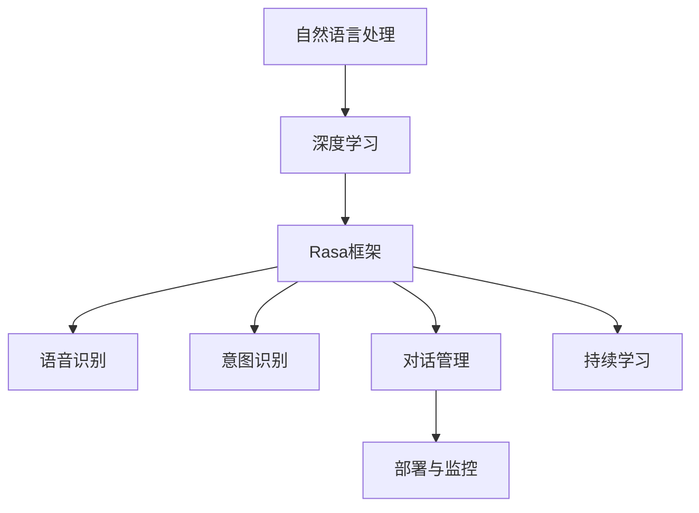
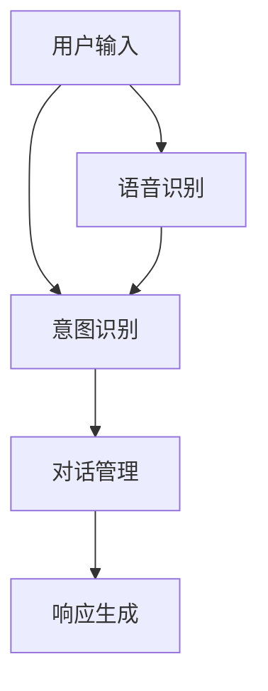

                 

# 构建你自己的聊天机器人：入门指南

> 关键词：聊天机器人, 自然语言处理(NLP), 深度学习, Rasa框架, 语音识别, 意图识别, 对话管理, 持续学习, 部署与监控

## 1. 背景介绍

### 1.1 问题由来
随着人工智能技术的发展，聊天机器人已经逐渐渗透到我们生活的各个方面。无论是企业的客户服务、在线咨询，还是个人的生活助手，聊天机器人在提升用户体验、提高工作效率方面都发挥着越来越重要的作用。然而，构建一个高性能、易于维护的聊天机器人并非易事。这需要理解自然语言处理(Natural Language Processing, NLP)的基本原理，掌握深度学习的算法，并且熟悉相关工具和框架。

### 1.2 问题核心关键点
构建聊天机器人主要涉及以下几个关键点：
- **自然语言处理(NLP)**：理解并处理人类语言，使机器能够进行自然对话。
- **深度学习**：通过神经网络学习模型的参数，提高模型的准确性和泛化能力。
- **Rasa框架**：开源的聊天机器人框架，提供了丰富的工具和库，简化开发过程。
- **语音识别**：将语音转换为文本，使得聊天机器人支持语音交互。
- **意图识别**：分析用户输入，理解用户的意图。
- **对话管理**：维护对话上下文，合理生成回复。
- **持续学习**：在实际对话中不断学习，提升模型的适应能力。
- **部署与监控**：将模型集成到生产环境，并实时监控系统性能。

### 1.3 问题研究意义
构建聊天机器人能够带来以下几方面的好处：
- **提升用户体验**：使机器能够理解和回应用户的输入，提供更自然、流畅的对话体验。
- **降低成本**：减少对人力客服的依赖，节省人力成本。
- **提高效率**：自动处理简单重复的任务，提高工作效率。
- **促进创新**：为产品设计、服务改进提供新的思路和工具。
- **推动技术进步**：加速NLP和AI技术的落地应用，促进整个领域的进步。

## 2. 核心概念与联系

### 2.1 核心概念概述

为了更好地理解聊天机器人的构建过程，本节将介绍几个关键概念及其相互关系。

- **自然语言处理(NLP)**：使机器能够理解、处理和生成自然语言，是构建聊天机器人的基础。
- **深度学习**：通过神经网络模型学习数据的特征表示，使得机器能够进行高效的分类、回归、序列建模等任务。
- **Rasa框架**：开源的聊天机器人框架，提供了一套完整的NLP和对话管理工具，支持自然语言理解、意图识别和对话管理等功能。
- **语音识别**：将语音信号转换为文本，使得聊天机器人能够理解用户的语音输入。
- **意图识别**：分析用户的意图，为聊天机器人提供正确的处理方向。
- **对话管理**：维护对话上下文，确保聊天机器人的回复逻辑连贯、合理。
- **持续学习**：在实际对话中不断学习，提升模型的适应能力和性能。
- **部署与监控**：将模型集成到生产环境，并实时监控系统性能，确保系统的稳定性和可靠性。

这些概念通过Mermaid流程图可以更好地展示其关系：



这个流程图展示了各个概念之间的逻辑关系：自然语言处理通过深度学习进行建模，使用Rasa框架进行意图识别和对话管理，语音识别和意图识别结合后进行对话管理，并通过持续学习不断优化模型。部署与监控确保模型的稳定性和可靠性。

## 3. 核心算法原理 & 具体操作步骤
### 3.1 算法原理概述

聊天机器人的构建主要涉及以下几个步骤：
1. 收集对话数据并进行预处理。
2. 使用深度学习模型对对话数据进行训练，构建意图识别和对话管理模型。
3. 集成语音识别模块，支持语音输入。
4. 将模型部署到生产环境，并实时监控系统性能。

### 3.2 算法步骤详解

**Step 1: 数据收集与预处理**

- 收集对话数据：通过日志文件、聊天记录等途径，收集用户与聊天机器人的对话数据。
- 数据清洗：去除无关信息和噪声，标准化数据格式。
- 划分数据集：将数据集划分为训练集、验证集和测试集。

**Step 2: 模型训练**

- 选择合适的模型：如使用RNN、LSTM、Transformer等模型进行意图识别和对话管理。
- 数据增强：通过回译、词干提取等方式扩充训练集，提高模型的泛化能力。
- 模型训练：在训练集上使用梯度下降等优化算法，训练模型。
- 模型验证：在验证集上评估模型性能，调整超参数。

**Step 3: 集成语音识别**

- 选择语音识别引擎：如Google Speech-to-Text、IBM Watson等。
- 语音转文本：将用户语音输入转换为文本。
- 文本预处理：使用分词、去停用词等技术处理文本数据。

**Step 4: 部署与监控**

- 模型部署：将训练好的模型部署到生产环境，如AWS、Google Cloud等。
- 持续学习：在实际对话中不断学习，提升模型的适应能力。
- 监控与优化：实时监控系统性能，及时发现和修复问题，优化系统性能。

### 3.3 算法优缺点

构建聊天机器人具有以下优点：
- **高效**：自动化处理简单重复的任务，提高工作效率。
- **成本低**：减少对人力客服的依赖，降低企业运营成本。
- **灵活**：可以根据实际需求进行调整和优化，适应不同的业务场景。

然而，也存在一些缺点：
- **技术门槛高**：需要一定的技术积累和专业知识，开发过程较为复杂。
- **依赖数据质量**：模型的效果很大程度上取决于训练数据的质量和数量，需要投入大量的精力进行数据收集和预处理。
- **可解释性不足**：聊天机器人的决策过程通常缺乏可解释性，难以对其推理逻辑进行分析和调试。

### 3.4 算法应用领域

聊天机器人在以下几个领域有广泛的应用：
- **客户服务**：支持24/7客服，提供快速响应和高效服务。
- **在线咨询**：为用户提供即时问答服务，解决常见问题。
- **个性化推荐**：根据用户的输入推荐相关内容，提高用户体验。
- **健康咨询**：提供医疗咨询、健康管理等服务。
- **金融服务**：提供账户查询、投资建议等服务。

## 4. 数学模型和公式 & 详细讲解 & 举例说明

### 4.1 数学模型构建

假设我们有一个简单的聊天机器人，其意图识别模型为：
- 输入：用户输入的文本。
- 输出：用户的意图标签。

我们使用RNN模型进行意图识别，模型的输入和输出为：
- 输入：$x = (x_1, x_2, ..., x_n)$
- 输出：$y = (y_1, y_2, ..., y_n)$

模型的结构为：
- 输入层：文本序列的嵌入表示。
- 隐藏层：LSTM网络。
- 输出层：softmax分类器。

### 4.2 公式推导过程

假设模型的隐藏层输出为$h_t$，根据LSTM网络的定义，有：
$$
h_t = \tanh(W_h \cdot [h_{t-1}, x_t] + b_h)
$$
其中$W_h, b_h$为LSTM网络中的参数。

假设模型的输出层为$y_t$，则有：
$$
y_t = \text{softmax}(W_y \cdot h_t + b_y)
$$
其中$W_y, b_y$为输出层的参数。

模型的损失函数通常使用交叉熵损失，定义为：
$$
L = -\frac{1}{N}\sum_{i=1}^N \sum_{j=1}^{C}y_{ij}\log p_{ij}
$$
其中$y_{ij}$表示样本$i$的标签为$j$的one-hot编码，$p_{ij}$表示模型预测的类别概率。

### 4.3 案例分析与讲解

以Google的Dialogflow为例，其意图识别和对话管理模型如下：
- 输入：用户输入的文本。
- 输出：用户的意图标签和对话上下文。

Dialogflow使用神经网络进行意图识别和对话管理，其架构如图1所示：



Dialogflow通过意图识别模块分析用户的输入，并根据上下文信息生成对话管理策略，最终生成机器人的回复。

## 5. 项目实践：代码实例和详细解释说明

### 5.1 开发环境搭建

首先，我们需要安装必要的开发环境，包括Python、pip、virtualenv、TensorFlow等。

```bash
# 安装Python和virtualenv
sudo apt-get install python3 python3-pip python3-venv

# 创建虚拟环境
python3 -m venv myenv
source myenv/bin/activate

# 安装TensorFlow
pip install tensorflow

# 安装Rasa
pip install rasa[chat]
```

### 5.2 源代码详细实现

下面我们以Rasa框架为例，给出聊天机器人的代码实现。

**NLU训练脚本**：
```python
from rasa.nlu import data
from rasa.nlu.model import Interpreter

# 加载训练数据
nlu_data = data.load('nlu.yml')

# 初始化NLU模型
nlu = Interpreter()

# 训练NLU模型
nlu.train(data)
```

**对话管理训练脚本**：
```python
from rasa.core.model import TrainingData
from rasa.core.agent import Agent
from rasa.core.agent import Dialogue
from rasa.nlu.model import Interpreter

# 加载训练数据
training_data = TrainingData.load('domain.yml')

# 初始化对话管理模型
agent = Agent.load('domain.yml')

# 训练对话管理模型
agent.train(training_data)
```

**部署脚本**：
```bash
# 将模型文件打包为Rasa包
rasa pack

# 启动Rasa服务器
rasa shell
```

### 5.3 代码解读与分析

我们以NLU训练为例，详细解读关键代码：

**nlu_data.load()**：
- 加载NLU训练数据，数据格式为YAML文件。
- 数据包括用户输入和对应的意图标签。

**Interpreter()**：
- 初始化NLU模型。
- Rasa的NLU模型使用TensorFlow作为后端，支持多种深度学习框架。

**nlu.train()**：
- 使用训练数据训练NLU模型。
- 训练过程中，模型会自动学习特征提取和意图分类。

### 5.4 运行结果展示

运行以上脚本，训练完成后，可以使用Rasa的shell工具进行测试：

```bash
rasa shell
```

在Rasa的shell中输入一些测试语句，验证模型的意图识别和对话管理功能。

## 6. 实际应用场景

### 6.1 智能客服

聊天机器人可以用于智能客服，处理客户的常见问题，如账户余额查询、订单状态追踪等。通过收集历史客服数据，进行意图识别和对话管理训练，聊天机器人能够快速响应客户需求，提升客户满意度。

### 6.2 在线咨询

在线咨询是聊天机器人的另一个重要应用场景。例如，在线教育平台可以使用聊天机器人提供学生咨询服务，回答学生的问题，提供课程推荐和预约等。

### 6.3 金融服务

聊天机器人可以用于金融咨询，如账户查询、投资建议、贷款申请等。通过收集客户的历史交易数据和行为数据，进行意图识别和对话管理训练，聊天机器人能够提供个性化的金融服务。

### 6.4 健康咨询

聊天机器人可以用于健康咨询，如疾病咨询、用药建议等。通过收集用户的健康数据和历史咨询记录，进行意图识别和对话管理训练，聊天机器人能够提供专业的健康建议和医疗服务。

## 7. 工具和资源推荐

### 7.1 学习资源推荐

为了帮助开发者系统掌握聊天机器人的开发和部署，以下是一些优质的学习资源：

- Rasa官方文档：提供了详细的教程和示例，帮助开发者快速上手。
- TensorFlow官方文档：提供了深度学习模型的开发和部署指南。
- Dialogflow官方文档：提供了意图识别和对话管理的开发指南。

### 7.2 开发工具推荐

以下是几款用于聊天机器人开发的常用工具：

- Rasa：开源的聊天机器人框架，提供了丰富的NLP和对话管理工具。
- TensorFlow：深度学习框架，支持多种模型和算法。
- Dialogflow：Google提供的聊天机器人平台，支持意图识别和对话管理。

### 7.3 相关论文推荐

聊天机器人的研究已经吸引了大量学者的关注，以下是几篇具有代表性的论文：

- "Deep Structured Network for Multimodal Dialogue Retrieval"：提出了一种基于深度学习的对话检索方法，用于多模态对话系统中。
- "Deep Neural Network for Intent Detection in a Task-oriented Dialogue System"：提出了一种深度学习模型，用于意图识别和对话管理。
- "Attention-based Matching Model for Conversational Machine Translation"：提出了一种基于注意力机制的对话生成模型，用于机器翻译。

## 8. 总结：未来发展趋势与挑战

### 8.1 总结

本文对构建聊天机器人的流程和方法进行了全面系统的介绍。首先阐述了聊天机器人构建的背景和意义，明确了聊天机器人各个模块的原理和相互关系。其次，从原理到实践，详细讲解了聊天机器人的数学模型和操作步骤，给出了Rasa框架的代码实现。同时，本文还探讨了聊天机器人在多个行业领域的应用场景，展示了其广阔的发展前景。最后，推荐了相关的学习资源和开发工具，力求为读者提供全方位的技术指引。

通过本文的系统梳理，可以看到，构建聊天机器人需要理解NLP和深度学习的原理，掌握Rasa框架的使用方法，并结合实际应用场景进行优化和调整。聊天机器人技术正在逐步成熟，将在未来的生产生活中扮演越来越重要的角色。

### 8.2 未来发展趋势

展望未来，聊天机器人技术将呈现以下几个发展趋势：

- **多模态交互**：支持语音、图像、视频等多种形式的输入和输出，提升用户体验。
- **深度学习模型**：使用更先进的深度学习模型，如Transformer、BERT等，提升模型的性能和泛化能力。
- **知识图谱**：引入知识图谱，提供更加丰富和准确的信息，增强聊天机器人的智能水平。
- **情感分析**：引入情感分析模块，理解用户的情感状态，提供更加个性化的服务。
- **持续学习**：在实际对话中不断学习，提升模型的适应能力和性能。
- **多语言支持**：支持多语言聊天，拓展全球市场。

以上趋势凸显了聊天机器人的广阔前景。这些方向的探索发展，必将进一步提升聊天机器人的性能和用户体验，为各行各业带来新的机遇和挑战。

### 8.3 面临的挑战

尽管聊天机器人技术已经取得了显著进展，但在迈向更加智能化、普适化应用的过程中，仍面临诸多挑战：

- **技术门槛高**：开发和部署聊天机器人需要较高的技术门槛，需要掌握NLP、深度学习、TensorFlow等技术。
- **依赖高质量数据**：模型的效果很大程度上取决于训练数据的质量和数量，数据收集和预处理是一个耗时的过程。
- **可解释性不足**：聊天机器人的决策过程缺乏可解释性，难以对其推理逻辑进行分析和调试。
- **鲁棒性差**：聊天机器人面对不同风格、不同领域的用户输入时，模型的泛化能力有限。
- **隐私保护**：聊天机器人需要处理大量用户数据，如何保护用户隐私是一个重要的课题。

### 8.4 研究展望

面对聊天机器人面临的这些挑战，未来的研究需要在以下几个方面寻求新的突破：

- **多模态交互技术**：研发更加智能的感知技术，提升聊天机器人的交互能力。
- **深度学习模型优化**：探索更加高效和鲁棒的深度学习模型，提升聊天机器人的性能。
- **知识图谱和语义分析**：结合知识图谱和语义分析技术，提升聊天机器人的理解能力和智能水平。
- **情感分析与心理模型**：引入情感分析模块和心理模型，提升聊天机器人的情感理解和个性化服务。
- **隐私保护和合规性**：研发隐私保护和合规性技术，确保用户数据的安全。

这些研究方向的探索，必将引领聊天机器人技术迈向更高的台阶，为构建更加智能、普适、安全的聊天机器人提供新的思路和方法。

## 9. 附录：常见问题与解答

**Q1: 聊天机器人需要多少数据进行训练？**

A: 聊天机器人的训练数据量取决于任务复杂度和模型大小。一般来说，至少需要数千条数据进行训练，才能保证模型的泛化能力和性能。

**Q2: 如何处理用户输入的多样性？**

A: 可以使用数据增强、词干提取、停用词过滤等技术处理用户输入，减少噪声和冗余信息。此外，可以使用深度学习模型学习用户的输入特征，提升模型的泛化能力。

**Q3: 如何保证聊天机器人的可解释性？**

A: 可以在模型中添加可解释性模块，如LIME、SHAP等，对模型的决策过程进行解释和分析。此外，可以引入人类专家进行审核和修正，确保聊天机器人的输出符合人类价值观和伦理道德。

**Q4: 如何保证聊天机器人的隐私保护？**

A: 可以使用数据脱敏、加密存储等技术，保护用户数据的安全。此外，需要制定严格的隐私保护政策，确保用户数据的合规性和透明性。

**Q5: 如何优化聊天机器人的响应速度？**

A: 可以使用模型裁剪、量化加速、混合精度训练等技术，优化模型的计算效率和资源占用。此外，可以使用多模型并行、异步处理等技术，提升系统的响应速度。

通过以上常见问题的解答，我们可以看到，构建聊天机器人需要综合考虑数据质量、模型选择、技术实现等多个因素，不断优化和调整，方能得到理想的效果。

---

作者：禅与计算机程序设计艺术 / Zen and the Art of Computer Programming

