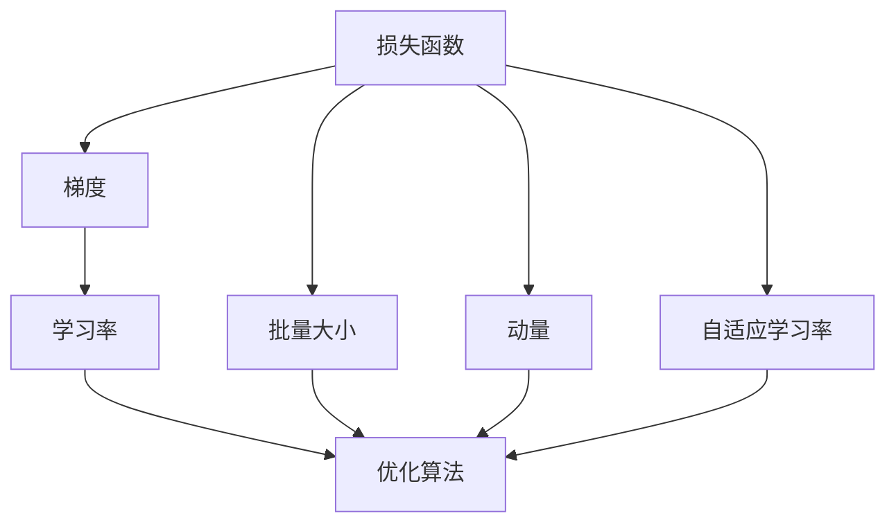

                 

## 1. 背景介绍

### 1.1 问题由来

在深度学习中，优化算法是核心技术之一，梯度下降算法（Gradient Descent, GD）是最基本也是最常用的优化算法之一。自1960年提出以来，其在机器学习领域得到了广泛应用。然而，随着深度学习模型复杂度的提升，传统的GD算法已无法满足大模型和大规模数据集的需求，因此出现了多种改进的梯度下降算法。

### 1.2 问题核心关键点

梯度下降优化算法的核心是使用梯度信息更新模型参数，逐步逼近损失函数的极小值点。而该算法又分为批量梯度下降（Batch Gradient Descent, BGD）、随机梯度下降（Stochastic Gradient Descent, SGD）和小批量梯度下降（Mini-batch Gradient Descent）等几种常见形式。

- **批量梯度下降**：每次使用全批量的梯度更新模型参数。适用于小规模数据集，但计算代价高，收敛速度慢。
- **随机梯度下降**：每次仅使用一个样本的梯度更新参数。计算代价低，收敛速度快，但更新方向不稳定，导致震荡。
- **小批量梯度下降**：每次使用一小批样本的梯度更新参数。计算代价适中，收敛速度快，更新方向稳定。

本节将详细介绍SGD和Adam这两种改进的梯度下降算法，并探讨其原理、步骤和应用场景。

### 1.3 问题研究意义

理解梯度下降算法及其改进方法，对于掌握深度学习中的优化技术具有重要意义：

1. **提升模型训练效率**：优化算法直接影响模型的收敛速度和训练效果。优化算法的选择和调参对模型的训练和推理性能有着至关重要的影响。
2. **拓展模型应用场景**：不同的优化算法适用于不同的深度学习模型和数据集，选择合适的优化算法可以充分发挥模型的潜力和性能。
3. **保障模型稳定性**：优化算法的选择影响模型的泛化性能和鲁棒性，合理的优化算法可以避免模型在训练过程中出现不稳定性。
4. **应对复杂模型需求**：随着深度学习模型复杂度的提升，传统的优化算法无法满足需求，需要引入更先进的优化算法。
5. **加速研究迭代进程**：优化算法是深度学习研究的核心技术，不断探索新的优化算法，可以加速模型的开发和应用。

## 2. 核心概念与联系

### 2.1 核心概念概述

为了更好地理解梯度下降算法及其改进方法，本节将介绍几个密切相关的核心概念：

- **损失函数**：用于衡量模型预测输出与真实标签之间的差异，是优化算法的重要目标。
- **梯度**：表示损失函数在当前参数点的变化率，用于指导参数的更新方向。
- **学习率**：控制参数更新的步长，影响模型的收敛速度和稳定性。
- **优化算法**：通过计算梯度和更新参数，逐步逼近损失函数的极小值点，如SGD、Adam等。
- **批量大小**：决定每次更新使用的样本数，影响计算代价和收敛速度。
- **动量（Momentum）**：用于模拟物理动量，加速收敛，减小震荡。
- **自适应学习率**：根据梯度的大小和方向，动态调整学习率，如Adagrad、Adam等。

这些概念之间的逻辑关系可以通过以下Mermaid流程图来展示：



这个流程图展示了几大核心概念之间的联系，有助于我们理解梯度下降算法的实现过程。

## 3. 核心算法原理 & 具体操作步骤

### 3.1 算法原理概述

梯度下降算法的基本思想是：通过计算损失函数对参数的梯度，以学习率控制参数更新的步长，逐步逼近损失函数的极小值点。在每次更新参数时，梯度可以表示为：

$$
\mathbf{g} = \nabla_{\theta} \mathcal{L}(\theta)
$$

其中，$\mathcal{L}(\theta)$ 是损失函数，$\theta$ 为模型参数。梯度下降算法通过以下迭代公式更新参数：

$$
\theta_{t+1} = \theta_t - \eta \nabla_{\theta} \mathcal{L}(\theta_t)
$$

其中，$\eta$ 为学习率，$t$ 表示迭代次数。

### 3.2 算法步骤详解

梯度下降算法的具体步骤如下：

1. **初始化模型参数**：随机初始化模型参数 $\theta$。
2. **计算梯度**：计算当前参数点处的梯度 $\mathbf{g}$。
3. **更新参数**：根据梯度和学习率更新参数 $\theta_{t+1} = \theta_t - \eta \mathbf{g}$。
4. **迭代更新**：重复第2和第3步，直至达到收敛条件或达到预设的迭代次数。

### 3.3 算法优缺点

梯度下降算法具有以下优点：

- **通用性强**：适用于各种损失函数和优化目标。
- **易于实现**：计算梯度和更新参数的公式简单，易于实现。
- **理论成熟**：数学理论较为成熟，有完备的收敛性分析。

同时，梯度下降算法也存在一些缺点：

- **收敛速度慢**：特别是面对复杂函数或高维度参数空间时，收敛速度较慢。
- **震荡现象**：当梯度方向不稳定时，参数更新可能出现震荡。
- **学习率敏感**：对学习率的选择比较敏感，学习率过小可能导致收敛缓慢，过大会导致震荡甚至发散。
- **局部最优**：存在局部最优解的风险，不一定能找到全局最优解。

### 3.4 算法应用领域

梯度下降算法在深度学习领域有着广泛的应用，包括但不限于以下几个方面：

1. **神经网络训练**：用于训练神经网络模型，优化损失函数。
2. **图像处理**：用于优化图像识别和处理算法。
3. **自然语言处理**：用于优化语言模型和文本处理算法。
4. **强化学习**：用于优化强化学习算法，如Q-learning、SARSA等。
5. **推荐系统**：用于优化推荐模型，提升推荐效果。
6. **金融建模**：用于优化金融预测和风险评估模型。
7. **计算机视觉**：用于优化计算机视觉算法，如目标检测、分割等。

## 4. 数学模型和公式 & 详细讲解 & 举例说明

### 4.1 数学模型构建

梯度下降算法是一个典型的一阶优化算法，其数学模型较为简单。在本节中，我们将使用数学语言对梯度下降算法进行更加严格的刻画。

记损失函数为 $\mathcal{L}(\theta)$，其中 $\theta$ 为模型参数。梯度下降算法的优化目标是最小化损失函数，即找到最优参数：

$$
\theta^* = \mathop{\arg\min}_{\theta} \mathcal{L}(\theta)
$$

根据梯度下降算法的基本思想，每次迭代更新参数的公式为：

$$
\theta_{t+1} = \theta_t - \eta \nabla_{\theta} \mathcal{L}(\theta_t)
$$

其中，$\nabla_{\theta} \mathcal{L}(\theta_t)$ 为损失函数在当前参数点处的梯度，$\eta$ 为学习率。

### 4.2 公式推导过程

以下是梯度下降算法的推导过程：

首先，根据损失函数的定义，损失函数对参数 $\theta$ 的梯度为：

$$
\nabla_{\theta} \mathcal{L}(\theta) = \frac{\partial \mathcal{L}(\theta)}{\partial \theta}
$$

然后，将梯度代入梯度下降算法的基本迭代公式：

$$
\theta_{t+1} = \theta_t - \eta \frac{\partial \mathcal{L}(\theta_t)}{\partial \theta}
$$

对于具体的神经网络模型，损失函数通常由权重矩阵和偏置向量等参数构成。当模型具有 $n$ 个参数时，梯度下降算法的更新公式可以写为：

$$
\mathbf{\theta}_{t+1} = \mathbf{\theta}_t - \eta \frac{\partial \mathcal{L}(\mathbf{\theta}_t)}{\partial \mathbf{\theta}} = \mathbf{\theta}_t - \eta \mathbf{g}_t
$$

其中，$\mathbf{\theta}_t$ 为第 $t$ 次迭代时的参数向量，$\mathbf{g}_t$ 为第 $t$ 次迭代的梯度向量，$n$ 为模型参数的维数。

### 4.3 案例分析与讲解

以下是一个使用梯度下降算法训练线性回归模型的示例：

假设我们有训练数据 $\{(x_1, y_1), (x_2, y_2), \ldots, (x_m, y_m)\}$，其中 $x_i$ 为输入特征，$y_i$ 为输出标签。我们希望找到一组最优的权重 $\theta = [\theta_0, \theta_1]$，使得线性回归模型 $y = \theta_0 + \theta_1 x$ 最小化损失函数 $L(\theta) = \frac{1}{2m} \sum_{i=1}^m (y_i - (\theta_0 + \theta_1 x_i))^2$。

首先，对损失函数求导得到梯度：

$$
\nabla_{\theta} L(\theta) = \begin{bmatrix} \frac{\partial L(\theta)}{\partial \theta_0} \\ \frac{\partial L(\theta)}{\partial \theta_1} \end{bmatrix} = \begin{bmatrix} \frac{1}{m} \sum_{i=1}^m (y_i - \theta_0 - \theta_1 x_i) \\ \frac{1}{m} \sum_{i=1}^m (y_i - \theta_0 - \theta_1 x_i) x_i \end{bmatrix}
$$

然后，使用梯度下降算法更新参数：

$$
\begin{bmatrix} \theta_{0,t+1} \\ \theta_{1,t+1} \end{bmatrix} = \begin{bmatrix} \theta_{0,t} \\ \theta_{1,t} \end{bmatrix} - \eta \begin{bmatrix} \frac{1}{m} \sum_{i=1}^m (y_i - \theta_{0,t} - \theta_{1,t} x_i) \\ \frac{1}{m} \sum_{i=1}^m (y_i - \theta_{0,t} - \theta_{1,t} x_i) x_i \end{bmatrix}
$$

其中，$\eta$ 为学习率，$m$ 为样本数。通过多次迭代，我们可以逐步逼近最优参数 $\theta^*$，使得模型能够很好地拟合训练数据。

## 5. 项目实践：代码实例和详细解释说明

### 5.1 开发环境搭建

在进行梯度下降算法实践前，我们需要准备好开发环境。以下是使用Python进行PyTorch开发的环境配置流程：

1. 安装Anaconda：从官网下载并安装Anaconda，用于创建独立的Python环境。

2. 创建并激活虚拟环境：
```bash
conda create -n pytorch-env python=3.8 
conda activate pytorch-env
```

3. 安装PyTorch：根据CUDA版本，从官网获取对应的安装命令。例如：
```bash
conda install pytorch torchvision torchaudio cudatoolkit=11.1 -c pytorch -c conda-forge
```

4. 安装Transformers库：
```bash
pip install transformers
```

5. 安装各类工具包：
```bash
pip install numpy pandas scikit-learn matplotlib tqdm jupyter notebook ipython
```

完成上述步骤后，即可在`pytorch-env`环境中开始梯度下降算法的实践。

### 5.2 源代码详细实现

下面我们以线性回归模型为例，给出使用PyTorch进行梯度下降算法的PyTorch代码实现。

首先，定义线性回归模型：

```python
import torch
import torch.nn as nn

class LinearRegression(nn.Module):
    def __init__(self, n_features):
        super(LinearRegression, self).__init__()
        self.linear = nn.Linear(n_features, 1)
    
    def forward(self, x):
        return self.linear(x)
```

然后，定义损失函数和优化器：

```python
from torch.optim import SGD

def mse_loss(y_true, y_pred):
    return ((y_true - y_pred) ** 2).mean()

model = LinearRegression(2)
optimizer = SGD(model.parameters(), lr=0.01)
```

接着，定义训练和评估函数：

```python
device = torch.device('cuda' if torch.cuda.is_available() else 'cpu')
model.to(device)

def train(model, data_loader, optimizer, n_epochs):
    model.train()
    for epoch in range(n_epochs):
        total_loss = 0
        for data, target in data_loader:
            data, target = data.to(device), target.to(device)
            optimizer.zero_grad()
            output = model(data)
            loss = mse_loss(target, output)
            loss.backward()
            optimizer.step()
            total_loss += loss.item()
        print(f'Epoch {epoch+1}, loss: {total_loss/n_epochs:.4f}')

def evaluate(model, data_loader):
    model.eval()
    total_loss = 0
    with torch.no_grad():
        for data, target in data_loader:
            data, target = data.to(device), target.to(device)
            output = model(data)
            loss = mse_loss(target, output)
            total_loss += loss.item()
    print(f'Test loss: {total_loss/n_epochs:.4f}')
```

最后，启动训练流程并在测试集上评估：

```python
import torch.utils.data as data
from torch.utils.data import DataLoader
import numpy as np

# 定义训练数据
train_data = np.random.randn(100, 2)
train_target = np.dot(train_data, [0.5, 1.5]) + 1

# 定义数据集
train_dataset = data.TensorDataset(torch.from_numpy(train_data), torch.from_numpy(train_target))
train_loader = DataLoader(train_dataset, batch_size=16, shuffle=True)

# 启动训练
train(model, train_loader, optimizer, 100)

# 评估测试集
test_data = np.random.randn(100, 2)
test_target = np.dot(test_data, [0.5, 1.5]) + 1
test_dataset = data.TensorDataset(torch.from_numpy(test_data), torch.from_numpy(test_target))
test_loader = DataLoader(test_dataset, batch_size=16, shuffle=False)
evaluate(model, test_loader)
```

以上就是使用PyTorch进行梯度下降算法实践的完整代码实现。可以看到，借助PyTorch的高级API，我们能够较为轻松地实现梯度下降算法，并通过训练和评估函数进一步简化操作。

### 5.3 代码解读与分析

让我们再详细解读一下关键代码的实现细节：

**LinearRegression类**：
- `__init__`方法：初始化线性回归模型，包括权重矩阵。
- `forward`方法：定义前向传播过程，计算模型输出。

**mse_loss函数**：
- 自定义均方误差损失函数，用于衡量预测值和真实值之间的差距。

**train函数**：
- 在训练过程中，先进行模型前向传播计算损失，然后反向传播计算梯度，并使用SGD优化器更新模型参数。

**evaluate函数**：
- 在评估过程中，同样进行模型前向传播计算损失，但不更新模型参数，只返回损失值。

通过上述代码，我们可以将梯度下降算法应用于线性回归模型的训练和评估，实现对实际问题的求解。

## 6. 实际应用场景

### 6.1 深度学习模型训练

梯度下降算法在深度学习模型训练中得到了广泛应用，特别是用于优化神经网络模型。在深度学习模型训练中，梯度下降算法的具体形式包括批量梯度下降、随机梯度下降和小批量梯度下降等。

- **批量梯度下降**：适用于小规模数据集，收敛速度较慢，但更新方向稳定，一般用于初始化阶段。
- **随机梯度下降**：适用于大规模数据集，收敛速度快，但更新方向不稳定，容易出现震荡。
- **小批量梯度下降**：综合了批量梯度下降和随机梯度下降的优点，更新方向稳定，收敛速度快，是深度学习模型训练中常用的算法。

### 6.2 强化学习算法

梯度下降算法在强化学习中也有重要应用，特别是用于优化Q-learning等算法。在Q-learning中，梯度下降算法用于优化Q表，使得Q值收敛到最优值，从而实现对环境的有效学习。

### 6.3 图像处理

梯度下降算法在图像处理中也有广泛应用，特别是用于优化图像识别和处理算法。在图像处理中，梯度下降算法可以用于优化卷积神经网络（CNN）等模型，使得模型能够更好地学习图像特征，提高图像处理效果。

## 7. 工具和资源推荐

### 7.1 学习资源推荐

为了帮助开发者系统掌握梯度下降算法的理论基础和实践技巧，这里推荐一些优质的学习资源：

1. 《Deep Learning》一书：由深度学习领域的权威学者Goodfellow等编著，全面介绍了深度学习的基本原理和算法，包括梯度下降算法的详细推导和应用。

2. 《Neural Networks and Deep Learning》一书：由Coursera《深度学习专项课程》的主讲人Goodfellow编著，涵盖了深度学习的基础知识和实践技能，包括梯度下降算法的实现和优化。

3. Coursera《Machine Learning》课程：由斯坦福大学教授Andrew Ng主讲，系统介绍了机器学习的基本概念和算法，包括梯度下降算法的详细讲解和实践案例。

4. DeepLearning.ai《深度学习专项课程》：由深度学习领域的权威学者Goodfellow、Bengio、Hinton等主讲，涵盖了深度学习的基础知识和实践技能，包括梯度下降算法的实现和优化。

5. TensorFlow官方文档：提供了TensorFlow框架的详细介绍和优化算法的使用指南，包括梯度下降算法的实现和优化。

通过对这些资源的学习实践，相信你一定能够快速掌握梯度下降算法的精髓，并用于解决实际的深度学习问题。

### 7.2 开发工具推荐

高效的开发离不开优秀的工具支持。以下是几款用于梯度下降算法开发的常用工具：

1. PyTorch：基于Python的开源深度学习框架，灵活动态的计算图，适合快速迭代研究。大部分深度学习模型都有PyTorch版本的实现。

2. TensorFlow：由Google主导开发的开源深度学习框架，生产部署方便，适合大规模工程应用。同样有丰富的深度学习模型资源。

3. Keras：基于TensorFlow、Theano等深度学习框架的高层API，提供了简单易用的模型构建接口，适合快速原型开发。

4. MXNet：由Apache开发的深度学习框架，支持分布式训练，适合大规模分布式系统。

5. JAX：由Google开发的Python深度学习框架，支持动态计算图和自动微分，适合研究优化算法。

合理利用这些工具，可以显著提升梯度下降算法的开发效率，加快创新迭代的步伐。

### 7.3 相关论文推荐

梯度下降算法在深度学习领域有着广泛的应用，以下是几篇奠基性的相关论文，推荐阅读：

1. On the importance of initialization and momentum in deep learning：探讨了学习率和动量对深度学习模型的影响，提出了动量算法。

2. Adaptive Moment Estimation（AdaGrad）：提出了AdaGrad算法，自适应调整学习率，适应不同特征的更新需求。

3. RMSprop：提出了RMSprop算法，结合了动量和AdaGrad的优点，适应不同特征的更新需求。

4. Adaptive Moment Estimation with Variable Learning Rates（Adam）：提出了Adam算法，结合了动量、AdaGrad和自适应学习率的优势，成为梯度下降算法中的佼佼者。

这些论文代表了大规模梯度下降算法的发展脉络。通过学习这些前沿成果，可以帮助研究者把握学科前进方向，激发更多的创新灵感。

## 8. 总结：未来发展趋势与挑战

### 8.1 总结

本文对梯度下降算法及其改进方法进行了全面系统的介绍。首先阐述了梯度下降算法的背景和意义，明确了梯度下降在深度学习模型优化中的重要地位。其次，从原理到实践，详细讲解了SGD和Adam两种改进的梯度下降算法，给出了梯度下降算法的完整代码实例。同时，本文还广泛探讨了梯度下降算法在深度学习、强化学习、图像处理等多个领域的应用前景，展示了梯度下降算法的广泛适用性。

通过本文的系统梳理，可以看到，梯度下降算法及其改进方法在深度学习中有着举足轻重的地位，极大地推动了深度学习技术的发展。未来，伴随深度学习技术的不断进步，梯度下降算法也将不断优化，为更复杂的深度学习模型提供更高效的优化手段。

### 8.2 未来发展趋势

展望未来，梯度下降算法的演进和发展趋势主要包括以下几个方面：

1. **多任务学习**：梯度下降算法将更加注重多任务学习，使得模型能够同时优化多个目标函数，提高模型的泛化性能和鲁棒性。

2. **自适应学习率**：自适应学习率算法（如Adagrad、Adam等）将进一步发展，使得学习率能够根据梯度的变化自动调整，提升优化效果和收敛速度。

3. **分布式优化**：随着深度学习模型规模的不断扩大，分布式优化技术将成为主流，梯度下降算法将更好地支持分布式训练，提高模型训练效率。

4. **混合优化**：结合不同的优化算法，如梯度下降算法、动量算法、自适应学习率算法等，混合优化算法将成为新的研究方向。

5. **联邦学习**：在隐私保护和数据共享场景中，联邦学习技术将发挥重要作用，梯度下降算法将更好地支持联邦学习框架，实现分布式优化。

6. **动态计算图**：动态计算图技术（如JAX）将进一步发展，梯度下降算法将更好地支持动态计算图和自动微分，提高模型训练效率。

以上趋势凸显了梯度下降算法的未来发展方向，这些方向的探索发展，必将进一步提升深度学习模型的性能和应用范围，为人工智能技术的发展提供更强大的支持。

### 8.3 面临的挑战

尽管梯度下降算法已经取得了瞩目成就，但在应用过程中，仍面临以下挑战：

1. **超参数调优**：梯度下降算法需要选择合适的学习率和批量大小等超参数，这些超参数的选择需要依赖大量的实验和经验。

2. **过拟合和欠拟合**：在优化过程中，模型容易出现过拟合或欠拟合现象，需要采取一些正则化技术和模型选择方法，避免过拟合。

3. **计算资源消耗**：大规模深度学习模型和复杂优化算法对计算资源的需求较高，需要采用高性能计算设备和分布式计算技术。

4. **模型训练稳定性**：在优化过程中，模型容易受到噪声和随机因素的影响，导致训练不稳定性，需要采用一些优化技术，提高模型训练的稳定性和可靠性。

5. **可解释性**：深度学习模型的训练过程往往缺乏可解释性，难以解释模型内部工作机制和决策逻辑，需要采用一些解释性技术，提高模型的可解释性。

6. **模型鲁棒性**：深度学习模型在面对噪声和异常数据时，容易产生鲁棒性问题，需要采用一些鲁棒性技术，提高模型的稳定性和可靠性。

正视梯度下降算法面临的这些挑战，积极应对并寻求突破，将是大规模深度学习模型和复杂优化算法不断发展的关键。相信随着学界和产业界的共同努力，这些挑战终将一一被克服，梯度下降算法必将在未来深度学习技术的发展中发挥更大的作用。

### 8.4 研究展望

面对梯度下降算法面临的种种挑战，未来的研究需要在以下几个方面寻求新的突破：

1. **优化算法创新**：探索新的优化算法，如Adaptive Moment Estimation（Adam）、AdaGrad、RMSprop等，进一步提升优化效果和收敛速度。

2. **混合优化方法**：结合不同的优化算法，如梯度下降算法、动量算法、自适应学习率算法等，实现混合优化，提高优化效果和收敛速度。

3. **模型压缩和稀疏化**：采用模型压缩和稀疏化技术，减少模型参数量和计算资源消耗，提高模型训练效率。

4. **分布式优化**：探索分布式优化技术，如联邦学习、分布式梯度下降算法等，提高模型训练效率和模型鲁棒性。

5. **动态计算图和自动微分**：探索动态计算图和自动微分技术，如JAX、TensorFlow等，提高模型训练效率和模型鲁棒性。

6. **自适应学习率**：探索自适应学习率算法，如Adagrad、Adam等，根据梯度的变化自动调整学习率，提高模型训练效率和模型鲁棒性。

这些研究方向的探索，必将引领梯度下降算法不断优化，为深度学习模型提供更高效的优化手段。只有勇于创新、敢于突破，才能不断拓展深度学习模型的边界，推动人工智能技术的发展。

## 9. 附录：常见问题与解答

**Q1：什么是梯度下降算法？**

A: 梯度下降算法是一种基于梯度信息进行模型参数更新的优化算法，用于最小化损失函数。梯度下降算法通过迭代计算损失函数对参数的梯度，并使用学习率控制参数更新的步长，逐步逼近损失函数的极小值点。

**Q2：什么是学习率？**

A: 学习率是控制参数更新的步长，影响模型收敛速度和稳定性。学习率过大会导致模型发散，过小会导致模型收敛缓慢。在梯度下降算法中，学习率需要根据具体问题和数据集进行调参，一般通过实验选择最优值。

**Q3：什么是动量（Momentum）？**

A: 动量是一种优化技巧，用于模拟物理动量，加速收敛，减小震荡。动量算法通过累积之前的梯度信息，在更新参数时增加惯性，使得模型能够更加稳定地收敛。

**Q4：什么是自适应学习率？**

A: 自适应学习率算法根据梯度的变化自动调整学习率，适应不同特征的更新需求，提高优化效果和收敛速度。常用的自适应学习率算法包括Adagrad、Adam等。

**Q5：什么是联邦学习？**

A: 联邦学习是一种分布式学习技术，在数据隐私和安全保护的前提下，将模型训练分布在多个设备上，每个设备只上传局部梯度，保护数据隐私。联邦学习可以有效地解决数据分布不均、隐私保护等问题，适用于分布式系统和数据共享场景。

通过上述附录，相信你能够更好地理解梯度下降算法及其改进方法，并能够在实际应用中灵活运用。梯度下降算法作为深度学习中重要的优化算法，将继续发挥关键作用，推动人工智能技术的发展。

