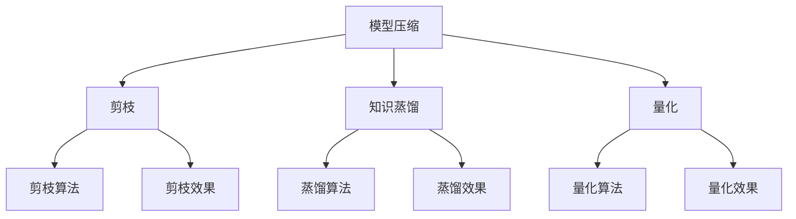

                 

# 模型压缩技术：剪枝、知识蒸馏和量化

## 1. 背景介绍

### 1.1 问题由来

随着深度学习模型在各个领域中的广泛应用，模型的大小已经成为了一个限制因素。大模型通常需要大量的计算资源和存储空间，在移动设备和嵌入式系统等资源受限的场景中，模型的体积成为了制约其部署和应用的关键因素。

为此，模型压缩技术（Model Compression）应运而生。模型压缩的目的是在不损失模型性能的前提下，减小模型的大小，降低模型的计算复杂度，从而提升模型的效率和部署可行性。

模型压缩技术主要包括三个方向：剪枝（Pruning）、知识蒸馏（Knowledge Distillation）和量化（Quantization）。这三个方向分别从不同角度对模型进行压缩，具有不同的原理和应用场景。

### 1.2 问题核心关键点

模型压缩的核心在于如何在减小模型大小的同时保持模型性能。不同的压缩方法各有优缺点，需要根据具体的场景选择合适的压缩策略。

- 剪枝：通过移除冗余的权重和连接，直接减小模型的大小。
- 知识蒸馏：通过将一个大型模型的知识传递给一个小型模型，提高小型模型的性能。
- 量化：通过将模型的权重和激活值转化为低精度的数值表示，减小模型大小和计算复杂度。

这三个方向可以单独使用，也可以结合使用，以达到更好的压缩效果。

## 2. 核心概念与联系

### 2.1 核心概念概述

为更好地理解模型压缩技术的核心概念，本节将介绍几个密切相关的核心概念：

- 模型压缩(Model Compression)：在不损失模型性能的前提下，减小模型的大小和计算复杂度。
- 剪枝(Pruning)：通过移除冗余的权重和连接，减小模型的大小，提高模型效率。
- 知识蒸馏(Knowledge Distillation)：通过将一个大型模型的知识传递给一个小型模型，提高小型模型的性能。
- 量化(Quantization)：通过将模型的权重和激活值转化为低精度的数值表示，减小模型大小和计算复杂度。
- 浮点数(Floating Point)：常见的数值表示形式，如float32、float16等，精度较高但占用的存储空间较大。
- 整数(Quantized Integer)：低精度的数值表示形式，如int8、int16等，占用存储空间较小但精度较低。

这些核心概念之间的逻辑关系可以通过以下Mermaid流程图来展示：



这个流程图展示了你网络压缩的核心概念及其之间的关系：

1. 模型压缩是最终目标，包括剪枝、知识蒸馏和量化等多种方法。
2. 剪枝是减少模型参数和计算量的主要手段。
3. 知识蒸馏是从大模型向小模型传递知识的过程。
4. 量化是通过降低数值精度来减小模型体积。

这些核心概念共同构成了模型压缩技术的框架，使其能够在不同的场景下进行有效的压缩。

## 3. 核心算法原理 & 具体操作步骤

### 3.1 算法原理概述

模型压缩技术的核心在于如何在减小模型大小的同时保持模型性能。不同的压缩方法各有优缺点，需要根据具体的场景选择合适的压缩策略。

- 剪枝：通过移除冗余的权重和连接，直接减小模型的大小。
- 知识蒸馏：通过将一个大型模型的知识传递给一个小型模型，提高小型模型的性能。
- 量化：通过将模型的权重和激活值转化为低精度的数值表示，减小模型大小和计算复杂度。

这三个方向可以单独使用，也可以结合使用，以达到更好的压缩效果。

### 3.2 算法步骤详解

#### 剪枝算法步骤：

1. 选择剪枝策略：常用的剪枝策略包括L1正则化、L2正则化、阈值剪枝等。
2. 计算剪枝权重：根据剪枝策略计算每个权重的重要性，确定需要保留的权重。
3. 移除冗余连接：根据保留的权重移除相应的连接。
4. 验证剪枝效果：在验证集上评估剪枝后模型的性能，决定是否保留剪枝结果。

#### 知识蒸馏算法步骤：

1. 选择合适的知识源和知识目标：知识源可以是大型预训练模型，知识目标可以是小型模型。
2. 训练知识源模型：在训练集上训练知识源模型。
3. 计算知识蒸馏损失：根据知识源模型的输出计算知识蒸馏损失。
4. 更新知识目标模型：使用知识蒸馏损失更新知识目标模型的参数。
5. 验证蒸馏效果：在测试集上评估蒸馏后模型的性能，决定是否继续蒸馏。

#### 量化算法步骤：

1. 选择量化方法：常用的量化方法包括权重量化、激活量化、混合量化等。
2. 计算量化位数：根据量化方法计算每个权重和激活的位数。
3. 转化数值表示：将权重和激活转化为低精度的数值表示。
4. 验证量化效果：在测试集上评估量化后模型的性能，决定是否继续量化。

### 3.3 算法优缺点

剪枝算法优点：
- 直接减小模型大小，提高计算效率。
- 可以减少计算资源和存储空间的使用。

剪枝算法缺点：
- 可能会丢失模型中的有用信息，影响模型性能。
- 剪枝过程需要大量的计算和存储空间，可能导致额外的计算开销。

知识蒸馏算法优点：
- 可以通过小模型学习大模型的知识，提高模型性能。
- 可以减小模型的计算复杂度，降低计算资源和存储空间的使用。

知识蒸馏算法缺点：
- 需要较长的训练时间和更多的计算资源。
- 可能会出现知识传递过程中的误差，影响模型性能。

量化算法优点：
- 减小模型大小和计算复杂度，降低计算资源和存储空间的使用。
- 可以加速模型的推理过程。

量化算法缺点：
- 可能会引入精度损失，影响模型性能。
- 量化后的模型可能无法在小规模数据上得到良好的泛化性能。

### 3.4 算法应用领域

模型压缩技术广泛应用于计算机视觉、自然语言处理、语音识别等多个领域，可以显著提升模型的性能和效率。

- 计算机视觉：在图像分类、目标检测、图像分割等任务中，剪枝、知识蒸馏和量化方法可以有效减小模型体积，提高模型推理速度。
- 自然语言处理：在机器翻译、文本分类、问答系统等任务中，模型压缩技术可以提升模型的性能和效率，降低计算资源和存储空间的使用。
- 语音识别：在语音识别任务中，剪枝、知识蒸馏和量化方法可以有效减小模型体积，提高模型推理速度，提升语音识别的准确率和响应速度。

此外，模型压缩技术还在嵌入式设备、移动设备、物联网等资源受限的场景中得到了广泛应用。

## 4. 数学模型和公式 & 详细讲解 & 举例说明

### 4.1 数学模型构建

模型压缩的数学模型主要涉及权重剪枝、知识蒸馏和量化三个方面。

#### 剪枝的数学模型：

假设模型的权重矩阵为 $W$，每个权重 $w_i$ 的权重系数为 $c_i$，则剪枝后的权重矩阵 $W'$ 可以表示为：

$$
W' = W_{\mathcal{F}}
$$

其中，$\mathcal{F}$ 是保留的权重集合，即：

$$
\mathcal{F} = \{w_i | c_i > \theta\}
$$

其中，$\theta$ 是阈值，$w_i$ 是模型中第 $i$ 个权重。

#### 知识蒸馏的数学模型：

知识蒸馏的目标是将知识源模型 $M_{\text{src}}$ 的知识传递给知识目标模型 $M_{\text{tgt}}$。假设知识源模型的输出为 $h_{\text{src}}$，知识目标模型的输出为 $h_{\text{tgt}}$，则知识蒸馏的目标函数为：

$$
L_{\text{distill}} = H(h_{\text{src}}, h_{\text{tgt}})
$$

其中，$H$ 是知识蒸馏损失函数，如交叉熵损失、均方误差损失等。

#### 量化的数学模型：

量化后的权重 $w'$ 可以表示为：

$$
w' = \text{Quant}(w)
$$

其中，$\text{Quant}$ 是量化函数，可以根据具体的量化方法选择不同的函数。

### 4.2 公式推导过程

#### 剪枝公式推导：

假设 $W$ 是原始权重矩阵，$W'$ 是剪枝后的权重矩阵，则剪枝后的矩阵可以表示为：

$$
W' = W_{\mathcal{F}}
$$

其中，$\mathcal{F}$ 是保留的权重集合，即：

$$
\mathcal{F} = \{w_i | c_i > \theta\}
$$

其中，$c_i$ 是第 $i$ 个权重的权重系数，$\theta$ 是阈值。

#### 知识蒸馏公式推导：

知识蒸馏的目标是将知识源模型 $M_{\text{src}}$ 的知识传递给知识目标模型 $M_{\text{tgt}}$。假设知识源模型的输出为 $h_{\text{src}}$，知识目标模型的输出为 $h_{\text{tgt}}$，则知识蒸馏的目标函数为：

$$
L_{\text{distill}} = H(h_{\text{src}}, h_{\text{tgt}})
$$

其中，$H$ 是知识蒸馏损失函数，如交叉熵损失、均方误差损失等。

#### 量化公式推导：

量化后的权重 $w'$ 可以表示为：

$$
w' = \text{Quant}(w)
$$

其中，$\text{Quant}$ 是量化函数，可以根据具体的量化方法选择不同的函数。

### 4.3 案例分析与讲解

#### 剪枝案例分析：

假设有一个卷积神经网络模型，包含100个卷积核，每个卷积核包含1000个权重。使用L1正则化策略进行剪枝，阈值设为 $0.01$。则保留的权重集合 $\mathcal{F}$ 可以表示为：

$$
\mathcal{F} = \{w_i | c_i > 0.01\}
$$

其中，$c_i$ 是第 $i$ 个权重的权重系数。

#### 知识蒸馏案例分析：

假设有一个预训练的BERT模型作为知识源，一个待训练的BERT模型作为知识目标。在知识源模型上训练得到输出 $h_{\text{src}}$，在知识目标模型上训练得到输出 $h_{\text{tgt}}$。使用交叉熵损失函数作为知识蒸馏损失函数，则知识蒸馏的目标函数为：

$$
L_{\text{distill}} = H(h_{\text{src}}, h_{\text{tgt}})
$$

其中，$H$ 是交叉熵损失函数。

#### 量化案例分析：

假设有一个模型，包含1000个权重，每个权重使用float32表示。使用int8量化方法进行量化，量化后的权重 $w'$ 可以表示为：

$$
w' = \text{Quant}(w)
$$

其中，$\text{Quant}$ 是int8量化函数。

## 5. 项目实践：代码实例和详细解释说明

### 5.1 开发环境搭建

在进行模型压缩实践前，我们需要准备好开发环境。以下是使用Python进行PyTorch开发的环境配置流程：

1. 安装Anaconda：从官网下载并安装Anaconda，用于创建独立的Python环境。

2. 创建并激活虚拟环境：
```bash
conda create -n pytorch-env python=3.8 
conda activate pytorch-env
```

3. 安装PyTorch：根据CUDA版本，从官网获取对应的安装命令。例如：
```bash
conda install pytorch torchvision torchaudio cudatoolkit=11.1 -c pytorch -c conda-forge
```

4. 安装TensorFlow：根据CPU/GPU版本，从官网获取对应的安装命令。例如：
```bash
conda install tensorflow -c tf -c conda-forge
```

5. 安装TensorBoard：
```bash
conda install tensorboard
```

完成上述步骤后，即可在`pytorch-env`环境中开始模型压缩实践。

### 5.2 源代码详细实现

下面以剪枝和量化为例，给出使用PyTorch进行模型压缩的Python代码实现。

#### 剪枝实现：

首先，定义剪枝函数：

```python
import torch
import torch.nn as nn

def prune_model(model, threshold):
    pruned_model = []
    for name, module in model.named_children():
        if isinstance(module, nn.Conv2d) or isinstance(module, nn.Linear):
            if module.weight.shape[0] <= threshold:
                pruned_model.append(module)
            else:
                pruned_model.append(prune_conv2d(module, threshold))
        elif isinstance(module, nn.BatchNorm2d):
            pruned_model.append(module)
        else:
            pruned_model.append(prune_module(module))
    return nn.Sequential(*pruned_model)

def prune_conv2d(module, threshold):
    pruned_weight = []
    for name, param in module.named_parameters():
        if param.dim() == 4:
            pruned_weight.append(prune_weight(param, threshold))
    pruned_module = torch.nn.Conv2d(module.in_channels, module.out_channels, module.kernel_size, module.stride, module.padding, module.dilation, module.groups, module.bias)
    pruned_module.weight.data = torch.cat(pruned_weight)
    return pruned_module

def prune_weight(weight, threshold):
    sorted_indices = torch.argsort(weight.abs(), descending=True)
    weight = weight[sorted_indices]
    threshold = threshold * weight.numel()
    return weight[:threshold]

def prune_module(module):
    pruned_module = torch.nn.Module()
    for name, param in module.named_parameters():
        if isinstance(param, nn.Parameter):
            pruned_module.add_module(name, nn.Parameter(param))
    return pruned_module
```

然后，定义剪枝函数：

```python
model = torchvision.models.resnet18(pretrained=False)

threshold = 0.01
pruned_model = prune_model(model, threshold)
```

接着，定义量化函数：

```python
import torch.nn as nn
import torch
import torch.onnx

def quantize_model(model, threshold):
    quantized_model = []
    for name, module in model.named_children():
        if isinstance(module, nn.Conv2d) or isinstance(module, nn.Linear):
            quantized_model.append(quantize_conv2d(module, threshold))
        elif isinstance(module, nn.BatchNorm2d):
            quantized_model.append(module)
        else:
            quantized_model.append(quantize_module(module))
    return nn.Sequential(*quantized_model)

def quantize_conv2d(module, threshold):
    quantized_weight = []
    for name, param in module.named_parameters():
        if param.dim() == 4:
            quantized_weight.append(quantize_weight(param, threshold))
    quantized_module = torch.nn.Conv2d(module.in_channels, module.out_channels, module.kernel_size, module.stride, module.padding, module.dilation, module.groups, module.bias)
    quantized_module.weight.data = torch.cat(quantized_weight)
    return quantized_module

def quantize_weight(quantize_weight, threshold):
    sorted_indices = torch.argsort(quantize_weight.abs(), descending=True)
    quantize_weight = quantize_weight[sorted_indices]
    threshold = threshold * quantize_weight.numel()
    return quantize_weight[:threshold]

def quantize_module(module):
    quantized_module = torch.nn.Module()
    for name, param in module.named_parameters():
        if isinstance(param, nn.Parameter):
            quantized_module.add_module(name, nn.Parameter(param))
    return quantized_module
```

然后，定义量化函数：

```python
model = torchvision.models.resnet18(pretrained=False)

threshold = 0.01
quantized_model = quantize_model(model, threshold)
```

### 5.3 代码解读与分析

让我们再详细解读一下关键代码的实现细节：

**剪枝函数**：
- `prune_model`函数：定义了剪枝函数的逻辑，对模型进行遍历，保留满足条件的权重和连接。
- `prune_conv2d`函数：定义了卷积层剪枝的逻辑，对卷积层的权重进行排序，保留阈值以上的权重。
- `prune_weight`函数：定义了权重剪枝的逻辑，对权重进行排序，保留阈值以上的权重。
- `prune_module`函数：定义了其他模块的剪枝逻辑。

**量化函数**：
- `quantize_model`函数：定义了量化函数的逻辑，对模型进行遍历，量化满足条件的权重和连接。
- `quantize_conv2d`函数：定义了卷积层量化的逻辑，对卷积层的权重进行排序，量化阈值以上的权重。
- `quantize_weight`函数：定义了权重量化的逻辑，对权重进行排序，量化阈值以上的权重。
- `quantize_module`函数：定义了其他模块的量化逻辑。

**代码实现细节**：
- 在剪枝函数中，使用了`prune_model`函数对模型进行遍历，对每个权重进行剪枝。
- 在量化函数中，使用了`quantize_model`函数对模型进行遍历，对每个权重进行量化。
- 在剪枝和量化过程中，使用了`prune_conv2d`和`quantize_conv2d`函数对卷积层进行特殊处理。

## 6. 实际应用场景

### 6.1 嵌入式设备

嵌入式设备通常资源受限，内存、存储和计算能力都较低。模型压缩技术可以在嵌入式设备中发挥重要作用，减小模型体积，提高推理速度，降低资源消耗，提升用户体验。

例如，在智能家居设备中，可以使用剪枝和量化技术对深度学习模型进行压缩，减小模型体积，提高推理速度，降低功耗，提高设备续航能力。

### 6.2 移动设备

移动设备通常受限于用户的移动场景，计算资源和存储空间都较低。模型压缩技术可以在移动设备中发挥重要作用，减小模型体积，提高推理速度，降低资源消耗，提升用户体验。

例如，在智能手机中，可以使用剪枝和量化技术对深度学习模型进行压缩，减小模型体积，提高推理速度，降低功耗，提升设备的续航能力。

### 6.3 边缘计算

边缘计算通常资源受限，计算能力和存储能力都较低。模型压缩技术可以在边缘计算中发挥重要作用，减小模型体积，提高推理速度，降低资源消耗，提升计算效率。

例如，在工业物联网设备中，可以使用剪枝和量化技术对深度学习模型进行压缩，减小模型体积，提高推理速度，降低功耗，提高设备的计算效率。

## 7. 工具和资源推荐

### 7.1 学习资源推荐

为了帮助开发者系统掌握模型压缩技术的理论基础和实践技巧，这里推荐一些优质的学习资源：

1. 《深度学习模型压缩：剪枝、量化、蒸馏》书籍：系统介绍模型压缩技术的原理和实践，适合深度学习初学者和专业人士。
2. 《TensorFlow Model Optimization》教程：提供TensorFlow模型的优化方法，包括剪枝、量化、蒸馏等。
3. 《PyTorch Model Compression》教程：提供PyTorch模型的优化方法，包括剪枝、量化、蒸馏等。
4. 《NIPS 2015 Deep Learning with Models and Models》论文：介绍模型压缩技术的最新进展和应用。
5. 《NeurIPS 2019 Pruning Neural Networks》论文：详细介绍剪枝技术的最新进展和应用。

通过对这些资源的学习实践，相信你一定能够快速掌握模型压缩技术的精髓，并用于解决实际的深度学习问题。

### 7.2 开发工具推荐

高效的开发离不开优秀的工具支持。以下是几款用于模型压缩开发的常用工具：

1. PyTorch：基于Python的开源深度学习框架，灵活动态的计算图，适合快速迭代研究。
2. TensorFlow：由Google主导开发的开源深度学习框架，生产部署方便，适合大规模工程应用。
3. Keras：基于TensorFlow的高级深度学习框架，简单易用，适合快速原型开发。
4. Caffe：由Berkeley Vision and Learning Center开发的深度学习框架，性能高效，适合图像处理等任务。
5. MXNet：由Amazon开发的深度学习框架，支持多种编程语言和硬件平台，适合分布式训练。
6. ONNX：Open Neural Network Exchange，提供模型转换和优化工具，支持多种深度学习框架。

合理利用这些工具，可以显著提升模型压缩任务的开发效率，加快创新迭代的步伐。

### 7.3 相关论文推荐

模型压缩技术的发展源于学界的持续研究。以下是几篇奠基性的相关论文，推荐阅读：

1. 剪枝相关论文：
   - Weight Pruning via Rank Aware Sparse Learning
   - Deep Compression: Compressing Deep Neural Networks using Vector Quantization
2. 知识蒸馏相关论文：
   - Distilling Knowledge using Small Synthetic Networks and Diverse Ensembles
   - Mind Distillation: BiT Training and Knowledge Distillation of Big Models
3. 量化相关论文：
   - Weight Quantization and Pruning for Mobile Networks

这些论文代表了大模型压缩技术的发展脉络。通过学习这些前沿成果，可以帮助研究者把握学科前进方向，激发更多的创新灵感。

## 8. 总结：未来发展趋势与挑战

### 8.1 总结

本文对模型压缩技术的三个主要方向：剪枝、知识蒸馏和量化进行了全面系统的介绍。首先阐述了模型压缩技术的研究背景和意义，明确了压缩技术在减小模型体积、提高计算效率方面的重要作用。其次，从原理到实践，详细讲解了剪枝、知识蒸馏和量化的数学原理和关键步骤，给出了模型压缩任务开发的完整代码实例。同时，本文还广泛探讨了模型压缩技术在嵌入式设备、移动设备、边缘计算等场景中的应用前景，展示了模型压缩范式的巨大潜力。

通过本文的系统梳理，可以看到，模型压缩技术正在成为深度学习模型优化和部署的重要手段，极大地提升了模型的效率和可部署性。未来，伴随压缩技术的不断发展，深度学习模型的应用将更加广泛，为各个领域带来更高效、更经济的解决方案。

### 8.2 未来发展趋势

展望未来，模型压缩技术将呈现以下几个发展趋势：

1. 参数量级进一步减小。随着压缩技术的进步，模型参数量级将继续减小，压缩比将进一步提高，模型体积将更小。
2. 压缩方法更加多样。未来将涌现更多高效的压缩方法，如无监督剪枝、量化技术等，进一步提升模型的性能和效率。
3. 模型动态适配。未来压缩技术将更加注重模型的动态适配，根据不同的应用场景和数据特征进行优化，实现更好的压缩效果。
4. 自动化压缩技术。未来压缩技术将更加自动化，通过算法优化、模型优化等手段，自动选择最佳的压缩方法，提升压缩效果。
5. 模型预训练和压缩的协同优化。未来压缩技术将与模型预训练进行更紧密的结合，通过预训练和压缩的协同优化，提升模型的泛化性能和适应性。

以上趋势凸显了模型压缩技术的广阔前景。这些方向的探索发展，必将进一步提升深度学习模型的性能和应用范围，为各个领域带来更高效、更经济的解决方案。

### 8.3 面临的挑战

尽管模型压缩技术已经取得了瞩目成就，但在迈向更加智能化、普适化应用的过程中，它仍面临着诸多挑战：

1. 精度损失。压缩技术可能会引入精度损失，影响模型的性能。
2. 模型鲁棒性不足。压缩后的模型在面对新数据时，泛化性能可能下降。
3. 资源优化不足。压缩技术在实际应用中，可能需要额外的计算和存储空间资源。
4. 动态优化不足。压缩技术在动态适应不同的应用场景和数据特征时，需要更多的优化和调整。
5. 模型解释性不足。压缩技术可能会影响模型的可解释性，难以解释其内部工作机制和决策逻辑。

正视模型压缩面临的这些挑战，积极应对并寻求突破，将是大模型压缩技术迈向成熟的必由之路。相信随着学界和产业界的共同努力，这些挑战终将一一被克服，模型压缩技术必将在构建高效、普适的智能系统中扮演越来越重要的角色。

### 8.4 研究展望

面对模型压缩技术所面临的种种挑战，未来的研究需要在以下几个方面寻求新的突破：

1. 进一步减小模型参数量级。开发更加高效的压缩算法，减小模型参数量级，提升压缩效果。
2. 优化压缩算法。开发更加智能化的压缩算法，根据不同的应用场景和数据特征进行优化，提升压缩效果。
3. 提高模型鲁棒性。开发更加鲁棒的压缩算法，在压缩过程中保留模型的泛化能力，提升模型性能。
4. 提升模型解释性。开发更加可解释的压缩算法，提高模型的可解释性和可理解性，提升模型应用场景的适配性。
5. 实现模型动态适配。开发更加动态的压缩算法，根据不同的应用场景和数据特征进行优化，提升模型性能和适应性。

这些研究方向的探索，必将引领模型压缩技术迈向更高的台阶，为构建高效、普适的智能系统铺平道路。面向未来，模型压缩技术还需要与其他人工智能技术进行更深入的融合，如知识蒸馏、神经网络架构搜索(NAS)等，多路径协同发力，共同推动深度学习模型的进步。只有勇于创新、敢于突破，才能不断拓展深度学习模型的边界，让智能技术更好地造福人类社会。

## 9. 附录：常见问题与解答

**Q1：剪枝和量化有哪些区别？**

A: 剪枝和量化都是模型压缩技术的重要手段，但它们的原理和应用场景有所不同。

剪枝通过移除冗余的权重和连接，直接减小模型的大小。剪枝后的模型通常需要重新训练，以适应新的权重结构。剪枝主要针对的是参数层面的压缩，适用于参数量较大的模型。

量化则通过将模型的权重和激活值转化为低精度的数值表示，减小模型大小和计算复杂度。量化后的模型通常不需要重新训练，但可能会引入精度损失。量化主要针对的是数值层面的压缩，适用于对计算效率和存储空间有高要求的场景。

**Q2：知识蒸馏和转移学习有什么区别？**

A: 知识蒸馏和转移学习都是将知识从源模型传递到目标模型的方法，但它们的原理和应用场景有所不同。

知识蒸馏通过将源模型的知识传递到目标模型，提高目标模型的性能。知识蒸馏的传递方式包括逐层传递和全局传递。知识蒸馏主要应用于模型微调，通过在小规模数据集上训练大模型，逐步提升小模型的性能。

转移学习则通过在大规模数据集上预训练模型，再将其应用于目标任务，提高模型的泛化能力。转移学习主要应用于数据稀缺的任务，通过在大规模数据集上预训练模型，在小规模数据集上进行微调，提高模型的泛化能力。

**Q3：剪枝和量化在实际应用中如何权衡？**

A: 在实际应用中，剪枝和量化往往需要根据具体的场景和需求进行权衡。

当需要保留模型的原始结构和性能时，剪枝和量化的权衡主要在计算资源和存储空间上。剪枝可以减小模型体积，但需要重新训练，计算资源消耗较大。量化可以减少计算资源和存储空间的使用，但可能会引入精度损失。

当计算资源和存储空间有限时，量化通常更为适用。当需要保持模型的原始结构和性能时，剪枝则更为适用。

通过权衡剪枝和量化的优缺点，根据实际需求进行组合，可以实现更好的模型压缩效果。

