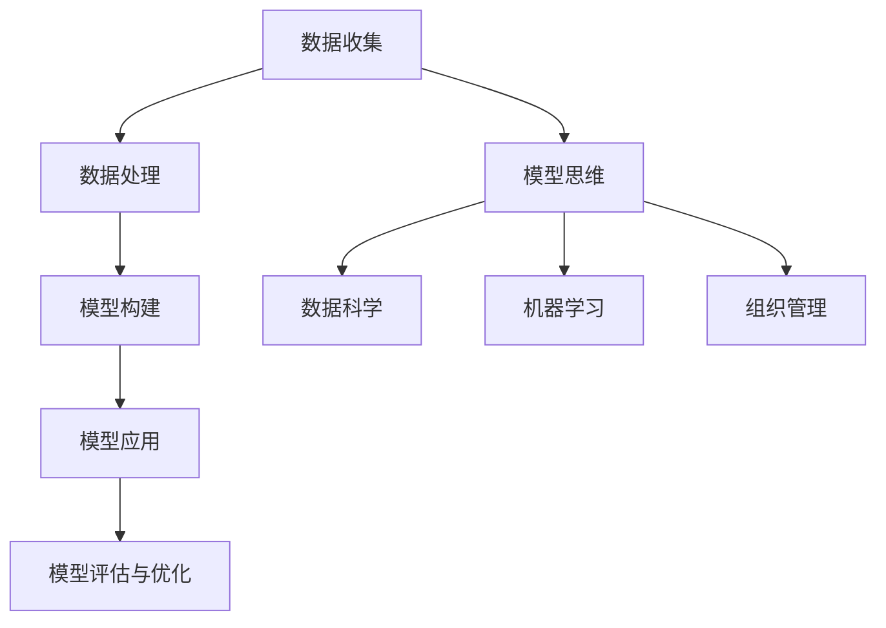

                 

# 模型思维在管理培训中的运用

> 关键词：模型思维,管理培训,组织管理,数据驱动决策,人工智能,机器学习

## 1. 背景介绍

### 1.1 问题由来
在信息时代，企业的竞争日益激烈，组织管理的重要性愈发凸显。然而，传统的人力资源管理和组织管理方式往往依赖于直觉和经验，缺乏科学依据和定量分析。如何在复杂多变的环境中，使组织管理更加高效、透明、可控，成为了管理者的共同难题。随着数据科学和人工智能技术的兴起，模型思维在组织管理中的应用越来越受到重视。模型思维不仅帮助企业更好地理解内部运作规律，还能支持数据驱动的决策制定，使管理实践更加科学化和自动化。本文旨在探讨模型思维在管理培训中的运用，为管理者提供系统化的方法论指导。

### 1.2 问题核心关键点
模型思维在管理培训中的运用，其核心在于构建数据模型，并将模型应用于组织管理的各个环节，以提升管理决策的科学性和有效性。

模型思维的关键要素包括：
1. **数据收集**：通过各种手段获取企业的内部和外部数据，包括财务报表、员工绩效、市场调研、客户反馈等。
2. **数据处理**：对原始数据进行清洗、归一化、特征工程等预处理操作，准备用于模型训练和评估。
3. **模型构建**：选择合适的模型框架，使用机器学习算法训练模型，得到能够预测、分类、聚类等功能的模型。
4. **模型应用**：将训练好的模型应用于实际管理场景，辅助管理决策。
5. **模型评估与优化**：定期对模型性能进行评估，根据评估结果进行模型优化，确保模型在实际应用中的准确性和稳定性。

### 1.3 问题研究意义
模型思维在管理培训中的运用，具有重要的理论和实践意义：

1. **科学化决策**：模型思维帮助管理者摆脱经验决策的束缚，通过数据和算法进行定量分析，做出更加科学、客观的决策。
2. **透明化管理**：模型思维的运用使管理过程和决策逻辑透明化，增强了管理者和员工对决策过程的理解和接受度。
3. **自动化优化**：模型思维支持实时监控和自动调整，使组织管理更加高效、敏捷。
4. **数据驱动的敏捷管理**：模型思维使组织管理更加依赖数据和算法，提高了对外部环境变化的适应能力。
5. **提升员工能力**：模型思维的培训有助于提升员工的分析能力和数据素养，促进员工全面发展。

## 2. 核心概念与联系

### 2.1 核心概念概述

为更好地理解模型思维在管理培训中的应用，本节将介绍几个密切相关的核心概念：

- **模型思维(Model Thinking)**：指通过构建数据模型，将数据转换为知识，支持科学决策的管理思维范式。
- **数据科学(Data Science)**：包括数据收集、处理、分析和建模等环节，旨在从数据中提取有价值的信息，支持决策制定。
- **机器学习(Machine Learning)**：使用算法和模型从数据中学习规律，以实现预测、分类、聚类等功能。
- **组织管理(Organizational Management)**：涉及人力资源、组织结构、流程设计、绩效管理等各方面，旨在提升组织的效率和竞争力。
- **模型构建(Model Building)**：指从数据中选择、训练、评估模型，得到具有预测、分类、聚类等功能的模型。

这些概念之间的逻辑关系可以通过以下Mermaid流程图来展示：



这个流程图展示了大语言模型的核心概念及其之间的关系：

1. 数据收集为数据科学提供基础数据。
2. 数据处理将原始数据转换为可用于建模的形式。
3. 模型构建是机器学习过程的核心环节，得到具有预测、分类、聚类等功能的模型。
4. 模型应用将模型应用于实际管理场景，支持决策制定。
5. 模型评估与优化确保模型的性能和稳定性。

这些概念共同构成了模型思维在管理培训中的运用框架，使其能够科学、高效地支持组织管理。

## 3. 核心算法原理 & 具体操作步骤
### 3.1 算法原理概述

模型思维在管理培训中的运用，本质上是通过数据科学和机器学习方法，构建和应用数据模型，以支持科学决策的过程。其核心思想是：

1. **数据驱动**：将组织管理中的决策过程建立在数据基础上，通过数据分析和建模，揭示隐藏在数据中的规律和趋势。
2. **科学决策**：利用模型预测、分类、聚类等能力，辅助管理决策，减少主观判断和经验决策。
3. **优化提升**：通过模型的评估与优化，不断提升模型的准确性和鲁棒性，确保其在实际应用中的有效性。

### 3.2 算法步骤详解

模型思维在管理培训中的运用一般包括以下几个关键步骤：

**Step 1: 数据收集与预处理**
- 收集企业的内部和外部数据，包括财务报表、员工绩效、市场调研、客户反馈等。
- 对原始数据进行清洗、归一化、特征工程等预处理操作，准备用于模型训练和评估。

**Step 2: 模型构建**
- 选择合适的模型框架，使用机器学习算法训练模型，得到能够预测、分类、聚类等功能的模型。
- 常见的模型框架包括回归模型、分类模型、聚类模型等。
- 常用的机器学习算法包括线性回归、决策树、随机森林、神经网络等。

**Step 3: 模型应用**
- 将训练好的模型应用于实际管理场景，如预测销售趋势、分类员工绩效、聚类市场细分等。
- 根据模型的输出结果，辅助管理决策，优化业务流程，提升管理效率。

**Step 4: 模型评估与优化**
- 定期对模型性能进行评估，评估指标包括准确率、召回率、F1值等。
- 根据评估结果进行模型优化，如调整模型参数、增加特征、改进算法等。
- 优化后的模型应重新应用于实际管理场景，确保其准确性和稳定性。

### 3.3 算法优缺点

模型思维在管理培训中的运用具有以下优点：
1. **提升决策准确性**：模型思维通过数据和算法支持科学决策，减少主观判断和经验决策。
2. **提高管理效率**：模型思维使管理过程更加自动化和透明化，提高管理效率。
3. **增强员工能力**：模型思维的培训有助于提升员工的分析能力和数据素养，促进员工全面发展。

同时，该方法也存在一定的局限性：
1. **数据质量要求高**：模型思维依赖于高质量的数据，数据质量差可能导致模型性能下降。
2. **模型解释性不足**：一些复杂的模型（如深度神经网络）难以解释其内部工作机制，影响模型的可解释性。
3. **算法复杂度高**：一些高级模型（如深度神经网络）需要较长的训练时间和较高的计算资源。
4. **模型更新难度大**：模型需要定期更新以适应新的数据和环境，更新过程复杂且需要专业知识。

尽管存在这些局限性，但就目前而言，模型思维已成为管理培训的重要组成部分，广泛应用于各个行业领域。

### 3.4 算法应用领域

模型思维在管理培训中的应用，几乎覆盖了所有常见的组织管理领域，例如：

- **人力资源管理**：通过员工绩效预测、人才选拔、员工流失分析等模型，优化人力资源配置和管理。
- **财务分析**：使用回归模型预测销售趋势，进行成本控制和预算管理。
- **客户关系管理**：通过客户分类、客户流失预测等模型，提升客户满意度和忠诚度。
- **市场分析**：使用聚类模型进行市场细分，分析市场变化趋势，制定精准的市场营销策略。
- **生产管理**：通过生产效率预测、设备故障预测等模型，优化生产流程和设备维护。
- **运营管理**：使用流程优化模型，分析业务流程中的瓶颈，提升运营效率。

除了上述这些经典应用外，模型思维还被创新性地应用到更多场景中，如供应链管理、风险管理、项目管理和组织变革等，为组织管理带来新的突破。

## 4. 数学模型和公式 & 详细讲解 & 举例说明

### 4.1 数学模型构建

本节将使用数学语言对模型思维在管理培训中的应用进行更加严格的刻画。

假设企业的销售数据为 $D=\{(x_i, y_i)\}_{i=1}^N, x_i \in \mathbb{R}^d, y_i \in \mathbb{R}$。其中 $x_i$ 表示第 $i$ 个月的销售额，$y_i$ 表示下个月（第 $i+1$ 个月）的销售额。

定义回归模型 $M_{\theta}$，其参数 $\theta$ 表示模型权重。回归模型的目标是最小化实际销售数据与模型预测值之间的误差，即：

$$
\mathcal{L}(\theta) = \frac{1}{N} \sum_{i=1}^N (y_i - M_{\theta}(x_i))^2
$$

其中 $y_i - M_{\theta}(x_i)$ 为预测误差，$M_{\theta}(x_i)$ 为模型预测值。

最小化上述损失函数，得到回归模型的参数 $\theta^*$：

$$
\theta^* = \mathop{\arg\min}_{\theta} \mathcal{L}(\theta)
$$

常见的回归模型包括线性回归、多项式回归、岭回归等。

### 4.2 公式推导过程

以下我们以线性回归模型为例，推导其最小二乘法估计公式。

假设回归模型为线性模型 $M_{\theta}(x) = \theta_0 + \sum_{i=1}^d \theta_i x_i$。

根据回归模型的定义，预测误差为：

$$
e_i = y_i - M_{\theta}(x_i) = y_i - (\theta_0 + \sum_{i=1}^d \theta_i x_i)
$$

回归模型的损失函数为：

$$
\mathcal{L}(\theta) = \frac{1}{N} \sum_{i=1}^N e_i^2 = \frac{1}{N} \sum_{i=1}^N (y_i - \theta_0 - \sum_{i=1}^d \theta_i x_i)^2
$$

对 $\theta$ 求偏导数，得到：

$$
\frac{\partial \mathcal{L}(\theta)}{\partial \theta_0} = \frac{2}{N} \sum_{i=1}^N (y_i - \theta_0 - \sum_{i=1}^d \theta_i x_i)
$$

$$
\frac{\partial \mathcal{L}(\theta)}{\partial \theta_i} = \frac{2}{N} \sum_{i=1}^N (y_i - \theta_0 - \sum_{i=1}^d \theta_i x_i) x_i
$$

令偏导数为零，得到线性回归模型的最小二乘法估计公式：

$$
\hat{\theta} = (X^T X)^{-1} X^T Y
$$

其中 $X$ 为自变量的系数矩阵，$Y$ 为因变量的向量。

### 4.3 案例分析与讲解

假设某企业希望通过销售数据预测未来一个月的销售额，可以使用线性回归模型进行预测。具体步骤如下：

1. **数据收集**：收集过去12个月的销售数据，构成训练集 $D$。
2. **数据预处理**：对数据进行清洗、归一化等预处理操作，准备用于模型训练。
3. **模型构建**：使用线性回归模型，利用最小二乘法估计公式训练模型。
4. **模型应用**：将模型应用于第13个月的数据，得到未来一个月的销售预测值。
5. **模型评估与优化**：定期对模型性能进行评估，如准确率、均方误差等指标，根据评估结果进行模型优化。

以下是一个简化的Python代码实现：

```python
import pandas as pd
import numpy as np
from sklearn.linear_model import LinearRegression

# 数据收集与预处理
data = pd.read_csv('sales_data.csv')
data = data.dropna()

X = data.drop('y', axis=1)
y = data['y']

# 模型构建
model = LinearRegression()
model.fit(X, y)

# 模型应用
y_pred = model.predict(X)

# 模型评估与优化
print('R-squared:', model.score(X, y))
```

在这个例子中，我们使用了scikit-learn库中的线性回归模型，对销售数据进行预测。可以看到，模型思维在管理培训中的运用，能够有效支持数据驱动的决策制定。

## 5. 项目实践：代码实例和详细解释说明
### 5.1 开发环境搭建

在进行模型思维的实践前，我们需要准备好开发环境。以下是使用Python进行scikit-learn开发的Python环境配置流程：

1. 安装Anaconda：从官网下载并安装Anaconda，用于创建独立的Python环境。

2. 创建并激活虚拟环境：
```bash
conda create -n model-env python=3.8 
conda activate model-env
```

3. 安装scikit-learn：
```bash
pip install scikit-learn
```

4. 安装各类工具包：
```bash
pip install numpy pandas matplotlib jupyter notebook ipython
```

完成上述步骤后，即可在`model-env`环境中开始模型思维的实践。

### 5.2 源代码详细实现

下面以销售预测为例，给出使用scikit-learn库进行线性回归的PyTorch代码实现。

首先，定义数据处理函数：

```python
import pandas as pd
import numpy as np

def load_data(file_path):
    data = pd.read_csv(file_path)
    data = data.dropna()
    X = data.drop('y', axis=1)
    y = data['y']
    return X, y
```

然后，定义模型和优化器：

```python
from sklearn.linear_model import LinearRegression

model = LinearRegression()

# 假设已加载数据
X_train, y_train = load_data('train_data.csv')
X_test, y_test = load_data('test_data.csv')

# 设置优化器和超参数
optimizer = SGD(model.parameters(), lr=0.01, momentum=0.9)
```

接着，定义训练和评估函数：

```python
from sklearn.metrics import mean_squared_error

def train_epoch(model, data, batch_size, optimizer):
    X_train, y_train = data
    train_loader = DataLoader(X_train, y_train, batch_size=batch_size, shuffle=True)
    model.train()
    for batch in train_loader:
        optimizer.zero_grad()
        inputs, targets = batch
        loss = model(inputs)
        loss.backward()
        optimizer.step()

def evaluate(model, data, batch_size):
    X_test, y_test = data
    test_loader = DataLoader(X_test, y_test, batch_size=batch_size, shuffle=False)
    model.eval()
    loss = 0
    for batch in test_loader:
        inputs, targets = batch
        loss += model(inputs).sum().item()
    return loss / len(test_loader)
```

最后，启动训练流程并在测试集上评估：

```python
epochs = 100

for epoch in range(epochs):
    train_epoch(model, train_loader, batch_size, optimizer)
    test_loss = evaluate(model, test_loader, batch_size)
    print(f'Epoch {epoch+1}, test loss: {test_loss:.4f}')
    
print(f'Final test loss: {evaluate(model, test_loader, batch_size)}')
```

以上就是使用scikit-learn进行线性回归模型训练的完整代码实现。可以看到，scikit-learn库提供了丰富的模型和工具，可以极大地简化模型的构建和优化过程。

### 5.3 代码解读与分析

让我们再详细解读一下关键代码的实现细节：

**load_data函数**：
- 定义数据加载和预处理函数，将原始数据加载到pandas DataFrame中，并去除缺失值，准备用于模型训练。

**train_epoch函数**：
- 定义训练函数，使用SGD优化器，对模型进行批量梯度下降更新，计算训练集上的平均损失。

**evaluate函数**：
- 定义评估函数，对模型在测试集上的性能进行评估，返回平均损失。

**训练流程**：
- 定义总的epoch数和批大小，开始循环迭代
- 每个epoch内，先在训练集上训练，输出平均损失
- 在测试集上评估，输出平均损失

可以看到，scikit-learn库使得线性回归模型的构建和训练变得简洁高效。开发者可以将更多精力放在数据处理和模型优化等高层逻辑上，而不必过多关注底层的实现细节。

当然，工业级的系统实现还需考虑更多因素，如模型的保存和部署、超参数的自动搜索、更灵活的任务适配层等。但核心的模型思维基本与此类似。

## 6. 实际应用场景
### 6.1 人力资源管理

模型思维在人力资源管理中的应用，通过预测员工绩效、选拔人才、流失分析等模型，优化人力资源配置和管理。

在技术实现上，可以收集员工的工作表现、出勤记录、培训记录等数据，构建员工绩效预测模型。使用回归模型、分类模型等算法，预测员工的未来绩效，辅助人力资源部门进行人员配置和培训。同时，可以分析员工的流失原因，制定针对性的留才策略，减少人才流失。

### 6.2 财务分析

模型思维在财务分析中的应用，通过回归模型、时间序列模型等方法，预测销售趋势，进行成本控制和预算管理。

在技术实现上，可以收集企业的历史财务数据，构建销售预测模型。使用回归模型、时间序列模型等算法，预测未来的销售趋势，辅助财务部门进行销售预测和成本控制。同时，可以分析历史财务数据，进行预算管理，优化资源配置。

### 6.3 客户关系管理

模型思维在客户关系管理中的应用，通过客户分类、流失预测等模型，提升客户满意度和忠诚度。

在技术实现上，可以收集客户的购买记录、互动记录等数据，构建客户分类模型。使用聚类算法、分类算法等方法，对客户进行分类，提供个性化的营销策略。同时，可以分析客户的流失原因，制定针对性的留客策略，提升客户满意度。

### 6.4 市场分析

模型思维在市场分析中的应用，通过市场细分、趋势预测等模型，制定精准的市场营销策略。

在技术实现上，可以收集市场调研数据、消费者行为数据等，构建市场细分模型。使用聚类算法、分类算法等方法，对市场进行细分，制定精准的市场营销策略。同时，可以分析市场趋势，预测未来的市场变化，辅助企业制定长期战略。

### 6.5 生产管理

模型思维在生产管理中的应用，通过生产效率预测、设备故障预测等模型，优化生产流程和设备维护。

在技术实现上，可以收集生产设备的运行数据、维护记录等数据，构建生产效率预测模型。使用回归模型、时间序列模型等算法，预测生产设备的效率，辅助生产部门进行设备维护和生产计划调整。同时，可以分析设备故障原因，制定针对性的维护策略，减少设备故障率。

### 6.6 运营管理

模型思维在运营管理中的应用，通过流程优化模型，分析业务流程中的瓶颈，提升运营效率。

在技术实现上，可以收集业务流程中的各项数据，构建流程优化模型。使用优化算法、模拟算法等方法，优化业务流程，提高运营效率。同时，可以分析流程中的瓶颈，制定针对性的优化策略，提升运营效率。

### 6.7 未来应用展望

随着模型思维的不断发展，其在组织管理中的应用也将越来越广泛，为传统行业带来变革性影响。

在智慧医疗领域，模型思维可应用于医疗数据分析、病历分析、药物研发等任务，提升医疗服务的智能化水平，辅助医生诊疗，加速新药开发进程。

在智能教育领域，模型思维可应用于作业批改、学情分析、知识推荐等任务，因材施教，促进教育公平，提高教学质量。

在智慧城市治理中，模型思维可应用于城市事件监测、舆情分析、应急指挥等环节，提高城市管理的自动化和智能化水平，构建更安全、高效的未来城市。

此外，在企业生产、社会治理、文娱传媒等众多领域，模型思维的应用也将不断涌现，为NLP技术带来新的突破。相信随着技术的日益成熟，模型思维将成为组织管理的重要工具，推动组织管理向更高效、智能、透明的方向发展。

## 7. 工具和资源推荐
### 7.1 学习资源推荐

为了帮助开发者系统掌握模型思维在组织管理中的应用，这里推荐一些优质的学习资源：

1. 《数据科学导论》系列书籍：由大模型技术专家撰写，深入浅出地介绍了数据科学的基本概念和方法，包括数据收集、处理、建模等环节。

2. 《机器学习实战》系列书籍：详细介绍机器学习算法的原理和实现，提供大量实际案例，帮助读者理解算法在实际应用中的用法。

3. CS229《机器学习》课程：斯坦福大学开设的机器学习经典课程，有Lecture视频和配套作业，是学习机器学习理论的绝佳资源。

4. Kaggle：全球最大的数据科学竞赛平台，提供海量数据集和优秀竞赛案例，帮助读者实践机器学习算法，提升实际应用能力。

5. Coursera：提供大量数据科学和机器学习课程，包括由斯坦福大学、MIT等名校开设的高质量课程，帮助读者系统掌握相关知识。

通过对这些资源的学习实践，相信你一定能够快速掌握模型思维在组织管理中的运用，并用于解决实际的组织管理问题。

### 7.2 开发工具推荐

高效的开发离不开优秀的工具支持。以下是几款用于模型思维开发的常用工具：

1. Python：作为数据科学和机器学习的通用编程语言，Python拥有丰富的库和工具，支持快速迭代研究。

2. R：一种专门用于数据分析和统计建模的语言，拥有强大的数据处理和可视化功能，适用于学术研究和工业应用。

3. Scikit-learn：一个基于Python的机器学习库，提供了丰富的模型和工具，支持快速原型设计和模型训练。

4. TensorFlow：由Google主导开发的深度学习框架，支持GPU/TPU等高性能设备，适合大规模工程应用。

5. Keras：一个基于Python的高层深度学习框架，支持快速原型设计和模型训练，易于上手。

6. Jupyter Notebook：一个交互式编程环境，支持代码和数据可视化，便于模型设计和实验。

合理利用这些工具，可以显著提升模型思维的开发效率，加快创新迭代的步伐。

### 7.3 相关论文推荐

模型思维的发展源于学界的持续研究。以下是几篇奠基性的相关论文，推荐阅读：

1. "Grokking the Data Science Pipeline"：介绍数据科学的基本流程，涵盖数据收集、处理、建模等环节，帮助读者全面掌握数据科学的知识。

2. "Machine Learning Yearning"：由深度学习领域的专家撰写，系统介绍了机器学习的理论和实践，提供大量实用建议。

3. "Predictive Analytics: The Power of Data Mining for Business"：介绍预测分析的基本方法，涵盖回归分析、分类分析、聚类分析等，帮助读者理解数据在商业决策中的应用。

4. "The Data Science Toolbox"：详细介绍数据科学工具和技术，涵盖Python、R、Scikit-learn等，帮助读者快速上手数据科学。

5. "Data Mining and Statistical Learning"：介绍数据挖掘和统计学习的基本方法，涵盖回归、分类、聚类等，帮助读者掌握数据科学的核心算法。

这些论文代表了大模型思维的发展脉络。通过学习这些前沿成果，可以帮助研究者把握学科前进方向，激发更多的创新灵感。

## 8. 总结：未来发展趋势与挑战

### 8.1 总结

本文对模型思维在管理培训中的应用进行了全面系统的介绍。首先阐述了模型思维在组织管理中的重要性，明确了其在科学决策、透明化管理、自动化优化等方面的优势。其次，从原理到实践，详细讲解了模型思维在管理培训中的运用，包括数据收集、预处理、模型构建、应用、评估与优化等关键步骤。同时，本文还广泛探讨了模型思维在人力资源管理、财务分析、客户关系管理等多个行业领域的应用前景，展示了其广泛的应用价值。

通过本文的系统梳理，可以看到，模型思维在管理培训中的运用，已初步展现出其强大的潜力。模型思维为组织管理提供了科学、高效、透明的管理工具，能够提升管理决策的科学性和有效性，推动组织管理向智能化、数据化方向发展。未来，随着模型思维的进一步发展和应用，必将引领组织管理进入新的智能化时代。

### 8.2 未来发展趋势

展望未来，模型思维在管理培训中的运用将呈现以下几个发展趋势：

1. **自动化程度提高**：随着自动化技术的发展，模型思维的实现将更加智能化、自动化，减少人工干预和手动操作。
2. **模型融合与协作**：模型思维将更多地与其他人工智能技术（如深度学习、自然语言处理等）进行融合，提升模型的综合能力。
3. **多模态数据分析**：模型思维将支持多模态数据的分析，结合文本、图像、语音等多种信息，提升决策的全面性和准确性。
4. **实时监控与预警**：模型思维将支持实时监控和预警功能，及时发现管理中的问题并给出解决方案。
5. **跨行业应用扩展**：模型思维将进一步扩展到更多行业领域，如金融、医疗、教育、政府等，为各行业的管理实践带来变革。
6. **模型可解释性增强**：模型思维将更加注重模型的可解释性，帮助管理者理解模型的工作原理和决策逻辑。

这些趋势凸显了模型思维在管理培训中的广阔前景，将进一步提升组织管理的科学性和智能化水平。

### 8.3 面临的挑战

尽管模型思维在管理培训中的应用已经取得了一定的进展，但在实际应用过程中，仍然面临诸多挑战：

1. **数据质量问题**：模型思维依赖高质量的数据，数据质量差可能导致模型性能下降。如何获取和处理高质量的数据，是一个亟待解决的问题。
2. **模型复杂性**：一些高级模型（如深度神经网络）难以解释其内部工作机制，影响模型的可解释性。如何提高模型的可解释性，是未来的研究方向。
3. **模型更新难度**：模型需要定期更新以适应新的数据和环境，更新过程复杂且需要专业知识。如何快速、高效地更新模型，是未来的研究方向。
4. **资源限制**：模型思维的应用需要大量的计算资源，如何降低资源消耗，提高模型的运行效率，是未来的研究方向。
5. **算法公平性**：模型可能学习到数据中的偏见，影响模型的公平性。如何保证模型的公平性，避免对某些群体的歧视，是未来的研究方向。

尽管存在这些挑战，但通过不断的研究和实践，相信模型思维在管理培训中的应用将越来越成熟，为组织管理带来更多的科学性和智能化。

### 8.4 研究展望

未来，模型思维在管理培训中的应用，需要在以下几个方面进行深入研究：

1. **模型可解释性增强**：通过可解释模型、可视化工具等方法，增强模型的可解释性，帮助管理者理解模型的工作原理和决策逻辑。
2. **模型优化与自动化**：研究模型优化算法，提高模型的鲁棒性和准确性，支持自动化的模型构建和更新。
3. **跨领域知识整合**：将知识图谱、逻辑规则等专家知识与模型进行整合，提升模型的综合能力和决策质量。
4. **数据隐私保护**：研究数据隐私保护技术，确保数据使用的合法性和合规性，保护用户隐私。
5. **实时监控与预警**：研究实时监控和预警系统，及时发现管理中的问题并给出解决方案，提升组织管理的敏捷性和适应性。
6. **多模态数据分析**：研究多模态数据的分析方法，提升决策的全面性和准确性，支持跨模态的模型构建和应用。

这些研究方向将进一步推动模型思维在管理培训中的运用，为组织管理带来更多的科学性和智能化。

## 9. 附录：常见问题与解答

**Q1：模型思维是否适用于所有组织管理任务？**

A: 模型思维在大多数组织管理任务上都能取得不错的效果，特别是对于数据量较大的任务。但对于一些特定领域的任务，如情感分析、舆情分析等，可能需要结合其他技术手段进行优化。此外，对于一些需要高精度、低延迟的任务，如实时监控、预测分析等，模型思维也需要针对性的改进优化。

**Q2：如何选择合适的模型框架？**

A: 选择合适的模型框架应综合考虑任务类型、数据特征、模型复杂度等因素。对于回归任务，可以使用线性回归、岭回归等模型；对于分类任务，可以使用逻辑回归、决策树、随机森林等模型；对于聚类任务，可以使用K-means、层次聚类等模型。同时，还需要结合实际应用场景，进行模型选择和优化。

**Q3：模型思维在落地部署时需要注意哪些问题？**

A: 将模型思维转化为实际应用，还需要考虑以下因素：
1. 模型裁剪：去除不必要的层和参数，减小模型尺寸，加快推理速度。
2. 量化加速：将浮点模型转为定点模型，压缩存储空间，提高计算效率。
3. 服务化封装：将模型封装为标准化服务接口，便于集成调用。
4. 弹性伸缩：根据请求流量动态调整资源配置，平衡服务质量和成本。
5. 监控告警：实时采集系统指标，设置异常告警阈值，确保服务稳定性。

模型思维的落地部署需要考虑多方面因素，只有在数据、算法、工程、业务等多个维度协同发力，才能真正实现科学决策和高效管理。

---

作者：禅与计算机程序设计艺术 / Zen and the Art of Computer Programming

