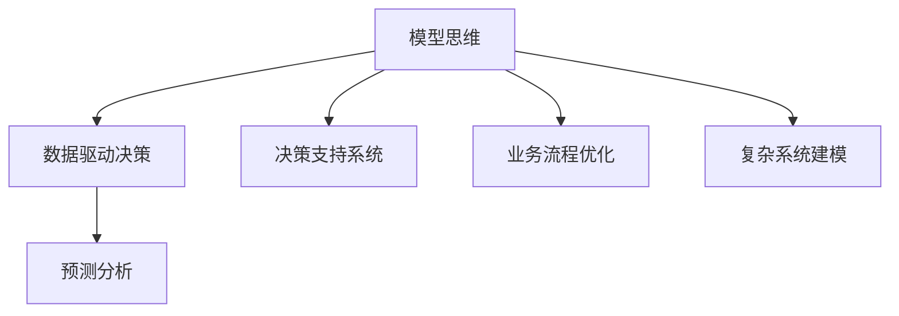

                 

# 模型思维对管理效率的提升

> 关键词：模型思维, 管理效率, 决策支持, 业务流程优化, 数据驱动

## 1. 背景介绍

### 1.1 问题由来
在当今高度动态变化的市场环境中，企业面临着前所未有的挑战和机遇。竞争激烈、消费者需求多元化、技术革新迅速，使得企业需要不断调整战略、优化流程，提升管理效率，以保持竞争优势。传统的基于经验和直觉的管理方法已难以适应这些复杂多变的环境，必须引入新的思维和方法来应对这些挑战。

### 1.2 问题核心关键点
模型思维作为一种基于数据的分析方法和决策工具，通过构建模型来模拟和预测复杂系统的行为，可以为企业提供科学、准确的管理决策支持，帮助企业优化业务流程，提升管理效率。模型思维的核心在于：

1. **数据驱动**：利用数据来驱动决策过程，减少主观偏见，提高决策的准确性和客观性。
2. **量化分析**：将不确定的因素量化，通过模型进行模拟和预测，为管理决策提供量化的依据。
3. **结构化思维**：通过构建系统化的模型，将复杂的决策问题结构化，便于分析和理解。

## 2. 核心概念与联系

### 2.1 核心概念概述

为了更好地理解模型思维在管理中的应用，本节将介绍几个核心概念及其之间的联系：

- **模型思维**：基于数据和数学模型，通过量化分析来支持决策和优化管理的方法。
- **数据驱动决策**：利用大数据和机器学习技术，将数据转化为知识，驱动企业决策的过程。
- **决策支持系统**：利用模型和算法，为管理决策提供数据和分析支持的系统。
- **业务流程优化**：通过模型分析，优化企业业务流程，提高效率和质量。
- **预测分析**：利用历史数据和机器学习模型，预测未来趋势和行为，指导企业战略和运营。
- **复杂系统建模**：构建复杂的系统模型，模拟和预测系统行为，支持企业战略和运营决策。

这些核心概念之间的逻辑关系可以通过以下Mermaid流程图来展示：



这个流程图展示了模型思维在不同应用场景中的关键作用：

1. 模型思维是数据驱动决策的基础。
2. 决策支持系统是模型思维的具体应用，通过模型为决策提供支持。
3. 业务流程优化和预测分析都是模型思维的衍生应用，帮助企业提高效率和竞争力。
4. 复杂系统建模是模型思维在复杂系统分析中的应用，支持企业进行更深入的战略和运营决策。

## 3. 核心算法原理 & 具体操作步骤
### 3.1 算法原理概述

模型思维的核心在于利用数学模型来模拟和预测复杂系统的行为，从而支持管理决策。其基本流程如下：

1. **数据收集与预处理**：收集相关数据，并进行清洗、归一化等预处理，为模型输入准备数据。
2. **模型构建与训练**：选择合适的模型，利用历史数据进行训练，建立预测模型。
3. **模型验证与优化**：通过验证数据集评估模型性能，根据评估结果优化模型参数。
4. **模型应用与决策支持**：将训练好的模型应用于实际业务场景，提供决策支持。

模型思维的关键在于选择合适的模型和算法，以及合理的数据处理和模型训练方法。不同的模型和算法适用于不同的应用场景，需要根据具体问题进行选择和调整。

### 3.2 算法步骤详解

以下是模型思维在管理决策中应用的详细步骤：

**Step 1: 数据收集与预处理**

1. **数据收集**：收集与决策问题相关的数据，包括历史数据、实时数据、内部数据和外部数据等。
2. **数据清洗**：去除无效和错误数据，处理缺失值、异常值等。
3. **特征工程**：提取和构建有意义的特征，提高模型的解释性和预测准确性。

**Step 2: 模型构建与训练**

1. **模型选择**：根据问题类型和数据特征，选择合适的模型，如回归模型、分类模型、聚类模型等。
2. **模型训练**：利用历史数据训练模型，调整模型参数，使其能够准确预测未来趋势和行为。
3. **模型评估**：在验证数据集上评估模型性能，选择最优模型。

**Step 3: 模型验证与优化**

1. **交叉验证**：使用交叉验证方法评估模型性能，避免过拟合。
2. **参数调优**：根据评估结果调整模型参数，优化模型性能。
3. **模型集成**：采用集成学习方法，提高模型预测的准确性和鲁棒性。

**Step 4: 模型应用与决策支持**

1. **模型部署**：将训练好的模型部署到实际业务系统中，供决策使用。
2. **实时监测**：实时监测模型预测结果，及时调整模型参数和业务策略。
3. **反馈优化**：根据模型预测结果和实际效果，不断优化模型和业务流程。

### 3.3 算法优缺点

模型思维作为一种管理决策方法，具有以下优点：

1. **科学决策**：通过数据驱动，减少主观偏见，提高决策的科学性和客观性。
2. **定量分析**：利用数学模型进行定量分析，提供量化的决策依据。
3. **结构化思维**：通过系统化的建模过程，将复杂问题结构化，便于理解和分析。
4. **灵活应用**：模型思维适用于多种场景，可以灵活应用于不同领域和管理问题。

同时，模型思维也存在一些缺点：

1. **数据质量要求高**：模型预测的准确性依赖于数据的质量和完整性，低质量的数据可能导致错误的决策。
2. **模型选择复杂**：不同的模型适用于不同的问题，选择合适的模型需要丰富的经验和专业知识。
3. **计算资源需求高**：模型构建和训练需要大量的计算资源，对硬件设备要求较高。
4. **模型解释性差**：复杂模型如深度学习模型，其预测过程难以解释，可能缺乏透明性。

尽管存在这些局限性，但模型思维在提升管理效率方面依然具有不可替代的价值，特别是在数据驱动决策和业务流程优化方面。

### 3.4 算法应用领域

模型思维在管理中的应用领域非常广泛，以下是几个典型的应用场景：

1. **供应链管理**：通过预测分析，优化库存管理，减少库存成本，提高供应链效率。
2. **市场营销**：利用数据驱动决策，优化广告投放策略，提高营销效果和ROI。
3. **人力资源管理**：通过员工绩效预测和招聘优化，提高人力资源管理效率。
4. **财务管理**：利用预测分析，优化财务预算和风险管理，提高企业财务健康度。
5. **运营优化**：通过业务流程建模和优化，提高生产效率和质量。
6. **客户关系管理**：利用客户数据分析，优化客户关系管理策略，提高客户满意度。

## 4. 数学模型和公式 & 详细讲解 & 举例说明

### 4.1 数学模型构建

模型思维在管理中的应用，通常涉及以下数学模型：

1. **回归模型**：用于预测连续变量，如销售量、客户满意度等。常见的回归模型有线性回归、多项式回归、岭回归等。
2. **分类模型**：用于预测离散变量，如客户流失、产品缺陷等。常见的分类模型有逻辑回归、决策树、支持向量机等。
3. **聚类模型**：用于发现数据中的模式和结构，如客户分群、产品分类等。常见的聚类模型有K-Means、层次聚类等。

### 4.2 公式推导过程

以线性回归模型为例，其公式推导过程如下：

假设我们有一组数据 $(x_i,y_i)$，其中 $x_i$ 是自变量，$y_i$ 是因变量。我们的目标是建立一个线性回归模型来预测 $y$ 的值。

线性回归模型的一般形式为：

$$
y = \beta_0 + \beta_1 x + \epsilon
$$

其中 $\beta_0$ 是截距，$\beta_1$ 是斜率，$\epsilon$ 是误差项。

最小二乘法是求解线性回归模型参数的一种常用方法。其基本思想是找到一组参数 $\beta_0$ 和 $\beta_1$，使得所有样本点的误差平方和最小。

最小二乘法的目标函数为：

$$
\sum_{i=1}^n (y_i - \hat{y}_i)^2
$$

其中 $\hat{y}_i$ 是模型对 $x_i$ 的预测值。

求解目标函数最小值的参数 $\beta_0$ 和 $\beta_1$ 可以使用正规方程法或梯度下降法。

### 4.3 案例分析与讲解

**案例1: 销售预测**

某公司希望预测下季度销售额，历史数据如表所示：

| 时间         | 销售额 |
|--------------|--------|
| 2020年1月     | 10000  |
| 2020年2月     | 11000  |
| 2020年3月     | 12000  |
| 2020年4月     | 13000  |
| 2020年5月     | 14000  |
| 2020年6月     | 15000  |
| 2020年7月     | 16000  |
| 2020年8月     | 17000  |
| 2020年9月     | 18000  |
| 2020年10月    | 19000  |
| 2020年11月    | 20000  |
| 2020年12月    | 21000  |
| 2021年1月     | 22000  |

我们利用线性回归模型预测2021年2月的销售额。

数据预处理如下：

- 将时间数据标准化为1-12之间的整数，作为自变量 $x$。
- 将销售额标准化为1-21之间的整数，作为因变量 $y$。

构建线性回归模型：

$$
y = \beta_0 + \beta_1 x + \epsilon
$$

使用最小二乘法求解参数 $\beta_0$ 和 $\beta_1$：

$$
\beta_0 = \frac{\sum_{i=1}^n y_i \sum_{i=1}^n x_i^2 - n\sum_{i=1}^n x_i y_i}{n\sum_{i=1}^n x_i^2 - (\sum_{i=1}^n x_i)^2}
$$

$$
\beta_1 = \frac{\sum_{i=1}^n x_i y_i - \beta_0 \sum_{i=1}^n x_i}{\sum_{i=1}^n x_i^2 - \sum_{i=1}^n x_i^2}
$$

预测2021年2月的销售额：

$$
\hat{y} = \beta_0 + \beta_1 x
$$

## 5. 项目实践：代码实例和详细解释说明

### 5.1 开发环境搭建

在进行模型思维的实践前，我们需要准备好开发环境。以下是使用Python进行Pandas和Scikit-learn开发的环境配置流程：

1. 安装Anaconda：从官网下载并安装Anaconda，用于创建独立的Python环境。

2. 创建并激活虚拟环境：
```bash
conda create -n model-thinking-env python=3.8 
conda activate model-thinking-env
```

3. 安装Pandas和Scikit-learn：
```bash
conda install pandas scikit-learn
```

4. 安装各类工具包：
```bash
pip install numpy matplotlib seaborn
```

完成上述步骤后，即可在`model-thinking-env`环境中开始模型思维的实践。

### 5.2 源代码详细实现

我们以线性回归模型为例，给出使用Pandas和Scikit-learn进行模型构建的代码实现。

首先，准备数据集：

```python
import pandas as pd
import numpy as np

data = pd.read_csv('sales_data.csv')
X = data[['time']]
y = data['sales']
X = (X - X.mean()) / X.std()
y = (y - y.mean()) / y.std()
```

接着，构建线性回归模型：

```python
from sklearn.linear_model import LinearRegression

model = LinearRegression()
model.fit(X, y)
```

然后，预测2021年2月的销售额：

```python
X_new = np.array([12])
X_new = (X_new - X.mean()) / X.std()
y_pred = model.predict(X_new)
y_pred = (y_pred * y.std()) + y.mean()
print(y_pred)
```

最后，绘制散点图和拟合直线：

```python
import matplotlib.pyplot as plt

plt.scatter(X, y)
plt.plot(X, model.predict(X), color='red')
plt.show()
```

### 5.3 代码解读与分析

让我们再详细解读一下关键代码的实现细节：

**数据预处理**：
- 使用`pd.read_csv`读取数据集，并将其转换为NumPy数组。
- 将自变量$x$和因变量$y$进行标准化处理，使得数据具有相同的尺度，便于模型训练。

**模型构建与训练**：
- 使用`LinearRegression`类构建线性回归模型。
- 调用`fit`方法训练模型，使用标准化后的数据。

**模型应用与预测**：
- 构造新的数据点$x_{new}$，并对其进行标准化处理。
- 使用`predict`方法预测$y_{pred}$。
- 将预测结果反标准化，得到实际的销售额。

**可视化展示**：
- 使用Matplotlib绘制散点图和拟合直线，展示模型的预测效果。

可以看到，利用Pandas和Scikit-learn，我们可以快速构建和训练线性回归模型，并对其预测效果进行可视化展示。通过这种代码实现，可以直观地理解模型思维在数据驱动决策中的应用。

## 6. 实际应用场景

### 6.1 供应链管理

在供应链管理中，通过预测分析，可以优化库存管理，减少库存成本，提高供应链效率。具体而言，可以收集历史销售数据、市场需求数据、供应商交货数据等，构建预测模型，预测未来的需求量和库存水平，及时调整库存策略，避免过剩或短缺。

**案例2: 库存优化**

某公司销售电子产品，历史销售数据如下：

| 时间         | 销售额 |
|--------------|--------|
| 2021年1月     | 1000   |
| 2021年2月     | 1200   |
| 2021年3月     | 1400   |
| 2021年4月     | 1600   |
| 2021年5月     | 1800   |
| 2021年6月     | 2000   |
| 2021年7月     | 2200   |
| 2021年8月     | 2400   |
| 2021年9月     | 2600   |
| 2021年10月    | 2800   |
| 2021年11月    | 3000   |
| 2021年12月    | 3200   |
| 2022年1月     | 3400   |

我们利用线性回归模型预测2022年2月的销售额，并根据预测结果优化库存。

数据预处理如下：

- 将时间数据标准化为1-12之间的整数，作为自变量 $x$。
- 将销售额标准化为1-34之间的整数，作为因变量 $y$。

构建线性回归模型：

$$
y = \beta_0 + \beta_1 x + \epsilon
$$

使用最小二乘法求解参数 $\beta_0$ 和 $\beta_1$：

$$
\beta_0 = \frac{\sum_{i=1}^n y_i \sum_{i=1}^n x_i^2 - n\sum_{i=1}^n x_i y_i}{n\sum_{i=1}^n x_i^2 - (\sum_{i=1}^n x_i)^2}
$$

$$
\beta_1 = \frac{\sum_{i=1}^n x_i y_i - \beta_0 \sum_{i=1}^n x_i}{\sum_{i=1}^n x_i^2 - \sum_{i=1}^n x_i^2}
$$

预测2022年2月的销售额：

$$
\hat{y} = \beta_0 + \beta_1 x
$$

根据预测结果，公司可以在2022年2月前适当增加库存，避免库存短缺或过剩，优化供应链管理。

### 6.2 市场营销

在市场营销中，通过数据驱动决策，可以优化广告投放策略，提高营销效果和ROI。具体而言，可以收集广告点击率、广告转化率、用户行为数据等，构建模型，预测广告效果，优化广告预算和投放策略。

**案例3: 广告投放优化**

某公司计划在社交媒体上进行广告投放，历史广告数据如下：

| 广告ID | 点击率 | 转化率 | 曝光量 |
|--------|--------|--------|--------|
| A      | 0.2    | 0.05   | 10000  |
| B      | 0.3    | 0.1    | 20000  |
| C      | 0.1    | 0.08   | 15000  |
| D      | 0.5    | 0.2    | 5000   |
| E      | 0.4    | 0.15   | 30000  |

我们利用逻辑回归模型预测广告的点击率和转化率，并根据预测结果优化广告投放。

数据预处理如下：

- 将广告ID标准化为1-5之间的整数，作为自变量 $x$。
- 将点击率和转化率标准化为0-1之间的浮点数，作为因变量 $y$。

构建逻辑回归模型：

$$
\log(\frac{y}{1-y}) = \beta_0 + \beta_1 x + \epsilon
$$

使用最小二乘法求解参数 $\beta_0$ 和 $\beta_1$：

$$
\beta_0 = \frac{1}{n} \sum_{i=1}^n \log(\frac{y_i}{1-y_i})
$$

$$
\beta_1 = \frac{1}{n} \sum_{i=1}^n \log(\frac{y_i}{1-y_i}) x_i
$$

预测广告的点击率和转化率：

$$
\hat{y} = \frac{1}{1+e^{-\beta_0 - \beta_1 x}}
$$

根据预测结果，公司可以在广告投放时优先选择点击率和转化率高的广告，优化广告预算和投放策略，提高营销效果和ROI。

### 6.3 人力资源管理

在人力资源管理中，通过员工绩效预测和招聘优化，可以提高人力资源管理效率。具体而言，可以收集员工历史绩效数据、培训数据、员工行为数据等，构建模型，预测员工绩效，优化招聘策略和培训方案。

**案例4: 员工绩效预测**

某公司希望预测员工未来的绩效表现，历史绩效数据如下：

| 员工ID | 绩效评分 |
|--------|----------|
| A      | 3.5      |
| B      | 4.0      |
| C      | 3.2      |
| D      | 3.8      |
| E      | 4.5      |
| F      | 3.9      |
| G      | 4.1      |
| H      | 3.6      |
| I      | 3.9      |
| J      | 4.2      |

我们利用回归模型预测员工未来绩效，并根据预测结果优化人力资源管理。

数据预处理如下：

- 将员工ID标准化为1-10之间的整数，作为自变量 $x$。
- 将绩效评分标准化为0-5之间的浮点数，作为因变量 $y$。

构建回归模型：

$$
y = \beta_0 + \beta_1 x + \epsilon
$$

使用最小二乘法求解参数 $\beta_0$ 和 $\beta_1$：

$$
\beta_0 = \frac{\sum_{i=1}^n y_i \sum_{i=1}^n x_i^2 - n\sum_{i=1}^n x_i y_i}{n\sum_{i=1}^n x_i^2 - (\sum_{i=1}^n x_i)^2}
$$

$$
\beta_1 = \frac{\sum_{i=1}^n x_i y_i - \beta_0 \sum_{i=1}^n x_i}{\sum_{i=1}^n x_i^2 - \sum_{i=1}^n x_i^2}
$$

预测员工未来绩效：

$$
\hat{y} = \beta_0 + \beta_1 x
$$

根据预测结果，公司可以在招聘和培训时优先选择绩效预测高的员工，优化人力资源管理策略，提高员工绩效和组织效率。

## 7. 工具和资源推荐

### 7.1 学习资源推荐

为了帮助读者系统掌握模型思维的理论基础和实践技巧，这里推荐一些优质的学习资源：

1. 《数据科学导论》系列博文：由数据科学专家撰写，深入浅出地介绍了数据科学的基础概念和常用方法，包括模型思维和数据驱动决策。

2. Coursera《数据科学基础》课程：由约翰霍普金斯大学开设的在线课程，系统讲解数据科学的基本概念和统计方法，是数据科学入门的优质资源。

3. 《Python数据分析实战》书籍：详细介绍了使用Python进行数据分析和建模的实践技巧，包括数据预处理、模型构建和结果分析等。

4. Kaggle竞赛平台：全球最大的数据科学竞赛平台，提供丰富的数据集和经典案例，帮助读者通过实战提升数据分析和建模能力。

5. GitHub开源项目：GitHub上有大量的开源数据分析和机器学习项目，可以作为学习和实践的参考，例如Scikit-learn、TensorFlow等。

通过对这些资源的学习实践，相信读者一定能够快速掌握模型思维的核心思想和应用方法，并用于解决实际的管理问题。

### 7.2 开发工具推荐

高效的开发离不开优秀的工具支持。以下是几款用于模型思维开发和应用的工具：

1. Python：作为数据科学的主流语言，Python具有丰富的库和框架，支持数据分析、建模和可视化等。
2. R：R语言是数据科学的重要工具，拥有丰富的统计分析和数据可视化功能。
3. Jupyter Notebook：基于Python的交互式开发环境，支持代码编写、数据可视化、模型训练和结果展示，是数据科学开发的首选工具。
4. Tableau：流行的数据可视化工具，支持大规模数据集的处理和分析，是数据科学可视化的重要工具。
5. Power BI：微软推出的商业智能工具，支持报表制作、数据可视化和数据挖掘等，是企业数据驱动决策的重要工具。
6. Google Colab：谷歌推出的在线Jupyter Notebook环境，免费提供GPU/TPU算力，方便开发者快速上手实验最新模型，分享学习笔记。

合理利用这些工具，可以显著提升模型思维在管理决策中的应用效率，加速模型构建和优化过程。

### 7.3 相关论文推荐

模型思维作为管理决策的重要工具，其研究和应用已涉及众多领域。以下是几篇奠基性的相关论文，推荐阅读：

1. 《预测建模：理论、方法和应用》：系统介绍了预测建模的基本理论和常用方法，包括回归模型、分类模型、聚类模型等。

2. 《数据科学导论》：涵盖了数据科学的基本概念和常用方法，包括数据收集、数据预处理、模型构建和结果分析等。

3. 《机器学习：实战案例与应用》：通过丰富的案例展示了机器学习在实际应用中的具体应用，包括预测建模、分类建模等。

4. 《数据驱动的商业决策》：介绍了数据驱动决策的基本概念和应用方法，展示了数据科学在企业决策中的应用。

5. 《智能决策系统：理论、方法和实践》：介绍了智能决策系统的基本理论和常用方法，包括模型构建、优化和应用等。

这些论文代表了大数据和机器学习在管理决策中的应用方向，为研究者提供了深入的理论支持和丰富的实践案例。

## 8. 总结：未来发展趋势与挑战

### 8.1 研究成果总结

本文对模型思维在管理中的应用进行了全面系统的介绍，从理论基础到实践方法，详细讲解了模型思维在数据驱动决策和业务流程优化中的应用。通过具体的案例分析，展示了模型思维在供应链管理、市场营销、人力资源管理等多个领域的应用效果。

### 8.2 未来发展趋势

展望未来，模型思维在管理中的应用将呈现以下几个发展趋势：

1. **模型自动化**：随着AI技术的不断进步，自动化模型构建和优化技术将不断成熟，使得模型构建过程更加高效和智能化。
2. **多模型融合**：未来将出现更多的模型融合方法，如集成学习、模型堆叠等，以提高模型的预测准确性和鲁棒性。
3. **实时预测**：随着实时数据采集和处理技术的发展，实时预测和决策支持将成为可能，进一步提升管理效率。
4. **自适应模型**：未来的模型将具备自适应能力，能够根据环境变化和数据更新动态调整模型参数，提高预测效果。
5. **多模态分析**：未来的模型将支持多模态数据融合，如文本、图像、语音等多模态数据，以提供更全面、准确的管理决策支持。

### 8.3 面临的挑战

尽管模型思维在提升管理效率方面具有显著优势，但在实际应用中也面临着一些挑战：

1. **数据质量问题**：模型的预测效果依赖于高质量的数据，数据清洗和处理过程复杂繁琐。
2. **模型复杂度**：复杂的模型往往难以解释，缺乏透明性，可能影响决策的可信度。
3. **计算资源需求高**：模型构建和训练需要大量的计算资源，对硬件设备要求较高。
4. **数据隐私和安全**：在数据驱动决策中，数据隐私和安全问题不容忽视，需要采取有效的数据保护措施。
5. **模型泛化能力**：模型需要在不同的数据集和环境中具有较好的泛化能力，避免过拟合。

### 8.4 研究展望

面对模型思维在管理应用中面临的挑战，未来的研究需要在以下几个方面寻求新的突破：

1. **数据清洗和处理**：开发高效的数据清洗和预处理技术，降低数据质量对模型预测的影响。
2. **模型解释性**：研究可解释性模型和方法，提高模型的透明性和可信度。
3. **资源优化**：开发高效计算资源优化技术，降低模型构建和训练的资源需求。
4. **数据隐私保护**：研究数据隐私保护技术，确保数据安全和隐私。
5. **模型泛化能力**：开发更好的泛化能力评估方法，提高模型在不同数据集和环境中的泛化能力。

## 9. 附录：常见问题与解答

**Q1: 模型思维与传统管理方法相比，有何优势？**

A: 模型思维具有数据驱动和量化分析的特点，相比于传统基于经验和直觉的管理方法，具有以下优势：
1. 科学决策：减少主观偏见，提高决策的科学性和客观性。
2. 定量分析：提供量化的决策依据，提高决策的可信度。
3. 结构化思维：将复杂问题结构化，便于分析和理解。

**Q2: 模型思维是否适用于所有管理问题？**

A: 模型思维适用于大多数管理问题，特别是在数据驱动决策和业务流程优化方面具有显著优势。但对于一些特殊的管理问题，如人际关系管理、企业文化建设等，模型思维可能无法提供有效的解决方案。需要根据具体问题选择合适的管理方法。

**Q3: 模型思维在应用中需要注意哪些问题？**

A: 模型思维在应用中需要注意以下问题：
1. 数据质量要求高：确保数据准确、完整、一致，避免低质量数据对模型预测的影响。
2. 模型选择复杂：选择合适的模型需要丰富的经验和专业知识，模型选择不当可能导致预测效果不佳。
3. 计算资源需求高：模型构建和训练需要大量计算资源，需要考虑硬件设备的选择和优化。
4. 模型解释性差：复杂的模型难以解释，可能缺乏透明性，需要注意模型的可解释性和可信度。
5. 数据隐私和安全：在数据驱动决策中，需要采取有效的数据保护措施，确保数据安全和隐私。

**Q4: 如何提升模型思维在管理中的应用效果？**

A: 提升模型思维在管理中的应用效果，可以从以下几个方面入手：
1. 提高数据质量：确保数据的准确性、完整性和一致性，减少数据质量对模型预测的影响。
2. 优化模型选择：选择合适的模型和算法，结合具体问题和数据特征，提高模型的预测效果。
3. 合理调整参数：通过调整模型参数和超参数，优化模型的预测效果。
4. 不断迭代优化：根据模型预测结果和实际效果，不断优化模型和业务流程，提高管理效率。

**Q5: 模型思维在实际应用中需要注意哪些实践问题？**

A: 模型思维在实际应用中需要注意以下实践问题：
1. 数据收集与预处理：确保数据的收集和预处理过程规范、高效，减少数据清洗和处理的时间和成本。
2. 模型构建与训练：选择合适的模型和算法，利用历史数据进行训练，建立预测模型。
3. 模型验证与优化：使用验证数据集评估模型性能，调整模型参数，优化模型预测效果。
4. 模型应用与决策支持：将训练好的模型应用于实际业务场景，提供决策支持，实时监测模型预测结果，及时调整模型参数和业务策略。
5. 反馈优化：根据模型预测结果和实际效果，不断优化模型和业务流程，提高管理效率和决策质量。

---

作者：禅与计算机程序设计艺术 / Zen and the Art of Computer Programming

