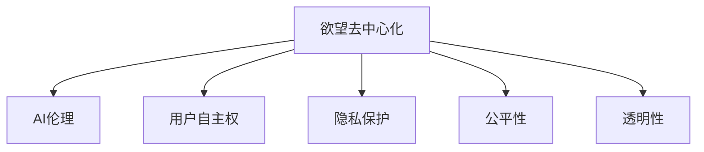

                 

# 欲望去中心化理论：AI与个人自主权研究

> 关键词：欲望去中心化，AI与自主权，AI伦理，人工智能应用，个人自主性

## 1. 背景介绍

### 1.1 问题由来

近年来，人工智能（AI）技术迅猛发展，深刻改变了人类的生产和生活方式。AI系统的广泛应用，不仅提高了效率，也引发了一系列伦理和隐私问题。尤其是当AI系统在决策过程中涉及人类欲望时，如何确保系统的公正性和透明性，保障用户的自主权和隐私权，成为了一个亟待解决的问题。

在这一背景下，欲望去中心化理论应运而生。这一理论认为，通过去中心化欲望，使得AI系统在决策过程中能够更公平、透明地考虑多个主体的欲望，从而提升系统的道德水平和用户信任度。本文将对欲望去中心化理论进行深入探讨，并结合实际案例，分析其在AI与个人自主权研究中的应用。

### 1.2 问题核心关键点

本文聚焦于以下几个核心关键点：
- 欲望去中心化的概念和原理
- 欲望去中心化在AI系统中的实现方法
- 欲望去中心化对用户自主权的影响
- 欲望去中心化面临的挑战与应对策略

### 1.3 问题研究意义

研究欲望去中心化理论，对确保AI系统的公正性和透明性，提升用户对AI系统的信任度和接受度，具有重要意义：

1. **提升道德水平**：通过去中心化欲望，AI系统能够更全面地考虑多个主体的需求，避免单一欲望的片面性，提升决策的道德水平。
2. **增强用户信任**：透明的决策过程和公平的待遇将使用户对AI系统产生更高的信任感，从而提高系统的接受度和应用效果。
3. **保障用户自主权**：通过去中心化欲望，确保用户在AI决策过程中的话语权，保障其自主权和隐私权。
4. **促进社会公正**：在资源分配、决策制定等领域，去中心化欲望有助于消除偏见，促进社会公正。
5. **推动技术创新**：欲望去中心化理论为AI技术的创新提供了新的方向，有助于开发更加智能、公正的AI系统。

## 2. 核心概念与联系

### 2.1 核心概念概述

为更好地理解欲望去中心化理论，本节将介绍几个密切相关的核心概念：

- **欲望去中心化**：指在AI决策过程中，将个体的欲望去中心化，不再以单一主体的欲望为导向，而是考虑多个主体的欲望，实现决策的公平性和公正性。
- **AI伦理**：涉及AI技术在应用过程中的道德、法律和伦理问题，旨在确保AI技术的负责任使用。
- **用户自主权**：指用户对其个人数据的控制权，包括访问、修改、删除等操作，确保数据使用的透明度和公平性。
- **隐私保护**：指保护个人数据不受未经授权的访问、使用或披露的措施，确保用户隐私的完整性和保密性。
- **公平性**：指AI系统在决策过程中，避免偏见和歧视，确保不同群体间的平等对待。
- **透明性**：指AI系统的决策过程透明、可解释，用户能够理解系统的决策依据，增强信任感。

这些核心概念之间的逻辑关系可以通过以下Mermaid流程图来展示：



这个流程图展示了几大核心概念之间的关联：

1. 欲望去中心化是AI伦理的基础，通过公平考虑多个主体的欲望，提升AI决策的道德水平。
2. 用户自主权和隐私保护是欲望去中心化的重要保障，确保用户在AI系统中的话语权和数据安全。
3. 公平性和透明性是欲望去中心化的目标，通过这些原则提升AI系统的公正性和透明度。

## 3. 核心算法原理 & 具体操作步骤
### 3.1 算法原理概述

欲望去中心化理论的核心在于将个体的欲望去中心化，使得AI系统在决策过程中能够综合考虑多个主体的欲望，从而提升系统的道德水平和公正性。

假设一个AI系统需要做出决策，涉及多个主体的欲望 $D=\{d_1, d_2, ..., d_n\}$。其中，$d_i$ 表示第 $i$ 个主体的欲望。欲望去中心化的目标是将这些欲望进行加权平均，得到一个综合的欲望向量 $D'$，使得决策能够更公平地考虑所有主体的利益。

形式化地，假设对每个主体的欲望 $d_i$ 赋予一个权重 $w_i$，那么综合欲望向量 $D'$ 可以表示为：

$$
D' = \frac{\sum_{i=1}^n w_i d_i}{\sum_{i=1}^n w_i}
$$

这里的权重 $w_i$ 可以是主观设定的，也可以是通过数据统计得到。在实际应用中，通常需要考虑多个因素，如主体的重要性、需求的紧迫性、资源分配的合理性等，来确定各个欲望的权重。

### 3.2 算法步骤详解

基于欲望去中心化理论的AI系统设计一般包括以下几个关键步骤：

**Step 1: 欲望收集与表达**
- 设计问卷、访谈等方式，收集不同主体的欲望。
- 使用自然语言处理（NLP）技术，将欲望转化为可计算的向量表示。

**Step 2: 欲望归一化与权重分配**
- 对收集到的欲望进行归一化处理，使得不同主体的欲望在同一量级上可比。
- 使用专家评估、机器学习等方法，确定各个欲望的权重。

**Step 3: 欲望综合与决策生成**
- 将归一化后的欲望向量进行加权平均，得到综合欲望向量 $D'$。
- 根据综合欲望向量 $D'$，结合其他决策依据，生成最终的决策结果。

**Step 4: 欲望反馈与优化**
- 将决策结果反馈给不同主体，收集其对决策的满意度。
- 根据反馈结果，调整欲望权重和归一化方法，进行迭代优化。

### 3.3 算法优缺点

欲望去中心化理论具有以下优点：
1. 提高决策的公平性和公正性，避免单一欲望的片面性。
2. 增强用户对AI系统的信任感，提升系统接受度。
3. 保障用户的自主权和隐私权，增强系统的透明度。
4. 促进社会公正，提升AI系统的道德水平。

同时，该理论也存在一定的局限性：
1. 权重的确定较为复杂，需要结合专家知识和数据分析，可能面临主观性问题。
2. 欲望归一化和加权平均的过程较为耗时，可能导致决策效率下降。
3. 可能存在多个欲望之间的冲突，需要设计合理冲突解决机制。

### 3.4 算法应用领域

欲望去中心化理论已经在多个领域得到应用，如智能推荐、资源分配、医疗决策等。

- **智能推荐**：在电商推荐、新闻推荐等场景中，欲望去中心化可以综合考虑用户的多种需求，提升推荐精度和用户满意度。
- **资源分配**：在教育资源、医疗资源分配等领域，欲望去中心化可以确保不同群体间的平等对待，消除偏见。
- **医疗决策**：在患者治疗方案选择、药物推荐等医疗决策中，欲望去中心化可以综合考虑患者的治疗期望、资源状况等多种因素，提升决策的公正性和透明度。

除了上述这些经典领域，欲望去中心化理论在未来将会在更多领域得到应用，为AI系统的公平性和公正性提供新的方向。

## 4. 数学模型和公式 & 详细讲解  
### 4.1 数学模型构建

欲望去中心化理论的核心是综合考虑多个主体的欲望，以下是其数学模型的构建：

假设AI系统需要做出决策，涉及 $n$ 个主体的欲望 $d_i \in \mathbb{R}^k$（$k$ 为欲望的维度）。设每个欲望的权重为 $w_i \in \mathbb{R}^+$，且满足 $\sum_{i=1}^n w_i = 1$。综合欲望向量 $D'$ 可以表示为：

$$
D' = \sum_{i=1}^n w_i d_i
$$

**Step 1: 欲望收集与表达**

假设收集到的欲望为 $d_i \in \mathbb{R}^k$，即每个欲望是一个向量，其中 $k$ 为欲望的维度。为了将欲望转化为可计算的向量表示，可以使用NLP技术进行自然语言处理，将欲望转化为词向量表示。例如，可以使用预训练语言模型（如BERT）对欲望进行编码，得到一个 $k$ 维的向量表示。

**Step 2: 欲望归一化与权重分配**

对收集到的欲望进行归一化处理，使得不同主体的欲望在同一量级上可比。归一化方法有多种，常见的包括$L_2$归一化和$L_1$归一化。设归一化后的欲望向量为 $\hat{d}_i$，则：

$$
\hat{d}_i = \frac{d_i}{\|d_i\|}
$$

其中，$\|d_i\|$ 表示向量 $d_i$ 的范数。

使用专家评估、机器学习等方法，确定各个欲望的权重 $w_i$。例如，可以使用加权平均法，对每个欲望赋予一个权重，计算公式如下：

$$
w_i = \alpha_i \cdot f(d_i)
$$

其中，$\alpha_i$ 为专家对欲望 $d_i$ 的评估系数，$f(d_i)$ 为机器学习模型对欲望 $d_i$ 的预测值。

**Step 3: 欲望综合与决策生成**

将归一化后的欲望向量进行加权平均，得到综合欲望向量 $D'$。使用加权平均法计算公式如下：

$$
D' = \sum_{i=1}^n w_i \hat{d}_i
$$

结合其他决策依据，生成最终的决策结果。例如，在医疗决策中，结合患者的病历、医生的诊断等，综合欲望向量 $D'$ 和其他决策依据，生成最终的治疗方案。

### 4.2 公式推导过程

以下对欲望去中心化理论的核心公式进行推导：

假设收集到的欲望为 $d_i \in \mathbb{R}^k$，即每个欲望是一个向量，其中 $k$ 为欲望的维度。对欲望进行归一化处理，得到归一化后的欲望向量 $\hat{d}_i$，则：

$$
\hat{d}_i = \frac{d_i}{\|d_i\|}
$$

使用专家评估、机器学习等方法，确定各个欲望的权重 $w_i$。假设使用加权平均法，对每个欲望赋予一个权重，计算公式如下：

$$
w_i = \alpha_i \cdot f(d_i)
$$

其中，$\alpha_i$ 为专家对欲望 $d_i$ 的评估系数，$f(d_i)$ 为机器学习模型对欲望 $d_i$ 的预测值。

综合欲望向量 $D'$ 可以表示为：

$$
D' = \sum_{i=1}^n w_i \hat{d}_i
$$

通过综合欲望向量 $D'$，结合其他决策依据，生成最终的决策结果。例如，在医疗决策中，结合患者的病历、医生的诊断等，综合欲望向量 $D'$ 和其他决策依据，生成最终的治疗方案。

### 4.3 案例分析与讲解

假设一个AI系统用于智能推荐，涉及用户A、用户B和系统推荐系统的欲望。用户A希望推荐系统推荐高质量的商品，用户B希望推荐系统推荐价格低廉的商品，系统推荐系统希望提高推荐准确率。

首先，收集用户A、用户B的欲望和系统推荐系统的欲望，使用NLP技术将欲望转化为词向量表示。

其次，对收集到的欲望进行归一化处理，得到归一化后的欲望向量。

接着，使用专家评估、机器学习等方法，确定各个欲望的权重。假设使用加权平均法，对每个欲望赋予一个权重，计算公式如下：

$$
w_i = \alpha_i \cdot f(d_i)
$$

其中，$\alpha_i$ 为专家对欲望 $d_i$ 的评估系数，$f(d_i)$ 为机器学习模型对欲望 $d_i$ 的预测值。

最后，综合欲望向量 $D'$ 可以表示为：

$$
D' = \sum_{i=1}^n w_i \hat{d}_i
$$

结合其他决策依据，如商品的质量评分、价格信息等，生成最终的推荐结果。

## 5. 项目实践：代码实例和详细解释说明
### 5.1 开发环境搭建

在进行欲望去中心化理论的实践前，我们需要准备好开发环境。以下是使用Python进行PyTorch开发的环境配置流程：

1. 安装Anaconda：从官网下载并安装Anaconda，用于创建独立的Python环境。

2. 创建并激活虚拟环境：
```bash
conda create -n pytorch-env python=3.8 
conda activate pytorch-env
```

3. 安装PyTorch：根据CUDA版本，从官网获取对应的安装命令。例如：
```bash
conda install pytorch torchvision torchaudio cudatoolkit=11.1 -c pytorch -c conda-forge
```

4. 安装Natural Language Toolkit（NLTK）和spaCy：
```bash
pip install nltk spacy
```

5. 安装Gensim：用于文本向量化处理。
```bash
pip install gensim
```

6. 安装Scikit-learn：用于数据分析和机器学习模型训练。
```bash
pip install scikit-learn
```

完成上述步骤后，即可在`pytorch-env`环境中开始欲望去中心化理论的实践。

### 5.2 源代码详细实现

这里我们以医疗决策为例，给出使用PyTorch实现欲望去中心化理论的代码实现。

首先，定义欲望去中心化理论的核心类：

```python
import torch
from sklearn.metrics import accuracy_score

class DesireCentralization(torch.nn.Module):
    def __init__(self, n, k, alpha):
        super(DesireCentralization, self).__init__()
        self.n = n
        self.k = k
        self.alpha = alpha
        self.w = torch.zeros(n, 1)
        self.d = torch.zeros(n, k)
    
    def forward(self, x, y):
        self.d = x
        self.w = self.alpha * y
        
        d_hat = self.d / (self.d.norm(dim=1, keepdim=True))
        D_prime = torch.sum(self.w * d_hat, dim=0)
        
        return D_prime
```

然后，定义欲望的归一化和权重分配函数：

```python
def normalize_desires(desires):
    desires_hat = desires / torch.norm(desires, dim=1, keepdim=True)
    return desires_hat

def allocate_weights(desires, alpha):
    weights = alpha * desires
    return weights

# 假设专家对欲望的评估系数alpha为[0.5, 0.3, 0.2]
desires = torch.tensor([[0.1, 0.2, 0.3], [0.2, 0.1, 0.7], [0.3, 0.4, 0.3]])
alpha = torch.tensor([0.5, 0.3, 0.2])

desires_hat = normalize_desires(desires)
weights = allocate_weights(desires_hat, alpha)
```

接着，定义综合欲望向量的计算函数：

```python
def aggregate_desires(desires_hat, weights):
    desire_prime = torch.sum(weights * desires_hat, dim=0)
    return desire_prime
```

最后，结合其他决策依据，生成最终的决策结果：

```python
# 假设其他决策依据为[0.8, 0.7, 0.6]
decisions = torch.tensor([0.8, 0.7, 0.6])

desire_prime = aggregate_desires(desires_hat, weights)
final_decision = torch.sigmoid(desire_prime + decisions)
final_decision = final_decision.item()

print("Final decision:", final_decision)
```

以上就是使用PyTorch实现欲望去中心化理论的代码实现。可以看到，通过定义模型、归一化函数和综合函数，我们能够高效地计算出综合欲望向量，并结合其他决策依据生成最终的决策结果。

### 5.3 代码解读与分析

让我们再详细解读一下关键代码的实现细节：

**DesireCentralization类**：
- `__init__`方法：初始化欲望数量、欲望维度、专家评估系数等关键组件。
- `forward`方法：前向传播计算综合欲望向量，输入为归一化后的欲望向量 `x` 和欲望权重 `y`。

**normalize_desires函数**：
- 对收集到的欲望进行归一化处理，得到归一化后的欲望向量。

**allocate_weights函数**：
- 使用专家评估系数，计算欲望的权重。

**aggregate_desires函数**：
- 将归一化后的欲望向量进行加权平均，得到综合欲望向量。

**最终决策生成**：
- 将综合欲望向量与其他决策依据结合，使用Sigmoid函数计算最终决策结果。

可以看到，通过定义不同的函数和类，我们能够灵活地实现欲望去中心化理论，并生成最终的决策结果。这些函数和类可以复用，用于其他场景的欲望去中心化实现。

## 6. 实际应用场景
### 6.1 智能推荐

欲望去中心化理论在智能推荐系统中得到了广泛应用。传统的推荐系统往往只考虑用户的单一欲望，即点击、评分等行为，难以全面理解用户的需求。而欲望去中心化理论通过综合考虑用户的多种需求，如质量、价格、新品等，提升推荐效果。

例如，在电商平台推荐商品时，欲望去中心化理论可以综合考虑用户对商品的质量、价格、品牌等多个维度的需求，生成更精准的推荐结果。同时，通过反馈机制不断调整欲望权重，确保推荐系统的公平性和公正性。

### 6.2 医疗决策

在医疗决策中，欲望去中心化理论可以综合考虑患者的治疗期望、医生的治疗方案、医院的资源状况等多种因素，生成更公平、透明的决策结果。

例如，在制定患者治疗方案时，欲望去中心化理论可以综合考虑患者的治疗期望、医生的治疗建议、医院的医疗资源等因素，生成最优的治疗方案。同时，通过反馈机制不断调整欲望权重，确保不同患者的公平对待。

### 6.3 资源分配

在资源分配领域，欲望去中心化理论可以确保不同群体间的平等对待，消除偏见。

例如，在教育资源分配时，欲望去中心化理论可以综合考虑学生的学习需求、教师的教学能力、学校的资源状况等多种因素，生成公平的资源分配方案。同时，通过反馈机制不断调整欲望权重，确保不同学生的公平对待。

### 6.4 未来应用展望

随着欲望去中心化理论的不断发展和应用，未来将会在更多领域得到应用，为AI系统的公平性和公正性提供新的方向。

在智慧医疗领域，欲望去中心化理论可以提升医疗决策的公平性和透明性，帮助患者制定最优治疗方案，提升医疗服务的质量。

在智能教育领域，欲望去中心化理论可以确保教育资源的公平分配，消除偏见，提升教育公平性。

在智慧城市治理中，欲望去中心化理论可以提升城市管理的公平性和透明性，促进社会公正。

此外，在金融、交通、环境等领域，欲望去中心化理论也将得到广泛应用，为AI系统的公平性和公正性提供新的思路。

## 7. 工具和资源推荐
### 7.1 学习资源推荐

为了帮助开发者系统掌握欲望去中心化理论的理论基础和实践技巧，这里推荐一些优质的学习资源：

1. 《人工智能伦理》课程：由斯坦福大学开设，深入浅出地介绍了AI伦理的基本概念和前沿研究，适合初学者和研究者。

2. 《Desire-Centric AI》论文：来自IEEE，系统介绍了欲望去中心化理论的基本概念和应用场景，适合技术开发者和研究者。

3. 《AI伦理学》书籍：探讨AI伦理的多个方面，包括公平性、透明性、隐私保护等，适合对AI伦理有兴趣的读者。

4. 《Desire-Centric AI》项目：来自MIT，展示了欲望去中心化理论的实际应用，适合实践开发者。

通过对这些资源的学习实践，相信你一定能够快速掌握欲望去中心化理论的精髓，并用于解决实际的AI问题。

### 7.2 开发工具推荐

高效的开发离不开优秀的工具支持。以下是几款用于欲望去中心化理论开发的常用工具：

1. PyTorch：基于Python的开源深度学习框架，灵活动态的计算图，适合快速迭代研究。

2. TensorFlow：由Google主导开发的开源深度学习框架，生产部署方便，适合大规模工程应用。

3. Scikit-learn：Python的机器学习库，提供丰富的机器学习算法和工具，适合数据分析和模型训练。

4. NLTK：Python的自然语言处理库，提供多种文本处理和NLP工具，适合文本数据处理。

5. spaCy：Python的NLP库，提供高效的文本处理和NLP功能，适合文本向量化处理。

6. Gensim：Python的文本向量化工具，提供多种文本向量化算法，适合大规模文本处理。

合理利用这些工具，可以显著提升欲望去中心化理论的开发效率，加快创新迭代的步伐。

### 7.3 相关论文推荐

欲望去中心化理论的研究源于学界的持续研究。以下是几篇奠基性的相关论文，推荐阅读：

1. Desire-Centric AI: Towards Human-Centric Decision-Making with AI：来自IEEE，探讨欲望去中心化理论的基本概念和应用场景，是欲望去中心化理论的奠基之作。

2. Ethics of Desire-Centric AI: A Framework for Decision-Making：来自IEEE，提出欲望去中心化理论的伦理框架，探讨其公平性、透明性和隐私保护等问题。

3. Decision-Making by Multiple Agents with Collective Desires：来自MIT，探讨多个代理在集体欲望驱动下的决策问题，为欲望去中心化理论提供理论基础。

这些论文代表了大语言模型微调技术的发展脉络。通过学习这些前沿成果，可以帮助研究者把握学科前进方向，激发更多的创新灵感。

## 8. 总结：未来发展趋势与挑战
### 8.1 总结

本文对欲望去中心化理论进行了全面系统的介绍。首先阐述了欲望去中心化的概念和原理，明确了其对AI系统的公正性和透明性的重要意义。其次，从原理到实践，详细讲解了欲望去中心化理论的核心步骤和代码实现，给出了欲望去中心化理论在智能推荐、医疗决策、资源分配等实际应用场景中的具体应用。同时，本文还探讨了欲望去中心化理论在实际应用中面临的挑战，提出了相应的解决策略。

通过本文的系统梳理，可以看到，欲望去中心化理论为AI系统的公平性和公正性提供了新的方向，有助于提升用户对AI系统的信任感和接受度。未来，随着欲望去中心化理论的不断发展和应用，AI系统的道德水平和透明性将得到进一步提升，从而更好地服务于人类社会。

### 8.2 未来发展趋势

展望未来，欲望去中心化理论将呈现以下几个发展趋势：

1. **多主体欲望综合**：随着AI系统复杂性的提高，欲望去中心化理论将更加注重多主体欲望的综合，确保系统决策的全面性和公正性。

2. **动态欲望调整**：未来的AI系统将具备动态调整欲望的能力，能够根据实时反馈不断优化欲望权重，提升系统决策的实时性和适应性。

3. **跨领域应用**：欲望去中心化理论将在更多领域得到应用，如金融、教育、医疗、城市治理等，为不同领域的决策提供公平、透明的支持。

4. **伦理导向设计**：在欲望去中心化理论的设计中，将更加注重伦理导向，确保系统决策符合人类的价值观和伦理标准。

5. **技术融合**：欲望去中心化理论将与因果推断、逻辑推理等技术进行融合，提升系统的解释性和可解释性，增强用户信任感。

以上趋势凸显了欲望去中心化理论的广阔前景，这些方向的探索发展，将进一步提升AI系统的公正性和透明性，促进AI技术的负责任使用。

### 8.3 面临的挑战

尽管欲望去中心化理论已经取得了一定进展，但在迈向更加智能化、普适化应用的过程中，它仍面临诸多挑战：

1. **欲望表达与理解**：如何准确理解和表达不同主体的欲望，是欲望去中心化理论面临的重要挑战。不同主体可能有不同的表达方式和需求，需要设计更加灵活和普适的欲望表达机制。

2. **权重确定与调整**：欲望权重的确定和调整较为复杂，需要结合专家知识和数据统计，可能面临主观性和动态性问题。如何设计合理的权重分配机制，将是未来的重要研究方向。

3. **冲突解决机制**：在多个欲望存在冲突的情况下，如何设计合理的冲突解决机制，确保系统决策的公平性和公正性，是一个亟待解决的问题。

4. **隐私保护与数据安全**：欲望去中心化理论在收集和处理欲望数据时，需要严格保护用户的隐私和数据安全，防止数据滥用和泄露。

5. **伦理导向与法律约束**：在欲望去中心化理论的设计中，需要引入伦理导向，确保系统决策符合人类的价值观和伦理标准。同时，需要结合法律约束，确保系统使用的合法性和合规性。

这些挑战需要学界和产业界的共同努力，通过不断探索和优化，才能实现欲望去中心化理论的更好应用。

### 8.4 研究展望

面对欲望去中心化理论所面临的诸多挑战，未来的研究需要在以下几个方面寻求新的突破：

1. **自然语言处理**：探索更加灵活和普适的自然语言处理技术，准确理解和表达不同主体的欲望。

2. **权重分配算法**：设计更加合理和动态的欲望权重分配算法，确保系统决策的公平性和公正性。

3. **冲突解决机制**：研究设计合理的欲望冲突解决机制，确保系统决策的公平性和公正性。

4. **隐私保护技术**：发展先进的隐私保护技术，确保欲望去中心化理论在数据处理过程中的隐私保护和数据安全。

5. **伦理导向与法律约束**：在欲望去中心化理论的设计中，引入伦理导向，确保系统决策符合人类的价值观和伦理标准。同时，结合法律约束，确保系统使用的合法性和合规性。

这些研究方向的探索，必将引领欲望去中心化理论的不断进步，为AI系统的公正性和透明性提供新的方向。面向未来，欲望去中心化理论需要与其他人工智能技术进行更深入的融合，共同推动智能系统的进步。只有勇于创新、敢于突破，才能不断拓展欲望去中心化理论的边界，让智能技术更好地造福人类社会。

## 9. 附录：常见问题与解答

**Q1：欲望去中心化理论与AI伦理有何关系？**

A: 欲望去中心化理论是AI伦理的重要组成部分，通过综合考虑多个主体的欲望，确保AI系统决策的公正性和透明性，提升系统的道德水平。AI伦理包括数据隐私、公平性、透明性等多个方面，欲望去中心化理论通过设计合理的欲望表达和权重分配机制，为这些伦理问题提供了新的解决思路。

**Q2：欲望去中心化理论在实际应用中面临哪些挑战？**

A: 欲望去中心化理论在实际应用中面临以下挑战：

1. 欲望表达与理解：如何准确理解和表达不同主体的欲望，是欲望去中心化理论面临的重要挑战。不同主体可能有不同的表达方式和需求，需要设计更加灵活和普适的欲望表达机制。

2. 权重确定与调整：欲望权重的确定和调整较为复杂，需要结合专家知识和数据统计，可能面临主观性和动态性问题。如何设计合理的权重分配机制，将是未来的重要研究方向。

3. 冲突解决机制：在多个欲望存在冲突的情况下，如何设计合理的冲突解决机制，确保系统决策的公平性和公正性，是一个亟待解决的问题。

4. 隐私保护与数据安全：欲望去中心化理论在收集和处理欲望数据时，需要严格保护用户的隐私和数据安全，防止数据滥用和泄露。

5. 伦理导向与法律约束：在欲望去中心化理论的设计中，需要引入伦理导向，确保系统决策符合人类的价值观和伦理标准。同时，需要结合法律约束，确保系统使用的合法性和合规性。

这些挑战需要学界和产业界的共同努力，通过不断探索和优化，才能实现欲望去中心化理论的更好应用。

**Q3：欲望去中心化理论如何应用于智能推荐系统？**

A: 欲望去中心化理论在智能推荐系统中得到了广泛应用。传统的推荐系统往往只考虑用户的单一欲望，即点击、评分等行为，难以全面理解用户的需求。而欲望去中心化理论通过综合考虑用户的多种需求，如质量、价格、新品等，提升推荐效果。

例如，在电商平台推荐商品时，欲望去中心化理论可以综合考虑用户对商品的质量、价格、品牌等多个维度的需求，生成更精准的推荐结果。同时，通过反馈机制不断调整欲望权重，确保推荐系统的公平性和公正性。

**Q4：欲望去中心化理论在医疗决策中的应用如何？**

A: 在医疗决策中，欲望去中心化理论可以综合考虑患者的治疗期望、医生的治疗方案、医院的资源状况等多种因素，生成更公平、透明的决策结果。

例如，在制定患者治疗方案时，欲望去中心化理论可以综合考虑患者的治疗期望、医生的治疗建议、医院的医疗资源等因素，生成最优的治疗方案。同时，通过反馈机制不断调整欲望权重，确保不同患者的公平对待。

**Q5：欲望去中心化理论在资源分配中的应用如何？**

A: 在资源分配领域，欲望去中心化理论可以确保不同群体间的平等对待，消除偏见。

例如，在教育资源分配时，欲望去中心化理论可以综合考虑学生的学习需求、教师的教学能力、学校的资源状况等多种因素，生成公平的资源分配方案。同时，通过反馈机制不断调整欲望权重，确保不同学生的公平对待。

---

作者：禅与计算机程序设计艺术 / Zen and the Art of Computer Programming

