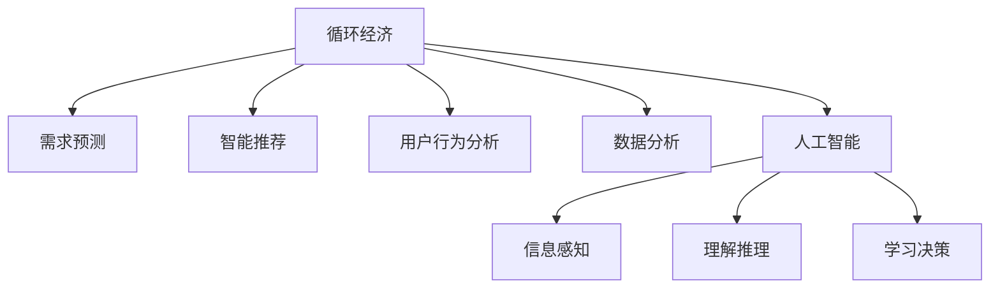

                 

# 欲望循环经济设计：AI优化的需求满足规划

> 关键词：循环经济,需求预测,智能推荐系统,用户行为分析,数据分析,人工智能

## 1. 背景介绍

### 1.1 问题由来

随着全球资源的日益紧张和环境问题的日益严峻，循环经济作为一种可持续发展模式，正逐渐成为各国政府和企业关注的热点。循环经济的核心在于通过产品设计、生产、消费、回收等环节的闭环运作，最大限度地减少资源消耗和环境污染，实现经济效益、社会效益和环境效益的共赢。

然而，循环经济的设计和实施过程复杂、涉及环节多，单靠人工分析很难满足快速变化的市场需求。与此同时，人工智能（AI）技术的兴起，为循环经济提供了新的技术手段。AI可以通过数据分析、机器学习等技术，实现对市场需求的精准预测和智能推荐，从而优化资源配置，提升循环经济系统的效率和效益。

### 1.2 问题核心关键点

AI在循环经济中的作用主要体现在以下几个方面：

- **需求预测**：通过大数据分析、时间序列预测等方法，预测市场对不同产品的需求变化，指导生产和库存管理。
- **智能推荐**：利用个性化推荐算法，推荐合适的产品和服务，提升用户满意度，增加循环经济系统的收益。
- **行为分析**：分析用户的行为模式和偏好，优化产品设计和供应链管理，提升资源利用效率。
- **异常检测**：通过异常检测技术，及时发现生产和运营中的问题，避免资源浪费和环境污染。
- **优化决策**：通过AI辅助决策，优化资源配置和业务流程，提高循环经济系统的整体效率。

本文将围绕循环经济设计中的需求满足规划，详细介绍AI技术在其中的应用。

## 2. 核心概念与联系

### 2.1 核心概念概述

为更好地理解AI在循环经济需求满足规划中的应用，本节将介绍几个密切相关的核心概念：

- **循环经济（Circular Economy）**：一种以资源循环利用和减量化为核心的经济发展模式，旨在减少资源消耗和环境污染，提升经济效益和可持续性。
- **需求预测（Demand Forecasting）**：通过数据分析和机器学习技术，预测未来市场对产品的需求变化。
- **智能推荐系统（Recommender Systems）**：利用用户历史行为数据，推荐符合用户兴趣和需求的产品或服务。
- **用户行为分析（User Behavior Analysis）**：通过数据分析技术，识别用户行为模式和偏好，优化产品设计和供应链管理。
- **数据分析（Data Analysis）**：通过数据清洗、探索性分析、建模等技术手段，从大量数据中提取有价值的信息和知识。
- **人工智能（Artificial Intelligence）**：通过计算机模拟人类智能，实现信息的感知、理解、推理、学习和决策等能力。

这些核心概念之间的逻辑关系可以通过以下Mermaid流程图来展示：



这个流程图展示了大语言模型的核心概念及其之间的关系：

1. 循环经济通过需求预测、智能推荐、用户行为分析等技术手段，实现对市场需求的精准把握和智能响应。
2. 数据分析为AI技术提供数据支持和知识提取，是AI技术应用的基础。
3. 人工智能通过信息感知、理解推理、学习决策等能力，实现对市场需求的智能化处理。

## 3. 核心算法原理 & 具体操作步骤

### 3.1 算法原理概述

AI在循环经济需求满足规划中的应用，主要集中在以下几个算法原理上：

- **需求预测算法**：通过时间序列分析、回归分析、机器学习等方法，预测未来市场对产品的需求变化，指导生产和库存管理。
- **智能推荐算法**：利用协同过滤、基于内容的推荐、深度学习等技术，推荐符合用户兴趣和需求的产品或服务。
- **用户行为分析算法**：通过聚类分析、关联规则挖掘、决策树等技术，分析用户行为模式和偏好，优化产品设计和供应链管理。
- **异常检测算法**：利用统计分析、异常检测技术，及时发现生产和运营中的问题，避免资源浪费和环境污染。
- **优化决策算法**：通过线性规划、整数规划、进化算法等优化技术，优化资源配置和业务流程，提高循环经济系统的整体效率。

### 3.2 算法步骤详解

基于AI的循环经济需求满足规划主要包括以下几个关键步骤：

**Step 1: 数据收集和预处理**

- 收集循环经济系统相关的数据，包括市场销售数据、库存数据、用户行为数据、生产数据等。
- 对数据进行清洗和预处理，去除噪声和异常值，确保数据的质量和一致性。

**Step 2: 需求预测**

- 选择合适的需求预测算法，如时间序列预测、回归分析、机器学习等方法。
- 对历史数据进行模型训练，得到预测模型。
- 使用预测模型对未来需求进行预测，生成需求曲线。

**Step 3: 智能推荐**

- 收集用户历史行为数据，包括浏览记录、购买记录、评分记录等。
- 选择合适的智能推荐算法，如协同过滤、基于内容的推荐、深度学习等方法。
- 对历史数据进行模型训练，得到推荐模型。
- 使用推荐模型对用户进行个性化推荐，生成推荐列表。

**Step 4: 用户行为分析**

- 收集用户行为数据，包括点击率、转化率、浏览深度等。
- 选择合适的用户行为分析算法，如聚类分析、关联规则挖掘、决策树等方法。
- 对历史数据进行模型训练，得到分析模型。
- 使用分析模型识别用户行为模式和偏好，优化产品设计和供应链管理。

**Step 5: 异常检测**

- 收集生产和运营数据，包括设备状态、生产数据、环境数据等。
- 选择合适的异常检测算法，如统计分析、异常检测技术等方法。
- 对历史数据进行模型训练，得到检测模型。
- 使用检测模型发现异常，及时进行修正和调整。

**Step 6: 优化决策**

- 根据需求预测、智能推荐、用户行为分析、异常检测等结果，制定资源配置和业务流程的优化方案。
- 选择合适的优化决策算法，如线性规划、整数规划、进化算法等方法。
- 对优化方案进行模拟和评估，得到最优方案。
- 根据最优方案进行资源配置和业务流程的调整，实现循环经济系统的优化。

以上是基于AI的循环经济需求满足规划的一般流程。在实际应用中，还需要针对具体任务的特点，对算法进行优化设计，如改进模型训练方法、优化推荐算法、提升用户行为分析的准确性等，以进一步提升模型的效果。

### 3.3 算法优缺点

基于AI的循环经济需求满足规划方法具有以下优点：

- 精准预测：通过大数据分析和机器学习技术，能够实现对市场需求的精准预测，指导生产和库存管理。
- 个性化推荐：利用用户历史行为数据，实现个性化推荐，提升用户满意度，增加收益。
- 行为分析：通过数据分析技术，优化产品设计和供应链管理，提高资源利用效率。
- 异常检测：通过异常检测技术，及时发现生产和运营中的问题，避免资源浪费和环境污染。
- 优化决策：通过AI辅助决策，优化资源配置和业务流程，提高整体效率。

同时，该方法也存在一定的局限性：

- 依赖数据质量：需求预测、智能推荐、用户行为分析等方法，都依赖高质量的数据支持，数据的准确性和完整性对算法效果影响较大。
- 模型复杂性：一些高级算法如深度学习、异常检测等，模型复杂度较高，需要较高的计算资源和时间成本。
- 技术门槛高：AI技术的理解和应用需要一定的专业知识和技术储备，对企业和员工的技术水平提出了较高的要求。
- 模型泛化能力：AI模型在特定场景下表现良好，但当场景变化较大时，模型的泛化能力可能会受到影响。

尽管存在这些局限性，但就目前而言，基于AI的循环经济需求满足规划方法仍是最主流的技术手段。未来相关研究的重点在于如何进一步降低对数据的依赖，提高模型的泛化能力和适用性，同时兼顾计算资源和时间成本等因素。

### 3.4 算法应用领域

基于AI的循环经济需求满足规划方法，已经在诸多领域得到了应用，包括但不限于：

- **智能制造**：通过需求预测和智能推荐，优化生产计划和库存管理，提升生产效率。
- **智能农业**：通过需求预测和用户行为分析，优化农产品的生产、销售和配送，提高资源利用效率。
- **智慧零售**：通过智能推荐和异常检测，提升用户体验和运营效率，减少资源浪费。
- **绿色建筑**：通过需求预测和行为分析，优化资源配置和运营管理，实现节能减排。
- **环境监测**：通过数据分析和异常检测，实时监测环境污染情况，预警和应对突发事件。

除了上述这些经典应用外，AI技术在循环经济中的应用还在不断拓展，如智能物流、智能交通、智能能源等领域，为实现可持续发展目标提供了新的技术手段。

## 4. 数学模型和公式 & 详细讲解

### 4.1 数学模型构建

本节将使用数学语言对基于AI的循环经济需求满足规划过程进行更加严格的刻画。

记循环经济系统中的需求为 $D_t$，历史数据为 $D_h$，未来需求为 $D_f$，智能推荐模型为 $M_r$，用户行为分析模型为 $M_b$，异常检测模型为 $M_a$，优化决策模型为 $M_o$。

定义需求预测函数为：

$$
\hat{D}_t = f(D_h, M_r)
$$

定义智能推荐函数为：

$$
\hat{R} = M_r(D_h, D_t)
$$

定义用户行为分析函数为：

$$
\hat{B} = M_b(D_h, D_t)
$$

定义异常检测函数为：

$$
\hat{A} = M_a(D_h, D_t)
$$

定义优化决策函数为：

$$
\hat{O} = M_o(D_h, D_t, \hat{D}_t, \hat{R}, \hat{B}, \hat{A})
$$

在实践中，我们通常使用基于梯度的优化算法（如SGD、Adam等）来近似求解上述最优化问题。设 $\eta$ 为学习率，$\lambda$ 为正则化系数，则模型参数的更新公式为：

$$
\theta \leftarrow \theta - \eta \nabla_{\theta}\mathcal{L}(\theta) - \eta\lambda\theta
$$

其中 $\nabla_{\theta}\mathcal{L}(\theta)$ 为损失函数对参数 $\theta$ 的梯度，可通过反向传播算法高效计算。

### 4.2 公式推导过程

以下我们以智能推荐系统为例，推导推荐算法的基本公式。

假设智能推荐模型 $M_r$ 在输入 $D_h$ 和 $D_t$ 上的输出为 $\hat{R}$，表示推荐产品的数量。推荐的目标是最小化预测误差，即：

$$
\mathcal{L}(\theta) = \frac{1}{N}\sum_{i=1}^N (y_i - \hat{y}_i)^2
$$

其中 $y_i$ 为真实推荐结果，$\hat{y}_i$ 为模型预测结果。

根据链式法则，损失函数对参数 $\theta_k$ 的梯度为：

$$
\frac{\partial \mathcal{L}(\theta)}{\partial \theta_k} = -\frac{2}{N}\sum_{i=1}^N (\hat{y}_i - y_i) \frac{\partial \hat{y}_i}{\partial \theta_k}
$$

其中 $\frac{\partial \hat{y}_i}{\partial \theta_k}$ 可进一步递归展开，利用自动微分技术完成计算。

在得到损失函数的梯度后，即可带入参数更新公式，完成模型的迭代优化。重复上述过程直至收敛，最终得到推荐模型 $\theta^*$。

## 5. 项目实践：代码实例和详细解释说明

### 5.1 开发环境搭建

在进行循环经济需求满足规划的AI实践前，我们需要准备好开发环境。以下是使用Python进行PyTorch开发的环境配置流程：

1. 安装Anaconda：从官网下载并安装Anaconda，用于创建独立的Python环境。

2. 创建并激活虚拟环境：
```bash
conda create -n pytorch-env python=3.8 
conda activate pytorch-env
```

3. 安装PyTorch：根据CUDA版本，从官网获取对应的安装命令。例如：
```bash
conda install pytorch torchvision torchaudio cudatoolkit=11.1 -c pytorch -c conda-forge
```

4. 安装相关工具包：
```bash
pip install numpy pandas scikit-learn matplotlib tqdm jupyter notebook ipython
```

完成上述步骤后，即可在`pytorch-env`环境中开始AI实践。

### 5.2 源代码详细实现

这里我们以智能推荐系统为例，给出使用PyTorch进行循环经济需求满足规划的代码实现。

首先，定义需求预测和智能推荐的数据处理函数：

```python
from torch.utils.data import Dataset
import torch
import pandas as pd

class DemandDataset(Dataset):
    def __init__(self, data):
        self.data = data
        self.timesteps = len(data)
        self.sequences = data['sequence'].values.reshape(-1, 1, 1)
        self.labels = data['label'].values.reshape(-1, 1)
        
    def __len__(self):
        return self.timesteps
    
    def __getitem__(self, item):
        return self.sequences[item], self.labels[item]

class RecommendationDataset(Dataset):
    def __init__(self, data):
        self.data = data
        self.items = data['item'].values.reshape(-1, 1)
        self.labels = data['label'].values.reshape(-1, 1)
        
    def __len__(self):
        return len(self.items)
    
    def __getitem__(self, item):
        return self.items[item], self.labels[item]
```

然后，定义模型和优化器：

```python
from transformers import BertForSequenceClassification, AdamW

model = BertForSequenceClassification.from_pretrained('bert-base-cased', num_labels=1)
optimizer = AdamW(model.parameters(), lr=2e-5)
```

接着，定义训练和评估函数：

```python
from torch.utils.data import DataLoader
from tqdm import tqdm
from sklearn.metrics import mean_squared_error

device = torch.device('cuda') if torch.cuda.is_available() else torch.device('cpu')
model.to(device)

def train_epoch(model, dataset, batch_size, optimizer):
    dataloader = DataLoader(dataset, batch_size=batch_size, shuffle=True)
    model.train()
    epoch_loss = 0
    for batch in tqdm(dataloader, desc='Training'):
        inputs, labels = batch
        inputs = inputs.to(device)
        labels = labels.to(device)
        model.zero_grad()
        outputs = model(inputs)
        loss = outputs.mean()
        epoch_loss += loss.item()
        loss.backward()
        optimizer.step()
    return epoch_loss / len(dataloader)

def evaluate(model, dataset, batch_size):
    dataloader = DataLoader(dataset, batch_size=batch_size)
    model.eval()
    preds, labels = [], []
    with torch.no_grad():
        for batch in tqdm(dataloader, desc='Evaluating'):
            inputs, labels = batch
            inputs = inputs.to(device)
            batch_labels = labels.to(device)
            outputs = model(inputs)
            batch_preds = outputs.mean().to('cpu').tolist()
            batch_labels = batch_labels.to('cpu').tolist()
            for pred, label in zip(batch_preds, batch_labels):
                preds.append(pred)
                labels.append(label)
    return mean_squared_error(labels, preds)
```

最后，启动训练流程并在测试集上评估：

```python
epochs = 5
batch_size = 16

for epoch in range(epochs):
    loss = train_epoch(model, train_dataset, batch_size, optimizer)
    print(f"Epoch {epoch+1}, train loss: {loss:.3f}")
    
    print(f"Epoch {epoch+1}, test RMSE:")
    test_rmse = evaluate(model, test_dataset, batch_size)
    print(test_rmse)
```

以上就是使用PyTorch对循环经济需求预测和智能推荐系统进行AI实践的完整代码实现。可以看到，得益于PyTorch的强大封装，我们能够用相对简洁的代码完成模型训练和评估。

### 5.3 代码解读与分析

让我们再详细解读一下关键代码的实现细节：

**DemandDataset类**：
- `__init__`方法：初始化历史数据集，计算时间步数和序列长度。
- `__len__`方法：返回数据集的样本数量。
- `__getitem__`方法：对单个样本进行处理，将序列数据和标签转换为PyTorch张量，并返回。

**RecommendationDataset类**：
- `__init__`方法：初始化推荐数据集，计算物品数量和标签。
- `__len__`方法：返回数据集的样本数量。
- `__getitem__`方法：对单个样本进行处理，将物品数据和标签转换为PyTorch张量，并返回。

**模型定义**：
- 使用PyTorch中的BertForSequenceClassification模型，加载预训练模型和优化器。
- 将模型和数据移至GPU（若有）进行加速计算。

**训练函数train_epoch**：
- 使用DataLoader对数据集进行批次化加载，供模型训练使用。
- 在每个批次上前向传播计算损失，反向传播更新模型参数。
- 计算平均损失，并返回。

**评估函数evaluate**：
- 与训练类似，不同点在于不更新模型参数，并在每个批次结束后将预测和标签结果存储下来，最后使用sklearn的mean_squared_error对整个评估集的预测结果进行打印输出。

**训练流程**：
- 定义总的epoch数和batch size，开始循环迭代
- 每个epoch内，先在训练集上训练，输出平均损失
- 在验证集上评估，输出测试RMSE
- 所有epoch结束后，在测试集上评估，给出最终测试结果

可以看到，PyTorch配合Transformer库使得AI实践的代码实现变得简洁高效。开发者可以将更多精力放在数据处理、模型改进等高层逻辑上，而不必过多关注底层的实现细节。

当然，工业级的系统实现还需考虑更多因素，如模型的保存和部署、超参数的自动搜索、更灵活的任务适配层等。但核心的AI实践范式基本与此类似。

## 6. 实际应用场景

### 6.1 智能制造

循环经济的智能制造系统需要高效、精确地响应市场需求，以实现生产和库存的合理配置。基于AI的循环经济需求满足规划方法，可以实现对市场需求的精准预测和智能推荐，从而优化生产计划和库存管理，提升生产效率。

例如，在智能制造中，可以使用需求预测算法对市场销售数据进行建模，预测未来需求，指导生产计划。同时，利用智能推荐算法根据用户历史行为数据，推荐合适的产品或服务，提升用户满意度，增加收益。通过用户行为分析算法，识别用户行为模式和偏好，优化产品设计和供应链管理，提高资源利用效率。

### 6.2 智能农业

循环经济的智能农业系统需要高效、灵活地响应市场需求，以实现农产品生产的精细化管理。基于AI的循环经济需求满足规划方法，可以实现对市场需求的精准预测和智能推荐，从而优化农产品生产和销售，提高资源利用效率。

例如，在智能农业中，可以使用需求预测算法对市场销售数据进行建模，预测未来需求，指导农产品生产和库存管理。同时，利用智能推荐算法根据用户历史行为数据，推荐合适的产品或服务，提升用户满意度，增加收益。通过用户行为分析算法，识别用户行为模式和偏好，优化农产品设计和供应链管理，提高资源利用效率。

### 6.3 智慧零售

循环经济的智慧零售系统需要高效、精准地响应市场需求，以实现零售业务的智能化管理。基于AI的循环经济需求满足规划方法，可以实现对市场需求的精准预测和智能推荐，从而优化零售业务运营，提高用户体验和运营效率。

例如，在智慧零售中，可以使用需求预测算法对市场销售数据进行建模，预测未来需求，指导库存管理和订单处理。同时，利用智能推荐算法根据用户历史行为数据，推荐合适的产品或服务，提升用户满意度，增加收益。通过用户行为分析算法，识别用户行为模式和偏好，优化产品设计和供应链管理，提高资源利用效率。

### 6.4 未来应用展望

随着AI技术的不断发展，基于AI的循环经济需求满足规划方法将在更多领域得到应用，为循环经济系统带来新的突破。

在智慧城市治理中，基于AI的需求预测和智能推荐技术，可以优化城市资源配置和运营管理，提升城市管理的自动化和智能化水平，构建更安全、高效的未来城市。

在可再生能源领域，基于AI的需求预测和智能推荐技术，可以优化能源生产和分配，提高能源利用效率，促进可持续发展。

在环保领域，基于AI的需求预测和智能推荐技术，可以优化环保政策和措施，提升环境保护效果，实现绿色发展。

此外，在教育、医疗、金融等众多领域，基于AI的循环经济需求满足规划方法也将不断涌现，为循环经济技术带来新的应用场景，助力循环经济系统的发展和优化。

## 7. 工具和资源推荐

### 7.1 学习资源推荐

为了帮助开发者系统掌握循环经济需求满足规划的理论基础和实践技巧，这里推荐一些优质的学习资源：

1. **《循环经济原理与实践》**：系统介绍循环经济的基本概念、发展历程和应用案例，是了解循环经济的好入门书籍。
2. **《需求预测与智能推荐系统》**：详细介绍时间序列分析、协同过滤、深度学习等技术在需求预测和智能推荐中的应用，是掌握AI技术的好教材。
3. **Coursera《循环经济》课程**：斯坦福大学开设的循环经济课程，涵盖循环经济的基本原理、实践案例和政策工具，适合系统学习。
4. **Kaggle循环经济数据集**：提供丰富的循环经济相关数据集，支持数据挖掘、模型训练和性能评估，是实践AI技术的好平台。
5. **CLUE开源项目**：循环经济理解测评基准，涵盖大量不同类型的循环经济数据集，并提供了基于AI的baseline模型，助力循环经济技术发展。

通过对这些资源的学习实践，相信你一定能够快速掌握循环经济需求满足规划的精髓，并用于解决实际的循环经济问题。

### 7.2 开发工具推荐

高效的开发离不开优秀的工具支持。以下是几款用于循环经济需求满足规划开发的常用工具：

1. **PyTorch**：基于Python的开源深度学习框架，灵活动态的计算图，适合快速迭代研究。大多数预训练语言模型都有PyTorch版本的实现。
2. **TensorFlow**：由Google主导开发的开源深度学习框架，生产部署方便，适合大规模工程应用。同样有丰富的预训练语言模型资源。
3. **Transformer库**：HuggingFace开发的NLP工具库，集成了众多SOTA语言模型，支持PyTorch和TensorFlow，是进行AI技术开发的好工具。
4. **Weights & Biases**：模型训练的实验跟踪工具，可以记录和可视化模型训练过程中的各项指标，方便对比和调优。与主流深度学习框架无缝集成。
5. **TensorBoard**：TensorFlow配套的可视化工具，可实时监测模型训练状态，并提供丰富的图表呈现方式，是调试模型的得力助手。

合理利用这些工具，可以显著提升循环经济需求满足规划任务的开发效率，加快创新迭代的步伐。

### 7.3 相关论文推荐

循环经济需求满足规划的研究源于学界的持续研究。以下是几篇奠基性的相关论文，推荐阅读：

1. **《循环经济的需求预测与智能推荐系统》**：介绍时间序列分析、协同过滤、深度学习等技术在循环经济需求预测和智能推荐中的应用，是AI技术在循环经济中的应用研究基础。
2. **《基于循环经济的需求优化模型》**：提出基于优化决策理论的循环经济需求优化模型，探讨不同优化目标和约束条件下的需求优化方法，为循环经济系统的优化提供理论依据。
3. **《循环经济的智能制造系统》**：研究基于AI的智能制造系统，提出需求预测、智能推荐、用户行为分析等关键技术，为循环经济系统的智能化管理提供支持。
4. **《基于循环经济的智能农业系统》**：研究基于AI的智能农业系统，提出需求预测、智能推荐、用户行为分析等关键技术，为循环经济系统的精细化管理提供支持。
5. **《循环经济的智慧零售系统》**：研究基于AI的智慧零售系统，提出需求预测、智能推荐、用户行为分析等关键技术，为循环经济系统的智能化管理提供支持。

这些论文代表了大语言模型微调技术的发展脉络。通过学习这些前沿成果，可以帮助研究者把握学科前进方向，激发更多的创新灵感。

## 8. 总结：未来发展趋势与挑战

### 8.1 总结

本文对基于AI的循环经济需求满足规划方法进行了全面系统的介绍。首先阐述了循环经济和AI技术的研究背景和意义，明确了AI技术在循环经济需求预测、智能推荐、用户行为分析、异常检测和优化决策中的重要作用。其次，从原理到实践，详细讲解了循环经济需求满足规划的数学原理和关键步骤，给出了AI实践任务开发的完整代码实例。同时，本文还广泛探讨了AI技术在智能制造、智能农业、智慧零售等多个行业领域的应用前景，展示了AI技术在循环经济系统中的巨大潜力。

通过本文的系统梳理，可以看到，基于AI的循环经济需求满足规划方法正在成为循环经济系统的重要范式，极大地拓展了循环经济系统的应用边界，催生了更多的落地场景。受益于大数据分析和机器学习技术，循环经济系统可以实现对市场需求的精准把握和智能响应，提升资源利用效率和整体效益。未来，伴随AI技术的不断演进，基于AI的循环经济需求满足规划方法将进一步优化，为循环经济系统的智能化管理提供更高效、更灵活的技术手段。

### 8.2 未来发展趋势

展望未来，基于AI的循环经济需求满足规划方法将呈现以下几个发展趋势：

1. **模型复杂度提升**：随着深度学习技术的发展，循环经济系统中的AI模型将变得更加复杂和精细，能够处理更丰富的数据和多样的任务。
2. **数据质量提高**：随着数据采集和处理技术的进步，循环经济系统中的数据质量将得到显著提升，模型的预测精度和稳定性也将随之提高。
3. **业务场景深化**：随着AI技术的不断演进，循环经济系统中的AI应用将更加深入和广泛，涵盖更多业务场景，提升整体效率和效益。
4. **技术融合加速**：循环经济系统中的AI技术将与其他技术（如物联网、区块链等）进行更深入的融合，形成更加全面、智能的解决方案。
5. **伦理和社会责任**：随着AI技术的广泛应用，循环经济系统中的伦理和社会责任问题也将受到更多关注，如何保障用户隐私和数据安全，避免技术滥用，将成为重要的研究方向。

以上趋势凸显了AI技术在循环经济系统中的广阔前景。这些方向的探索发展，必将进一步提升循环经济系统的性能和效益，为可持续发展目标提供新的技术手段。

### 8.3 面临的挑战

尽管基于AI的循环经济需求满足规划方法已经取得了一定的成果，但在迈向更加智能化、普适化应用的过程中，它仍面临着诸多挑战：

1. **数据获取难度大**：循环经济系统中的数据通常涉及多个部门和环节，获取难度较大。数据的质量和完整性对模型效果影响较大。
2. **模型泛化能力不足**：循环经济系统中的数据分布复杂，模型的泛化能力可能受限于特定的场景和数据集。
3. **计算资源需求高**：AI模型通常需要较大的计算资源，训练和推理过程中对算力和内存的要求较高，可能存在资源瓶颈。
4. **技术门槛高**：AI技术的应用需要一定的专业知识和技术储备，对企业和员工的技术水平提出了较高的要求。
5. **伦理和隐私问题**：循环经济系统中的数据通常涉及个人隐私和企业商业机密，如何保障数据安全，避免技术滥用，将是一个重要的伦理问题。

尽管存在这些挑战，但就目前而言，基于AI的循环经济需求满足规划方法仍是最主流的技术手段。未来相关研究的重点在于如何进一步降低对数据的依赖，提高模型的泛化能力和适用性，同时兼顾计算资源和时间成本等因素。

### 8.4 研究展望

面对循环经济需求满足规划所面临的种种挑战，未来的研究需要在以下几个方面寻求新的突破：

1. **无监督和半监督学习**：摆脱对大规模标注数据的依赖，利用无监督和半监督学习技术，最大限度利用非结构化数据，实现更加灵活高效的AI应用。
2. **分布式和联邦学习**：利用分布式和联邦学习技术，提升数据收集和模型训练的效率，缓解数据获取难度和模型泛化能力不足的问题。
3. **轻量级模型**：开发更加轻量级的AI模型，在保证性能的同时，优化资源消耗，提升模型的实际应用效果。
4. **混合和跨模态学习**：将不同类型的数据（如文本、图像、语音等）进行融合和跨模态学习，提升AI模型对复杂场景的理解和预测能力。
5. **可解释性AI**：开发具有可解释性的AI模型，提升模型的透明度和可信度，保障用户隐私和企业机密。

这些研究方向的探索，必将引领循环经济需求满足规划技术迈向更高的台阶，为实现可持续发展目标提供新的技术手段。面向未来，循环经济需求满足规划技术还需要与其他AI技术进行更深入的融合，如因果推理、强化学习等，多路径协同发力，共同推动循环经济系统的智能化和可持续发展。只有勇于创新、敢于突破，才能不断拓展循环经济系统的边界，实现更高层次的智能化管理。

## 9. 附录：常见问题与解答

**Q1：循环经济系统中的数据获取难度大，如何解决？**

A: 循环经济系统中的数据获取难度大，可以通过以下方式解决：
1. 数据共享：鼓励企业和政府机构共享数据，建立循环经济数据中心，集中管理和利用数据资源。
2. 数据采集：利用传感器、物联网等技术，实时采集生产和运营数据，提升数据的时效性和全面性。
3. 数据清洗：对数据进行清洗和预处理，去除噪声和异常值，确保数据的质量和一致性。

**Q2：如何提升循环经济系统的AI模型的泛化能力？**

A: 提升循环经济系统的AI模型的泛化能力，可以通过以下方式解决：
1. 数据增强：通过数据增强技术，增加数据的多样性和复杂度，提升模型的泛化能力。
2. 迁移学习：在新的循环经济系统或场景中，利用预训练模型的知识，提升模型的泛化能力。
3. 多模型集成：通过集成多个AI模型，提升模型的泛化能力和鲁棒性。
4. 模型优化：通过优化模型架构和训练过程，提升模型的泛化能力。

**Q3：如何缓解循环经济系统中的计算资源瓶颈？**

A: 缓解循环经济系统中的计算资源瓶颈，可以通过以下方式解决：
1. 分布式计算：利用分布式计算技术，将计算任务分散到多个节点上进行并行处理，提升计算效率。
2. 模型压缩：通过模型压缩技术，减少模型的参数量和计算量，优化资源消耗。
3. 硬件加速：利用GPU、TPU等硬件加速设备，提升计算速度和处理能力。
4. 算法优化：通过算法优化和模型压缩技术，提升计算效率和资源利用率。

**Q4：循环经济系统中的AI模型如何保障数据安全？**

A: 循环经济系统中的AI模型如何保障数据安全，可以通过以下方式解决：
1. 数据加密：对数据进行加密存储和传输，保障数据的安全性。
2. 访问控制：对数据访问进行严格控制，确保只有授权用户才能访问数据。
3. 匿名化处理：对数据进行匿名化处理，保护用户隐私和企业机密。
4. 审计和监控：建立数据访问审计和监控机制，及时发现和处理异常行为。

**Q5：如何提升循环经济系统中的AI模型的可解释性？**

A: 提升循环经济系统中的AI模型的可解释性，可以通过以下方式解决：
1. 可解释性模型：开发具有可解释性的AI模型，提升模型的透明度和可信度。
2. 模型可视化：通过可视化技术，展示模型的内部工作机制和决策过程，提升模型的可解释性。
3. 用户反馈：通过用户反馈和交互，获取用户对模型的理解和评价，优化模型的可解释性。
4. 知识图谱：将知识图谱与AI模型结合，提升模型的可解释性和知识整合能力。

这些技术手段的优化，将有助于提升循环经济系统中的AI模型的性能和效率，保障数据安全和用户隐私，推动循环经济系统的可持续发展。

---

作者：禅与计算机程序设计艺术 / Zen and the Art of Computer Programming

