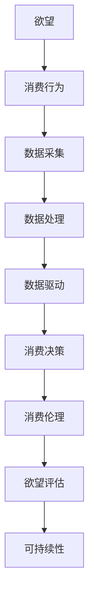

                 

# 欲望的可持续性评估：AI时代的消费伦理指南

> 关键词：欲望, 可持续性, AI, 消费伦理, 数据驱动, 人工智能伦理

## 1. 背景介绍

### 1.1 问题由来
在当今这个信息爆炸的时代，消费欲望的膨胀已经成为了一个全球性的问题。人工智能（AI）技术的快速发展，不仅改变了我们的生活方式，也在不断塑造着我们的消费模式。然而，这种变革带来的不仅仅是便利，更是对消费伦理的深刻挑战。如何在AI时代维护消费伦理，实现欲望的可持续性，成为亟待解决的问题。

### 1.2 问题核心关键点
- **欲望膨胀**：AI技术通过个性化推荐和虚拟试穿等方式，极大地满足了用户的消费欲望，但同时也可能导致过度消费和资源浪费。
- **可持续性**：如何在满足消费欲望的同时，减少对环境和社会资源的消耗，实现长期可持续性。
- **消费伦理**：在AI驱动的消费行为中，如何确保信息透明、公平公正，避免数据滥用和隐私侵害。
- **数据驱动**：AI技术在消费行为分析中发挥了重要作用，但也带来了数据隐私和数据偏见等问题。
- **人工智能伦理**：AI技术的应用需要在伦理层面上进行规范和引导，以确保技术的正义性。

### 1.3 问题研究意义
研究欲望的可持续性评估，对于AI时代的消费伦理具有重要意义：

1. **保护环境**：通过合理引导消费欲望，减少资源浪费，有助于保护地球环境。
2. **促进公平**：避免数据滥用和隐私侵害，确保消费行为在伦理框架下进行，促进社会公平。
3. **提升生活品质**：通过可持续的消费方式，提升个人和社会的整体生活质量。
4. **技术发展**：推动AI技术的伦理约束和规范，促进技术向更健康、可持续的方向发展。
5. **政策制定**：为政府制定消费政策和AI伦理法规提供理论依据。

## 2. 核心概念与联系

### 2.1 核心概念概述

为了更好地理解欲望的可持续性评估，我们先介绍几个核心概念：

- **欲望（Desire）**：指人们对于某种物品或服务的强烈需求或欲望，其驱动因素包括生理需求、情感需求和社会需求等。
- **可持续性（Sustainability）**：指在满足当前需求的同时，不损害未来代际满足需求的能力，涵盖经济、环境和社会三个维度。
- **消费伦理（Consumer Ethics）**：指在消费过程中遵循的道德准则和价值观，包括信息透明、公平公正、环境保护等。
- **数据驱动（Data-Driven）**：指通过数据分析和处理，驱动决策和行动的过程，数据来源包括用户行为、市场趋势等。
- **人工智能伦理（AI Ethics）**：指在AI技术应用中遵循的道德准则和规范，包括算法公正、隐私保护、责任归属等。

这些概念之间的逻辑关系可以通过以下Mermaid流程图来展示：



这个流程图展示了欲望从产生到影响消费行为的整个过程，以及数据驱动和消费伦理在其中的作用。

## 3. 核心算法原理 & 具体操作步骤
### 3.1 算法原理概述

欲望的可持续性评估是一个复杂的多学科问题，涉及到心理学、经济学、环境学和伦理学等多个领域。在AI时代，通过数据分析和机器学习技术，可以从大量消费数据中挖掘出欲望的规律和特征，进而进行可持续性评估。

其核心思想是通过收集和分析用户的消费数据，构建一个欲望模型，并结合环境和社会因素，评估欲望的可持续性。具体步骤如下：

1. **数据采集**：收集用户的消费数据，包括购买记录、浏览记录、评价记录等。
2. **数据分析**：利用机器学习算法，对数据进行特征提取和模式识别，构建欲望模型。
3. **欲望评估**：将欲望模型与环境和社会因素进行综合评估，计算欲望的可持续性得分。
4. **结果应用**：根据评估结果，提出合理的消费建议，促进欲望的可持续性。

### 3.2 算法步骤详解

**Step 1: 数据采集**

数据采集是欲望评估的基础，需要从多个渠道收集用户的消费数据，包括：

- **电商平台**：通过API接口获取用户的购买记录、浏览记录、评价记录等。
- **社交媒体**：通过爬虫技术获取用户在社交平台上的消费行为和评价信息。
- **智能设备**：通过智能穿戴设备获取用户的健康数据、运动数据等，间接推断出用户的消费需求。

**Step 2: 数据分析**

数据分析的目的是从原始数据中提取有用信息，构建欲望模型。常用的机器学习算法包括：

- **分类算法**：如随机森林、支持向量机等，用于分类用户的消费行为。
- **聚类算法**：如K-means、DBSCAN等，用于识别用户的消费群体。
- **回归算法**：如线性回归、决策树回归等，用于预测用户的消费需求。

**Step 3: 欲望评估**

欲望评估是通过综合考虑用户的个人需求、环境影响和社会责任，对欲望进行可持续性评估。具体步骤如下：

- **个人需求**：通过欲望模型评估用户的个人需求，考虑用户的生理、情感和社会需求。
- **环境影响**：评估用户的消费行为对环境的影响，包括资源消耗、碳排放等。
- **社会责任**：考虑用户的消费行为对社会公平的影响，如是否对弱势群体产生不公。

**Step 4: 结果应用**

根据欲望评估的结果，提出合理的消费建议，促进欲望的可持续性。建议包括：

- **消费引导**：通过算法推荐，引导用户选择环保、可持续的产品。
- **消费限制**：通过政策干预，限制高消耗、高污染的消费行为。
- **消费教育**：通过教育宣传，提高用户对可持续消费的认知和意识。

### 3.3 算法优缺点

欲望的可持续性评估算法具有以下优点：

1. **数据驱动**：通过数据驱动的方式，能够更准确地捕捉用户需求和行为模式。
2. **多维度评估**：综合考虑个人需求、环境影响和社会责任，提供全面的评估结果。
3. **动态调整**：随着数据的更新和算法的改进，欲望评估模型能够不断优化。

同时，该算法也存在一些局限性：

1. **数据隐私**：在数据采集和分析过程中，存在数据隐私和信息泄露的风险。
2. **模型偏见**：欲望模型可能存在数据偏见，导致评估结果不公。
3. **计算资源**：算法需要大量的计算资源和存储空间，对硬件设施要求较高。
4. **用户行为复杂**：用户的消费行为受多种因素影响，难以完全量化和预测。

### 3.4 算法应用领域

欲望的可持续性评估算法可以应用于多个领域，例如：

- **电商推荐系统**：通过欲望评估，推荐环保、可持续的商品，减少资源浪费。
- **智能家居系统**：通过欲望评估，调整家居设备的能源消耗，实现节能减排。
- **环保组织活动**：通过欲望评估，分析用户行为，制定更有针对性的环保宣传策略。
- **政策制定**：通过欲望评估，为政府制定消费政策和环保法规提供依据。

## 4. 数学模型和公式 & 详细讲解  
### 4.1 数学模型构建

欲望的可持续性评估模型可以通过以下数学模型来构建：

$$
S = f(D, P, E)
$$

其中，$S$表示欲望的可持续性得分，$D$表示用户的数据特征，$P$表示环境因素，$E$表示社会责任。

### 4.2 公式推导过程

欲望评估模型的推导过程如下：

1. **数据特征提取**：通过特征提取算法，从用户数据中提取关键特征，如购买频率、消费金额、消费品类等。
2. **环境影响评估**：通过碳足迹、资源消耗等指标，评估用户的消费行为对环境的影响。
3. **社会责任评估**：通过公平性、社会贡献等指标，评估用户的消费行为对社会的影响。
4. **综合评估**：将上述评估结果进行加权求和，计算欲望的可持续性得分。

### 4.3 案例分析与讲解

以电商推荐系统为例，说明欲望评估模型的应用。电商推荐系统通过数据分析和机器学习技术，为用户推荐商品。在推荐过程中，系统会对用户的消费数据进行欲望评估，结合环境和社会因素，推荐环保、可持续的商品。例如，对于购买频率高、消费金额大但碳排放量大的用户，系统可能会推荐环保材料制成的商品，如有机食品、环保包装等，以减少对环境的影响。

## 5. 项目实践：代码实例和详细解释说明
### 5.1 开发环境搭建

在进行欲望评估项目的开发前，我们需要准备好开发环境。以下是使用Python进行数据分析的开发环境配置流程：

1. 安装Anaconda：从官网下载并安装Anaconda，用于创建独立的Python环境。

2. 创建并激活虚拟环境：
```bash
conda create -n desiring-env python=3.8 
conda activate desiring-env
```

3. 安装相关库：
```bash
conda install pandas numpy scikit-learn tensorflow matplotlib jupyter notebook ipython
```

完成上述步骤后，即可在`desiring-env`环境中开始项目开发。

### 5.2 源代码详细实现

下面我们以电商推荐系统为例，给出使用Python对欲望评估模型进行开发的代码实现。

首先，定义数据处理函数：

```python
import pandas as pd
from sklearn.preprocessing import StandardScaler
from sklearn.ensemble import RandomForestClassifier

def process_data(data_path):
    data = pd.read_csv(data_path)
    features = ['购买频率', '消费金额', '碳排放量', '社会贡献']
    target = '是否推荐环保商品'
    X = data[features]
    y = data[target]
    scaler = StandardScaler()
    X_scaled = scaler.fit_transform(X)
    return X_scaled, y
```

然后，定义欲望评估模型：

```python
from sklearn.pipeline import Pipeline
from sklearn.ensemble import RandomForestClassifier

class DesireEvaluationModel:
    def __init__(self, model='RandomForest'):
        self.model = model
    
    def train(self, X, y):
        pipeline = Pipeline([
            ('scaler', StandardScaler()),
            ('classifier', RandomForestClassifier())
        ])
        pipeline.fit(X, y)
        self.model = pipeline
    
    def predict(self, X):
        return self.model.predict(X)
```

最后，启动训练流程并在电商平台上应用：

```python
X_train, y_train = process_data('train.csv')
X_test, y_test = process_data('test.csv')

model = DesireEvaluationModel()
model.train(X_train, y_train)
predictions = model.predict(X_test)

# 将预测结果应用到电商推荐系统
for i, pred in enumerate(predictions):
    if pred == 1:
        recommend_product('环保商品')
```

以上就是使用Python进行欲望评估模型开发的完整代码实现。可以看到，通过简单的数据处理和模型训练，即可实现对电商推荐系统的优化。

### 5.3 代码解读与分析

让我们再详细解读一下关键代码的实现细节：

**process_data函数**：
- `__init__`方法：初始化特征和目标变量。
- `__getitem__`方法：返回处理后的特征和目标变量。

**DesireEvaluationModel类**：
- `__init__`方法：初始化模型，可以选择随机森林等分类模型。
- `train`方法：对数据进行标准化，并使用Pipeline对数据进行特征提取和模型训练。
- `predict`方法：对新数据进行分类预测。

**训练流程**：
- 通过`process_data`函数加载训练数据和测试数据。
- 对数据进行标准化处理，避免特征之间的尺度差异影响模型性能。
- 定义随机森林分类器，构建欲望评估模型。
- 在训练集上训练模型，并在测试集上进行预测。
- 将预测结果应用于电商推荐系统，推荐环保商品。

可以看到，通过Python和Scikit-Learn库，欲望评估模型的开发过程变得简洁高效。开发者可以将更多精力放在数据处理和模型改进等高层逻辑上，而不必过多关注底层的实现细节。

当然，工业级的系统实现还需考虑更多因素，如模型的保存和部署、超参数的自动搜索、更灵活的任务适配层等。但核心的欲望评估模型基本与此类似。

## 6. 实际应用场景
### 6.1 智能家居系统

智能家居系统可以通过欲望评估模型，根据用户的消费行为和生活习惯，调整家居设备的能源消耗，实现节能减排。例如，对于喜欢环保的消费者，系统可以自动将灯光、空调等设备的功率调低，同时推荐环保节能的智能家居产品。

### 6.2 环保组织活动

环保组织可以通过欲望评估模型，分析用户的消费行为和环境影响，制定更有针对性的宣传策略。例如，对于高碳排放的用户，环保组织可以设计低碳出行活动，鼓励用户减少碳排放。

### 6.3 政策制定

政府可以通过欲望评估模型，分析不同消费群体对环境的影响，制定更加合理的消费政策和环保法规。例如，对于高碳排放的用户，政府可以制定碳税政策，引导用户减少高污染的消费行为。

### 6.4 未来应用展望

随着欲望评估模型的不断发展，其在多个领域的应用前景将更加广阔：

- **可持续性分析**：在可持续性评估中，欲望评估模型将起到重要作用，帮助企业和政府制定更加科学合理的政策。
- **智能推荐系统**：通过欲望评估模型，智能推荐系统可以更好地理解用户需求，推荐环保、可持续的商品，促进可持续发展。
- **社会责任评估**：在企业社会责任评估中，欲望评估模型可以帮助企业了解消费者的期望和需求，制定更符合社会责任的企业战略。
- **个性化服务**：欲望评估模型可以应用于医疗、教育、金融等多个领域，帮助机构提供更个性化的服务，提升用户满意度。

## 7. 工具和资源推荐
### 7.1 学习资源推荐

为了帮助开发者系统掌握欲望评估的理论基础和实践技巧，这里推荐一些优质的学习资源：

1. **《数据科学与机器学习基础》**：一本全面介绍数据科学与机器学习基础知识的书籍，涵盖了数据预处理、模型训练、模型评估等多个环节。

2. **《Python数据分析与机器学习》**：一本基于Python的数据分析和机器学习实战书籍，提供了丰富的代码示例和案例分析。

3. **《AI伦理与治理》**：一本介绍人工智能伦理和治理的书籍，涵盖数据隐私、算法公正、责任归属等多个主题。

4. **《机器学习实战》**：一本实战性强的机器学习书籍，提供了大量代码示例和项目案例，帮助读者快速上手。

5. **Coursera《机器学习》课程**：由斯坦福大学Andrew Ng教授讲授的机器学习课程，涵盖了机器学习基础、算法实现和应用等多个方面。

通过对这些资源的学习实践，相信你一定能够快速掌握欲望评估的精髓，并用于解决实际的AI伦理问题。
### 7.2 开发工具推荐

高效的开发离不开优秀的工具支持。以下是几款用于欲望评估开发的常用工具：

1. Python：基于Python的开源数据分析和机器学习框架，灵活性高，易学易用。
2. Scikit-Learn：基于Python的机器学习库，提供了多种分类、回归、聚类等算法，是数据分析和机器学习的重要工具。
3. TensorFlow：由Google主导开发的开源深度学习框架，生产部署方便，适合大规模工程应用。
4. PyTorch：基于Python的开源深度学习框架，灵活动态的计算图，适合快速迭代研究。
5. Weights & Biases：模型训练的实验跟踪工具，可以记录和可视化模型训练过程中的各项指标，方便对比和调优。
6. Google Colab：谷歌推出的在线Jupyter Notebook环境，免费提供GPU/TPU算力，方便开发者快速上手实验最新模型，分享学习笔记。

合理利用这些工具，可以显著提升欲望评估的开发效率，加快创新迭代的步伐。

### 7.3 相关论文推荐

欲望评估技术的发展源于学界的持续研究。以下是几篇奠基性的相关论文，推荐阅读：

1. **《消费者行为分析与预测》**：介绍消费者行为分析的基本原理和方法，包括数据采集、特征提取、模型训练等。
2. **《可持续消费评估模型》**：提出可持续消费评估模型，通过数据分析和机器学习技术，评估消费者的可持续消费行为。
3. **《AI伦理与责任归属》**：讨论AI技术应用中的伦理问题，包括数据隐私、算法偏见、责任归属等。
4. **《机器学习与可持续发展》**：探讨机器学习技术在可持续发展中的应用，包括能源消耗、碳排放、社会责任等。
5. **《智能推荐系统与用户需求分析》**：研究智能推荐系统中的用户需求分析问题，通过数据分析和机器学习技术，提升推荐效果。

这些论文代表了大模型微调技术的发展脉络。通过学习这些前沿成果，可以帮助研究者把握学科前进方向，激发更多的创新灵感。

## 8. 总结：未来发展趋势与挑战
### 8.1 总结

本文对欲望的可持续性评估进行了全面系统的介绍。首先阐述了欲望在AI时代的膨胀及其对消费伦理的挑战，明确了欲望评估在AI伦理中的重要意义。其次，从原理到实践，详细讲解了欲望评估的数学模型和核心算法，给出了欲望评估任务开发的完整代码实例。同时，本文还广泛探讨了欲望评估方法在多个行业领域的应用前景，展示了欲望评估范式的巨大潜力。最后，本文精选了欲望评估技术的各类学习资源，力求为读者提供全方位的技术指引。

通过本文的系统梳理，可以看到，欲望评估技术正在成为AI伦理的重要范式，极大地拓展了AI伦理的应用边界，为AI伦理提供了新的研究方向。未来，伴随欲望评估技术的不断进步，相信AI伦理将得到更广泛的关注和重视，为构建更加公正、公平、可持续的智能系统铺平道路。

### 8.2 未来发展趋势

展望未来，欲望评估技术将呈现以下几个发展趋势：

1. **数据多样化**：欲望评估将更多地利用多模态数据，如语音、图像、文本等，提供更全面、精准的欲望分析。
2. **算法创新**：将引入更多前沿算法，如深度学习、强化学习、因果推断等，提升欲望评估的准确性和鲁棒性。
3. **用户参与**：欲望评估将更多地引入用户反馈机制，提高模型的公平性和透明度。
4. **跨领域应用**：欲望评估将更多地应用于环保、医疗、教育等多个领域，推动可持续发展。
5. **政策支持**：政府将出台更多政策，支持欲望评估技术的研究和应用，促进社会公平和可持续发展。

以上趋势凸显了欲望评估技术的广阔前景。这些方向的探索发展，必将进一步推动欲望评估技术的进步，为构建更加公平、公正、可持续的智能系统提供有力支持。

### 8.3 面临的挑战

尽管欲望评估技术已经取得了显著进展，但在迈向更加智能化、普适化应用的过程中，它仍面临着诸多挑战：

1. **数据隐私**：在数据采集和分析过程中，存在数据隐私和信息泄露的风险，需要设计更加隐私保护的数据处理机制。
2. **模型偏见**：欲望评估模型可能存在数据偏见，导致评估结果不公，需要引入公平性约束和监管机制。
3. **计算资源**：算法需要大量的计算资源和存储空间，对硬件设施要求较高，需要优化算法和资源利用效率。
4. **用户行为复杂**：用户的消费行为受多种因素影响，难以完全量化和预测，需要更加灵活的模型设计和优化策略。
5. **伦理和法律**：欲望评估涉及伦理和法律问题，需要在算法设计中引入伦理导向和法律约束。

正视欲望评估面临的这些挑战，积极应对并寻求突破，将是大模型微调走向成熟的必由之路。相信随着学界和产业界的共同努力，这些挑战终将一一被克服，欲望评估技术必将在构建公平、公正、可持续的智能系统中发挥越来越重要的作用。

### 8.4 研究展望

面向未来，欲望评估技术的研究方向将更加多元化：

1. **多模态融合**：将多模态数据进行融合，提供更全面、精准的欲望分析。
2. **动态调整**：通过持续学习，不断优化欲望评估模型，适应数据分布的变化。
3. **伦理约束**：引入伦理导向的评估指标，过滤和惩罚有偏见、有害的欲望评估结果。
4. **法律规范**：制定相关的法律规范，保障欲望评估的合法性和合规性。
5. **技术融合**：将欲望评估技术与物联网、区块链等新兴技术进行融合，提升模型的安全性和可扩展性。

这些研究方向将推动欲望评估技术向更高层次发展，为构建公平、公正、可持续的智能系统提供有力支撑。

## 9. 附录：常见问题与解答
**Q1: 欲望评估模型如何避免数据隐私问题？**

A: 欲望评估模型需要收集大量的用户数据，为避免数据隐私问题，可以采取以下措施：

1. **数据匿名化**：对用户数据进行匿名化处理，去除与用户身份相关的信息。
2. **数据加密**：在数据传输和存储过程中，采用加密技术保护数据安全。
3. **访问控制**：设置严格的访问控制机制，只有经过授权的人员才能访问和操作数据。
4. **隐私政策**：制定透明的隐私政策，告知用户数据收集和使用的目的和范围。
5. **数据审计**：定期对数据处理过程进行审计，发现和修复潜在的安全漏洞。

**Q2: 欲望评估模型如何消除数据偏见？**

A: 欲望评估模型可能存在数据偏见，导致评估结果不公。为消除数据偏见，可以采取以下措施：

1. **数据预处理**：对数据进行预处理，去除不平衡的样本和特征。
2. **模型公平性约束**：在模型训练过程中，引入公平性约束，确保模型输出不偏向某一特定群体。
3. **多模型集成**：通过多个模型的集成，减少单一模型的偏见。
4. **偏见检测**：使用偏见检测工具，识别和修正模型的偏见。
5. **用户反馈**：引入用户反馈机制，收集用户的意见和建议，优化模型表现。

**Q3: 欲望评估模型如何提高计算效率？**

A: 欲望评估模型需要大量的计算资源，为提高计算效率，可以采取以下措施：

1. **模型压缩**：通过模型压缩技术，减少模型参数和存储空间。
2. **分布式计算**：利用分布式计算框架，将计算任务分配到多个计算节点，并行处理数据。
3. **算法优化**：优化算法和计算图，减少计算资源的消耗。
4. **硬件加速**：利用GPU、TPU等硬件加速设备，提升计算速度。
5. **数据预处理**：对数据进行预处理，减少计算量和存储需求。

**Q4: 欲望评估模型如何提升模型公平性？**

A: 欲望评估模型需要确保公平性，可以采取以下措施：

1. **公平性约束**：在模型训练过程中，引入公平性约束，确保模型输出不偏向某一特定群体。
2. **多样性数据集**：收集多样化的数据集，减少模型的偏差。
3. **公平性评估**：使用公平性评估指标，如平均差异、准确率等，评估模型的公平性。
4. **用户反馈**：引入用户反馈机制，收集用户的意见和建议，优化模型表现。
5. **多模型集成**：通过多个模型的集成，减少单一模型的偏见。

**Q5: 欲望评估模型如何引入伦理导向？**

A: 欲望评估模型需要引入伦理导向，可以采取以下措施：

1. **伦理导向的评估指标**：引入伦理导向的评估指标，如公平性、透明性、责任归属等。
2. **伦理约束**：在算法设计中引入伦理约束，确保模型的行为符合伦理规范。
3. **伦理审查**：建立伦理审查机制，对模型进行审查和评估。
4. **伦理培训**：对开发人员和用户进行伦理培训，提升伦理意识和素养。
5. **伦理监督**：建立伦理监督机制，确保模型的公平性和透明性。

这些措施将帮助欲望评估模型在伦理框架下进行，确保其行为的公正性和合理性。

---

作者：禅与计算机程序设计艺术 / Zen and the Art of Computer Programming

