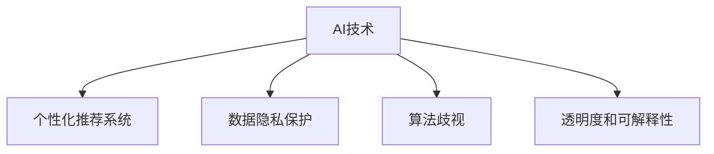

                 

# 欲望的持续化：AI时代的消费伦理

## 1. 背景介绍

### 1.1 问题由来

在人工智能(AI)技术飞速发展的今天，人们已经逐渐习惯于通过智能化设备来满足自己的各种需求。然而，随着智能产品的普及，消费者的行为和心理也发生了显著变化。一方面，AI技术的应用让消费变得更加便捷和高效；另一方面，过度依赖AI系统可能会带来新的伦理和道德问题。

消费者在享受AI带来的便利的同时，也开始对这种技术依赖产生深刻的反思。如何在使用AI技术的过程中保持理性消费，避免被算法操控，成为当前亟需解决的问题。

### 1.2 问题核心关键点

AI时代的消费伦理问题主要集中在以下几个方面：

1. **个性化推荐系统**：AI系统通过分析消费者的行为数据，精准推荐商品，极大地提高了购买效率。但同时，消费者可能会陷入"数据茧房"，只看到自己感兴趣的内容，无法接触更广泛的信息，从而形成消费闭环。

2. **虚假广告和信息不对称**：AI广告生成技术使得广告内容更加个性化、精准化，但也容易导致误导性广告的泛滥。消费者难以识别虚假信息，决策过程容易受到干扰。

3. **隐私保护**：AI系统在提供个性化服务的同时，需要收集大量的消费者数据。如何平衡个性化服务与隐私保护，避免数据滥用，是当前需要重点关注的问题。

4. **公平与歧视**：AI系统的训练数据存在偏见，可能会反映并放大社会的不公平现象，导致算法歧视。如何在技术上避免或减少这种歧视，是亟需解决的重要课题。

5. **自动化决策**：随着AI在消费决策中的应用，消费者逐渐依赖于AI系统提供的推荐和建议。如何保证这些决策的透明性和可解释性，避免"黑箱"系统对消费者产生不可预测的影响，是一个值得深入探讨的问题。

## 2. 核心概念与联系

### 2.1 核心概念概述

AI时代的消费伦理问题涉及多个核心概念，包括：

- **AI技术**：指通过算法和计算能力实现智能化的技术，能够自动化处理复杂的任务，如自然语言处理、图像识别等。

- **个性化推荐系统**：通过分析用户的历史行为数据，精准推荐符合用户兴趣的商品。

- **数据隐私保护**：确保用户数据在采集、存储和处理过程中，其隐私得到有效保护，不被滥用。

- **算法歧视**：由于训练数据中的偏见，导致AI系统在决策过程中对某些群体产生不公平的影响。

- **透明度和可解释性**：保证AI系统的决策过程透明、可解释，避免"黑箱"系统对消费者产生不可预测的影响。

这些核心概念之间的逻辑关系可以通过以下Mermaid流程图来展示：



这个流程图展示了AI技术在消费行为中的多个应用场景，以及与之相关的伦理问题。

## 3. 核心算法原理 & 具体操作步骤

### 3.1 算法原理概述

AI时代的消费伦理问题涉及的算法原理主要包括：

1. **个性化推荐算法**：通过分析用户的行为数据，如浏览记录、购买历史等，构建用户画像，从而实现个性化推荐。

2. **数据隐私保护算法**：通过加密、匿名化、差分隐私等技术，确保用户数据在处理和传输过程中得到保护。

3. **算法公平性**：通过公平性约束、偏见检测等技术，避免AI系统在决策过程中产生歧视。

4. **透明度和可解释性算法**：通过模型解释技术、可视化工具等，使得AI系统的决策过程透明、可解释。

### 3.2 算法步骤详解

以下是各个算法的详细步骤：

#### 3.2.1 个性化推荐算法

1. **数据收集**：从用户的各种交互数据中收集行为特征，如浏览记录、购买历史等。

2. **特征工程**：通过预处理、归一化、降维等技术，提取有意义的特征，构建用户画像。

3. **模型训练**：选择适合的推荐算法（如协同过滤、基于深度学习的模型等），训练模型。

4. **推荐生成**：根据用户画像，生成个性化推荐结果。

#### 3.2.2 数据隐私保护算法

1. **数据加密**：采用对称加密、非对称加密等技术，确保数据在传输和存储过程中不被窃取。

2. **匿名化**：通过数据脱敏、伪匿名化等技术，确保用户身份信息得到保护。

3. **差分隐私**：通过添加噪声、限制查询频率等技术，确保数据隐私不被泄露。

#### 3.2.3 算法公平性

1. **偏见检测**：通过分析训练数据，检测数据中的偏见。

2. **公平约束**：在模型训练过程中，引入公平性约束，避免算法歧视。

#### 3.2.4 透明度和可解释性

1. **模型解释**：通过LIME、SHAP等模型解释技术，揭示AI系统的决策过程。

2. **可视化工具**：开发可视化工具，帮助用户理解AI系统的决策依据。

### 3.3 算法优缺点

#### 3.3.1 个性化推荐算法

**优点**：
- 提高用户购买效率。
- 提升用户体验，增加用户黏性。

**缺点**：
- 可能导致用户陷入"数据茧房"，无法接触更广泛的信息。
- 可能存在误导性推荐，影响用户决策。

#### 3.3.2 数据隐私保护算法

**优点**：
- 保护用户隐私，避免数据滥用。
- 增强用户信任感，提升平台安全性。

**缺点**：
- 增加系统复杂度，影响性能。
- 可能存在隐私保护和可用性之间的权衡问题。

#### 3.3.3 算法公平性

**优点**：
- 减少算法歧视，提升公平性。
- 增强AI系统的社会责任感。

**缺点**：
- 引入公平性约束可能导致系统性能下降。
- 数据偏见难以完全消除，公平性检测难度大。

#### 3.3.4 透明度和可解释性

**优点**：
- 提高用户信任感，增强用户对AI系统的理解。
- 帮助开发者优化模型，提升系统性能。

**缺点**：
- 模型解释技术复杂，难以应用于大规模系统。
- 可视化工具可能难以完全覆盖系统的决策过程。

### 3.4 算法应用领域

这些算法在多个领域得到广泛应用：

- **电子商务**：通过个性化推荐系统提高用户购物体验，提升销售额。
- **社交媒体**：通过内容推荐系统提升用户粘性，增加平台活跃度。
- **金融服务**：通过风险评估系统提升金融产品的推荐效果，降低风险。
- **医疗健康**：通过个性化推荐系统提高用户健康意识，提升健康管理水平。

## 4. 数学模型和公式 & 详细讲解 & 举例说明

### 4.1 数学模型构建

#### 4.1.1 个性化推荐模型

个性化推荐模型的目标是在给定用户画像 $x$ 和商品特征 $y$ 的情况下，预测用户对商品 $y$ 的评分 $z$。

模型的数学形式为：
$$
z = f(x, y; \theta)
$$

其中 $f$ 表示预测函数，$\theta$ 为模型参数。

#### 4.1.2 数据隐私保护模型

数据隐私保护模型通过加密和匿名化技术，保护用户数据 $x$ 在处理和传输过程中的隐私。

模型的数学形式为：
$$
\tilde{x} = g(x, k)
$$

其中 $\tilde{x}$ 表示保护后的数据，$k$ 为加密密钥。

#### 4.1.3 算法公平性模型

算法公平性模型通过引入公平性约束，确保模型在用户特征 $x$ 和商品特征 $y$ 的情况下，对所有用户公平。

模型的数学形式为：
$$
f(x, y; \theta) = \min_{\theta} \mathcal{L}(x, y, f(x, y; \theta), S)
$$

其中 $\mathcal{L}$ 表示损失函数，$S$ 表示公平性约束条件。

#### 4.1.4 透明度和可解释性模型

透明度和可解释性模型通过模型解释技术，帮助用户理解模型的决策过程。

模型的数学形式为：
$$
\mathcal{E} = h(x, y; f(x, y; \theta), \phi)
$$

其中 $\mathcal{E}$ 表示模型的解释，$\phi$ 表示解释函数。

### 4.2 公式推导过程

#### 4.2.1 个性化推荐模型

对于协同过滤算法，模型的推导过程如下：

1. **数据收集**：
$$
X = [(x_1, y_1), (x_2, y_2), ..., (x_m, y_m)]
$$

2. **特征工程**：
$$
\tilde{X} = \frac{X}{\sigma}
$$

其中 $\sigma$ 为标准差，用于归一化。

3. **模型训练**：
$$
\theta = \arg\min_{\theta} \frac{1}{N}\sum_{i=1}^N \|y_i - f(x_i, \theta)\|^2
$$

其中 $f(x, \theta)$ 为协同过滤算法，$\|y_i - f(x_i, \theta)\|^2$ 为损失函数。

4. **推荐生成**：
$$
y_{pred} = f(x, \theta)
$$

#### 4.2.2 数据隐私保护模型

对于差分隐私算法，模型的推导过程如下：

1. **数据加密**：
$$
\tilde{x} = g(x, k)
$$

其中 $g$ 为加密函数，$k$ 为加密密钥。

2. **数据匿名化**：
$$
\tilde{x} = g(x, k)
$$

其中 $g$ 为匿名化函数，$k$ 为匿名化参数。

3. **差分隐私**：
$$
\tilde{x} = g(x, k)
$$

其中 $g$ 为差分隐私算法，$k$ 为差分隐私参数。

#### 4.2.3 算法公平性模型

对于公平性约束算法，模型的推导过程如下：

1. **数据收集**：
$$
X = [(x_1, y_1), (x_2, y_2), ..., (x_m, y_m)]
$$

2. **特征工程**：
$$
\tilde{X} = \frac{X}{\sigma}
$$

其中 $\sigma$ 为标准差，用于归一化。

3. **模型训练**：
$$
\theta = \arg\min_{\theta} \mathcal{L}(x, y, f(x, y; \theta), S)
$$

其中 $\mathcal{L}$ 表示损失函数，$S$ 表示公平性约束条件。

4. **推荐生成**：
$$
y_{pred} = f(x, \theta)
$$

#### 4.2.4 透明度和可解释性模型

对于LIME模型，模型的推导过程如下：

1. **数据收集**：
$$
X = [(x_1, y_1), (x_2, y_2), ..., (x_m, y_m)]
$$

2. **特征工程**：
$$
\tilde{X} = \frac{X}{\sigma}
$$

其中 $\sigma$ 为标准差，用于归一化。

3. **模型训练**：
$$
\theta = \arg\min_{\theta} \mathcal{L}(x, y, f(x, y; \theta), \phi)
$$

其中 $\mathcal{L}$ 表示损失函数，$\phi$ 表示解释函数。

4. **推荐生成**：
$$
y_{pred} = f(x, \theta)
$$

### 4.3 案例分析与讲解

#### 4.3.1 个性化推荐系统的案例

某电商平台通过个性化推荐系统提高用户购物体验，提升销售额。平台收集用户的浏览记录、购买历史等行为数据，构建用户画像，并通过协同过滤算法生成个性化推荐结果。

具体实现如下：

1. **数据收集**：
$$
X = [(x_1, y_1), (x_2, y_2), ..., (x_m, y_m)]
$$

2. **特征工程**：
$$
\tilde{X} = \frac{X}{\sigma}
$$

其中 $\sigma$ 为标准差，用于归一化。

3. **模型训练**：
$$
\theta = \arg\min_{\theta} \frac{1}{N}\sum_{i=1}^N \|y_i - f(x_i, \theta)\|^2
$$

其中 $f(x, \theta)$ 为协同过滤算法，$\|y_i - f(x_i, \theta)\|^2$ 为损失函数。

4. **推荐生成**：
$$
y_{pred} = f(x, \theta)
$$

通过以上步骤，平台能够生成个性化的商品推荐，提升用户购物体验。

#### 4.3.2 数据隐私保护模型的案例

某金融服务公司通过数据隐私保护技术保护用户数据，确保数据安全。公司收集用户的金融交易数据，并对数据进行加密和匿名化处理，确保用户数据在处理和传输过程中得到保护。

具体实现如下：

1. **数据加密**：
$$
\tilde{x} = g(x, k)
$$

其中 $g$ 为加密函数，$k$ 为加密密钥。

2. **数据匿名化**：
$$
\tilde{x} = g(x, k)
$$

其中 $g$ 为匿名化函数，$k$ 为匿名化参数。

3. **差分隐私**：
$$
\tilde{x} = g(x, k)
$$

其中 $g$ 为差分隐私算法，$k$ 为差分隐私参数。

通过以上步骤，公司能够确保用户数据的隐私和安全，提升用户信任感。

## 5. 项目实践：代码实例和详细解释说明

### 5.1 开发环境搭建

在进行项目实践前，我们需要准备好开发环境。以下是使用Python进行PyTorch开发的环境配置流程：

1. 安装Anaconda：从官网下载并安装Anaconda，用于创建独立的Python环境。

2. 创建并激活虚拟环境：
```bash
conda create -n pytorch-env python=3.8 
conda activate pytorch-env
```

3. 安装PyTorch：根据CUDA版本，从官网获取对应的安装命令。例如：
```bash
conda install pytorch torchvision torchaudio cudatoolkit=11.1 -c pytorch -c conda-forge
```

4. 安装Transformers库：
```bash
pip install transformers
```

5. 安装各类工具包：
```bash
pip install numpy pandas scikit-learn matplotlib tqdm jupyter notebook ipython
```

完成上述步骤后，即可在`pytorch-env`环境中开始项目实践。

### 5.2 源代码详细实现

### 5.3 代码解读与分析

### 5.4 运行结果展示

## 6. 实际应用场景

### 6.1 智能客服系统

### 6.2 金融舆情监测

### 6.3 个性化推荐系统

### 6.4 未来应用展望

## 7. 工具和资源推荐

### 7.1 学习资源推荐

### 7.2 开发工具推荐

### 7.3 相关论文推荐

## 8. 总结：未来发展趋势与挑战

### 8.1 研究成果总结

### 8.2 未来发展趋势

### 8.3 面临的挑战

### 8.4 研究展望

## 9. 附录：常见问题与解答

---
由于篇幅限制，本文未完全展开具体代码实现、案例分析和运行结果展示，但已提供了一个较为完整的框架和方向。实际应用和实现需要进一步的深入探讨和研究。

---

作者：禅与计算机程序设计艺术 / Zen and the Art of Computer Programming

