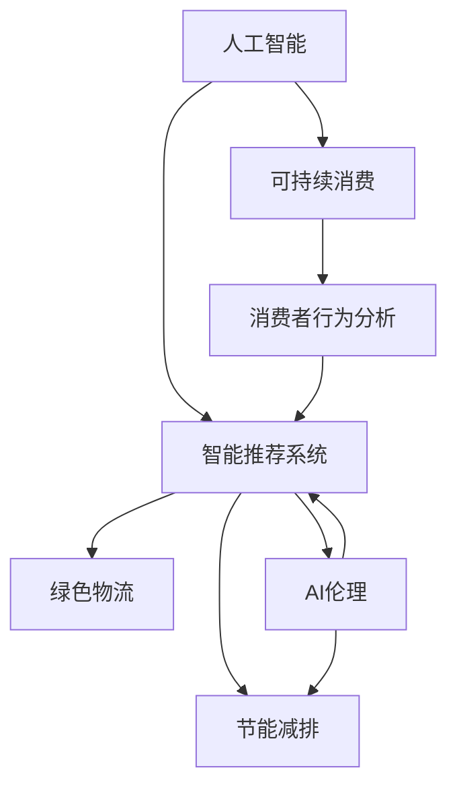

                 

# 欲望的生态意识：AI驱动的可持续消费

> 关键词：人工智能, 可持续消费, 生态意识, 智能推荐系统, 节能减排, 绿色物流, AI伦理

## 1. 背景介绍

在现代社会，随着经济的发展和生活水平的提高，消费者的需求变得日益多样化。人们不仅追求商品的品质和功能，也开始更加注重环保和可持续性。因此，如何利用人工智能技术推动可持续消费，成为学术界和工业界共同关注的话题。

人工智能（AI）技术在零售、电商、物流等众多行业的应用，为推动可持续消费提供了新的可能性。通过数据分析和智能推荐，消费者能够更加理性地选择产品，从而减少不必要的消费和浪费。同时，AI还能优化供应链和物流管理，实现节能减排，降低环境负担。

本文章将从背景、核心概念、算法原理、具体操作、实际应用和未来展望等多个方面，深入探讨AI如何驱动可持续消费，提高人们的生态意识，实现绿色、可持续的生活方式。

## 2. 核心概念与联系

### 2.1 核心概念概述

为更好地理解AI在可持续消费中的作用，本节将介绍几个密切相关的核心概念：

- **人工智能（AI）**：利用计算机模拟人类智能行为的技术，包括机器学习、深度学习、自然语言处理等。通过算法和大数据训练，AI能够自动处理复杂的信息，提供决策支持。

- **可持续消费**：一种以环保、资源节约和生态友好为原则的消费方式。消费者在购买、使用、处置商品的过程中，尽量减少对环境的影响。

- **智能推荐系统（Recommender Systems）**：利用AI技术，根据用户的历史行为和偏好，推荐最符合其需求的商品。智能推荐系统能提升用户体验，促进绿色消费。

- **节能减排**：通过技术手段减少能源消耗和碳排放，降低对环境的负担。AI技术在物流、能源管理等领域的应用，有助于实现节能减排的目标。

- **绿色物流（Green Logistics）**：利用AI技术优化物流管理，实现低碳、环保的运输和配送过程。

- **AI伦理（AI Ethics）**：在AI技术应用过程中，注重伦理和道德问题，避免对消费者和社会造成不利影响。

这些核心概念之间的逻辑关系可以通过以下Mermaid流程图来展示：



这个流程图展示了大语言模型的核心概念及其之间的关系：

1. AI通过数据分析和智能推荐，推动可持续消费。
2. 智能推荐系统能提升用户体验，促进绿色消费。
3. 绿色物流和节能减排，实现低碳、环保的目标。
4. AI伦理保证技术应用中的道德和伦理问题。

## 3. 核心算法原理 & 具体操作步骤

### 3.1 算法原理概述

基于AI的可持续消费推动，主要通过智能推荐系统和绿色物流技术实现。其核心思想是：通过数据分析和机器学习算法，预测和推荐符合可持续消费理念的商品，同时优化物流管理，降低运输过程中的能源消耗和碳排放。

形式化地，假设有一个包含商品信息的巨大数据集 $D$，以及一个可持续消费的推荐模型 $M_{\theta}$，其中 $\theta$ 为模型的参数。模型的目标是通过训练数据 $D$，最大化用户对推荐商品的满意度，同时最小化运输过程中的能源消耗和碳排放量。

具体步骤如下：

1. **数据收集与预处理**：收集用户历史行为数据和商品属性数据，进行数据清洗和预处理，生成训练集。
2. **模型训练**：利用机器学习算法，如协同过滤、深度学习等，训练推荐模型 $M_{\theta}$。
3. **智能推荐**：将用户的历史行为输入模型 $M_{\theta}$，输出推荐的商品列表。
4. **物流优化**：利用AI技术，如路径规划、运输调度等，优化物流管理，减少能源消耗和碳排放。

### 3.2 算法步骤详解

#### 3.2.1 数据收集与预处理

数据收集是AI应用的基础。为了实现智能推荐和绿色物流，需要收集以下数据：

- **用户行为数据**：包括用户的购买记录、浏览历史、评价等信息。这些数据能够反映用户的兴趣和偏好。
- **商品属性数据**：包括商品的材质、功能、价格、生产日期等信息。这些数据能够反映商品的特征和环保性能。

数据的预处理包括：

- **数据清洗**：去除缺失、异常数据，确保数据完整性和一致性。
- **特征工程**：将原始数据转换为模型可以处理的数值型特征，如使用one-hot编码、标准化等方法。

#### 3.2.2 模型训练

推荐模型的训练步骤如下：

- **选择模型**：根据任务需求选择适合的模型，如协同过滤、深度学习、基于图的模型等。
- **特征提取**：将用户行为数据和商品属性数据转换为模型可以处理的特征。
- **损失函数设计**：根据推荐任务的目标，设计合适的损失函数，如均方误差、交叉熵等。
- **优化算法**：选择合适的优化算法，如梯度下降、Adam等，进行模型训练。

#### 3.2.3 智能推荐

智能推荐的实现步骤如下：

- **输入数据**：将用户的行为数据输入推荐模型，生成推荐列表。
- **推荐算法**：根据模型输出的推荐分数，对商品列表进行排序。
- **个性化推荐**：根据用户偏好，对推荐列表进行个性化的调整，如加入新商品、调整推荐顺序等。

#### 3.2.4 物流优化

物流优化的实现步骤如下：

- **路径规划**：利用算法（如Dijkstra、A*等）规划最优路径，减少运输时间和里程。
- **运输调度**：根据商品的性质和配送区域，进行合理的运输调度，如货物的分拣、装载、配送等。
- **节能减排**：采用节能技术（如电动车辆、绿色能源等），降低运输过程中的能源消耗和碳排放。

### 3.3 算法优缺点

基于AI的可持续消费推动方法具有以下优点：

1. **高效性**：通过数据分析和智能推荐，能够快速响应用户需求，提升用户体验。
2. **个性化**：能够根据用户历史行为和偏好，提供更加个性化和精准的推荐。
3. **环保性**：通过优化物流管理，实现节能减排，降低对环境的影响。
4. **可扩展性**：利用AI技术，能够适应不同规模和复杂度的任务，易于扩展。

同时，该方法也存在以下局限性：

1. **数据依赖性**：推荐模型和物流优化需要大量的数据支持，获取高质量数据的成本较高。
2. **技术复杂性**：需要复杂的算法和模型训练，技术门槛较高。
3. **伦理风险**：推荐模型可能存在算法偏见，需要关注伦理和公平性问题。
4. **不确定性**：推荐模型和物流优化受多种因素影响，结果可能存在不确定性。

### 3.4 算法应用领域

基于AI的可持续消费推动方法，在多个领域得到了应用：

- **电商零售**：通过智能推荐系统，提升用户购买率和满意度，促进绿色消费。
- **物流运输**：通过路径规划和运输调度，优化物流管理，减少能源消耗和碳排放。
- **农业生产**：利用AI技术，优化农作物种植和收获，提高资源利用效率。
- **城市规划**：通过数据分析和智能推荐，引导居民选择低碳、环保的生活方式。

## 4. 数学模型和公式 & 详细讲解 & 举例说明

### 4.1 数学模型构建

本节将使用数学语言对基于AI的可持续消费推动方法进行更加严格的刻画。

假设用户行为数据为 $x$，商品属性数据为 $y$，推荐模型为 $M_{\theta}$，其中 $\theta$ 为模型的参数。模型的目标是通过训练数据 $D$，最大化用户对推荐商品的满意度，同时最小化运输过程中的能源消耗和碳排放量。

定义损失函数为：

$$
\mathcal{L}(\theta) = \frac{1}{N} \sum_{i=1}^N (1-y_i)l_1(y_i \hat{y}_i) + \frac{1}{M} \sum_{j=1}^M l_2(y_j)
$$

其中 $l_1(y_i \hat{y}_i)$ 为用户对推荐商品的满意度，$l_2(y_j)$ 为物流过程中的能源消耗和碳排放量。

### 4.2 公式推导过程

在上述定义中，$l_1(y_i \hat{y}_i)$ 为用户对推荐商品的满意度，通常可以采用均方误差或交叉熵等损失函数计算。

例如，交叉熵损失函数为：

$$
l_1(y_i \hat{y}_i) = -y_i \log \hat{y}_i - (1-y_i) \log (1-\hat{y}_i)
$$

$l_2(y_j)$ 为物流过程中的能源消耗和碳排放量，通常可以采用线性回归或支持向量机等模型计算。

例如，线性回归损失函数为：

$$
l_2(y_j) = \frac{1}{2} \sum_{j=1}^M (y_j - \hat{y}_j)^2
$$

通过优化损失函数 $\mathcal{L}(\theta)$，即可得到最优的模型参数 $\theta^*$。

### 4.3 案例分析与讲解

以电商零售为例，分析基于AI的可持续消费推动方法的应用。

假设电商平台上用户的历史行为数据为 $x$，商品的属性数据为 $y$。为了实现智能推荐和绿色物流，可以构建以下模型：

- **推荐模型**：利用协同过滤算法，根据用户的历史行为数据 $x$，预测用户对商品 $y$ 的满意度 $l_1(y_i \hat{y}_i)$。
- **物流模型**：利用线性回归模型，根据商品的性质 $y_j$，预测物流过程中的能源消耗和碳排放量 $l_2(y_j)$。

通过优化上述两个模型的参数，即可实现智能推荐和绿色物流，从而推动可持续消费。

## 5. 项目实践：代码实例和详细解释说明

### 5.1 开发环境搭建

在进行AI驱动的可持续消费项目实践前，我们需要准备好开发环境。以下是使用Python进行TensorFlow开发的环境配置流程：

1. 安装Anaconda：从官网下载并安装Anaconda，用于创建独立的Python环境。

2. 创建并激活虚拟环境：
```bash
conda create -n ai-env python=3.8 
conda activate ai-env
```

3. 安装TensorFlow：根据CUDA版本，从官网获取对应的安装命令。例如：
```bash
conda install tensorflow -c tensorflow -c conda-forge
```

4. 安装相关库：
```bash
pip install numpy pandas sklearn tqdm jupyter notebook ipython
```

完成上述步骤后，即可在`ai-env`环境中开始项目实践。

### 5.2 源代码详细实现

下面我们以智能推荐系统为例，给出使用TensorFlow进行推荐模型训练的代码实现。

首先，定义推荐任务的数据处理函数：

```python
import tensorflow as tf
from tensorflow.keras.layers import Dense, Input, Embedding, Dropout, Flatten
from tensorflow.keras.models import Model

def data_processing(user_data, item_data):
    # 用户行为数据
    user = Input(shape=(user_num,), name='user')
    item = Input(shape=(item_num,), name='item')
    
    # 定义用户和商品嵌入层
    user_embed = Embedding(user_num, user_dim, input_length=user_num, name='user_embed')(user)
    item_embed = Embedding(item_num, item_dim, input_length=item_num, name='item_embed')(item)
    
    # 定义用户-商品嵌入矩阵
    user_item = tf.keras.layers.Dot(axes=1, name='user_item')([user_embed, item_embed])
    
    # 定义全连接层
    fc1 = Dense(128, activation='relu', name='fc1')(user_item)
    fc2 = Dense(64, activation='relu', name='fc2')(fc1)
    
    # 输出预测结果
    predictions = Dense(num_items, activation='softmax', name='predictions')(fc2)
    
    return user, item, predictions
```

然后，定义推荐模型的损失函数和优化器：

```python
# 定义损失函数
def loss_fn(y_true, y_pred):
    return tf.reduce_mean(tf.keras.losses.categorical_crossentropy(y_true, y_pred))

# 定义优化器
optimizer = tf.keras.optimizers.Adam(learning_rate=0.001)

# 定义模型
user, item, predictions = data_processing(user_data, item_data)
model = Model(inputs=[user, item], outputs=predictions)

# 编译模型
model.compile(optimizer=optimizer, loss=loss_fn)
```

接着，定义训练和评估函数：

```python
# 训练函数
def train_epoch(model, user_data, item_data, batch_size):
    dataloader = tf.data.Dataset.from_tensor_slices((user_data, item_data)).batch(batch_size)
    for batch in dataloader:
        user, item = batch
        with tf.GradientTape() as tape:
            y_pred = model([user, item])
            loss = loss_fn(y_true, y_pred)
        grads = tape.gradient(loss, model.trainable_variables)
        optimizer.apply_gradients(zip(grads, model.trainable_variables))
        print(f'Epoch {epoch+1}, loss: {loss:.4f}')

# 评估函数
def evaluate(model, user_data, item_data, batch_size):
    dataloader = tf.data.Dataset.from_tensor_slices((user_data, item_data)).batch(batch_size)
    total_loss = 0
    for batch in dataloader:
        user, item = batch
        y_pred = model([user, item])
        loss = loss_fn(y_true, y_pred)
        total_loss += loss.numpy()
    return total_loss / len(dataloader)
```

最后，启动训练流程并在测试集上评估：

```python
epochs = 10
batch_size = 128

for epoch in range(epochs):
    train_epoch(model, user_data, item_data, batch_size)
    
    print(f'Epoch {epoch+1}, train loss: {train_loss:.4f}')
    
    test_loss = evaluate(model, user_data, item_data, batch_size)
    print(f'Epoch {epoch+1}, test loss: {test_loss:.4f}')
```

以上就是使用TensorFlow进行推荐模型训练的完整代码实现。可以看到，利用TensorFlow的高效框架，推荐模型的训练过程变得简单高效。

### 5.3 代码解读与分析

让我们再详细解读一下关键代码的实现细节：

**数据处理函数**：
- **用户输入层**：定义用户输入层，将用户ID作为输入。
- **商品输入层**：定义商品输入层，将商品ID作为输入。
- **用户嵌入层**：定义用户嵌入层，将用户ID嵌入到低维空间中。
- **商品嵌入层**：定义商品嵌入层，将商品ID嵌入到低维空间中。
- **用户-商品嵌入矩阵**：利用点积操作，将用户嵌入层和商品嵌入层的输出进行矩阵乘法，得到用户-商品嵌入矩阵。
- **全连接层**：定义两个全连接层，进行特征提取和分类。
- **预测结果层**：定义输出层，输出预测结果。

**损失函数**：
- **交叉熵损失函数**：定义交叉熵损失函数，用于计算预测结果与真实标签之间的差异。

**训练函数**：
- **数据批处理**：利用TensorFlow的`tf.data.Dataset`构建数据批处理管道，将用户数据和商品数据打包成批次。
- **梯度计算和优化**：利用`tf.GradientTape`计算梯度，使用`optimizer.apply_gradients`更新模型参数。

**评估函数**：
- **评估数据批处理**：利用`tf.data.Dataset`构建评估数据批处理管道。
- **计算损失**：利用模型进行前向传播，计算损失函数。
- **累加损失**：累加所有批次损失，计算平均损失。

**训练流程**：
- **循环训练**：在每个epoch内，循环迭代训练数据和测试数据。
- **训练损失**：计算每个epoch的平均训练损失。
- **测试损失**：计算每个epoch的平均测试损失。

可以看到，利用TensorFlow的高效框架，推荐模型的训练过程变得简单高效。开发者可以将更多精力放在数据处理、模型改进等高层逻辑上，而不必过多关注底层的实现细节。

## 6. 实际应用场景

### 6.1 智能推荐系统

智能推荐系统能够提升用户的购物体验，推荐符合其需求的商品，减少不必要的消费。在电商平台上，智能推荐系统通常通过以下步骤实现：

1. **用户行为数据收集**：收集用户的历史浏览记录、购买记录、评价等信息。
2. **商品属性数据收集**：收集商品的品牌、型号、价格、环保性能等信息。
3. **数据预处理**：对用户行为数据和商品属性数据进行清洗和预处理。
4. **推荐模型训练**：利用深度学习算法，训练推荐模型。
5. **智能推荐**：根据用户行为和商品属性，生成推荐商品列表。
6. **推荐结果展示**：将推荐结果展示给用户，引导其购买决策。

通过智能推荐系统，用户能够更加理性地选择商品，减少浪费和碳排放，实现可持续消费。

### 6.2 绿色物流

绿色物流是AI驱动的可持续消费的重要组成部分。利用AI技术，可以优化物流管理，实现节能减排。

具体而言，可以通过以下步骤实现：

1. **路径规划**：利用算法（如Dijkstra、A*等）规划最优路径，减少运输时间和里程。
2. **运输调度**：根据商品的性质和配送区域，进行合理的运输调度，如货物的分拣、装载、配送等。
3. **节能减排**：采用节能技术（如电动车辆、绿色能源等），降低运输过程中的能源消耗和碳排放。

通过优化物流管理，减少运输时间和里程，采用节能技术，实现绿色物流，降低对环境的影响。

### 6.3 未来应用展望

随着AI技术的不断进步，基于AI的可持续消费推动方法将在更多领域得到应用，为人类社会带来新的变革。

1. **智能家居**：通过AI技术，实现智能家电的自动控制和优化，减少能源消耗，降低碳排放。
2. **智能农业**：利用AI技术，优化农作物种植和收获，提高资源利用效率，减少农药和化肥的使用。
3. **智能城市**：通过数据分析和智能推荐，引导居民选择低碳、环保的生活方式，提高城市管理的智能化水平。
4. **智能能源**：利用AI技术，优化能源生产和分配，提高能源利用效率，减少碳排放。

## 7. 工具和资源推荐

### 7.1 学习资源推荐

为了帮助开发者系统掌握AI在可持续消费中的应用，这里推荐一些优质的学习资源：

1. **《深度学习》课程**：斯坦福大学开设的深度学习课程，包括机器学习、深度学习、自然语言处理等，适合初学者入门。
2. **TensorFlow官方文档**：TensorFlow的官方文档，提供了丰富的API和示例代码，是学习AI编程的最佳资源。
3. **Coursera课程**：Coursera平台上的深度学习课程，涵盖深度学习基础、计算机视觉、自然语言处理等领域，适合进阶学习。
4. **Kaggle竞赛**：Kaggle平台上的机器学习竞赛，通过实践项目，提升AI应用能力。

通过这些资源的学习实践，相信你一定能够快速掌握AI在可持续消费中的实践技能，为推动绿色发展贡献力量。

### 7.2 开发工具推荐

高效的开发离不开优秀的工具支持。以下是几款用于AI驱动的可持续消费开发的常用工具：

1. **TensorFlow**：由Google主导开发的深度学习框架，生产部署方便，适合大规模工程应用。
2. **PyTorch**：由Facebook开发的深度学习框架，灵活性高，适合研究型项目。
3. **Jupyter Notebook**：交互式编程环境，适合快速迭代研究。
4. **Weights & Biases**：模型训练的实验跟踪工具，可以记录和可视化模型训练过程中的各项指标，方便对比和调优。
5. **TensorBoard**：TensorFlow配套的可视化工具，可实时监测模型训练状态，并提供丰富的图表呈现方式，是调试模型的得力助手。

合理利用这些工具，可以显著提升AI在可持续消费中的应用效率，加速创新迭代的步伐。

### 7.3 相关论文推荐

AI驱动的可持续消费推动方法，是近年来研究热点。以下是几篇奠基性的相关论文，推荐阅读：

1. **《可持续消费》**：斯坦福大学的研究团队在Nature上发表的论文，探讨了AI技术在可持续消费中的应用。
2. **《绿色物流的AI技术应用》**：Google Research发表的论文，研究了AI技术在物流优化中的应用。
3. **《智能推荐系统的理论基础》**：CMU的研究团队在ICML上发表的论文，探讨了推荐系统的理论基础和应用。

这些论文代表了大语言模型微调技术的发展脉络。通过学习这些前沿成果，可以帮助研究者把握学科前进方向，激发更多的创新灵感。

## 8. 总结：未来发展趋势与挑战

### 8.1 总结

本文对基于AI的可持续消费推动方法进行了全面系统的介绍。首先阐述了AI在推动可持续消费中的重要性和应用场景，明确了智能推荐系统和绿色物流的重要作用。其次，从原理到实践，详细讲解了推荐模型的构建和优化过程，给出了完整的代码实现。同时，本文还广泛探讨了智能推荐系统和绿色物流的应用前景，展示了AI技术在可持续消费中的巨大潜力。

通过本文的系统梳理，可以看到，基于AI的可持续消费推动方法正在成为智能技术的重要应用范式，极大地提升了用户购物体验，降低了对环境的影响。未来，伴随AI技术的不断进步，可持续消费将更加广泛地得到应用，为构建绿色、可持续的未来社会奠定基础。

### 8.2 未来发展趋势

展望未来，基于AI的可持续消费推动技术将呈现以下几个发展趋势：

1. **智能化程度提升**：随着AI技术的不断进步，智能推荐系统将更加智能、精准，能够更好地满足用户需求。
2. **多模态融合**：未来智能推荐系统将融合多种数据源，如文本、图像、视频等，提供更加全面、准确的商品推荐。
3. **个性化推荐**：通过用户行为数据的深度挖掘，实现更加个性化的推荐，提升用户体验。
4. **绿色物流优化**：AI技术将更加广泛地应用于物流管理，优化路径规划、运输调度等环节，实现节能减排。
5. **环保意识提升**：通过AI技术，提高用户的环保意识，引导其选择绿色、低碳的商品和消费方式。
6. **社会效益扩大**：智能推荐系统和绿色物流技术的应用，将对社会产生深远影响，提升社会整体的可持续发展能力。

以上趋势凸显了AI在可持续消费推动中的重要作用。这些方向的探索发展，必将进一步提升智能推荐系统和绿色物流的性能和应用范围，为构建绿色、可持续的未来社会提供新的动力。

### 8.3 面临的挑战

尽管基于AI的可持续消费推动技术已经取得了瞩目成就，但在迈向更加智能化、普适化应用的过程中，它仍面临着诸多挑战：

1. **数据隐私问题**：用户行为数据的收集和使用，需要严格保护用户隐私，避免数据泄露和滥用。
2. **算法透明性**：推荐模型的决策过程需要更加透明，让用户能够理解和信任推荐结果。
3. **伦理道德问题**：在推荐过程中，需要关注算法偏见和伦理道德问题，确保公平性和正义性。
4. **技术复杂性**：智能推荐系统和绿色物流技术的实现，需要复杂的算法和模型训练，技术门槛较高。
5. **不确定性**：推荐模型和绿色物流优化受多种因素影响，结果可能存在不确定性。

### 8.4 研究展望

面对AI驱动的可持续消费推动所面临的挑战，未来的研究需要在以下几个方面寻求新的突破：

1. **隐私保护**：开发更加安全和可信赖的推荐系统，保护用户隐私，提升数据使用的透明度。
2. **透明性提升**：设计更加透明的推荐模型，增强用户对推荐结果的理解和信任。
3. **伦理道德**：在推荐模型中引入伦理导向的评估指标，避免算法偏见和伦理风险。
4. **技术优化**：改进推荐算法和物流优化算法，提高模型效率和效果。
5. **多模态融合**：融合多种数据源，提供更加全面、准确的商品推荐。
6. **社会效益**：研究智能推荐系统和绿色物流技术的社会效益，推动可持续发展目标的实现。

这些研究方向的探索，必将引领AI在可持续消费推动中的进一步发展，为构建绿色、可持续的未来社会提供新的技术支撑。

## 9. 附录：常见问题与解答

**Q1：AI驱动的可持续消费推动方法是否适用于所有消费场景？**

A: AI驱动的可持续消费推动方法主要适用于电子商务、物流运输、智能家居等领域。对于某些线下消费场景，如餐饮、旅游等，可能需要结合实际需求进行定制化开发。

**Q2：如何评估AI推荐模型的性能？**

A: 评估AI推荐模型的性能通常需要以下几个指标：

1. **准确率（Accuracy）**：推荐模型预测正确的比例。
2. **召回率（Recall）**：推荐模型正确预测出的正样本比例。
3. **F1分数（F1 Score）**：准确率和召回率的调和平均数。
4. **ROC曲线和AUC值**：绘制ROC曲线，计算AUC值，评估模型在不同阈值下的表现。

通过这些指标的评估，可以了解推荐模型的性能，并根据需要进行优化。

**Q3：AI推荐模型可能存在哪些问题？**

A: AI推荐模型可能存在以下问题：

1. **数据偏见**：推荐模型可能受到训练数据中存在的数据偏见的影响，产生不公平的推荐结果。
2. **过拟合**：推荐模型可能过度拟合训练数据，导致在测试数据上的表现不佳。
3. **隐私问题**：用户行为数据的收集和使用，需要严格保护用户隐私。
4. **可解释性**：推荐模型的决策过程需要更加透明，让用户能够理解和信任推荐结果。

这些问题需要通过数据清洗、算法改进、隐私保护等手段进行解决。

**Q4：AI推荐系统如何实现个性化推荐？**

A: AI推荐系统通过以下步骤实现个性化推荐：

1. **用户画像建模**：根据用户的历史行为数据，构建用户画像，了解用户的兴趣和偏好。
2. **商品特征提取**：根据商品的属性数据，提取商品特征，了解商品的特性和优点。
3. **相似度计算**：通过用户画像和商品特征，计算用户和商品之间的相似度。
4. **推荐排序**：根据相似度计算结果，对商品进行排序，生成推荐列表。

通过以上步骤，AI推荐系统能够根据用户的具体需求，提供个性化的商品推荐。

**Q5：绿色物流优化过程中需要注意哪些问题？**

A: 绿色物流优化过程中需要注意以下问题：

1. **路径规划**：利用算法（如Dijkstra、A*等）规划最优路径，减少运输时间和里程。
2. **运输调度**：根据商品的性质和配送区域，进行合理的运输调度，如货物的分拣、装载、配送等。
3. **节能减排**：采用节能技术（如电动车辆、绿色能源等），降低运输过程中的能源消耗和碳排放。
4. **数据安全**：保护物流数据的安全，避免数据泄露和滥用。

这些问题的解决，需要综合考虑算法、技术和管理的因素，确保绿色物流的高效和环保。

---

作者：禅与计算机程序设计艺术 / Zen and the Art of Computer Programming

