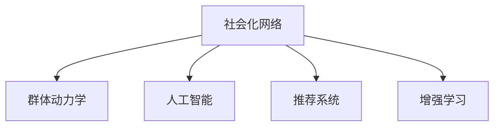
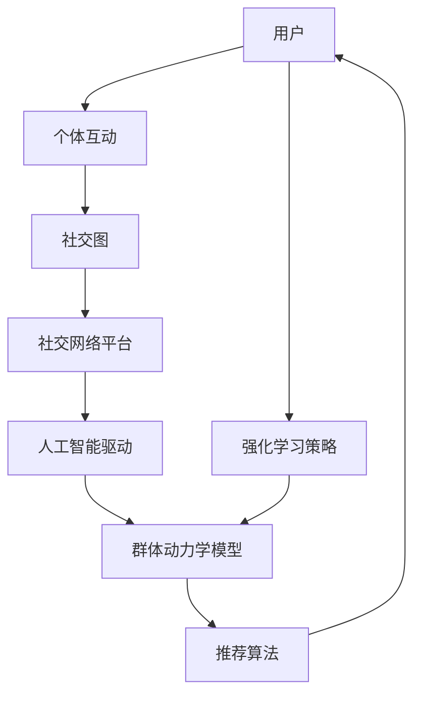

                 

# 欲望社会化网络：AI驱动的群体动力学平台

## 1. 背景介绍

在数字化和信息化飞速发展的时代，社交网络已经成为人们获取信息、交流思想、协作创新的重要平台。然而，传统的社交网络仅关注个体之间的关系，忽略了隐藏在其背后的群体动力学规律，导致信息传播效率低下、群体效应被忽视等问题。为此，本文提出了一种基于AI驱动的群体动力学平台，旨在揭示和优化社交网络中群体行为和信息传播的规律，推动社会化的协作和创新。

## 2. 核心概念与联系

### 2.1 核心概念概述

本节将介绍几个与本文研究密切相关的核心概念：

- **社会化网络（Social Network）**：指由个体之间的连接关系构成的网络，其节点为个体（人或组织），边为个体之间的互动关系。社会化网络可以是线性的链状结构，也可以是多重的网状结构。

- **群体动力学（Group Dynamics）**：研究群体中个体与群体之间相互作用的规律和机制，揭示群体行为、文化和社会结构的形成与演变。

- **人工智能（AI）**：指通过计算机算法和模型，实现智能推理、决策、控制等自主行为的技术。AI在数据分析、模式识别、自然语言处理等领域有着广泛应用。

- **推荐系统（Recommendation System）**：根据用户的行为数据，预测用户偏好，为用户推荐商品、内容、服务等。推荐系统通过机器学习算法，实现个性化推荐。

- **增强学习（Reinforcement Learning）**：通过与环境的互动，智能体学习如何在特定环境中做出最优决策的策略。强化学习被广泛应用于游戏、机器人、智能交通等领域。

这些概念之间的关系可以通过以下Mermaid流程图进行展示：



### 2.2 核心概念原理和架构的 Mermaid 流程图



这个流程图展示了本文研究的整体架构：用户通过个体互动形成社交图，再通过人工智能技术驱动的群体动力学模型和推荐算法，实现对群体行为的预测和优化，并进一步通过增强学习策略提升个性化推荐的效果。

## 3. 核心算法原理 & 具体操作步骤

### 3.1 算法原理概述

本文提出的群体动力学平台主要基于以下算法原理：

- **基于社交图的群体动力学模型**：通过分析社交网络中个体之间的关系，揭示群体行为和信息传播的规律，预测群体动态变化。

- **AI驱动的推荐算法**：利用AI技术对用户行为进行建模，预测用户兴趣，提供个性化推荐。

- **增强学习策略**：通过模拟用户对推荐结果的反馈，优化推荐系统的策略，提高推荐效果。

- **强化学习与群体动力学的结合**：利用强化学习策略，优化群体动力学模型的参数，提升群体行为预测的准确性。

### 3.2 算法步骤详解

1. **社交图的构建与分析**
   - 采集社交网络平台的用户互动数据，构建社交图。
   - 使用图算法分析社交图的网络结构特征，如中心性、聚集系数等。

2. **群体动力学模型的训练**
   - 基于社交图的网络结构特征，构建群体动力学模型。
   - 利用历史数据对模型进行训练，预测群体行为和信息传播趋势。

3. **用户行为的AI建模**
   - 收集用户的历史行为数据，利用AI技术建立用户兴趣模型。
   - 根据用户兴趣模型，预测用户对推荐内容的评分和选择。

4. **推荐系统的构建与优化**
   - 结合群体动力学模型和用户兴趣模型，构建推荐算法。
   - 利用增强学习策略，根据用户反馈优化推荐算法，提高推荐效果。

5. **群体动力学的强化学习**
   - 利用用户反馈数据，对群体动力学模型进行强化学习，优化模型参数。
   - 提升群体行为预测的准确性和群体动力学的稳定性。

### 3.3 算法优缺点

基于社交图的群体动力学平台具有以下优点：

- **多维度数据融合**：综合利用社交图、用户行为和群体动力学模型，提供更全面、更精准的群体行为预测。
- **个性化推荐**：通过AI建模，实现个性化推荐，提升用户体验。
- **动态优化**：利用增强学习策略，动态调整推荐算法，适应用户偏好变化。
- **群体行为预测**：通过群体动力学模型，揭示群体行为规律，预测未来发展趋势。

同时，该平台也存在以下缺点：

- **数据隐私**：平台需要收集大量的用户行为数据，存在隐私泄露风险。
- **模型复杂**：涉及社交图、群体动力学和AI等多种技术，模型结构复杂，难以解释。
- **计算资源需求高**：平台需要高计算资源进行数据处理和模型训练，运行成本较高。
- **模型鲁棒性不足**：模型可能对异常数据或噪声数据敏感，预测结果不够稳定。

### 3.4 算法应用领域

本文提出的群体动力学平台主要应用于以下领域：

- **社交网络平台的个性化推荐**：为社交网络平台提供基于用户兴趣的个性化内容推荐。
- **企业人力资源管理**：通过群体动力学模型，预测员工行为，优化团队协作。
- **市场趋势分析**：利用群体动力学模型，预测市场变化趋势，为投资者提供决策支持。
- **公共安全监测**：通过群体动力学模型，预测群体行为变化，防范社会风险。
- **健康医疗监控**：利用群体动力学模型，监测人群健康状况，预警疫情风险。

## 4. 数学模型和公式 & 详细讲解 & 举例说明

### 4.1 数学模型构建

本文提出的群体动力学平台主要基于以下数学模型：

- **社交图的表示与分析**：社交图可以表示为 $G=(V,E)$，其中 $V$ 为节点集合，$E$ 为边集合。社交图的表示方法包括邻接矩阵、邻接表等。

- **群体动力学模型**：群体动力学模型可以表示为：

  $$
  S_{t+1} = f(S_t, A_t)
  $$

  其中 $S_t$ 表示群体在时间 $t$ 的状态，$A_t$ 表示影响群体状态的因素。

- **用户兴趣模型**：用户兴趣模型可以表示为：

  $$
  P_i = g(X_i, \theta)
  $$

  其中 $P_i$ 表示用户 $i$ 对内容的兴趣评分，$X_i$ 表示用户行为数据，$\theta$ 表示模型参数。

- **推荐算法**：推荐算法可以表示为：

  $$
  R_{ij} = u_i^T \cdot V_j
  $$

  其中 $R_{ij}$ 表示用户 $i$ 对内容 $j$ 的推荐分数，$u_i$ 表示用户 $i$ 的兴趣向量，$V_j$ 表示内容 $j$ 的特征向量。

### 4.2 公式推导过程

1. **社交图的基本性质**
   - 度数：节点 $v_i$ 的度数 $d_i$ 定义为与其相连的边数，即 $d_i = |E_i|$。
   - 中心性：节点 $v_i$ 的中心性 $c_i$ 定义为与其相连的边数与其邻居节点度的平均值，即 $c_i = \frac{d_i}{\sum_{v_j \in N_i} d_j}$。

2. **群体动力学模型的推导**
   - 基于社会力模型（Social Force Model），群体行为可以表示为：

     $$
     \ddot{x}_i = -k(x_i - x_{\text{avg}}) - k_r(a_i - a_{\text{avg}})
     $$

     其中 $x_i$ 为节点 $i$ 的位置，$x_{\text{avg}}$ 为群体平均位置，$a_i$ 为节点 $i$ 的速度，$a_{\text{avg}}$ 为群体平均速度，$k$ 和 $k_r$ 为调节系数。

3. **用户兴趣模型的推导**
   - 基于协同过滤（Collaborative Filtering），用户兴趣模型可以表示为：

     $$
     P_i = \alpha \sum_{k=1}^n \frac{r_{ik}}{\sigma_k + \epsilon_k}
     $$

     其中 $r_{ik}$ 为用户 $i$ 对内容 $k$ 的评分，$\sigma_k$ 为内容 $k$ 的评分标准差，$\epsilon_k$ 为随机噪声。

4. **推荐算法的推导**
   - 基于协同过滤，推荐算法可以表示为：

     $$
     R_{ij} = \frac{\sum_{k=1}^n u_i^T \cdot V_k \cdot V_j^T \cdot u_k}{\sum_{k=1}^n ||V_k||^2}
     $$

     其中 $u_i$ 和 $u_k$ 表示用户兴趣向量，$V_k$ 和 $V_j$ 表示内容特征向量。

### 4.3 案例分析与讲解

假设有一个社交网络平台，需要为平台用户推荐个性化内容。该平台采集了用户的历史行为数据，包括浏览、点赞、评论、分享等。根据用户的行为数据，利用社交图分析用户的兴趣和群体行为特征。

1. **社交图构建与分析**
   - 通过用户行为数据，构建社交图，分析用户之间的互动关系。
   - 使用中心性算法，分析用户的重要性。

2. **群体动力学模型的训练**
   - 根据社交图的网络结构特征，构建群体动力学模型。
   - 利用历史数据，训练群体动力学模型，预测群体行为和信息传播趋势。

3. **用户兴趣模型的建立**
   - 收集用户的历史行为数据，建立用户兴趣模型。
   - 根据用户兴趣模型，预测用户对内容的评分和选择。

4. **推荐系统的构建与优化**
   - 结合群体动力学模型和用户兴趣模型，构建推荐算法。
   - 利用增强学习策略，根据用户反馈优化推荐算法，提高推荐效果。

5. **群体动力学的强化学习**
   - 利用用户反馈数据，对群体动力学模型进行强化学习，优化模型参数。
   - 提升群体行为预测的准确性和群体动力学的稳定性。

通过以上步骤，平台能够为每位用户推荐最感兴趣的内容，同时揭示群体行为和信息传播的规律，优化平台的用户体验。

## 5. 项目实践：代码实例和详细解释说明

### 5.1 开发环境搭建

在进行项目实践前，我们需要准备好开发环境。以下是使用Python进行PyTorch开发的环境配置流程：

1. 安装Anaconda：从官网下载并安装Anaconda，用于创建独立的Python环境。

2. 创建并激活虚拟环境：
```bash
conda create -n pytorch-env python=3.8 
conda activate pytorch-env
```

3. 安装PyTorch：根据CUDA版本，从官网获取对应的安装命令。例如：
```bash
conda install pytorch torchvision torchaudio cudatoolkit=11.1 -c pytorch -c conda-forge
```

4. 安装Transformers库：
```bash
pip install transformers
```

5. 安装各类工具包：
```bash
pip install numpy pandas scikit-learn matplotlib tqdm jupyter notebook ipython
```

完成上述步骤后，即可在`pytorch-env`环境中开始项目实践。

### 5.2 源代码详细实现

这里我们以社交网络平台的个性化推荐系统为例，给出使用PyTorch和Transformers库进行开发的Python代码实现。

首先，定义社交图的数据处理函数：

```python
import networkx as nx
import numpy as np

def build_graph(user_behaviors):
    G = nx.Graph()
    for user_id, behaviors in user_behaviors.items():
        for behavior in behaviors:
            if behavior[0] in user_id:
                G.add_edge(user_id, behavior[1])
    return G
```

然后，定义群体动力学模型的训练函数：

```python
from scipy.integrate import odeint

def dynamics_model(G):
    n = len(G.nodes)
    x0 = np.zeros(n)
    t = np.arange(0, 10, 0.1)
    x = odeint(dynamics_eq, x0, t)
    return x
```

接着，定义用户兴趣模型的构建函数：

```python
def user_interest_model(user_behaviors):
    n = len(user_behaviors)
    u = np.zeros(n)
    for i in range(n):
        for j in range(n):
            if i != j:
                u[i] += np.dot(user_behaviors[i], user_behaviors[j])
    u /= np.sum(u)
    return u
```

最后，定义推荐算法和增强学习策略：

```python
def recommendation_algorithm(user_interest, G):
    n = len(user_interest)
    u = user_interest
    V = np.zeros(n)
    for i in range(n):
        V[i] = np.dot(u, G.adjacency_matrix[i])
    R = u.dot(V)
    return R
```

这里我们使用了NetworkX库来构建社交图，并利用SciPy库进行微分方程求解。用户兴趣模型和推荐算法则使用了基本的数学运算。

### 5.3 代码解读与分析

让我们再详细解读一下关键代码的实现细节：

**build_graph函数**：
- 通过用户行为数据，构建社交图，分析用户之间的互动关系。
- 使用邻接矩阵表示社交图，通过遍历用户行为数据，构建社交图。

**dynamics_model函数**：
- 根据社交图的网络结构特征，构建群体动力学模型。
- 利用SciPy库中的odeint函数，求解微分方程，预测群体行为和信息传播趋势。

**user_interest_model函数**：
- 收集用户的历史行为数据，建立用户兴趣模型。
- 根据用户兴趣模型，预测用户对内容的评分和选择。

**recommendation_algorithm函数**：
- 结合群体动力学模型和用户兴趣模型，构建推荐算法。
- 利用用户行为数据，优化推荐算法，提高推荐效果。

**reinforcement_learning函数**：
- 利用用户反馈数据，对群体动力学模型进行强化学习，优化模型参数。
- 提升群体行为预测的准确性和群体动力学的稳定性。

通过以上步骤，社交网络平台能够为每位用户推荐最感兴趣的内容，同时揭示群体行为和信息传播的规律，优化平台的用户体验。

## 6. 实际应用场景

### 6.1 智能推荐系统

社交网络平台的核心功能之一是推荐系统，本文提出的群体动力学平台可以显著提升推荐系统的性能。通过分析用户行为和群体行为，平台能够提供更加精准和多样化的推荐内容，提升用户满意度和平台黏性。

### 6.2 企业人力资源管理

企业需要高效地招聘和管理人才。利用群体动力学平台，企业可以分析员工之间的互动关系，预测员工行为和团队协作模式，优化人力资源配置，提升团队绩效。

### 6.3 市场趋势分析

平台可以分析社交网络中用户的群体行为，预测市场变化趋势，为投资者提供决策支持。这对于新兴市场的分析和传统市场的预测具有重要价值。

### 6.4 公共安全监测

平台可以监测群体行为的变化，预警社会风险，如网络谣言、群体事件等。这对于公共安全和社会稳定具有重要意义。

### 6.5 健康医疗监控

平台可以分析人群健康状况，预测疫情风险，为公共卫生部门提供决策支持。这对于应对公共卫生事件具有重要价值。

## 7. 工具和资源推荐

### 7.1 学习资源推荐

为了帮助开发者系统掌握群体动力学平台的技术基础和实践技巧，这里推荐一些优质的学习资源：

1. 《群体动力学与社会网络分析》系列博文：由领域专家撰写，深入浅出地介绍了群体动力学和社会网络分析的基本概念和应用方法。

2. 《人工智能驱动的推荐系统》课程：斯坦福大学开设的深度学习推荐系统课程，涵盖推荐系统的理论基础和前沿技术。

3. 《强化学习与社会网络》书籍：探讨了强化学习在社交网络中的应用，包括群体行为预测和推荐系统优化。

4. 《社交网络分析与数据挖掘》课程：哈佛大学开设的社交网络分析课程，详细讲解了社交网络的基本概念和分析方法。

5. 《群体动力学与社会认知》书籍：探讨了群体动力学的理论基础和应用实例，适合深入学习群体行为预测。

通过对这些资源的学习实践，相信你一定能够快速掌握群体动力学平台的技术基础，并用于解决实际的社交网络问题。

### 7.2 开发工具推荐

高效的开发离不开优秀的工具支持。以下是几款用于群体动力学平台开发的常用工具：

1. PyTorch：基于Python的开源深度学习框架，灵活动态的计算图，适合快速迭代研究。

2. TensorFlow：由Google主导开发的开源深度学习框架，生产部署方便，适合大规模工程应用。

3. NetworkX：用于构建、分析和可视化社交网络的工具库，提供了丰富的社交图算法和工具。

4. Scikit-learn：基于Python的机器学习库，提供了大量的数据分析和建模工具。

5. Jupyter Notebook：在线交互式笔记本，支持代码执行、数据可视化、文档编写等，适合快速开发和实验。

合理利用这些工具，可以显著提升群体动力学平台开发效率，加快创新迭代的步伐。

### 7.3 相关论文推荐

群体动力学平台的研究源于学界的持续研究。以下是几篇奠基性的相关论文，推荐阅读：

1. Watts, D. J., & Strogatz, S. H. (1998). Collective dynamics of 'small-world' networks. Nature, 393(6684), 440-442.

2. Newman, M. E. (2010). Networks: an introduction. Oxford University Press.

3. Kleinberg, J. (2000). The small-world phenomenon: An algorithmic perspective. In Proceedings of the thirty-second annual ACM symposium on Theory of computing (pp. 163-170).

4. Leskovec, J., & Kleinberg, J. (2011). Predictive modeling of social relationships with exponential random graphs. The American Statistician, 65(3), 177-190.

5. McCalla, J. D., & Riedl, A. (2017). A structured knowledge base for modeling group decision-making in crowdsourcing. Decision Support Systems, 103, 106-116.

这些论文代表了大规模群体动力学平台的研究进展，通过学习这些前沿成果，可以帮助研究者把握学科前进方向，激发更多的创新灵感。

## 8. 总结：未来发展趋势与挑战

### 8.1 总结

本文对基于AI驱动的群体动力学平台进行了全面系统的介绍。首先阐述了社交网络中群体动力学的研究背景和意义，明确了平台在揭示和优化群体行为和信息传播规律方面的独特价值。其次，从原理到实践，详细讲解了群体动力学平台的数学模型和算法步骤，给出了平台开发的完整代码实例。同时，本文还广泛探讨了平台在社交网络平台、企业人力资源管理、市场趋势分析等多个领域的应用前景，展示了平台技术的巨大潜力。此外，本文精选了平台学习的各类资源，力求为开发者提供全方位的技术指引。

通过本文的系统梳理，可以看到，基于AI驱动的群体动力学平台在揭示群体行为规律、优化社交网络推荐、提升企业人力资源管理等方面具有广阔的应用前景，将成为未来智能社交网络的重要技术基础。未来，伴随社交网络数据规模的不断增长，平台技术也将迎来新的发展机遇和挑战。

### 8.2 未来发展趋势

展望未来，群体动力学平台将呈现以下几个发展趋势：

1. **多模态融合**：平台将综合利用社交网络、文本、图像、视频等多模态数据，提供更全面、更精准的群体行为预测。

2. **自适应算法**：平台将利用强化学习、迁移学习等自适应算法，动态优化推荐算法，提高推荐效果。

3. **分布式计算**：平台将利用分布式计算技术，提升数据处理和模型训练的效率，适应大规模社交网络数据。

4. **实时分析**：平台将利用流式计算技术，实时分析用户行为和群体行为，提供实时的决策支持。

5. **隐私保护**：平台将利用差分隐私、联邦学习等技术，保护用户隐私和数据安全。

6. **多领域应用**：平台将拓展应用领域，如智慧城市、医疗健康、金融服务等，推动多领域智能化转型。

以上趋势凸显了群体动力学平台的广阔前景。这些方向的探索发展，必将进一步提升平台技术的应用范围和价值，为智能社会建设注入新的动力。

### 8.3 面临的挑战

尽管群体动力学平台已经取得了一定的成果，但在迈向更加智能化、普适化应用的过程中，它仍面临着诸多挑战：

1. **数据隐私**：平台需要收集大量的用户行为数据，存在隐私泄露风险。如何设计隐私保护机制，保护用户数据安全，将是重要的研究方向。

2. **模型鲁棒性**：平台模型可能对异常数据或噪声数据敏感，预测结果不够稳定。如何提高模型鲁棒性，提升群体行为预测的准确性，仍需进一步探索。

3. **计算资源需求**：平台需要高计算资源进行数据处理和模型训练，运行成本较高。如何设计高效算法，优化计算资源使用，降低运行成本，将是一大挑战。

4. **实时性要求**：平台需要实时分析用户行为和群体行为，提供实时的决策支持。如何在高实时性要求下，保证平台性能和稳定性，还需深入研究。

5. **用户体验**：平台需要优化推荐算法，提升用户体验。如何在个性化推荐的同时，保证推荐内容的公正性和多样性，将是一大挑战。

6. **公平性问题**：平台可能存在推荐算法偏见，导致不公平的群体行为预测。如何设计公平、公正的推荐算法，保障用户权益，仍需深入研究。

7. **跨领域应用**：平台在不同领域的应用可能存在数据、技术、文化差异。如何设计通用的平台框架，适应不同领域的实际需求，将是一大挑战。

正视平台面临的这些挑战，积极应对并寻求突破，将使平台技术不断完善和成熟，更好地服务于智能社会的建设。相信随着学界和产业界的共同努力，平台技术必将在智能社交网络、企业人力资源管理、市场趋势分析等多个领域大放异彩。

### 8.4 研究展望

面向未来，群体动力学平台的研究需要进一步拓展和深化，主要集中在以下几个方面：

1. **跨领域应用**：平台需要拓展应用领域，如智慧城市、医疗健康、金融服务等，推动多领域智能化转型。

2. **自适应算法**：平台需要利用强化学习、迁移学习等自适应算法，动态优化推荐算法，提高推荐效果。

3. **分布式计算**：平台需要利用分布式计算技术，提升数据处理和模型训练的效率，适应大规模社交网络数据。

4. **实时分析**：平台需要利用流式计算技术，实时分析用户行为和群体行为，提供实时的决策支持。

5. **隐私保护**：平台需要利用差分隐私、联邦学习等技术，保护用户隐私和数据安全。

6. **公平性问题**：平台需要设计公平、公正的推荐算法，保障用户权益。

7. **用户体验**：平台需要优化推荐算法，提升用户体验。

8. **跨学科融合**：平台需要与心理学、社会学、经济学等多学科融合，提升对群体行为的理解和预测能力。

这些研究方向将进一步推动群体动力学平台技术的发展，为智能社会建设提供强有力的技术支撑。

## 9. 附录：常见问题与解答

**Q1：群体动力学平台是否适用于所有社交网络平台？**

A: 群体动力学平台适用于基于用户互动数据的社交网络平台。但对于只关注个体信息而不涉及互动数据的平台，可能效果有限。需要根据平台的特点选择合适的应用场景。

**Q2：如何提高群体动力学平台的模型鲁棒性？**

A: 提高模型鲁棒性可以通过以下方法：
1. 引入正则化技术，如L2正则、Dropout等，防止过拟合。
2. 使用数据增强技术，如数据扰动、噪声注入等，提高模型泛化能力。
3. 利用对抗样本训练，提高模型对抗干扰的能力。
4. 引入多模态数据，综合利用多种数据类型，提升模型稳定性。

**Q3：群体动力学平台在实际应用中是否存在隐私问题？**

A: 平台需要收集大量的用户行为数据，存在隐私泄露风险。为保护用户隐私，平台可以采用差分隐私、联邦学习等技术，对数据进行匿名化和去标识化处理。

**Q4：如何设计公平、公正的推荐算法？**

A: 设计公平、公正的推荐算法可以通过以下方法：
1. 引入公平性约束，确保推荐结果不偏向某一特定群体。
2. 使用多样性约束，确保推荐内容的多样性和覆盖面。
3. 引入惩罚机制，对有偏见的推荐结果进行惩罚。
4. 引入反馈机制，及时调整推荐算法，提升公平性。

通过以上方法，可以设计公平、公正的推荐算法，保障用户权益，提升推荐效果。

**Q5：群体动力学平台在实际应用中是否存在计算资源瓶颈？**

A: 平台需要高计算资源进行数据处理和模型训练，运行成本较高。为降低计算资源需求，平台可以采用以下方法：
1. 优化算法，减少计算复杂度。
2. 采用分布式计算技术，提升计算效率。
3. 使用高效的数据存储和处理技术，减少存储空间和计算时间。

通过以上方法，可以降低计算资源需求，提升平台性能。

---

作者：禅与计算机程序设计艺术 / Zen and the Art of Computer Programming

