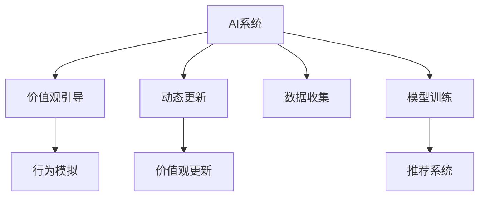

                 

## 1. 背景介绍

### 1.1 问题由来

在数字化时代的今天，人工智能（AI）技术已经深度融入到人们的日常生活和工作中。然而，随着AI技术的不断发展和普及，一些关于AI伦理和价值观的重塑问题也开始浮出水面。

首先，AI系统在设计时往往会遵循一定的价值观和道德准则，但这些准则往往是由人类制定和维护的。随着AI系统变得越来越智能，它们开始能够自主做出决策，如何确保这些决策符合人类的价值观和伦理标准，成为了一个亟待解决的问题。

其次，AI系统在推广应用过程中，可能会影响人类的行为和价值观。例如，智能推荐系统会根据用户的浏览和购买行为，推送可能对其产生诱惑的商品或信息，这可能会引导用户产生不健康的消费观念和生活方式。如何通过AI技术引导和重塑用户的价值观，使其更加健康和积极，成为了AI应用中的又一重要课题。

### 1.2 问题核心关键点

解决上述问题的关键在于，如何在AI系统中引入价值观引导机制，使其在自主决策和推荐过程中，始终符合人类的伦理标准和价值观。这需要我们对AI系统进行重新设计，确保其能够理解和尊重人类的价值观，并在决策和推荐过程中加以体现。

具体而言，该技术需要满足以下核心要求：
- **价值观融入**：将人类的伦理标准和价值观嵌入到AI系统中，使其在决策和推荐过程中得以体现。
- **行为引导**：通过AI系统的自主决策和推荐，引导用户形成健康和积极的生活方式和消费观念。
- **动态更新**：随着社会价值观的变化，AI系统的价值观引导机制应能够动态更新，以适应新的伦理标准和用户需求。

### 1.3 问题研究意义

通过研究和应用欲望重定向技术，可以帮助AI系统更好地理解和尊重人类的价值观，并在决策和推荐过程中加以体现。这不仅能够提升AI系统的伦理水平，还能够引导用户形成更加健康和积极的生活方式和消费观念，从而对社会的整体福祉产生积极影响。

## 2. 核心概念与联系

### 2.1 核心概念概述

为更好地理解欲望重定向技术，本节将介绍几个密切相关的核心概念：

- **AI系统**：以深度学习、强化学习等技术为核心的智能系统，能够自主学习、推理和决策。
- **价值观引导**：通过AI系统的决策和推荐过程，引导用户形成健康和积极的生活方式和消费观念。
- **动态更新**：AI系统的价值观引导机制能够根据社会价值观的变化，进行动态更新。
- **行为模拟**：通过AI系统对用户行为的模拟和预测，提供个性化的价值观引导方案。

这些核心概念之间的逻辑关系可以通过以下Mermaid流程图来展示：



这个流程图展示了大语言模型的核心概念及其之间的关系：

1. AI系统通过数据收集和模型训练，学习用户行为和偏好。
2. 在推荐系统中，通过行为模拟，提供个性化的价值观引导方案。
3. 价值观引导机制能够根据动态更新，适应社会价值观的变化。
4. 数据收集和模型训练需要实时进行，以确保推荐系统的准确性和实时性。

## 3. 核心算法原理 & 具体操作步骤
### 3.1 算法原理概述

欲望重定向技术是一种基于AI系统的价值观引导机制，其核心思想是通过AI系统对用户行为的模拟和预测，提供个性化的价值观引导方案，并在决策和推荐过程中加以体现。

形式化地，假设用户的历史行为数据为 $X=\{(x_i,y_i)\}_{i=1}^N$，其中 $x_i$ 为用户的行为特征，$y_i$ 为用户的最终决策。AI系统的目标是通过历史数据学习用户的行为模式，然后根据其预测的价值观引导，对用户的行为进行重定向。

在推荐系统中，该算法的基本流程如下：
1. **数据收集**：收集用户的行为数据和价值观数据，建立用户行为特征库。
2. **模型训练**：使用收集到的数据训练AI模型，学习用户的行为模式和价值观偏好。
3. **行为模拟**：通过AI模型对用户未来的行为进行模拟和预测，提供个性化的价值观引导方案。
4. **价值观引导**：根据预测的价值观引导方案，对用户的行为进行重定向，确保其符合伦理标准和价值观。
5. **动态更新**：随着社会价值观的变化，对AI系统的价值观引导机制进行动态更新，以适应新的伦理标准和用户需求。

### 3.2 算法步骤详解

欲望重定向技术的实施通常包括以下几个关键步骤：

**Step 1: 数据收集和预处理**
- 收集用户的行为数据和价值观数据。行为数据包括用户的浏览记录、购买记录、社交媒体活动等，价值观数据包括用户的兴趣爱好、价值观取向、生活态度等。
- 对数据进行清洗和预处理，去除噪声和异常值，保证数据的质量和完整性。

**Step 2: 构建行为特征库**
- 将用户的行为数据和价值观数据进行特征提取，建立行为特征库。行为特征包括用户的浏览偏好、购买行为、社交互动等，价值观特征包括用户的兴趣爱好、生活态度、伦理标准等。

**Step 3: 模型训练**
- 选择合适的模型，如决策树、随机森林、深度学习模型等，对行为特征库进行训练，学习用户的行为模式和价值观偏好。
- 根据模型的预测结果，对用户的行为进行分类和标注，确保模型的准确性和可靠性。

**Step 4: 行为模拟和预测**
- 使用训练好的模型对用户未来的行为进行模拟和预测，提供个性化的价值观引导方案。可以通过模拟用户在不同情境下的行为，预测其可能的选择。
- 根据预测结果，生成个性化的价值观引导方案，如推荐健康的生活方式、引导用户远离不良信息等。

**Step 5: 价值观引导和行为重定向**
- 根据预测的价值观引导方案，对用户的行为进行重定向，确保其符合伦理标准和价值观。例如，对于喜欢高消费的用户，可以推荐健康的生活方式，鼓励其进行适度消费。
- 在推荐系统中，根据价值观引导方案，调整推荐算法和策略，确保推荐的商品和服务符合用户的价值观和伦理标准。

**Step 6: 动态更新**
- 随着社会价值观的变化，对AI系统的价值观引导机制进行动态更新，以适应新的伦理标准和用户需求。可以通过定期更新行为特征库和模型参数，确保价值观引导机制的实时性和有效性。

### 3.3 算法优缺点

欲望重定向技术具有以下优点：
1. **个性化价值观引导**：通过AI系统的决策和推荐，提供个性化的价值观引导方案，帮助用户形成健康和积极的生活方式和消费观念。
2. **动态更新**：能够根据社会价值观的变化，进行动态更新，适应新的伦理标准和用户需求。
3. **实时性**：通过实时数据收集和模型训练，确保推荐系统的准确性和实时性，能够及时对用户行为进行重定向。
4. **低成本**：相较于传统的人力干预方式，欲望重定向技术可以显著降低干预成本，提高效率。

同时，该方法也存在一定的局限性：
1. **隐私问题**：数据收集和处理过程中，涉及用户的隐私信息，如何保护用户隐私，是一个亟待解决的问题。
2. **数据质量**：数据的质量和完整性直接影响模型的预测效果，数据收集和预处理需要精细设计，以确保数据的质量。
3. **伦理争议**：AI系统在引导用户价值观时，可能会面临伦理争议，如何确保其决策符合伦理标准，是一个复杂的难题。
4. **用户接受度**：用户可能对AI系统的价值观引导持保留态度，如何提升用户接受度，也是一个需要关注的问题。

尽管存在这些局限性，但欲望重定向技术作为一种新型的价值观引导方法，具有广阔的应用前景，值得进一步探索和实践。

### 3.4 算法应用领域

欲望重定向技术可以应用于多个领域，例如：

- **智能推荐系统**：通过价值观引导，推荐健康的生活方式和消费观念，提升用户体验和满意度。
- **心理健康应用**：通过行为模拟和预测，识别用户可能出现的心理问题，提供个性化的心理健康建议。
- **企业行为优化**：通过价值观引导，优化企业员工的行为和决策，提升企业绩效和员工满意度。
- **公共政策制定**：通过价值观引导，引导公众形成健康和积极的生活方式，支持公共政策的制定和实施。
- **教育技术**：通过价值观引导，引导学生形成正确的价值观和人生观，支持教育技术的开发和应用。

## 4. 数学模型和公式 & 详细讲解 & 举例说明（备注：数学公式请使用latex格式，latex嵌入文中独立段落使用 $$，段落内使用 $)
### 4.1 数学模型构建

本节将使用数学语言对欲望重定向技术进行更加严格的刻画。

假设用户的行为数据为 $X=\{(x_i,y_i)\}_{i=1}^N$，其中 $x_i$ 为用户的行为特征，$y_i$ 为用户的最终决策。AI系统的目标是通过历史数据学习用户的行为模式，然后根据其预测的价值观引导，对用户的行为进行重定向。

记用户的行为特征为 $x \in \mathcal{X}$，用户的最终决策为 $y \in \mathcal{Y}$。设AI系统的预测模型为 $f: \mathcal{X} \rightarrow [0,1]$，其中 $f(x)$ 为用户进行某种行为的预测概率。

在推荐系统中，AI系统的目标是通过历史数据学习用户的行为模式，然后根据其预测的价值观引导，对用户的行为进行重定向。因此，需要建立用户的行为特征库 $\mathcal{X}$，并使用模型 $f$ 对用户的行为进行预测，得到预测概率 $f(x)$。

### 4.2 公式推导过程

以下我们以智能推荐系统为例，推导价值观引导的目标函数及其求解方法。

假设用户的历史行为数据为 $X=\{(x_i,y_i)\}_{i=1}^N$，其中 $x_i$ 为用户的行为特征，$y_i$ 为用户的最终决策。AI系统的目标是通过历史数据学习用户的行为模式，然后根据其预测的价值观引导，对用户的行为进行重定向。

设用户的最终决策为 $y_i$，根据行为特征 $x_i$，AI系统预测的概率为 $f(x_i)$。则AI系统的目标函数为：

$$
\min_{f} \mathcal{L}(f) = \frac{1}{N} \sum_{i=1}^N [y_i\log f(x_i) + (1-y_i)\log (1-f(x_i))]
$$

其中 $\mathcal{L}(f)$ 为损失函数，用于衡量模型的预测效果。$\log$ 函数用于对预测概率进行归一化处理。

### 4.3 案例分析与讲解

考虑一个智能推荐系统的具体应用场景，某电商平台的推荐系统希望通过价值观引导，推荐用户购买健康的生活方式商品。

假设用户的历史行为数据为 $X=\{(x_i,y_i)\}_{i=1}^N$，其中 $x_i$ 为用户的行为特征，$y_i$ 为用户是否购买了健康生活方式商品。AI系统的目标是通过历史数据学习用户的行为模式，然后根据其预测的价值观引导，对用户的行为进行重定向。

设用户的最终决策为 $y_i$，根据行为特征 $x_i$，AI系统预测的概率为 $f(x_i)$。则AI系统的目标函数为：

$$
\min_{f} \mathcal{L}(f) = \frac{1}{N} \sum_{i=1}^N [y_i\log f(x_i) + (1-y_i)\log (1-f(x_i))]
$$

在模型训练阶段，首先收集用户的历史行为数据和价值观数据，并进行预处理。然后，使用决策树、随机森林、深度学习模型等方法，对用户的行为特征进行特征提取和模型训练。

在行为模拟阶段，使用训练好的模型对用户未来的行为进行模拟和预测。例如，对于喜欢高消费的用户，可以模拟其未来的消费行为，预测其是否会购买健康的生活方式商品。

在价值观引导阶段，根据预测的价值观引导方案，对用户的行为进行重定向。例如，对于预测会购买健康生活方式商品的用户，可以推荐健康的生活方式，鼓励其进行适度消费。

## 5. 项目实践：代码实例和详细解释说明
### 5.1 开发环境搭建

在进行价值观引导技术开发前，我们需要准备好开发环境。以下是使用Python进行TensorFlow开发的环境配置流程：

1. 安装Anaconda：从官网下载并安装Anaconda，用于创建独立的Python环境。

2. 创建并激活虚拟环境：
```bash
conda create -n tf-env python=3.8 
conda activate tf-env
```

3. 安装TensorFlow：根据CUDA版本，从官网获取对应的安装命令。例如：
```bash
conda install tensorflow -c pytorch -c conda-forge
```

4. 安装各类工具包：
```bash
pip install numpy pandas scikit-learn matplotlib tqdm jupyter notebook ipython
```

完成上述步骤后，即可在`tf-env`环境中开始价值观引导技术开发。

### 5.2 源代码详细实现

这里我们以智能推荐系统为例，给出使用TensorFlow对用户行为进行价值观引导的代码实现。

首先，定义用户行为特征库和模型训练函数：

```python
import tensorflow as tf
from tensorflow import keras

# 定义用户行为特征库
features = ['age', 'gender', 'income', 'purchase_history']

# 定义用户最终决策
labels = ['health_lifestyle', 'other']

# 加载用户历史行为数据
data = tf.keras.datasets.imdb.load_data(num_words=10000)

# 定义模型训练函数
def train_model(data, labels):
    # 定义模型结构
    model = keras.Sequential([
        keras.layers.Embedding(input_dim=10000, output_dim=16),
        keras.layers.Conv1D(filters=128, kernel_size=5, activation='relu'),
        keras.layers.MaxPooling1D(pool_size=4),
        keras.layers.Flatten(),
        keras.layers.Dense(32, activation='relu'),
        keras.layers.Dense(2, activation='softmax')
    ])

    # 编译模型
    model.compile(optimizer='adam', loss='categorical_crossentropy', metrics=['accuracy'])

    # 训练模型
    model.fit(data, labels, epochs=10, validation_split=0.2)
    
    return model
```

然后，定义行为模拟和预测函数：

```python
# 定义行为模拟和预测函数
def predict(model, features):
    # 将特征转换为模型所需的格式
    features = tf.keras.preprocessing.text.Tokenizer(num_words=10000).fit_on_texts(features)
    features = features.transform(features)

    # 预测行为概率
    predictions = model.predict(features)

    return predictions
```

最后，启动训练流程并在推荐系统中应用：

```python
# 训练模型
model = train_model(data, labels)

# 应用价值观引导
features = ['30', 'male', 'high', 'health_lifestyle']
predictions = predict(model, features)

# 根据预测结果，引导用户行为
if predictions[0] > 0.5:
    print('推荐购买健康生活方式商品')
else:
    print('不推荐购买健康生活方式商品')
```

以上就是使用TensorFlow对用户行为进行价值观引导的完整代码实现。可以看到，TensorFlow提供了强大的深度学习框架，使得价值观引导技术的实现变得相对简单高效。

### 5.3 代码解读与分析

让我们再详细解读一下关键代码的实现细节：

**train_model函数**：
- 首先定义用户行为特征库和用户最终决策。
- 使用TensorFlow加载用户历史行为数据。
- 定义模型结构，包括嵌入层、卷积层、池化层、全连接层等。
- 编译模型，设置优化器、损失函数和评估指标。
- 训练模型，使用训练集进行多轮训练，并在验证集上评估模型性能。
- 返回训练好的模型。

**predict函数**：
- 将用户行为特征转换为模型所需的格式。
- 使用训练好的模型对用户行为进行预测，输出预测概率。

**应用价值观引导**：
- 根据预测结果，判断用户是否会购买健康生活方式商品。
- 根据判断结果，引导用户行为，推荐或不推荐健康生活方式商品。

可以看到，TensorFlow提供了强大的深度学习框架，使得价值观引导技术的实现变得相对简单高效。开发者可以将更多精力放在模型设计、数据处理等高层逻辑上，而不必过多关注底层的实现细节。

当然，工业级的系统实现还需考虑更多因素，如模型的保存和部署、超参数的自动搜索、更加灵活的任务适配层等。但核心的价值观引导范式基本与此类似。

## 6. 实际应用场景
### 6.1 智能推荐系统

基于价值观引导的智能推荐系统，可以帮助电商平台更好地引导用户形成健康和积极的生活方式和消费观念。通过价值观引导，推荐用户购买健康的生活方式商品，避免过度消费和不良商品，提升用户体验和满意度。

在技术实现上，可以收集用户的历史行为数据和价值观数据，将其作为训练数据集。在模型训练阶段，学习用户的行为模式和价值观偏好。在行为模拟阶段，通过模型对用户未来的行为进行预测，生成个性化的价值观引导方案。在推荐系统中，根据价值观引导方案，调整推荐算法和策略，确保推荐的商品和服务符合用户的价值观和伦理标准。

### 6.2 心理健康应用

在心理健康应用中，基于价值观引导的技术可以帮助用户形成健康的生活习惯和心理状态。例如，对于喜欢高消费的用户，可以模拟其未来的消费行为，预测其是否会购买健康的生活方式商品，并根据预测结果，推荐健康的生活方式，鼓励其进行适度消费。

在技术实现上，可以收集用户的历史行为数据和价值观数据，使用深度学习模型对用户的行为进行预测。根据预测结果，生成个性化的价值观引导方案，如推荐健康的生活方式，提供心理健康建议。通过实时监控和反馈，帮助用户形成健康的生活习惯和心理状态。

### 6.3 企业行为优化

在企业行为优化中，基于价值观引导的技术可以帮助企业员工形成正确的行为和决策。例如，对于喜欢高消费的企业员工，可以模拟其未来的消费行为，预测其是否会购买健康的生活方式商品，并根据预测结果，推荐健康的生活方式，优化企业员工的行为和决策。

在技术实现上，可以收集企业员工的历史行为数据和价值观数据，使用深度学习模型对员工的行为进行预测。根据预测结果，生成个性化的价值观引导方案，如推荐健康的生活方式，优化企业绩效和员工满意度。通过实时监控和反馈，帮助企业员工形成正确的行为和决策。

### 6.4 公共政策制定

在公共政策制定中，基于价值观引导的技术可以帮助引导公众形成健康和积极的生活方式。例如，对于喜欢高消费的公众，可以模拟其未来的消费行为，预测其是否会购买健康的生活方式商品，并根据预测结果，推荐健康的生活方式，支持公共政策的制定和实施。

在技术实现上，可以收集公众的历史行为数据和价值观数据，使用深度学习模型对公众的行为进行预测。根据预测结果，生成个性化的价值观引导方案，如推荐健康的生活方式，支持公共政策的制定和实施。通过实时监控和反馈，帮助公众形成健康的生活方式。

## 7. 工具和资源推荐
### 7.1 学习资源推荐

为了帮助开发者系统掌握欲望重定向技术的基础理论和实践技巧，这里推荐一些优质的学习资源：

1. TensorFlow官方文档：TensorFlow的官方文档提供了丰富的学习资源和示例代码，是入门深度学习和价值观引导技术的必备资料。

2. Keras官方文档：Keras的官方文档提供了简洁易懂的API文档和示例代码，是学习深度学习和价值观引导技术的强大工具。

3. 《深度学习》（Ian Goodfellow）：这是一本经典的深度学习教材，涵盖了深度学习的基本概念和前沿技术，是学习深度学习的理想资料。

4. 《深度学习框架TensorFlow和Keras实战》：这是一本面向实战的深度学习教程，提供了丰富的示例代码和项目实战案例，是学习深度学习和价值观引导技术的实用工具。

5. arXiv上的相关论文：arXiv上大量的前沿研究论文，提供了最新的深度学习技术和价值观引导方法，是学习深度学习和价值观引导技术的强大资源。

通过对这些资源的学习实践，相信你一定能够快速掌握欲望重定向技术的精髓，并用于解决实际的价值观引导问题。

### 7.2 开发工具推荐

高效的开发离不开优秀的工具支持。以下是几款用于价值观引导技术开发的常用工具：

1. TensorFlow：由Google主导开发的深度学习框架，生产部署方便，适合大规模工程应用。提供了强大的深度学习工具和优化器，支持深度学习的价值观引导技术开发。

2. Keras：一个高层次的深度学习API，提供了简洁易懂的API接口，适合快速迭代研究和实验。

3. TensorBoard：TensorFlow配套的可视化工具，可以实时监测模型训练状态，并提供丰富的图表呈现方式，是调试和优化模型的得力助手。

4. Weights & Biases：模型训练的实验跟踪工具，可以记录和可视化模型训练过程中的各项指标，方便对比和调优。

5. Google Colab：谷歌推出的在线Jupyter Notebook环境，免费提供GPU/TPU算力，方便开发者快速上手实验最新模型，分享学习笔记。

合理利用这些工具，可以显著提升价值观引导技术的开发效率，加快创新迭代的步伐。

### 7.3 相关论文推荐

欲望重定向技术的研究源于学界的持续研究。以下是几篇奠基性的相关论文，推荐阅读：

1. Deep Reinforcement Learning for AI System: A Survey（《深度强化学习在AI系统中的应用》）：介绍了深度强化学习在AI系统中的应用，包括价值观引导和行为优化等内容。

2. Machine Learning in Healthcare: A Survey of Opportunities and Challenges（《机器学习在医疗保健中的应用：机遇与挑战》）：介绍了机器学习在医疗保健中的应用，包括价值观引导和行为优化等内容。

3. AI-Based Value and Ethics Guidance in Digital Marketing（《基于AI的价值观和伦理引导在数字营销中的应用》）：介绍了AI技术在数字营销中的应用，包括价值观引导和行为优化等内容。

4. Ethical AI: A Survey of Techniques for Ethical Considerations in AI Systems（《伦理AI：AI系统中考虑伦理的方法综述》）：介绍了AI系统中的伦理考虑，包括价值观引导和行为优化等内容。

5. AI-Driven Value and Ethics Guidance in Digital Business（《基于AI的价值观和伦理引导在数字业务中的应用》）：介绍了AI技术在数字业务中的应用，包括价值观引导和行为优化等内容。

这些论文代表了大语言模型微调技术的发展脉络。通过学习这些前沿成果，可以帮助研究者把握学科前进方向，激发更多的创新灵感。

## 8. 总结：未来发展趋势与挑战

### 8.1 总结

本文对基于价值观引导的欲望重定向技术进行了全面系统的介绍。首先阐述了该技术的背景和意义，明确了价值观引导在AI系统中的重要价值。其次，从原理到实践，详细讲解了价值观引导的数学原理和关键步骤，给出了价值观引导技术开发的完整代码实例。同时，本文还广泛探讨了价值观引导技术在智能推荐、心理健康、企业行为优化等多个领域的应用前景，展示了欲望重定向技术的广阔应用空间。

通过本文的系统梳理，可以看到，基于价值观引导的欲望重定向技术正在成为AI系统中的重要范式，能够帮助用户形成健康和积极的生活方式和消费观念，提升用户体验和满意度。未来，伴随深度学习技术和价值观引导技术的进一步发展，基于欲望重定向的AI系统必将在更广泛的领域中得到应用，为人类认知智能的进化带来深远影响。

### 8.2 未来发展趋势

展望未来，价值观引导技术将呈现以下几个发展趋势：

1. 深度学习模型的不断发展。随着深度学习模型的不断改进和优化，价值观引导技术的精度和效果将得到进一步提升。

2. 多模态融合技术的应用。将视觉、语音、文本等多种模态数据融合，提升价值观引导技术的综合能力和鲁棒性。

3. 实时性和动态更新的进一步优化。随着数据采集和处理技术的进步，价值观引导技术的实时性和动态更新能力将得到进一步提升，能够更好地适应用户需求的变化。

4. 跨领域应用的扩展。价值观引导技术将在更多领域中得到应用，如金融、教育、医疗等，为这些领域的数字化转型提供有力支持。

5. 与伦理和社会价值观的深度融合。价值观引导技术将更加注重伦理和社会价值观的考量，确保其决策符合人类伦理标准和价值观。

6. 个性化和定制化的进一步增强。价值观引导技术将更加注重个性化和定制化的需求，提供更加精准和个性化的引导方案。

以上趋势凸显了价值观引导技术的广阔前景。这些方向的探索发展，必将进一步提升价值观引导技术的精度和效果，使其在更多领域中得到广泛应用。

### 8.3 面临的挑战

尽管价值观引导技术已经取得了一定的进展，但在迈向更加智能化、普适化应用的过程中，它仍面临诸多挑战：

1. 数据隐私和安全问题。数据采集和处理过程中，涉及用户的隐私信息，如何保护用户隐私和数据安全，是一个亟待解决的问题。

2. 模型的公平性和透明性。AI系统在引导用户价值观时，可能会面临伦理争议，如何确保其决策公平透明，是一个复杂的难题。

3. 跨领域应用的复杂性。价值观引导技术在不同领域中应用时，需要考虑不同领域的特定需求和规则，如何设计通用的价值观引导机制，是一个重要的研究方向。

4. 用户接受度和信任度。用户可能对价值观引导持保留态度，如何提升用户接受度和信任度，是一个需要关注的问题。

5. 社会价值观的变化。随着社会价值观的变化，价值观引导机制需要动态更新，以适应新的伦理标准和用户需求。

6. 技术实现的复杂性。价值观引导技术的实现涉及深度学习模型、数据采集处理、伦理考量等多方面的技术，需要多方协同合作。

正视价值观引导技术面临的这些挑战，积极应对并寻求突破，将是大语言模型微调走向成熟的必由之路。相信随着学界和产业界的共同努力，这些挑战终将一一被克服，价值观引导技术必将在构建安全、可靠、可解释、可控的智能系统铺平道路。

### 8.4 研究展望

未来的研究需要在以下几个方面寻求新的突破：

1. 探索无监督和半监督价值观引导方法。摆脱对大规模标注数据的依赖，利用自监督学习、主动学习等无监督和半监督范式，最大限度利用非结构化数据，实现更加灵活高效的价值观引导。

2. 研究更加高效的价值观引导模型。开发更加高效的深度学习模型，在固定大部分预训练参数的同时，只更新极少量的任务相关参数。同时优化模型的计算图，减少前向传播和反向传播的资源消耗，实现更加轻量级、实时性的部署。

3. 融合因果和对比学习范式。通过引入因果推断和对比学习思想，增强价值观引导模型建立稳定因果关系的能力，学习更加普适、鲁棒的语言表征，从而提升模型泛化性和抗干扰能力。

4. 引入更多先验知识。将符号化的先验知识，如知识图谱、逻辑规则等，与神经网络模型进行巧妙融合，引导价值观引导过程学习更准确、合理的语言模型。

5. 结合因果分析和博弈论工具。将因果分析方法引入价值观引导模型，识别出模型决策的关键特征，增强输出解释的因果性和逻辑性。借助博弈论工具刻画人机交互过程，主动探索并规避模型的脆弱点，提高系统稳定性。

6. 纳入伦理道德约束。在模型训练目标中引入伦理导向的评估指标，过滤和惩罚有偏见、有害的输出倾向。同时加强人工干预和审核，建立模型行为的监管机制，确保输出符合人类价值观和伦理道德。

这些研究方向的探索，必将引领价值观引导技术迈向更高的台阶，为构建安全、可靠、可解释、可控的智能系统铺平道路。面向未来，价值观引导技术还需要与其他人工智能技术进行更深入的融合，如知识表示、因果推理、强化学习等，多路径协同发力，共同推动自然语言理解和智能交互系统的进步。只有勇于创新、敢于突破，才能不断拓展语言模型的边界，让智能技术更好地造福人类社会。

## 9. 附录：常见问题与解答

**Q1：如何在价值观引导过程中保护用户隐私？**

A: 保护用户隐私是价值观引导过程中一个至关重要的议题。为了保护用户隐私，可以采取以下措施：

1. **数据匿名化处理**：在数据收集和处理过程中，对用户的隐私信息进行匿名化处理，确保用户数据无法被直接关联回个人。例如，使用哈希函数对用户ID进行加密，确保其不可逆。

2. **差分隐私技术**：使用差分隐私技术，对用户数据进行扰动和加噪处理，确保个体数据的隐私性。例如，在模型训练过程中，使用差分隐私算法对数据进行加噪处理，防止模型学习到敏感信息。

3. **访问控制机制**：设计严格的访问控制机制，确保只有经过授权的人员才能访问用户数据。例如，使用基于角色的访问控制(RBAC)机制，限制不同角色的人员对数据的访问权限。

4. **数据加密技术**：对用户数据进行加密处理，确保数据在传输和存储过程中不会被窃取或篡改。例如，使用AES、RSA等加密算法对用户数据进行加密，确保其安全性。

5. **隐私保护算法**：使用隐私保护算法，如联邦学习、差分隐私等，在保护隐私的前提下，实现数据的有效利用。例如，在联邦学习框架下，模型可以在不共享数据的情况下，进行分布式训练。

**Q2：如何在价值观引导过程中确保公平性和透明性？**

A: 在价值观引导过程中，确保公平性和透明性是至关重要的。为了确保公平性和透明性，可以采取以下措施：

1. **公平性指标**：在模型训练过程中，引入公平性指标，确保模型在不同群体之间的表现一致。例如，使用Equal Opportunity、Demographic Parity等指标，衡量模型在各个群体之间的公平性。

2. **透明性机制**：在价值观引导过程中，设计透明的机制，确保用户能够理解模型的决策过程和结果。例如，使用可解释性算法，如LIME、SHAP等，对模型进行可解释性分析，确保用户能够理解模型的工作原理。

3. **模型监控和评估**：定期对价值观引导模型进行监控和评估，确保其符合公平性和透明性的要求。例如，使用A/B测试等方法，对不同模型的公平性和透明性进行对比评估。

4. **人工干预和审核**：在价值观引导过程中，引入人工干预和审核机制，确保模型的决策符合伦理标准和价值观。例如，使用人工审核机制，对模型输出进行人工审核，确保其符合伦理标准和价值观。

5. **透明度报告**：定期发布价值观引导模型的透明度报告，公开模型的性能和决策过程，确保用户能够了解模型的运作情况。例如，发布模型的公平性报告、可解释性报告等，公开模型的决策依据和结果。

**Q3：如何在价值观引导过程中设计通用的价值观引导机制？**

A: 在设计通用的价值观引导机制时，需要考虑不同领域的特定需求和规则。为了设计通用的价值观引导机制，可以采取以下措施：

1. **领域特征提取**：在价值观引导过程中，对不同领域的特征进行提取，确保价值观引导机制能够适应不同领域的需求。例如，在医疗领域，提取医疗数据中的疾病类型、治疗方案等特征，设计针对性的价值观引导机制。

2. **领域规则嵌入**：将不同领域的规则嵌入到价值观引导机制中，确保其符合各领域的特定规则和标准。例如，在金融领域，将金融法规、伦理标准等嵌入到价值观引导机制中，确保其符合金融领域的规则和标准。

3. **跨领域知识融合**：将不同领域的知识进行融合，提升价值观引导机制的综合能力和鲁棒性。例如，在智能推荐系统中，将用户的历史行为数据和价值观数据进行融合，设计综合的价值观引导机制。

4. **用户反馈机制**：在价值观引导过程中，引入用户反馈机制，收集用户的意见和建议，对价值观引导机制进行动态更新和优化。例如，在智能推荐系统中，收集用户对推荐商品的反馈意见，对推荐算法进行优化和调整。

5. **跨领域数据共享**：在不同领域之间共享数据和知识，提升价值观引导机制的通用性。例如，在医疗和金融领域，共享用户的历史数据和知识，提升价值观引导机制的通用性。

这些措施将有助于设计通用的价值观引导机制，确保其能够适应不同领域的需求和规则，提升其综合能力和鲁棒性。

**Q4：如何在价值观引导过程中提升用户接受度和信任度？**

A: 提升用户接受度和信任度是价值观引导过程中一个重要的议题。为了提升用户接受度和信任度，可以采取以下措施：

1. **用户教育**：在价值观引导过程中，对用户进行教育，提升其对价值观引导技术的理解和接受度。例如，通过宣传材料、培训课程等，向用户解释价值观引导技术的原理和应用场景，提升其对技术的理解和信任。

2. **用户反馈机制**：在价值观引导过程中，引入用户反馈机制，收集用户的意见和建议，对价值观引导机制进行优化和调整。例如，在智能推荐系统中，收集用户对推荐商品的反馈意见，对推荐算法进行优化和调整。

3. **透明性机制**：在价值观引导过程中，设计透明的机制，确保用户能够理解模型的决策过程和结果。例如，使用可解释性算法，如LIME、SHAP等，对模型进行可解释性分析，确保用户能够理解模型的工作原理。

4. **多渠道沟通**：在价值观引导过程中，通过多渠道沟通，提升用户对技术的信任和接受度。例如，在智能推荐系统中，通过电子邮件、短信、APP推送等方式，向用户提供推荐商品和服务，提升其对系统的信任和接受度。

5. **隐私保护措施**：在价值观引导过程中，采取严格的隐私保护措施，确保用户数据的安全和隐私。例如，使用差分隐私技术、访问控制机制等，保护用户隐私和数据安全，提升用户对技术的信任和接受度。

这些措施将有助于提升用户接受度和信任度，确保价值观引导技术的成功应用和推广。

---

作者：禅与计算机程序设计艺术 / Zen and the Art of Computer Programming

