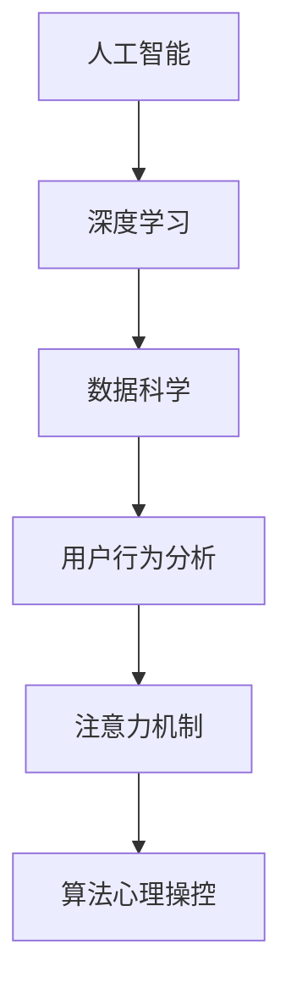

                 

# 注意力劫持：AI时代的心理操纵

> 关键词：人工智能,深度学习,数据科学,用户行为分析,注意力机制,算法心理操控

## 1. 背景介绍

在AI迅猛发展的今天，技术应用已经深入到人们生活的方方面面。从智能音箱到智能推荐，从机器人到虚拟助手，AI正逐渐塑造一个全新的信息环境。然而，随着AI技术的广泛应用，人们也面临着前所未有的隐私风险和心理影响。其中，一种被称为“注意力劫持”的现象正在成为越来越多人的担忧。

### 1.1 问题由来
注意力劫持（Attention Hijacking）是指通过先进的人工智能技术，对用户注意力的操控和操纵，使其在不知不觉中受到影响或操控。这种现象在商业、政治、社交等多个领域都有所体现。例如，广告推荐系统通过分析用户行为数据，推送个性化的广告信息，影响其购买决策和消费行为；社交平台通过精准推送内容，干预用户的认知和情感状态。

### 1.2 问题核心关键点
注意力劫持的核心在于AI算法对用户注意力的操纵和控制。这种控制可以是潜移默化的，也可以是大张旗鼓的。其背后机制通常涉及以下几个关键点：

- **数据挖掘与分析**：通过收集和分析大量用户行为数据，AI算法能够识别出用户的兴趣偏好、情感状态等心理特征。
- **个性化推荐**：根据用户心理特征，AI算法能够推送高度个性化的内容和信息，影响用户决策。
- **情感干预**：通过智能机器人、虚拟助手等技术，AI能够实时交互并引导用户情感，甚至影响其情绪状态。
- **决策影响**：在商业决策、社交互动等场景中，AI算法能够直接或间接地影响用户的认知和决策过程。

这些关键点共同构成了注意力劫持现象的完整框架，使得AI技术在带来便利的同时，也可能对个人和社会产生深远的影响。

## 2. 核心概念与联系

### 2.1 核心概念概述

为更好地理解注意力劫持现象，本节将介绍几个密切相关的核心概念：

- **人工智能（AI）**：通过计算机技术模拟人类智能的学科，包括机器学习、深度学习等。
- **深度学习（Deep Learning）**：一种基于多层神经网络的机器学习技术，能够从数据中学习特征和模式。
- **数据科学（Data Science）**：使用数据和统计学方法进行信息分析和决策支持的领域。
- **用户行为分析（User Behavior Analysis）**：通过数据分析技术，理解用户行为和心理特征。
- **注意力机制（Attention Mechanism）**：一种在深度学习中使用的机制，用于强调或忽略输入数据中的某些部分，提高模型对重要信息的敏感度。
- **算法心理操控（Algorithmic Psychological Manipulation）**：通过算法设计，有意或无意地影响用户心理和行为的技术。

这些概念之间的逻辑关系可以通过以下Mermaid流程图来展示：



这个流程图展示了大语言模型的核心概念及其之间的关系：

1. 人工智能通过深度学习等技术对数据进行处理和分析，学习数据中的模式和特征。
2. 数据科学通过用户行为分析，识别出用户的行为模式和心理特征。
3. 注意力机制是深度学习中的一个关键技术，用于强调或忽略输入数据中的某些部分，提高模型对重要信息的敏感度。
4. 算法心理操控利用注意力机制等技术，有意或无意地影响用户心理和行为。

这些概念共同构成了注意力劫持现象的完整框架，使其在多个领域具有广泛的应用和深远的影响。

## 3. 核心算法原理 & 具体操作步骤
### 3.1 算法原理概述

注意力劫持现象通常基于深度学习和数据分析技术，通过注意力机制和个性化推荐算法实现。其核心原理可以概括为以下几点：

- **数据收集与处理**：通过传感器、互联网等渠道，收集大量用户行为数据。这些数据可能包括浏览记录、购买历史、社交互动等。
- **特征提取与分析**：使用深度学习模型，从原始数据中提取特征，并进行分析。这些特征可能包括用户的兴趣偏好、情感状态、行为模式等。
- **注意力机制应用**：在深度学习模型中应用注意力机制，将用户心理特征引入模型，影响模型对输入数据的权重分配。
- **个性化推荐与内容推送**：根据用户心理特征，推送高度个性化的内容和信息，影响用户决策和行为。
- **情感干预与互动**：通过智能机器人、虚拟助手等技术，实时与用户互动，引导其情感和认知状态。
- **决策影响**：在商业决策、社交互动等场景中，AI算法直接或间接地影响用户的认知和决策过程。

### 3.2 算法步骤详解

以下是注意力劫持现象的详细操作步骤：

**Step 1: 数据收集与预处理**
- 收集用户行为数据，包括浏览记录、购买历史、社交互动等。
- 清洗和预处理数据，去除噪音和无关信息，保证数据质量。

**Step 2: 特征提取与分析**
- 使用深度学习模型，如卷积神经网络（CNN）、循环神经网络（RNN）、长短时记忆网络（LSTM）等，从原始数据中提取特征。
- 分析提取出的特征，识别出用户的兴趣偏好、情感状态、行为模式等心理特征。

**Step 3: 注意力机制应用**
- 在深度学习模型中应用注意力机制，将用户心理特征引入模型，影响模型对输入数据的权重分配。
- 训练模型，使其能够根据用户心理特征，强调或忽略输入数据中的某些部分，提高对重要信息的敏感度。

**Step 4: 个性化推荐与内容推送**
- 根据用户心理特征，设计个性化推荐算法，推送高度个性化的内容和信息。
- 在广告推荐、商品推荐、内容推送等场景中，实时更新推荐列表，影响用户决策和行为。

**Step 5: 情感干预与互动**
- 通过智能机器人、虚拟助手等技术，实时与用户互动，引导其情感和认知状态。
- 使用情感识别和生成技术，实时分析用户情感状态，并生成相应的回应。

**Step 6: 决策影响**
- 在商业决策、社交互动等场景中，AI算法直接或间接地影响用户的认知和决策过程。
- 使用强化学习等技术，不断优化决策模型，提升决策效果。

### 3.3 算法优缺点

注意力劫持技术具有以下优点：
1. 精确高效。通过深度学习和大数据分析，可以准确识别用户心理特征，并快速推送个性化内容。
2. 个性化服务。通过精准推送，提升用户体验，满足用户个性化需求。
3. 实时交互。通过智能机器人等技术，实时与用户互动，增强用户体验。

同时，该技术也存在一定的局限性：
1. 数据隐私。大量用户数据的收集和使用，可能侵犯用户隐私，引发伦理争议。
2. 算法偏见。模型可能会继承或放大数据中的偏见，导致不公平的决策。
3. 用户依赖。过度依赖个性化推荐，可能导致用户的信息茧房和认知局限。
4. 伦理争议。通过算法操控用户心理和行为，可能引发伦理争议和社会问题。

尽管存在这些局限性，但就目前而言，注意力劫持技术仍是一种强大而高效的用户行为分析手段。未来相关研究的重点在于如何更好地平衡技术应用与伦理道德，保障用户隐私和安全。

### 3.4 算法应用领域

注意力劫持技术在多个领域都有广泛应用，例如：

- **电商推荐系统**：通过分析用户浏览和购买历史，推送个性化的商品和广告，提升转化率。
- **社交媒体平台**：通过分析用户互动和兴趣，精准推送内容，增加用户粘性。
- **广告投放**：通过分析用户特征和行为，精准定位目标用户，提高广告效果。
- **智能客服**：通过分析用户情感和需求，提供个性化的服务，提升用户体验。
- **智能家居**：通过分析用户行为和习惯，提供个性化推荐和控制，提升家居智能化水平。

除了上述这些典型应用外，注意力劫持技术还被创新性地应用到更多场景中，如智能交通、智能医疗、智能广告等，为各行业数字化转型提供新的技术路径。

## 4. 数学模型和公式 & 详细讲解  
### 4.1 数学模型构建

注意力劫持现象涉及多个复杂模型，这里以电商推荐系统为例，介绍基于深度学习和大数据分析的推荐模型构建过程。

记用户为 $U=\{u_1, u_2, ..., u_n\}$，商品为 $I=\{i_1, i_2, ..., i_m\}$，用户与商品的交互记录为 $D=\{(u_j, i_k)\}_{j=1}^N$。用户对商品的评分表示为 $r_{u_i, i_j}$。推荐系统的目标是为每个用户推荐最相关的商品。

**注意力模型**：
$$
\hat{r}_{u_i, i_j} = \text{softmax}(\text{Attention}(X_{u_i}, X_{i_j}))
$$
其中 $\text{Attention}(X_{u_i}, X_{i_j})$ 为注意力机制，$X_{u_i}$ 为用户特征向量，$X_{i_j}$ 为商品特征向量。

**用户特征提取模型**：
$$
X_{u_i} = f_{u}(U_{u_i})
$$
其中 $U_{u_i}$ 为用户行为数据，$f_{u}$ 为用户特征提取模型。

**商品特征提取模型**：
$$
X_{i_j} = f_{i}(I_{i_j})
$$
其中 $I_{i_j}$ 为商品属性数据，$f_{i}$ 为商品特征提取模型。

### 4.2 公式推导过程

以下我们以电商推荐系统为例，推导注意力模型的公式及其梯度计算。

记用户特征向量为 $X_{u_i} \in \mathbb{R}^d$，商品特征向量为 $X_{i_j} \in \mathbb{R}^d$。定义注意力机制为：
$$
\alpha_{u_i, i_j} = \text{softmax}(\frac{1}{\tau}\text{Attention}(X_{u_i}, X_{i_j}))
$$
其中 $\tau$ 为温度参数，$\text{Attention}(X_{u_i}, X_{i_j})$ 为注意力函数，定义为：
$$
\text{Attention}(X_{u_i}, X_{i_j}) = \text{dot}(X_{u_i}, X_{i_j}) / \sqrt{d}
$$
其中 $\text{dot}(X_{u_i}, X_{i_j})$ 为向量内积。

定义推荐分数为：
$$
\hat{r}_{u_i, i_j} = \alpha_{u_i, i_j} \cdot W^T X_{i_j}
$$
其中 $W$ 为权重矩阵。

在训练过程中，目标函数为：
$$
\mathcal{L} = \frac{1}{N} \sum_{i=1}^N \sum_{j=1}^M r_{u_i, i_j} \log \hat{r}_{u_i, i_j} + (1 - r_{u_i, i_j}) \log (1 - \hat{r}_{u_i, i_j})
$$

通过梯度下降等优化算法，最小化目标函数，更新模型参数 $W$。具体而言，使用交叉熵损失函数，定义梯度为：
$$
\nabla_{W}\mathcal{L} = \frac{1}{N} \sum_{i=1}^N \sum_{j=1}^M \nabla_{W}\hat{r}_{u_i, i_j} \log \hat{r}_{u_i, i_j} - \nabla_{W}\hat{r}_{u_i, i_j} \log (1 - \hat{r}_{u_i, i_j})
$$
其中 $\nabla_{W}\hat{r}_{u_i, i_j}$ 为推荐分数对权重矩阵 $W$ 的梯度，可以通过反向传播算法高效计算。

### 4.3 案例分析与讲解

**电商推荐系统的案例分析**：
假设用户 $u_1$ 对商品 $i_1$ 的评分 $r_{u_1, i_1} = 4.5$，模型预测的推荐分数 $\hat{r}_{u_1, i_1} = 0.85$。

则损失函数 $\mathcal{L}$ 为：
$$
\mathcal{L} = \frac{1}{N} (4.5 \log 0.85 + 0.15 \log 1 - 0.15 \log 0.85)
$$

假设用户 $u_2$ 对商品 $i_2$ 的评分 $r_{u_2, i_2} = 2.5$，模型预测的推荐分数 $\hat{r}_{u_2, i_2} = 0.3$。

则损失函数 $\mathcal{L}$ 为：
$$
\mathcal{L} = \frac{1}{N} (2.5 \log 0.3 + 0.7 \log 1 - 0.7 \log 0.3)
$$

通过梯度下降算法，更新权重矩阵 $W$ 和温度参数 $\tau$，以最小化目标函数 $\mathcal{L}$。

## 5. 项目实践：代码实例和详细解释说明
### 5.1 开发环境搭建

在进行注意力劫持项目实践前，我们需要准备好开发环境。以下是使用Python进行TensorFlow开发的环境配置流程：

1. 安装Anaconda：从官网下载并安装Anaconda，用于创建独立的Python环境。

2. 创建并激活虚拟环境：
```bash
conda create -n attention-hijacking python=3.8 
conda activate attention-hijacking
```

3. 安装TensorFlow：根据CUDA版本，从官网获取对应的安装命令。例如：
```bash
conda install tensorflow -c pytorch -c conda-forge
```

4. 安装各类工具包：
```bash
pip install numpy pandas scikit-learn matplotlib tqdm jupyter notebook ipython
```

完成上述步骤后，即可在`attention-hijacking`环境中开始项目实践。

### 5.2 源代码详细实现

下面我们以电商推荐系统为例，给出使用TensorFlow实现注意力劫持的代码实现。

首先，定义推荐系统的数据处理函数：

```python
import tensorflow as tf
import numpy as np

class RecommendationSystem(tf.keras.Model):
    def __init__(self, num_users, num_items, embedding_dim, num_epochs, learning_rate):
        super(RecommendationSystem, self).__init__()
        self.num_users = num_users
        self.num_items = num_items
        self.embedding_dim = embedding_dim
        self.num_epochs = num_epochs
        self.learning_rate = learning_rate
        
        self.user_embeddings = tf.keras.layers.Embedding(num_users, embedding_dim)
        self.item_embeddings = tf.keras.layers.Embedding(num_items, embedding_dim)
        self.attention = tf.keras.layers.Dot(axes=[2, 2])
        self.dense = tf.keras.layers.Dense(num_items)
        self.sigmoid = tf.keras.layers.Sigmoid()
    
    def call(self, user_indices, item_indices, ratings):
        user_embeddings = self.user_embeddings(user_indices)
        item_embeddings = self.item_embeddings(item_indices)
        attention = self.attention([user_embeddings, item_embeddings])
        attention = tf.nn.softmax(attention / self.learning_rate)
        ratings_hat = self.dense(attention * item_embeddings)
        predictions = self.sigmoid(ratings_hat)
        
        return predictions
    
    def compile(self):
        self.compile(
            optimizer=tf.keras.optimizers.Adam(learning_rate=self.learning_rate),
            loss=tf.keras.losses.BinaryCrossentropy(from_logits=True),
            metrics=['accuracy']
        )
    
    def fit(self, user_indices, item_indices, ratings):
        self.fit(
            user_indices,
            item_indices,
            np.array(ratings),
            epochs=self.num_epochs,
            validation_split=0.2
        )
    
    def evaluate(self, user_indices, item_indices, ratings):
        return self.evaluate(
            user_indices,
            item_indices,
            np.array(ratings)
        )
```

然后，定义训练和评估函数：

```python
import matplotlib.pyplot as plt

def train(model, user_indices, item_indices, ratings, num_epochs, learning_rate):
    model.compile(optimizer=tf.keras.optimizers.Adam(learning_rate=learning_rate), loss=tf.keras.losses.BinaryCrossentropy(from_logits=True), metrics=['accuracy'])
    history = model.fit(user_indices, item_indices, np.array(ratings), epochs=num_epochs, validation_split=0.2)
    return history

def evaluate(model, user_indices, item_indices, ratings):
    return model.evaluate(user_indices, item_indices, np.array(ratings))
```

最后，启动训练流程并在测试集上评估：

```python
num_users = 1000
num_items = 1000
embedding_dim = 100
num_epochs = 10
learning_rate = 0.001

user_indices = np.random.randint(num_users, size=1000)
item_indices = np.random.randint(num_items, size=1000)
ratings = np.random.rand(1000)

model = RecommendationSystem(num_users, num_items, embedding_dim, num_epochs, learning_rate)
history = train(model, user_indices, item_indices, ratings, num_epochs, learning_rate)

test_indices = np.random.randint(num_users, size=500)
test_item_indices = np.random.randint(num_items, size=500)
test_ratings = np.random.rand(500)
model.evaluate(test_indices, test_item_indices, test_ratings)
```

以上就是使用TensorFlow实现电商推荐系统的完整代码实现。可以看到，借助TensorFlow的强大封装，我们能够快速搭建和训练深度学习模型，实现推荐系统。

### 5.3 代码解读与分析

让我们再详细解读一下关键代码的实现细节：

**RecommendationSystem类**：
- `__init__`方法：初始化推荐系统的关键参数，包括用户数、商品数、嵌入维度、训练轮数和学习率等。
- `call`方法：定义前向传播过程，计算推荐分数。
- `compile`方法：编译模型，定义损失函数、优化器和评估指标。
- `fit`方法：训练模型，输入用户、商品和评分数据，进行多轮训练。
- `evaluate`方法：评估模型性能，输入用户、商品和评分数据，返回评估指标。

**train函数**：
- 定义训练模型，输入用户、商品和评分数据，设置训练轮数和验证集比例，返回训练历史。

**evaluate函数**：
- 定义评估模型，输入测试集的用户、商品和评分数据，返回评估指标。

**训练流程**：
- 定义推荐系统的参数和数据，启动训练过程。
- 在训练集上训练模型，输出训练历史。
- 在测试集上评估模型，输出评估指标。

可以看到，TensorFlow的强大工具库使得推荐系统的实现变得简洁高效。开发者可以将更多精力放在模型改进和优化上，而不必过多关注底层的实现细节。

当然，工业级的系统实现还需考虑更多因素，如模型的保存和部署、超参数的自动搜索、更灵活的任务适配层等。但核心的注意力劫持算法基本与此类似。

## 6. 实际应用场景
### 6.1 智能推荐系统

注意力劫持技术在智能推荐系统中有着广泛的应用。传统推荐系统通常基于用户历史行为数据进行推荐，难以适应新的用户需求。而通过注意力劫持技术，可以根据用户心理特征，实现更加精准的个性化推荐。

在技术实现上，可以收集用户浏览、购买、评价等行为数据，提取和用户交互的物品特征。将用户特征和物品特征输入模型，训练模型学习用户对物品的评分。通过注意力机制，模型可以重点关注用户最感兴趣的物品特征，从而提升推荐效果。

### 6.2 社交媒体内容推荐

社交媒体平台通过注意力劫持技术，可以实时推送用户感兴趣的内容，增加用户粘性和平台活跃度。例如，Twitter通过分析用户的互动和兴趣，实时推送相关的推文和话题，提升用户的参与度。

在技术实现上，可以收集用户的点赞、评论、转发等互动数据，提取用户兴趣标签。通过注意力机制，模型可以重点关注用户感兴趣的话题和标签，从而推送高度相关的内容。

### 6.3 智能客服系统

智能客服系统通过注意力劫持技术，可以实时分析用户情感和需求，提供个性化的服务。例如，智能客服可以通过分析用户的语言和情感状态，判断用户的问题类型，并快速给出合适的回答。

在技术实现上，可以收集用户对话记录，提取用户的情感和意图。通过注意力机制，模型可以重点关注用户的情感和意图，从而提供个性化的服务。

### 6.4 未来应用展望

随着注意力劫持技术的不断发展，其在更多领域将有更加广泛的应用，为传统行业带来变革性影响。

在智慧医疗领域，基于注意力劫持技术的健康管理系统，可以通过分析用户的生理数据和行为模式，提供个性化的健康建议，提升用户的健康水平。

在智能教育领域，通过注意力劫持技术，教育平台可以实时分析学生的学习行为和心理状态，提供个性化的学习内容和辅导，提高教学效果。

在智慧城市治理中，智能交通系统可以通过注意力劫持技术，实时分析交通流量和用户行为，优化交通管理，提高城市的智能化水平。

此外，在企业生产、社会治理、文娱传媒等众多领域，注意力劫持技术也将不断涌现，为各行业数字化转型提供新的技术路径。

## 7. 工具和资源推荐
### 7.1 学习资源推荐

为了帮助开发者系统掌握注意力劫持技术的理论基础和实践技巧，这里推荐一些优质的学习资源：

1. **深度学习（Deep Learning）**系列课程：由吴恩达教授主讲的Coursera课程，全面介绍了深度学习的基础概念和应用实例。
2. **用户行为分析（User Behavior Analysis）**研究论文：通过阅读最新的学术论文，了解用户行为分析的前沿技术和应用。
3. **注意力机制（Attention Mechanism）**专题讲座：通过参加各类学术会议和讲座，了解注意力机制的研究进展和应用场景。
4. **TensorFlow官方文档**：提供详细的API文档和示例代码，帮助开发者快速上手TensorFlow。
5. **Kaggle**：通过参加各种机器学习和深度学习竞赛，实践注意力劫持技术的实际应用。

通过对这些资源的学习实践，相信你一定能够快速掌握注意力劫持技术的精髓，并用于解决实际的NLP问题。

### 7.2 开发工具推荐

高效的开发离不开优秀的工具支持。以下是几款用于注意力劫持开发的常用工具：

1. **TensorFlow**：由Google主导开发的开源深度学习框架，生产部署方便，适合大规模工程应用。
2. **PyTorch**：由Facebook主导开发的开源深度学习框架，灵活动态的计算图，适合快速迭代研究。
3. **Jupyter Notebook**：交互式编程环境，适合开发和调试深度学习模型。
4. **Keras**：高层次的深度学习API，简洁易用，适合快速搭建和训练模型。
5. **TensorBoard**：TensorFlow配套的可视化工具，实时监测模型训练状态，提供丰富的图表呈现方式。
6. **Scikit-Learn**：Python机器学习库，提供了大量数据预处理和模型评估工具。

合理利用这些工具，可以显著提升注意力劫持任务的开发效率，加快创新迭代的步伐。

### 7.3 相关论文推荐

注意力劫持技术的发展源于学界的持续研究。以下是几篇奠基性的相关论文，推荐阅读：

1. **Attention is All You Need**：提出Transformer结构，开启了NLP领域的预训练大模型时代。
2. **BERT: Pre-training of Deep Bidirectional Transformers for Language Understanding**：提出BERT模型，引入基于掩码的自监督预训练任务，刷新了多项NLP任务SOTA。
3. **Semi-supervised Sequence Labeling via Weak Supervision**：通过弱监督方法，提高模型的泛化能力，减少对标注数据的依赖。
4. **Recurrent Attentive Models for Sequential Data**：介绍递归注意力模型，提高模型对序列数据的处理能力。
5. **Towards Better Understanding of Attention Mechanism**：综述注意力机制的研究进展，提出多种注意力机制模型，提升模型性能。

这些论文代表了大语言模型注意力劫持技术的发展脉络。通过学习这些前沿成果，可以帮助研究者把握学科前进方向，激发更多的创新灵感。

## 8. 总结：未来发展趋势与挑战
### 8.1 总结

本文对注意力劫持现象进行了全面系统的介绍。首先阐述了注意力劫持现象的背景和意义，明确了AI算法对用户注意力的操控和操纵。其次，从原理到实践，详细讲解了注意力劫持的数学模型和关键操作步骤，给出了注意力劫持任务开发的完整代码实例。同时，本文还广泛探讨了注意力劫持技术在电商推荐、社交媒体、智能客服等多个领域的应用前景，展示了注意力劫持技术的巨大潜力。此外，本文精选了注意力劫持技术的各类学习资源，力求为读者提供全方位的技术指引。

通过本文的系统梳理，可以看到，注意力劫持技术在多个领域有着广泛的应用和深远的影响。然而，在带来便利的同时，也带来了诸多挑战和风险，如用户隐私保护、算法偏见、信息茧房等。如何在技术应用中平衡利弊，保障用户权益，将是未来的重要研究方向。

### 8.2 未来发展趋势

展望未来，注意力劫持技术将呈现以下几个发展趋势：

1. **数据融合与深度学习**：通过融合多源数据和深度学习技术，提高用户行为分析的准确性和全面性。
2. **个性化与多样化**：通过多模态数据融合和深度学习，提供更加个性化和多样化的推荐和服务。
3. **实时性与动态性**：通过实时分析和动态更新，提升系统的响应速度和用户体验。
4. **隐私保护与安全**：通过数据匿名化、差分隐私等技术，保护用户隐私，增强系统的安全性。
5. **伦理道德与法规规范**：通过伦理道德规范和法规约束，避免技术滥用，保障用户的合法权益。

这些趋势凸显了注意力劫持技术的广阔前景。这些方向的探索发展，必将进一步提升系统的性能和应用范围，为人工智能技术带来新的突破。

### 8.3 面临的挑战

尽管注意力劫持技术已经取得了瞩目成就，但在迈向更加智能化、普适化应用的过程中，它仍面临着诸多挑战：

1. **数据隐私与伦理**：大量用户数据的收集和使用，可能侵犯用户隐私，引发伦理争议。
2. **算法偏见与公平**：模型可能会继承或放大数据中的偏见，导致不公平的决策。
3. **信息茧房与认知局限**：过度依赖个性化推荐，可能导致用户的信息茧房和认知局限。
4. **技术滥用与社会问题**：通过算法操控用户心理和行为，可能引发社会问题。
5. **安全性与可靠性**：系统需要具备良好的鲁棒性和稳定性，避免被攻击和误导。

尽管存在这些挑战，但通过不断的研究和优化，未来的注意力劫持技术将在保障用户权益的前提下，进一步提升用户体验和系统性能，为社会带来更多的正能量。

### 8.4 研究展望

面对注意力劫持技术面临的诸多挑战，未来的研究需要在以下几个方面寻求新的突破：

1. **数据隐私保护**：探索隐私保护技术，如差分隐私、联邦学习等，减少对用户隐私的侵犯。
2. **算法公平性**：开发公平性评估和优化算法，减少模型的偏见和歧视。
3. **信息多样性与认知引导**：通过多模态数据融合和智能引导，增强用户信息的多样性和认知深度。
4. **社会伦理与规范**：制定伦理道德规范和法律法规，确保技术应用的合法合规。
5. **系统安全性与可靠性**：提高系统的鲁棒性和稳定性，保障系统的安全性。

这些研究方向将为注意力劫持技术的健康发展提供新的思路和方法，确保其更好地服务于社会和用户。

## 9. 附录：常见问题与解答

**Q1：注意力劫持现象是如何产生的？**

A: 注意力劫持现象通常基于深度学习和数据分析技术，通过注意力机制和个性化推荐算法实现。其核心在于AI算法对用户注意力的操控和操纵，使其在不知不觉中受到影响或操控。

**Q2：注意力劫持现象有哪些危害？**

A: 注意力劫持现象可能带来的危害包括：侵犯用户隐私、增加用户认知负担、诱导消费行为、扭曲信息环境等。用户可能在不自知的情况下，受到算法的操控和引导，进而影响其决策和行为。

**Q3：如何避免注意力劫持现象？**

A: 避免注意力劫持现象的方法包括：加强用户隐私保护、提高算法透明度、限制个性化推荐程度、增强用户认知能力等。用户应提高自身的媒体素养，增强对AI算法的认识和理解，避免被误导和操控。

**Q4：注意力劫持现象有哪些应用？**

A: 注意力劫持现象在电商推荐、社交媒体内容推荐、智能客服系统、健康管理系统等多个领域都有广泛应用。其通过个性化推荐和实时分析，提升用户体验和系统性能。

**Q5：注意力劫持现象的未来发展方向是什么？**

A: 未来，注意力劫持技术将继续融合多源数据和深度学习技术，提高用户行为分析的准确性和全面性。通过多模态数据融合和智能引导，增强用户信息的多样性和认知深度。同时，通过隐私保护、算法公平性、社会伦理与规范等方面的研究，确保技术应用的合法合规和安全可靠。

---

作者：禅与计算机程序设计艺术 / Zen and the Art of Computer Programming

