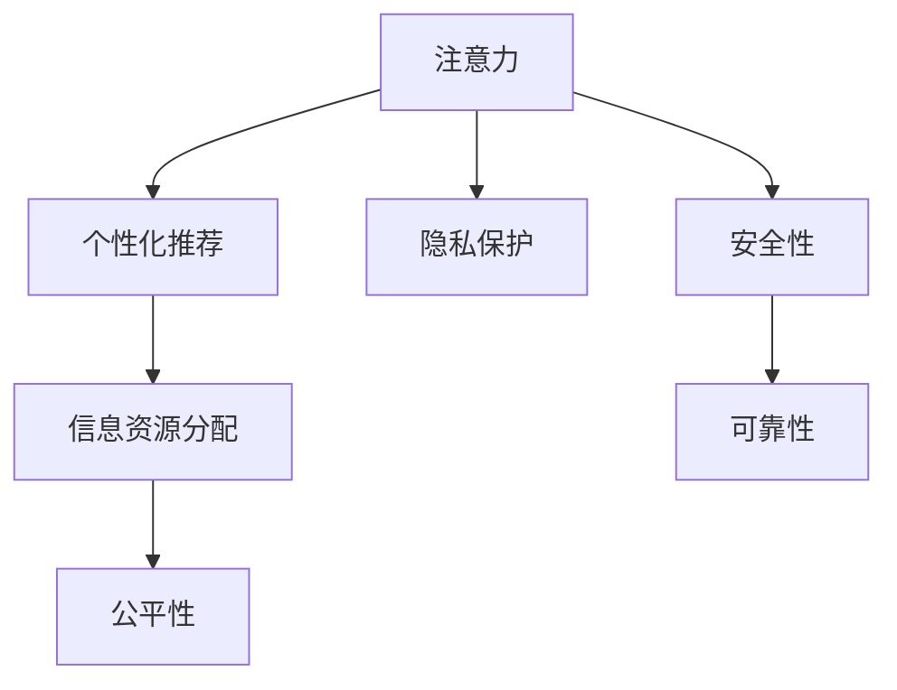

                 

# 注意力战争：元宇宙中的信息主导权争夺

## 1. 背景介绍

### 1.1 问题由来

元宇宙（Metaverse）作为虚拟现实、增强现实和混合现实技术结合的产物，其发展日新月异。随着元宇宙逐渐融入人们的日常生活，如何控制信息流向，确保信息安全，维护社会稳定，成为摆在人们面前的重要课题。传统的互联网信息管控方式已经无法适应元宇宙的复杂性和多元性，元宇宙亟需新的信息管理策略。

近年来，元宇宙虚拟经济、社交互动、沉浸式体验等方面均取得了长足进展。这些应用都离不开对用户注意力和兴趣的精准捕捉和分析。然而，随着元宇宙用户的激增，数据安全和隐私问题也愈发严重。如何高效、公正地分配信息资源，防止信息滥用，成为了实现元宇宙持续健康发展的关键。

### 1.2 问题核心关键点

元宇宙信息主导权争夺的核心在于如何通过技术手段，精准获取和分析用户的注意力，进而合理分配信息资源，维护用户权益。在元宇宙中，用户的行为模式、偏好习惯等数据尤为重要，成为各大企业争夺的重要资源。

1. **用户注意力精准获取**：通过AI技术捕捉用户的行为轨迹，识别出用户的兴趣点和偏好，提供个性化的内容推荐。
2. **信息资源公正分配**：在保证用户隐私的前提下，利用机器学习算法对信息流进行智能分配，确保不同用户之间获得信息资源的机会公平。
3. **数据安全与隐私保护**：防止数据泄露和滥用，保障用户数据隐私，确保信息传递的真实性和安全性。

### 1.3 问题研究意义

深入研究元宇宙中的信息主导权争夺问题，对于实现信息公正分配、维护用户隐私安全、提升用户体验具有重要意义：

1. **提升信息利用效率**：精准捕捉用户注意力，提供高质量的个性化推荐，优化信息资源分配。
2. **保障用户隐私权益**：设计合理的数据保护机制，防止用户信息被滥用。
3. **促进社会公平**：通过信息分配的合理性，实现信息资源的公平获取，减少社会不平等。
4. **推动技术创新**：激励技术创新和算法优化，提升元宇宙技术应用水平。

## 2. 核心概念与联系

### 2.1 核心概念概述

在元宇宙中，争夺信息主导权的核心概念包括：

- **注意力**：用户在虚拟世界中的行为轨迹、停留时间等，用于衡量用户兴趣和偏好。
- **个性化推荐系统**：根据用户注意力数据，实时调整信息流，推荐个性化内容。
- **公平性**：确保不同用户之间获得信息资源的机会均等，防止信息分配不公。
- **隐私保护**：保护用户隐私数据，防止数据泄露和滥用。
- **安全性和可靠性**：确保信息传递的真实性和系统运行的稳定性。

这些概念之间的逻辑关系可以通过以下Mermaid流程图来展示：



这个流程图展示了这个问题的核心概念及其之间的联系：

1. 通过对用户注意力的精准捕捉，形成个性化推荐系统。
2. 在个性化推荐的基础上，优化信息资源分配，实现信息公平。
3. 保护用户隐私，防止数据泄露，保障信息安全性。
4. 保证系统运行稳定，确保信息传递的真实性和可靠性。

## 3. 核心算法原理 & 具体操作步骤
### 3.1 算法原理概述

在元宇宙中，争夺信息主导权的核心算法原理是通过注意力机制（Attention Mechanism）和个性化推荐系统，实现信息的精准获取和智能分配。具体步骤如下：

1. **数据采集**：通过用户行为数据采集工具，实时记录用户在虚拟世界中的活动轨迹、停留时间、点击量等行为数据。
2. **注意力计算**：使用注意力机制，对采集到的数据进行分析和处理，识别出用户的兴趣点和偏好。
3. **推荐算法优化**：结合用户注意力数据，实时调整个性化推荐算法，优化信息流推荐。
4. **信息公平分配**：设计公平性算法，保证不同用户之间获得信息资源的机会均等。
5. **数据隐私保护**：采用隐私保护技术，防止用户数据泄露和滥用。
6. **系统安全设计**：引入安全性和可靠性设计，确保信息传递的真实性和系统稳定性。

### 3.2 算法步骤详解

以下详细介绍每一个步骤的具体操作和算法实现：

**Step 1: 数据采集**

1. **采集工具选择**：根据具体需求选择适合的采集工具，如网络爬虫、行为分析工具等。
2. **数据格式统一**：将不同来源的数据进行格式转换，确保数据统一和一致性。
3. **数据清洗**：对采集到的数据进行去重、过滤、处理，去除无用或异常数据。

**Step 2: 注意力计算**

1. **数据预处理**：对采集到的数据进行预处理，提取有用特征。
2. **注意力模型选择**：选择合适的注意力模型，如注意力机制（Attention Mechanism）。
3. **注意力计算**：使用注意力机制对用户行为数据进行处理，计算出用户的注意力权重。
4. **兴趣点识别**：根据注意力权重，识别出用户的兴趣点和偏好。

**Step 3: 推荐算法优化**

1. **推荐算法选择**：选择合适的推荐算法，如协同过滤、内容推荐、混合推荐等。
2. **参数优化**：对推荐算法进行参数优化，提高推荐精度和效果。
3. **实时调整**：根据用户注意力数据，实时调整推荐算法参数，动态优化信息流推荐。

**Step 4: 信息公平分配**

1. **公平性算法选择**：选择合适的公平性算法，如最大最小化算法、加权分配算法等。
2. **参数优化**：对公平性算法进行参数优化，确保不同用户之间获得信息资源的机会均等。
3. **监控与调整**：实时监控信息分配结果，根据实际情况调整参数，保证公平性。

**Step 5: 数据隐私保护**

1. **数据加密**：对用户数据进行加密处理，防止数据泄露。
2. **隐私保护算法**：采用隐私保护算法，如差分隐私、同态加密等。
3. **合规检查**：定期检查隐私保护措施的合规性，确保符合法律法规要求。

**Step 6: 系统安全设计**

1. **网络安全设计**：设计网络安全机制，防止黑客攻击和数据窃取。
2. **安全监控**：部署安全监控系统，实时监控系统运行状态，及时发现和处理安全问题。
3. **故障恢复**：设计故障恢复机制，确保系统在故障发生时能够快速恢复。

### 3.3 算法优缺点

元宇宙信息主导权争夺的算法具有以下优点：

1. **高效性**：通过注意力机制和个性化推荐算法，能够精准获取用户注意力，提升信息利用效率。
2. **公正性**：公平性算法能够保证不同用户之间获得信息资源的机会均等，减少社会不平等。
3. **安全性**：采用隐私保护技术和安全设计，确保用户数据安全和信息传递的真实性。
4. **可扩展性**：算法框架具有较好的可扩展性，能够适应元宇宙应用的多种场景和需求。

同时，该算法也存在一些局限性：

1. **数据依赖性**：依赖于用户行为数据的采集和处理，数据质量直接影响算法效果。
2. **算法复杂性**：注意力计算和推荐算法较复杂，需要较高的技术水平和计算资源。
3. **隐私保护挑战**：隐私保护技术尚需进一步完善，需要在用户隐私保护和信息获取之间找到平衡。
4. **模型适应性**：不同用户的行为模式各异，推荐模型需要不断调整优化，以适应多样化的需求。

尽管存在这些局限性，但元宇宙信息主导权争夺的算法框架仍是大数据和人工智能在元宇宙应用的基石，对于推动元宇宙健康发展具有重要意义。

### 3.4 算法应用领域

在元宇宙中，争夺信息主导权的核心算法广泛应用于以下领域：

1. **虚拟经济**：通过个性化推荐系统，精准捕捉用户消费行为，提供定制化产品推荐，优化用户体验。
2. **社交互动**：根据用户注意力数据，推荐朋友、群组等社交关系，增强用户粘性。
3. **沉浸式体验**：利用注意力计算和推荐算法，优化虚拟环境的个性化设置，提升用户沉浸感。
4. **虚拟教育**：通过个性化推荐，精准匹配学习内容，提升学习效果和体验。
5. **虚拟健康**：根据用户健康数据，推荐健康方案和医疗服务，提供个性化医疗支持。

## 4. 数学模型和公式 & 详细讲解  
### 4.1 数学模型构建

在元宇宙信息主导权争夺的算法中，我们以用户注意力和推荐系统为重点，构建数学模型。

假设用户行为数据集为 $D=\{(x_i,y_i)\}_{i=1}^N$，其中 $x_i$ 为行为数据，$y_i$ 为注意力权重。

定义注意力计算模型为 $f(x_i)$，推荐系统模型为 $g(x_i)$。则注意力计算和推荐系统的联合模型为：

$$
\text{AttentionModel}(D) = \{(x_i, f(x_i))\}_{i=1}^N
$$

$$
\text{RecommendationModel}(D) = \{(x_i, g(x_i))\}_{i=1}^N
$$

通过联合模型，可以实现对用户注意力和推荐系统的精准计算。

### 4.2 公式推导过程

以下我们以协同过滤算法为例，推导其公式及其推导过程。

假设用户 $u$ 和物品 $i$ 的评分矩阵为 $R$，即 $R_{u,i}$ 表示用户 $u$ 对物品 $i$ 的评分。协同过滤算法通过寻找与用户 $u$ 行为相似的邻居用户 $v$，计算其对物品 $i$ 的评分预测 $y_{u,i}$：

$$
y_{u,i} = \alpha \sum_{v \in \mathcal{N}(u)} R_{v,i} + (1-\alpha) f_{u,i}
$$

其中 $\alpha$ 为相似度系数，$\mathcal{N}(u)$ 表示用户 $u$ 的邻居集合，$f_{u,i}$ 为物品 $i$ 的特征向量。

在元宇宙中，用户行为数据复杂多样，包括点击量、停留时间、停留位置等。协同过滤算法可以扩展为多模态协同过滤，考虑不同行为模式的影响，提升推荐精度。

### 4.3 案例分析与讲解

**案例1: 个性化推荐系统**

在虚拟经济领域，个性化推荐系统通过捕捉用户行为数据，实时调整推荐算法参数，精准匹配用户兴趣点。例如，电商平台可以根据用户浏览记录、购买历史等行为数据，推荐个性化的商品和优惠活动，提升用户满意度和购买率。

在推荐模型训练过程中，可以使用交叉熵损失函数作为优化目标，公式如下：

$$
\ell(D) = -\frac{1}{N} \sum_{i=1}^N \sum_{j=1}^M y_{u,i} \log g(x_i) + (1-y_{u,i}) \log (1-g(x_i))
$$

其中 $y_{u,i}$ 为真实标签，$g(x_i)$ 为推荐算法输出。

**案例2: 数据隐私保护**

在社交互动领域，用户数据的隐私保护尤为重要。例如，在虚拟社交平台中，平台需要收集用户的地理位置、好友列表等数据，以提供个性化推荐和社交功能。平台采用差分隐私技术，对用户数据进行噪声化处理，保护用户隐私。

差分隐私技术通过在数据中加入噪声，使得攻击者无法通过单一数据点推断出用户真实信息。假设原始数据为 $D$，加入噪声后的数据为 $D'$，则差分隐私算法的目标是：

$$
\text{Pr}(D \neq D' \mid D') \leq \epsilon
$$

其中 $\epsilon$ 为隐私保护参数，表示攻击者推断用户真实信息的概率上限。

## 5. 项目实践：代码实例和详细解释说明
### 5.1 开发环境搭建

在进行元宇宙信息主导权争夺的实践前，我们需要准备好开发环境。以下是使用Python进行TensorFlow开发的环境配置流程：

1. 安装Anaconda：从官网下载并安装Anaconda，用于创建独立的Python环境。

2. 创建并激活虚拟环境：
```bash
conda create -n tf-env python=3.8 
conda activate tf-env
```

3. 安装TensorFlow：根据CUDA版本，从官网获取对应的安装命令。例如：
```bash
pip install tensorflow==2.6
```

4. 安装相关库：
```bash
pip install numpy pandas scikit-learn sklearn
```

5. 安装TensorBoard：
```bash
pip install tensorboard
```

完成上述步骤后，即可在`tf-env`环境中开始实践。

### 5.2 源代码详细实现

这里我们以协同过滤算法为例，给出使用TensorFlow对推荐系统进行优化和训练的PyTorch代码实现。

首先，定义推荐系统模型：

```python
import tensorflow as tf

class RecommendationSystem(tf.keras.Model):
    def __init__(self, embedding_dim=64, num_users=1000, num_items=1000):
        super(RecommendationSystem, self).__init__()
        self.embedding_user = tf.keras.layers.Embedding(num_users, embedding_dim)
        self.embedding_item = tf.keras.layers.Embedding(num_items, embedding_dim)
        self.fc1 = tf.keras.layers.Dense(128, activation='relu')
        self.fc2 = tf.keras.layers.Dense(1)

    def call(self, inputs):
        user, item = inputs
        embedding_user = self.embedding_user(user)
        embedding_item = self.embedding_item(item)
        concatenated = tf.concat([embedding_user, embedding_item], axis=-1)
        x = self.fc1(concatenated)
        x = self.fc2(x)
        return x

model = RecommendationSystem()
```

接着，定义损失函数和优化器：

```python
from tensorflow.keras.losses import BinaryCrossentropy
from tensorflow.keras.optimizers import Adam

loss_fn = BinaryCrossentropy()
optimizer = Adam(lr=0.001)
```

然后，定义训练和评估函数：

```python
from tensorflow.keras.metrics import MeanAbsoluteError

def train(model, data, epochs, batch_size):
    model.compile(optimizer=optimizer, loss=loss_fn, metrics=[MeanAbsoluteError()])
    model.fit(data, epochs=epochs, batch_size=batch_size)

def evaluate(model, data, batch_size):
    model.evaluate(data, batch_size=batch_size)
```

最后，启动训练流程：

```python
train(model, train_data, epochs=10, batch_size=32)
```

以上就是使用TensorFlow对推荐系统进行优化和训练的完整代码实现。可以看到，TensorFlow的高级API极大地简化了推荐系统的构建和训练。

### 5.3 代码解读与分析

让我们再详细解读一下关键代码的实现细节：

**RecommendationSystem类**：
- `__init__`方法：初始化嵌入层、全连接层和输出层，设置模型的超参数。
- `call`方法：定义模型的前向传播过程，先对用户和物品嵌入，再进行全连接操作，最终输出预测值。

**损失函数和优化器**：
- 选择Binary Cross Entropy作为损失函数，用于衡量推荐结果和真实标签之间的差异。
- 使用Adam优化器进行模型参数的更新。

**训练和评估函数**：
- `train`函数：对推荐系统模型进行训练，指定训练数据、轮数和批次大小。
- `evaluate`函数：对训练好的模型进行评估，计算均方误差。

**训练流程**：
- 在训练数据上调用`train`函数，迭代10轮，批次大小为32。
- 在验证数据上调用`evaluate`函数，评估模型的预测误差。

可以看到，TensorFlow提供的高阶API使得推荐系统的构建和训练变得简单高效，便于开发者快速上手。

当然，工业级的系统实现还需考虑更多因素，如模型的保存和部署、超参数的自动搜索、更灵活的任务适配层等。但核心的微调范式基本与此类似。

## 6. 实际应用场景
### 6.1 智能客服系统

在元宇宙中的智能客服系统中，争夺信息主导权的核心算法能够实时捕捉用户注意力，提供个性化的客服推荐，提高用户满意度。

例如，在虚拟购物平台中，当用户咨询商品信息时，智能客服系统可以根据用户的浏览记录、点击量等行为数据，推荐个性化的产品信息和客服服务。平台可以根据用户的具体需求，动态调整推荐内容，提升用户体验。

### 6.2 虚拟教育平台

在元宇宙中的虚拟教育平台，争夺信息主导权的核心算法能够精准识别用户的学习兴趣和习惯，提供个性化的学习推荐。

例如，在线教育平台可以根据学生的学习记录、作业完成情况等数据，推荐合适的课程和学习资源。平台可以根据学生的学习进度和偏好，动态调整推荐策略，提升学习效果和体验。

### 6.3 虚拟健康平台

在元宇宙中的虚拟健康平台，争夺信息主导权的核心算法能够精准匹配用户健康数据，提供个性化的健康建议和医疗服务。

例如，健康平台可以根据用户的运动数据、健康指标等数据，推荐合适的运动计划和健康方案。平台可以根据用户的健康状况，动态调整推荐策略，提供个性化的健康支持。

## 7. 工具和资源推荐
### 7.1 学习资源推荐

为了帮助开发者系统掌握元宇宙信息主导权争夺的理论基础和实践技巧，这里推荐一些优质的学习资源：

1. **《深度学习》课程**：斯坦福大学开设的深度学习课程，涵盖深度学习基础、神经网络、优化算法等重要内容，适合初学者入门。

2. **《TensorFlow实战》书籍**：TensorFlow官方出版的实战书籍，详细介绍了TensorFlow的各个模块和API，适合TensorFlow开发者参考。

3. **《元宇宙：未来与挑战》论文**：讨论元宇宙的未来发展方向和面临的挑战，适合对元宇宙有深入了解的读者参考。

4. **《隐私保护技术》书籍**：介绍隐私保护技术的理论和实践，适合对数据隐私保护有需求的技术人员参考。

5. **《机器学习理论与算法》论文**：介绍机器学习算法的理论基础和实际应用，适合对机器学习感兴趣的读者参考。

通过对这些资源的学习实践，相信你一定能够快速掌握元宇宙信息主导权争夺的精髓，并用于解决实际的元宇宙问题。

### 7.2 开发工具推荐

高效的开发离不开优秀的工具支持。以下是几款用于元宇宙信息主导权争夺开发的常用工具：

1. **TensorFlow**：由Google主导开发的深度学习框架，支持动态图和静态图，适合大规模工程应用。

2. **PyTorch**：由Facebook开发的开源深度学习框架，支持动态图和静态图，适合研究型应用。

3. **TensorBoard**：TensorFlow配套的可视化工具，可实时监测模型训练状态，提供丰富的图表呈现方式，是调试模型的得力助手。

4. **Jupyter Notebook**：交互式编程环境，支持Python、R等语言，方便开发和调试。

5. **Anaconda**：Python环境和包管理工具，方便创建和管理虚拟环境。

合理利用这些工具，可以显著提升元宇宙信息主导权争夺的开发效率，加快创新迭代的步伐。

### 7.3 相关论文推荐

元宇宙信息主导权争夺的研究源于学界的持续研究。以下是几篇奠基性的相关论文，推荐阅读：

1. **《元宇宙：虚拟经济与社交》论文**：讨论元宇宙的虚拟经济和社交互动，探讨信息主导权争夺的重要性。

2. **《个性化推荐系统综述》论文**：详细介绍了个性化推荐系统的理论基础和应用实践，适合研究型人员参考。

3. **《隐私保护技术综述》论文**：介绍隐私保护技术的理论和实践，适合数据隐私保护人员参考。

4. **《智能客服系统研究》论文**：探讨智能客服系统的设计和实现，适合智能客服开发者参考。

5. **《虚拟教育平台研究》论文**：介绍虚拟教育平台的设计和实现，适合教育平台开发者参考。

这些论文代表了大语言模型微调技术的发展脉络。通过学习这些前沿成果，可以帮助研究者把握学科前进方向，激发更多的创新灵感。

## 8. 总结：未来发展趋势与挑战

### 8.1 总结

本文对元宇宙信息主导权争夺问题进行了全面系统的介绍。首先阐述了元宇宙的背景和信息主导权争夺的重要性，明确了信息分配、隐私保护、安全性等核心概念。其次，从原理到实践，详细讲解了元宇宙信息主导权争夺的核心算法和操作步骤，给出了元宇宙应用场景的代码实现和详细解释。同时，本文还广泛探讨了信息主导权争夺的资源推荐，力求为读者提供全方位的技术指引。

通过本文的系统梳理，可以看到，元宇宙信息主导权争夺的核心算法正在成为元宇宙应用的重要范式，极大地拓展了元宇宙技术的应用边界，催生了更多的落地场景。受益于大数据和人工智能技术的进步，元宇宙信息主导权争夺的应用前景广阔，必将深刻影响未来人类的生产生活方式。

### 8.2 未来发展趋势

展望未来，元宇宙信息主导权争夺技术将呈现以下几个发展趋势：

1. **多模态信息融合**：结合视觉、听觉、触觉等多模态信息，提升对用户行为的精准捕捉。
2. **跨领域信息共享**：打破不同平台间的信息壁垒，实现跨领域信息共享和协作。
3. **实时动态调整**：结合实时数据，动态调整信息推荐和分配策略，提升用户体验。
4. **隐私保护技术**：采用先进的隐私保护算法，保障用户数据安全和隐私权益。
5. **区块链技术应用**：结合区块链技术，实现信息透明和安全。
6. **智能合约设计**：结合智能合约技术，实现信息分配的公平和透明。

以上趋势凸显了元宇宙信息主导权争夺技术的广阔前景。这些方向的探索发展，必将进一步提升元宇宙信息资源的利用效率，保障用户权益，推动元宇宙技术的应用发展。

### 8.3 面临的挑战

尽管元宇宙信息主导权争夺技术已经取得了瞩目成就，但在迈向更加智能化、普适化应用的过程中，它仍面临着诸多挑战：

1. **数据安全与隐私保护**：元宇宙中数据量大、涉及隐私多，数据安全与隐私保护问题尤为关键。如何平衡数据利用和隐私保护，是未来的一大挑战。
2. **算法复杂性与效率**：元宇宙信息主导权争夺涉及复杂算法，计算资源消耗大，如何优化算法，提高效率，是未来需要突破的关键。
3. **系统可扩展性**：元宇宙用户规模庞大，系统需要具备良好的可扩展性，如何设计高可用、高并发系统，是未来的一大挑战。
4. **用户信任与接受度**：元宇宙中的信息主导权争夺需要用户信任和接受，如何提升系统透明度和公平性，增强用户信任，是未来的一大挑战。
5. **法律法规约束**：元宇宙信息主导权争夺需要符合法律法规要求，如何制定合理的隐私保护和信息分配政策，是未来的一大挑战。

### 8.4 研究展望

面对元宇宙信息主导权争夺面临的挑战，未来的研究需要在以下几个方面寻求新的突破：

1. **多模态信息融合技术**：开发多模态数据采集与处理技术，提升对用户行为的精准捕捉和理解。
2. **隐私保护算法**：研发先进的隐私保护算法，保障用户数据安全和隐私权益。
3. **智能合约技术**：结合智能合约技术，实现信息分配的公平和透明。
4. **区块链技术应用**：结合区块链技术，实现信息透明和安全。
5. **实时动态调整算法**：开发实时动态调整算法，提升用户体验和信息推荐的精准性。
6. **法律法规研究**：研究制定合理的隐私保护和信息分配政策，保障用户权益。

这些研究方向的探索，必将引领元宇宙信息主导权争夺技术迈向更高的台阶，为元宇宙健康发展提供技术保障。面向未来，元宇宙信息主导权争夺技术还需要与其他人工智能技术进行更深入的融合，如知识表示、因果推理、强化学习等，多路径协同发力，共同推动元宇宙技术的进步。只有勇于创新、敢于突破，才能不断拓展元宇宙的信息资源，让元宇宙成为人们未来生活的重要组成部分。

## 9. 附录：常见问题与解答

**Q1：元宇宙信息主导权争夺的核心算法是什么？**

A: 元宇宙信息主导权争夺的核心算法包括注意力机制（Attention Mechanism）、协同过滤（Collaborative Filtering）、多模态协同过滤等。通过这些算法，能够精准捕捉用户注意力，提供个性化的推荐服务，实现信息的公平分配。

**Q2：元宇宙信息主导权争夺的算法有哪些局限性？**

A: 元宇宙信息主导权争夺的算法具有以下局限性：
1. 依赖于用户行为数据，数据质量直接影响算法效果。
2. 算法复杂性高，需要较高的技术水平和计算资源。
3. 隐私保护技术尚需进一步完善，需要在用户隐私保护和信息获取之间找到平衡。
4. 模型适应性不足，不同用户的行为模式各异，推荐模型需要不断调整优化。

**Q3：元宇宙信息主导权争夺的算法应用领域有哪些？**

A: 元宇宙信息主导权争夺的算法广泛应用于以下领域：
1. 虚拟经济：通过个性化推荐系统，精准捕捉用户消费行为，提升用户满意度和购买率。
2. 社交互动：根据用户注意力数据，推荐朋友、群组等社交关系，增强用户粘性。
3. 沉浸式体验：利用注意力计算和推荐算法，优化虚拟环境的个性化设置，提升用户沉浸感。
4. 虚拟教育：通过个性化推荐，精准匹配学习内容，提升学习效果和体验。
5. 虚拟健康：根据用户健康数据，推荐健康方案和医疗服务，提供个性化健康支持。

**Q4：如何平衡元宇宙信息主导权争夺中的隐私保护和信息利用？**

A: 在元宇宙信息主导权争夺中，隐私保护和信息利用是关键问题。可以通过以下方式平衡两者：
1. 采用差分隐私技术，对用户数据进行噪声化处理，保护用户隐私。
2. 设计合理的隐私保护算法，如同态加密、联邦学习等，保障数据安全和隐私权益。
3. 在隐私保护的同时，合理利用信息资源，提供个性化的推荐服务，提升用户体验。
4. 制定合理的隐私保护政策，确保数据使用符合法律法规要求。

**Q5：元宇宙信息主导权争夺的未来发展趋势有哪些？**

A: 元宇宙信息主导权争夺的未来发展趋势包括：
1. 多模态信息融合：结合视觉、听觉、触觉等多模态信息，提升对用户行为的精准捕捉。
2. 跨领域信息共享：打破不同平台间的信息壁垒，实现跨领域信息共享和协作。
3. 实时动态调整：结合实时数据，动态调整信息推荐和分配策略，提升用户体验。
4. 隐私保护技术：采用先进的隐私保护算法，保障用户数据安全和隐私权益。
5. 区块链技术应用：结合区块链技术，实现信息透明和安全。
6. 智能合约设计：结合智能合约技术，实现信息分配的公平和透明。

通过这些趋势的发展，元宇宙信息主导权争夺技术将进一步提升用户满意度，保障用户权益，推动元宇宙健康发展。

---

作者：禅与计算机程序设计艺术 / Zen and the Art of Computer Programming

