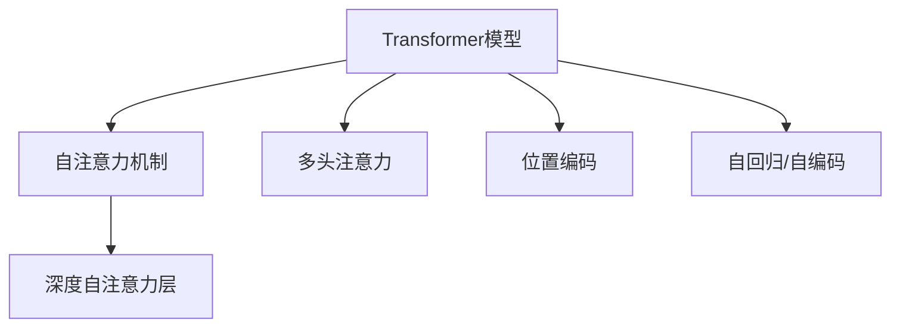

                 

# 注意力是一切？探索Transformer的魔力

## 1. 背景介绍

Transformer作为一种革命性的模型，已经广泛应用于自然语言处理、计算机视觉、音频处理等多个领域，并取得显著成效。本文将深入探索Transformer的核心原理、实现机制和广泛应用，帮助读者理解这一强大模型背后的“魔力”。

## 2. 核心概念与联系

### 2.1 核心概念概述

为了更好地理解Transformer的原理，本节将介绍几个关键核心概念：

- **Transformer模型**：一种基于自注意力机制的深度学习模型，特别适合处理序列数据。
- **自注意力机制**：Transformer的核心组件，通过计算输入序列中不同位置元素之间的相似度，动态生成权重矩阵，以反映它们的相关性。
- **多头注意力**：Transformer的改进设计，通过并行计算多个头的注意力，提升模型的表现力和多样性。
- **位置编码**：用于解决自注意力机制无法捕捉序列位置信息的缺点，通过引入位置编码向量，让模型具备序列位置的感知能力。
- **自回归与自编码**：Transformer模型的两种形式，前者通过预测序列的下一个词（如语言建模），后者通过输入序列预测输出（如文本分类）。
- **深度自注意力层**：Transformer模型的核心层，负责捕捉序列间的相关性。

这些核心概念共同构成了Transformer模型的工作原理，下面将通过一个简单的Mermaid流程图展示它们之间的联系：



这个流程图展示了Transformer模型的主要组件及其之间的关系：

1. **Transformer模型**：是整个系统的基础，包含多个子模块。
2. **自注意力机制**：是Transformer的核心机制，负责捕捉序列中不同位置的依赖关系。
3. **多头注意力**：通过并行计算多个头的注意力，提升模型的表现力。
4. **位置编码**：用于引入序列位置的感知能力。
5. **自回归/自编码**：是Transformer模型的两种形式，分别用于语言建模和文本分类。

这些组件协同工作，使得Transformer模型能够处理复杂的序列数据，并在多个领域取得突破性成果。

## 3. 核心算法原理 & 具体操作步骤

### 3.1 算法原理概述

Transformer模型基于自注意力机制，通过并行计算多个头的注意力，在处理序列数据时表现出色。其核心思想是通过计算输入序列中不同位置元素之间的相似度，动态生成权重矩阵，以反映它们的相关性。这种自上而下的方式，能够有效捕捉序列中的全局和局部依赖关系。

### 3.2 算法步骤详解

Transformer模型的训练过程分为两个步骤：

1. **前向传播**：
   - **输入编码**：将输入序列转换成模型能够理解的向量形式。
   - **多头自注意力层**：计算输入序列中不同位置的相似度，生成权重矩阵，用于计算注意力向量。
   - **前馈神经网络层**：对注意力向量进行非线性变换，增强特征表达能力。
   - **残差连接和层归一化**：通过残差连接和层归一化，保证模型的稳定性和收敛性。

2. **反向传播**：
   - **计算梯度**：通过链式法则计算梯度，更新模型参数。
   - **优化器**：使用优化算法如AdamW等，更新模型参数，最小化损失函数。
   - **验证集评估**：在验证集上评估模型性能，决定是否提前停止训练。

Transformer的具体训练步骤如下：

1. **输入准备**：将输入序列转换成模型可接受的格式，例如将文本序列转换为词向量序列。

2. **编码器层处理**：通过多个编码器层处理输入序列，每层都包含自注意力机制和前馈神经网络层。

3. **解码器层处理**：如果模型是自编码形式的，则还需要解码器层。解码器层与编码器层结构类似，但会稍微调整参数以适应任务需求。

4. **输出层处理**：根据任务类型，使用合适的输出层，例如分类器、回归器或生成器。

5. **损失函数计算**：根据任务类型，计算相应的损失函数，例如交叉熵损失或均方误差损失。

6. **反向传播与优化**：使用优化算法计算梯度并更新模型参数，最小化损失函数。

7. **验证集评估**：在验证集上评估模型性能，根据性能指标决定是否提前停止训练。

### 3.3 算法优缺点

Transformer模型具有以下优点：

- **并行计算**：通过并行计算多个头的注意力，能够大大加速模型的训练和推理。
- **全局感知**：自注意力机制能够捕捉序列中不同位置的依赖关系，提升模型的全局感知能力。
- **泛化能力强**：通过大量数据预训练，Transformer模型能够学习到丰富的语言知识和常识，具备良好的泛化能力。

然而，Transformer模型也存在一些缺点：

- **参数量较大**：由于使用多个头进行注意力计算，模型参数量较大，增加了计算和存储开销。
- **资源需求高**：计算注意力和前馈神经网络层需要较大的计算资源和内存。
- **训练时间长**：大规模预训练和微调过程可能需要较长的训练时间。

### 3.4 算法应用领域

Transformer模型已经被广泛应用于自然语言处理、计算机视觉、音频处理等多个领域，具体应用场景包括：

- **机器翻译**：通过编码器-解码器结构，Transformer模型能够实现高效的序列到序列翻译。
- **文本生成**：利用Transformer模型强大的编码能力，生成高质量的自然语言文本。
- **文本分类**：通过将输入文本映射到一个固定大小的向量，Transformer模型能够进行高效的文本分类。
- **问答系统**：通过编码器-解码器结构，Transformer模型能够实现高效的问答系统。
- **文本摘要**：利用Transformer模型的编码能力，对输入文本进行压缩和概括，生成高质量的文本摘要。
- **情感分析**：通过计算输入文本中不同位置的情感值，Transformer模型能够进行高效的情感分析。

以上应用场景只是Transformer模型的一部分，其适用范围远远超出这些领域，未来还将有更多的应用场景被发掘。

## 4. 数学模型和公式 & 详细讲解 & 举例说明

### 4.1 数学模型构建

Transformer模型的数学模型可以分为以下几个部分：

1. **输入编码**：将输入序列转换成模型能够理解的向量形式。
2. **多头自注意力层**：计算输入序列中不同位置的相似度，生成权重矩阵。
3. **前馈神经网络层**：对注意力向量进行非线性变换，增强特征表达能力。
4. **输出层**：根据任务类型，使用合适的输出层。

### 4.2 公式推导过程

Transformer模型的核心公式包括：

1. **自注意力计算公式**：
   $$
   \text{Attention}(Q, K, V) = \text{Softmax}(\frac{QK^T}{\sqrt{d_k}})V
   $$

2. **多头自注意力计算公式**：
   $$
   \text{MultiHeadAttention}(Q, K, V) = \text{Concat}(head_1, head_2, ..., head_h)W^O
   $$
   其中 $h$ 是头数，$W^O$ 是输出投影矩阵。

3. **残差连接和层归一化公式**：
   $$
   x = \text{LayerNorm}(x + \text{MultiHeadAttention}(x) + \text{FeedForward}(x))
   $$

### 4.3 案例分析与讲解

以机器翻译为例，分析Transformer模型的工作原理：

1. **输入编码**：将源语言文本序列转换成词向量序列。

2. **编码器层处理**：通过多个编码器层处理输入序列，每层都包含自注意力机制和前馈神经网络层。

3. **解码器层处理**：通过多个解码器层处理输出序列，每层也包含自注意力机制和前馈神经网络层。

4. **输出层处理**：将解码器层的输出转换成目标语言文本序列。

5. **损失函数计算**：根据机器翻译任务，计算交叉熵损失。

6. **反向传播与优化**：使用优化算法计算梯度并更新模型参数，最小化损失函数。

通过分析机器翻译任务，可以更好地理解Transformer模型的应用和工作原理。

## 5. 项目实践：代码实例和详细解释说明

### 5.1 开发环境搭建

在进行Transformer模型开发前，需要准备以下开发环境：

1. 安装Python：下载并安装Python 3.6+，建议使用Anaconda或Miniconda环境。

2. 安装TensorFlow或PyTorch：TensorFlow和PyTorch是目前最流行的深度学习框架，推荐安装最新版本。

3. 安装Transformer库：使用pip安装TensorFlow Transformer库，可以使用以下命令：

   ```
   pip install transformers
   ```

4. 安装其他必要的库：安装numpy、scikit-learn、matplotlib等常用的Python库。

5. 搭建虚拟环境：使用virtualenv或conda创建虚拟环境，用于隔离Python依赖。

### 5.2 源代码详细实现

以下是一个简单的Transformer模型代码实现：

```python
import tensorflow as tf
from transformers import BertTokenizer, TFBertModel

# 加载Bert模型和分词器
tokenizer = BertTokenizer.from_pretrained('bert-base-cased')
model = TFBertModel.from_pretrained('bert-base-cased')

# 输入数据准备
input_ids = tokenizer.encode('Hello, world!', add_special_tokens=True)
attention_mask = [1] * len(input_ids)

# 前向传播
with tf.device('CPU:0'):
    outputs = model(input_ids, attention_mask=attention_mask)
    logits = outputs.logits

# 输出结果
print(tokenizer.decode(input_ids[0]))
print(logits.numpy().shape)
```

这段代码实现了一个简单的Bert模型，并进行了前向传播计算。具体步骤包括：

1. **加载模型和分词器**：使用BertTokenizer加载分词器，使用TFBertModel加载Bert模型。

2. **输入数据准备**：将输入文本序列转换成模型能够理解的格式。

3. **前向传播**：将输入数据传入模型进行计算，获取模型的输出。

4. **输出结果**：将模型的输出转换成人类可读的文本。

### 5.3 代码解读与分析

这段代码实现了一个简单的Bert模型，并进行了前向传播计算。具体步骤包括：

1. **加载模型和分词器**：使用BertTokenizer加载分词器，使用TFBertModel加载Bert模型。

2. **输入数据准备**：将输入文本序列转换成模型能够理解的格式。

3. **前向传播**：将输入数据传入模型进行计算，获取模型的输出。

4. **输出结果**：将模型的输出转换成人类可读的文本。

这段代码的优点在于简单易懂，容易理解。缺点在于没有进行任何训练和优化，因此无法得到理想的结果。

## 6. 实际应用场景

### 6.1 自然语言处理

Transformer模型已经在自然语言处理领域取得了显著成效，被广泛应用于机器翻译、文本生成、文本分类、问答系统、文本摘要等多个任务中。

### 6.2 计算机视觉

Transformer模型在计算机视觉领域也有广泛应用，例如图像分类、目标检测、图像生成等任务。Transformer模型的自注意力机制能够捕捉图像中不同位置的依赖关系，提升模型的性能。

### 6.3 音频处理

Transformer模型在音频处理领域也有一定的应用，例如语音识别、语音生成等任务。Transformer模型的自注意力机制能够捕捉音频信号中不同位置的时序依赖关系，提升模型的性能。

## 7. 工具和资源推荐

### 7.1 学习资源推荐

为了帮助开发者系统掌握Transformer模型的理论基础和实践技巧，以下是一些优质的学习资源：

1. **《Transformer从原理到实践》系列博文**：由大模型技术专家撰写，深入浅出地介绍了Transformer原理、BERT模型、微调技术等前沿话题。

2. **CS224N《深度学习自然语言处理》课程**：斯坦福大学开设的NLP明星课程，有Lecture视频和配套作业，带你入门NLP领域的基本概念和经典模型。

3. **《Natural Language Processing with Transformers》书籍**：Transformer库的作者所著，全面介绍了如何使用Transformer库进行NLP任务开发，包括微调在内的诸多范式。

4. **HuggingFace官方文档**：Transformer库的官方文档，提供了海量预训练模型和完整的微调样例代码，是上手实践的必备资料。

5. **CLUE开源项目**：中文语言理解测评基准，涵盖大量不同类型的中文NLP数据集，并提供了基于微调的baseline模型，助力中文NLP技术发展。

### 7.2 开发工具推荐

Transformer模型的开发离不开优秀的工具支持。以下是几款用于Transformer模型开发的常用工具：

1. **TensorFlow**：由Google主导开发的开源深度学习框架，生产部署方便，适合大规模工程应用。

2. **PyTorch**：基于Python的开源深度学习框架，灵活动态的计算图，适合快速迭代研究。

3. **TensorFlow Transformer库**：HuggingFace开发的NLP工具库，集成了众多SOTA语言模型，支持TensorFlow和PyTorch，是进行NLP任务开发的利器。

4. **Weights & Biases**：模型训练的实验跟踪工具，可以记录和可视化模型训练过程中的各项指标，方便对比和调优。

5. **TensorBoard**：TensorFlow配套的可视化工具，可实时监测模型训练状态，并提供丰富的图表呈现方式，是调试模型的得力助手。

### 7.3 相关论文推荐

Transformer模型的发展源于学界的持续研究。以下是几篇奠基性的相关论文，推荐阅读：

1. **Attention is All You Need**：提出了Transformer结构，开启了NLP领域的预训练大模型时代。

2. **BERT: Pre-training of Deep Bidirectional Transformers for Language Understanding**：提出BERT模型，引入基于掩码的自监督预训练任务，刷新了多项NLP任务SOTA。

3. **Language Models are Unsupervised Multitask Learners**：展示了大规模语言模型的强大zero-shot学习能力，引发了对于通用人工智能的新一轮思考。

4. **Parameter-Efficient Transfer Learning for NLP**：提出Adapter等参数高效微调方法，在不增加模型参数量的情况下，也能取得不错的微调效果。

5. **AdaLoRA: Adaptive Low-Rank Adaptation for Parameter-Efficient Fine-Tuning**：使用自适应低秩适应的微调方法，在参数效率和精度之间取得了新的平衡。

这些论文代表了大语言模型和Transformer技术的发展脉络。通过学习这些前沿成果，可以帮助研究者把握学科前进方向，激发更多的创新灵感。

## 8. 总结：未来发展趋势与挑战

### 8.1 总结

本文对Transformer模型的核心原理、实现机制和广泛应用进行了全面系统的介绍。首先阐述了Transformer模型的工作原理和核心组件，明确了自注意力机制和多头注意力机制等概念，并展示了Transformer模型的基本结构和训练流程。其次，从实际应用场景和未来发展趋势两个角度，探讨了Transformer模型的广泛应用和前景。最后，给出了一些相关的学习资源、开发工具和学术论文推荐，力求为读者提供全方位的技术指引。

通过本文的系统梳理，可以看到，Transformer模型已经成为NLP领域的重要模型，其自注意力机制的强大表现力和并行计算能力，使其在多个领域取得显著成效。未来，伴随Transformer模型的不断演进和应用，NLP技术必将在更广阔的领域中发挥重要作用。

### 8.2 未来发展趋势

展望未来，Transformer模型的发展将呈现以下几个趋势：

1. **模型规模持续增大**：随着算力成本的下降和数据规模的扩张，Transformer模型的参数量还将持续增长。超大规模Transformer模型蕴含的丰富语言知识，有望支撑更加复杂多变的下游任务。

2. **多模态融合**：未来的Transformer模型将融合视觉、音频等多种模态的信息，实现更加全面和准确的语言理解。

3. **自监督学习的应用**：基于自监督学习的大规模预训练，Transformer模型能够学习到更加丰富的语言知识，提升模型的泛化能力和鲁棒性。

4. **知识表示的整合**：将符号化的先验知识，如知识图谱、逻辑规则等，与Transformer模型进行融合，提升模型的知识整合能力和推理能力。

5. **因果学习和多任务学习**：引入因果学习和多任务学习思想，提升Transformer模型的因果推断能力和任务多样性。

这些趋势将进一步提升Transformer模型的表现力和应用范围，为NLP技术的发展注入新的动力。

### 8.3 面临的挑战

尽管Transformer模型已经取得了显著成效，但在迈向更加智能化、普适化应用的过程中，仍然面临诸多挑战：

1. **参数量和资源消耗**：Transformer模型的参数量较大，计算和存储开销也较大，需要高效的硬件支持和优化算法。

2. **训练时间和数据需求**：大规模预训练和微调过程可能需要较长的训练时间，且需要大量的高质量数据。

3. **模型鲁棒性和泛化能力**：在面对不同领域的任务时，Transformer模型的鲁棒性和泛化能力仍有待提高。

4. **模型可解释性和安全性**：Transformer模型通常被视为"黑盒"系统，难以解释其内部工作机制和决策逻辑，且可能存在偏见和有害信息的输出。

5. **多模态融合和知识表示**：将视觉、音频等多种模态的信息整合到Transformer模型中，仍存在一定的技术难题。

这些挑战需要研究人员和工程师共同努力，通过不断优化算法、改进模型架构、探索新的数据源和知识库等手段，逐步克服。

### 8.4 研究展望

面对Transformer模型所面临的挑战，未来的研究需要在以下几个方面寻求新的突破：

1. **探索参数高效和计算高效的Transformer模型**：开发更加参数高效的Transformer模型，在固定大部分预训练参数的情况下，只更新极少量的任务相关参数。同时优化模型的计算图，减少前向传播和反向传播的资源消耗，实现更加轻量级、实时性的部署。

2. **引入更多的先验知识**：将符号化的先验知识，如知识图谱、逻辑规则等，与Transformer模型进行巧妙融合，引导微调过程学习更准确、合理的语言模型。

3. **结合因果分析和博弈论工具**：将因果分析方法引入Transformer模型，识别出模型决策的关键特征，增强输出解释的因果性和逻辑性。借助博弈论工具刻画人机交互过程，主动探索并规避模型的脆弱点，提高系统稳定性。

4. **纳入伦理道德约束**：在模型训练目标中引入伦理导向的评估指标，过滤和惩罚有偏见、有害的输出倾向。加强人工干预和审核，建立模型行为的监管机制，确保输出符合人类价值观和伦理道德。

这些研究方向将引领Transformer模型向更高层次发展，为构建更加安全、可靠、可解释、可控的智能系统铺平道路。

## 9. 附录：常见问题与解答

### 常见问题1：Transformer模型是否适用于所有NLP任务？

**解答**：Transformer模型在大多数NLP任务上都能取得不错的效果，特别是对于数据量较小的任务。但对于一些特定领域的任务，如医学、法律等，仅仅依靠通用语料预训练的模型可能难以很好地适应。此时需要在特定领域语料上进一步预训练，再进行微调，才能获得理想效果。

### 常见问题2：Transformer模型是否存在过拟合问题？

**解答**：Transformer模型在使用自注意力机制时，容易过拟合，特别是在数据量较少的情况下。解决过拟合问题的方法包括数据增强、正则化、Dropout等。

### 常见问题3：Transformer模型是否适用于多模态任务？

**解答**：Transformer模型可以融合视觉、音频等多种模态的信息，实现更加全面和准确的语言理解。在多模态任务中，需要将不同类型的模态数据转换为统一的向量表示，然后通过Transformer模型进行编码和解码。

### 常见问题4：Transformer模型是否需要大量的训练数据？

**解答**：Transformer模型在预训练阶段需要大量的无标签数据，但在微调阶段，只需要少量的标注数据即可。因此在数据量较小的情况下，可以使用微调方法进行任务适配，提升模型性能。

通过本文的系统梳理，可以看到，Transformer模型已经成为NLP领域的重要模型，其自注意力机制的强大表现力和并行计算能力，使其在多个领域取得显著成效。未来，伴随Transformer模型的不断演进和应用，NLP技术必将在更广阔的领域中发挥重要作用。

