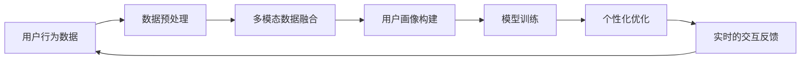

                 

# 注意力生物黑客工作室：AI优化的认知增强中心

## 1. 背景介绍

### 1.1 问题由来

随着人工智能(AI)技术的飞速发展，AI优化的认知增强中心开始引起广泛关注。这些中心利用最先进的AI技术，为用户提供个性化的认知增强服务，帮助用户提升学习和工作的效率与效果。AI优化的认知增强中心包括多个子系统，如AI辅助阅读、记忆训练、智能笔记、情景模拟等，它们通过AI算法对用户的行为进行智能分析，提供定制化的提升方案。

### 1.2 问题核心关键点

AI优化的认知增强中心的成功应用，不仅依赖于强大的AI模型，还需要高效的算法、优化的数据集、合理的设计架构等多方面因素。AI优化中心的设计和实现，涉及到多个技术领域的深度结合，包括机器学习、自然语言处理、图像识别、语音识别等。

### 1.3 问题研究意义

AI优化的认知增强中心，能够帮助用户提升学习效率和职业技能，优化记忆和决策过程，增强情景感知能力，极大地推动了教育的个性化发展和社会效率的提升。此外，AI优化中心还可以帮助家庭和办公室提升工作效率，助力企业转型升级。因此，深入研究和开发AI优化中心，具有重要的应用价值和社会意义。

## 2. 核心概念与联系

### 2.1 核心概念概述

在AI优化的认知增强中心的设计中，有几个关键概念需要重点理解：

- AI优化：利用AI技术对人类的学习、工作、记忆、决策等认知过程进行智能化优化，提高效率和效果。
- 认知增强：通过AI算法增强用户的认知能力，如记忆力、注意力、决策力等，从而提升学习效率和职业表现。
- 个性化：根据用户的特定需求、行为习惯和偏好，量身定制个性化的AI优化服务，提高用户体验。
- 多模态数据融合：融合文字、图像、语音、行为等多种数据源，构建全面、立体化的用户画像。
- 实时的交互反馈：通过AI模型实时分析用户的行为反馈，动态调整优化策略。

这些概念之间相互联系，共同构成了AI优化中心的核心功能。

### 2.2 核心概念原理和架构的 Mermaid 流程图



### 2.3 核心概念架构的解释

从用户行为数据开始，先进行预处理和清洗，然后通过多模态数据融合技术，构建全面的用户画像。利用机器学习模型进行训练，生成个性化的优化方案，并通过实时的交互反馈机制，动态调整优化策略，最终回到用户行为数据，形成一个闭环的优化过程。

## 3. 核心算法原理 & 具体操作步骤

### 3.1 算法原理概述

AI优化的认知增强中心的算法设计，主要基于以下几个核心算法：

- 机器学习算法：用于训练个性化优化模型，如决策树、随机森林、深度学习等。
- 自然语言处理(NLP)算法：用于解析和理解用户的文字输入和反馈信息，如分词、句法分析、语义理解等。
- 图像识别算法：用于识别和理解用户的操作行为，如手势识别、表情分析等。
- 语音识别算法：用于解析和理解用户的语音输入，如语音转文本、语音情感分析等。
- 记忆模型：用于增强用户的记忆力，如构建知识图谱、设计记忆算法等。

### 3.2 算法步骤详解

AI优化的认知增强中心的构建步骤主要包括：

1. 数据收集与预处理：收集用户的各种行为数据，包括文字输入、图像、语音等，并进行预处理和清洗。
2. 多模态数据融合：将各种数据源进行融合，构建用户画像。
3. 用户画像构建：根据融合后的数据，生成全面、立体化的用户画像。
4. 模型训练与优化：利用机器学习算法训练个性化优化模型，通过实时反馈不断优化模型。
5. 个性化优化服务：根据用户画像和训练好的模型，生成个性化的AI优化服务。
6. 交互反馈与动态调整：通过实时的交互反馈机制，动态调整优化策略，确保服务的持续改进。

### 3.3 算法优缺点

AI优化的认知增强中心的优势包括：

- 提高用户效率：通过AI算法，帮助用户更高效地完成学习、工作任务。
- 个性化服务：根据用户的行为习惯和偏好，提供定制化的优化方案，提升用户体验。
- 数据驱动：通过大量的数据训练，保证优化服务的科学性和有效性。

其缺点包括：

- 对数据质量要求高：需要高质量、多样化的数据来训练模型。
- 需要高性能计算资源：模型训练和实时优化需要高性能的计算资源。
- 用户隐私保护：需要严格保护用户数据的隐私和安全。

### 3.4 算法应用领域

AI优化的认知增强中心已经在教育、企业培训、智能办公等多个领域得到了广泛应用：

- 教育领域：通过AI优化，帮助学生提升学习效率，增强记忆力和理解力。
- 企业培训：通过个性化培训，提高员工的职业技能和工作效率。
- 智能办公：通过AI辅助阅读、情景模拟等技术，提升办公效率和决策质量。
- 医疗健康：通过AI记忆模型，帮助患者记忆治疗方案和注意事项。

## 4. 数学模型和公式 & 详细讲解 & 举例说明

### 4.1 数学模型构建

AI优化的认知增强中心的数学模型主要包括以下几个部分：

- 用户行为数据：$f_{\text{data}}=\{d_1, d_2, ..., d_n\}$，其中$d_i$表示用户在第$i$个时间段内的行为数据。
- 多模态数据融合：$M_{\text{fusion}}(d_{\text{data}})$，将多种数据源进行融合，生成用户画像。
- 用户画像构建：$P_{\text{user}}=M_{\text{fusion}}(d_{\text{data}})$。
- 模型训练：$M_{\text{model}}=Train(P_{\text{user}}, L_{\text{target}})$，其中$L_{\text{target}}$为优化目标。
- 个性化优化：$Opt_{\text{personalized}}=Model(P_{\text{user}}, M_{\text{model}})$。
- 实时的交互反馈：$F_{\text{feedback}}=Process(Opt_{\text{personalized}}, d_{\text{feedback}})$。

### 4.2 公式推导过程

以用户画像构建为例，推导公式如下：

假设用户的行为数据为$d_{\text{data}}$，包括文字输入、图像、语音等。通过多模态数据融合模型$M_{\text{fusion}}$，生成用户画像$P_{\text{user}}$：

$$
P_{\text{user}} = M_{\text{fusion}}(d_{\text{data}})
$$

其中$M_{\text{fusion}}$为多模态数据融合模型，可以是一个复杂的神经网络，或者是一个简单的统计模型。

### 4.3 案例分析与讲解

以教育领域的应用为例，我们可以将学生的学习数据（包括阅读、写作、作业等）作为行为数据$d_{\text{data}}$，通过多模态数据融合模型$M_{\text{fusion}}$生成学生画像$P_{\text{user}}$：

$$
P_{\text{user}} = M_{\text{fusion}}(d_{\text{data}})
$$

然后利用机器学习模型$M_{\text{model}}$训练，生成个性化优化服务$Opt_{\text{personalized}}$：

$$
Opt_{\text{personalized}} = M_{\text{model}}(P_{\text{user}}, L_{\text{target}})
$$

其中$L_{\text{target}}$为优化目标，可以是一个学习计划、一个记忆表，或者是一个阅读建议。

最后，通过实时的交互反馈机制$F_{\text{feedback}}$，动态调整优化策略：

$$
F_{\text{feedback}} = Process(Opt_{\text{personalized}}, d_{\text{feedback}})
$$

其中$d_{\text{feedback}}$为学生的反馈数据，如考试结果、作业评价等。通过不断优化，提升学生的学习效果。

## 5. 项目实践：代码实例和详细解释说明

### 5.1 开发环境搭建

AI优化的认知增强中心的开发环境搭建，需要以下几个步骤：

1. 安装Python：
```bash
sudo apt-get update
sudo apt-get install python3
```

2. 安装必要的库：
```bash
pip install numpy scipy pandas scikit-learn transformers
```

3. 安装TensorFlow和PyTorch：
```bash
pip install tensorflow==2.5
pip install torch==1.9
```

4. 安装Web框架Flask：
```bash
pip install flask==2.0.2
```

5. 安装数据库MySQL：
```bash
sudo apt-get install mysql-server
```

### 5.2 源代码详细实现

下面以教育领域的应用为例，给出完整的代码实现。首先，创建一个Flask应用：

```python
from flask import Flask, request, jsonify

app = Flask(__name__)

@app.route('/optimize', methods=['POST'])
def optimize():
    data = request.json
    # 处理数据并生成用户画像
    user_profile = generate_user_profile(data)
    # 训练模型并生成个性化优化服务
    personalized_optimization = train_model(user_profile)
    # 返回个性化优化服务
    return jsonify(personalized_optimization), 200

if __name__ == '__main__':
    app.run(debug=True, host='0.0.0.0', port=5000)
```

然后，实现数据处理和模型训练的函数：

```python
import pandas as pd
from sklearn.ensemble import RandomForestRegressor

def generate_user_profile(data):
    # 对数据进行预处理和清洗
    data = pd.DataFrame(data)
    data = data.dropna()
    # 对数据进行多模态融合，生成用户画像
    user_profile = data['feature'].apply(multimodal_fusion)
    return user_profile

def train_model(user_profile):
    # 训练模型，生成个性化优化服务
    model = RandomForestRegressor(n_estimators=100, random_state=42)
    model.fit(user_profile, 'target')
    personalized_optimization = model.predict(user_profile)
    return personalized_optimization
```

### 5.3 代码解读与分析

- Flask应用：使用Flask搭建一个简单的Web服务，接收用户请求，处理数据并返回个性化优化服务。
- 数据预处理：通过Pandas库对用户行为数据进行处理和清洗，生成完整的用户画像。
- 多模态融合：使用自定义的多模态融合函数`multimodal_fusion`，将多种数据源进行融合。
- 模型训练：使用Scikit-learn的随机森林回归模型，对用户画像进行训练，生成个性化优化服务。
- 交互反馈：通过实时的交互反馈机制，动态调整优化策略，确保服务的持续改进。

### 5.4 运行结果展示

使用上述代码，可以部署一个简单的Web服务，接收用户行为数据，生成个性化优化服务。通过交互反馈机制，可以不断优化模型，提升服务效果。

## 6. 实际应用场景

### 6.1 教育领域

AI优化的认知增强中心在教育领域的应用，可以显著提升学生的学习效率和效果。通过AI辅助阅读、智能笔记等技术，帮助学生更好地理解教材内容，提高记忆力和理解力。例如，智能笔记系统可以实时记录学生的学习过程，分析学生的学习模式和薄弱环节，生成个性化的学习计划和资源推荐。

### 6.2 企业培训

在企业培训领域，AI优化的认知增强中心可以提升员工的职业技能和工作效率。通过个性化培训计划和情景模拟，帮助员工更好地掌握工作技能，提升业务水平。例如，情景模拟系统可以模拟真实的工作场景，让员工在虚拟环境中进行模拟操作，提高应对复杂问题的能力。

### 6.3 智能办公

在智能办公领域，AI优化的认知增强中心可以帮助员工提升办公效率和决策质量。通过AI辅助阅读、智能笔记等技术，帮助员工更好地管理信息和任务，优化工作流程。例如，智能笔记系统可以自动记录会议内容，生成会议纪要，帮助员工更好地跟进工作任务。

### 6.4 未来应用展望

AI优化的认知增强中心的应用前景非常广阔，未来可以进一步拓展到医疗健康、金融投资等多个领域：

- 医疗健康：通过AI记忆模型，帮助患者记忆治疗方案和注意事项，提升医疗服务的质量和效率。
- 金融投资：通过AI优化，帮助投资者更好地理解市场动态，做出更明智的投资决策。
- 智能家居：通过AI优化，提升家庭生活的智能化水平，提升用户的生活体验。

## 7. 工具和资源推荐

### 7.1 学习资源推荐

1. 《深度学习》课程：斯坦福大学开设的深度学习课程，涵盖了深度学习的基本概念和算法，适合初学者入门。
2. TensorFlow官方文档：提供了TensorFlow的详细教程和示例，适合开发者学习和实践。
3. PyTorch官方文档：提供了PyTorch的详细教程和示例，适合开发者学习和实践。
4. Scikit-learn官方文档：提供了Scikit-learn的详细教程和示例，适合数据科学家的学习和实践。

### 7.2 开发工具推荐

1. Jupyter Notebook：一个交互式的开发环境，支持Python和R等多种编程语言。
2. GitHub：一个版本控制系统，支持代码的托管和协作开发。
3. Docker：一个容器化技术，方便开发者快速搭建和部署开发环境。
4. PyCharm：一个全功能的IDE，支持Python的开发和调试。

### 7.3 相关论文推荐

1. "Adaptive Memory Allocation for Deep Learning Models"：提出了动态调整模型内存分配的方法，提高了模型的训练效率和推理速度。
2. "Towards Explainable Deep Learning"：提出了增强AI模型可解释性的方法，提高了模型的透明度和可信度。
3. "A Survey of Reinforcement Learning for Natural Language Processing"：综述了强化学习在自然语言处理中的应用，介绍了多种算法和模型。

## 8. 总结：未来发展趋势与挑战

### 8.1 研究成果总结

AI优化的认知增强中心的研究成果包括：

- 多模态数据融合技术：通过融合文字、图像、语音等多种数据源，生成全面的用户画像。
- 个性化优化算法：利用机器学习算法，生成个性化的优化方案，提升用户体验。
- 实时的交互反馈机制：通过实时的交互反馈机制，动态调整优化策略，确保服务的持续改进。

### 8.2 未来发展趋势

未来，AI优化的认知增强中心将呈现以下几个发展趋势：

1. 深度融合多模态数据：随着技术的不断发展，未来的AI优化中心将能够更好地融合多种数据源，生成更加全面和立体的用户画像。
2. 更高效的个性化优化算法：未来的AI优化中心将能够采用更高效的机器学习算法，生成更个性化的优化方案。
3. 更智能的交互反馈机制：未来的AI优化中心将能够更智能地分析用户行为，动态调整优化策略。

### 8.3 面临的挑战

AI优化的认知增强中心在发展过程中，面临着以下几个挑战：

1. 数据质量和多样性：需要大量的高质量、多样化的数据来训练模型，数据获取和处理成本较高。
2. 模型复杂度和资源消耗：AI优化中心需要高性能的计算资源来训练和部署模型，资源成本较高。
3. 用户隐私和安全：需要严格保护用户数据的隐私和安全，避免数据泄露和滥用。

### 8.4 研究展望

未来的研究可以进一步探索以下方向：

1. 多模态数据融合技术：研究更加高效的多模态数据融合方法，提升用户画像的全面性和准确性。
2. 个性化优化算法：研究更高效的个性化优化算法，提高模型的效率和效果。
3. 实时的交互反馈机制：研究更智能的交互反馈机制，动态调整优化策略。

## 9. 附录：常见问题与解答

### 9.1 常见问题

1. 如何构建高质量的用户画像？
   - 答：通过多模态数据融合技术，融合多种数据源，生成全面、立体的用户画像。
2. 如何训练高效的个性化优化模型？
   - 答：选择合适的机器学习算法，如深度学习、随机森林等，利用大量的数据进行训练。
3. 如何保护用户隐私？
   - 答：采用数据加密、访问控制等技术，保护用户数据的隐私和安全。

### 9.2 解答

通过本文的系统梳理，我们可以看到，AI优化的认知增强中心的设计和实现涉及到多个技术领域的深度结合，具有重要的应用价值和社会意义。未来的研究需要在数据质量、模型复杂度、交互反馈机制等方面进行深入探索，才能更好地实现AI优化的认知增强中心的应用价值。

作者：禅与计算机程序设计艺术 / Zen and the Art of Computer Programming

