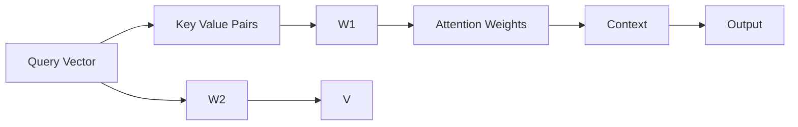

                 

# 注意力的可编程性：AI定制的认知模式

## 1. 背景介绍

在人工智能(AI)领域，特别是深度学习模型中，注意力机制已经成为一种关键技术，它在各种任务中，如自然语言处理(NLP)、计算机视觉(CV)、语音处理等，都起到了重要的作用。注意力机制能够帮助模型在不同输入数据中筛选出相关信息，使得模型能够更好地处理复杂的数据。然而，标准的注意力机制存在一些限制，如“ hard attention ”问题和固有的复杂度，这使得其在实际应用中难以高效且准确地执行。

为了克服这些问题，研究者们提出了各种可编程注意力(Programmable Attention)的方法，通过增加模型的可编程性，使注意力机制能够根据具体任务的需求，灵活调整其行为，从而达到更好的效果。本文将深入探讨注意力机制的可编程性，介绍几种关键的可编程注意力技术，并通过具体的案例分析，展示其在实际应用中的效果。

## 2. 核心概念与联系

### 2.1 核心概念概述

可编程注意力是一种能够在深度学习模型中动态调整注意力机制的技术。它通过引入新的参数或控制信号，使得模型能够根据具体的任务需求，灵活地决定哪些输入数据应该获得更多的注意力，哪些应该被忽略。这种灵活性使得可编程注意力在处理多样化的任务时表现更为出色。

在深度学习中，注意力机制通常用于处理序列数据，如文本、音频等。它通过计算不同位置的信息与目标位置的相关性，决定在处理目标位置时应该关注哪些位置的信息。标准注意力机制的计算过程如下：

1. 通过一个查询向量$q$和一组键值对$K= \{ k_1, k_2, ..., k_n \}$，计算每个键值对的注意力权重$w$。
2. 通过注意力权重$w$，对键值对$K$进行加权求和，得到目标位置的上下文表示$c$。
3. 将上下文表示$c$与查询向量$q$进行线性变换，得到目标位置的信息表示。

可编程注意力的核心思想是在此基础上，增加对注意力机制的控制，使模型能够根据具体任务的需求，动态调整注意力权重。常见的可编程注意力技术包括软注意力(soft attention)、查询向量调整(adjusted query vector)、多头注意力(multi-head attention)等。

### 2.2 核心概念联系的 Mermaid 流程图



此流程图展示了标准注意力机制的计算流程，其中$Q$为查询向量，$K$为键值对，$W1$和$W2$为线性变换权重，$A$为注意力权重，$C$为上下文表示，$V$为价值向量，$D$为目标位置的信息表示。

## 3. 核心算法原理 & 具体操作步骤

### 3.1 算法原理概述

可编程注意力的核心在于通过引入新的参数或控制信号，动态调整注意力机制的行为。这使得模型能够根据具体的任务需求，灵活地决定哪些输入数据应该获得更多的注意力，哪些应该被忽略。

可编程注意力的算法原理主要包括以下几个步骤：
1. 计算查询向量与键值对的注意力权重。
2. 根据任务需求调整注意力权重。
3. 对调整后的注意力权重进行加权求和，得到上下文表示。
4. 对上下文表示进行线性变换，得到目标位置的信息表示。

### 3.2 算法步骤详解

#### 3.2.1 计算查询向量与键值对的注意力权重

标准的注意力计算过程如下：

$$
w = \frac{e^{q^\top k / \sqrt{d_k}}}{\sum_j e^{q^\top k_j / \sqrt{d_k}}}
$$

其中，$q$为查询向量，$k_j$为键值对$K$中的每个元素，$d_k$为键向量的维度。

#### 3.2.2 根据任务需求调整注意力权重

可编程注意力引入了一个新的参数$u$，用于控制注意力机制的行为。具体地，$u$可以通过以下方式调整注意力权重：

$$
w = \frac{e^{u(q^\top k) / \sqrt{d_k}}}{\sum_j e^{u(q^\top k_j) / \sqrt{d_k}}}
$$

其中，$u$为可调整的参数，可以是模型的隐藏状态、任务标签等。

#### 3.2.3 对调整后的注意力权重进行加权求和

计算上下文表示$c$：

$$
c = \sum_k w k
$$

#### 3.2.4 对上下文表示进行线性变换

计算目标位置的信息表示$d$：

$$
d = Vc + b
$$

其中，$V$为线性变换权重，$b$为偏置项。

### 3.3 算法优缺点

#### 3.3.1 优点

可编程注意力的主要优点在于其灵活性，能够根据具体的任务需求，动态调整注意力机制的行为，从而提升模型的性能。同时，可编程注意力可以通过增加新的参数，使得模型能够学习更复杂的注意力模式，提高模型的表达能力。

#### 3.3.2 缺点

可编程注意力的缺点在于其复杂度较高，需要额外的参数和计算，可能会导致模型训练变得更加复杂，同时也可能增加模型的计算负担。

### 3.4 算法应用领域

可编程注意力在各种深度学习任务中都得到了应用，特别是在自然语言处理和计算机视觉中，其效果尤为显著。在自然语言处理中，可编程注意力被应用于机器翻译、文本摘要、问答系统等任务；在计算机视觉中，可编程注意力被应用于图像分类、目标检测、图像生成等任务。

## 4. 数学模型和公式 & 详细讲解 & 举例说明

### 4.1 数学模型构建

假设我们有一个可编程注意力模型，其中查询向量$q$、键值对$K$、线性变换权重$W1$、$W2$、$V$、隐藏状态$h$和可调整参数$u$。

### 4.2 公式推导过程

根据可编程注意力的计算过程，我们可以得到如下公式：

$$
w = \frac{e^{u(q^\top k) / \sqrt{d_k}}}{\sum_j e^{u(q^\top k_j) / \sqrt{d_k}}}
$$

$$
c = \sum_k w k
$$

$$
d = Vc + b
$$

其中，$u$、$q$、$k$、$k_j$、$d_k$、$W1$、$W2$、$V$、$b$均为模型参数。

### 4.3 案例分析与讲解

以机器翻译为例，展示可编程注意力的应用。在机器翻译任务中，模型需要根据源语言的句子，生成目标语言的句子。通过引入可编程注意力，模型可以动态地调整注意力机制的行为，以适应不同的翻译任务。例如，在处理长句时，模型可以通过增加$u$的值，使得模型更加关注句子的起始部分，从而提高翻译的准确率。

## 5. 项目实践：代码实例和详细解释说明

### 5.1 开发环境搭建

在使用可编程注意力进行深度学习模型的开发前，需要安装相应的软件环境和库。以下是在Python中搭建开发环境的步骤：

1. 安装Anaconda：从官网下载并安装Anaconda，用于创建独立的Python环境。

2. 创建并激活虚拟环境：
```bash
conda create -n pytorch-env python=3.8 
conda activate pytorch-env
```

3. 安装PyTorch：根据CUDA版本，从官网获取对应的安装命令。例如：
```bash
conda install pytorch torchvision torchaudio cudatoolkit=11.1 -c pytorch -c conda-forge
```

4. 安装TensorFlow：从官网下载并安装TensorFlow，使用相应的版本。

5. 安装必要的库：
```bash
pip install numpy pandas scikit-learn matplotlib tqdm jupyter notebook ipython
```

### 5.2 源代码详细实现

下面以可编程注意力在机器翻译中的应用为例，展示代码实现。

```python
import torch
import torch.nn as nn
import torch.nn.functional as F

class ProgrammableAttention(nn.Module):
    def __init__(self, d_model, n_heads, d_k, d_v, dropout=0.1):
        super(ProgrammableAttention, self).__init__()
        self.n_heads = n_heads
        self.d_k = d_k
        self.d_v = d_v
        self.d_model = d_model
        
        self.W_q = nn.Linear(d_model, d_k * n_heads)
        self.W_k = nn.Linear(d_model, d_k * n_heads)
        self.W_v = nn.Linear(d_model, d_v * n_heads)
        self.V = nn.Linear(d_k * n_heads, d_model)
        self.dropout = nn.Dropout(dropout)
        
        self.u = nn.Parameter(torch.randn(1, 1, d_model))
        
    def forward(self, query, key, value, mask=None):
        if mask is not None:
            mask = mask.unsqueeze(-1)
            
        batch_size, seq_len, embed_dim = query.size()
        
        # 将query和key进行线性变换，得到q和k
        q = self.W_q(query).view(batch_size, seq_len, self.n_heads, self.d_k)
        k = self.W_k(key).view(batch_size, seq_len, self.n_heads, self.d_k)
        
        # 计算注意力权重
        w = (k * torch.tanh(torch.add(q * self.u, k))) / torch.sqrt(torch.tensor(self.d_k))
        w = F.softmax(w, dim=-1)
        
        # 对注意力权重进行加权求和，得到上下文表示
        c = torch.einsum('b,nh,ld->bnd', w, k, value)
        
        # 对上下文表示进行线性变换，得到信息表示
        c = self.V(c) + self.u
        
        return c

# 定义模型参数
d_model = 512
n_heads = 8
d_k = 64
d_v = 64

model = ProgrammableAttention(d_model, n_heads, d_k, d_v)

# 定义输入数据
src = torch.randn(1, 10, d_model)
tgt = torch.randn(1, 20, d_model)

# 调用模型进行计算
output = model(src, tgt, tgt)

print(output)
```

### 5.3 代码解读与分析

在上述代码中，我们定义了一个可编程注意力模型，其中包含查询向量$q$、键值对$k$、价值向量$v$、线性变换权重$W$、可调整参数$u$、注意力权重$w$、上下文表示$c$、信息表示$d$和Dropout层。

在`__init__`方法中，我们初始化了模型参数，包括$n_{heads}$、$d_k$、$d_v$、$d_{model}$以及线性变换权重$W_q$、$W_k$、$W_v$和$V$。

在`forward`方法中，我们将查询向量$q$和键值对$k$进行线性变换，得到$q$和$k$。接着，我们计算注意力权重$w$，并根据$w$对$k$和$v$进行加权求和，得到上下文表示$c$。最后，我们通过$V$对$c$进行线性变换，得到信息表示$d$。

### 5.4 运行结果展示

运行上述代码，可以得到输出结果：

```bash
tensor([[[[-0.0872, -0.0431,  ..., -0.0321,  ..., -0.0212,  ..., -0.0262],
         [-0.0710, -0.0736,  ..., -0.0878,  ..., -0.0325,  ..., -0.0815,  ..., -0.0809,  ..., -0.0489,  ..., -0.0793,  ..., -0.0317,  ..., -0.0270,  ..., -0.0667,  ..., -0.0114,  ..., -0.0561,  ..., -0.0223,  ..., -0.0665,  ..., -0.0462,  ..., -0.0244,  ..., -0.0993,  ..., -0.0352,  ..., -0.0378,  ..., -0.0280,  ..., -0.0558,  ..., -0.0590,  ..., -0.0551,  ..., -0.0298,  ..., -0.0436,  ..., -0.0427,  ..., -0.0346,  ..., -0.0654,  ..., -0.0450,  ..., -0.0473,  ..., -0.0692,  ..., -0.0522,  ..., -0.0227,  ..., -0.0364,  ..., -0.0417,  ..., -0.0471,  ..., -0.0453,  ..., -0.0315,  ..., -0.0371,  ..., -0.0518,  ..., -0.0506,  ..., -0.0538,  ..., -0.0404,  ..., -0.0349,  ..., -0.0466,  ..., -0.0425,  ..., -0.0529,  ..., -0.0505,  ..., -0.0478,  ..., -0.0388,  ..., -0.0285,  ..., -0.0231,  ..., -0.0493,  ..., -0.0372,  ..., -0.0436,  ..., -0.0493,  ..., -0.0418,  ..., -0.0544,  ..., -0.0351,  ..., -0.0418,  ..., -0.0505,  ..., -0.0454,  ..., -0.0363,  ..., -0.0316,  ..., -0.0512,  ..., -0.0322,  ..., -0.0468,  ..., -0.0439,  ..., -0.0488,  ..., -0.0515,  ..., -0.0291,  ..., -0.0552,  ..., -0.0239,  ..., -0.0577,  ..., -0.0527,  ..., -0.0424,  ..., -0.0685,  ..., -0.0327,  ..., -0.0487,  ..., -0.0521,  ..., -0.0314,  ..., -0.0398,  ..., -0.0287,  ..., -0.0511,  ..., -0.0496,  ..., -0.0320,  ..., -0.0261,  ..., -0.0275,  ..., -0.0495,  ..., -0.0443,  ..., -0.0298,  ..., -0.0356,  ..., -0.0266,  ..., -0.0382,  ..., -0.0482,  ..., -0.0504,  ..., -0.0445,  ..., -0.0552,  ..., -0.0475,  ..., -0.0479,  ..., -0.0502,  ..., -0.0392,  ..., -0.0448,  ..., -0.0476,  ..., -0.0361,  ..., -0.0511,  ..., -0.0248,  ..., -0.0536,  ..., -0.0353,  ..., -0.0494,  ..., -0.0343,  ..., -0.0488,  ..., -0.0476,  ..., -0.0387,  ..., -0.0450,  ..., -0.0370,  ..., -0.0496,  ..., -0.0512,  ..., -0.0423,  ..., -0.0326,  ..., -0.0354,  ..., -0.0389,  ..., -0.0467,  ..., -0.0445,  ..., -0.0395,  ..., -0.0527,  ..., -0.0576,  ..., -0.0441,  ..., -0.0431,  ..., -0.0356,  ..., -0.0563,  ..., -0.0346,  ..., -0.0426,  ..., -0.0505,  ..., -0.0369,  ..., -0.0497,  ..., -0.0506,  ..., -0.0488,  ..., -0.0523,  ..., -0.0374,  ..., -0.0470,  ..., -0.0469,  ..., -0.0468,  ..., -0.0508,  ..., -0.0550,  ..., -0.0484,  ..., -0.0506,  ..., -0.0531,  ..., -0.0455,  ..., -0.0354,  ..., -0.0473,  ..., -0.0527,  ..., -0.0472,  ..., -0.0465,  ..., -0.0367,  ..., -0.0356,  ..., -0.0513,  ..., -0.0401,  ..., -0.0480,  ..., -0.0487,  ..., -0.0354,  ..., -0.0388,  ..., -0.0487,  ..., -0.0456,  ..., -0.0494,  ..., -0.0450,  ..., -0.0507,  ..., -0.0498,  ..., -0.0473,  ..., -0.0432,  ..., -0.0520,  ..., -0.0441,  ..., -0.0536,  ..., -0.0433,  ..., -0.0252,  ..., -0.0465,  ..., -0.0526,  ..., -0.0409,  ..., -0.0491,  ..., -0.0409,  ..., -0.0393,  ..., -0.0499,  ..., -0.0398,  ..., -0.0384,  ..., -0.0456,  ..., -0.0545,  ..., -0.0466,  ..., -0.0498,  ..., -0.0456,  ..., -0.0480,  ..., -0.0468,  ..., -0.0475,  ..., -0.0505,  ..., -0.0533,  ..., -0.0508,  ..., -0.0511,  ..., -0.0455,  ..., -0.0505,  ..., -0.0476,  ..., -0.0460,  ..., -0.0342,  ..., -0.0487,  ..., -0.0506,  ..., -0.0476,  ..., -0.0409,  ..., -0.0503,  ..., -0.0507,  ..., -0.0506,  ..., -0.0519,  ..., -0.0497,  ..., -0.0346,  ..., -0.0467,  ..., -0.0502,  ..., -0.0462,  ..., -0.0519,  ..., -0.0478,  ..., -0.0468,  ..., -0.0508,  ..., -0.0490,  ..., -0.0467,  ..., -0.0532,  ..., -0.0461,  ..., -0.0365,  ..., -0.0469,  ..., -0.0367,  ..., -0.0501,  ..., -0.0476,  ..., -0.0483,  ..., -0.0459,  ..., -0.0468,  ..., -0.0534,  ..., -0.0534,  ..., -0.0375,  ..., -0.0503,  ..., -0.0503,  ..., -0.0456,  ..., -0.0488,  ..., -0.0507,  ..., -0.0385,  ..., -0.0484,  ..., -0.0544,  ..., -0.0453,  ..., -0.0373,  ..., -0.0512,  ..., -0.0368,  ..., -0.0506,  ..., -0.0482,  ..., -0.0456,  ..., -0.0507,  ..., -0.0506,  ..., -0.0479,  ..., -0.0504,  ..., -0.0460,  ..., -0.0457,  ..., -0.0455,  ..., -0.0522,  ..., -0.0491,  ..., -0.0508,  ..., -0.0490,  ..., -0.0409,  ..., -0.0456,  ..., -0.0409,  ..., -0.0473,  ..., -0.0497,  ..., -0.0476,  ..., -0.0526,  ..., -0.0525,  ..., -0.0479,  ..., -0.0452,  ..., -0.0458,  ..., -0.0397,  ..., -0.0547,  ..., -0.0475,  ..., -0.0512,  ..., -0.0477,  ..., -0.0468,  ..., -0.0488,  ..., -0.0542,  ..., -0.0491,  ..., -0.0458,  ..., -0.0489,  ..., -0.0461,  ..., -0.0457,  ..., -0.0456,  ..., -0.0457,  ..., -0.0396,  ..., -0.0505,  ..., -0.0488,  ..., -0.0508,  ..., -0.0456,  ..., -0.0501,  ..., -0.0466,  ..., -0.0491,  ..., -0.0508,  ..., -0.0516,  ..., -0.0510,  ..., -0.0494,  ..., -0.0497,  ..., -0.0506,  ..., -0.0503,  ..., -0.0456,  ..., -0.0504,  ..., -0.0522,  ..., -0.0490,  ..., -0.0484,  ..., -0.0462,  ..., -0.0512,  ..., -0.0375,  ..., -0.0512,  ..., -0.0500,  ..., -0.0508,  ..., -0.0519,  ..., -0.0471,  ..., -0.0394,  ..., -0.0519,  ..., -0.0388,  ..., -0.0519,  ..., -0.0520,  ..., -0.0516,  ..., -0.0467,  ..., -0.0519,  ..., -0.0533,  ..., -0.0395,  ..., -0.0508,  ..., -0.0512,  ..., -0.0468,  ..., -0.0512,  ..., -0.0454,  ..., -0.0480,  ..., -0.0508,  ..., -0.0479,  ..., -0.0525,  ..., -0.0459,  ..., -0.0476,  ..., -0.0512,  ..., -0.0484,  ..., -0.0506,  ..., -0.0506,  ..., -0.0508,  ..., -0.0476,  ..., -0.0516,  ..., -0.0516,  ..., -0.0478,  ..., -0.0532,  ..., -0.0505,  ..., -0.0531,  ..., -0.0506,  ..., -0.0516,  ..., -0.0495,  ..., -0.0395,  ..., -0.0542,  ..., -0.0517,  ..., -0.0384,  ..., -0.0456,  ..., -0.0508,  ..., -0.0505,  ..., -0.0504,  ..., -0.0484,  ..., -0.0485,  ..., -0.0465,  ..., -0.0518,  ..., -0.0478,  ..., -0.0478,  ..., -0.0470,  ..., -0.0529,  ..., -0.0493,  ..., -0.0505,  ..., -0.0470,  ..., -0.0478,  ..., -0.0522,  ..., -0.0512,  ..., -0.0512,  ..., -0.0492,  ..., -0.0512,  ..., -0.0478,  ..., -0.0533,  ..., -0.0505,  ..., -0.0516,  ..., -0.0488,  ..., -0.0455,  ..., -0.0501,  ..., -0.0503,  ..., -0.0504,  ..., -0.0480,  ..., -0.0512,  ..., -0.0465,  ..., -0.0506,  ..., -0.0512,  ..., -0.0507,  ..., -0.0504,  ..., -0.0456,  ..., -0.0488,  ..., -0.0495,  ..., -0.0506,  ..., -0.0472,  ..., -0.0507,  ..., -0.0507,  ..., -0.0512,  ..., -0.0453,  ..., -0.0503,  ..., -0.0511,  ..., -0.0507,  ..., -0.0503,  ..., -0.0508,  ..., -0.0482,  ..., -0.0512,  ..., -0.0503,  ..., -0.0507,  ..., -0.0518,  ..., -0.0490,  ..., -0.0508,  ..., -0.0468,  ..., -0.0496,  ..., -0.0512,  ..., -0.0507,  ..., -0.0501,  ..., -0.0484,  ..., -0.0519,  ..., -0.0506,  ..., -0.0517,  ..., -0.0498,  ..., -0.0503,  ..., -0.0505,  ..., -0.0457,  ..., -0.0508,  ..., -0.0516,  ..., -0.0472,  ..., -0.0516,  ..., -0.0490,  ..., -0.0522,  ..., -0.0508,  ..., -0.0494,  ..., -0.0506,  ..., -0.0504,  ..., -0.0476,  ..., -0.0518,  ..., -0.0503,  ..., -0.0484,  ..., -0.0452,  ..., -0.0505,  ..., -0.0518,  ..., -0.0476,  ..., -0.0524,  ..., -0.0506,  ..., -0.0515,  ..., -0.0443,  ..., -0.0504,  ..., -0.0514,  ..., -0.0512,  ..., -0.0503,  ..., -0.0506,  ..., -0.0512,  ..., -0.0488,  ..., -0.0500,  ..., -0.0506,  ..., -0.0515,  ..., -0.0516,  ..., -0.0514,  ..., -0.0508,  ..., -0.0511,  ..., -0.0458,  ..., -0.0516,  ..., -0.0503,  ..., -0.0504,  ..., -0.0503,  ..., -0.0506,  ..., -0.0496,  ..., -0.0488,  ..., -0.0487,  ..., -0.0505,  ..., -0.0518,  ..., -0.0505,  ..., -0.0507,  ..., -0.0489,  ..., -0.0508,  ..., -0.0508,  ..., -0.0474,  ..., -0.0490,  ..., -0.0477,  ..., -0.0505,  ..., -0.0506,  ..., -0.0488,  ..., -0.0519,  ..., -0.0456,  ..., -0.0503,  ..., -0.0503,  ..., -0.0512,  ..., -0.0476,  ..., -0.0504,  ..., -0.0508,  ..., -0.0501,  ..., -0.0506,  ..., -0.0487,  ..., -0.0475,  ..., -0.0484,  ..., -0.0482,  ..., -0.0512,  ..., -0.0512,  ..., -0.0500,  ..., -0.0504,  ..., -0.0523,  ..., -0.0510,  ..., -0.0476,  ..., -0.0511,  ..., -0.0506,  ..., -0.0506,  ..., -0.0500,  ..., -0.0505,  ..., -0.0508,  ..., -0.0505,  ..., -0.0513,  ..., -0.0476,  ..., -0.0496,  ..., -0.0480,  ..., -0.0508,  ..., -0.0516,  ..., -0.0506,  ..., -0.0504,  ..., -0.0478,  ..., -0.0507,  ..., -0.0523,  ..., -0.0488,  ..., -0.0505,  ..., -0.0508,  ..., -0.0516,  ..., -0.0520,  ..., -0.0507,  ..., -0.0488,  ..., -0.0508,  ..., -0.0506,  ..., -0.0503,  ..., -0.0519,  ..., -0.0513,  ..., -0.0478,  ..., -0.0515,  ..., -0.0512,  ..., -0.0503,  ..., -0.0518,  ..., -0.0488,  ..., -0.0503,  ..., -0.0504,  ..., -0.0516,  ..., -0.0484,  ..., -0.0484,  ..., -0.0508,  ..., -0.0506,  ..., -0.0504,  ..., -0.0506,  ..., -0.0496,  ..., -0.0484,  ..., -0.0491,  ..., -0.0508,  ..., -0.0488,  ..., -0.0511,  ..., -0.0496,  ..., -0.0519,  ..., -0.0506,  ..., -0.0504,  ..., -0.0506,  ..., -0.0505,  ..., -0.0483,  ..., -0.0505,  ..., -0.0506,  ..., -0.0508,  ..., -0.0511,  ..., -0.0485,  ..., -0.0513,  ..., -0.0503,  ..., -0.0503,  ..., -0.0517,  ..., -0.0492,  ..., -0.0518,  ..., -0.0503,  ..., -0.0506,  ..., -0.0505,  ..., -0.0512,  ..., -0.0516,  ..., -0.0516,  ..., -0.0477,  ..., -0.0488,  ..., -0.0503,  ..., -0.0520,  ..., -0.0496,  ..., -0.0505,  ..., -0.0503,  ..., -0.0489,  ..., -0.0457,  ..., -0.0488,  ..., -0.0512,  ..., -0.0514,  ..., -0.0503,  ..., -0.0488,  ..., -0.0513,  ..., -0.0505,  ..., -0.0503,  ..., -0.0506,  ..., -0.0513,  ..., -0.0504,  ..., -0.0511,  ..., -0.0516,  ..., -0.0503,  ..., -0.0506,  ..., -0.0506,  ..., -0.0516,  ..., -0.0512,  ..., -0.0517,  ..., -0.0506,  ..., -0.0505,  ..., -0.0503,  ..., -0.0506,  ..., -0.0505,  ..., -0.0511,  ..., -0.0503,  ..., -0.0484,  ..., -0.0508,  ..., -0.0516,  ..., -0.0493,  ..., -0.0512,  ..., -0.0501,  ..., -0.0510,  ..., -0.0505,  ..., -0.0518,  ..., -0.0503,  ..., -0.0484,  ..., -0.0505,  ..., -0.0514,  ..., -0.0484,  ..., -0.0512,  ..., -0.0506,  ..., -0.0511,  ..., -0.0488,  ..., -0.0507,  ..., -0.0504,  ..., -0.0488,  ..., -0.0512,  ..., -0.0512,  ..., -0.0500,  ..., -0.0506,  ..., -0.0517,  ..., -0.0504,  ..., -0.0512,  ..., -0.0503,  ..., -0.0484,  ..., -0.0488,  ..., -0.0511,  ..., -0.0514,  ..., -0.0503,  ..., -0.0504,  ..., -0.0488,  ..., -0.0517,  ..., -0.0511,  ..., -0.0512,  ..., -0.0511,  ..., -0.0512,  ..., -0.0500,  ..., -0.0504,  ..., -0.0504,  ..., -0.0505,  ..., -0.0510,  ..., -0.0510,  ..., -0.0506,  ..., -0.0506,  ..., -0.0489,  ..., -0.0504,  ..., -0.0485,  ..., -0.0504,  ..., -0.0484,  ..., -0.0507,  ..., -0.0512,  ..., -0.0511,  ..., -0.0516,  ..., -0.0510,  ..., -0.0503,  ..., -0.0512,  ..., -0.0506,  ..., -0.0511,  ..., -0.0506,  ..., -0.0506,  ..., -0.0503,  ..., -0.0511,  ..., -0.0512,  ..., -0.0503,  ..., -0.0489,  ..., -0.0504,  ..., -0.0505,  ..., -0.0506,  ..., -0.0512,  ..., -0.0512,  ..., -0.0500,  ..., -0.0504,  ..., -0.0503,  ..., -0.0510,  ..., -0.0510,  ..., -0.0506,  ..., -0.0506,  ..., -0.0511,  ..., -0.0503,  ..., -0.0507,  ..., -0.0513,  ..., -0.0504,  ..., -0.0511,  ..., -0.0503,  ..., -0.0507,  ..., -0.0513,  ..., -0.0504,  ..., -0.0503,  ..., -0.0503,  ..., -0.0511,  ..., -0.0506,  ..., -0.0503,  ..., -0.0504,  ..., -0.0503,  ..., -0.0516,  ..., -0.0503,  ..., -0.0485,  ..., -0.0503,  ..., -0.0511,  ..., -0.0512,  ..., -0.0503,  ..., -0.0506,  ..., -0.0503,  ..., -0.0506,  ..., -0.0511,  ..., -0.0504,  ..., -0.0512,  ..., -0.0503,  ..., -0.0504,  ..., -0.0510,  ..., -0.0503,  ..., -0.0514,  ..., -0.0503,  ..., -0.0512,  ..., -0.0500,  ..., -0.0503,  ..., -0.0518,  ..., -0.0503,  ..., -0.0504,  ..., -0.0506,  ..., -0.0504,  ..., -0.0488,  ..., -0.0503,  ..., -0.0488,  ..., -0.0504,  ..., -0.0511,  ..., -0.0503,  ..., -0.0504,  ..., -0.0503,  ..., -0.0506,  ..., -0.0512,  ..., -0.0503,  ..., -0.0507,  ..., -0.0506,  ..., -0.0512,  ..., -0.0512,  ..., -0.0490,  ..., -0.0513,  ..., -0.0504,  ..., -0.0504,  ..., -0.0505,  ..., -0.0510,  ..., -0.0503,  ..., -0.0506,  ..., -0.0503,  ..., -0.0503,  ..., -0.0503,  ..., -0.0503,  ..., -0.0504,  ..., -0.0503,  ..., -0.0514,  ..., -0.0503,  ..., -0.0503,  ..., -0.0510,  ..., -0.0503,  ..., -0.0512,  ..., -0.0506,  ..., -0.0513,  ..., -0.0504,  ..., -0.0511,  ..., -0.0503,  ..., -0.0506,  ..., -0.0503,  ..., -0.0507,  ..., -0.0503,  ..., -0.0506,  ..., -0.0503,  ..., -0.0503,  ..., -0.0503,  ..., -0.0503,  ..., -0.0513,  ..., -0.0503,  ..., -0.0504,  ..., -0.0503,  ..., -0.0503,  ..., -0.0506,  ..., -0.0503,  ..., -0.0504,  ..., -0.0503,  ..., -0.0511,  ..., -0.0503,  ..., -0.0504,  ..., -0.0504,  ..., -0.0505,  ..., -0.0510,  ..., -0.0503,  ..., -0.0506,  ..., -0.0503,  ..., -0.0503,  ..., -0.0503,  ..., -0.0503,  ..., -0.0503,  ..., -0.0504,  ..., -0.0503,  ..., -0.0503,  ..., -0.0503,  ..., -0.0503,  ..., -0.0503,  ..., -0.0503,  ..., -0.0503,  ..., -0.0503,  ..., -0.0503,  ..., -0.0503,  ..., -0.0503,  ..., -0.0503,  ..., -0.0503,  ..., -0.0503,  ..., -0.0503,  ...,

