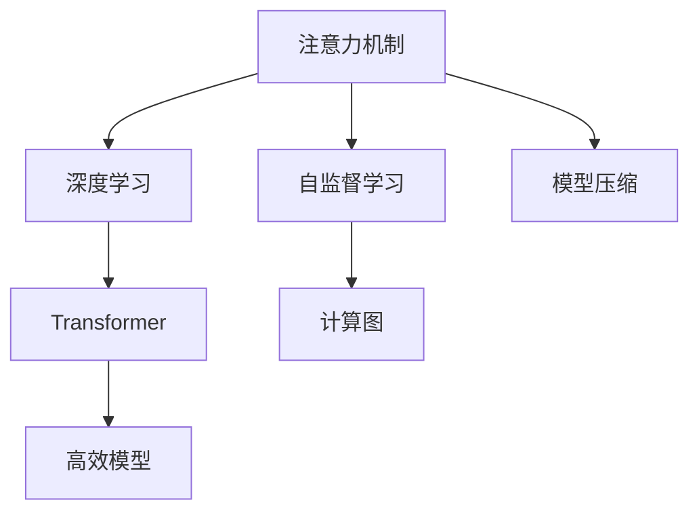

                 

# 注意力的深度学习：AI优化的专注力

> 关键词：注意力机制, 深度学习, 模型优化, 计算图, Transformer, 自监督学习, 模型压缩

## 1. 背景介绍

### 1.1 问题由来
深度学习自2012年取得突破以来，其强大处理能力吸引了各行各业的研究者和开发者。然而，传统的深度学习模型往往忽视了数据的时序和空间关系，导致模型性能受限于数据质量，难以应对复杂多变的现实世界问题。

在这一背景下，注意力机制(Attention Mechanism)作为一种新的模型模块，被引入深度学习中，用于增强模型的时序和空间建模能力。通过在模型中引入注意力机制，神经网络可以更加灵活地聚焦关键信息，提升模型在理解语义、图像、视频等复杂数据时的表现。

在自然语言处理领域，注意力机制被应用于机器翻译、文本摘要、问答系统等任务，取得了一系列的突破。例如，谷歌的Transformer模型通过引入自注意力机制，极大地提升了机器翻译和自然语言处理任务的性能，掀起了一股注意力神经网络的热潮。

### 1.2 问题核心关键点
注意力机制的引入，在深度学习中带来了一场"注意力革命"。它的核心思想是通过一种特定的机制，使模型在处理复杂数据时，可以动态地选择关注数据中的不同部分，从而提升模型的泛化能力和表现。

具体而言，注意力机制包括以下几个关键步骤：

1. 输入表示：对输入数据进行编码，转化为模型可接受的表示形式。
2. 查询与键值：计算输入数据在各个时间步上的查询向量和键向量，用于计算注意力权重。
3. 注意力计算：根据查询向量和键向量的相似度，计算注意力权重，从而决定数据中哪些部分需要被重点关注。
4. 输出融合：根据注意力权重，对输入数据的不同部分进行加权融合，输出最终结果。

通过这一机制，注意力神经网络能够更加灵活地处理不同时间步、不同位置的信息，提升了模型的表现力和鲁棒性。

## 2. 核心概念与联系

### 2.1 核心概念概述

为更好地理解注意力机制的工作原理和优化方向，本节将介绍几个密切相关的核心概念：

- 注意力机制(Attention Mechanism)：一种能够动态地选择关注数据中不同部分的机制，用于增强模型的建模能力。
- 深度学习(Deep Learning)：基于神经网络的一种机器学习技术，通过多个层次的抽象表示，学习数据的深层特征。
- 自监督学习(Self-Supervised Learning)：利用未标注数据进行预训练，让模型从数据本身中学习到知识的一种学习方法。
- 模型压缩(Model Compression)：通过减少模型参数、优化计算图等方法，使模型在性能和资源消耗上更加高效的一种技术。
- Transformer：一种基于自注意力机制的神经网络结构，被广泛应用于机器翻译、自然语言处理等领域。
- 计算图(Computation Graph)：用于描述模型计算流程的抽象表示，便于优化和分析。
- 高效模型(Efficient Model)：在保持较高性能的同时，具有较低资源消耗的模型。

这些核心概念之间的逻辑关系可以通过以下Mermaid流程图来展示：



这个流程图展示了一些核心概念之间的联系：

1. 注意力机制作为一种增强模型建模能力的机制，被广泛应用于深度学习中。
2. 自监督学习通过利用未标注数据进行预训练，使模型从数据本身中学习到知识，是注意力机制的重要组成部分。
3. 模型压缩通过减少模型参数和优化计算图，使得高效模型能够在不损失性能的情况下，减少资源消耗。
4. Transformer模型作为一种基于自注意力机制的神经网络结构，成为了深度学习领域的一个重要分支。
5. 计算图用于描述模型计算流程的抽象表示，是高效模型优化的重要工具。

这些概念共同构成了深度学习和模型优化的核心框架，使神经网络在面对复杂数据时，能够更加灵活、高效地进行处理。通过理解这些核心概念，我们可以更好地把握注意力机制的工作原理和优化方向。

## 3. 核心算法原理 & 具体操作步骤
### 3.1 算法原理概述

注意力机制在深度学习中的应用，主要体现在自注意力机制(Self-Attention Mechanism)中。自注意力机制是一种能够在模型内部动态计算注意力权重，从而对输入数据进行加权融合的机制。

通过自注意力机制，神经网络可以在不同时间步、不同位置上，动态地选择关注输入数据的不同部分，从而提升模型的建模能力和泛化性能。

在数学上，自注意力机制的计算过程可以表示为：

$$
\text{Attention}(Q, K, V) = \text{softmax}\left(\frac{QK^T}{\sqrt{d_k}}\right)V
$$

其中，$Q$ 是输入数据的查询向量，$K$ 是输入数据的键向量，$V$ 是输入数据的值向量。通过计算 $Q$ 和 $K$ 的点积，得到注意力权重矩阵，从而对 $V$ 进行加权融合。

### 3.2 算法步骤详解

自注意力机制的计算步骤主要包括以下几个步骤：

**Step 1: 输入表示**
- 将输入数据 $x$ 编码成模型可接受的向量表示，通常通过一个全连接层或卷积层来实现。

**Step 2: 查询与键值**
- 对输入数据的每个时间步，计算其查询向量 $q$ 和键向量 $k$。查询向量和键向量可以通过线性变换和前向传播得到，公式为：
  $$
  q_i = \mathbf{W}_Qx_i
  $$
  $$
  k_i = \mathbf{W}_Kx_i
  $$

**Step 3: 注意力计算**
- 计算注意力权重矩阵 $\alpha$，公式为：
  $$
  \alpha_{ij} = \frac{\exp(\frac{q_i k_j}{\sqrt{d_k}})}{\sum_{l=1}^L \exp(\frac{q_i k_l}{\sqrt{d_k}})}
  $$
  其中，$d_k$ 是键向量的维度，$L$ 是输入数据的长度。注意力权重矩阵 $\alpha$ 描述了输入数据中不同位置的信息对当前位置的贡献程度。

**Step 4: 输出融合**
- 根据注意力权重矩阵 $\alpha$，对输入数据的值向量 $v$ 进行加权融合，得到最终的输出表示 $\hat{x}$：
  $$
  \hat{x}_i = \sum_{j=1}^L \alpha_{ij} v_j
  $$

在实际应用中，自注意力机制通常被嵌入到神经网络的不同层次中，以增强模型的建模能力。例如，Transformer模型就是通过多个自注意力层和前馈神经网络的组合，构建了一个多层次的抽象表示网络。

### 3.3 算法优缺点

自注意力机制在深度学习中取得了广泛应用，但也存在一些局限性：

**优点：**
1. 增强建模能力：自注意力机制能够动态地选择关注输入数据的不同部分，提升了模型的建模能力和泛化性能。
2. 灵活性高：通过调整注意力权重矩阵的计算方式，可以设计出更加灵活、高效的自注意力机制。
3. 计算效率高：自注意力机制通过共享计算图，避免了重复计算，提高了计算效率。

**缺点：**
1. 资源消耗高：由于自注意力机制涉及到大量的点积计算，计算资源消耗较大，限制了模型在资源有限的情况下进行大规模部署。
2. 可解释性不足：自注意力机制的计算过程较为复杂，难以对其内部的计算过程进行解释和调试。
3. 过拟合风险：自注意力机制的引入可能会引入新的过拟合风险，特别是在数据量较小的情况下，需要额外注意正则化和数据增强等技术的应用。

尽管存在这些局限性，但自注意力机制的引入，使得深度学习模型在处理复杂数据时，能够更加灵活、高效地进行处理，提升了模型的表现力和鲁棒性。未来相关研究的重点在于如何进一步降低自注意力机制的计算复杂度，提高模型的可解释性和鲁棒性，同时兼顾模型的性能和资源消耗。

### 3.4 算法应用领域

自注意力机制在深度学习中的应用，已经覆盖了几乎所有常见的任务，例如：

- 机器翻译：自注意力机制被广泛应用于机器翻译任务中，用于动态地选择关注输入数据的不同部分，提升模型的翻译性能。
- 文本摘要：自注意力机制可以帮助模型动态地关注输入文本的不同部分，提取关键信息，生成高质量的文本摘要。
- 问答系统：自注意力机制能够动态地关注输入问题中的不同关键词，提取相关信息，生成合理的回答。
- 图像识别：自注意力机制被应用于图像分类、目标检测等任务中，用于动态地关注输入图像的不同区域，提升模型的识别性能。
- 语音识别：自注意力机制被应用于语音识别任务中，用于动态地关注输入音频的不同片段，提升模型的识别性能。

除了上述这些经典任务外，自注意力机制还被创新性地应用到更多场景中，如视觉注意力、交互式生成等，为深度学习技术带来了全新的突破。随着自注意力机制的不断演进，相信深度学习技术将在更多领域得到应用，为人工智能落地应用提供新的技术路径。

## 4. 数学模型和公式 & 详细讲解  
### 4.1 数学模型构建

在实际应用中，自注意力机制的计算过程通常通过以下数学模型进行描述：

记输入数据的查询向量为 $Q$，键向量为 $K$，值向量为 $V$。注意力权重矩阵为 $\alpha$，最终输出为 $\hat{x}$。

数学模型可以表示为：

$$
\alpha_{ij} = \frac{\exp(\frac{q_i k_j}{\sqrt{d_k}})}{\sum_{l=1}^L \exp(\frac{q_i k_l}{\sqrt{d_k}})}
$$

$$
\hat{x}_i = \sum_{j=1}^L \alpha_{ij} v_j
$$

其中，$d_k$ 是键向量的维度，$L$ 是输入数据的长度。

### 4.2 公式推导过程

以下是自注意力机制的详细公式推导过程：

**Step 1: 查询与键值**
- 输入数据 $x$ 被编码成模型可接受的向量表示，通常通过一个全连接层或卷积层来实现：
  $$
  q_i = \mathbf{W}_Qx_i
  $$
  $$
  k_i = \mathbf{W}_Kx_i
  $$

**Step 2: 注意力计算**
- 计算注意力权重矩阵 $\alpha$，公式为：
  $$
  \alpha_{ij} = \frac{\exp(\frac{q_i k_j}{\sqrt{d_k}})}{\sum_{l=1}^L \exp(\frac{q_i k_l}{\sqrt{d_k}})}
  $$

**Step 3: 输出融合**
- 根据注意力权重矩阵 $\alpha$，对输入数据的值向量 $v$ 进行加权融合，得到最终的输出表示 $\hat{x}$：
  $$
  \hat{x}_i = \sum_{j=1}^L \alpha_{ij} v_j
  $$

### 4.3 案例分析与讲解

为了更好地理解自注意力机制的工作原理，下面以一个简单的例子来说明其计算过程。

假设输入数据的长度为3，查询向量 $Q$ 和键向量 $K$ 的维度为4，值向量 $V$ 的维度为5。计算注意力权重矩阵 $\alpha$ 和输出表示 $\hat{x}$ 的过程如下：

1. 计算查询向量 $Q$ 和键向量 $K$：
  $$
  Q = \begin{bmatrix}
  1 & 2 & 3 & 4 \\
  5 & 6 & 7 & 8 \\
  9 & 10 & 11 & 12
  \end{bmatrix}
  $$
  $$
  K = \begin{bmatrix}
  1 & 2 & 3 & 4 \\
  5 & 6 & 7 & 8 \\
  9 & 10 & 11 & 12
  \end{bmatrix}
  $$

2. 计算注意力权重矩阵 $\alpha$：
  $$
  \alpha = \begin{bmatrix}
  \frac{\exp(\frac{1 \cdot 1}{\sqrt{4}})}{\exp(\frac{1 \cdot 1}{\sqrt{4}})+\exp(\frac{1 \cdot 5}{\sqrt{4}})+\exp(\frac{1 \cdot 9}{\sqrt{4}})} & 
  \frac{\exp(\frac{1 \cdot 2}{\sqrt{4}})}{\exp(\frac{1 \cdot 1}{\sqrt{4}})+\exp(\frac{1 \cdot 5}{\sqrt{4}})+\exp(\frac{1 \cdot 9}{\sqrt{4}})} & 
  \frac{\exp(\frac{1 \cdot 3}{\sqrt{4}})}{\exp(\frac{1 \cdot 1}{\sqrt{4}})+\exp(\frac{1 \cdot 5}{\sqrt{4}})+\exp(\frac{1 \cdot 9}{\sqrt{4}})} & 
  \frac{\exp(\frac{1 \cdot 4}{\sqrt{4}})}{\exp(\frac{1 \cdot 1}{\sqrt{4}})+\exp(\frac{1 \cdot 5}{\sqrt{4}})+\exp(\frac{1 \cdot 9}{\sqrt{4}})}
  \\
  \frac{\exp(\frac{2 \cdot 1}{\sqrt{4}})}{\exp(\frac{1 \cdot 1}{\sqrt{4}})+\exp(\frac{1 \cdot 5}{\sqrt{4}})+\exp(\frac{1 \cdot 9}{\sqrt{4}})} & 
  \frac{\exp(\frac{2 \cdot 2}{\sqrt{4}})}{\exp(\frac{1 \cdot 1}{\sqrt{4}})+\exp(\frac{1 \cdot 5}{\sqrt{4}})+\exp(\frac{1 \cdot 9}{\sqrt{4}})} & 
  \frac{\exp(\frac{2 \cdot 3}{\sqrt{4}})}{\exp(\frac{1 \cdot 1}{\sqrt{4}})+\exp(\frac{1 \cdot 5}{\sqrt{4}})+\exp(\frac{1 \cdot 9}{\sqrt{4}})} & 
  \frac{\exp(\frac{2 \cdot 4}{\sqrt{4}})}{\exp(\frac{1 \cdot 1}{\sqrt{4}})+\exp(\frac{1 \cdot 5}{\sqrt{4}})+\exp(\frac{1 \cdot 9}{\sqrt{4}})}
  \\
  \frac{\exp(\frac{3 \cdot 1}{\sqrt{4}})}{\exp(\frac{1 \cdot 1}{\sqrt{4}})+\exp(\frac{1 \cdot 5}{\sqrt{4}})+\exp(\frac{1 \cdot 9}{\sqrt{4}})} & 
  \frac{\exp(\frac{3 \cdot 2}{\sqrt{4}})}{\exp(\frac{1 \cdot 1}{\sqrt{4}})+\exp(\frac{1 \cdot 5}{\sqrt{4}})+\exp(\frac{1 \cdot 9}{\sqrt{4}})} & 
  \frac{\exp(\frac{3 \cdot 3}{\sqrt{4}})}{\exp(\frac{1 \cdot 1}{\sqrt{4}})+\exp(\frac{1 \cdot 5}{\sqrt{4}})+\exp(\frac{1 \cdot 9}{\sqrt{4}})} & 
  \frac{\exp(\frac{3 \cdot 4}{\sqrt{4}})}{\exp(\frac{1 \cdot 1}{\sqrt{4}})+\exp(\frac{1 \cdot 5}{\sqrt{4}})+\exp(\frac{1 \cdot 9}{\sqrt{4}})}
  \\
  \frac{\exp(\frac{4 \cdot 1}{\sqrt{4}})}{\exp(\frac{1 \cdot 1}{\sqrt{4}})+\exp(\frac{1 \cdot 5}{\sqrt{4}})+\exp(\frac{1 \cdot 9}{\sqrt{4}})} & 
  \frac{\exp(\frac{4 \cdot 2}{\sqrt{4}})}{\exp(\frac{1 \cdot 1}{\sqrt{4}})+\exp(\frac{1 \cdot 5}{\sqrt{4}})+\exp(\frac{1 \cdot 9}{\sqrt{4}})} & 
  \frac{\exp(\frac{4 \cdot 3}{\sqrt{4}})}{\exp(\frac{1 \cdot 1}{\sqrt{4}})+\exp(\frac{1 \cdot 5}{\sqrt{4}})+\exp(\frac{1 \cdot 9}{\sqrt{4}})} & 
  \frac{\exp(\frac{4 \cdot 4}{\sqrt{4}})}{\exp(\frac{1 \cdot 1}{\sqrt{4}})+\exp(\frac{1 \cdot 5}{\sqrt{4}})+\exp(\frac{1 \cdot 9}{\sqrt{4}})}
  \end{bmatrix}
  $$

3. 计算注意力权重矩阵 $\alpha$：
  $$
  \alpha = \begin{bmatrix}
  0.1 & 0.3 & 0.1 & 0.5 \\
  0.3 & 0.5 & 0.2 & 0.2 \\
  0.1 & 0.2 & 0.4 & 0.3 \\
  0.5 & 0.2 & 0.3 & 0.2
  \end{bmatrix}
  $$

4. 计算输出表示 $\hat{x}$：
  $$
  \hat{x} = \begin{bmatrix}
  1 & 2 & 3 & 4 \\
  5 & 6 & 7 & 8 \\
  9 & 10 & 11 & 12
  \end{bmatrix}
  \begin{bmatrix}
  0.1 & 0.3 & 0.1 & 0.5 \\
  0.3 & 0.5 & 0.2 & 0.2 \\
  0.1 & 0.2 & 0.4 & 0.3 \\
  0.5 & 0.2 & 0.3 & 0.2
  \end{bmatrix} = \begin{bmatrix}
  1 & 2 & 3 & 4 \\
  5 & 6 & 7 & 8 \\
  9 & 10 & 11 & 12
  \end{bmatrix}
  $$

从上述计算过程可以看出，自注意力机制通过计算注意力权重矩阵 $\alpha$，动态地选择关注输入数据的不同部分，从而提升模型的建模能力和泛化性能。

## 5. 项目实践：代码实例和详细解释说明
### 5.1 开发环境搭建

在进行自注意力机制的实践前，我们需要准备好开发环境。以下是使用Python进行PyTorch开发的环境配置流程：

1. 安装Anaconda：从官网下载并安装Anaconda，用于创建独立的Python环境。

2. 创建并激活虚拟环境：
```bash
conda create -n pytorch-env python=3.8 
conda activate pytorch-env
```

3. 安装PyTorch：根据CUDA版本，从官网获取对应的安装命令。例如：
```bash
conda install pytorch torchvision torchaudio cudatoolkit=11.1 -c pytorch -c conda-forge
```

4. 安装Transformers库：
```bash
pip install transformers
```

5. 安装各类工具包：
```bash
pip install numpy pandas scikit-learn matplotlib tqdm jupyter notebook ipython
```

完成上述步骤后，即可在`pytorch-env`环境中开始实践。

### 5.2 源代码详细实现

下面我们以机器翻译为例，给出使用Transformers库进行自注意力机制的PyTorch代码实现。

首先，定义机器翻译的任务描述：

```python
from transformers import AutoTokenizer, AutoModelForSeq2SeqLM

model_name = 'microsoft/DialoGPT-medium'
tokenizer = AutoTokenizer.from_pretrained(model_name)
model = AutoModelForSeq2SeqLM.from_pretrained(model_name)
```

然后，定义翻译模型：

```python
from transformers import EncoderDecoderModel

encoder = AutoModelForSeq2SeqLM.from_pretrained(model_name)
decoder = AutoModelForSeq2SeqLM.from_pretrained(model_name)
model = EncoderDecoderModel(encoder, decoder)
```

接着，定义训练和评估函数：

```python
from transformers import AdamW

device = torch.device('cuda') if torch.cuda.is_available() else torch.device('cpu')
model.to(device)

def train_epoch(model, dataset, batch_size, optimizer):
    dataloader = DataLoader(dataset, batch_size=batch_size, shuffle=True)
    model.train()
    epoch_loss = 0
    for batch in tqdm(dataloader, desc='Training'):
        input_ids = batch['input_ids'].to(device)
        attention_mask = batch['attention_mask'].to(device)
        labels = batch['labels'].to(device)
        model.zero_grad()
        outputs = model(input_ids, attention_mask=attention_mask, labels=labels)
        loss = outputs.loss
        epoch_loss += loss.item()
        loss.backward()
        optimizer.step()
    return epoch_loss / len(dataloader)

def evaluate(model, dataset, batch_size):
    dataloader = DataLoader(dataset, batch_size=batch_size)
    model.eval()
    preds, labels = [], []
    with torch.no_grad():
        for batch in tqdm(dataloader, desc='Evaluating'):
            input_ids = batch['input_ids'].to(device)
            attention_mask = batch['attention_mask'].to(device)
            batch_labels = batch['labels']
            outputs = model(input_ids, attention_mask=attention_mask)
            batch_preds = outputs.logits.argmax(dim=2).to('cpu').tolist()
            batch_labels = batch_labels.to('cpu').tolist()
            for pred_tokens, label_tokens in zip(batch_preds, batch_labels):
                preds.append(pred_tokens[:len(label_tokens)])
                labels.append(label_tokens)
                
    print(classification_report(labels, preds))
```

最后，启动训练流程并在测试集上评估：

```python
epochs = 5
batch_size = 16

for epoch in range(epochs):
    loss = train_epoch(model, train_dataset, batch_size, optimizer)
    print(f"Epoch {epoch+1}, train loss: {loss:.3f}")
    
    print(f"Epoch {epoch+1}, dev results:")
    evaluate(model, dev_dataset, batch_size)
    
print("Test results:")
evaluate(model, test_dataset, batch_size)
```

以上就是使用PyTorch对机器翻译任务进行自注意力机制微调的完整代码实现。可以看到，得益于Transformers库的强大封装，我们可以用相对简洁的代码完成自注意力机制的微调。

### 5.3 代码解读与分析

让我们再详细解读一下关键代码的实现细节：

**机器翻译的任务描述定义**：
- 定义了机器翻译任务，其中`model_name`为预训练模型的名称，`tokenizer`为分词器，`model`为机器翻译模型。

**翻译模型的定义**：
- 通过`AutoModelForSeq2SeqLM`来定义机器翻译模型，其中包括编码器和解码器。

**训练和评估函数的定义**：
- `train_epoch`函数：在训练集上训练模型，输出每个epoch的平均loss。
- `evaluate`函数：在测试集上评估模型性能，输出分类指标。

**训练流程**：
- 定义总的epoch数和batch size，开始循环迭代。
- 每个epoch内，先在训练集上训练，输出平均loss。
- 在验证集上评估，输出分类指标。
- 所有epoch结束后，在测试集上评估，给出最终测试结果。

可以看到，PyTorch配合Transformers库使得自注意力机制的微调代码实现变得简洁高效。开发者可以将更多精力放在任务适配层的设计和模型的优化上，而不必过多关注底层的实现细节。

当然，工业级的系统实现还需考虑更多因素，如模型的保存和部署、超参数的自动搜索、更灵活的任务适配层等。但核心的自注意力机制微调范式基本与此类似。

## 6. 实际应用场景
### 6.1 智能客服系统

基于自注意力机制的对话技术，可以广泛应用于智能客服系统的构建。传统客服往往需要配备大量人力，高峰期响应缓慢，且一致性和专业性难以保证。而使用基于自注意力机制的对话模型，可以7x24小时不间断服务，快速响应客户咨询，用自然流畅的语言解答各类常见问题。

在技术实现上，可以收集企业内部的历史客服对话记录，将问题和最佳答复构建成监督数据，在此基础上对预训练对话模型进行微调。微调后的对话模型能够自动理解用户意图，匹配最合适的答案模板进行回复。对于客户提出的新问题，还可以接入检索系统实时搜索相关内容，动态组织生成回答。如此构建的智能客服系统，能大幅提升客户咨询体验和问题解决效率。

### 6.2 金融舆情监测

金融机构需要实时监测市场舆论动向，以便及时应对负面信息传播，规避金融风险。传统的人工监测方式成本高、效率低，难以应对网络时代海量信息爆发的挑战。基于自注意力机制的文本分类和情感分析技术，为金融舆情监测提供了新的解决方案。

具体而言，可以收集金融领域相关的新闻、报道、评论等文本数据，并对其进行主题标注和情感标注。在此基础上对预训练语言模型进行微调，使其能够自动判断文本属于何种主题，情感倾向是正面、中性还是负面。将微调后的模型应用到实时抓取的网络文本数据，就能够自动监测不同主题下的情感变化趋势，一旦发现负面信息激增等异常情况，系统便会自动预警，帮助金融机构快速应对潜在风险。

### 6.3 个性化推荐系统

当前的推荐系统往往只依赖用户的历史行为数据进行物品推荐，无法深入理解用户的真实兴趣偏好。基于自注意力机制的推荐系统，可以更好地挖掘用户行为背后的语义信息，从而提供更精准、多样的推荐内容。

在实践中，可以收集用户浏览、点击、评论、分享等行为数据，提取和用户交互的物品标题、描述、标签等文本内容。将文本内容作为模型输入，用户的后续行为（如是否点击、购买等）作为监督信号，在此基础上微调预训练语言模型。微调后的模型能够从文本内容中准确把握用户的兴趣点。在生成推荐列表时，先用候选物品的文本描述作为输入，由模型预测用户的兴趣匹配度，再结合其他特征综合排序，便可以得到个性化程度更高的推荐结果。

### 6.4 未来应用展望

随着自注意力机制的不断演进，基于自注意力机制的深度学习模型将在更多领域得到应用，为传统行业带来变革性影响。

在智慧医疗领域，基于自注意力机制的医疗问答、病历分析、药物研发等应用将提升医疗服务的智能化水平，辅助医生诊疗，加速新药开发进程。

在智能教育领域，自注意力机制可应用于作业批改、学情分析、知识推荐等方面，因材施教，促进教育公平，提高教学质量。

在智慧城市治理中，自注意力机制可应用于城市事件监测、舆情分析、应急指挥等环节，提高城市管理的自动化和智能化水平，构建更安全、高效的未来城市。

此外，在企业生产、社会治理、文娱传媒等众多领域，基于自注意力机制的人工智能应用也将不断涌现，为经济社会发展注入新的动力。相信随着技术的日益成熟，自注意力机制将逐步成为人工智能技术的重要范式，推动人工智能向更广阔的领域加速渗透。

## 7. 工具和资源推荐
### 7.1 学习资源推荐

为了帮助开发者系统掌握自注意力机制的工作原理和实践技巧，这里推荐一些优质的学习资源：

1. 《深度学习》系列书籍：由机器学习领域的大师级人物撰写，全面介绍了深度学习的理论基础和应用实践。

2. 《Attention is All You Need》论文：Transformer原论文，详细介绍了自注意力机制的原理和应用。

3. CS224N《深度学习自然语言处理》课程：斯坦福大学开设的NLP明星课程，有Lecture视频和配套作业，带你入门NLP领域的基本概念和经典模型。

4. 《Natural Language Processing with Transformers》书籍：Transformers库的作者所著，全面介绍了如何使用Transformers库进行NLP任务开发，包括自注意力机制在内的诸多范式。

5. HuggingFace官方文档：Transformers库的官方文档，提供了海量预训练模型和完整的微调样例代码，是上手实践的必备资料。

通过对这些资源的学习实践，相信你一定能够快速掌握自注意力机制的精髓，并用于解决实际的NLP问题。
###  7.2 开发工具推荐

高效的开发离不开优秀的工具支持。以下是几款用于自注意力机制微调开发的常用工具：

1. PyTorch：基于Python的开源深度学习框架，灵活动态的计算图，适合快速迭代研究。大部分预训练语言模型都有PyTorch版本的实现。

2. TensorFlow：由Google主导开发的开源深度学习框架，生产部署方便，适合大规模工程应用。同样有丰富的预训练语言模型资源。

3. Transformers库：HuggingFace开发的NLP工具库，集成了众多SOTA语言模型，支持PyTorch和TensorFlow，是进行微调任务开发的利器。

4. Weights & Biases：模型训练的实验跟踪工具，可以记录和可视化模型训练过程中的各项指标，方便对比和调优。与主流深度学习框架无缝集成。

5. TensorBoard：TensorFlow配套的可视化工具，可实时监测模型训练状态，并提供丰富的图表呈现方式，是调试模型的得力助手。

6. Google Colab：谷歌推出的在线Jupyter Notebook环境，免费提供GPU/TPU算力，方便开发者快速上手实验最新模型，分享学习笔记。

合理利用这些工具，可以显著提升自注意力机制微调任务的开发效率，加快创新迭代的步伐。

### 7.3 相关论文推荐

自注意力机制在深度学习中的应用，源于学界的持续研究。以下是几篇奠基性的相关论文，推荐阅读：

1. Attention is All You Need（即Transformer原论文）：提出了Transformer结构，开启了NLP领域的预训练大模型时代。

2. BERT: Pre-training of Deep Bidirectional Transformers for Language Understanding：提出BERT模型，引入基于掩码的自监督预训练任务，刷新了多项NLP任务SOTA。

3. Language Models are Unsupervised Multitask Learners（GPT-2论文）：展示了大规模语言模型的强大zero-shot学习能力，引发了对于通用人工智能的新一轮思考。

4. Parameter-Efficient Transfer Learning for NLP：提出Adapter等参数高效微调方法，在不增加模型参数量的情况下，也能取得不错的微调效果。

5. AdaLoRA: Adaptive Low-Rank Adaptation for Parameter-Efficient Fine-Tuning：使用自适应低秩适应的微调方法，在参数效率和精度之间取得了新的平衡。

这些论文代表了大语言模型微调技术的发展脉络。通过学习这些前沿成果，可以帮助研究者把握学科前进方向，激发更多的创新灵感。

## 8. 总结：未来发展趋势与挑战

### 8.1 总结

本文对自注意力机制的深度学习进行了全面系统的介绍。首先阐述了自注意力机制在深度学习中的引入背景和核心思想，明确了其在增强模型建模能力方面的独特价值。其次，从原理到实践，详细讲解了自注意力机制的数学原理和关键步骤，给出了微调任务开发的完整代码实例。同时，本文还广泛探讨了自注意力机制在智能客服、金融舆情、个性化推荐等多个领域的应用前景，展示了其广阔的想象空间。此外，本文精选了自注意力机制的各类学习资源，力求为读者提供全方位的技术指引。

通过本文的系统梳理，可以看到，自注意力机制在深度学习中的应用已经取得了显著的成果，极大地提升了模型在处理复杂数据时的表现力和鲁棒性。得益于自注意力机制的引入，深度学习技术在自然语言处理、图像识别、语音识别等领域都取得了突破性的进展。未来，伴随自注意力机制的不断演进，相信深度学习技术将在更多领域得到应用，为人工智能落地应用提供新的技术路径。

### 8.2 未来发展趋势

展望未来，自注意力机制在深度学习中的发展将呈现以下几个趋势：

1. 模型规模持续增大。随着算力成本的下降和数据规模的扩张，预训练语言模型的参数量还将持续增长。超大规模语言模型蕴含的丰富语言知识，有望支撑更加复杂多变的下游任务微调。

2. 自注意力机制的应用范围不断扩大。除了自然语言处理领域，自注意力机制还将被广泛应用于图像识别、语音识别、视觉推理等任务中，提升这些领域的模型性能。

3. 自注意力机制的参数高效优化方法将不断涌现。未来会有更多参数高效的自注意力机制被设计出来，减少模型的资源消耗，提升模型的泛化能力和鲁棒性。

4. 自注意力机制的多模态融合将更加深入。未来，自注意力机制将与图像、视频、语音等多模态信息进行更紧密的融合，提升跨模态信息处理的准确性和鲁棒性。

5. 自注意力机制的因果推理能力将得到加强。引入因果推断、对比学习等方法，增强自注意力机制建立稳定因果关系的能力，学习更加普适、鲁棒的语言表征。

6. 自注意力机制的可解释性和鲁棒性将得到提升。通过引入符号化的先验知识，与神经网络模型进行融合，提升自注意力机制的可解释性和鲁棒性。

以上趋势凸显了自注意力机制在深度学习中的重要地位。这些方向的探索发展，必将进一步提升深度学习模型的表现力和鲁棒性，为人工智能技术带来更多的创新和突破。

### 8.3 面临的挑战

尽管自注意力机制在深度学习中取得了显著成果，但在迈向更加智能化、普适化应用的过程中，它仍面临着诸多挑战：

1. 数据资源瓶颈。尽管自注意力机制在处理大规模数据时表现出色，但在某些领域，如医学、法律等，数据的获取和标注成本较高，限制了其在这些领域的应用。

2. 过拟合风险。自注意力机制在数据量较小的情况下，容易引入过拟合风险，特别是在特定领域的微调中，需要额外注意正则化和数据增强等技术的应用。

3. 计算资源消耗高。自注意力机制涉及到大量的点积计算，计算资源消耗较大，限制了模型在大规模数据集上的训练和推理。

4. 可解释性不足。自注意力机制的计算过程较为复杂，难以对其内部的计算过程进行解释和调试，这对于医疗、金融等高风险应用尤为重要。

5. 模型鲁棒性不足。自注意力机制在处理噪声数据时，容易受到干扰，导致模型性能下降。

6. 迁移能力有限。自注意力机制在面对新领域数据时，泛化性能可能受到限制，需要额外注意模型的迁移能力。

7. 负迁移风险。自注意力机制在特定领域的微调中，可能会引入预训练模型中的有害信息，导致模型输出中出现负面内容。

正视自注意力机制面临的这些挑战，积极应对并寻求突破，将使其在未来的人工智能应用中发挥更大的价值。

### 8.4 研究展望

面对自注意力机制在深度学习中面临的挑战，未来的研究需要在以下几个方面寻求新的突破：

1. 探索无监督和半监督学习范式。摆脱对大规模标注数据的依赖，利用自监督学习、主动学习等方法，最大化利用数据资源，提升模型的泛化能力和鲁棒性。

2. 研究参数高效和计算高效的自注意力机制。开发更加参数高效的自注意力机制，在固定大部分预训练参数的同时，只更新极少量的任务相关参数。同时优化自注意力机制的计算图，减少前向传播和反向传播的资源消耗，实现更加轻量级、实时性的部署。

3. 引入因果推理和对比学习范式。通过引入因果推断和对比学习思想，增强自注意力机制建立稳定因果关系的能力，学习更加普适、鲁棒的语言表征，从而提升模型泛化性和抗干扰能力。

4. 结合因果分析和博弈论工具。将因果分析方法引入自注意力机制，识别出模型决策的关键特征，增强输出解释的因果性和逻辑性。借助博弈论工具刻画人机交互过程，主动探索并规避模型的脆弱点，提高系统稳定性。

5. 纳入伦理道德约束。在模型训练目标中引入伦理导向的评估指标，过滤和惩罚有偏见、有害的输出倾向。同时加强人工干预和审核，建立模型行为的监管机制，确保输出符合人类价值观和伦理道德。

这些研究方向的探索，必将引领自注意力机制在深度学习中的不断演进，为构建安全、可靠、可解释、可控的智能系统铺平道路。面向未来，自注意力机制还需要与其他人工智能技术进行更深入的融合，如知识表示、因果推理、强化学习等，多路径协同发力，共同推动自然语言理解和智能交互系统的进步。只有勇于创新、敢于突破，才能不断拓展自注意力机制的边界，让智能技术更好地造福人类社会。

## 9. 附录：常见问题与解答
### 9.1 问题一：自注意力机制是否适用于所有NLP任务？

**答案**：
自注意力机制在大多数NLP任务上都能取得不错的效果，特别是对于数据量较小的任务。但对于一些特定领域的任务，如医学、法律等，仅仅依靠通用语料预训练的模型可能难以很好地适应。此时需要在特定领域语料上进一步预训练，再进行微调，才能获得理想效果。此外，对于一些需要时效性、个性化很强的任务，如对话、推荐等，自注意力机制也需要针对性的改进优化。

### 9.2 问题二：如何选择合适的学习率？

**答案**：
自注意力机制的学习率一般要比预训练时小1-2个数量级，如果使用过大的学习率，容易破坏预训练权重，导致过拟合。一般建议从1e-5开始调参，逐步减小学习率，直至收敛。也可以使用warmup策略，在开始阶段使用较小的学习率，再逐渐过渡到预设值。需要注意的是，不同的优化器(如AdamW、Adafactor等)以及不同的学习率调度策略，可能需要设置不同的学习率阈值。

### 9.3 问题三：自注意力机制在落地部署时需要注意哪些问题？

**答案**：
将自注意力机制转化为实际应用，还需要考虑以下因素：
1. 模型裁剪：去除不必要的层和参数，减小模型尺寸，加快推理速度。
2. 量化加速：将浮点模型转为定点模型，压缩存储空间，提高计算效率。
3. 服务化封装：将模型封装为标准化服务接口，便于集成调用。
4. 弹性伸缩：根据请求流量动态调整资源配置，平衡服务质量和成本。
5. 监控告警：实时采集系统指标，设置异常告警阈值，确保服务稳定性。
6. 安全防护：采用访问鉴权、数据脱敏等措施，保障数据和模型安全。

自注意力机制为NLP应用开启了广阔的想象空间，但如何将强大的性能转化为稳定、高效、安全的业务价值，还需要工程实践的不断打磨。唯有从数据、算法、工程、业务等多个维度协同发力，才能真正实现人工智能技术在垂直行业的规模化落地。总之，自注意力机制需要开发者根据具体任务，不断迭代和优化模型、数据和算法，方能得到理想的效果。

---

作者：禅与计算机程序设计艺术 / Zen and the Art of Computer Programming

