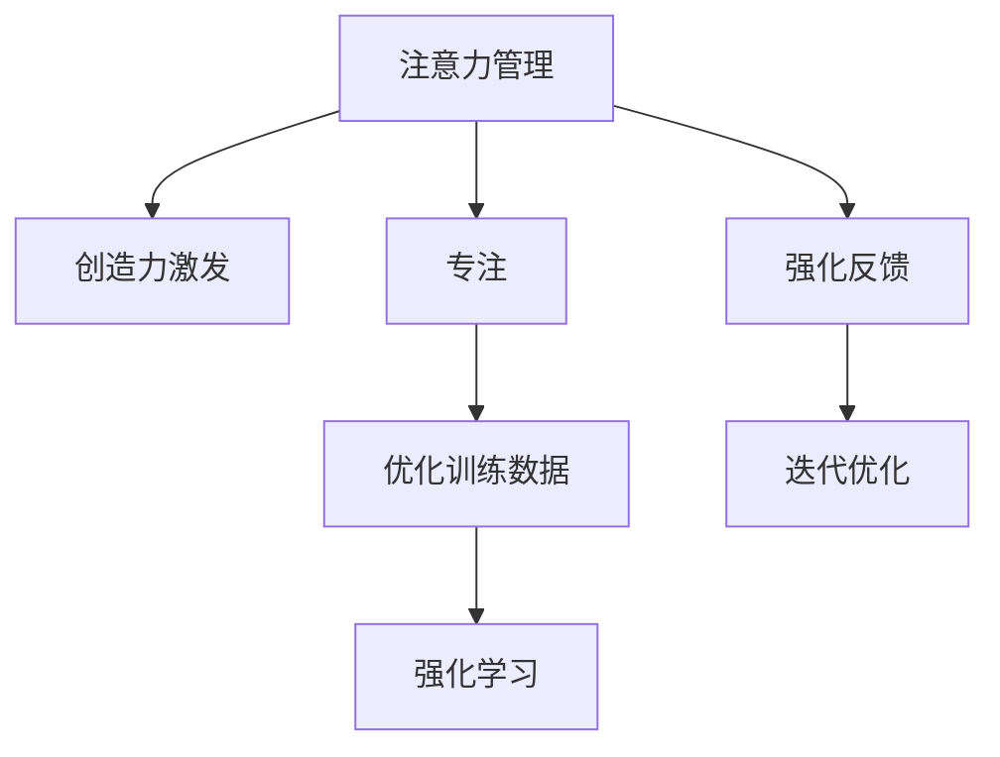

                 

## 1. 背景介绍

### 1.1 问题由来
在信息技术快速发展的今天，人工智能（AI）和机器学习（ML）已成为各个领域不可或缺的工具。然而，尽管AI和ML在效率和自动化方面有着显著优势，但它们在创造性、情感和灵活性方面仍存在局限。这些问题不仅阻碍了AI和ML在创新和适应性方面的发展，还限制了它们在复杂多变的人类情境中的有效应用。

### 1.2 问题核心关键点
创造力的本质在于结合新的想法、创新思维和灵感，而不仅仅是数据分析和逻辑推理。传统人工智能算法难以模仿这一过程，因为它们缺乏真正的人类创造力和直觉。为了克服这一限制，研究人员和从业者正在探索各种方法，以增强AI和ML在创造力、灵感和创新思维方面的能力。

### 1.3 问题研究意义
增强AI和ML的创造力和灵感能力，不仅能推动AI和ML技术本身的发展，还能促进其在更多领域的应用，如艺术创作、文学创作、游戏开发、音乐生成等。这将为人类提供更多的智能助手，帮助解决复杂问题，推动社会创新，提升生活质量。

## 2. 核心概念与联系

### 2.1 核心概念概述

为更好地理解如何通过注意力管理和创新思维激发来增强AI和ML的创造力，本节将介绍几个核心概念：

- **注意力管理**：在深度学习和人工智能中，注意力机制（Attention Mechanism）是一种能够动态聚焦输入数据中重要部分的机制。它通过学习不同输入部分的权重，对输入进行加权求和，从而更好地处理信息，提高模型的表达能力。

- **创造力激发**：指通过特定方法或技术，激发人工智能系统生成新的想法、创新的解决方案和独特的表达形式。其核心在于结合领域的知识、经验和直觉，引导系统进行非线性的思维跳跃和新颖的组合。

- **专注**：指在特定时间内，集中注意力于特定任务，以提高效率和质量。这不仅适用于人类，也适用于人工智能系统，通过在特定数据集或问题上进行训练，增强其对特定领域的理解。

- **头脑风暴**：指通过一系列创新思维活动，产生大量新的想法和解决方案。这种方法强调多样性和灵活性，不受既有框架的限制。

这些核心概念之间的逻辑关系可以通过以下Mermaid流程图来展示：



这个流程图展示了注意力管理、创造力激发和专注之间的关系，以及它们如何通过优化训练数据和强化反馈等方法，进一步迭代优化和增强AI和ML的创造力。

## 3. 核心算法原理 & 具体操作步骤
### 3.1 算法原理概述

注意力机制在深度学习和人工智能中起着关键作用。它通过动态地聚焦输入数据的重要部分，使得模型能够更好地处理复杂信息，提高预测和决策的准确性。在创造力激发方面，注意力机制可以帮助AI和ML系统更好地捕捉和利用输入数据中的关键信息，从而生成更具创新性和多样性的输出。

### 3.2 算法步骤详解

以下是基于注意力机制和创造力激发的AI和ML系统构建的一般步骤：

**Step 1: 选择或设计注意力模型**
- 根据任务需求，选择或设计适合的注意力模型。常见的注意力模型包括自注意力模型（如Transformer）和多头注意力模型。

**Step 2: 设计创造力激发模块**
- 在注意力模型的基础上，设计创造力激发模块。该模块可以通过引入创新思维活动、多样化输入、迭代优化等方法，激发AI和ML系统生成新的想法和解决方案。

**Step 3: 优化训练数据**
- 为了增强AI和ML系统的创造力，需要对训练数据进行优化。例如，可以引入多样化的数据、添加噪声、改变数据分布等。

**Step 4: 应用强化学习**
- 通过强化学习技术，引导AI和ML系统不断尝试新的解决方案，并通过反馈机制优化模型。

**Step 5: 迭代优化**
- 不断迭代优化注意力模型和创造力激发模块，以提高系统的表现和创造力。

### 3.3 算法优缺点

基于注意力机制和创造力激发的AI和ML系统具有以下优点：
1. 能够生成更具多样性和创新性的输出。
2. 可以处理复杂的输入数据，提高预测和决策的准确性。
3. 通过优化训练数据和应用强化学习，能够不断提升系统的表现。

同时，该方法也存在一定的局限性：
1. 需要大量的训练数据和计算资源。
2. 模型的创造力和灵感受限于输入数据的质量和多样性。
3. 系统的稳定性可能受到影响，特别是在处理极端数据时。

### 3.4 算法应用领域

注意力机制和创造力激发在多个领域都有广泛应用，如：

- 自然语言处理（NLP）：在机器翻译、文本生成、情感分析等任务中，通过注意力机制增强模型对输入文本的理解和处理能力。
- 计算机视觉（CV）：在图像分类、目标检测、图像生成等任务中，通过注意力机制提升模型对图像中关键部分的聚焦和处理。
- 游戏开发：在实时策略游戏、角色生成、情节设计等任务中，通过创造力激发模块生成新颖的策略和方案。
- 音乐生成：在音乐创作、风格转换、情感分析等任务中，通过创造力激发模块生成具有创新性的音乐作品。
- 艺术创作：在绘画、雕塑、设计等任务中，通过创造力激发模块生成独特的艺术作品。

## 4. 数学模型和公式 & 详细讲解  
### 4.1 数学模型构建

注意力机制的核心在于计算输入数据中每个部分的注意力权重。以多头注意力模型为例，其注意力权重由以下公式计算：

$$
\text{Attention}(Q, K, V) = \text{Softmax}\left(\frac{QK^T}{\sqrt{d_k}}\right)V
$$

其中，$Q$、$K$、$V$分别为查询、键和值矩阵，$d_k$为键的维度。该公式通过计算$Q$与$K$的点积，并除以$\sqrt{d_k}$，得到注意力权重矩阵，然后通过Softmax函数归一化，最后与$V$进行加权求和，得到最终的注意力输出。

### 4.2 公式推导过程

注意力机制的推导过程主要涉及矩阵运算和Softmax函数。通过将$Q$和$K$的点积除以$\sqrt{d_k}$，可以得到注意力权重矩阵$\text{Attention}(Q, K, V)$。然后通过Softmax函数对权重进行归一化，得到最终注意力输出：

$$
\text{Attention}(Q, K, V) = \frac{\exp(QK^T/\sqrt{d_k})}{\sum_{i=1}^n \exp(Q_iK_i^T/\sqrt{d_k})}V
$$

在实际应用中，通常通过矩阵乘法来计算点积和加权求和，以提高计算效率。

### 4.3 案例分析与讲解

以机器翻译任务为例，注意力机制可以帮助模型更好地处理输入的源语言句子，从而提高翻译的准确性和流畅性。具体而言，模型将源语言句子分成多个词汇单元，计算每个词汇单元与目标语言词汇之间的注意力权重，然后通过这些权重对源语言词汇进行加权求和，得到源语言句子的表示，再将其与目标语言词汇进行匹配，生成最终的翻译结果。

## 5. 项目实践：代码实例和详细解释说明
### 5.1 开发环境搭建

在进行注意力管理与创造力激发实践前，我们需要准备好开发环境。以下是使用Python进行TensorFlow开发的环境配置流程：

1. 安装Anaconda：从官网下载并安装Anaconda，用于创建独立的Python环境。

2. 创建并激活虚拟环境：
```bash
conda create -n tf-env python=3.8 
conda activate tf-env
```

3. 安装TensorFlow：根据CUDA版本，从官网获取对应的安装命令。例如：
```bash
conda install tensorflow -c conda-forge -c pytorch
```

4. 安装Keras：
```bash
conda install keras
```

5. 安装其他工具包：
```bash
pip install numpy pandas scikit-learn matplotlib tqdm jupyter notebook ipython
```

完成上述步骤后，即可在`tf-env`环境中开始实践。

### 5.2 源代码详细实现

下面我们以图像分类任务为例，给出使用TensorFlow和Keras对ResNet模型进行注意力增强的PyTorch代码实现。

```python
import tensorflow as tf
from tensorflow.keras.layers import Input, Conv2D, BatchNormalization, Activation, Flatten, Dense, Dropout
from tensorflow.keras.models import Model
from tensorflow.keras.applications.resnet50 import ResNet50
from tensorflow.keras.initializers import RandomNormal

# 定义输入层
inputs = Input(shape=(224, 224, 3))

# 加载预训练的ResNet模型
resnet = ResNet50(include_top=False, weights='imagenet', input_tensor=inputs)

# 添加自定义的注意力层
attention_output = attention_layer(resnet)

# 添加全连接层
x = Dense(1024, kernel_initializer=RandomNormal(stddev=0.01), activation='relu')(attention_output)
x = Dropout(0.5)(x)
outputs = Dense(1, activation='sigmoid')(x)

# 构建模型
model = Model(inputs=inputs, outputs=outputs)

# 编译模型
model.compile(optimizer='adam', loss='binary_crossentropy', metrics=['accuracy'])
```

然后，定义注意力层：

```python
def attention_layer(model):
    # 提取特征图
    features = model.get_layer('avg_pool').output

    # 添加卷积层
    attention = Conv2D(256, (1, 1), activation='relu')(features)

    # 添加注意力机制
    attention = Conv2D(1, (1, 1), activation='sigmoid')(attention)

    # 将注意力结果与特征图进行加权求和
    attention_output = attention * features

    return attention_output
```

最后，启动训练流程并在测试集上评估：

```python
# 训练模型
model.fit(train_data, train_labels, epochs=50, batch_size=32, validation_data=(val_data, val_labels))

# 评估模型
test_loss, test_acc = model.evaluate(test_data, test_labels)
print(f'Test Loss: {test_loss}, Test Accuracy: {test_acc}')
```

### 5.3 代码解读与分析

让我们再详细解读一下关键代码的实现细节：

**注意力层**：
- `attention_layer`函数：首先从预训练模型中提取特征图，然后添加一个卷积层来计算注意力权重，最后通过Sigmoid激活函数输出注意力结果。

**模型构建**：
- 定义输入层和输出层，并连接中间的多层全连接层和Dropout层，最终添加一个Sigmoid激活函数，用于二分类任务。

**模型训练**：
- 使用TensorFlow和Keras的高级API进行模型训练，设置优化器、损失函数和评估指标，并使用数据集进行训练和验证。

可以看到，通过TensorFlow和Keras的API，我们能够非常方便地实现注意力机制和创造力激发模块，以增强AI和ML系统的表现。

## 6. 实际应用场景
### 6.1 图像分类

在图像分类任务中，注意力机制可以帮助模型更好地聚焦于输入图像的关键部分，从而提高分类准确性。例如，在医疗影像诊断中，模型可以学会关注肿瘤、病变区域等关键部分，从而更准确地诊断疾病。

### 6.2 自然语言处理

在自然语言处理任务中，注意力机制可以帮助模型更好地理解句子结构、语法关系和语义信息，从而提高翻译、摘要和问答等任务的性能。例如，在机器翻译任务中，模型可以关注输入句子的重要词汇，从而更准确地进行翻译。

### 6.3 游戏设计

在游戏设计中，创造力激发模块可以帮助生成新的游戏策略和方案。例如，在实时策略游戏中，模型可以生成创新的战术和策略，提升游戏难度和趣味性。

### 6.4 音乐创作

在音乐创作中，创造力激发模块可以帮助生成新颖的旋律和节奏。例如，在音乐生成任务中，模型可以生成具有独特风格的音乐作品，为听众带来新的听觉体验。

### 6.5 艺术创作

在艺术创作中，创造力激发模块可以帮助生成独特的艺术作品。例如，在绘画和设计任务中，模型可以生成具有创新性的艺术作品，为艺术家提供灵感和参考。

## 7. 工具和资源推荐
### 7.1 学习资源推荐

为了帮助开发者系统掌握注意力管理和创造力激发的理论基础和实践技巧，这里推荐一些优质的学习资源：

1. 《深度学习》系列书籍：由深度学习领域权威专家撰写，涵盖了注意力机制、创造力激发等核心概念和前沿技术。

2. Coursera《深度学习专项课程》：斯坦福大学、密歇根大学等顶级学府开设的深度学习课程，内容涵盖注意力机制、强化学习、创造力激发等主题。

3. 《神经网络与深度学习》书籍：Yoshua Bengio等深度学习专家所著，全面介绍了神经网络、注意力机制等前沿技术。

4. arXiv、IEEE Xplore等学术资源：最新研究成果的发表平台，可以获取到前沿论文和技术报告。

5. Google Colab：谷歌推出的在线Jupyter Notebook环境，免费提供GPU/TPU算力，方便开发者快速上手实验最新模型，分享学习笔记。

通过对这些资源的学习实践，相信你一定能够快速掌握注意力管理与创造力激发的精髓，并用于解决实际的AI和ML问题。
###  7.2 开发工具推荐

高效的开发离不开优秀的工具支持。以下是几款用于注意力管理和创造力激发开发的常用工具：

1. TensorFlow：由Google主导开发的开源深度学习框架，生产部署方便，适合大规模工程应用。同样有丰富的预训练语言模型资源。

2. Keras：基于TensorFlow的高级API，提供简单易用的界面，适合快速迭代研究。

3. PyTorch：基于Python的开源深度学习框架，灵活动态的计算图，适合快速迭代研究。大部分预训练语言模型都有PyTorch版本的实现。

4. Weights & Biases：模型训练的实验跟踪工具，可以记录和可视化模型训练过程中的各项指标，方便对比和调优。与主流深度学习框架无缝集成。

5. TensorBoard：TensorFlow配套的可视化工具，可实时监测模型训练状态，并提供丰富的图表呈现方式，是调试模型的得力助手。

6. Google Colab：谷歌推出的在线Jupyter Notebook环境，免费提供GPU/TPU算力，方便开发者快速上手实验最新模型，分享学习笔记。

合理利用这些工具，可以显著提升注意力管理和创造力激发任务的开发效率，加快创新迭代的步伐。

### 7.3 相关论文推荐

注意力机制和创造力激发的研究源于学界的持续研究。以下是几篇奠基性的相关论文，推荐阅读：

1. Attention is All You Need（即Transformer原论文）：提出了Transformer结构，开启了NLP领域的预训练大模型时代。

2. Improving Language Understanding by Generative Pre-training（BERT论文）：提出BERT模型，引入基于掩码的自监督预训练任务，刷新了多项NLP任务SOTA。

3. Generative Adversarial Text to Image Synthesis（GAN论文）：提出GAN模型，可以生成高质量的图像数据，为AI和ML系统提供了丰富的训练样本。

4. Few-shot Learning with Adaptive Data Augmentation（Few-shot学习论文）：提出基于自适应数据增强的方法，通过生成多样化的训练样本，提升模型在少样本条件下的性能。

5. Creativity in AI: Towards Artificial Generative Intelligence（人工智能创造力论文）：探讨如何通过创新思维活动，激发AI和ML系统的创造力和灵感。

这些论文代表了大语言模型微调技术的发展脉络。通过学习这些前沿成果，可以帮助研究者把握学科前进方向，激发更多的创新灵感。

## 8. 总结：未来发展趋势与挑战
### 8.1 总结

本文对基于注意力机制和创造力激发的AI和ML系统进行了全面系统的介绍。首先阐述了注意力机制和创造力激发的研究背景和意义，明确了它们在提升AI和ML系统表现方面的独特价值。其次，从原理到实践，详细讲解了注意力机制和创造力激发的数学原理和关键步骤，给出了注意力管理与创造力激发的完整代码实例。同时，本文还广泛探讨了注意力管理与创造力激发的应用场景，展示了其在图像分类、自然语言处理、游戏设计、音乐创作、艺术创作等多个领域的应用前景。此外，本文精选了注意力管理和创造力激发的各类学习资源，力求为读者提供全方位的技术指引。

通过本文的系统梳理，可以看到，注意力管理与创造力激发技术正在成为AI和ML系统的重要组成部分，极大地提升了AI和ML系统在多样性、创新性和灵活性方面的能力。未来，伴随注意力管理和创造力激发技术的不断发展，相信AI和ML系统将在更多领域发挥更大的作用，为人类社会带来更多创新和价值。

### 8.2 未来发展趋势

展望未来，注意力管理和创造力激发技术将呈现以下几个发展趋势：

1. 模型规模和复杂度进一步提升。随着算力成本的下降和数据规模的扩张，注意力管理与创造力激发模型的规模和复杂度还将持续增长。这将使得模型能够处理更加复杂和多样化的输入数据，提升系统的表现。

2. 创新思维活动进一步丰富。未来的模型将结合更多的创新思维活动，如生成对抗网络（GAN）、对抗性训练、多模态学习等，生成更加多样化和创新性的输出。

3. 模型训练和优化技术进一步提升。未来的模型训练将结合更多优化技术，如自适应学习率、变分自编码器、强化学习等，提升模型的训练效率和表现。

4. 模型应用场景进一步扩展。随着技术的发展，注意力管理和创造力激发的应用场景将进一步扩展，如医疗影像诊断、游戏设计、音乐创作、艺术创作等。

5. 跨领域融合进一步加强。未来的模型将结合更多领域的知识和技术，如知识图谱、符号逻辑、因果推理等，提升模型的综合能力和表现。

以上趋势凸显了注意力管理和创造力激发技术的广阔前景。这些方向的探索发展，必将进一步提升AI和ML系统的表现和应用范围，为人类社会带来更多创新和价值。

### 8.3 面临的挑战

尽管注意力管理和创造力激发技术已经取得了显著成就，但在迈向更加智能化、普适化应用的过程中，它仍面临诸多挑战：

1. 模型训练成本高。尽管注意力管理和创造力激发技术能够显著提升模型表现，但其训练过程仍然需要大量的计算资源和训练样本。如何降低训练成本，提高训练效率，是一个亟待解决的问题。

2. 模型的稳定性和鲁棒性不足。在处理极端数据和复杂任务时，模型的表现往往不稳定，容易发生灾难性遗忘或过拟合。如何提高模型的鲁棒性和稳定性，需要更多的研究和实践。

3. 模型的可解释性和透明性不足。模型生成的输出通常缺乏可解释性，难以理解其决策过程。如何在保证模型表现的同时，提高其可解释性和透明性，是未来的一个重要研究方向。

4. 模型的伦理和安全问题。模型在生成输出时，可能会产生有害或误导性信息，带来伦理和安全问题。如何在设计模型时，考虑伦理和安全的因素，确保模型输出的正确性和安全性，是一个重要的课题。

5. 模型的普适性和多样性不足。当前的模型往往局限于特定的领域和任务，难以处理多领域和多模态数据。如何提高模型的普适性和多样性，是未来的一个重要研究方向。

正视这些挑战，积极应对并寻求突破，将是大语言模型微调技术走向成熟的必由之路。相信随着学界和产业界的共同努力，这些挑战终将一一被克服，AI和ML系统必将在构建人机协同的智能时代中扮演越来越重要的角色。

### 8.4 研究展望

面对注意力管理和创造力激发技术所面临的挑战，未来的研究需要在以下几个方面寻求新的突破：

1. 探索更加高效和自适应的训练方法。开发更加高效和自适应的训练方法，如自适应学习率、变分自编码器、强化学习等，提升模型的训练效率和表现。

2. 引入更多创新思维活动。引入更多创新思维活动，如生成对抗网络（GAN）、对抗性训练、多模态学习等，生成更加多样化和创新性的输出。

3. 融合更多领域的知识和技术。融合更多领域的知识和技术，如知识图谱、符号逻辑、因果推理等，提升模型的综合能力和表现。

4. 开发更加鲁棒和稳定的模型。开发更加鲁棒和稳定的模型，通过正则化、对抗训练等方法，提高模型的鲁棒性和稳定性。

5. 提高模型的可解释性和透明性。提高模型的可解释性和透明性，通过可解释性技术、可视化工具等，增强模型的可解释性和透明性。

6. 加强伦理和安全研究。加强伦理和安全研究，在模型设计中考虑伦理和安全的因素，确保模型输出的正确性和安全性。

这些研究方向的探索，必将引领注意力管理和创造力激发技术迈向更高的台阶，为构建安全、可靠、可解释、可控的智能系统铺平道路。面向未来，AI和ML技术还需要与其他人工智能技术进行更深入的融合，如知识表示、因果推理、强化学习等，多路径协同发力，共同推动自然语言理解和智能交互系统的进步。只有勇于创新、敢于突破，才能不断拓展AI和ML系统的边界，让智能技术更好地造福人类社会。

## 9. 附录：常见问题与解答

**Q1：注意力机制和创造力激发是否适用于所有NLP任务？**

A: 注意力机制和创造力激发的核心在于动态聚焦输入数据的关键部分，生成更具多样性和创新性的输出。这一机制在大多数NLP任务上都能取得不错的效果，特别是对于数据量较小的任务。但对于一些特定领域的任务，如医学、法律等，仅仅依靠通用语料预训练的模型可能难以很好地适应。此时需要在特定领域语料上进一步预训练，再进行微调，才能获得理想效果。此外，对于一些需要时效性、个性化很强的任务，如对话、推荐等，注意力机制和创造力激发方法也需要针对性的改进优化。

**Q2：注意力机制和创造力激发的计算成本如何？**

A: 注意力机制和创造力激发的计算成本较高，尤其是在大规模数据集和复杂模型上。这是因为注意力机制需要计算每个输入数据的注意力权重，并对其进行处理，而计算权重的复杂度随着输入维度的增加而增加。同时，创造力激发模块通常需要更多的计算资源，以生成多样化的输出。因此，在实际应用中，需要考虑计算资源的限制，合理选择模型规模和复杂度。

**Q3：注意力机制和创造力激发的稳定性和鲁棒性如何？**

A: 注意力机制和创造力激发的稳定性可能受到影响，特别是在处理极端数据时。模型的表现可能不稳定，容易发生灾难性遗忘或过拟合。为了提高模型的稳定性和鲁棒性，需要结合更多的正则化技术，如Dropout、L2正则等，并在训练过程中引入对抗样本和对抗训练。此外，可以通过引入多样化的数据和创新思维活动，增强模型的多样性和鲁棒性。

**Q4：注意力机制和创造力激发如何提高模型的可解释性？**

A: 提高模型的可解释性是当前研究的一个重要方向。注意力机制和创造力激发可以通过可解释性技术，如可视化工具、解释性层、归因分析等，增强模型的可解释性和透明性。例如，通过可视化注意力权重，可以理解模型对输入数据的关注点，从而更好地解释模型的决策过程。

**Q5：注意力机制和创造力激发如何应用于多领域融合？**

A: 注意力机制和创造力激发可以应用于多领域融合，提升模型的综合能力和表现。例如，在医疗影像诊断中，可以将注意力机制应用于图像特征提取，从而更好地处理图像中的关键信息。在金融数据分析中，可以将创造力激发模块应用于特征生成和模型优化，生成更加多样化和创新性的特征表示，从而提高模型的预测精度和泛化能力。

总之，注意力管理和创造力激发技术为AI和ML系统带来了更多的创新和可能性。通过不断优化和改进这些技术，未来将在更多领域得到应用，为人类社会带来更多的创新和价值。

