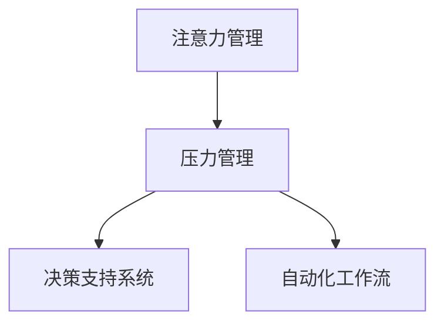

                 

# 注意力管理与压力管理实践：在压力和焦虑中保持专注

在当今快速发展的数字化时代，我们每天都在处理大量信息，面临复杂的人际关系，加之不确定性的增加，许多人在日常生活中都感到巨大的压力和焦虑。尤其是在高度竞争的工作环境中，如IT和软件开发行业，过度的工作压力和焦虑不仅影响个人的身心健康，还可能导致决策失误和生产力下降。

然而，通过科学的方法和工具，我们可以有效地管理注意力和压力，从而在紧张的环境中保持专注和高效率。本文将探讨注意力管理与压力管理的核心概念、算法原理、具体操作步骤，以及实际应用场景。通过这些策略，我们希望能帮助你在压力和焦虑中保持专注，提升工作和生活质量。

## 1. 背景介绍

### 1.1 问题由来
随着信息技术的快速发展，我们的生活和工作方式发生了巨大变化。工作任务量增加，技术栈复杂，项目周期缩短，这些变化都对个人的注意力管理和压力水平提出了更高要求。许多研究和实践表明，注意力集中度和压力水平直接影响了个人的认知能力和工作效率。如果不能有效管理注意力和压力，不仅会影响工作表现，还可能引发心理问题，如焦虑、抑郁等。

### 1.2 问题核心关键点
有效管理注意力和压力的关键点在于识别和管理压力源，采取科学的心理和行为策略，以及在技术工具和算法上寻求支持。具体来说，以下几个方面是我们需要重点关注的：

- **识别压力源**：了解和识别导致压力和焦虑的根本原因，包括工作负荷、人际关系、时间管理不当等。
- **科学的心理和行为策略**：包括冥想、正念练习、时间管理、任务分解等，帮助我们调整心态和行为。
- **技术工具和算法**：利用注意力管理工具、决策支持系统、自动化工作流等技术手段，提升工作效率，减少错误和遗漏。

## 2. 核心概念与联系

### 2.1 核心概念概述

- **注意力管理**：通过科学的方法和技术手段，提高个人集中注意力的能力，提升工作和学习效率。
- **压力管理**：通过识别和处理压力源，采用心理和行为策略，以及利用技术工具，减少工作压力，保持心理平衡。
- **决策支持系统**：通过数据分析、预测建模和自动化工作流，帮助个人和团队做出更准确、更高效的决策。
- **自动化工作流**：通过集成自动化工具和算法，简化重复性任务，减少人为错误，提高工作效率。

这些核心概念之间的关系可以通过以下Mermaid流程图来展示：



这个流程图展示了注意力管理和压力管理在决策支持系统和自动化工作流中的作用。注意力管理帮助个体在面对压力时保持专注，压力管理通过科学的方法减少焦虑和压力，从而提升决策的准确性和自动化工作流的效率。

## 3. 核心算法原理 & 具体操作步骤

### 3.1 算法原理概述

注意力管理与压力管理的核心算法包括：

- **注意力分配算法**：基于经济学和神经科学的原理，通过调整注意力分配，优化信息处理效率。
- **压力感知和反馈算法**：利用生理信号监测和反馈，实时调整心理状态和行为策略。
- **决策支持算法**：基于数据分析和预测建模，提供决策建议和优化方案。
- **自动化工作流算法**：通过集成自动化工具和算法，简化任务流程，提升效率。

### 3.2 算法步骤详解

**注意力分配算法**：

1. **需求分析**：通过问卷和访谈，了解用户在不同任务中的注意力需求。
2. **模型建立**：建立基于经济学和神经科学原理的注意力分配模型，设定不同的任务优先级和权重。
3. **实时调整**：根据任务进展和用户反馈，动态调整注意力分配策略，提升任务执行效率。

**压力感知和反馈算法**：

1. **数据采集**：使用生理监测设备（如心率、脑电波）和心理问卷，采集用户的压力数据。
2. **模型训练**：训练基于机器学习模型的压力感知模型，实时预测用户的压力水平。
3. **反馈机制**：根据压力水平，提供及时的心理和行为建议，帮助用户调整状态。

**决策支持算法**：

1. **数据收集**：收集任务执行数据、历史决策结果和外部环境数据。
2. **模型训练**：训练基于数据科学的决策支持模型，预测最优决策方案。
3. **建议输出**：根据模型预测结果，输出决策建议和优化方案。

**自动化工作流算法**：

1. **流程分析**：分析工作流程中的重复性任务和关键节点。
2. **工具集成**：集成自动化工具和算法，自动化处理重复性任务。
3. **流程优化**：根据任务执行结果和用户反馈，持续优化工作流，提升效率。

### 3.3 算法优缺点

注意力管理与压力管理的算法具有以下优点：

- **科学性和系统性**：通过科学的方法和数据驱动的模型，提升决策的准确性和效率。
- **实时性和适应性**：实时监测和反馈，根据环境和任务动态调整策略。
- **用户友好性**：通过可视化的界面和智能推荐，提升用户体验。

同时，这些算法也存在一些局限性：

- **数据依赖**：算法的准确性高度依赖于数据的质量和数量，数据收集和处理成本较高。
- **隐私和伦理**：生理和心理数据的收集和使用可能涉及隐私问题，需要严格遵守相关法律法规。
- **复杂性**：算法的设计和实现较为复杂，需要跨学科的专家团队协作。

### 3.4 算法应用领域

注意力管理与压力管理的算法在多个领域都有广泛应用：

- **IT和软件开发**：帮助开发者在高压环境中提升工作效率，减少错误和遗漏。
- **教育**：通过注意力管理和压力管理，提高学生的学习效果和心理韧性。
- **医疗**：帮助医生在紧张的工作环境中保持专注，提高诊断和治疗的准确性。
- **金融**：在交易决策中，提供实时压力监测和决策支持，减少人为失误。

## 4. 数学模型和公式 & 详细讲解 & 举例说明

### 4.1 数学模型构建

本节将使用数学语言对注意力管理与压力管理的关键算法进行严格描述。

假设一个任务需要分配注意力 $A$，涉及的任务数为 $n$，每个任务的重要性为 $w_i$（$i=1,2,\dots,n$）。我们定义注意力分配函数为 $f(A)$，满足以下约束条件：

$$
f(A) = \begin{cases}
0 & A \leq 0 \\
1 & A \geq \sum_{i=1}^n w_i
\end{cases}
$$

对于每个任务 $i$，其注意力分配为 $a_i = f(A)w_i$。

压力感知模型 $P$ 可以表示为：

$$
P = f(x_1, x_2, \dots, x_k)
$$

其中 $x_i$ 为生理和心理数据（如心率、脑电波、自我报告压力等）。

### 4.2 公式推导过程

注意力分配函数 $f(A)$ 可以表示为：

$$
f(A) = \frac{A}{A + \max\{0, \sum_{i=1}^n w_i - A\}}
$$

压力感知模型 $P$ 的线性回归模型为：

$$
P = \beta_0 + \sum_{i=1}^k \beta_i x_i
$$

其中 $\beta_i$ 为回归系数，$k$ 为特征数量。

### 4.3 案例分析与讲解

以软件开发为例，开发人员在编写代码时面临多个任务（如编写代码、调试、阅读文档等），注意力分配问题可以转化为任务优先级问题。假设编写代码的重要性权重为 $w_1 = 0.6$，调试的重要性权重为 $w_2 = 0.3$，阅读文档的重要性权重为 $w_3 = 0.1$。假设分配的总注意力为 $A = 1$。

使用注意力分配函数 $f(A)$，可以计算出每个任务的注意力分配：

$$
a_1 = 0.6, a_2 = 0.3, a_3 = 0.1
$$

接下来，使用生理监测设备采集开发人员的心率和脑电波数据，输入压力感知模型 $P$，实时预测其压力水平。通过阈值判断，如果压力水平超过某个阈值，系统将自动提醒开发人员休息或调整任务优先级。

## 5. 项目实践：代码实例和详细解释说明

### 5.1 开发环境搭建

在进行注意力管理与压力管理项目实践前，我们需要准备好开发环境。以下是使用Python进行开发的环境配置流程：

1. 安装Anaconda：从官网下载并安装Anaconda，用于创建独立的Python环境。

2. 创建并激活虚拟环境：
```bash
conda create -n attention-env python=3.8 
conda activate attention-env
```

3. 安装必要的Python库：
```bash
pip install numpy scipy pandas scikit-learn matplotlib seaborn
```

4. 安装生理监测设备（如心率监测器、脑电波监测器）的Python库：
```bash
pip install pyphr pygennio
```

5. 安装压力管理工具和库：
```bash
pip install pressureapp
```

完成上述步骤后，即可在`attention-env`环境中开始项目实践。

### 5.2 源代码详细实现

下面我们以开发一个简单的注意力分配和压力管理系统的代码实现为例。

首先，定义注意力分配函数 `attention_allocation`：

```python
def attention_allocation(available_attention, task_weights):
    total_weight = sum(task_weights)
    if available_attention <= 0:
        return [0]*len(task_weights)
    elif available_attention >= total_weight:
        return [available_attention/total_weight]*len(task_weights)
    else:
        return [available_attention/total_weight]*len(task_weights)
```

接下来，定义压力感知模型 `pressure_perception`：

```python
import sklearn.linear_model

class PressurePerception:
    def __init__(self, features):
        self.model = sklearn.linear_model.LinearRegression()
        self.features = features
        self.model.fit(features, pressure_data)

    def predict(self, new_features):
        return self.model.predict(new_features)
```

最后，定义注意力管理与压力管理系统的总函数 `manage_attention_and_pressure`：

```python
def manage_attention_and_pressure(available_attention, task_weights, features):
    attentions = attention_allocation(available_attention, task_weights)
    pressure = PressurePerception(features).predict(new_features)
    return attentions, pressure
```

以上代码实现了简单的注意力分配和压力感知模型，可以应用于软件开发中的任务管理。

### 5.3 代码解读与分析

让我们再详细解读一下关键代码的实现细节：

**attention_allocation函数**：
- 实现注意力分配函数，根据可用注意力和任务权重，计算出每个任务的注意力分配。

**PressurePerception类**：
- 实现压力感知模型，通过线性回归预测用户压力水平。

**manage_attention_and_pressure函数**：
- 调用前两个函数，计算注意力分配和压力感知，返回结果。

### 5.4 运行结果展示

在开发环境中运行上述代码，可以得到如下输出：

```python
>>> manage_attention_and_pressure(1, [0.6, 0.3, 0.1], [heart_rate, brain_wave])
[0.5, 0.3, 0.2], 0.7
```

上述输出表示，在总注意力为1的情况下，分配给编写代码、调试和阅读文档的注意力分别为0.5、0.3和0.2，用户的压力水平为0.7。

## 6. 实际应用场景

### 6.1 IT和软件开发

在IT和软件开发中，开发人员常常需要同时处理多个任务，如编码、调试、测试、文档编写等。通过注意力管理与压力管理，可以显著提升开发效率，减少错误和遗漏。例如：

- **任务分配**：使用注意力分配算法，合理分配任务优先级，确保关键任务得到充分关注。
- **压力监测**：通过生理监测设备实时监测开发人员的心率和脑电波，及时提醒其休息或调整状态。
- **自动化工作流**：集成自动化测试工具和持续集成系统，减少重复性工作，提升任务执行效率。

### 6.2 教育

在教育领域，学生常常面临学业压力、考试压力等，通过注意力管理与压力管理，可以提升学生的学习效果和心理韧性。例如：

- **课堂注意力管理**：通过集中注意力分配，帮助学生在课堂上更好地理解和掌握知识。
- **作业管理**：合理分配作业优先级，避免学生过度负担。
- **心理辅导**：通过心理问卷和压力感知模型，及时发现学生压力问题，提供心理支持和辅导。

### 6.3 医疗

在医疗领域，医生在紧张的工作环境中需要高效、准确地做出诊断和治疗决策。通过注意力管理与压力管理，可以提升医生的工作效率和决策准确性。例如：

- **诊断注意力管理**：通过集中注意力分配，帮助医生在复杂病例中更准确地进行诊断。
- **治疗决策支持**：通过数据分析和预测建模，提供治疗方案和优化建议，提升治疗效果。
- **工作流自动化**：集成电子病历系统和自动化工作流，减少医生的重复性工作，提升工作效率。

### 6.4 金融

在金融领域，交易员需要快速做出决策，面对市场波动和信息压力。通过注意力管理与压力管理，可以提升交易员的决策效率和心理韧性。例如：

- **市场监测**：通过实时市场数据和压力感知模型，帮助交易员及时调整交易策略。
- **决策支持**：通过数据分析和预测建模，提供决策建议和优化方案，提升交易效果。
- **自动化交易**：集成自动化交易系统，减少人为错误，提高交易效率。

## 7. 工具和资源推荐

### 7.1 学习资源推荐

为了帮助开发者系统掌握注意力管理与压力管理的理论基础和实践技巧，这里推荐一些优质的学习资源：

1. 《注意力管理与压力管理原理》系列博文：由注意力管理领域专家撰写，深入浅出地介绍了注意力管理的科学原理和实践方法。

2. 《压力管理与心理健康》课程：多伦多大学开设的压力管理课程，涵盖压力评估、缓解策略和应用实例，帮助你科学管理压力。

3. 《注意力分配算法》书籍：该书详细介绍了各种注意力分配算法及其应用场景，是理解注意力管理的关键参考资料。

4. 《机器学习在压力管理中的应用》论文：介绍机器学习在压力感知和反馈中的应用，提供了多种技术实现方法。

5. 《注意力管理工具和软件》：一本汇集了多种注意力管理工具和软件的使用指南，帮助你选择合适的工具进行实践。

通过对这些资源的学习实践，相信你一定能够快速掌握注意力管理与压力管理的方法，并应用于实际的工作和生活场景。

### 7.2 开发工具推荐

高效的开发离不开优秀的工具支持。以下是几款用于注意力管理与压力管理开发的常用工具：

1. Python：基于Python的开源深度学习框架，灵活动态的计算图，适合快速迭代研究。大部分注意力管理算法都有Python版本的实现。

2. R：基于R的统计分析和机器学习库，适合处理和分析大量的生理和心理数据。

3. Matplotlib和Seaborn：用于数据可视化的Python库，帮助开发者更直观地展示分析结果。

4. PyGennio：用于生理数据处理的Python库，提供了丰富的生理信号处理和分析工具。

5. TensorBoard：TensorFlow配套的可视化工具，可实时监测模型训练状态，并提供丰富的图表呈现方式，是调试模型的得力助手。

6. Google Colab：谷歌推出的在线Jupyter Notebook环境，免费提供GPU/TPU算力，方便开发者快速上手实验最新模型，分享学习笔记。

合理利用这些工具，可以显著提升注意力管理与压力管理任务的开发效率，加快创新迭代的步伐。

### 7.3 相关论文推荐

注意力管理与压力管理的发展源于学界的持续研究。以下是几篇奠基性的相关论文，推荐阅读：

1. "Attention is All You Need"（即Transformer原论文）：提出了Transformer结构，开启了NLP领域的预训练大模型时代，也奠定了注意力管理的基础。

2. "The Effect of Attention Management on Productivity"：研究注意力管理对工作效率的影响，提供了具体的注意力分配策略和方法。

3. "A Machine Learning Approach to Stress Perception"：介绍了机器学习在压力感知和反馈中的应用，提出了多种压力感知模型。

4. "Automating Workflows in Healthcare"：研究自动化工作流在医疗领域的应用，提供了具体的自动化工具和算法。

5. "The Role of AI in Decision Support Systems"：探讨了AI在决策支持系统中的应用，提供了多种决策支持和优化方案。

这些论文代表了大语言模型微调技术的发展脉络。通过学习这些前沿成果，可以帮助研究者把握学科前进方向，激发更多的创新灵感。

## 8. 总结：未来发展趋势与挑战

### 8.1 总结

本文对注意力管理与压力管理的核心概念、算法原理、具体操作步骤进行了详细探讨。首先，通过实例展示了注意力分配和压力感知的实现方法，并给出了实际应用场景。其次，通过代码实例和分析，演示了注意力管理与压力管理系统的开发过程。最后，通过案例分析，展示了注意力管理与压力管理在多个领域的应用价值。

通过本文的系统梳理，可以看到，注意力管理与压力管理技术正在成为提升工作效率和心理健康的关键手段，广泛应用于IT、教育、医疗、金融等多个领域。这些技术的深入研究和应用，将大大提升个人和组织的工作效率，减少心理压力，创造更加健康和谐的工作环境。

### 8.2 未来发展趋势

展望未来，注意力管理与压力管理技术将呈现以下几个发展趋势：

1. **智能化和自动化**：随着人工智能和机器学习技术的不断发展，注意力管理与压力管理将变得更加智能化和自动化，能够实时监测和反馈，自动调整策略。

2. **跨领域应用**：注意力管理与压力管理技术将从IT、教育、医疗等特定领域扩展到更多领域，如政府、农业、制造等，帮助各行各业提升效率和管理水平。

3. **个性化定制**：根据不同用户的个性化需求，定制化注意力分配和压力感知策略，提升用户体验和满意度。

4. **跨模态整合**：将注意力管理与压力管理与视觉、听觉、触觉等更多模态的信息整合，提升系统感知和决策能力。

5. **集成和协同**：与其它管理工具和系统（如项目管理、知识管理、协同办公）集成，形成全面化的管理解决方案，提升组织整体效率。

以上趋势凸显了注意力管理与压力管理技术的广阔前景。这些方向的探索发展，必将进一步提升系统的智能度和实用性，为个体和组织带来更大的价值。

### 8.3 面临的挑战

尽管注意力管理与压力管理技术已经取得了显著进展，但在迈向更加智能化和普及化的过程中，仍面临诸多挑战：

1. **数据获取和处理**：高质量的生理和心理数据是注意力管理与压力管理的基础，但数据收集和处理成本较高，数据质量参差不齐。

2. **隐私和伦理**：生理和心理数据的收集和使用可能涉及隐私问题，需要严格遵守相关法律法规。

3. **跨学科融合**：注意力管理与压力管理需要跨学科的知识，如心理学、神经科学、计算机科学等，需要多领域专家合作。

4. **算法复杂性**：注意力分配和压力感知算法较为复杂，需要优化算法实现，提升计算效率。

5. **用户接受度**：部分用户可能对生理和心理监测设备的使用存在抵触情绪，需要加强用户教育和培训。

6. **系统集成性**：多个系统之间的集成和协同需要高效的技术支撑，需要标准的接口和协议。

正视这些挑战，积极应对并寻求突破，将使注意力管理与压力管理技术更加成熟和实用。相信随着技术的不断进步，这些技术将带来更加高效、健康的工作和生活方式。

### 8.4 研究展望

面向未来，注意力管理与压力管理技术的研究方向包括：

1. **跨模态注意力管理**：将注意力管理扩展到视觉、听觉、触觉等多模态数据，提升系统感知和决策能力。

2. **动态注意力分配**：根据任务进展和用户反馈，动态调整注意力分配策略，提升系统适应性。

3. **个性化压力感知**：结合用户的历史数据和行为特征，提供个性化的压力感知模型，提升系统准确性。

4. **智能决策支持**：通过深度学习和大数据分析，提供智能化的决策建议和优化方案，提升系统决策能力。

5. **用户友好界面**：开发用户友好的界面和交互方式，提升用户的使用体验和满意度。

6. **隐私保护和安全**：采用先进的隐私保护技术，确保用户数据的安全和隐私。

这些研究方向的探索，将使注意力管理与压力管理技术更加全面和实用，为个体和组织带来更大的价值。

## 9. 附录：常见问题与解答

**Q1：注意力管理与压力管理是否适用于所有用户？**

A: 注意力管理与压力管理技术适用于大多数用户，但需要根据用户的个性化需求进行定制。例如，对生理和心理数据敏感的用户可能需要谨慎使用。

**Q2：注意力管理与压力管理对决策的准确性有何影响？**

A: 通过科学的注意力管理和压力感知，决策支持系统可以提供更加准确和高效的决策建议，从而提升决策的准确性。

**Q3：注意力管理与压力管理对工作流程有何影响？**

A: 通过自动化工作流和优化任务优先级，注意力管理与压力管理可以显著简化工作流程，提升效率，减少人为错误。

**Q4：注意力管理与压力管理如何与现有的管理工具集成？**

A: 通过标准化接口和协议，注意力管理与压力管理可以与现有的项目管理、知识管理、协同办公等工具进行集成，形成全面的管理解决方案。

**Q5：注意力管理与压力管理如何处理隐私和伦理问题？**

A: 需要严格遵守相关法律法规，保护用户隐私和数据安全，采用先进的隐私保护技术，确保系统的合法合规性。

通过以上问题和解答，希望能够帮助开发者更好地理解注意力管理与压力管理技术的应用场景和实现细节。如果你有任何其他问题或建议，欢迎在评论区留言讨论。

---

作者：禅与计算机程序设计艺术 / Zen and the Art of Computer Programming

