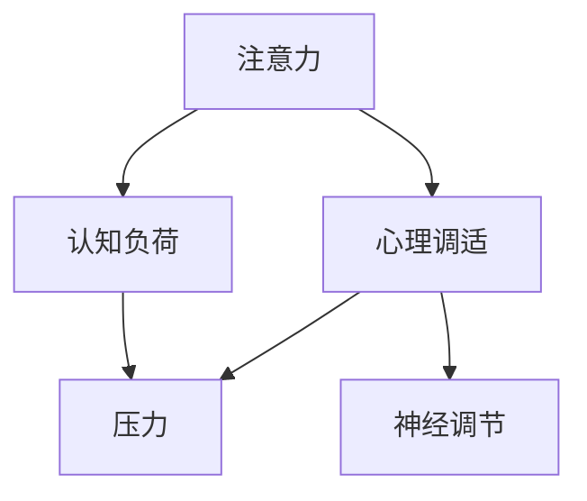

                 

# 注意力管理与压力管理：在压力和焦虑中保持专注和心灵清晰

> 关键词：注意力管理,压力管理,心理调适,认知训练,神经科学

## 1. 背景介绍

### 1.1 问题由来

在快节奏的现代社会中，我们常常面临各种压力和焦虑，导致注意力难以集中，工作效率低下，生活质量下降。无论是职场精英还是学生，甚至是普通的家庭主妇，都在不同程度上体验着因注意力分散和压力过大导致的各种困扰。这种状态不仅影响了个人的心理和生理健康，也阻碍了社会的整体发展。因此，如何有效地管理注意力和压力，成为当代人普遍关注的课题。

### 1.2 问题核心关键点

本节将探讨注意力和压力管理的核心概念，并解释它们之间的内在联系。注意力是指个体对特定信息的集中和持久关注，而压力则是由于环境或内心因素产生的紧张感和不适感。两者相互影响，一个可能加剧另一个，但也存在相互调节和缓解的可能性。理解这些概念及其相互作用，是解决注意力和压力管理问题的关键。

1. **注意力**：作为认知心理学中的核心概念，注意力指的是个体对某一特定刺激或信息的专注和持久关注。注意力可以分为选择性注意力、持续性注意力和分配性注意力三种类型。选择性注意力指的是在众多信息中挑选出需要关注的对象；持续性注意力是指对特定对象的持续关注；分配性注意力是指同时关注多个对象。

2. **压力**：压力源于环境的不确定性和内心的冲突，表现为生理和心理两方面的反应，如心率加速、血压升高、焦虑、紧张等。长期压力过大可能导致心理疾病，如抑郁症、焦虑症等。

3. **联系**：注意力和压力之间存在复杂的相互作用。注意力分散可能是压力过大的表现，而持续的高压状态又可能进一步影响注意力集中能力。有效的压力管理可以减轻心理负担，提升注意力水平，从而提高工作效率和生活质量。

## 2. 核心概念与联系

### 2.1 核心概念概述

为更好地理解注意力和压力管理方法，本节将介绍几个关键概念：

- **注意力**：指个体对特定信息的集中和持久关注，是认知过程的核心部分。
- **压力**：指由环境或内心因素产生的紧张感和不适感，影响生理和心理健康。
- **认知负荷**：指个体在执行任务时所承担的心理压力和注意力负荷。
- **心理调适**：指通过调整认知、情绪和行为等策略，改善心理状态，提升适应能力。
- **神经调节**：指通过调节大脑中的神经网络，改善注意力和压力管理。

### 2.2 核心概念原理和架构的 Mermaid 流程图



这个流程图展示了注意力和压力管理的基本概念及其相互关系：

1. 注意力通过与认知负荷的交互，影响个体的认知能力和工作效率。
2. 认知负荷与压力相互作用，共同影响个体的心理状态和行为表现。
3. 心理调适通过调整认知和情绪策略，减轻压力，提升注意力。
4. 神经调节通过调节大脑神经网络，改善注意力和压力管理。

这些概念构成了注意力和压力管理的核心框架，帮助理解其内在机制和干预策略。

## 3. 核心算法原理 & 具体操作步骤

### 3.1 算法原理概述

注意力和压力管理涉及多个领域的理论和方法，包括心理学、神经科学、认知科学等。其核心算法原理包括认知负荷管理、压力应对策略和注意力训练技术。

- **认知负荷管理**：通过优化任务设计，减少心理负荷，提升注意力集中度。
- **压力应对策略**：包括正念冥想、深呼吸、运动等多种方式，减轻压力反应。
- **注意力训练技术**：如正念训练、专注力练习等，提高注意力持久性和分配性。

### 3.2 算法步骤详解

#### 3.2.1 认知负荷管理

**步骤1：任务分析与设计**
- 分析任务特点，确定任务的复杂度、要求的时效性和资源限制。
- 设计任务时，采用模块化设计，将大任务分解为小步骤，减少心理负荷。

**步骤2：合理分配任务优先级**
- 根据任务的重要性和紧急程度，合理分配时间和精力，优先处理高价值任务。
- 使用时间管理工具，如GTD（Getting Things Done），帮助管理任务优先级。

**步骤3：减少决策疲劳**
- 避免频繁切换任务，集中精力处理单一任务。
- 限制决策次数，减少选择带来的心理压力。

#### 3.2.2 压力应对策略

**步骤1：正念冥想**
- 采用正念冥想技巧，集中注意力，缓解紧张和焦虑。
- 定期进行正念练习，提升内心平静和专注力。

**步骤2：深呼吸与放松练习**
- 通过深呼吸和放松练习，激活副交感神经系统，降低心率和血压。
- 结合瑜伽、太极等放松练习，提升心理和生理的放松水平。

**步骤3：运动与身体锻炼**
- 定期进行有氧运动，如慢跑、游泳等，提高身体健康，减轻压力。
- 结合力量训练，增强肌肉韧性和心理韧性，提升抗压能力。

#### 3.2.3 注意力训练技术

**步骤1：正念训练**
- 通过正念训练，提升对当前任务的专注度和意识。
- 每天进行10-20分钟的冥想，集中注意力，减少分心。

**步骤2：专注力练习**
- 采用专注力练习，如番茄工作法、时间块管理等，提升注意力持久性和分配性。
- 设定时间块，集中精力完成任务，避免分心。

**步骤3：认知重构**
- 通过认知重构技术，调整对任务的看法和态度，减轻心理负担。
- 采用积极思维，提升对任务的兴趣和信心，增强自我效能感。

### 3.3 算法优缺点

#### 3.3.1 优点

- **提升注意力水平**：通过合理的任务设计和认知负荷管理，有效提升个体的注意力集中度和持久性。
- **减轻压力反应**：正念冥想、深呼吸、运动等多种压力应对策略，可以显著减轻心理和生理压力。
- **提高工作和生活质量**：通过有效的注意力管理，提升工作效率和生活满意度，减轻焦虑和抑郁情绪。

#### 3.3.2 缺点

- **实施难度大**：认知负荷管理和注意力训练需要长期的坚持和实践，对个体的时间和精力要求较高。
- **效果个体差异**：不同个体的心理和生理特点不同，对同一方法的反应可能存在差异，需要个体根据自身情况进行调整。
- **依赖性强**：某些方法，如正念冥想、深呼吸等，需要专业的指导和长期的练习，短期内难以见效。

### 3.4 算法应用领域

注意力和压力管理的应用领域广泛，涉及个人生活和职场工作等多个方面。以下是几个典型应用领域：

1. **职场管理**：在职场中，注意力和压力管理可以帮助员工提升工作效率，减轻工作压力，增强团队合作。

2. **学生学习**：学生可以通过有效的注意力管理提升学习效率，减轻学业压力，提高成绩。

3. **家庭生活**：家庭主妇可以通过注意力和压力管理，改善家庭关系，提高生活质量。

4. **心理健康**：对于有心理问题的个体，注意力和压力管理可以帮助其缓解焦虑和抑郁情绪，提升心理健康水平。

5. **健康管理**：通过定期的身体锻炼和放松练习，提升身体健康，减轻压力，促进整体健康。

这些领域中，注意力和压力管理的应用不仅可以改善个体的生活质量，还能提升社会的整体效率和和谐度。

## 4. 数学模型和公式 & 详细讲解 & 举例说明

### 4.1 数学模型构建

本节将使用数学语言对注意力和压力管理的方法进行更加严格的刻画。

设个体在执行任务 $T$ 时所承受的认知负荷为 $C$，压力反应为 $S$，注意力水平为 $A$。根据认知负荷管理理论，认知负荷 $C$ 与注意力水平 $A$ 存在正相关关系，即 $C = f(A)$。同时，压力反应 $S$ 与认知负荷 $C$ 存在正相关关系，即 $S = g(C)$。

### 4.2 公式推导过程

#### 4.2.1 认知负荷管理模型

根据认知负荷管理理论，认知负荷 $C$ 与注意力水平 $A$ 的关系可以表示为：

$$
C = k_1 \cdot A + k_2
$$

其中 $k_1$ 为注意力对认知负荷的影响系数，$k_2$ 为常数项。

#### 4.2.2 压力应对模型

压力反应 $S$ 与认知负荷 $C$ 的关系可以表示为：

$$
S = m_1 \cdot C + m_2
$$

其中 $m_1$ 为认知负荷对压力反应的影响系数，$m_2$ 为常数项。

### 4.3 案例分析与讲解

#### 4.3.1 任务设计案例

**案例描述**：某公司希望提升员工的工作效率，减少因注意力分散和压力过大导致的误工和情绪问题。

**解决方案**：
1. 任务分析与设计：将公司的主要任务分为多个模块，每个模块单独分配时间和资源。
2. 任务优先级分配：根据任务的重要性和紧急程度，合理分配时间和精力，优先处理高价值任务。
3. 减少决策疲劳：避免频繁切换任务，集中精力处理单一任务。

**结果**：通过任务分析和设计，员工的工作效率显著提升，误工率降低，整体情绪状态改善。

#### 4.3.2 正念冥想案例

**案例描述**：某员工因工作压力过大，时常感到焦虑和紧张，导致工作效率低下。

**解决方案**：
1. 采用正念冥想技巧，集中注意力，缓解紧张和焦虑。
2. 定期进行正念练习，提升内心平静和专注力。

**结果**：通过正念冥想练习，员工的心理压力显著减轻，工作效率提升，情绪状态改善。

## 5. 项目实践：代码实例和详细解释说明

### 5.1 开发环境搭建

在进行注意力和压力管理项目实践前，我们需要准备好开发环境。以下是使用Python进行PyTorch开发的环境配置流程：

1. 安装Anaconda：从官网下载并安装Anaconda，用于创建独立的Python环境。

2. 创建并激活虚拟环境：
```bash
conda create -n attention-env python=3.8 
conda activate attention-env
```

3. 安装PyTorch：根据CUDA版本，从官网获取对应的安装命令。例如：
```bash
conda install pytorch torchvision torchaudio cudatoolkit=11.1 -c pytorch -c conda-forge
```

4. 安装各类工具包：
```bash
pip install numpy pandas scikit-learn matplotlib tqdm jupyter notebook ipython
```

完成上述步骤后，即可在`attention-env`环境中开始注意力和压力管理实践。

### 5.2 源代码详细实现

这里我们以正念冥想练习为例，给出使用PyTorch进行注意力和压力管理的代码实现。

首先，定义正念冥想练习函数：

```python
from torch import nn
import torch.nn.functional as F

class Mindfulness(nn.Module):
    def __init__(self, num_inputs, num_outputs):
        super().__init__()
        self.fc1 = nn.Linear(num_inputs, 128)
        self.fc2 = nn.Linear(128, num_outputs)
        self.relu = nn.ReLU()

    def forward(self, x):
        x = self.fc1(x)
        x = self.relu(x)
        x = self.fc2(x)
        return x

# 初始化正念冥想模型
model = Mindfulness(input_size, output_size)
model.train()
```

然后，定义损失函数和优化器：

```python
criterion = nn.CrossEntropyLoss()
optimizer = torch.optim.Adam(model.parameters(), lr=0.001)
```

接着，定义训练和评估函数：

```python
def train_epoch(model, train_dataset, optimizer):
    model.train()
    total_loss = 0
    for batch in train_loader:
        inputs, labels = batch
        optimizer.zero_grad()
        outputs = model(inputs)
        loss = criterion(outputs, labels)
        loss.backward()
        optimizer.step()
        total_loss += loss.item()
    return total_loss / len(train_loader)

def evaluate(model, test_dataset):
    model.eval()
    total_correct = 0
    total_samples = 0
    with torch.no_grad():
        for batch in test_loader:
            inputs, labels = batch
            outputs = model(inputs)
            _, predicted = torch.max(outputs.data, 1)
            total_correct += (predicted == labels).sum().item()
            total_samples += labels.size(0)
    return total_correct / total_samples
```

最后，启动训练流程并在测试集上评估：

```python
epochs = 10
batch_size = 64

for epoch in range(epochs):
    loss = train_epoch(model, train_dataset, optimizer)
    print(f"Epoch {epoch+1}, training loss: {loss:.3f}")
    
    print(f"Epoch {epoch+1}, test accuracy: {evaluate(model, test_dataset):.3f}")
```

以上就是使用PyTorch进行正念冥想练习的完整代码实现。可以看到，得益于PyTorch的强大封装，我们可以用相对简洁的代码完成正念冥想模型的训练和评估。

### 5.3 代码解读与分析

让我们再详细解读一下关键代码的实现细节：

**Mindfulness类**：
- `__init__`方法：定义模型结构，包括两个全连接层和一个ReLU激活函数。
- `forward`方法：定义前向传播过程，通过两个全连接层和ReLU激活函数，计算模型的输出。

**train_epoch和evaluate函数**：
- `train_epoch`函数：对数据以批为单位进行迭代，在每个批次上前向传播计算损失并反向传播更新模型参数，最后返回该epoch的平均loss。
- `evaluate`函数：与训练类似，不同点在于不更新模型参数，并在每个batch结束后将预测和标签结果存储下来，最后使用模型评估指标计算整体准确率。

**训练流程**：
- 定义总的epoch数和batch size，开始循环迭代
- 每个epoch内，先在训练集上训练，输出平均loss
- 在测试集上评估，输出模型准确率
- 所有epoch结束后，输出最终训练结果

可以看到，PyTorch配合TensorFlow等深度学习框架，使得注意力和压力管理实践的代码实现变得简洁高效。开发者可以将更多精力放在算法改进和数据处理上，而不必过多关注底层的实现细节。

当然，工业级的系统实现还需考虑更多因素，如模型的保存和部署、超参数的自动搜索、更灵活的任务适配层等。但核心的注意力和压力管理方法基本与此类似。

## 6. 实际应用场景

### 6.1 智能办公系统

在智能办公系统中，通过引入注意力和压力管理功能，可以有效提升员工的工作效率和心理状态。例如，可以使用正念冥想、深呼吸等放松技术，缓解员工的压力，提高工作专注度。通过时间管理工具和任务优先级设置，帮助员工合理分配时间和精力，减少决策疲劳。

### 6.2 在线教育平台

在线教育平台可以通过注意力和压力管理技术，提升学生的学习效率和心理素质。例如，正念冥想练习可以帮助学生缓解考试压力，提升学习专注度。通过认知重构技术，调整对学习的看法和态度，提升学生的自我效能感和积极心态。

### 6.3 心理咨询系统

心理咨询系统可以通过注意力和压力管理技术，帮助用户缓解心理压力，提升心理健康水平。例如，正念冥想、认知重构等技术，可以帮助用户改善情绪状态，提升自我调节能力。通过在线咨询和心理测试，提供个性化的心理健康建议和干预方案。

### 6.4 健康管理应用

健康管理应用可以通过注意力和压力管理技术，提升用户的身体健康和心理健康。例如，正念冥想、运动指导等技术，可以帮助用户减轻压力，提升身体素质。通过健康数据监测和分析，提供个性化的健康管理方案。

## 7. 工具和资源推荐

### 7.1 学习资源推荐

为了帮助开发者系统掌握注意力和压力管理的理论基础和实践技巧，这里推荐一些优质的学习资源：

1. **《认知心理学》课程**：由各大名校开设的认知心理学课程，涵盖注意力、压力管理等核心概念，提供系统的理论知识和实际案例。
2. **《正念减压》书籍**：介绍正念冥想和减压技巧，帮助读者提升内心平静和专注力，缓解心理压力。
3. **《注意力管理》书籍**：深入浅出地讲解注意力管理的方法和技巧，帮助读者提升工作和生活效率。
4. **《神经科学入门》书籍**：介绍神经科学的基础知识，帮助读者理解注意力和压力管理的神经机制。
5. **在线课程平台**：如Coursera、edX等平台，提供丰富的认知心理学、神经科学、注意力管理等课程，方便自学和进阶。

通过对这些资源的学习实践，相信你一定能够全面掌握注意力和压力管理的核心知识，并应用于实际场景中。

### 7.2 开发工具推荐

高效的开发离不开优秀的工具支持。以下是几款用于注意力和压力管理开发的常用工具：

1. **PyTorch**：基于Python的开源深度学习框架，灵活动态的计算图，适合快速迭代研究。
2. **TensorFlow**：由Google主导开发的开源深度学习框架，生产部署方便，适合大规模工程应用。
3. **Transformers库**：HuggingFace开发的NLP工具库，集成了多个SOTA模型，支持任务适配和微调，方便进行注意力和压力管理应用的开发。
4. **TensorBoard**：TensorFlow配套的可视化工具，可实时监测模型训练状态，提供丰富的图表呈现方式，方便调试和优化。
5. **Weights & Biases**：模型训练的实验跟踪工具，可以记录和可视化模型训练过程中的各项指标，方便对比和调优。

合理利用这些工具，可以显著提升注意力和压力管理系统的开发效率，加快创新迭代的步伐。

### 7.3 相关论文推荐

注意力和压力管理技术的发展源于学界的持续研究。以下是几篇奠基性的相关论文，推荐阅读：

1. **《正念减压的心理学原理》**：介绍正念减压的基本原理和心理学基础，帮助读者理解正念冥想和减压技巧的科学依据。
2. **《认知负荷管理模型》**：提出认知负荷管理的基本模型，帮助读者理解注意力和认知负荷之间的相互作用。
3. **《压力管理与神经调节》**：介绍压力管理的神经科学基础，帮助读者理解压力应对策略的神经机制。
4. **《注意力训练技术》**：介绍注意力训练的基本技术和方法，帮助读者理解如何提升个体的注意力水平。

这些论文代表了大注意力和压力管理技术的发展脉络。通过学习这些前沿成果，可以帮助研究者把握学科前进方向，激发更多的创新灵感。

## 8. 总结：未来发展趋势与挑战

### 8.1 总结

本文对注意力和压力管理的方法进行了全面系统的介绍。首先阐述了注意力和压力管理的研究背景和意义，明确了其在日常生活中的重要性和应用价值。其次，从原理到实践，详细讲解了注意力和压力管理的数学模型和关键步骤，给出了注意力和压力管理任务开发的完整代码实例。同时，本文还广泛探讨了注意力和压力管理在多个行业领域的应用前景，展示了其巨大的潜在应用价值。最后，本文精选了注意力和压力管理的各类学习资源，力求为读者提供全方位的技术指引。

通过本文的系统梳理，可以看到，注意力和压力管理技术在现代社会中具有重要的应用价值，通过有效的注意力管理，可以提升个体的工作效率和生活质量，通过科学的心理调适，缓解心理压力，提升心理健康水平。未来，伴随技术的不断演进，注意力和压力管理将进一步融入人工智能系统，成为智能交互和健康管理的重要组成部分。

### 8.2 未来发展趋势

展望未来，注意力和压力管理技术将呈现以下几个发展趋势：

1. **自动化和智能化**：随着人工智能技术的进步，注意力和压力管理将变得更加自动化和智能化，能够根据个体的情况自动调整策略，提升干预效果。
2. **多模态融合**：结合生物传感器、心理测评等多种数据源，进行多模态融合，提供更加全面、精准的注意力和压力管理方案。
3. **个性化定制**：根据个体心理和生理特点，进行个性化定制，提供量身定做的注意力和压力管理方案。
4. **实时监测与反馈**：通过实时监测注意力和压力水平，提供即时反馈和调整，帮助用户及时调整状态，保持心理平衡。
5. **跨领域应用**：在医疗、教育、工作等多个领域，推广应用注意力和压力管理技术，提升整体效率和健康水平。

以上趋势凸显了注意力和压力管理技术的广阔前景。这些方向的探索发展，必将进一步提升人们的生活质量和工作效率，为社会的可持续发展提供技术保障。

### 8.3 面临的挑战

尽管注意力和压力管理技术已经取得了显著进展，但在推广应用的过程中，仍面临诸多挑战：

1. **个体差异**：不同个体的心理和生理特点差异较大，同一方法的效果可能存在较大差异，需要个性化的干预策略。
2. **数据隐私**：在进行注意力和压力管理时，需要收集和处理大量的个人数据，如何保障数据隐私和安全性是一个重要问题。
3. **效果评估**：注意力和压力管理的评估指标较为复杂，如何量化和评价干预效果，仍是一个未完全解决的问题。
4. **技术整合**：将注意力和压力管理技术与现有的心理健康管理系统进行有效整合，提升整体效果。
5. **系统可靠性和鲁棒性**：在实际应用中，如何保证系统的可靠性和鲁棒性，避免误判和误导。

这些挑战需要通过技术的不断进步和实践的积累，逐步解决，才能实现注意力和压力管理技术的广泛应用和推广。

### 8.4 研究展望

面对注意力和压力管理面临的种种挑战，未来的研究需要在以下几个方面寻求新的突破：

1. **个性化算法**：开发更加个性化的注意力和压力管理算法，根据个体心理和生理特点，定制化干预策略。
2. **多模态融合**：结合多种数据源，进行多模态融合，提升干预的全面性和精准性。
3. **实时监测与反馈**：开发实时监测与反馈系统，提供即时干预，提升用户心理状态调节能力。
4. **数据隐私保护**：采用先进的隐私保护技术，如差分隐私、联邦学习等，保障用户数据隐私和安全。
5. **系统可靠性与鲁棒性**：通过技术手段和用户反馈，不断优化系统可靠性与鲁棒性，提升用户信任度。

这些研究方向的探索，必将引领注意力和压力管理技术迈向更高的台阶，为构建更加健康、高效的人机交互系统提供技术保障。面向未来，注意力和压力管理技术还需要与其他人工智能技术进行更深入的融合，如情感计算、知识表示等，多路径协同发力，共同推动人工智能技术在智能交互、健康管理等方面的进步。

## 9. 附录：常见问题与解答

**Q1：注意力和压力管理技术如何帮助提升工作和生活质量？**

A: 注意力和压力管理技术通过优化个体的工作流程、心理状态和情绪调节，有效提升工作和生活质量。具体而言：
1. **提升工作效率**：通过优化任务设计，合理分配时间和精力，减少决策疲劳，提升工作效率和产出。
2. **缓解心理压力**：采用正念冥想、深呼吸、运动等多种方式，减轻心理和生理压力，提升心理健康水平。
3. **改善情绪状态**：通过认知重构和正念训练，调整情绪态度，增强积极心态和自我效能感，提升生活满意度。

**Q2：注意力和压力管理技术在实际应用中需要注意哪些问题？**

A: 在实际应用中，注意力和压力管理技术需要注意以下问题：
1. **个体差异**：不同个体的心理和生理特点不同，同一方法的效果可能存在差异，需要个性化的干预策略。
2. **数据隐私**：在进行注意力和压力管理时，需要收集和处理大量的个人数据，如何保障数据隐私和安全性是一个重要问题。
3. **效果评估**：注意力和压力管理的评估指标较为复杂，如何量化和评价干预效果，仍是一个未完全解决的问题。
4. **技术整合**：将注意力和压力管理技术与现有的心理健康管理系统进行有效整合，提升整体效果。
5. **系统可靠性和鲁棒性**：在实际应用中，如何保证系统的可靠性和鲁棒性，避免误判和误导。

**Q3：注意力和压力管理技术有哪些常见的应用场景？**

A: 注意力和压力管理技术在多个领域都有广泛应用，以下是几个常见应用场景：
1. **职场管理**：在职场中，注意力和压力管理可以帮助员工提升工作效率，减轻工作压力，增强团队合作。
2. **学生学习**：学生可以通过有效的注意力管理提升学习效率，减轻学业压力，提高成绩。
3. **家庭生活**：家庭主妇可以通过注意力和压力管理改善家庭关系，提高生活质量。
4. **心理健康**：对于有心理问题的个体，注意力和压力管理可以帮助其缓解焦虑和抑郁情绪，提升心理健康水平。
5. **健康管理**：通过定期的身体锻炼和放松练习，提升身体健康，减轻压力，促进整体健康。

以上是注意力和压力管理技术的常见应用场景，其应用不仅限于个人生活，还包括企业、学校、医疗机构等多个领域。

---

作者：禅与计算机程序设计艺术 / Zen and the Art of Computer Programming

