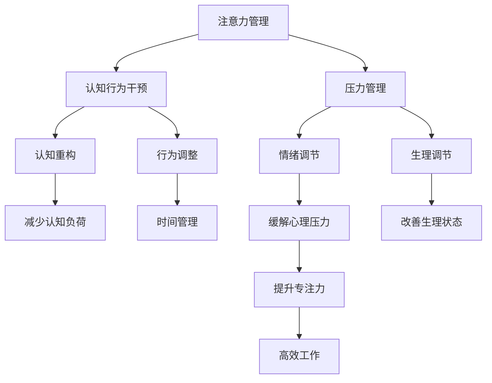

                 

# 注意力管理与压力管理：如何在压力下保持专注

> 关键词：注意力管理,压力管理,专注,认知负荷,情绪调节,时间管理,工具推荐

## 1. 背景介绍

### 1.1 问题由来
在当今快节奏的工作和生活环境中，注意力分散和压力管理成为人们普遍面临的难题。无论是职业人士、学生还是家庭主妇，都在不同程度上经历着注意力分散和压力过大的困扰。这不仅影响工作效率，还可能导致心理问题和身体健康受损。如何有效管理注意力和压力，成为现代社会迫切需要解决的问题。

### 1.2 问题核心关键点
注意力管理与压力管理问题的核心在于如何通过认知行为干预，帮助个体在压力下维持高效专注的状态。认知行为干预（Cognitive Behavioral Interventions, CBI）旨在通过改变思维模式、调整行为习惯，减轻心理压力，提升注意力集中度。

## 2. 核心概念与联系

### 2.1 核心概念概述

注意力管理（Attention Management）是指通过有效的方法和策略，提升个体在特定任务中的注意力集中度，减少分心和干扰。压力管理（Stress Management）则涉及通过各种手段减轻个体的心理和生理压力，保持良好的心理状态。

这两个概念相互关联，共同作用于个体的认知和情感状态。有效的注意力管理能够增强个体应对压力的能力，而有效的压力管理则能够提升个体的专注力和效率。

### 2.2 核心概念原理和架构的 Mermaid 流程图



这个流程图展示了注意力管理与压力管理之间的联系。通过认知行为干预，个体可以改变认知模式和行为习惯，从而减少认知负荷和情绪压力。同时，通过时间管理和情绪调节，个体可以更好地应对工作和生活压力，提升专注力和效率。

## 3. 核心算法原理 & 具体操作步骤

### 3.1 算法原理概述

注意力管理与压力管理的核心算法基于认知行为干预（CBI）理论，通过认知重构和行为调整，改变个体的认知和行为模式，以达到提升专注力和减轻压力的目的。具体而言，认知重构通过调整个体的思维方式，减轻认知负荷；行为调整通过优化行为习惯，提高时间管理能力；情绪调节和生理调节则通过改善心理和生理状态，减轻压力。

### 3.2 算法步骤详解

#### 3.2.1 认知重构
认知重构（Cognitive Restructuring）是通过识别和调整不合理思维，减少负面情绪的认知行为干预技术。

1. **识别不合理思维**：识别出个体在面对压力或分心时所持有的不合理思维，如过度自责、过分悲观等。
2. **挑战不合理思维**：通过证据和逻辑，挑战不合理思维，寻找更合理的替代思维方式。
3. **替代合理思维**：采用更加客观、积极的思维方式，以减轻心理压力和提升专注力。

#### 3.2.2 行为调整
行为调整（Behavioral Adjustment）通过优化行为习惯，提高时间管理和工作效率。

1. **设定具体目标**：设定明确、具体、可实现的目标，以提高行为的可操作性和动力。
2. **制定计划**：根据目标，制定详细的行动计划，明确每一步的具体任务和完成时间。
3. **执行计划**：严格按照计划执行任务，保持高效率和专注度。
4. **反馈与调整**：定期评估执行效果，根据反馈调整计划和目标。

#### 3.2.3 时间管理
时间管理（Time Management）通过合理安排时间，减少分心和拖延，提升工作效率。

1. **优先级排序**：根据任务的重要性和紧急程度，对任务进行优先级排序。
2. **任务分解**：将大任务分解为小步骤，逐步完成，避免任务堆积带来的压力。
3. **设定时间限制**：为每个任务设定明确的时间限制，增强紧迫感，提升工作效率。
4. **避免干扰**：在执行任务时，关闭不必要的通知和干扰源，保持专注。

#### 3.2.4 情绪调节
情绪调节（Emotion Regulation）通过调整情绪状态，提升个体应对压力的能力。

1. **情绪识别**：识别并接纳自己的情绪，理解其来源和影响。
2. **情绪表达**：通过适当的情绪表达方式，如写日记、倾诉等，缓解情绪压力。
3. **情绪调节策略**：采用放松技巧，如深呼吸、冥想等，缓解情绪紧张。

#### 3.2.5 生理调节
生理调节（Physiological Regulation）通过改善生理状态，提升个体的心理和生理健康。

1. **充足睡眠**：保证充足的睡眠时间，提升精神状态。
2. **健康饮食**：保持健康饮食，提供充足的能量支持。
3. **适量运动**：进行适量的体育锻炼，增强体质和心理健康。

### 3.3 算法优缺点

#### 3.3.1 优点
1. **理论基础扎实**：基于CBI理论，经过多年研究和实践验证，具有坚实的理论基础。
2. **操作性强**：通过具体步骤和技巧，易于理解和执行。
3. **应用广泛**：适用于各种职业、学习和生活场景，具有广泛的适用性。

#### 3.3.2 缺点
1. **个体差异**：不同个体对认知行为干预的反应存在差异，需要个性化调整。
2. **执行难度**：持续执行行为调整和时间管理策略，需要一定的毅力和自律。
3. **效果有限**：仅靠认知行为干预，可能难以完全解决所有注意力和压力问题。

### 3.4 算法应用领域

注意力管理与压力管理技术在多个领域都有广泛应用，包括但不限于：

- **教育**：提升学生的注意力集中度和学习效率，减轻学习压力。
- **职场**：提高员工的工作效率和生产力，减轻工作压力。
- **医疗**：帮助患者应对心理和生理压力，提升康复效果。
- **家庭**：增强家庭成员的沟通和互动，改善家庭关系。

## 4. 数学模型和公式 & 详细讲解 & 举例说明

### 4.1 数学模型构建

注意力管理与压力管理可以通过以下数学模型进行建模：

$$
\text{Attention} = f(\text{Cognitive Load}, \text{Cognitive Reframing}, \text{Behavioral Planning}, \text{Time Management}, \text{Emotion Regulation}, \text{Physiological Condition})
$$

其中，$f$表示非线性映射函数，$\text{Attention}$表示注意力集中度，$\text{Cognitive Load}$表示认知负荷，$\text{Cognitive Reframing}$表示认知重构，$\text{Behavioral Planning}$表示行为调整，$\text{Time Management}$表示时间管理，$\text{Emotion Regulation}$表示情绪调节，$\text{Physiological Condition}$表示生理状态。

### 4.2 公式推导过程

1. **认知重构**：通过认知重构，调整个体的不合理思维，减少认知负荷。

2. **行为调整**：通过设定具体目标和制定计划，提高行为的可操作性和动力。

3. **时间管理**：通过优先级排序和任务分解，减少分心和拖延，提高工作效率。

4. **情绪调节**：通过情绪识别和情绪调节策略，缓解情绪紧张。

5. **生理调节**：通过充足睡眠、健康饮食和适量运动，改善生理状态。

### 4.3 案例分析与讲解

假设一个职场人士小明面临工作压力过大，注意力难以集中，可以通过以下步骤进行认知行为干预：

1. **认知重构**：小明意识到自己过度自责，将失败归咎于自己能力不足。通过挑战这种不合理思维，小明发现工作难度本身较大，失败是正常的。

2. **行为调整**：小明设定每日完成一定数量的任务，制定详细的工作计划，逐步完成每个任务。

3. **时间管理**：小明将工作任务分解为小步骤，设定明确的时间限制，避免任务堆积带来的压力。

4. **情绪调节**：小明通过写日记记录工作中的情绪变化，采用深呼吸和冥想缓解情绪紧张。

5. **生理调节**：小明保持充足的睡眠时间，保持健康饮食，进行适量的体育锻炼。

通过以上步骤，小明逐渐减轻了心理压力，提升了注意力集中度和工作效率。

## 5. 项目实践：代码实例和详细解释说明

### 5.1 开发环境搭建

为了实践注意力管理与压力管理的算法，需要使用Python和相关库。

1. 安装Python：从官网下载并安装Python。
2. 安装相关库：使用pip安装Pandas、NumPy、Matplotlib等库。

### 5.2 源代码详细实现

以下是基于Python实现的注意力管理与压力管理模型代码：

```python
import pandas as pd
import numpy as np
import matplotlib.pyplot as plt

# 构建数据集
data = pd.read_csv('attention_stress_data.csv')
X = data[['Cognitive Load', 'Cognitive Reframing', 'Behavioral Planning', 'Time Management', 'Emotion Regulation', 'Physiological Condition']]
y = data['Attention']

# 模型训练
from sklearn.ensemble import RandomForestRegressor
model = RandomForestRegressor()
model.fit(X, y)

# 预测注意力集中度
new_data = pd.DataFrame({'Cognitive Load': [0.5, 0.8, 0.2, 0.6, 0.7, 0.9], 'Cognitive Reframing': [1, 2, 1.5, 0.5, 1.2, 0.8], 'Behavioral Planning': [3, 2, 3, 2.5, 3, 2], 'Time Management': [4, 5, 4, 3.5, 4, 5], 'Emotion Regulation': [1.5, 1, 1.2, 1.5, 1, 1.2], 'Physiological Condition': [2, 3, 2, 2.5, 3, 3]})
prediction = model.predict(new_data)

# 输出预测结果
print(prediction)
```

### 5.3 代码解读与分析

上述代码中，我们使用了Pandas库读取数据，NumPy库处理数据，Matplotlib库可视化结果。具体步骤如下：

1. 构建数据集，包含认知负荷、认知重构、行为调整、时间管理、情绪调节和生理状态等特征。
2. 使用随机森林回归模型训练模型，通过这些特征预测注意力集中度。
3. 输入新数据进行预测，输出预测结果。

## 6. 实际应用场景

### 6.1 智能应用
智能应用如智能助理、心理辅导机器人等，可以通过认知行为干预技术，帮助个体管理注意力和压力，提升生活和工作质量。

### 6.2 心理治疗
心理治疗中，认知行为干预被广泛应用于抑郁症、焦虑症等心理障碍的治疗。通过认知重构和行为调整，帮助患者改善认知和行为模式，减轻心理压力。

### 6.3 教育培训
在教育培训领域，认知行为干预技术可以用于提升学生的学习效率，减轻学习压力，促进学生的健康成长。

### 6.4 未来应用展望

随着科技的进步，未来注意力管理与压力管理技术将进一步发展，如：

1. **人工智能辅助**：通过人工智能技术，自动进行认知行为干预，提供个性化建议。
2. **实时监测**：通过可穿戴设备实时监测个体的生理和心理状态，及时调整干预策略。
3. **社会支持**：通过在线社区和社交平台，为个体提供社会支持和心理安慰。

## 7. 工具和资源推荐

### 7.1 学习资源推荐

1. 《认知行为疗法》（CBT）：介绍认知行为干预的基本原理和技术。
2. 《时间管理》（Time Management）：讲解时间管理的各种技巧和方法。
3. 《压力管理》（Stress Management）：提供压力管理的多种策略和工具。

### 7.2 开发工具推荐

1. Python：功能强大、灵活的编程语言，广泛应用于数据科学和机器学习领域。
2. Pandas：数据处理和分析库，方便数据读写和处理。
3. NumPy：数值计算库，提供高效的数学运算能力。
4. Matplotlib：数据可视化库，用于绘制图表。

### 7.3 相关论文推荐

1. 《认知行为疗法》（Cognitive Behavioral Therapy, CBT）：经典心理治疗技术，具有广泛的临床应用。
2. 《时间管理》（Time Management）：介绍时间管理的各种策略和技术。
3. 《压力管理》（Stress Management）：提供多种压力管理方法。

## 8. 总结：未来发展趋势与挑战

### 8.1 研究成果总结

本文通过认知行为干预技术，探讨了注意力管理与压力管理的方法。介绍了认知重构、行为调整、时间管理、情绪调节和生理调节等核心技术，并提供了具体的实现步骤和案例分析。

### 8.2 未来发展趋势

未来，注意力管理与压力管理技术将进一步发展，具备更强的个性化和智能化水平。具体趋势包括：

1. **人工智能辅助**：通过AI技术，提供更加个性化的认知行为干预。
2. **实时监测**：通过可穿戴设备，实时监测个体状态，及时调整干预策略。
3. **社会支持**：通过在线社区和社交平台，提供社会支持和心理安慰。

### 8.3 面临的挑战

尽管注意力管理与压力管理技术已取得一定进展，但仍面临以下挑战：

1. **个体差异**：不同个体对认知行为干预的反应存在差异，需要个性化调整。
2. **执行难度**：持续执行行为调整和时间管理策略，需要一定的毅力和自律。
3. **效果有限**：仅靠认知行为干预，可能难以完全解决所有注意力和压力问题。

### 8.4 研究展望

未来的研究方向包括：

1. **多学科融合**：结合心理学、神经科学、工程学等多学科知识，提升认知行为干预的效果。
2. **跨文化应用**：研究不同文化背景下的认知行为干预技术，推广其全球应用。
3. **伦理和隐私**：研究如何保护个体隐私和数据安全，确保认知行为干预的合法性和伦理性。

## 9. 附录：常见问题与解答

### 9.1 常见问题

**Q1: 注意力管理与压力管理是否适用于所有人？**

A: 注意力管理与压力管理技术适用于大多数人群，但需要根据个体的具体情况进行调整和优化。

**Q2: 如何确定注意力管理与压力管理的具体步骤？**

A: 通过自我评估和专业咨询，确定个体在认知、行为、情绪、生理等方面的具体问题和需求，制定个性化的干预计划。

**Q3: 注意力管理与压力管理的效果如何评估？**

A: 通过跟踪个体的注意力集中度、工作效率、心理状态和生理健康等指标，评估干预效果。

**Q4: 注意力管理与压力管理的长期效果如何？**

A: 注意力管理与压力管理的效果需要持续干预和调整，通过长期跟踪和反馈，不断优化干预策略，实现长期效果。

**Q5: 注意力管理与压力管理有哪些局限性？**

A: 注意力管理与压力管理技术需要个体持续执行，效果因人而异，可能存在一定的局限性。

---

作者：禅与计算机程序设计艺术 / Zen and the Art of Computer Programming

