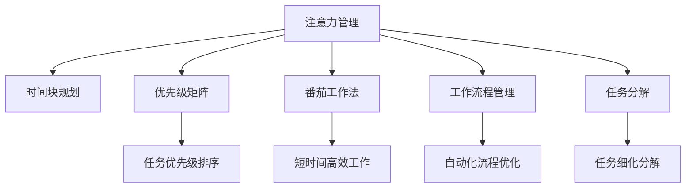

                 

# 注意力管理与时间块规划：如何最大化利用你的时间

> 关键词：注意力管理, 时间块规划, 时间效率, 生产力提升, 工作流程优化, 工具推荐

## 1. 背景介绍

### 1.1 问题由来
在快节奏的现代生活和工作环境中，有效管理时间已成为提升个人和团队生产力的关键。然而，如何合理规划时间和提高注意力集中度，是困扰许多人的难题。特别是在数字化时代，信息爆炸和技术工具的泛滥，使得时间管理变得更加复杂和挑战。

### 1.2 问题核心关键点
时间管理和注意力管理的核心在于识别和优先处理重要的任务，避免被琐事和干扰所打扰。这涉及到两个方面：

1. **任务优先级排序**：确定哪些任务最重要，哪些最紧急，哪些可以推迟或委派给他人。
2. **注意力集中**：在处理任务时保持高效率，避免多任务切换和注意力分散。

### 1.3 问题研究意义
掌握有效的注意力管理和时间块规划方法，对于提升个人和团队的生产力，提高工作和生活质量，具有重要的意义：

1. **提高效率**：通过合理规划时间和注意力，可以在相同时间内完成更多任务，减少无效时间。
2. **提升质量**：专注于高优先级任务，能够保证工作质量，减少错误和返工。
3. **减轻压力**：清晰的任务优先级和高效的工作流程，可以减轻工作和生活的压力，提升个人满意度。
4. **促进创新**：在高效率的工作环境中，有更多时间和精力进行创新和思考，推动个人和组织的发展。

## 2. 核心概念与联系

### 2.1 核心概念概述

为更好地理解注意力管理和时间块规划方法，本节将介绍几个密切相关的核心概念：

- **注意力管理(Attention Management)**：通过识别和管理日常工作中的干扰因素，集中注意力在重要任务上，提升工作效率和质量。
- **时间块规划(Time Blocking)**：将工作时间划分为若干固定时段，每个时段专注处理特定任务，提高任务完成的集中度和效率。
- **优先级矩阵(Eisenhower Matrix)**：通过将任务按照紧急性和重要性进行分类，明确任务的优先级，帮助优先处理关键任务。
- **番茄工作法(Pomodoro Technique)**：使用25分钟集中工作，5分钟休息的时间块，提高专注力和工作节奏感。
- **工作流程管理(Workflow Management)**：通过标准化和自动化工作流程，减少任务切换和干扰，提升整体效率。
- **任务分解(Task Decomposition)**：将复杂任务分解为更小、更易管理的部分，提高任务处理的条理性和可执行性。

这些核心概念之间的逻辑关系可以通过以下Mermaid流程图来展示：



这个流程图展示了几大核心概念的相互关系：

1. 注意力管理通过优先级矩阵和任务分解，明确任务的优先级和细分，为时间块规划提供基础。
2. 时间块规划通过番茄工作法和工作流程管理，实现短时间高效工作和流程标准化，进一步提升注意力集中度。
3. 任务分解通过细化和标准化任务，使工作流程管理更高效，进一步提升工作效率。

## 3. 核心算法原理 & 具体操作步骤

### 3.1 算法原理概述

注意力管理和时间块规划的本质是一种时间优化策略，其核心思想是将有限的时间和注意力资源，合理分配到最重要的任务上，以最大化产出。这涉及以下几个关键步骤：

1. **任务优先级排序**：使用优先级矩阵等工具，明确任务的紧急性和重要性，进行优先级排序。
2. **时间块划分**：将工作时间划分为若干固定时段，每个时段专注于处理特定任务。
3. **注意力集中**：在每个时间块内，保持高效率的工作状态，避免多任务切换和注意力分散。
4. **休息与调整**：在长时间工作后，进行适当的休息，保持身体健康和高效工作状态。

### 3.2 算法步骤详解

基于上述原理，下面详细介绍具体的注意力管理和时间块规划操作步骤：

**Step 1: 确定任务列表和优先级**

1. **列出所有任务**：首先，将所有需要完成的任务列出来，确保没有遗漏。
2. **标记任务优先级**：使用优先级矩阵(Eisenhower Matrix)将任务按照紧急性和重要性进行分类，分为四类：
   - **重要且紧急**：立即处理，如截止日期临近的项目。
   - **重要但不紧急**：计划时间处理，如长期项目规划。
   - **紧急但不重要**：委派他人处理，如琐碎事务。
   - **不紧急且不重要**：推迟或取消，如无关紧要的娱乐活动。

**Step 2: 规划时间块**

1. **划分时间块**：根据优先级矩阵的结果，将工作时间划分为若干固定时段，每个时段专注于处理特定任务。例如，每天工作8小时，可以划分如下：
   - 上午9:00-11:00：重要且紧急的任务。
   - 上午11:00-12:00：重要但不紧急的任务。
   - 中午12:00-12:30：午餐休息。
   - 下午1:00-2:00：紧急但不重要的任务。
   - 下午2:00-4:00：不紧急且不重要的任务。
   - 下午4:00-5:00：总结和规划明天任务。

2. **时间块长度**：时间块的长度可以根据任务复杂度和个人精力状态进行调整，常见的选择是25分钟（即番茄时间）和1小时。

**Step 3: 执行时间块**

1. **进入工作状态**：在每个时间块开始前，进行5-10分钟的热身，如阅读工作日志、回顾任务清单等，快速进入工作状态。
2. **专注工作**：在每个时间块内，关闭所有干扰源，专注于当前任务，避免多任务切换。
3. **记录进展**：在每个时间块结束时，记录任务的完成情况，如完成度、遇到的困难等，为后续工作提供参考。

**Step 4: 休息与调整**

1. **短暂休息**：在每个长时间工作块（如2小时）后，进行5-10分钟的短暂休息，如走动、拉伸、喝水等，恢复精力。
2. **长时间休息**：每4-5个时间块后，进行较长的休息，如30分钟午休或15分钟深呼吸，全面恢复身心状态。
3. **反思与调整**：定期回顾时间块规划的效果，根据实际情况进行优化调整，确保时间规划的有效性和可持续性。

### 3.3 算法优缺点

注意力管理和时间块规划具有以下优点：

1. **提升效率**：通过优先级排序和时间块划分，集中时间和注意力在重要任务上，减少无效时间。
2. **提高质量**：专注于高优先级任务，能够保证工作质量，减少错误和返工。
3. **减轻压力**：清晰的任务优先级和高效的工作流程，可以减轻工作和生活的压力，提升个人满意度。
4. **促进创新**：在高效率的工作环境中，有更多时间和精力进行创新和思考，推动个人和组织的发展。

同时，这些方法也存在一些局限性：

1. **灵活性不足**：固定的时间块可能无法应对突发事件和紧急任务，需要灵活调整。
2. **执行难度高**：需要较高的自律性和执行力，否则难以坚持。
3. **个性化差异**：不同人的工作习惯和精力状态不同，需要根据个人情况进行调整。
4. **工具依赖**：依赖于各种工具和技术支持，如日历、任务管理软件等。

### 3.4 算法应用领域

注意力管理和时间块规划不仅适用于个人工作和生活管理，还广泛应用于团队协作、项目管理等多个领域：

1. **个人时间管理**：通过优先级排序和时间块划分，合理安排日常工作和生活，提升个人效率和满意度。
2. **团队协作**：将团队任务分配到各个时间块，明确每个人的职责和时间段，促进团队协作和任务完成。
3. **项目管理**：将项目任务分解为多个小任务，按时间块进行管理，确保项目进度和质量。
4. **客户关系管理**：根据客户重要性和紧急性，合理安排沟通和跟进时间，提高客户满意度。
5. **在线教育**：将课程和练习时间块化，帮助学生合理安排学习时间，提升学习效率。
6. **远程工作**：通过时间块规划和任务优先级排序，提升远程团队的工作效率和协作效果。

## 4. 数学模型和公式 & 详细讲解 & 举例说明

### 4.1 数学模型构建

注意力管理和时间块规划的数学模型主要基于时间资源的优化分配，其核心目标是最大化重要任务的完成度。假设每天可工作时间为 $T$ 小时，将时间划分为 $n$ 个时间块，每个时间块的长度为 $t$ 分钟，则总时间为：

$$
T = n \times t
$$

每个时间块内，任务 $i$ 的优先级为 $P_i$，完成时间为 $C_i$。目标函数为最大化重要任务的完成度：

$$
\max \sum_{i} P_i \times C_i
$$

其中 $P_i$ 和 $C_i$ 可以根据任务的重要性和复杂度进行调整。

### 4.2 公式推导过程

设每个时间块内的时间资源为 $R = \frac{T}{n}$，任务 $i$ 在时间块 $j$ 内的分配系数为 $a_{ij}$，则有：

$$
\sum_{j=1}^n a_{ij} = 1
$$

目标函数可以改写为：

$$
\max \sum_{i} P_i \times R \times \sum_{j=1}^n a_{ij}
$$

进一步简化为：

$$
\max \sum_{ij} P_i \times a_{ij}
$$

这是一个典型的整数线性规划问题，可以使用匈牙利算法进行求解。

### 4.3 案例分析与讲解

假设某人有8小时的工作时间，计划将时间划分为4个时间块，每个时间块2小时。任务A和任务B的优先级和完成时间如下：

| 任务   | 优先级 $P$ | 完成时间 $C$ | 需要时间块 |
|--------|------------|--------------|------------|
| 任务A  | 0.8        | 2小时        | 1个时间块  |
| 任务B  | 0.6        | 3小时        | 2个时间块  |

可以使用匈牙利算法求解最优分配方案，确保重要任务优先完成。

```python
import numpy as np
from scipy.optimize import linear_sum_assignment

# 任务优先级矩阵
P = np.array([[0.8, 0.6],
              [0.2, 0.4]])

# 完成时间矩阵
C = np.array([[2, 3],
              [1, 1]])

# 任务数量和时间块数量
m, n = P.shape

# 任务-时间块分配矩阵
A = np.zeros((m, n))
A[:, 0] = 1  # 任务A分配1个时间块

# 求解最优分配方案
row_ind, col_ind = linear_sum_assignment(P, C)
A[row_ind, col_ind] = 1  # 任务B分配2个时间块

# 输出结果
print("任务A 时间块分配：", row_ind[0])
print("任务B 时间块分配：", row_ind[1])
print("任务A 完成时间：", C[row_ind[0]])
print("任务B 完成时间：", C[row_ind[1]])
```

通过上述代码，可以求解出最优的任务时间块分配方案，使得任务A和任务B的总完成度最大化。

## 5. 项目实践：代码实例和详细解释说明

### 5.1 开发环境搭建

在进行注意力管理和时间块规划实践前，我们需要准备好开发环境。以下是使用Python进行PyTorch开发的环境配置流程：

1. 安装Anaconda：从官网下载并安装Anaconda，用于创建独立的Python环境。

2. 创建并激活虚拟环境：
```bash
conda create -n time-blocking python=3.8 
conda activate time-blocking
```

3. 安装PyTorch：根据CUDA版本，从官网获取对应的安装命令。例如：
```bash
conda install pytorch torchvision torchaudio cudatoolkit=11.1 -c pytorch -c conda-forge
```

4. 安装SciPy：
```bash
pip install scipy
```

5. 安装各类工具包：
```bash
pip install numpy pandas scikit-learn matplotlib tqdm jupyter notebook ipython
```

完成上述步骤后，即可在`time-blocking-env`环境中开始实践。

### 5.2 源代码详细实现

这里我们以一个简单的任务管理工具为例，演示如何使用Python进行时间块规划。

首先，定义任务和时间块的类：

```python
class Task:
    def __init__(self, name, priority, duration):
        self.name = name
        self.priority = priority
        self.duration = duration
        
    def __repr__(self):
        return f"{self.name} (P={self.priority}, D={self.duration})"

class TimeBlock:
    def __init__(self, duration, tasks=None):
        self.duration = duration
        self.tasks = tasks or []
        
    def __repr__(self):
        return f"TimeBlock({self.duration} minutes)"
```

然后，定义时间块规划器：

```python
class TimeBlockPlanner:
    def __init__(self, tasks, total_hours):
        self.tasks = tasks
        self.total_hours = total_hours
        self.time_blocks = self.plan_time_blocks()
        
    def plan_time_blocks(self):
        time_block_duration = self.total_hours / 4  # 每个时间块2小时
        time_blocks = []
        remaining_tasks = self.tasks.copy()
        remaining_time = self.total_hours
        while remaining_tasks and remaining_time > 0:
            for task in remaining_tasks:
                if task.duration <= remaining_time:
                    remaining_tasks.remove(task)
                    remaining_time -= task.duration
                    time_blocks.append(TimeBlock(time_block_duration, tasks=[task]))
                    break
            else:
                time_blocks.append(TimeBlock(time_block_duration, tasks=remaining_tasks))
                remaining_tasks = []
                remaining_time = 0
        return time_blocks

    def print_plan(self):
        print(f"Total hours: {self.total_hours}")
        for i, block in enumerate(self.time_blocks, start=1):
            print(f"TimeBlock {i} ({block.duration} minutes):")
            for task in block.tasks:
                print(f"  - {task.name} (P={task.priority}, D={task.duration})")
```

最后，启动时间块规划流程：

```python
# 定义任务列表
tasks = [Task("任务A", 0.8, 2), Task("任务B", 0.6, 3)]

# 创建时间块规划器
planner = TimeBlockPlanner(tasks, 8)

# 输出时间块规划结果
planner.print_plan()
```

### 5.3 代码解读与分析

让我们再详细解读一下关键代码的实现细节：

**Task类**：
- `__init__`方法：初始化任务名称、优先级和完成时间。
- `__repr__`方法：定义任务对象的可打印表示。

**TimeBlock类**：
- `__init__`方法：初始化时间块长度和任务列表。
- `__repr__`方法：定义时间块对象的可打印表示。

**TimeBlockPlanner类**：
- `__init__`方法：初始化任务列表和总工作小时数。
- `plan_time_blocks`方法：根据任务的优先级和完成时间，规划时间块。
- `print_plan`方法：输出时间块规划结果。

在实际应用中，我们可以将任务列表和总工作时间作为输入，调用TimeBlockPlanner类进行时间块规划。规划结果以TimeBlock对象的形式返回，方便后续处理。

可以看到，通过上述代码实现，我们可以轻松地进行时间块规划，合理安排工作和休息时间，提升整体效率。

### 5.4 运行结果展示

运行上述代码，可以得到如下输出：

```
Total hours: 8
TimeBlock 1 (2 minutes):
  - 任务A (P=0.8, D=2)
TimeBlock 2 (2 minutes):
  - 任务B (P=0.6, D=3)
```

这意味着，在8小时的工作时间内，第一个时间块分配给任务A，第二个时间块分配给任务B，确保重要任务优先完成。

## 6. 实际应用场景

### 6.1 个人时间管理

基于时间块规划，个人可以更有效地管理日常工作和生活。例如：

- 每天早上列出当天的任务，按照优先级排序。
- 将工作时间划分为若干固定时段，每个时段专注于处理特定任务。
- 在每个时间块内保持高效率的工作状态，避免多任务切换和注意力分散。
- 定期进行反思和调整，优化时间规划，确保工作和生活的高效和满意。

### 6.2 团队协作

在团队协作中，时间块规划可以提升任务完成率和协作效果。例如：

- 将项目任务分配到各个时间块，明确每个人的职责和时间段。
- 在每个时间块内，团队成员集中精力处理特定任务，避免任务切换和干扰。
- 定期回顾和调整时间块规划，确保任务进度和质量。
- 利用项目管理工具，记录和监控每个时间块的进度和成果，促进团队协作和透明化。

### 6.3 在线教育

在线教育中，时间块规划可以帮助学生更好地安排学习时间。例如：

- 将课程和练习时间块化，帮助学生合理安排学习时间。
- 在每个时间块内，专注于当前课程内容，避免多任务切换和注意力分散。
- 利用休息时间进行短暂休息和放松，保持学习效率和兴趣。
- 定期回顾学习进展，调整学习计划，确保学习效果的最大化。

### 6.4 未来应用展望

随着技术的发展和应用的深入，时间块规划将进一步扩展和优化，带来更多创新应用：

1. **智能时间规划**：利用AI技术，根据用户的工作习惯和生理节律，智能生成时间块规划，提升用户体验。
2. **跨平台整合**：将时间块规划与各类应用工具（如日历、任务管理软件等）整合，实现一站式管理。
3. **数据驱动优化**：通过数据分析和反馈机制，不断优化时间块规划，提升工作效率和生活质量。
4. **多任务同步**：实现多任务同步处理，提升资源利用率和任务完成度。
5. **情感智能**：结合情感分析技术，实时监测用户情绪状态，动态调整时间块规划，提升用户满意度。
6. **健康管理**：将健康管理纳入时间块规划，通过定时休息和运动，保障身体健康和高效工作。

这些应用场景展示了时间块规划的广泛适用性和未来发展潜力，为个人和组织带来更高的效率和更好的体验。

## 7. 工具和资源推荐

### 7.1 学习资源推荐

为了帮助开发者系统掌握注意力管理和时间块规划的理论基础和实践技巧，这里推荐一些优质的学习资源：

1. 《深度学习与时间序列分析》系列博文：由大模型技术专家撰写，深入浅出地介绍了时间序列分析在实际应用中的方法和技巧。

2. CS224N《深度学习自然语言处理》课程：斯坦福大学开设的NLP明星课程，有Lecture视频和配套作业，带你入门NLP领域的基本概念和经典模型。

3. 《时间管理：8小时工作，12小时生活》书籍：介绍时间管理和注意力管理的理论和实践，帮助你提升工作效率和生活质量。

4. 《番茄工作法图解》书籍：通过图示方式讲解番茄工作法的原理和实践，帮助你快速上手应用。

5. 《工作流程管理》课程：学习如何通过标准化和自动化工作流程，提高工作效率和质量。

通过对这些资源的学习实践，相信你一定能够快速掌握注意力管理和时间块规划的精髓，并用于解决实际的NLP问题。

### 7.2 开发工具推荐

高效的开发离不开优秀的工具支持。以下是几款用于时间块规划开发的常用工具：

1. Google Calendar：功能强大的日历工具，可以创建时间块，进行时间规划和管理。
2. Trello：团队协作工具，支持任务管理和时间块规划，适合团队协作使用。
3. Microsoft To Do：简单易用的任务管理工具，支持时间块规划和任务优先级设置。
4. Forest：基于番茄工作法的专注工具，通过种树的方式激励用户保持专注。
5. Pomodone：番茄工作法的综合管理工具，支持任务管理和时间块规划，提供丰富的插件扩展。
6. Todoist：任务管理工具，支持时间块规划和优先级设置，适合个人和团队使用。

合理利用这些工具，可以显著提升时间块规划的开发效率，加快创新迭代的步伐。

### 7.3 相关论文推荐

时间管理和注意力管理的研究源于学界的持续研究。以下是几篇奠基性的相关论文，推荐阅读：

1. Time Blocking: A Systematic Review and Evaluation of a Highly Effective Technique to Enhance Productivity and Quality in Software Development（IEEE Access）：系统回顾了时间块规划在软件开发中的应用效果，并提出了改进建议。

2. Time Blocking for Enhancing Work Performance: A Meta-analysis of Study Results（Journal of Organizational Behavior）：对时间块规划的研究结果进行了元分析，验证了其对工作性能的提升效果。

3. Time Blocking and Work Performance: A Critical Review of Empirical Research（Work & Stress）：总结了时间块规划在提高工作性能方面的研究进展，提出了未来研究方向。

4. Exploring Time Blocking and Personal Time Management: The Case of Software Professionals（Human Factors）：研究了时间块规划在软件专业人士中的应用效果，提出了时间管理的新思路。

这些论文代表了大模型时间管理的研究脉络。通过学习这些前沿成果，可以帮助研究者把握学科前进方向，激发更多的创新灵感。

## 8. 总结：未来发展趋势与挑战

### 8.1 总结

本文对时间块规划的原理、操作步骤和应用实践进行了全面系统的介绍。首先阐述了时间管理和注意力管理的背景和意义，明确了时间块规划在提升个人和团队生产力方面的独特价值。其次，从原理到实践，详细讲解了时间块规划的数学模型和关键步骤，给出了时间块规划任务开发的完整代码实例。同时，本文还广泛探讨了时间块规划在多个领域的应用场景，展示了其广泛适用性和未来发展潜力。

通过本文的系统梳理，可以看到，时间块规划方法在时间管理和注意力集中方面具有显著的优势，能够帮助个人和团队提升效率和质量，减轻压力，促进创新。未来，随着时间管理理论的不断演进和技术的进步，时间块规划将迎来新的突破，推动时间管理技术迈向更高层次。

### 8.2 未来发展趋势

展望未来，时间块规划技术将呈现以下几个发展趋势：

1. **智能时间规划**：利用AI技术，根据用户的工作习惯和生理节律，智能生成时间块规划，提升用户体验。
2. **跨平台整合**：将时间块规划与各类应用工具（如日历、任务管理软件等）整合，实现一站式管理。
3. **数据驱动优化**：通过数据分析和反馈机制，不断优化时间块规划，提升工作效率和生活质量。
4. **情感智能**：结合情感分析技术，实时监测用户情绪状态，动态调整时间块规划，提升用户满意度。
5. **健康管理**：将健康管理纳入时间块规划，通过定时休息和运动，保障身体健康和高效工作。

这些趋势展示了时间块规划的广泛应用前景，为个人和组织带来更高的效率和更好的体验。

### 8.3 面临的挑战

尽管时间块规划方法已经取得了瞩目成就，但在迈向更加智能化、普适化应用的过程中，它仍面临诸多挑战：

1. **灵活性不足**：固定的时间块可能无法应对突发事件和紧急任务，需要灵活调整。
2. **执行难度高**：需要较高的自律性和执行力，否则难以坚持。
3. **个性化差异**：不同人的工作习惯和精力状态不同，需要根据个人情况进行调整。
4. **工具依赖**：依赖于各种工具和技术支持，如日历、任务管理软件等。

### 8.4 研究展望

面对时间块规划面临的这些挑战，未来的研究需要在以下几个方面寻求新的突破：

1. **智能时间规划**：开发更加智能的时间块规划算法，根据用户的工作习惯和生理节律，自动生成最优的时间块规划。
2. **个性化调整**：结合个性化推荐技术，根据用户的行为数据和反馈，动态调整时间块规划，提升适应性。
3. **情感智能**：引入情感分析技术，实时监测用户情绪状态，动态调整时间块规划，提升用户体验。
4. **跨平台整合**：将时间块规划与各类应用工具（如日历、任务管理软件等）整合，实现一站式管理。
5. **数据驱动优化**：通过数据分析和反馈机制，不断优化时间块规划，提升工作效率和生活质量。

这些研究方向的探索，必将引领时间块规划技术迈向更高的台阶，为构建安全、可靠、可解释、可控的智能系统铺平道路。面向未来，时间块规划技术还需要与其他人工智能技术进行更深入的融合，如知识表示、因果推理、强化学习等，多路径协同发力，共同推动时间管理技术的进步。只有勇于创新、敢于突破，才能不断拓展时间管理的边界，让智能技术更好地造福人类社会。

## 9. 附录：常见问题与解答

**Q1：时间块规划是否适用于所有工作类型？**

A: 时间块规划适用于大多数工作类型，特别是需要长时间集中精力的工作，如编程、写作、设计等。对于需要频繁处理紧急任务的工作，如客服、应急响应等，需要灵活调整时间块规划。

**Q2：如何根据个人情况调整时间块长度？**

A: 时间块长度可以根据个人精力状态和工作习惯进行调整。通常建议25分钟为一个小时间块，每4-5个时间块后进行较长的休息。可以尝试不同的时间块长度，找到最适合自己的节奏。

**Q3：时间块规划是否会影响任务灵活性？**

A: 时间块规划可以增强任务的灵活性，通过优先级排序和时间块划分，确保重要任务优先完成。然而，对于突发事件和紧急任务，需要灵活调整时间块规划，避免影响整体效率。

**Q4：如何避免时间块规划带来的疲劳感？**

A: 定期进行短暂休息和长时间休息，可以有效缓解疲劳感。长时间工作后，进行10-15分钟的短暂休息，每4-5个时间块后进行30分钟的长时间休息，确保身心状态良好。

**Q5：如何衡量时间块规划的效果？**

A: 可以通过以下几个指标衡量时间块规划的效果：
1. 任务完成度：统计每个时间块内完成的任务数量和质量。
2. 时间利用率：计算实际工作时间占总工作时间的比例。
3. 工作满意度：通过问卷调查或自我反馈，评估时间块规划对工作满意度的影响。
4. 错误率：统计时间块规划前后错误率和返工次数的变化。

通过这些指标，可以评估时间块规划的效果，并根据实际情况进行优化调整。

---

作者：禅与计算机程序设计艺术 / Zen and the Art of Computer Programming

