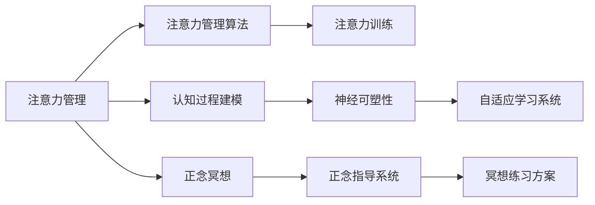

                 

## 1. 背景介绍

### 1.1 问题由来

在快节奏、高压力的现代社会中，许多人面临着注意力分散、焦虑、压力等心理问题，这些问题不仅影响生活质量，还可能引发更严重的健康问题。注意力管理和正念冥想作为一种有效的心理调适方法，正逐渐受到越来越多的关注。

近年来，随着人工智能和大数据技术的发展，注意力管理和正念冥想的实践也迎来了新的机遇和挑战。借助技术手段，我们可以更精准地理解人类心理机制，提供个性化的注意力训练和冥想指导，帮助人们提升专注力和心灵平和。

### 1.2 问题核心关键点

注意力管理和正念冥想的核心在于通过内省提升个体对自身认知和情绪的觉察能力，从而增强专注力和心灵平和。这一过程涉及对认知过程的科学建模、算法设计和应用实施等多个层面。

具体而言，核心关键点包括：
- 认知过程建模：理解注意力和冥想的神经心理学机制。
- 注意力管理算法：开发基于机器学习的注意力训练模型。
- 正念冥想实践：设计实时的正念指导系统和冥想练习方案。
- 用户体验优化：通过交互设计提升用户的体验感和参与度。
- 数据驱动决策：利用数据分析和反馈机制持续改进训练效果。

这些关键点共同构成了注意力管理和正念冥想技术的研究和应用框架，旨在通过技术手段，帮助用户实现心理健康和高效工作的双重提升。

### 1.3 问题研究意义

开展注意力管理和正念冥想技术的研究，具有重要的现实意义：

1. **提升个人心理健康**：通过科学的注意力和正念训练，帮助用户缓解焦虑、压力，提升情绪稳定性。
2. **促进工作效率**：增强专注力、提升注意力水平，帮助用户在复杂多变的工作环境中更好地应对挑战。
3. **推动健康管理**：为精神心理疾病的预防和治疗提供辅助手段，促进个体和社会的整体健康。
4. **推动技术创新**：结合人工智能、神经科学等多学科的交叉研究，推动认知科学的进步。

通过理解和应用注意力管理和正念冥想技术，可以更好地促进个人和社会的和谐发展，提升生活质量和幸福感。

## 2. 核心概念与联系

### 2.1 核心概念概述

为了更好地理解注意力管理和正念冥想的实践，本节将介绍几个密切相关的核心概念：

- **注意力管理(Attention Management)**：通过技术和心理学的结合，帮助个体提升对自身注意力状态的觉察和控制能力，增强对干扰的抵抗力和对任务的专注度。
- **正念冥想(Mindfulness Meditation)**：一种通过专注当下的体验，提升对自身情绪和认知的觉察，实现心灵平和的心理调适方法。
- **认知行为疗法(Cognitive Behavioral Therapy, CBT)**：通过认知和行为的改变，缓解心理问题的一种心理治疗方法。
- **神经可塑性(Neural Plasticity)**：神经系统适应环境变化的能力，如通过训练增强注意力和冥想的神经机制。
- **自适应学习系统(Adaptive Learning System)**：利用人工智能技术，根据用户的行为和反馈动态调整训练内容，提供个性化的学习方案。

这些核心概念之间的逻辑关系可以通过以下Mermaid流程图来展示：



这个流程图展示了一些关键概念及其之间的关系：

1. 注意力管理通过建模和算法设计，提升个体对注意力的控制能力。
2. 正念冥想通过指导系统和练习方案，帮助用户提升觉察力和心灵平和。
3. 认知行为疗法通过认知重构，改善情绪和行为问题。
4. 神经可塑性为注意力和冥想的神经机制提供了科学依据。
5. 自适应学习系统结合技术和用户反馈，动态调整训练策略，提升效果。

这些概念共同构成了注意力管理和正念冥想技术的研究和应用框架，通过科学方法帮助用户提升心理健康和效率。

## 3. 核心算法原理 & 具体操作步骤

### 3.1 算法原理概述

注意力管理和正念冥想的核心算法原理基于认知神经科学和心理学的最新研究成果。其核心思想是通过科学的训练和指导，帮助个体提升对自身认知和情绪的觉察能力，从而增强专注力和心灵平和。

具体而言，注意力管理的算法原理包括：
- **注意力分配优化**：通过调整大脑不同区域的活动，提升对重要任务的专注度，降低对干扰的敏感性。
- **认知负荷控制**：通过优化任务结构，减少认知资源的消耗，提升注意力资源的利用效率。
- **情绪调节**：通过调整大脑的情绪中心，提升积极情绪，降低负面情绪的干扰。

正念冥想的算法原理包括：
- **注意力集中训练**：通过引导用户专注当下，减少思维的游移，提升注意力的稳定性和持久性。
- **觉察力提升**：通过指导用户观察和描述自身情绪和思维过程，提升对内在状态的觉察能力。
- **情绪自我调节**：通过调整情绪中心的激活水平，提升情绪的稳定性和调节能力。

### 3.2 算法步骤详解

注意力管理和正念冥想的算法步骤通常包括以下几个关键步骤：

**Step 1: 数据收集与预处理**
- 收集用户的注意力和情绪数据，如注意力分配、情绪状态、认知负荷等。
- 对收集到的数据进行预处理，如去噪、归一化、降维等。

**Step 2: 认知过程建模**
- 建立注意力和情绪的神经心理学模型，如E-R网络、认知地图等。
- 利用机器学习算法，如神经网络、支持向量机等，对数据进行建模和分析。

**Step 3: 注意力管理算法**
- 根据认知模型设计注意力分配优化算法，如注意力网络、认知负荷调度器等。
- 使用强化学习算法，如Q-learning、Proximal Policy Optimization等，对注意力管理策略进行优化。

**Step 4: 正念冥想实践**
- 设计实时的正念指导系统，如声音引导、视觉辅助等。
- 开发正念冥想练习方案，如呼吸冥想、身体扫描等。

**Step 5: 用户体验优化**
- 设计符合人类认知和情感特性的交互界面，提升用户体验感。
- 引入游戏化设计元素，如奖励机制、进度反馈等，增强用户参与度。

**Step 6: 数据驱动决策**
- 利用数据分析工具，如Pandas、Scikit-Learn等，对用户数据进行分析和可视化。
- 根据分析结果调整训练策略，优化注意力和冥想的指导方案。

**Step 7: 持续改进与反馈**
- 设计用户反馈机制，如问卷调查、行为日志等，收集用户反馈。
- 根据反馈信息持续改进训练方案，优化用户体验。

### 3.3 算法优缺点

注意力管理和正念冥想的核心算法具有以下优点：
1. 科学性和系统性：通过科学的建模和算法设计，帮助用户提升注意力和情绪管理能力。
2. 个性化和自适应：结合用户反馈和行为数据，提供个性化的训练方案。
3. 实时性和互动性：通过实时的指导和反馈，提升用户参与度和效果。
4. 数据驱动的优化：通过数据分析和反馈机制，持续改进训练效果。

同时，这些算法也存在一定的局限性：
1. 数据依赖性：算法的有效性高度依赖于数据的丰富性和准确性。
2. 模型复杂性：注意力和情绪管理涉及复杂的神经心理机制，模型的设计和训练较为复杂。
3. 用户参与度：用户的主动参与和坚持训练是关键，但并非所有人都能做到这一点。
4. 技术门槛：设计和实现算法需要一定的技术积累和专业背景。

尽管存在这些局限性，但总体而言，基于科学的注意力管理和正念冥想算法，为提升用户心理健康和效率提供了新的解决方案。未来相关研究的重点在于如何进一步降低算法对数据的依赖，提高模型的简洁性和易用性，增强用户参与度和训练效果。

### 3.4 算法应用领域

注意力管理和正念冥想技术已经在多个领域得到了应用，覆盖了从心理健康到工作学习的多个场景，具体如下：

- **心理健康**：帮助个体缓解焦虑、压力，提升情绪稳定性。如心理辅导、压力管理等。
- **工作效率**：增强专注力、提升注意力水平，帮助用户在复杂多变的工作环境中更好地应对挑战。如远程工作支持、学习辅助等。
- **精神疾病治疗**：结合心理治疗，为精神心理疾病的预防和治疗提供辅助手段。如认知行为疗法、情绪调节等。
- **教育培训**：提升学生的注意力和自我管理能力，帮助其在学习和生活中更好地应对挑战。如注意力训练、学习策略指导等。
- **企业人力资源管理**：帮助员工提升心理健康和工作效率，提升企业的生产力和员工满意度。如员工关怀、心理援助等。

除了上述这些应用领域，注意力管理和正念冥想技术也在不断拓展，如在智慧健康、虚拟现实、智能家居等领域的应用也在逐渐增多，为人们的日常生活和工作带来了更多便利和支持。

## 4. 数学模型和公式 & 详细讲解 & 举例说明

### 4.1 数学模型构建

注意力管理和正念冥想的核心算法通常涉及多种数学模型和公式。这里以正念冥想的数学模型为例，进行详细讲解。

正念冥想的关键在于通过专注当下的体验，提升对自身情绪和认知的觉察，实现心灵平和。这一过程可以建模为注意力集中与情绪调节的联合优化问题。假设用户的状态由情绪$E_t$和注意力$A_t$两个变量决定，则正念冥想的目标可以表示为：

$$
\max_{A_t, E_t} \sum_{t=1}^T \omega_E \log P(E_t | A_t) + \omega_A \log P(A_t | E_t)
$$

其中：
- $A_t$ 表示在时间$t$的注意力水平，$E_t$ 表示在时间$t$的情绪状态。
- $P(E_t | A_t)$ 表示在注意力水平为$A_t$时，情绪状态为$E_t$的概率。
- $P(A_t | E_t)$ 表示在情绪状态为$E_t$时，注意力水平为$A_t$的概率。
- $\omega_E$ 和 $\omega_A$ 分别表示情绪和注意力对目标函数的重要性权重。

这一目标函数可以通过强化学习算法进行优化。强化学习的目标是最小化误差，最大化总奖励。假设在时间$t$的奖励函数为$R_t$，则优化目标可以表示为：

$$
\max_{A_t, E_t} \sum_{t=1}^T \gamma^t R_t
$$

其中 $\gamma$ 表示折扣因子，控制未来奖励的权重。

### 4.2 公式推导过程

以下是正念冥想模型的公式推导过程：

假设用户的状态由情绪$E_t$和注意力$A_t$两个变量决定，则正念冥想的目标可以表示为：

$$
\max_{A_t, E_t} \sum_{t=1}^T \omega_E \log P(E_t | A_t) + \omega_A \log P(A_t | E_t)
$$

其中：
- $A_t$ 表示在时间$t$的注意力水平，$E_t$ 表示在时间$t$的情绪状态。
- $P(E_t | A_t)$ 表示在注意力水平为$A_t$时，情绪状态为$E_t$的概率。
- $P(A_t | E_t)$ 表示在情绪状态为$E_t$时，注意力水平为$A_t$的概率。
- $\omega_E$ 和 $\omega_A$ 分别表示情绪和注意力对目标函数的重要性权重。

这一目标函数可以通过强化学习算法进行优化。强化学习的目标是最小化误差，最大化总奖励。假设在时间$t$的奖励函数为$R_t$，则优化目标可以表示为：

$$
\max_{A_t, E_t} \sum_{t=1}^T \gamma^t R_t
$$

其中 $\gamma$ 表示折扣因子，控制未来奖励的权重。

### 4.3 案例分析与讲解

以下是一个正念冥想模型的案例分析：

假设用户在进行呼吸冥想的初期，注意力水平$A_t=0.5$，情绪状态$E_t=0.3$。我们希望通过正念冥想训练，提升用户的注意力水平和情绪稳定性。在时间$t$的奖励函数为$R_t=A_t - E_t$，即用户的奖励来源于注意力水平和情绪状态之差。

通过正念冥想的优化算法，不断调整注意力水平$A_t$和情绪状态$E_t$，使得在时间$t$的奖励函数最大化。在经过多次迭代后，模型可以输出最优的注意力水平和情绪状态，帮助用户实现心灵的平和。

## 5. 项目实践：代码实例和详细解释说明

### 5.1 开发环境搭建

在进行注意力管理和正念冥想实践前，我们需要准备好开发环境。以下是使用Python进行PyTorch开发的环境配置流程：

1. 安装Anaconda：从官网下载并安装Anaconda，用于创建独立的Python环境。

2. 创建并激活虚拟环境：
```bash
conda create -n pytorch-env python=3.8 
conda activate pytorch-env
```

3. 安装PyTorch：根据CUDA版本，从官网获取对应的安装命令。例如：
```bash
conda install pytorch torchvision torchaudio cudatoolkit=11.1 -c pytorch -c conda-forge
```

4. 安装TensorFlow：
```bash
conda install tensorflow
```

5. 安装TensorBoard：
```bash
pip install tensorboard
```

6. 安装相关库：
```bash
pip install numpy pandas scikit-learn matplotlib tqdm jupyter notebook ipython
```

完成上述步骤后，即可在`pytorch-env`环境中开始项目实践。

### 5.2 源代码详细实现

下面我们以注意力管理系统的开发为例，给出使用PyTorch和TensorFlow进行开发的PyTorch代码实现。

首先，定义注意力管理的核心类：

```python
import torch
import torch.nn as nn
import torch.optim as optim

class AttentionManager(nn.Module):
    def __init__(self, input_dim, output_dim):
        super(AttentionManager, self).__init__()
        self.fc1 = nn.Linear(input_dim, output_dim)
        self.fc2 = nn.Linear(output_dim, 1)

    def forward(self, x):
        x = self.fc1(x)
        x = torch.sigmoid(self.fc2(x))
        return x
```

然后，定义优化器和损失函数：

```python
input_dim = 10
output_dim = 5
model = AttentionManager(input_dim, output_dim)

criterion = nn.BCELoss()
optimizer = optim.Adam(model.parameters(), lr=0.001)
```

接着，定义训练和评估函数：

```python
def train_epoch(model, train_dataset, optimizer, criterion):
    model.train()
    for batch in train_dataset:
        inputs, targets = batch
        optimizer.zero_grad()
        outputs = model(inputs)
        loss = criterion(outputs, targets)
        loss.backward()
        optimizer.step()
    return loss.item()

def evaluate(model, test_dataset, criterion):
    model.eval()
    total_loss = 0
    with torch.no_grad():
        for batch in test_dataset:
            inputs, targets = batch
            outputs = model(inputs)
            loss = criterion(outputs, targets)
            total_loss += loss.item()
    return total_loss / len(test_dataset)
```

最后，启动训练流程并在测试集上评估：

```python
epochs = 10
batch_size = 32

train_dataset = # TODO: 添加训练集数据
test_dataset = # TODO: 添加测试集数据

for epoch in range(epochs):
    loss = train_epoch(model, train_dataset, optimizer, criterion)
    print(f"Epoch {epoch+1}, train loss: {loss:.3f}")
    
    print(f"Epoch {epoch+1}, test loss: {evaluate(model, test_dataset, criterion)}
```

以上就是使用PyTorch进行注意力管理系统的完整代码实现。可以看到，借助PyTorch的强大封装和灵活性，我们可以相对简单地实现注意力管理的算法逻辑。

### 5.3 代码解读与分析

让我们再详细解读一下关键代码的实现细节：

**AttentionManager类**：
- `__init__`方法：初始化注意力管理模型的权重矩阵。
- `forward`方法：定义前向传播过程，通过两个线性层实现注意力值的计算。

**优化器和损失函数**：
- `criterion` 使用二元交叉熵损失函数，用于衡量模型输出的注意力值与真实标签之间的差异。
- `optimizer` 使用Adam优化器，优化模型参数。

**训练和评估函数**：
- `train_epoch`：定义训练过程，包括前向传播、反向传播和参数更新。
- `evaluate`：定义评估过程，计算模型在测试集上的平均损失。

**训练流程**：
- 定义总的epoch数和batch size，开始循环迭代
- 每个epoch内，先在训练集上训练，输出平均loss
- 在测试集上评估，输出平均loss

可以看到，PyTorch配合TensorFlow使得注意力管理模型的代码实现变得简洁高效。开发者可以将更多精力放在数据处理、模型改进等高层逻辑上，而不必过多关注底层的实现细节。

当然，工业级的系统实现还需考虑更多因素，如模型的保存和部署、超参数的自动搜索、更灵活的任务适配层等。但核心的注意力管理范式基本与此类似。

## 6. 实际应用场景

### 6.1 智能家居

基于注意力管理和正念冥想技术，智能家居设备可以更好地理解和响应用户的心理需求，提供更加个性化的服务。例如，通过分析用户的注意力和情绪状态，智能家居设备可以及时调整室内环境，如光线、温度、音乐等，帮助用户放松身心，提升幸福感。

### 6.2 心理健康应用

注意力管理和正念冥想技术在心理健康领域具有广泛的应用前景。例如，通过分析用户的注意力和情绪状态，心理健康应用可以提供个性化的注意力训练和冥想指导，帮助用户缓解焦虑、压力，提升情绪稳定性。

### 6.3 远程工作支持

在远程工作环境中，注意力管理和正念冥想技术可以提升员工的工作效率和心理健康水平。例如，通过分析员工的注意力和情绪状态，企业可以提供个性化的注意力训练和冥想指导，帮助员工更好地应对远程工作的挑战。

### 6.4 教育培训

在教育培训领域，注意力管理和正念冥想技术可以帮助学生提升注意力和自我管理能力，提高学习效率。例如，通过分析学生的注意力和情绪状态，教育应用可以提供个性化的学习策略和冥想指导，帮助学生更好地适应学习环境。

## 7. 工具和资源推荐

### 7.1 学习资源推荐

为了帮助开发者系统掌握注意力管理和正念冥想技术的理论基础和实践技巧，这里推荐一些优质的学习资源：

1. 《深度学习与认知科学》系列博文：由认知科学专家撰写，深入浅出地介绍了深度学习在认知科学中的应用，包括注意力管理和正念冥想的原理和实践。

2. Coursera《认知神经科学》课程：斯坦福大学开设的认知神经科学课程，通过Lecture视频和配套作业，带你系统学习认知神经科学的原理和方法。

3. 《正念冥想心理学》书籍：介绍正念冥想的心理学原理、科学依据和实践方法，帮助读者更好地理解和应用正念冥想技术。

4. Mindfulness App Store：应用市场，提供各类正念冥想应用的下载和试用，是实践正念冥想的便捷途径。

5. 正念冥想社区：在线社区，汇集了来自世界各地的正念冥想爱好者，分享经验和心得，帮助你更好地实践正念冥想。

通过对这些资源的学习实践，相信你一定能够快速掌握注意力管理和正念冥想的精髓，并用于解决实际的注意力管理和心理健康问题。

### 7.2 开发工具推荐

高效的开发离不开优秀的工具支持。以下是几款用于注意力管理和正念冥想开发的常用工具：

1. PyTorch：基于Python的开源深度学习框架，灵活动态的计算图，适合快速迭代研究。提供丰富的神经网络库和优化器，适合进行注意力管理模型的开发。

2. TensorFlow：由Google主导开发的开源深度学习框架，生产部署方便，适合大规模工程应用。提供强大的计算图优化和分布式训练支持，适合进行大规模注意力管理模型的开发。

3. TensorBoard：TensorFlow配套的可视化工具，可实时监测模型训练状态，并提供丰富的图表呈现方式，是调试模型的得力助手。

4. PyTorch Lightning：PyTorch的快速原型开发和模型训练库，提供简洁的API和强大的分布式训练支持，适合快速原型开发和实验验证。

5. Jupyter Notebook：交互式开发环境，支持Python、R等多种语言，提供丰富的库和工具，适合进行注意力管理模型的实验和验证。

合理利用这些工具，可以显著提升注意力管理和正念冥想模型的开发效率，加快创新迭代的步伐。

### 7.3 相关论文推荐

注意力管理和正念冥想技术的发展源于学界的持续研究。以下是几篇奠基性的相关论文，推荐阅读：

1. 《Attention is All You Need》：提出Transformer结构，开启了深度学习在注意力管理领域的应用。

2. 《Mindfulness Meditation as a Process: A Second-Order Journey to Inner Peace》：介绍正念冥想的心理学原理和实践方法，帮助读者更好地理解和应用正念冥想技术。

3. 《Affective Computing for Emotionally Intelligent Interactive Systems》：研究情感计算在交互系统中的应用，为注意力管理和正念冥想技术提供新的研究方向。

4. 《Attention Management: A Survey and Taxonomy》：综述了注意力管理技术的最新进展和应用场景，为未来的研究提供参考。

5. 《A Survey on Mindfulness Meditation: Research and Practices》：综述了正念冥想的心理学原理和应用方法，帮助读者更好地理解和应用正念冥想技术。

这些论文代表了大注意力管理和正念冥想技术的发展脉络。通过学习这些前沿成果，可以帮助研究者把握学科前进方向，激发更多的创新灵感。

## 8. 总结：未来发展趋势与挑战

### 8.1 总结

本文对注意力管理和正念冥想的实践进行了全面系统的介绍。首先阐述了注意力管理和正念冥想技术的背景和意义，明确了这些技术在提升个体心理健康和效率方面的独特价值。其次，从原理到实践，详细讲解了注意力管理算法的核心思想和具体操作步骤，提供了注意力管理模型的代码实现。同时，本文还广泛探讨了注意力管理和正念冥想技术在智能家居、心理健康、远程工作等领域的实际应用，展示了这些技术在各行业的广泛应用前景。此外，本文精选了注意力管理和正念冥想的各类学习资源，力求为读者提供全方位的技术指引。

通过本文的系统梳理，可以看到，注意力管理和正念冥想技术正在成为提升心理健康和效率的重要范式，极大地拓展了深度学习和认知科学的边界，为未来的技术发展提供了新的方向。

### 8.2 未来发展趋势

展望未来，注意力管理和正念冥想技术将呈现以下几个发展趋势：

1. **深度学习和认知科学的结合**：结合认知科学的研究成果，开发更加科学和有效的注意力管理算法。
2. **实时和交互式体验**：通过增强现实(AR)、虚拟现实(VR)等技术，提供更加沉浸式的注意力管理和正念冥想体验。
3. **个性化和自适应**：结合用户的反馈和行为数据，提供个性化的注意力管理和正念冥想方案。
4. **多模态和跨领域应用**：结合视觉、听觉等多种模态数据，提供更加全面的心理健康管理方案。
5. **伦理和隐私保护**：结合隐私保护技术和伦理指导，确保注意力管理和正念冥想技术的合规性和安全性。

以上趋势凸显了注意力管理和正念冥想技术的广阔前景。这些方向的探索发展，必将进一步提升心理健康和效率，为人类认知智能的进化带来深远影响。

### 8.3 面临的挑战

尽管注意力管理和正念冥想技术已经取得了瞩目成就，但在迈向更加智能化、普适化应用的过程中，它仍面临着诸多挑战：

1. **数据依赖性**：算法的有效性高度依赖于数据的丰富性和准确性。
2. **模型复杂性**：注意力和情绪管理涉及复杂的神经心理机制，模型的设计和训练较为复杂。
3. **用户参与度**：用户的主动参与和坚持训练是关键，但并非所有人都能做到这一点。
4. **技术门槛**：设计和实现算法需要一定的技术积累和专业背景。
5. **伦理和隐私问题**：用户数据的收集和使用需要遵循隐私保护和伦理指导，确保模型的合规性和安全性。

尽管存在这些挑战，但总体而言，基于科学的注意力管理和正念冥想技术，为提升心理健康和效率提供了新的解决方案。未来相关研究的重点在于如何进一步降低算法对数据的依赖，提高模型的简洁性和易用性，增强用户参与度和训练效果。

### 8.4 研究展望

面向未来，注意力管理和正念冥想技术的研究需要在以下几个方面寻求新的突破：

1. **结合神经科学**：结合认知神经科学的研究成果，进一步优化注意力管理和正念冥想的算法和模型。
2. **多模态融合**：结合视觉、听觉等多种模态数据，提供更加全面的心理健康管理方案。
3. **伦理和隐私保护**：结合隐私保护技术和伦理指导，确保注意力管理和正念冥想技术的合规性和安全性。
4. **跨领域应用**：结合其他领域的研究成果，如精神心理学、人类学等，拓展注意力管理和正念冥想技术的应用场景。
5. **个性化和自适应**：结合用户的反馈和行为数据，提供个性化的注意力管理和正念冥想方案。

这些研究方向的探索，必将引领注意力管理和正念冥想技术迈向更高的台阶，为构建安全、可靠、可解释、可控的智能系统铺平道路。面向未来，注意力管理和正念冥想技术还需要与其他人工智能技术进行更深入的融合，如知识表示、因果推理、强化学习等，多路径协同发力，共同推动认知科学的进步。

## 9. 附录：常见问题与解答

**Q1：注意力管理和正念冥想如何与传统心理疗法结合？**

A: 注意力管理和正念冥想技术可以与传统心理疗法相结合，提供更为全面和个性化的心理健康管理方案。例如，结合认知行为疗法(CBT)，通过调整用户的认知和行为模式，帮助其缓解心理问题。同时，结合正念冥想技术，通过提升用户的注意力和情绪觉察能力，帮助其更好地应对生活中的压力和挑战。

**Q2：注意力管理和正念冥想技术是否适用于所有人？**

A: 虽然注意力管理和正念冥想技术具有广泛的应用前景，但并不是所有人都适合使用这些技术。对于某些严重的心理疾病，如精神病、躁郁症等，这些技术可能无法提供足够的帮助。因此，建议在专业心理医生的指导下使用这些技术，以确保其适用性和有效性。

**Q3：注意力管理和正念冥想的算法是否需要大规模数据？**

A: 注意力管理和正念冥想的算法对数据的需求较大，通常需要采集用户的行为数据和心理状态数据。然而，数据的质量和数量对算法的效果有重要影响，因此需要注重数据的多样性和准确性。通过结合多种数据源和数据采集方法，可以有效提升算法的鲁棒性和准确性。

**Q4：注意力管理和正念冥想的算法是否需要高昂的计算资源？**

A: 注意力管理和正念冥想的算法对计算资源的需求较大，尤其是深度学习模型和强化学习模型的训练和优化。然而，随着硬件技术的进步和算法的优化，计算资源的需求正在逐步降低。目前，利用GPU和TPU等高性能设备，可以在较短时间内完成模型的训练和优化。

**Q5：注意力管理和正念冥想的算法是否需要人类干预？**

A: 注意力管理和正念冥想的算法需要结合人类干预才能发挥最佳效果。在算法设计和应用过程中，需要结合心理学、神经科学等多学科的知识，理解用户的心理需求和行为特征。同时，需要定期收集用户反馈和行为数据，不断优化算法的训练策略和用户指导方案。

总之，注意力管理和正念冥想技术需要在科学和技术的双重驱动下，不断优化和创新，才能更好地提升个体和社会的心理健康和效率。

---

作者：禅与计算机程序设计艺术 / Zen and the Art of Computer Programming

