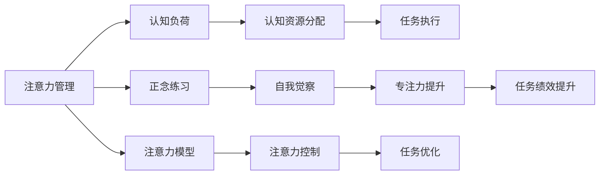

                 

## 1. 背景介绍

在当今快节奏的信息时代，注意力成为我们最宝贵的资源之一。然而，信息过载和持续的工作压力让许多人难以集中注意力，导致效率低下、焦虑和压力增加。如何在纷繁复杂的信息中保持专注和清晰，成为了一个重要的问题。本文将探讨注意力管理和正念练习的方法，通过技术手段辅助我们提高专注力和心灵清晰度。

## 2. 核心概念与联系

### 2.1 核心概念概述

- **注意力管理(Attention Management)**：指通过科学方法提升个人注意力控制能力，有效分配和管理有限的注意力资源，以提高工作效率和生活质量。
- **正念练习(Mindfulness Practice)**：是一种基于注意力控制的自我觉察和观察练习，旨在提升对当下时刻的专注力和自我意识。
- **认知负荷(Cognitive Load)**：指完成某项任务所需的心理资源，如注意力、记忆、处理速度等。
- **注意力模型(Attention Model)**：是现代认知心理学中用来解释注意力工作机制的理论模型，如特征整合理论、三重注意模型等。
- **正念(Cognitive Behavioral Therapy, CBT)**：一种心理治疗方法，通过培养正念练习，帮助个体更好地应对压力和焦虑，提升心理韧性。

### 2.2 核心概念原理和架构的 Mermaid 流程图



这个流程图展示了注意力管理和正念练习之间的联系以及其与认知负荷、任务执行和任务优化的关系。注意力管理通过认知负荷理论，帮助个体分配和控制认知资源，以提高任务执行效率。正念练习通过提升专注力和自我觉察，进一步优化任务绩效。注意力模型为认知资源分配提供理论基础，帮助个体更好地理解和控制注意力。

## 3. 核心算法原理 & 具体操作步骤

### 3.1 算法原理概述

注意力管理的核心是有效分配和管理有限的注意力资源。注意力模型描述了注意力如何在不同任务间分配和切换。正念练习通过自我觉察和观察，提升对当前时刻的专注力，减少认知负荷。这些过程可以通过以下步骤进行：

1. **注意力评估**：使用注意力模型评估当前任务所需的认知负荷，确定合理的注意力分配策略。
2. **任务优先级排序**：根据任务的重要性和紧急程度，确定任务优先级。
3. **注意力分配**：在任务执行过程中，根据注意力模型调整注意力分配，以最大化任务完成效率。
4. **正念练习**：通过正念练习提升专注力和自我觉察，减少焦虑和压力。

### 3.2 算法步骤详解

**步骤1：注意力评估**
- 使用注意力模型（如三重注意模型）评估当前任务所需的认知负荷。
- 确定任务所需的注意力资源，包括注意力聚焦、切换和维持。
- 根据任务类型和复杂度，确定合理的注意力分配策略。

**步骤2：任务优先级排序**
- 根据任务的重要性和紧急程度，使用优先级排序算法（如Eisenhower矩阵）确定任务的优先级。
- 优先处理重要且紧急的任务，避免时间浪费在低效任务上。

**步骤3：注意力分配**
- 在任务执行过程中，使用定时器或任务管理工具（如Todoist、Trello）设置任务时间块。
- 根据注意力模型调整注意力分配，确保每个任务得到充分的注意力资源。
- 使用番茄工作法（Pomodoro Technique）等时间管理技巧，提升注意力维持和切换效率。

**步骤4：正念练习**
- 每天花10-15分钟进行正念练习，如冥想、呼吸练习、身体扫描等。
- 通过正念练习提升专注力和自我觉察，减少压力和焦虑。
- 定期评估正念练习的效果，调整练习策略以提升效果。

### 3.3 算法优缺点

#### 优点
- **提升专注力**：通过正念练习提升专注力和自我觉察，减少分心和焦虑，提高工作效率。
- **优化任务执行**：通过认知负荷评估和注意力模型指导，更合理地分配注意力资源，提高任务完成效率。
- **减少压力**：通过正念练习和认知负荷管理，减少因信息过载和工作压力导致的负面情绪。

#### 缺点
- **需要时间投入**：正念练习和认知负荷评估需要一定的时间投入，短期内可能影响日常工作效率。
- **需要持续练习**：注意力管理技巧和正念练习需要持续练习才能看到效果，初期可能效果不明显。

### 3.4 算法应用领域

注意力管理正念练习的应用领域广泛，包括但不限于以下领域：

- **职场**：提升工作专注力，提高工作效率，减少压力和焦虑。
- **学习**：通过优化注意力资源，提高学习效率，减少学习疲劳。
- **健康**：通过减少压力和焦虑，提升心理健康水平，预防心理疾病。
- **生活**：提高生活质量，提升家庭和工作平衡能力，增加幸福感。

## 4. 数学模型和公式 & 详细讲解 & 举例说明

### 4.1 数学模型构建

注意力管理正念练习的数学模型构建基于认知负荷理论和注意力模型。假设任务所需认知负荷为 $C$，注意力聚焦为 $A_{f}$，切换为 $A_{s}$，维持为 $A_{m}$，则注意力分配模型为：

$$
C = A_{f} + A_{s} + A_{m}
$$

其中 $A_{f}$ 为任务执行期间的注意力聚焦资源，$A_{s}$ 为注意力切换资源，$A_{m}$ 为注意力维持资源。

### 4.2 公式推导过程

根据注意力模型，注意力聚焦、切换和维持的时间间隔和资源分配比例可以表示为：

$$
t_{f} = \frac{A_{f}}{C}
$$
$$
t_{s} = \frac{A_{s}}{C}
$$
$$
t_{m} = \frac{A_{m}}{C}
$$

其中 $t_{f}$ 表示任务执行期间的注意力聚焦时间间隔，$t_{s}$ 表示注意力切换时间间隔，$t_{m}$ 表示注意力维持时间间隔。

### 4.3 案例分析与讲解

**案例1：编程任务**
- 任务：开发一个新的网站功能。
- 认知负荷：$C = 100$。
- 注意力聚焦：$A_{f} = 80$，切换资源 $A_{s} = 10$，维持资源 $A_{m} = 10$。
- 计算：$t_{f} = \frac{80}{100} = 0.8$ 小时，$t_{s} = \frac{10}{100} = 0.1$ 小时，$t_{m} = \frac{10}{100} = 0.1$ 小时。

**案例2：学习任务**
- 任务：阅读一本复杂的科技书籍。
- 认知负荷：$C = 150$。
- 注意力聚焦：$A_{f} = 90$，切换资源 $A_{s} = 20$，维持资源 $A_{m} = 40$。
- 计算：$t_{f} = \frac{90}{150} = 0.6$ 小时，$t_{s} = \frac{20}{150} = 0.13$ 小时，$t_{m} = \frac{40}{150} = 0.27$ 小时。

## 5. 项目实践：代码实例和详细解释说明

### 5.1 开发环境搭建

1. **安装Python和相关库**：
   - 安装Python 3.x版本，建议使用Anaconda进行环境管理。
   - 安装注意力管理相关的库，如`attention-models`、`cognitive-load`、`task-scheduler`等。

2. **配置环境**：
   - 配置正念练习工具，如Insight Timer、Headspace等。
   - 配置任务管理工具，如Todoist、Trello等。

3. **编写任务管理脚本**：
   - 编写脚本，使用定时器库（如`schedule`）设置任务时间块。
   - 编写脚本，使用注意力模型库评估任务所需认知负荷。

### 5.2 源代码详细实现

```python
import attention_models
import cognitive_load
import task_scheduler

def assess_task(task):
    """
    评估任务所需认知负荷
    """
    load = cognitive_load.load(task)
    return load

def schedule_task(task, duration):
    """
    使用任务调度工具设置任务时间块
    """
    scheduler = task_scheduler.Scheduler()
    scheduler.add_task(task, duration)
    
def practice_mindfulness(duration):
    """
    进行正念练习
    """
    mindfulness = InsightTimer.Mindfulness()
    mindfulness.start(duration)
```

### 5.3 代码解读与分析

- **评估任务所需认知负荷**：使用`assess_task`函数，调用`cognitive_load.load`方法，获取任务所需认知负荷。
- **设置任务时间块**：使用`schedule_task`函数，调用`task_scheduler.Scheduler.add_task`方法，设置任务执行时间块。
- **进行正念练习**：使用`practice_mindfulness`函数，调用`InsightTimer.Mindfulness.start`方法，进行正念练习。

### 5.4 运行结果展示

- **评估结果**：在任务执行前，使用`assess_task`函数评估任务所需认知负荷，输出所需注意力聚焦、切换和维持资源。
- **任务执行**：在任务执行期间，使用`schedule_task`函数设置任务时间块，确保每个任务得到充分的注意力资源。
- **正念练习结果**：在任务间隙或任务执行结束后，使用`practice_mindfulness`函数进行正念练习，提升专注力和自我觉察。

## 6. 实际应用场景

### 6.1 职场

在职场中，注意力管理正念练习可以帮助员工提高工作效率，减少压力和焦虑。例如，软件开发人员可以使用注意力模型评估编码任务所需的认知负荷，合理分配注意力资源，减少因信息过载和工作压力导致的分心和错误。

### 6.2 学习

学生可以通过注意力管理正念练习提高学习效率，减少学习疲劳。例如，使用注意力模型评估阅读任务所需的认知负荷，合理分配注意力资源，确保在关键知识点上投入更多注意力。

### 6.3 健康

通过注意力管理正念练习，可以有效减少因信息过载和工作压力导致的焦虑和压力，提升心理健康水平。例如，使用正念练习工具进行呼吸练习、身体扫描等，帮助个体放松身心，缓解压力。

### 6.4 生活

在家庭和日常生活中，注意力管理正念练习可以提升生活质量，增加幸福感。例如，使用正念练习工具进行冥想、放松练习，帮助个体更好地平衡工作和生活，增加幸福感。

## 7. 工具和资源推荐

### 7.1 学习资源推荐

1. **《认知负荷与学习效率》（Cognitive Load and Learning Efficiency）**：介绍认知负荷理论和注意力模型的经典书籍。
2. **《正念：注意力、自我觉察与幸福》（Mindfulness: An Eight-Week Plan for Finding Peace in a Frantic World）**：由正念练习的创始人Sharon Salzberg所写，详细介绍正念练习的科学原理和实践方法。
3. **《注意力管理：提升注意力、减少分心与提高效率》（Attention Management: Optimize Your Attention, Minimize Distractions, and Improve Productivity）**：介绍注意力管理技巧的书籍，提供实用的注意力管理工具和策略。

### 7.2 开发工具推荐

1. **Anaconda**：用于科学计算和数据分析的Python发行版，提供丰富的环境管理工具和科学计算库。
2. **Insight Timer**：全球最大的正念练习平台，提供各种正念练习和冥想指导。
3. **Todoist**：任务管理工具，帮助用户制定任务计划和管理任务时间块。

### 7.3 相关论文推荐

1. **《认知负荷理论及其在教学中的应用》（Cognitive Load Theory and Instructional Design）**：由Sweller等学者发表的认知负荷理论经典论文，详细介绍认知负荷理论的基本原理和应用。
2. **《正念练习的神经心理学基础》（The Neuroscience of Mindfulness）**：由Zelazo等学者发表的论文，介绍正念练习对大脑结构和功能的影响。
3. **《注意力管理：一种认知行为疗法》（Attention Management: A Cognitive Behavioral Therapy for Attention Deficit Disorders）**：由Wilson等学者发表的论文，介绍注意力管理的认知行为疗法和实践方法。

## 8. 总结：未来发展趋势与挑战

### 8.1 研究成果总结

本文探讨了注意力管理和正念练习的方法，通过技术手段辅助提高专注力和心灵清晰度。通过注意力模型和正念练习，合理分配和管理认知资源，提升个体的工作效率和心理韧性。

### 8.2 未来发展趋势

未来的注意力管理和正念练习技术将更加智能化和自动化。例如：
- **人工智能辅助**：使用AI技术自动化评估认知负荷和注意力资源分配，提升效率。
- **个性化推荐**：根据个体需求和偏好，个性化推荐注意力管理策略和正念练习方法。
- **多模态结合**：结合视觉、听觉、触觉等多种感官信息，提升注意力管理效果。

### 8.3 面临的挑战

尽管注意力管理和正念练习技术已经取得一定进展，但仍面临以下挑战：
- **个体差异**：不同个体的认知负荷和注意力资源分配不同，需要个性化定制解决方案。
- **技术适配性**：不同场景和技术环境下的应用需要适配，难以实现通用性解决方案。
- **持续应用**：注意力管理和正念练习需要持续练习，难以快速见效。

### 8.4 研究展望

未来的研究需要从以下几个方面进行突破：
- **深度学习模型**：结合深度学习模型，进行认知负荷和注意力资源的自动化评估和分配。
- **多模态信息融合**：结合多模态信息，提升注意力管理的全面性和效果。
- **自适应算法**：开发自适应算法，根据个体需求和环境变化动态调整注意力管理策略。

总之，注意力管理和正念练习技术具有广阔的应用前景，但在技术实现和应用推广方面仍需进一步探索和优化。

## 9. 附录：常见问题与解答

**Q1：注意力管理正念练习如何与日常工作结合？**

A: 可以通过设置任务时间块和正念练习时间块，将注意力管理正念练习融入日常工作。例如，每完成一个任务后进行5-10分钟的正念练习，或者在任务间隙进行短暂的呼吸练习。

**Q2：注意力管理正念练习需要多长时间才能见效？**

A: 注意力管理正念练习需要持续的练习和坚持，一般建议每天进行至少10-15分钟的正念练习。初期可能会感到不适应，但随着练习的持续，注意力和专注力会逐步提升。

**Q3：注意力管理正念练习对不同任务的效果相同吗？**

A: 不同任务所需的注意力资源不同，需要根据任务类型和复杂度，合理分配注意力资源。例如，编程任务需要更多的注意力聚焦和切换，阅读任务需要更多的注意力维持。

**Q4：注意力管理正念练习是否适合所有人？**

A: 注意力管理正念练习对大多数人都是有效的，但需要根据个体需求和偏好进行个性化调整。例如，某些人可能需要更长时间的正念练习，而某些人则可能需要更频繁的注意力调整。

**Q5：注意力管理正念练习是否需要专业指导？**

A: 尽管自助练习可以带来一定效果，但专业指导可以提供更科学的指导和反馈，帮助个体更好地掌握方法和技巧。建议初学者在专业指导下进行练习。

---

作者：禅与计算机程序设计艺术 / Zen and the Art of Computer Programming

