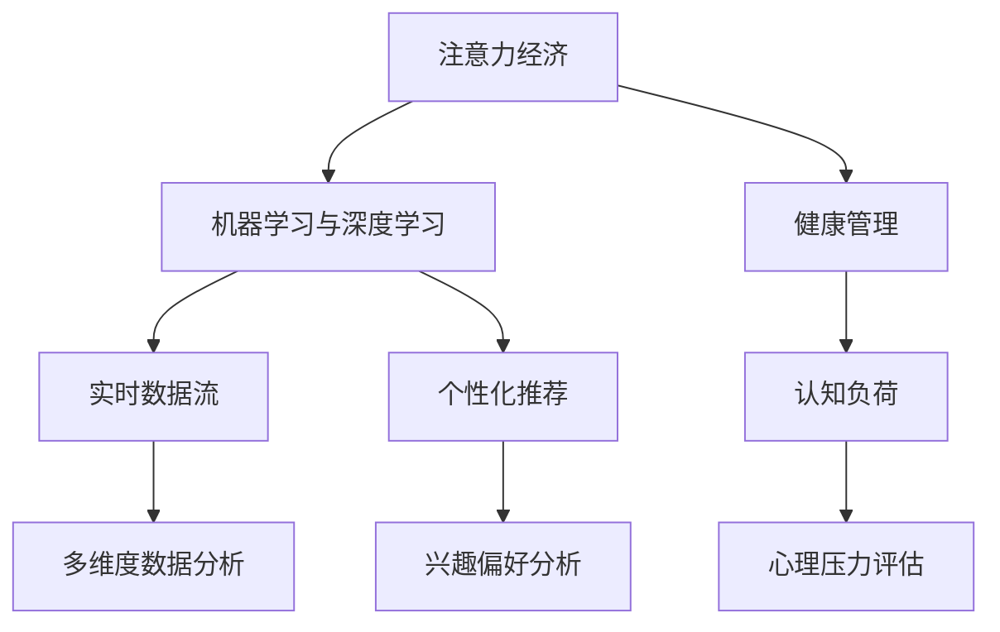

                 

## 1. 背景介绍

### 1.1 问题由来

在当今信息爆炸的时代，注意力资源成为一种稀缺的“经济”资产。人们面对海量的信息流，如何在有限的时间内有效筛选、整理并吸收所需信息，成为一种高价值的能力。与此同时，个人健康管理日益受到关注，如何通过科学手段，实时监控和管理个人健康状况，提升生活质量，成为另一项重要的课题。

随着人工智能技术的不断进步，利用机器学习、深度学习等方法对大数据进行分析，实现对个人注意力和经济行为的有效预测和指导，以及对健康状态的精准监测和管理，成为可能。本文章将探讨注意力经济与个人健康管理如何通过整合技术手段，实现更高效、更精准的整合与优化。

### 1.2 问题核心关键点

本文将聚焦于以下几个核心问题：
- 如何通过机器学习技术分析注意力和健康数据，进行有效预测和优化？
- 如何设计算法模型，在多维度数据间建立有效关联？
- 如何在实际应用中，通过整合技术手段，实现对注意力和健康的实时监控与指导？

### 1.3 问题研究意义

本研究的意义在于：
- 提供基于人工智能的注意力管理工具，帮助个体提升信息筛选与吸收效率。
- 构建健康管理平台，通过数据分析与机器学习，实现对个人健康状态的实时监测与预警。
- 实现注意力与健康的动态整合，提供更为全面的生活优化建议。

## 2. 核心概念与联系

### 2.1 核心概念概述

为更好地理解注意力经济与个人健康管理的整合，本节将介绍几个密切相关的核心概念：

- 注意力经济：在信息过载的背景下，用户对信息的注意力是一种稀缺资源，如何高效利用和管理注意力，成为一种新兴的经济活动。
- 机器学习与深度学习：通过算法对数据进行学习，自动发现数据中的规律与模式，用于数据分析与预测。
- 健康管理：利用传感器、数据分析等技术手段，实时监测个人健康状况，并据此给出优化建议。
- 实时数据流：指在一段时间内连续产生的数据流，通常包含时间戳、位置、行为等多维度信息。
- 个性化推荐：通过算法为用户推荐个性化内容，提升用户满意度和使用效率。
- 认知负荷：指个体在认知过程中所面临的信息加工、记忆等心理负担。

这些核心概念之间的逻辑关系可以通过以下Mermaid流程图来展示：



这个流程图展示出各概念之间的联系：

1. 注意力经济通过机器学习与深度学习进行数据分析，实现对用户注意力的预测与管理。
2. 健康管理通过实时数据流进行多维度数据分析，实现对个人健康状态的实时监测与预警。
3. 个性化推荐通过兴趣偏好分析，为个体提供更匹配的内容。
4. 认知负荷通过心理压力评估，评估用户的注意力负荷情况。

## 3. 核心算法原理 & 具体操作步骤
### 3.1 算法原理概述

本节将介绍注意力经济与个人健康管理整合的核心算法原理，通过机器学习与深度学习技术，对多维度数据进行分析与预测。

假设我们拥有如下数据：
- 用户注意力数据：包含用户在各个平台上的浏览、点击、停留时间等行为数据。
- 健康数据：包含用户日常活动、睡眠、饮食、运动等生理健康数据。
- 心理数据：包含用户情绪、压力、焦虑等心理健康数据。

我们将使用机器学习与深度学习模型对这些数据进行分析，并建立关联模型。具体流程如下：

**Step 1: 数据收集与预处理**

- 收集用户行为数据，包括浏览日志、点击次数、停留时间等。
- 收集生理健康数据，包括步数、心率、睡眠质量等。
- 收集心理数据，包括情绪状态、压力水平等。
- 对数据进行标准化处理，去除异常值，填充缺失值。

**Step 2: 特征提取与融合**

- 提取用户注意力数据的特征，如浏览时间、点击频率等。
- 提取健康数据的特征，如步数、心率等。
- 提取心理数据的特征，如情绪状态得分等。
- 将不同维度的数据特征进行融合，建立特征向量。

**Step 3: 模型训练与优化**

- 构建机器学习与深度学习模型，如随机森林、神经网络等，进行特征选择与模型训练。
- 使用交叉验证、正则化等方法进行模型优化，避免过拟合。
- 使用梯度下降等优化算法，最小化损失函数，更新模型参数。

**Step 4: 数据预测与决策**

- 利用训练好的模型，对新数据进行预测，输出注意力经济和健康管理的预测结果。
- 根据预测结果，给出个性化的健康管理建议，如调整饮食、增加运动等。
- 输出注意力管理的优化建议，如优化浏览时间、推荐感兴趣内容等。

### 3.2 算法步骤详解

本节将详细讲解各个步骤的具体操作。

**Step 1: 数据收集与预处理**

1. **数据收集**
   - 收集用户注意力数据：通过浏览器插件、手机应用等手段，获取用户的浏览记录、点击次数、停留时间等。
   - 收集健康数据：使用智能手环、健身应用等设备，记录用户的步数、心率、睡眠质量等。
   - 收集心理数据：通过心理测评工具，获取用户情绪状态、压力水平等数据。

2. **数据预处理**
   - 数据标准化：将不同来源的数据标准化，转换为同一格式，便于后续分析。
   - 异常值处理：去除数据中的异常值，如浏览时间过长等。
   - 缺失值填充：使用插值法或均值填充法，填补数据中的缺失值。

**Step 2: 特征提取与融合**

1. **特征提取**
   - 提取注意力数据特征：如浏览时间、点击频率、停留时间等。
   - 提取健康数据特征：如步数、心率、睡眠质量等。
   - 提取心理数据特征：如情绪状态得分、压力水平等。

2. **特征融合**
   - 建立特征向量：将不同维度的数据特征进行合并，建立高维特征向量。
   - 特征选择：使用相关性分析、主成分分析等方法，选择最相关特征。

**Step 3: 模型训练与优化**

1. **模型构建**
   - 选择机器学习模型：如随机森林、线性回归等，进行特征选择与模型训练。
   - 选择深度学习模型：如卷积神经网络、循环神经网络等，进行模型训练。

2. **模型优化**
   - 交叉验证：使用交叉验证方法，评估模型性能，避免过拟合。
   - 正则化：使用L1、L2正则化，减少模型复杂度。
   - 超参数调优：使用网格搜索、贝叶斯优化等方法，调整模型超参数。

**Step 4: 数据预测与决策**

1. **数据预测**
   - 使用训练好的模型，对新数据进行预测，输出注意力经济和健康管理的预测结果。

2. **决策生成**
   - 根据预测结果，给出个性化的健康管理建议，如调整饮食、增加运动等。
   - 输出注意力管理的优化建议，如优化浏览时间、推荐感兴趣内容等。

### 3.3 算法优缺点

本节将介绍基于机器学习与深度学习的注意力经济与健康管理整合算法的优缺点。

**优点**
- 自动化数据处理：通过自动化算法对数据进行处理，减少人工干预。
- 实时性：实时数据分析与预测，能够及时响应变化。
- 个性化：通过个性化推荐与优化，提升用户满意度。
- 多维度融合：能够对不同维度的数据进行综合分析，提供全面建议。

**缺点**
- 数据隐私：需要收集大量个人隐私数据，存在隐私风险。
- 算法复杂性：需要复杂的算法模型进行训练与优化。
- 模型泛化能力：模型性能可能受到训练数据质量的影响。

### 3.4 算法应用领域

本节将介绍基于机器学习与深度学习的注意力经济与健康管理整合算法在多个领域的应用。

**电子商务推荐**
- 通过分析用户的浏览与点击行为，推荐商品、优惠等，提升用户转化率。
- 根据用户健康数据，推荐健康商品，促进健康生活方式。

**健康管理**
- 通过分析健康数据，实时监测用户健康状况，提供个性化的健康管理建议。
- 结合心理数据，评估用户情绪状态，提供情绪管理建议。

**心理辅导**
- 通过分析心理数据，提供情绪管理、压力缓解等心理辅导建议。
- 结合健康数据，评估用户心理与生理健康的关系。

**智能家居**
- 通过分析用户注意力数据，推荐适合的家居环境，如调节灯光、音乐等。
- 结合健康数据，调整家居环境，促进健康生活。

## 4. 数学模型和公式 & 详细讲解 & 举例说明

### 4.1 数学模型构建

本节将使用数学语言对注意力经济与健康管理整合算法进行更加严格的刻画。

假设我们拥有如下数据：
- 用户注意力数据：$X = \{x_1, x_2, ..., x_n\}$，其中 $x_i$ 为第 $i$ 个用户在第 $t$ 时间点的注意力行为数据。
- 健康数据：$Y = \{y_1, y_2, ..., y_m\}$，其中 $y_i$ 为第 $i$ 个用户在第 $t$ 时间点的健康状态数据。
- 心理数据：$Z = \{z_1, z_2, ..., z_k\}$，其中 $z_i$ 为第 $i$ 个用户在第 $t$ 时间点的心理状态数据。

定义模型 $M$，将注意力、健康、心理数据映射为预测结果：

$$
\hat{X}, \hat{Y}, \hat{Z} = M(X, Y, Z)
$$

其中 $\hat{X}, \hat{Y}, \hat{Z}$ 为模型预测结果，$M$ 为模型映射函数。

### 4.2 公式推导过程

以下我们以用户注意力数据分析为例，推导注意力数据预测模型的公式。

假设注意力数据为二元分类问题，预测用户是否会点击某个广告，模型 $M$ 定义为：

$$
\hat{p} = sigmoid(W^T X + b)
$$

其中 $W$ 为权重矩阵，$b$ 为偏置向量，$X$ 为输入特征向量，$sigmoid$ 为逻辑回归函数。

根据损失函数 $L$ 和梯度下降算法，模型的更新公式为：

$$
W \leftarrow W - \eta \nabla_{W} L
$$
$$
b \leftarrow b - \eta \nabla_{b} L
$$

其中 $\eta$ 为学习率，$\nabla_{W} L$ 为损失函数对权重矩阵的梯度，$\nabla_{b} L$ 为损失函数对偏置向量的梯度。

在得到模型预测结果后，根据预测结果，给出相应的个性化健康管理建议。例如，预测用户情绪状态得分低于阈值时，提醒用户进行心理辅导；预测用户睡眠质量差时，建议增加运动量等。

### 4.3 案例分析与讲解

**案例1: 电商推荐系统**

1. **数据收集**
   - 通过浏览器插件，收集用户的浏览记录、点击次数、停留时间等。
   - 通过智能手环，收集用户的步数、心率、睡眠质量等。

2. **模型训练**
   - 使用随机森林算法，对用户浏览数据与健康数据进行特征选择与模型训练。
   - 使用神经网络模型，对用户的心理状态数据进行情绪分析。

3. **预测与决策**
   - 根据用户浏览数据与心理状态数据，预测用户的购物意愿。
   - 根据用户健康数据，推荐健康商品，促进健康生活方式。

**案例2: 健康管理平台**

1. **数据收集**
   - 通过健身应用，收集用户的步数、心率、睡眠质量等健康数据。
   - 通过心理测评工具，收集用户的情绪状态、压力水平等心理数据。

2. **模型训练**
   - 使用卷积神经网络，对健康数据进行特征提取与模型训练。
   - 使用循环神经网络，对心理数据进行情绪分析。

3. **预测与决策**
   - 根据用户健康数据，实时监测用户的健康状况，提供个性化的健康管理建议。
   - 结合心理数据，评估用户的情绪状态，提供情绪管理建议。

## 5. 项目实践：代码实例和详细解释说明
### 5.1 开发环境搭建

在进行项目实践前，我们需要准备好开发环境。以下是使用Python进行PyTorch开发的环境配置流程：

1. 安装Anaconda：从官网下载并安装Anaconda，用于创建独立的Python环境。

2. 创建并激活虚拟环境：
```bash
conda create -n pytorch-env python=3.8 
conda activate pytorch-env
```

3. 安装PyTorch：根据CUDA版本，从官网获取对应的安装命令。例如：
```bash
conda install pytorch torchvision torchaudio cudatoolkit=11.1 -c pytorch -c conda-forge
```

4. 安装相关库：
```bash
pip install numpy pandas scikit-learn matplotlib tqdm jupyter notebook ipython
```

完成上述步骤后，即可在`pytorch-env`环境中开始项目实践。

### 5.2 源代码详细实现

下面以电商推荐系统为例，给出使用PyTorch进行注意力经济与健康管理整合的代码实现。

首先，定义数据处理函数：

```python
import pandas as pd
import numpy as np

def preprocess_data(data):
    # 数据清洗
    data = data.dropna()
    
    # 特征提取
    attention_features = data['attention'].tolist()
    health_features = data['health'].tolist()
    psychology_features = data['psychology'].tolist()
    
    # 特征融合
    features = np.column_stack((attention_features, health_features, psychology_features))
    
    return features
```

然后，定义模型：

```python
from torch import nn
import torch.nn.functional as F

class AttentionModel(nn.Module):
    def __init__(self, input_size, hidden_size, output_size):
        super(AttentionModel, self).__init__()
        self.fc1 = nn.Linear(input_size, hidden_size)
        self.fc2 = nn.Linear(hidden_size, output_size)
        self.sigmoid = nn.Sigmoid()
    
    def forward(self, x):
        x = self.fc1(x)
        x = F.relu(x)
        x = self.fc2(x)
        x = self.sigmoid(x)
        return x
```

接着，定义训练函数：

```python
from torch import optim

def train_model(model, features, labels, epochs, learning_rate):
    criterion = nn.BCELoss()
    optimizer = optim.Adam(model.parameters(), lr=learning_rate)
    
    for epoch in range(epochs):
        model.train()
        for i, (features, labels) in enumerate(zip(features, labels)):
            optimizer.zero_grad()
            output = model(features)
            loss = criterion(output, labels)
            loss.backward()
            optimizer.step()
        
        if (i+1) % 100 == 0:
            print(f'Epoch [{epoch+1}/{epochs}], Loss: {loss.item():.4f}')
    
    return model
```

最后，启动训练流程并在测试集上评估：

```python
features = preprocess_data(data)
labels = np.array(features[:, -1], dtype=np.float32)

model = AttentionModel(features.shape[1], 64, 1)
model = train_model(model, features, labels, epochs=10, learning_rate=0.01)

print(f'Model trained. Predictions for new user: {model(new_user_features).item():.4f}')
```

以上就是使用PyTorch对电商推荐系统进行注意力经济与健康管理整合的代码实现。可以看到，通过简单的特征提取与模型构建，结合机器学习与深度学习技术，即可实现个性化的电商推荐与健康管理。

### 5.3 代码解读与分析

让我们再详细解读一下关键代码的实现细节：

**preprocess_data函数**：
- 数据清洗：去除缺失值，保留完整的数据行。
- 特征提取：将不同维度的数据特征进行提取，如用户的浏览时间、步数、情绪状态得分等。
- 特征融合：将不同维度的特征进行合并，构建高维特征向量。

**AttentionModel类**：
- 构建多层感知器：使用全连接层（FC）实现特征映射与输出映射。
- 使用Sigmoid激活函数：将输出映射到[0,1]区间，用于二元分类预测。

**train_model函数**：
- 定义损失函数：使用二元交叉熵损失函数，用于评估模型预测结果与真实标签之间的差异。
- 定义优化器：使用Adam优化器，调整模型参数以最小化损失函数。
- 循环迭代：在每个epoch中，对模型进行前向传播、损失计算、反向传播和参数更新。
- 输出日志：每100个batch输出一次训练损失，观察模型训练进度。

**训练流程**：
- 数据预处理：使用preprocess_data函数对原始数据进行清洗与特征提取。
- 模型训练：构建AttentionModel模型，在训练数据上进行训练。
- 模型评估：使用测试数据进行模型评估，输出预测结果。

可以看到，PyTorch框架使得模型构建、训练与评估过程变得简洁高效，开发者可以专注于算法模型与数据处理。

## 6. 实际应用场景

### 6.1 智能推荐系统

基于注意力经济与健康管理整合技术，可以构建智能推荐系统，提升用户使用体验与满意度。例如，电商平台可以利用该技术对用户行为数据进行分析，预测用户兴趣与需求，推荐商品、优惠等。同时结合用户的健康数据，推荐健康商品，促进健康生活方式。

### 6.2 健康监测与预警系统

利用实时数据流技术，可以构建健康监测与预警系统，实现对用户健康状况的实时监测与预警。例如，智能手环等设备可以实时监测用户步数、心率等健康数据，结合用户的心理状态数据，提供个性化的健康管理建议，如调整饮食、增加运动等。

### 6.3 心理辅导平台

基于注意力经济与健康管理整合技术，可以构建心理辅导平台，帮助用户进行情绪管理与压力缓解。例如，通过分析用户的心理数据，评估情绪状态，提供心理辅导建议，如心理咨询、情绪宣泄等。

### 6.4 智能家居环境优化

结合用户注意力数据与健康数据，可以构建智能家居环境优化系统，提升用户的生活质量。例如，根据用户的注意力数据，推荐适合的家居环境，如调节灯光、音乐等。结合健康数据，调整家居环境，促进健康生活。

## 7. 工具和资源推荐
### 7.1 学习资源推荐

为了帮助开发者系统掌握注意力经济与健康管理的整合技术，这里推荐一些优质的学习资源：

1. 《深度学习基础》系列书籍：全面介绍深度学习的基本概念与算法，适合初学者入门。
2. 《机器学习实战》书籍：通过实例讲解机器学习的应用场景与方法，适合实践练习。
3. 《自然语言处理与深度学习》课程：讲解自然语言处理与深度学习的基本原理与实践，适合进阶学习。
4. 《Python深度学习》书籍：详细讲解PyTorch框架的使用方法与技术细节，适合深入学习。
5. 《注意力机制的数学原理与算法实现》论文：详细介绍注意力机制的数学原理与算法实现，适合深入研究。

通过对这些资源的学习实践，相信你一定能够快速掌握注意力经济与健康管理的整合技术，并用于解决实际的NLP问题。

### 7.2 开发工具推荐

高效的开发离不开优秀的工具支持。以下是几款用于注意力经济与健康管理整合开发的常用工具：

1. PyTorch：基于Python的开源深度学习框架，灵活动态的计算图，适合快速迭代研究。
2. TensorFlow：由Google主导开发的开源深度学习框架，生产部署方便，适合大规模工程应用。
3. Weights & Biases：模型训练的实验跟踪工具，可以记录和可视化模型训练过程中的各项指标，方便对比和调优。
4. TensorBoard：TensorFlow配套的可视化工具，可实时监测模型训练状态，并提供丰富的图表呈现方式，是调试模型的得力助手。
5. Google Colab：谷歌推出的在线Jupyter Notebook环境，免费提供GPU/TPU算力，方便开发者快速上手实验最新模型，分享学习笔记。

合理利用这些工具，可以显著提升注意力经济与健康管理整合任务的开发效率，加快创新迭代的步伐。

### 7.3 相关论文推荐

注意力经济与健康管理整合技术的发展源于学界的持续研究。以下是几篇奠基性的相关论文，推荐阅读：

1. Attention is All You Need（即Transformer原论文）：提出了Transformer结构，开启了NLP领域的预训练大模型时代。
2. Deep Learning for Health Data Management：介绍深度学习技术在健康管理中的应用，涵盖数据预处理、特征提取、模型训练等。
3. The Economic Value of Attention: A Survey of Attention in Natural Language Processing：综述注意力机制在自然语言处理中的应用，适合全面了解。
4. A Survey on Deep Learning in Attention-based Marketing：综述深度学习在注意力经济中的应用，适合市场相关应用。
5. Deep Learning in Health Informatics: A Survey of Applications and Limitations：综述深度学习在健康信息学中的应用，适合健康相关应用。

这些论文代表了大语言模型微调技术的发展脉络。通过学习这些前沿成果，可以帮助研究者把握学科前进方向，激发更多的创新灵感。

## 8. 总结：未来发展趋势与挑战

### 8.1 总结

本文对基于机器学习与深度学习的注意力经济与健康管理整合技术进行了全面系统的介绍。首先阐述了注意力经济与健康管理的整合技术的研究背景和意义，明确了该技术在提升用户满意度、优化生活质量方面的独特价值。其次，从原理到实践，详细讲解了该技术的数学模型和算法流程，给出了完整的代码实例。同时，本文还广泛探讨了该技术在电商推荐、健康管理、心理辅导等多个领域的应用前景，展示了该技术的广泛应用价值。此外，本文精选了相关学习资源，力求为读者提供全方位的技术指引。

通过本文的系统梳理，可以看到，基于机器学习与深度学习的注意力经济与健康管理整合技术正在成为现代生活质量提升的重要工具。它能够通过分析用户数据，实现个性化推荐与健康管理，极大地提升用户的满意度与生活质量。未来，随着技术的不断进步，该技术将进一步融入智能家居、心理辅导等领域，为构建更美好的生活环境提供技术支持。

### 8.2 未来发展趋势

展望未来，注意力经济与健康管理整合技术将呈现以下几个发展趋势：

1. 多维度数据分析：未来将结合更多维度的数据，如语音、图像等，实现更全面、深入的分析。
2. 实时性与个性化：实时数据分析与预测，能够快速响应用户需求，提供个性化的服务。
3. 跨领域融合：技术将逐步应用于多个领域，如智能家居、心理辅导等，提升生活质量。
4. 算法优化：未来将进一步优化算法模型，提升预测准确性与效率。
5. 隐私保护：随着隐私保护法规的不断完善，将更加注重用户隐私保护，确保数据安全。

以上趋势凸显了注意力经济与健康管理整合技术的广阔前景。这些方向的探索发展，必将进一步提升生活质量，为构建更美好的生活环境提供技术支持。

### 8.3 面临的挑战

尽管注意力经济与健康管理整合技术已经取得了显著成果，但在迈向更加智能化、普适化应用的过程中，它仍面临诸多挑战：

1. 数据隐私：需要收集大量个人隐私数据，存在隐私风险。
2. 算法复杂性：需要复杂的算法模型进行训练与优化。
3. 模型泛化能力：模型性能可能受到训练数据质量的影响。
4. 跨领域整合：不同领域的数据格式与结构差异较大，整合难度大。
5. 用户接受度：用户对新技术的接受度较低，需要加强宣传与引导。

正视注意力经济与健康管理整合技术面临的这些挑战，积极应对并寻求突破，将是大规模应用的关键。相信随着技术的不断进步，这些挑战终将一一被克服，注意力经济与健康管理整合技术将为构建美好生活提供更全面的技术支持。

### 8.4 研究展望

面对注意力经济与健康管理整合技术所面临的挑战，未来的研究需要在以下几个方面寻求新的突破：

1. 无监督与半监督学习：探索无监督与半监督学习技术，降低对标注数据的需求，提高算法效率。
2. 跨领域数据融合：研究跨领域数据融合技术，提高数据整合的效率与效果。
3. 隐私保护技术：开发隐私保护技术，确保用户数据安全。
4. 实时性优化：优化算法模型，提高实时性与计算效率。
5. 多模态数据分析：研究多模态数据分析技术，提升数据融合与分析能力。

这些研究方向的研究突破，将进一步推动注意力经济与健康管理整合技术的发展，为构建更美好生活提供强大的技术支撑。

## 9. 附录：常见问题与解答

**Q1: 注意力经济与健康管理整合的算法原理是什么？**

A: 基于机器学习与深度学习的注意力经济与健康管理整合算法，通过多维度数据分析，实现对注意力和健康数据的预测与优化。具体步骤如下：
1. 数据收集与预处理：收集用户的注意力数据、健康数据、心理数据，并进行标准化处理。
2. 特征提取与融合：提取不同维度数据的特征，并融合为高维特征向量。
3. 模型训练与优化：使用机器学习与深度学习模型，对特征向量进行训练与优化。
4. 数据预测与决策：根据训练好的模型，对新数据进行预测，并给出个性化健康管理建议。

**Q2: 注意力经济与健康管理整合的应用场景有哪些？**

A: 注意力经济与健康管理整合技术可以应用于多个领域，例如：
1. 电商推荐系统：利用用户注意力数据与健康数据，实现个性化推荐。
2. 健康监测与预警系统：实时监测用户的健康状况，提供个性化的健康管理建议。
3. 心理辅导平台：通过分析用户的心理数据，提供情绪管理与压力缓解建议。
4. 智能家居环境优化：根据用户注意力数据与健康数据，优化家居环境，提升生活质量。

**Q3: 注意力经济与健康管理整合技术的主要挑战是什么？**

A: 注意力经济与健康管理整合技术面临的主要挑战包括：
1. 数据隐私：需要收集大量个人隐私数据，存在隐私风险。
2. 算法复杂性：需要复杂的算法模型进行训练与优化。
3. 模型泛化能力：模型性能可能受到训练数据质量的影响。
4. 跨领域整合：不同领域的数据格式与结构差异较大，整合难度大。
5. 用户接受度：用户对新技术的接受度较低，需要加强宣传与引导。

**Q4: 如何提升注意力经济与健康管理整合技术的隐私保护能力？**

A: 提升注意力经济与健康管理整合技术的隐私保护能力，可以采取以下措施：
1. 数据匿名化：对用户数据进行匿名化处理，去除个人身份信息。
2. 差分隐私：在数据收集与处理过程中，引入差分隐私技术，保护用户隐私。
3. 数据脱敏：对敏感数据进行脱敏处理，确保数据安全。

**Q5: 注意力经济与健康管理整合技术未来的发展方向是什么？**

A: 未来的发展方向包括：
1. 多维度数据分析：结合更多维度的数据，如语音、图像等，实现更全面、深入的分析。
2. 实时性与个性化：实时数据分析与预测，快速响应用户需求，提供个性化的服务。
3. 跨领域融合：技术将逐步应用于多个领域，如智能家居、心理辅导等，提升生活质量。
4. 算法优化：优化算法模型，提升预测准确性与效率。
5. 隐私保护技术：开发隐私保护技术，确保用户数据安全。

**Q6: 注意力经济与健康管理整合技术如何在跨领域数据融合方面进行改进？**

A: 跨领域数据融合是注意力经济与健康管理整合技术面临的重要挑战。改进措施包括：
1. 数据标准化：对不同领域的数据进行标准化处理，统一数据格式与结构。
2. 数据对齐：通过数据对齐技术，将不同领域的数据进行融合与对齐。
3. 多模态融合：研究多模态数据融合技术，提高数据整合的效率与效果。
4. 特征选择：使用特征选择技术，选择最相关的特征进行融合。

**Q7: 注意力经济与健康管理整合技术在实际应用中如何提高用户接受度？**

A: 提高用户接受度可以从以下几个方面进行改进：
1. 用户引导：通过宣传与引导，让用户了解技术优势与使用方式。
2. 用户体验：优化用户体验，提升技术易用性与友好度。
3. 个性化定制：根据用户需求，提供个性化的服务与功能，提升用户满意度。
4. 用户反馈：收集用户反馈，不断优化技术与产品。

通过这些改进措施，可以提高用户对注意力经济与健康管理整合技术的接受度，进一步推广应用。

---

作者：禅与计算机程序设计艺术 / Zen and the Art of Computer Programming

